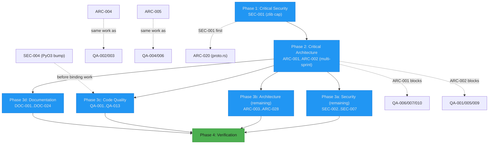

# Project Audit Report

> **Project**: par-term-emu-core-rust
> **Date**: 2026-06-15
> **Stack**: Rust (library + streaming server binary), Python 3.12+ via PyO3, WebSocket streaming (tokio + axum + tungstenite + rustls), protobuf, terminal graphics (Sixel/iTerm2/Kitty)
> **Audited by**: Claude Code Audit System (4 parallel expert agents)

---

## Executive Summary

The codebase is in **good health for its intended primary use case** — an embedded terminal-emulation core that a trusted TUI application drives over a local PTY. Engineering discipline is genuinely strong for an ~86k-line Rust library: `cargo check` is warning-clean, there are **zero `todo!`/`unimplemented!`**, ~25 real production `unwrap()`s (almost all in doc examples), 1698 passing Rust tests in ~1.4s, an exemplary CHANGELOG, and solid defense-in-depth in the parser and auth paths (constant-time secret comparison, zeroized credentials, private-key permission checks).

The two dominant concerns are **structural, not behavioral**. First, `Terminal` is a god object (~150 fields, 162 methods) and its Python mirror `PyTerminal` exposes 383 methods; together with ~155 duplicated methods between `PyTerminal` and `PyPtyTerminal`, this is the single largest source of maintenance cost and the root cause of most downstream findings. Second, the **standalone `par-term-streamer` binary ships with authentication disabled by default and no WebSocket Origin checking**, which — combined with an unbounded zlib-decompression path in the protobuf layer — makes a publicly-exposed deployment a remote unauthenticated shell + DoS vector.

The most immediately actionable items are small and high-leverage: cap the zlib decompression (one function), fix the **grossly inaccurate `docs/API_REFERENCE.md` Data Classes section** (documents dozens of properties that do not exist on the bindings), and correct the README's wrong default port (8080 vs the real 8099). The god-object decomposition and WS-handler consolidation are large, multi-sprint investments that should be planned, not rushed.

**Estimated effort to remediate top issues**: Phase 1 + Phase 3a security hardening ≈ 2–4 days; API_REFERENCE regeneration ≈ 1–2 days; the architectural decomposition (ARC-001/002) is a multi-sprint program.

### Issue Count by Severity

| Severity | Architecture | Security | Code Quality | Documentation | Total |
|----------|:-----------:|:--------:|:------------:|:-------------:|:-----:|
| 🔴 Critical | 2 | 1 | 0 | 4 | **7** |
| 🟠 High     | 9 | 3 | 3 | 6 | **21** |
| 🟡 Medium   | 10 | 3 | 6 | 9 | **28** |
| 🔵 Low      | 7 | 5 | 4 | 8 | **24** |
| **Total**   | **28** | **12** | **13** | **27** | **80** |

---

## 🔴 Critical Issues (Resolve Immediately)

### [SEC-001] Unbounded zlib decompression — zip-bomb DoS
- **Area**: Security
- **Location**: `src/streaming/proto.rs:104-122` (`decode_with_decompression`)
- **Description**: `decode_with_decompression` calls `ZlibDecoder::read_to_end(&mut decompressed)` with no size cap. A client can send a small compressed protobuf frame that expands into gigabytes. The WS acceptors (`accept_hdr_async` at `server.rs:1660,1769`) rely on tungstenite's 64 MiB default for the *compressed* frame, so each accepted frame can decompress ~unboundedly. `decode_client_message` runs on every inbound binary frame before client-specific validation.
- **Impact**: A single client (unauthenticated by default — see SEC-002) sending many small compressed frames each expanding to ~64 MiB can OOM-kill the streaming server. Remote DoS.
- **Remedy**: Cap decompressed output with a `MAX_DECOMPRESSED_SIZE` constant (e.g. 1 MiB); bail when exceeded. Also pass an explicit `WebSocketConfig { max_message_size, max_frame_size }` to the acceptors instead of relying on the 64 MiB default.

### [ARC-001] `Terminal` is a god object — ~150 fields, 162 methods, 20+ responsibility domains
- **Area**: Architecture
- **Location**: `src/terminal/mod.rs:223-572` (struct), `:587-2659` (impl)
- **Description**: One struct inlines state for grid, cursor, 16+ mode booleans, scroll regions, tab stops, keyboard protocol, parser state, 18 color/theme fields, 9 clipboard fields, 7 graphics fields, notifications, progress bars, hyperlinks, 6 event/observer fields, profiling, search, triggers, recording, macros, multiplexing, shell integration, badge/session vars, selection/bookmarks, mouse history, rendering hints, ACS charset, unicode config, dirty-row tracking, tmux control, and more. Every sequence handler can mutate any field because they all live on `&mut self`.
- **Impact**: Handlers are untestable in isolation (only `process()` integration tests possible); cohesion is effectively zero; merge-conflict and refactor risk scale with field count. Root cause of ARC-006/007/008/011/021, ARC-009, and downstream Code Quality findings on `mod.rs`.
- **Remedy**: Decompose into cohesive sub-structs behind private modules — `TerminalModes` (the ~16 booleans/enums), `ColorTheme` (18 fields + palette), `ClipboardState`, `EventBroker`, `ProfilingState`. Keep `Terminal` as a compositor holding ~20–30 fields. Mechanical, behavior-preserving; sequence to land before binding-layer refactors.

### [ARC-002] `PyTerminal` exposes 383 methods in one `#[pymethods]` block — Python-facing god object
- **Area**: Architecture
- **Location**: `src/python_bindings/terminal/mod.rs:22-5892` (5870-line single impl block)
- **Description**: One Python class bundles emulation, color, clipboard, progress bars, sixel/graphics, content/search/selection, dirty tracking, events/observers, notifications, shell integration, bookmarks, snapshots, multiplexing, triggers, recording/replay, benchmarking/compliance, file transfer, badges, semantic zones, image protocol, tmux control, screenshot, and static utilities — a flat 383-method namespace with no sub-object decomposition.
- **Impact**: Discoverability and autocomplete near zero; documentation unmanageable; violates SRP to the point the class cannot be reasoned about as a unit. Blocks QA-001 (the 155-method duplication with `PyPtyTerminal` cannot be cleanly resolved while the surface is this broad).
- **Remedy**: Expose cohesive sub-objects (`term.clipboard`, `term.colors`, `term.triggers`, `term.metrics`, …) as nested `#[pyclass]` fields. Breaking API change — gate behind a major version bump and/or provide a compatibility shim proxying flat methods to nested objects.

### [DOC-001] `API_REFERENCE.md` documents dozens of data-class properties that do not exist on the bindings
- **Area**: Documentation
- **Location**: `docs/API_REFERENCE.md` (Data Classes section) vs `src/python_bindings/types.rs`
- **Description**: Broad swath of the Data Classes section documents `#[pyo3(get)]` field names with no counterpart in the actual structs. Verified mismatches: `LineDiff` (docs: `row/old_text/new_text/changed`; actual: `change_type/old_row/new_row/old_content/new_content`); `SnapshotDiff` (docs: `changed_lines/cursor_moved/old_cursor/new_cursor`; actual: `diffs/added/removed/modified/unchanged` — none of the documented fields exist); `PerformanceMetrics` (docs: `total_frames/dropped_frames/avg_frame_time_ms/...`; actual: `frames_rendered/cells_updated/bytes_processed/...`). Similar drift on `ProfilingData`, `RenderingHint`, `SessionState`, `DetectedItem`, `ColorPalette`, `WindowLayout`, `BenchmarkResult`, `ClipboardSyncEvent`, `PaneState`, `MouseEvent`, `FrameTiming`, `RegexMatch`, etc.
- **Impact**: Any Python user reading the reference and writing against these names gets `AttributeError` at runtime. The single largest documentation defect.
- **Remedy**: Regenerate the Data Classes section directly from the `#[pyo3(get)]` field lists in `src/python_bindings/types.rs`. Add a CI check that diffs documented property tables against struct definitions.

### [DOC-002] `PtyTerminal.spawn_shell` documented with the wrong parameter
- **Area**: Documentation
- **Location**: `docs/API_REFERENCE.md:1039-1040`; binding `src/python_bindings/pty.rs:66-70`
- **Description**: Docs say `spawn_shell(shell: str | None = None)`. Actual signature is `spawn_shell(env: Option<HashMap<String,String>>, cwd: Option<String>)` — no `shell` parameter, and the real params (`env`, `cwd`) are undocumented. README:1233-1237 correctly shows `spawn_shell(env=..., cwd=...)`, so the reference contradicts the README.
- **Impact**: `term.spawn_shell("/bin/zsh")` raises `TypeError`.
- **Remedy**: Replace documented signature with `spawn_shell(env: dict[str, str] | None = None, cwd: str | None = None)`.

### [DOC-003] `Terminal.set_selection` documented with wrong parameter shape
- **Area**: Documentation
- **Location**: `docs/API_REFERENCE.md:896`; binding `src/python_bindings/terminal/mod.rs:3137`
- **Description**: Docs document four integers `(start_col, start_row, end_col, end_row, mode="character")`. The binding takes two tuples: `(start: (usize, usize), end: (usize, usize), mode)`.
- **Impact**: `set_selection(0, 0, 10, 5)` fails at runtime.
- **Remedy**: Update to `set_selection(start: tuple[int, int], end: tuple[int, int], mode: str = "character")`.

### [DOC-004] `ScreenSnapshot` documents three methods that do not exist on the binding
- **Area**: Documentation
- **Location**: `docs/API_REFERENCE.md:1230-1233`; binding `src/python_bindings/types.rs:176-219`
- **Description**: Docs list `content()`, `cursor_position()`, `size()` methods. The actual `PyScreenSnapshot` exposes these as properties (`lines`, `cursor_pos`, `size`) plus a `get_line(row)` method — no callable `content()`/`cursor_position()`/`size()`.
- **Impact**: `snapshot.content()` raises `AttributeError`.
- **Remedy**: Document the actual `#[pyo3(get)]` properties and `get_line()`.

---

## 🟠 High Priority Issues

### Architecture

- **[ARC-003] ~130–155 methods duplicated between `PyTerminal` and `PyPtyTerminal`** — `src/python_bindings/terminal/mod.rs` vs `src/python_bindings/pty.rs`. `screenshot()` ~88 lines duplicated; `create_snapshot` 60 vs 124 lines; `PyAttributes` struct literals hand-written at 8 sites despite an existing `From<&Cell>` impl. ~2000 LOC of duplicated logic; fixes must be applied twice; drift is inevitable. **Remedy**: use `PyAttributes::from(&cell)` at all sites; extract a shared trait/macro generating locked + unlocked variants from one definition.

- **[ARC-004] Three near-identical WebSocket connection handlers** — `src/streaming/server.rs:1845` (`handle_connection_ws`), `:2241` (`handle_tls_connection_ws`), `:2633` (`handle_axum_websocket`). Three 300–400 line `tokio::select!` loops with near-identical dispatch; only the I/O abstraction differs. `server.rs` (4026 LOC) bundles 9+ responsibilities. ~800 lines duplicated; new message types require 3 edits. **Remedy**: extract a `ConnectionTransport` trait + one `run_session(stream, params, server)`; split `server.rs` into `tls.rs`/`auth.rs`/`session.rs`/`config.rs`. (Same work as QA-002/QA-003.)

- **[ARC-005] `Cell` carries `Vec<char>` for combining marks, blocking `Copy`** — `src/cell.rs:205`; hot paths `src/grid/scroll.rs`, `src/grid/edit.rs`. Every Cell (44–56 bytes) carries a 24-byte `Vec` header though >99% of cells have empty combining. Because Cell isn't `Copy`, every scroll clones the whole visible grid; reflow builds a temp `Vec<Vec<Cell>>` (up to 800k clones for 10k×80 scrollback). The largest perf issue in the grid subsystem. **Remedy**: `SmallVec<[char; 4]>` makes Cell `Copy` for the common case; independently shippable — recommend early as a standalone PR.

- **[ARC-006] Unbounded `terminal_events` Vec drained by 6 competing `poll_*` methods** — `src/terminal/mod.rs:418` (field), `:2398/2421/2477/2497/2515/2544` (six `std::mem::take` drains). Grows without bound if Python never polls (millions of entries under sustained output); 6 typed polls each take the whole Vec, filter, and replace — O(n·m). Confusing semantics; increased mutex hold time. **Remedy**: cap with oldest-eviction; replace 6 typed polls with one `poll_events()` + pure filter helpers; consider a bounded `crossbeam` channel.

- **[ARC-007] Synchronous observer/trigger callbacks invoked under the Terminal mutex** — `src/terminal/mod.rs:2249-2285` (`dispatch_events`, under lock via `src/pty_session.rs:654-656`). Slow observers block the reader and every query; a panicking observer leaves Terminal inconsistent (`parking_lot` doesn't poison — silently unlocks, re-firing events). The `src/observer.rs:1-5` doc claiming dispatch happens "after `process()` returns … no Terminal state borrowed" is misleading. **Remedy**: collect events locally during `process()`, release lock, then dispatch; or `catch_unwind` observer calls; fix the doc comment. Blocks any new observer event-type work.

- **[ARC-008] Per-call Vec allocation in the `process()` hot path** — `src/terminal/mod.rs:2131-2200` (`filter_apc_and_advance`, called from `process()` at :2240). Every `process()` call allocates `passthrough` and `completed_payloads` Vecs even when there is zero APC (Kitty) content — the overwhelmingly common case, hundreds of times/sec. **Remedy**: promote `passthrough` to a reusable field; skip `completed_payloads` when no APC start byte is detected; operate in-place.

- **[ARC-009] Coarse-grained single mutex around the entire Terminal** — `src/pty_session.rs:28` (`Arc<Mutex<Terminal>>`), `:653-756` (lock hold span). The reader thread holds one lock for the entire `process()` call (parse + mutate + scrollback + graphics decode + trigger scan + observer dispatch) plus device writes plus SIGWINCH. Every Python query and every streaming client handler spin-waits. Latency spikes under load. **Remedy**: downstream of ARC-001 — once Terminal is decomposed, split into finer locks (grid/metadata/events) or `RwLock`, or copy-on-write snapshots for readers. Do not regress the documented GIL-vs-mutex invariant.

- **[ARC-010] `Cell` and `TerminalGraphic` memory-layout waste** — `src/cell.rs:43-51,201-217`, `src/graphics/mod.rs:223-266`. `CellFlags` duplicates encoding (a `CellBitflags(u16)` **and** separate `underline_style` + `Option<u32> hyperlink_id` on every Cell); 12 boolean getters are pure boilerplate. `TerminalGraphic` is a "Christmas tree" — 9 Kitty-specific `Option` fields inlined into the "unified" type, all `None` for iTerm2/Sixel. **Remedy**: `Option<NonZeroU32>` for hyperlink_id (niche-opt `None` free); group the 9 Kitty fields into `Option<KittyGraphicMeta>`.

### Security

- **[SEC-002] Streaming server ships with authentication disabled by default** — `src/streaming/server.rs:340-363` (`StreamingConfig::default`), `src/python_bindings/streaming.rs:36` (default `api_key=None`). With no `api_key`/`http_basic_auth` (the default), auth middleware is skipped (`server.rs:1520,1580`) and WS-handshake auth only runs `if (ws_api_key.is_some() || ws_basic_auth.is_some())`. The `par-term-streamer` binary accepts connections and PTY input from unauthenticated clients by default — a PTY running an arbitrary shell, reachable by anyone who can hit the port. **Remedy**: legitimate for the embedded-library use case, but the standalone binary should require an auth token at startup or bind `127.0.0.1` by default and warn loudly when binding a public interface without auth. Document the threat model prominently (see DOC-008).

- **[SEC-003] Known-vulnerable dependency chain via `htpasswd-verify`** — `Cargo.toml:96`. `cargo audit` reports 5 advisories (3 vulns, 2 unmaintained) rooted in `htpasswd-verify 0.3.0` → `rust-crypto` (AES miscomputation RUSTSEC-2022-0011, no fix), `rustc-serialize` (stack overflow on nested JSON RUSTSEC-2022-0004), `time 0.1.45` (segfault RUSTSEC-2020-0071), `gcc 0.3.55`. Reachable when `streaming`+`http_basic_auth` is used. **Remedy**: replace `htpasswd-verify` with maintained crates (`bcrypt`, `apache-htpasswd`, or roll apr1/sha1/md5crypt directly). The `HttpBasicAuthConfig::verify` is the only consumer (`server.rs:274-292`).

- **[SEC-004] PyO3 0.28.3 has two recent security advisories** — `Cargo.toml:50`. RUSTSEC-2026-0176 (OOB read in `nth`/`nth_back` for `PyList`/`PyTuple` iterators) and RUSTSEC-2026-0177 (missing `Sync` bound on `PyCFunction::new_closure` closures). Fix in `>=0.29.0`. **Remedy**: upgrade PyO3 to `>=0.29.0` (breaking version bump for all of `src/python_bindings/*` — coordinate; sequence after unrelated binding PRs merge).

### Code Quality

- **[QA-001] 155 duplicate method names between `PyTerminal` and `PyPtyTerminal`** — `src/python_bindings/terminal/mod.rs` (386 fns) and `src/python_bindings/pty.rs` (247 fns); 155-name overlap. The two must be kept in lockstep; drift is nearly guaranteed on every PR. The largest single source of maintenance cost. **Remedy**: extract `trait PyTerminalCommon` + `fn term(&self) -> &Terminal` so read-only/config methods live in one block applied to both; PTY-only methods (spawn/resize/wait) stay on `PyPtyTerminal`. (Resolution depends on ARC-001/002 landing first.)

- **[QA-002] Three near-identical WebSocket handler functions (1800–2600 lines each)** — `src/streaming/server.rs:1845/2241/2633`. Same lifecycle copy-pasted for plain-WS/TLS-WS/axum-WS; `handle_connection_ws` alone has 209 branch/loop statements. Untestable; protocol changes applied 3×. **Remedy**: extract `async fn run_session(stream: impl AsyncRead+AsyncWrite, params, server)`; the three entry points collapse to ~30 lines each. (Same work as ARC-004.)

- **[QA-003] `Ok::<_, ()>(x.lock())` dead-branch anti-pattern (12 sites)** — `src/streaming/server.rs:1936/1959/1999/2025/2046/2182` + ~6 more. `parking_lot::Mutex::lock()` cannot fail, but the code wraps it in `Ok::<_, ()>(…)` to fit `if let Ok`, creating dead `Err` branches that read as if locking can fail. **Remedy**: replace with `let mut w = writer.lock(); …` and drop the wrapper. Do alongside QA-002 (same file/functions).

### Documentation

- **[DOC-005] README points users at the wrong default port (8080 vs 8099)** — `README.md:1391` ("default: ws://127.0.0.1:8080") and `README.md:832` ("http://127.0.0.1:8099") — self-contradicting. The real default is `8099` (`src/bin/streaming_server.rs:364`, Makefile, CLAUDE.md). `src/bin/streaming_server.rs:21,30` module rustdoc also uses 8080; `Makefile:355` echoes `ws://localhost:8080`. **Remedy**: change every `8080` → `8099` in README.md, `src/bin/streaming_server.rs` module doc, and Makefile.

- **[DOC-006] `Terminal.search()` case-sensitivity default disagrees with docs** — `docs/API_REFERENCE.md` Content Search; binding `src/python_bindings/terminal/mod.rs:2978-2979`. `search()` defaults `case_sensitive=false`; `find_text()` defaults `case_sensitive=true`. Docs don't call out the difference and don't list `search()`. **Remedy**: document both with true defaults; add `search()` to the section.

- **[DOC-007] `Attributes` data class missing four fields from docs** — `docs/API_REFERENCE.md:1149-1161`; binding `src/python_bindings/types.rs:22-50`. Docs list 8 properties; struct exposes 12 — `underline_style`, `wide_char`, `wide_char_spacer`, `hyperlink_id` undocumented. **Remedy**: add the four.

- **[DOC-008] `SECURITY.md` has zero coverage of the network attack surface** — `docs/SECURITY.md` (entire file). PTY-only; no mention of TLS, `--tls-cert`/`--tls-key`/`--tls-pem`, rustls, the API-key auth model, HTTP Basic Auth, or the implications of exposing an interactive shell over WebSocket. STREAMING.md:1657-1715 has Security Considerations but SECURITY.md never cross-references it; README:1503 bills SECURITY.md as comprehensive. **Remedy**: add a streaming/TLS section or a prominent cross-reference; tie to SEC-002's threat-model documentation.

- **[DOC-012] README pins stale Rust dependency version (`0.10`) in feature-flags table** — `README.md:1097-1100,1112-1113,1422-1423`. "Using as a Rust Library" tells users `version = "0.10"`; current release is 0.42.4. Web-frontend download URLs reference `par-term-web-frontend-v0.10.0.tar.gz`, which 404s. **Remedy**: replace literal pins with "see the package manifest" or `version = "0.42"`; point the tarball at `latest`.

- **[DOC-013] README understates the Rust toolchain requirement** — `README.md:1072,1475`. Says "Rust 1.75+"; `Cargo.toml` declares `rust-version = "1.88"`; `docs/BUILDING.md:38` correctly says 1.88+. **Remedy**: change to "Rust 1.88+".

- **[DOC-018] `STREAMING.md` env-var table missing 11 of 35 `PAR_TERM_*` variables** — `docs/STREAMING.md:246-297` vs `src/bin/streaming_server.rs`. Missing `PAR_TERM_SCROLLBACK`, `PAR_TERM_SHELL`, `PAR_TERM_COMMAND`, `PAR_TERM_VERBOSE`, `PAR_TERM_KEEPALIVE`, `PAR_TERM_MAX_CLIENTS`, `PAR_TERM_USE_TTY_SIZE`, `PAR_TERM_NO_RESTART_SHELL`, `PAR_TERM_DOWNLOAD_FRONTEND`, `PAR_TERM_FRONTEND_VERSION`, `PAR_TERM_MACRO_FILE`, `PAR_TERM_MACRO_SPEED`, `PAR_TERM_MACRO_LOOP`; corresponding CLI flags (`--shell`, `--scrollback`, `--keepalive`, `--max-clients`, `--verbose`/`-v`, `--use-tty-size`, `--preset`, `--frontend-version`) also undocumented. **Remedy**: regenerate the env-var and CLI tables from the `clap` `#[arg(... env = "...")]` definitions.

---

## 🟡 Medium Priority Issues

### Architecture
- **[ARC-011]** `poll_subscribed_events` duplicates the 25-arm `TerminalEvent::kind()` match (`mod.rs:2419-2473` vs `event.rs:215-243`). Call `e.kind()`.
- **[ARC-012]** `Cell`/`Grid` fields `pub(crate)` with no encapsulation; every grid submodule mutates fields directly (`grid/mod.rs:20-42`). Make fields private; expose needed methods via `pub(super)`.
- **[ARC-013]** 142 inline `PyErr::new_err` constructions with no centralized error mapping (`python_bindings/terminal/mod.rs`). Define `From<DomainError> for PyErr` per error enum; use `?`.
- **[ARC-014]** 55 `PyXxx` data classes are ~90% hand-written boilerplate (`python_bindings/types.rs`, 4169 LOC). Derive via proc-macro/`FromPyObject`.
- **[ARC-015]** `streaming` mega-feature pulls 6 binary-only deps (`clap`, `anyhow`, `tracing`, `tracing-subscriber`, `reqwest`, `tar`) into the library feature (`Cargo.toml:135`). Move behind `streaming-bin`; add sub-features (`streaming-tls`, `streaming-auth`, `streaming-sysinfo`).
- **[ARC-016]** Latent reentrant-GIL deadlock risk in `PyCallbackObserver` (`python_bindings/observer.rs:311-319`). Add a `thread_local!` reentrancy guard or use `pyo3::allow_threads`.
- **[ARC-017]** `glyph_cache` evicts all entries at 10,000 (nuclear, not LRU) (`screenshot/font_cache.rs:590-592`). Use `lru::LruCache`.
- **[ARC-018]** Reader thread silently detaches on 2-second Drop timeout (`pty_session.rs:1286-1309`). Use a cancellation token; force-close the PTY master fd.
- **[ARC-019]** Coprocess output buffer uses `Vec::remove(0)` (O(n) per line) at capacity (`coprocess.rs:171-172`). Use `VecDeque`.
- **[ARC-020]** `proto.rs` conversion layer ~1800 LOC of field-by-field conversion; `TerminalEvent → ServerMessage` dispatch duplicated 3× (`server.rs`, `bin/streaming_server.rs:673-905,1221-1528`); `build.rs` regenerates to `$OUT_DIR` (silent staleness risk for checked-in `terminal.pb.rs`). Extract one dispatch fn; add a build-time proto-staleness check.

### Security
- **[SEC-005]** No WebSocket Origin / CORS validation (`streaming/server.rs` all WS accept paths; no `tower-http` CORS layer). A malicious web page can drive the PTY via `ws://localhost`. Add an allowed-origins allowlist in the handshake callback and a `CorsLayer` for HTTP routes.
- **[SEC-006]** `rustls-pemfile` unmaintained (RUSTSEC-2025-0134) (`Cargo.toml:92`). Migrate to `pemfile` or rustls's built-in `pem_loader`.
- **[SEC-007]** `paste` unmaintained (RUSTSEC-2024-0436) (transitive build-time). Track upstream; no runtime impact.

### Code Quality
- **[QA-004]** `Cell` cannot be `Copy` due to `Vec<char> combining` (`cell.rs:200-219`); `get_grapheme()` allocates a fresh `String` per cell. Same root as ARC-005. Cap combining at fixed size.
- **[QA-005]** `screenshot`/`screenshot_to_file` take 17–19 positional params, suppressed with `#[allow(clippy::too_many_arguments)]` and duplicated across 4 signatures (`python_bindings/terminal/mod.rs:140/~210`, `python_bindings/pty.rs:327/447`). Accept a `ScreenshotOptions` dict/kwargs (expose the existing `ScreenshotConfig`).
- **[QA-006]** `cells_to_text`/`row_text` allocate a `Vec<String>` per row (`terminal/mod.rs:174`, `grid/mod.rs:123`). Write directly into one `String`; add `Cell::push_grapheme(&self, buf)`.
- **[QA-007]** `html_escape` allocates a `String` per char (`terminal/mod.rs:189-200`, same in `screenshot/formats/svg.rs:179`). Pre-size a `String`, `push_str`/`push`.
- **[QA-008]** 99 `.clone()` in `python_bindings/types.rs` (+75 in `terminal/mod.rs`, +13 in `pty.rs`). Audit for moves (`String::into`/`Vec::into`) where Rust no longer needs ownership.
- **[QA-009]** Error mapping inconsistent — ~178 inline `Py*Error::new_err` with no typed hierarchy; only ~37 `map_err`. Define per-domain `PtyError`/`TerminalError` Python classes + `From<RustError> for PyErr`.

### Documentation
- **[DOC-009]** Multiple enumeration types missing from API_REFERENCE Enumerations section (`MouseEncoding`, `UnicodeVersion`, `AmbiguousWidth`, `WidthConfig`, `NormalizationForm`). Add entries with variants.
- **[DOC-010]** Wrong type annotations on several getters (`default_fg`/`default_bg`/`cursor_color` return `(u8,u8,u8)` not `| None`; `ColorHSL`/`ColorHSV` fields are `f32` not `int`; `MouseEvent.button` is `String` not `int`; `get_line_cells` returns `[]` not `None`). Correct the annotations.
- **[DOC-011]** `TmuxNotification` underdocumented — docs list 2 properties; binding exposes 19 (`types.rs:600-678`).
- **[DOC-014]** README self-contradicting port references (folded into DOC-005; call out the 832 vs 1391 conflict).
- **[DOC-015]** Web-frontend tarball `par-term-web-frontend-v0.10.0.tar.gz` 404s (folded into DOC-012).
- **[DOC-019]** STREAMING.md architecture diagram says "JSON Messages" but wire format is protobuf (`docs/STREAMING.md:102`). Change label to "Protobuf (binary)".
- **[DOC-020]** `ARCHITECTURE.md:163-189` omits `apc_filter.rs` and `badge.rs` from the Terminal submodule list.
- **[DOC-021]** `ARCHITECTURE.md:660-666` embeds hard-coded, stale test counts (1,652 / 552 / 2,204). Replace with a runnable command.
- **[DOC-022]** `BUILDING.md:209` documents the `cargo test` workaround but doesn't lead with the "never `cargo build`; use `make dev`" warning that CLAUDE.md/ARCHITECTURE.md emphasize. Add a callout near the top.

---

## 🔵 Low Priority / Improvements

### Architecture
- **[ARC-021]** `perform.rs` impls `vte::Perform` directly on `Terminal` — no action/command type to queue/replay/test in isolation. Introduce a `TerminalAction` enum (large; defer until ARC-001 underway).
- **[ARC-022]** Screenshot renderer hardcodes iTerm2 P3 color-space conversion + 1.4× brightness boost for all screenshots (`screenshot/renderer.rs:237-246`). Put behind a `ScreenshotConfig` flag.
- **[ARC-023]** `pyproject.toml` targets pyright `pythonVersion = "3.14"` while `requires-python >= 3.12`. Align.
- **[ARC-024]** Makefile lacks a dedicated `typecheck` target and an explicit `clippy` target.
- **[ARC-025]** Duplicated `emit_style` SGR closure (~78 lines) in `grid/export.rs:100-178` and `:257-335`. Extract a shared helper.
- **[ARC-026]** `Grid::scrollback` circular-buffer logic hand-rolled in multiple places and rebuilt fresh on resize. Centralize.
- **[ARC-027]** Three snapshot files confusingly named (`terminal_snapshot.rs` vs `snapshot.rs` vs `snapshot_manager.rs`); separation is sound — rename for clarity.
- **[ARC-028]** 34 `#[getter]`/`#[setter]` boilerplate pairs for `StreamingConfig` fields (`python_bindings/streaming.rs`). Candidate for a derive macro.

### Security
- **[SEC-008]** `unsafe` in `bin/streaming_server.rs:109-113` (`TIOCGWINSZ` ioctl) — read-only, well-defined, safe. No TIOCSTI anywhere. (Hardening note only.)
- **[SEC-009]** Manual `unsafe impl Send/Sync` on FFI vtable (`ffi.rs:295-296`) and PyO3 observers (`observer.rs:308-309,343-344`) — documented and standard; re-audit if callback signatures change.
- **[SEC-010]** `libc::kill` with negative PID (process-group signaling) (`pty_session.rs:735,889,909,999`) — correct; `pid` from a process this code spawned. No injection.
- **[SEC-011]** Coprocess `cwd` validation weak but defense-in-depth adequate (`coprocess.rs:226-262`); metacharacter denylist + `..` rejection present.
- **[SEC-012]** Verbose Info-level logging of client source addresses (`server.rs`). Operator awareness note.

### Code Quality
- **[QA-010]** `get_dirty_region` does two passes with `.unwrap()` that are guarded but read as panic-bait (`terminal/mod.rs:2329-2330`). Use `minmax()` single pass.
- **[QA-011]** 33 `#[allow(clippy::…)]` suppressions, mostly `too_many_arguments`/`type_complexity`. Introduce typed wrappers/aliases; most collapse once QA-005 and ARC-020 land.
- **[QA-012]** `MAX_OSC_DATA_LENGTH` of 128 MB is generous but documented (`sequences/osc/mod.rs:17`). Informational; optionally make configurable.
- **[QA-013]** `bin/streaming_server.rs` is 2430 lines — split into `cli.rs`/`server.rs`/`tls.rs` within `src/bin/`. Optional.

### Documentation
- **[DOC-016]** README "What's New" is ~700 lines and grows every release (`README.md:16-939`). Archive older entries to CHANGELOG.md.
- **[DOC-017]** README:1473-1480 Technology list says "Rust (1.75+)" — update to 1.88+.
- **[DOC-023]** No `CONTRIBUTING.md` anywhere. Add one covering dev setup, `make checkall`, the version-sync rule, the Rust↔Python binding-sync rule, and the PR workflow.
- **[DOC-024]** `src/pty_session.rs` (a core file) lacks module-level `//!` rustdoc. Add orientation comment.

---

## Detailed Findings

### Architecture & Design
The architecture audit found the crate well-factored in some subsystems and acutely god-objected in others. **The streaming protocol layering is the best-factored subsystem** — `protocol.rs` (serde-tagged app types) → `proto.rs` (conversion) → `terminal.pb.rs` (prost wire types) keeps prost types out of the domain layer. `tmux_control.rs` is a pure parser with zero coupling to Terminal internals. Ownership is clean: no `Rc<RefCell<>>`, no circular references. `parking_lot::Mutex` is the right choice. Feature-flag design mostly cleanly separates the three artifacts (cdylib/rlib/binary), and the pre-generated checked-in protobuf avoids a `protoc` build dependency.

The counterweight is two god objects — `Terminal` (ARC-001, ~150 fields) and `PyTerminal` (ARC-002, 383 methods) — that concentrate state and surface area to the point of untestability, and which spawn most of the High findings (ARC-003/004/005/006/007/008/009/010). The grid `Cell` carrying a `Vec<char>` (ARC-005) is the dominant grid perf issue and is independently shippable. Correction applied during synthesis: an initial sub-finding claimed Sixel was an unimplemented ghost variant; verified false — Sixel is fully implemented in top-level `src/sixel.rs` (227 LOC) wired through `src/terminal/sequences/dcs/sixel.rs`. The unified graphics store architecture is sound.

### Security Assessment
The security posture is **good for the embedded-library use case** (a trusted TUI app driving a local PTY) and **fair for the standalone streaming server** deployed without auth on a reachable interface. Strengths are notable: constant-time secret comparison everywhere auth matters (`subtle::ConstantTimeEq`), credentials zeroized on drop, private-key file permissions checked on Unix (mode ≤ 0o600), TLS verification never disabled, input rate limiting consistently applied across all three WS input paths, read-only-client enforcement before PTY writes, terminal-size server-side validation, file transfers capped in memory (50 MiB) with no path-traversal filesystem writes, coprocess spawning rejecting shell metacharacters/`..`/invalid env names, and no hardcoded secrets in source/config (only test fixtures/doc examples).

The real risks concentrate in the server component: SEC-001 (unbounded zlib — the only Critical), SEC-002 (default-off auth), SEC-003 (htpasswd-verify vulnerable chain), and SEC-004 (PyO3 advisories). The `cargo audit` findings are accurate and worth acting on.

### Code Quality
Overall code health is **good**. Exceptional discipline for an ~86k-line Rust library: `cargo check` warning-clean, zero `todo!`/`unimplemented!`, ~25 real production `unwrap()`s (almost all in doc examples), 1698 passing Rust tests in ~1.38s, and well-factored sequence dispatch (CSI/OSC/DCS/ESC each have flat top-level matches delegating to focused submodules). Zero real TODO/FIXME/HACK/XXX (grep hits are false positives in test data). Production unwrap discipline means panics cannot escape the FFI boundary under normal operation.

The dominant costs are the PyTerminal/PyPtyTerminal 155-method duplication (QA-001, same root as ARC-003) and the three ~2000-line WS handlers (QA-002, same as ARC-004), both of which compound on every feature addition. Secondary: per-row/per-char allocation in the text-extraction hot path (QA-006/007), the 99-clone binding layer (QA-008), and inconsistent error mapping (QA-009). 48 files exceed 500 LOC; 20 exceed 1000.

### Documentation Review
Documentation health is **fair** — strong CHANGELOG and architecture docs, but `docs/API_REFERENCE.md` is broadly inaccurate (DOC-001 is Critical) and the README has multiple stale version/port references that will trip new users immediately. CHANGELOG.md is exemplary (70 dated entries, Keep a Changelog, current through 0.42.4 with the `fetch_add(1)` fix verifiable in the PTY reader). Version sync across the three manifests is perfect. STREAMING.md's TLS section (1550-1646) is thorough; CONFIG_REFERENCE.md is genuinely comprehensive (843 lines). Module-level `//!` rustdoc is present in ~96/100 source files.

The most impactful gap: API_REFERENCE.md documents dozens of data-class properties and at least two method signatures (`spawn_shell`, `set_selection`) that do not match the bindings — any Python user coding against the reference will hit runtime errors. Regenerating the Data Classes section from `#[pyo3(get)]` fields is the highest-leverage documentation fix.

---

## Remediation Roadmap

### Immediate Actions (Before Next Deployment)
1. **SEC-001** — Cap zlib decompression in `src/streaming/proto.rs` and set explicit WS `max_message_size`/`max_frame_size`.
2. **SEC-002** — Make `par-term-streamer` require an auth token or bind `127.0.0.1` by default; warn on public bind without auth.
3. **DOC-001 / DOC-002 / DOC-003 / DOC-004** — Regenerate the inaccurate API_REFERENCE.md Data Classes + fix `spawn_shell`/`set_selection`/`ScreenSnapshot`.
4. **DOC-005** — Fix the wrong default port (8080 → 8099) across README, module rustdoc, Makefile.

### Short-term (Next 1–2 Sprints)
1. **SEC-003 / SEC-004 / SEC-006** — Swap `htpasswd-verify`, upgrade PyO3 to ≥0.29, migrate off `rustls-pemfile`.
2. **SEC-005** — Add WS Origin allowlist + CORS layer.
3. **ARC-005 / QA-004 / QA-006** — Ship `Cell` SmallVec refactor + `row_text`/`cells_to_text` allocation fix as a standalone perf PR.
4. **ARC-007 / ARC-008 / ARC-006** — Defer observer dispatch out of the lock; reuse the `process()` passthrough buffer; cap `terminal_events`.
5. **ARC-004 / QA-002 / QA-003** — Collapse the three WS handlers into one `run_session`; remove `Ok::<_, ()>` dead branches.
6. **DOC-018 / DOC-008 / DOC-023** — Regenerate STREAMING.md env/CLI tables; add SECURITY.md network section; add CONTRIBUTING.md.

### Long-term (Backlog)
1. **ARC-001 / ARC-002** — Decompose `Terminal` (~150 fields) and `PyTerminal` (383 methods) into cohesive sub-structs/sub-objects. Multi-sprint program; gate everything downstream.
2. **ARC-003 / QA-001** — Resolve the 155-method PyTerminal/PyPtyTerminal duplication via a shared trait (after ARC-001/002).
3. **ARC-009** — Split the coarse Terminal mutex into finer locks / copy-on-write snapshots (after ARC-001).
4. **ARC-013 / ARC-014 / ARC-020 / QA-009** — Centralize error mapping; derive PyXxx wrappers; extract the duplicated TerminalEvent dispatch; add proto-staleness build check.
5. **ARC-021** — Introduce a `TerminalAction` enum to separate parsing from state mutation (large; defer until ARC-001 underway).

---

## Positive Highlights

1. **Exceptional lint and panic discipline** — `cargo check` is warning-clean, zero `todo!`/`unimplemented!`, and only ~25 real production `unwrap()`s across the whole library, almost all in doc examples. Panics cannot escape the FFI boundary.
2. **Comprehensive, fast Rust test suite** — 1698 tests passing in ~1.4s, with dedicated modules for terminal/grid/sequences/PTY; the generation-counter fix in 0.42.4 is verifiable in the reader thread.
3. **Exemplary CHANGELOG** — 70 dated Keep-a-Changelog entries with issue/PR links, breaking changes clearly marked, current through 0.42.4.
4. **Perfect version sync** across `Cargo.toml`, `pyproject.toml`, and `python/.../__init__.py` (all 0.42.4) — the CLAUDE.md sync rule is being honored at release time.
5. **Strong defense-in-depth in the parser and auth paths** — constant-time secret comparison, zeroized credentials, Unix key-permission checks, TLS verification never disabled, OSC size cap + insecure-OSC filtering, coprocess metacharacter/`..`/env-name validation, no path-traversal filesystem writes from graphics protocols.
6. **Clean streaming protocol layering** — protocol.rs → proto.rs → terminal.pb.rs keeps prost out of the domain layer; pre-generated checked-in protobuf removes a build dependency.
7. **Sound graphics-store architecture** — cells hold placeholder U+10EEEE diacritics into a separate `GraphicsStore`; Sixel/iTerm2/Kitty all normalized to `TerminalGraphic` with RGBA; Sixel fully implemented (`src/sixel.rs`), not a ghost variant.
8. **Well-factored sequence dispatch** — CSI/OSC/DCS/ESC each have a flat top-level match delegating to focused submodules, keeping the dispatch readable.

---

## Audit Confidence

| Area | Files Reviewed | Confidence |
|------|---------------|-----------|
| Architecture | 27 (key files incl. `terminal/mod.rs`, all python_bindings, streaming/server.rs, grid/, cell.rs, Cargo.toml) + graphify-out/GRAPH_REPORT.md | High |
| Security | 10+ security-critical files + `cargo audit` + Cargo.lock + git log | High |
| Code Quality | 30+ files (largest-first sweep), test runs (1698 passing), grep quantification | High |
| Documentation | All docs/ + README + CHANGELOG + sampled docstrings vs bindings cross-check | High |

*All four areas reviewed with High confidence. The Code Quality agent's initial pass hit a transient rate-limit and was re-run successfully; findings were cross-checked against the Architecture agent's overlapping structural analysis.*

---

## Remediation Plan

> This section is generated by the audit and consumed directly by `/fix-audit`.
> It pre-computes phase assignments and file conflicts so the fix orchestrator
> can proceed without re-analyzing the codebase.

### Phase Assignments

#### Phase 1 — Critical Security (Sequential, Blocking)
<!-- Issues that must be fixed before anything else. -->
| ID | Title | File(s) | Severity |
|----|-------|---------|----------|
| SEC-001 | Unbounded zlib decompression (zip-bomb DoS) | `src/streaming/proto.rs`, `src/streaming/server.rs` | Critical |

#### Phase 2 — Critical Architecture (Sequential, Blocking)
<!-- Issues that restructure the codebase; must complete before Code Quality fixes that depend on them.
     NOTE: ARC-001/ARC-002 are multi-sprint programs. Within /fix-audit, treat as a gated planning
     track: downstream binding work (QA-001) must NOT start until the god-object decomposition lands. -->
| ID | Title | File(s) | Severity | Blocks |
|----|-------|---------|----------|--------|
| ARC-001 | Decompose `Terminal` god object (~150 fields) | `src/terminal/mod.rs`, `src/terminal/event.rs`, `src/terminal/perform.rs` | Critical | QA-006, QA-007, QA-010, ARC-006, ARC-008, ARC-011, ARC-021, ARC-009 |
| ARC-002 | Decompose `PyTerminal` god object (383 methods) | `src/python_bindings/terminal/mod.rs`, `src/python_bindings/pty.rs`, `src/python_bindings/types.rs` | Critical | QA-001, QA-005, ARC-003, ARC-013, ARC-014 |

#### Phase 3 — Parallel Execution
<!-- All remaining work, safe to run concurrently by domain.
     Cross-domain file conflicts are tracked in the File Conflict Map below;
     fix agents MUST read current file state before editing (a prior agent may have changed it). -->

**3a — Security (remaining)**
| ID | Title | File(s) | Severity |
|----|-------|---------|----------|
| SEC-002 | Default-off streaming auth + harden standalone binary | `src/streaming/server.rs`, `src/bin/streaming_server.rs`, `src/python_bindings/streaming.rs` | High |
| SEC-003 | Replace vulnerable `htpasswd-verify` chain | `Cargo.toml`, `src/streaming/server.rs` | High |
| SEC-004 | Upgrade PyO3 ≥0.29.0 (advisories) | `Cargo.toml`, `src/python_bindings/*` | High |
| SEC-005 | WebSocket Origin/CORS validation | `src/streaming/server.rs` | Medium |
| SEC-006 | Migrate off unmaintained `rustls-pemfile` | `Cargo.toml`, `src/streaming/server.rs` | Medium |
| SEC-007 | Track unmaintained `paste` (transitive) | `Cargo.toml` | Low |

**3b — Architecture (remaining)**
| ID | Title | File(s) | Severity |
|----|-------|---------|----------|
| ARC-003 | Resolve ~155 duplicated PyTerminal/PyPtyTerminal methods | `src/python_bindings/terminal/mod.rs`, `src/python_bindings/pty.rs`, `src/python_bindings/types.rs` | High |
| ARC-004 | Collapse 3 near-identical WS handlers | `src/streaming/server.rs`, `src/bin/streaming_server.rs` | High |
| ARC-005 | `Cell` `Vec<char>` → SmallVec (make Copy) | `src/cell.rs`, `src/grid/scroll.rs`, `src/grid/edit.rs`, `src/grid/mod.rs` | High |
| ARC-006 | Cap `terminal_events` + collapse 6 poll methods | `src/terminal/mod.rs` | High |
| ARC-007 | Defer observer/trigger dispatch out of the mutex | `src/terminal/mod.rs`, `src/pty_session.rs`, `src/terminal/trigger.rs` | High |
| ARC-008 | Reuse `process()` passthrough buffer (no per-call alloc) | `src/terminal/mod.rs` | High |
| ARC-009 | Split coarse Terminal mutex | `src/pty_session.rs`, `src/terminal/mod.rs` | High |
| ARC-010 | Pack `Cell` hyperlink_id + group Kitty graphic fields | `src/cell.rs`, `src/graphics/mod.rs` | High |
| ARC-011..ARC-028 | (Medium/Low) see Detailed Findings | various | Med/Low |

**3c — Code Quality (all)**
| ID | Title | File(s) | Severity |
|----|-------|---------|----------|
| QA-001 | Extract `PyTerminalCommon` trait (155 dup methods) | `src/python_bindings/terminal/mod.rs`, `src/python_bindings/pty.rs` | High |
| QA-002 | Collapse 3 WS handlers into `run_session` | `src/streaming/server.rs` | High |
| QA-003 | Remove `Ok::<_, ()>(x.lock())` dead branches (12 sites) | `src/streaming/server.rs` | High |
| QA-004 | `Cell` → Copy (SmallVec combining) | `src/cell.rs`, `src/grid/mod.rs`, `src/terminal/write.rs` | Medium |
| QA-005 | `ScreenshotOptions` struct (replace 17–19 params) | `src/python_bindings/terminal/mod.rs`, `src/python_bindings/pty.rs` | Medium |
| QA-006 | `row_text`/`cells_to_text` single-String allocation | `src/terminal/mod.rs`, `src/grid/mod.rs`, `src/cell.rs` | Medium |
| QA-007 | `html_escape`/`escape_xml` single-String allocation | `src/terminal/mod.rs`, `src/screenshot/formats/svg.rs` | Medium |
| QA-008 | Audit 99 `.clone()` in binding layer for moves | `src/python_bindings/types.rs`, `src/python_bindings/terminal/mod.rs`, `src/python_bindings/pty.rs` | Medium |
| QA-009 | Typed Python exception hierarchy + `From<RustError>` | `src/python_bindings/*` | Medium |
| QA-010..QA-013 | (Low) see Detailed Findings | various | Low |

**3d — Documentation (all)**
| ID | Title | File(s) | Severity |
|----|-------|---------|----------|
| DOC-001 | Regenerate API_REFERENCE Data Classes from bindings | `docs/API_REFERENCE.md` (+ source-of-truth `src/python_bindings/types.rs`) | Critical |
| DOC-002 | Fix `spawn_shell` signature | `docs/API_REFERENCE.md` (+ `src/python_bindings/pty.rs`) | Critical |
| DOC-003 | Fix `set_selection` signature | `docs/API_REFERENCE.md` (+ `src/python_bindings/terminal/mod.rs`) | Critical |
| DOC-004 | Fix `ScreenSnapshot` methods/properties | `docs/API_REFERENCE.md` (+ `src/python_bindings/types.rs`) | Critical |
| DOC-005 | Fix wrong default port 8080→8099 | `README.md`, `src/bin/streaming_server.rs`, `Makefile` | High |
| DOC-006 | Document `search()` vs `find_text()` case defaults | `docs/API_REFERENCE.md` | High |
| DOC-007 | Add 4 missing `Attributes` fields | `docs/API_REFERENCE.md` | High |
| DOC-008 | Add SECURITY.md network/TLS/auth coverage | `docs/SECURITY.md` | High |
| DOC-012 | Fix stale `version="0.10"` Rust pins | `README.md` | High |
| DOC-013 | Rust 1.75+ → 1.88+ | `README.md` | High |
| DOC-018 | Regenerate STREAMING.md env/CLI tables | `docs/STREAMING.md` (+ `src/bin/streaming_server.rs`) | High |
| DOC-009..DOC-024 | (Medium/Low) see Detailed Findings | various | Med/Low |

### File Conflict Map
<!-- Files touched by issues in multiple domains. Fix agents must read current file state
     before editing — a prior agent may have already changed these. -->

| File | Domains | Issues | Risk |
|------|---------|--------|------|
| `src/streaming/server.rs` | Architecture + Security + Code Quality | ARC-004, ARC-020, SEC-001, SEC-002, SEC-005, SEC-006, QA-002, QA-003, QA-011 | ⚠️ High — 3 domains, ~4000-line file. SEC-001 (Phase 1) lands first; 3a/3b/3c agents must re-read. |
| `src/python_bindings/terminal/mod.rs` | Architecture + Code Quality + Documentation | ARC-002, ARC-003, ARC-013, ARC-016, QA-001, QA-005, QA-008, QA-009, QA-011, DOC-003 | ⚠️ High — 3 domains, ~6000 lines. Blocked by ARC-002 (Phase 2). |
| `src/python_bindings/pty.rs` | Architecture + Code Quality + Documentation | ARC-003, ARC-013, QA-001, QA-005, QA-008, QA-009, QA-011, DOC-002 | ⚠️ High — 3 domains. |
| `src/python_bindings/types.rs` | Architecture + Code Quality + Documentation | ARC-003, ARC-014, ARC-028, QA-008, QA-009, DOC-001, DOC-004 | ⚠️ High — 3 domains; source-of-truth for DOC-001 regeneration. |
| `src/terminal/mod.rs` | Architecture + Code Quality | ARC-001, ARC-006, ARC-007, ARC-008, ARC-011, ARC-021, QA-006, QA-007, QA-010 | ⚠️ High — 2 domains; blocked by ARC-001 (Phase 2). |
| `src/cell.rs` | Architecture + Code Quality | ARC-005, ARC-010, ARC-012, QA-004, QA-006 | ⚠️ Medium — 2 domains; ARC-005/QA-004 are the same change. |
| `src/grid/mod.rs` | Architecture + Code Quality | ARC-005, ARC-012, ARC-026, QA-004, QA-006 | ⚠️ Medium — 2 domains. |
| `Cargo.toml` / `Cargo.lock` | Security + Architecture | SEC-003, SEC-004, SEC-006, SEC-007, ARC-015 | ⚠️ Medium — 2 domains; SEC-004 (PyO3 bump) touches all bindings. |
| `src/bin/streaming_server.rs` | Architecture + Security + Documentation | ARC-004, ARC-020, SEC-002, DOC-005 | ⚠️ Medium — 3 domains. |
| `src/python_bindings/streaming.rs` | Architecture + Code Quality + Security | ARC-028, QA-009, SEC-002 | ⚠️ Low-Medium — 3 domains. |
| `src/pty_session.rs` | Architecture + Documentation | ARC-007, ARC-009, ARC-018, DOC-024 | ⚠️ Low-Medium — 2 domains. |

### Blocking Relationships
<!-- Explicit dependency declarations from audit agents.
     Format: [blocker issue] → [blocked issue] — reason -->

- **ARC-001 → QA-006, QA-007, QA-010, ARC-006, ARC-008, ARC-011, ARC-021** — the `Terminal` decomposition moves/renames fields and methods on `src/terminal/mod.rs`; all other `mod.rs` work must follow to avoid rework.
- **ARC-002 / ARC-003 → QA-001, QA-005, QA-009** — the shared-trait extraction and god-object split restructure `src/python_bindings/terminal/mod.rs` + `pty.rs`; binding-layer fixes must land after the decomposition or be redone.
- **ARC-004 → QA-002, QA-003** — the WS-handler consolidation and the `Ok::<_, ()>` cleanup are literally the same file/functions; do them together in one streaming-server pass (do NOT run ARC-004 and QA-002/QA-003 as separate conflicting agents).
- **ARC-005 → QA-004, QA-006** — `Cell` SmallVec refactor changes the memory layout; `row_text` allocation fix and Cell-Copy work must coordinate with grid-layout changes. (ARC-005 is independently shippable early as a standalone PR — recommend doing so.)
- **ARC-007 → (new observer event work)** — the synchronous-under-lock dispatch is unsafe as-is; fix dispatch ordering before extending the event taxonomy.
- **SEC-001 → (any `proto.rs` refactor)** — the decompression cap changes `decode_with_decompression`'s surface; land before perf/refactor work on `src/streaming/proto.rs`.
- **SEC-004 → (all `src/python_bindings/*` work)** — PyO3 0.28→0.29 is a breaking bump; coordinate and run after unrelated binding PRs merge.
- **SEC-003 → (auth-path changes on `server.rs:274-292`)** — replacing `htpasswd-verify` rewrites `HttpBasicAuthConfig::verify`; sequence any auth changes after the crate swap.
- **QA-005 → QA-009 → DOC sync** — screenshot-options struct and typed exceptions both change binding signatures; land in the same release so `docs/API_REFERENCE.md` + `README.md` are updated once per the project's sync rules.
- **DOC-001 → (DOC-001..DOC-011 Data Classes fixes)** — decide hand-maintain vs auto-generate from `#[pyo3(get)]` first; if auto-gen, build the generator before regenerating.
- **DOC-018 → (CLI surface stability)** — regenerate STREAMING.md env/CLI tables only after `src/bin/streaming_server.rs` clap definitions are stable for the next release.

### Dependency Diagram

