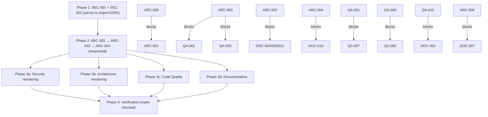

# Project Audit Report

> **Project**: par-term-emu-core-rust
> **Date**: 2026-08-27
> **Stack**: Rust (1.98 MSRV, PyO3/maturin), Python 3.12+, TypeScript/Next.js (web-terminal-frontend), protobuf streaming
> **Audited by**: Claude Code Audit System (Fable 5 subagents)
> **HEAD at audit**: e83f415 (v0.46.0)

---

## Executive Summary

The project is in good health: a clean dependency-direction core, exemplary feature-flag architecture, disciplined error handling (near-zero production unwraps, zero TODO/FIXME markers), and a strong security baseline with 0 `cargo audit`/`npm audit` vulnerabilities. The most critical findings are one real correctness bug — `Terminal::get_word_at` confuses display columns with char indices and byte lengths, breaking word selection for wide/multi-byte text — and two getting-started documents (QUICKSTART.md, docs/RUST_USAGE.md) whose build recipes fail outright after the v0.46.0 `pty_session` feature split. Remediating the Critical and High issues is roughly 8–12 focused days, dominated by the streaming codec refactor and documentation sync. Standout strength: the changelog/version discipline (75 releases, three manifests perfectly in sync) and the prior audit fixes that verifiably held.

Dedup notes: DOC-017 (missing `.pyi` stubs) merged into ARC-002; the divergent-HSL finding (Architecture) merged into QA-009; the streaming-server-binary monolith (Architecture + Code Quality) merged into ARC-005; the `paste`-via-`exr` RUSTSEC finding (Security) merged into ARC-007; the dead `MouseMode::X10` variant (found by Documentation) folded into QA-007; the `CSI * x` spurious-reply code bug (found by Documentation) filed as QA-010.

### Issue Count by Severity

| Severity | Architecture | Security | Code Quality | Documentation | Total |
|----------|:-----------:|:--------:|:------------:|:-------------:|:-----:|
| 🔴 Critical | 0 | 0 | 1 | 2 | **3** |
| 🟠 High     | 3 | 0 | 4 | 4 | **11** |
| 🟡 Medium   | 6 | 2 | 5 | 7 | **20** |
| 🔵 Low      | 5 | 3 | 4 | 5 | **17** |
| **Total**   | **14** | **5** | **14** | **18** | **51** |

---

## 🔴 Critical Issues (Resolve Immediately)

### [QA-001] `Terminal::get_word_at` confuses display columns, char indices, and byte lengths
- **Area**: Code Quality
- **Location**: `src/terminal/screen.rs:350-383`; exposed via `src/python_bindings/common.rs:1447,1695`
- **Description**: Guards with `col >= line_text.len()` (bytes), then indexes `chars[col]` (char index) with a display column. For lines containing CJK, emoji, or multi-byte content the column-to-index mapping is wrong: valid positions can be rejected and word extraction can return the wrong word. A grid-aware, delimiter-aware implementation already exists in `src/text_utils.rs:16` (`get_word_at`) and `:182` (`select_word`) with zero callers.
- **Impact**: Wrong word-selection results for non-ASCII content in every consumer (Python bindings, TUI sister project, streaming clients).
- **Remedy**: Route `Terminal::get_word_at`/`select_word` through the `text_utils` cell-based implementations, add Rust + Python tests with wide-char and multi-byte lines, delete the divergent copy.
- **Effort**: S–M (half a day with tests)

### [DOC-001] QUICKSTART.md stale on nearly every operational claim, including a build command that fails
- **Area**: Documentation
- **Location**: `QUICKSTART.md:22,32,124-125,130,142,145,152,204,219-220`
- **Description**: Requires "Rust 1.75+" (actual MSRV 1.98); builds the streamer with `--features streaming` but the binary declares `required-features = ["streaming-bin"]` (`Cargo.toml:47`) so the command fails; uses port 8080 (actual default 8099); downloads `par-term-web-frontend-v0.9.0.tar.gz` (current 0.46.0); `<repository-url>` placeholder; "33 example scripts" (actual 39); API link points at README instead of `docs/API_REFERENCE.md`.
- **Impact**: New users following the primary getting-started document hit a hard build failure and wrong URLs/ports.
- **Remedy**: Sync MSRV to 1.98, `streaming` → `streaming-bin` in both commands, port 8099, link the releases page instead of a pinned tarball, fix the clone URL, fix/remove the example count, point the API link at `docs/API_REFERENCE.md`.
- **Effort**: S (~30 min)

### [DOC-002] docs/RUST_USAGE.md dependency recipes broken by the v0.46.0 `pty_session` split; flagship example does not compile
- **Area**: Documentation
- **Location**: `docs/RUST_USAGE.md:81,83,89,91,307,314,348,355,362,418-427` (version pins at 97,99,108,111)
- **Description**: Recipes recommend `default-features = false` (± `streaming`) claiming PTY support is included, but since v0.46.0 `pub mod pty_session` is gated behind the `pty_session` feature (`src/lib.rs:56-57`) — the examples at lines 182, 217, 302-307 fail to compile. The streaming example imports `std::sync::Mutex` then calls `.lock().spawn_shell()` (Result not unwrapped) — does not compile. Feature table omits `pty_session` and `sim`; all version pins say `0.43`.
- **Impact**: Every Rust consumer following the documented recipes gets non-compiling code.
- **Remedy**: Add `features = ["pty_session"]` to the no-Python recipes, fix the Mutex example (`parking_lot::Mutex` or `.lock().unwrap()`), add `pty_session`/`sim` table rows, update version pins.
- **Effort**: S (~1 hour)

---

## 🟠 High Priority Issues

### [ARC-001] Committed generated frontend (`web_term/`) with no CI regeneration or drift gate
- **Area**: Architecture
- **Location**: `web_term/` (32 tracked files, 2.2 MB), `.github/workflows/deployment.yml:401-415`, `Makefile` (`web-build-static`)
- **Description**: The Next.js build output is committed; CI only verifies the directory exists and packages it. Regeneration is a manual `make web-build-static` step enforced only by a CLAUDE.md rule. History proves the risk (603f17d removed it; b56004d had to restore it).
- **Impact**: A frontend source change without the manual rebuild silently ships a stale web terminal; generated bundles pollute analysis tooling and diffs.
- **Remedy**: Build `web_term/` in the release workflow before packaging and stop tracking it, or add a CI job that rebuilds and fails on `git diff --exit-code web_term/`.
- **Effort**: M (0.5–1 day)

### [ARC-002] Python API ships untyped while advertising `Typing :: Typed` (merges DOC stub finding)
- **Area**: Architecture
- **Location**: `pyproject.toml` (classifiers ~line 36), `python/par_term_emu_core_rust/` (no `py.typed`, no `.pyi`), `src/lib.rs:181-291`
- **Description**: 60+ classes and ~27 functions from `_native` ship with no `py.typed` marker and no stubs; the `Typing :: Typed` classifier claims otherwise. pyright/mypy see every symbol as `Any`.
- **Impact**: The documented API conventions are unenforceable at consumer type-check time; Rust↔Python signature drift is undetectable — exactly the sync risk CLAUDE.md polices manually.
- **Remedy**: Generate `_native.pyi` (pyo3-stub-gen) + `py.typed`, add a CI stub-import check; or drop the classifier until stubs exist.
- **Effort**: S for scaffold; L (2–3 days) for full coverage

### [ARC-003] Stringly-typed streaming codec API with a five-layer manual sync burden
- **Area**: Architecture
- **Location**: `src/python_bindings/streaming.rs:939,1312,1758`; `proto/terminal.proto`, `src/streaming/terminal.pb.rs`, `src/streaming/protocol.rs`, `src/streaming/proto.rs`, `web-terminal-frontend/lib/proto/`
- **Description**: Python codec functions take `message_type: &str` + `**kwargs` and dispatch through giant matches. Every protocol change hand-propagates through five representations plus TypeScript; CLAUDE.md documents a six-step manual checklist.
- **Impact**: Each new message type touches 5–6 files; a missed site fails only at runtime.
- **Remedy**: Collapse layers (use prost types as app types, deleting `proto.rs`'s ~1,800 hand-written lines) or macro-generate the Python dict conversion via the in-repo `derive/` crate; at minimum make Rust matches exhaustive (no `_ =>`).
- **Effort**: L (3–5 days full collapse; 1 day for macro-generated dict conversion)

### [QA-002] `decode_server_message` — cyclomatic complexity 240 in one function
- **Area**: Code Quality
- **Location**: `src/python_bindings/streaming.rs:1312` (~440 lines); siblings `encode_server_message` (:939, cx 61), `decode_client_message` (:1904, cx 73)
- **Description**: One giant match converting every `ServerMessage` variant to a Python dict by hand — the most complex production function in the repo and a mandatory edit site for every protocol change.
- **Impact**: A missed field silently drops data on the Python side with no compiler help.
- **Remedy**: Extract per-message-family `fn variant_to_dict` helpers, or derive the conversion via macro. Sequence behind ARC-003's structural decision.
- **Effort**: M (1–2 days)

### [QA-003] `Connected` constructor explosion codifies shotgun surgery
- **Area**: Code Quality
- **Location**: `src/streaming/protocol.rs:883,900,922,944,968`
- **Description**: Five combinatorial constructors for one message (AST similarity 0.88); CLAUDE.md institutionalizes the smell in its "extending Connected" checklist. The next optional field doubles the combinations.
- **Impact**: Every `Connected` extension is a five-site edit plus doc updates.
- **Remedy**: Builder or struct-update on a `ConnectedFields` default; keep `connected_full` as canonical; deprecate the rest.
- **Effort**: S (hours; call sites in `server.rs` + tests)

### [QA-004] `screenshot`/`screenshot_to_file` duplicated verbatim across both binding wrappers, each with 20 parameters
- **Area**: Code Quality
- **Location**: `src/python_bindings/terminal/mod.rs:267,345`; `src/python_bindings/pty.rs:431,504`; also `resize_pixels` (`pty.rs:184` vs `terminal/mod.rs:379`)
- **Description**: `PyTerminal` and `PtyTerminal` carry byte-identical method bodies; the legacy signature takes 20 positional parameters. The `common.rs` macro layer that deduplicated 100+ accessors left these out (migration note at `common.rs:28`).
- **Impact**: Signature drift between the two classes is the exact "bindings must stay in sync" failure mode CLAUDE.md warns about.
- **Remedy**: Move shared bodies into the `common.rs` macro layer; steer docs to the config-object variants.
- **Effort**: M (1 day)

### [QA-005] No test infrastructure at all for the web frontend
- **Area**: Code Quality
- **Location**: `web-terminal-frontend/` (no test script, no test dir, no vitest/jest/playwright config)
- **Description**: `Terminal.tsx` (1,020 lines) implements the whole client protocol — reconnect backoff, heartbeat, buffered rAF writes, local echo, snapshot size guards — with zero automated tests; `make checkall` never touches the frontend.
- **Impact**: Client protocol regressions are only caught manually.
- **Remedy**: vitest + mock-WebSocket harness for `lib/protocol.ts` and dispatch logic (extract per QA-008 first); wire a `test-web` target into `checkall`.
- **Effort**: M–L (2–3 days); depends on QA-008
- **Blocking**: QA-008 → QA-005

### [DOC-003] docs/VT_TECHNICAL_REFERENCE.md regressed: sequences documented as implemented that are not wired
- **Area**: Documentation
- **Location**: `docs/VT_TECHNICAL_REFERENCE.md:128-151,314-316,328,354-368,1361,1382,1397,1401,1456-1476,1513-1514`
- **Description**: Confirmed false claims: XTPUSHCOLORS/XTPOPCOLORS not wired (`csi/mod.rs:103` routes `P` to DCH; no `Q` arm); alt-screen modes 47/1047/1048 absent (only 1049 in `csi/mode.rs:123-140,216-229`); DECSACE claimed "✅ Full" but `CSI * x` falls through to the DECREQTPARM handler and emits a spurious reply (see QA-010); mode 9 X10 mouse never set; **inverse error**: charset switching (G0/G1) marked "❌ Not implemented" but is fully implemented with 12 passing tests; stale `CSI q` limitation note.
- **Impact**: Integrators send sequences that are no-ops or trigger wrong replies, or reimplement charset handling that exists.
- **Remedy**: Remove/mark-unsupported the four false claims, rewrite the charset limitation as supported, renumber limitations, fix the `CSI q` note. Coordinate with QA-010's resolution.
- **Effort**: S (~2 hours)
- **Blocking**: QA-010 → DOC-003

### [DOC-004] docs/API_REFERENCE.md documents call sites that raise TypeError/AttributeError
- **Area**: Documentation
- **Location**: `docs/API_REFERENCE.md:928,931,970-981,2119-2120`
- **Description**: `diff_snapshots()` does not exist (and registered `PySnapshotDiff` at `src/lib.rs:222` is unobtainable from Python — see ENH-001); four color-conversion functions documented as static/tuple/int are instance methods taking floats (`color_api.rs:31,60,81,110`); `debug_log_snapshot()` requires a positional `label` (`common.rs:1819`); `set_max_sessions()`/`set_session_idle_timeout()` are `#[setter]` properties, not methods (`streaming.rs:184-199`).
- **Impact**: Copy-pasted documented calls raise runtime errors.
- **Remedy**: Correct the four color signatures, add the `label` arg, document the two settings as properties, remove the `diff_snapshots` entry (implementation filed as enhancement ENH-001).
- **Effort**: S (~1 hour)

### [DOC-005] docs/ARCHITECTURE.md unaware of the v0.46.0 feature split; module and count drift
- **Area**: Documentation
- **Location**: `docs/ARCHITECTURE.md:5,256,429-460,936-950`
- **Description**: Feature table lacks `sim`/`pty_session` rows; banner says v0.45.0; 35 vs actual 37 server message types; missing public modules (`ffi.rs`, `observer.rs`, `zone.rs`, `bin/streaming_server/`, `unicode_width_config.rs`, `unicode_normalization_config.rs`, `streaming/terminal.pb.rs`); data-flow diagram omits the Kitty APC pre-filter and non-Python consumers.
- **Impact**: Primary internals doc misdescribes the current build matrix and hides a public embedding surface.
- **Remedy**: Add feature rows, fix counts, bump banner, add missing modules, extend the diagram.
- **Effort**: S (~2 hours)

### [DOC-006] README install instructions carry stale pinned versions and a broken link
- **Area**: Documentation
- **Location**: `README.md:1152-1155,1167-1168,1481-1482,1489`
- **Description**: Rust dependency table pins `0.43`; pre-built frontend fetches `releases/latest/download/par-term-web-frontend-v0.45.0.tar.gz` (versioned filename against `latest` — 404s after the next release); `web_term/README.md` link target does not exist.
- **Impact**: Copy-paste install steps fail or fetch the wrong artifact.
- **Remedy**: Unpin/update versions, link the releases page, point the dead link at `web-terminal-frontend/README.md`.
- **Effort**: S (~30 min)

---

## 🟡 Medium Priority Issues

### Security

### [SEC-001] CORS falls back to fully permissive when no origin allowlist is configured
- **Location**: `src/streaming/server.rs:2947-2960` (`build_cors_layer`), applied at `:1637,:1698`; doc claim `docs/SECURITY.md:948`
- **Description**: With `--allowed-origins` unset (default), HTTP routes get `CorsLayer::very_permissive()` while the WebSocket policy default-denies remote browsers — the documented "mirror" does not hold. CWE-942 / OWASP A05.
- **Impact**: With `--enable-http` on a reachable interface, any page can cross-origin read static assets and `/sessions` JSON (information disclosure; `/ws` stays origin-checked).
- **Remedy**: When `allowed_origins` is `None`, build a CORS layer mirroring the WS local-origin default. Effort: S (~1 hour)

### [SEC-002] `/sessions` HTTP handler performs no Origin check and is unauthenticated by default
- **Location**: `src/streaming/server.rs:3121-3132` (`sessions_handler`); contrast `ws_handler:3104`, `stats_ws_handler:3151`
- **Description**: Returns active session ids/metadata with neither Origin check nor mandatory auth. CWE-359 / OWASP A01.
- **Impact**: Cross-origin enumeration of live session identifiers in the default `--enable-http` config.
- **Remedy**: Add the same `check_ws_origin` guard the WS handlers use. Effort: S (~30 min). Logically one change with SEC-001.

### Architecture

### [ARC-004] `src/streaming/server.rs` is a 4,024-line multi-responsibility module
- **Location**: `server.rs` (TLS :141, basic-auth :315, `StreamingConfig` :390, metrics :507, `SessionState` :541, `SessionRegistry` :960, rate limiter :1131, `StreamingServer` :1214-3280, API auth :2785)
- **Description**: TLS config, htpasswd auth, server config, session state/registry, rate limiter, and a ~2,000-line server impl in one file; sibling files show the module already knows how to split.
- **Remedy**: Extract `config.rs`, `session.rs`, `rate_limit.rs`; mechanical moves. Effort: M (1 day)
- **Blocking**: SEC-001/SEC-002 land first; ARC-004 → DOC-016

### [ARC-005] Streaming server binary is a 1,790-line monolith with complexity-67 `main` and user-reachable `.expect` panics (merges QA finding)
- **Location**: `src/bin/streaming_server/main.rs:1302` (`main`, ~490 lines); `.expect("PTY session required for macro mode")` at `:1485,:1506,:1708`; frontend downloader :1043; auth resolution :1214
- **Description**: CLI parsing, TLS/auth resolution, GitHub-release frontend downloader, session wiring, and startup in one file; the three `expect`s panic instead of a clean CLI error.
- **Remedy**: Split into `cli.rs`, `frontend_download.rs`, `bootstrap.rs`; convert the `expect`s to error returns. Effort: M (1 day)

### [ARC-006] Unmaintained `serde_yaml` as a non-optional dependency
- **Location**: `Cargo.toml:62`; used only in `src/macros.rs:159-177`
- **Description**: `serde_yaml` 0.9.34 is archived (RUSTSEC-2024-0320), compiled unconditionally, serving only YAML macro import/export.
- **Remedy**: Swap to `serde_yml`/`serde-yaml-ng` or drop YAML in favor of the existing JSON path. Effort: S (1–2 hours)

### [ARC-007] Dependency weight leaks into minimal profiles; `exr` still pulls unmaintained `paste` (merges SEC finding)
- **Location**: `Cargo.toml:68` (`tokio` `features=["full"]`), `Cargo.toml:110` (`image` with 15 formats, non-optional; `exr` → `pulp` → `paste` RUSTSEC-2024-0436 despite the comment at :111-116 claiming `paste` was removed)
- **Description**: The `streaming` feature pulls `tokio/full`; `image` compiles every decoder even for `sim`/`rust-only`; the stated `paste` removal is not achieved (`cargo tree -i paste` shows it via `exr`).
- **Remedy**: Enumerate tokio features actually used; slim the `image` decoder set (drop `exr`, likely `hdr`/`dds`) or gate behind a `graphics-formats` feature; verify with `cargo tree -i paste`. Effort: S (2–4 hours)

### [ARC-008] Threading-model documentation contradicts the code (Mutex vs RwLock)
- **Location**: `CLAUDE.md:128`; `src/pty_session.rs:5` (self-contradictory sentence); actual type `Arc<RwLock<Terminal>>` (`src/pty_session.rs:59`)
- **Description**: The ARC-009 (prior cycle) Mutex→RwLock migration never updated the guidance docs that GIL-deadlock rules are written against.
- **Remedy**: Correct both to `parking_lot::RwLock` and state the read/write split. Effort: S (15 min). Coordinate with DOC-007 (same file).

### [ARC-009] Two tracked lockfiles in the frontend
- **Location**: `web-terminal-frontend/bun.lock` and `web-terminal-frontend/package-lock.json`
- **Description**: Bun and npm lockfiles coexist; the installed dependency set depends on which tool runs. Feeds the ARC-001 stale-artifact risk.
- **Remedy**: Pick bun, delete `package-lock.json`, align Makefile/CI. Effort: S (1 hour)
- **Blocking**: ARC-009 → ARC-001

### Code Quality

### [QA-006] `write_char` — complexity 90 and the repo's #1 hotspot
- **Location**: `src/terminal/write.rs:20` (~500 lines; file 1,065)
- **Description**: Highest churn × complexity (4 × 90). Interleaves ACS translation, regional-indicator pairing, combining marks/ZWJ/variation selectors, wide-char spacers, insert mode, wrap handling at 4–5 nesting levels.
- **Remedy**: Extract `try_combine_regional_indicator`, `try_apply_combining_mark`, `write_normal_cell` (pattern started by `write_regional_indicator_first`). Effort: M (1 day, guarded by existing Unicode test files)

### [QA-007] Verified dead code in core modules (includes dead `MouseMode::X10` variant)
- **Location**: `src/cell.rs:437,459`; `src/graphics/mod.rs:401,609,626`; `src/grid/export.rs:254`; `src/graphics/serialization.rs:357`; `src/text_utils.rs:16,182` (resolved by QA-001); `python/par_term_emu_core_rust/debug.py` (255 lines); `src/mouse.rs:7` (`MouseMode::X10`, no DECSET arm sets it — see ENH-006 before removal)
- **Description**: Public rlib surface hides these from rustc; parsight zero-caller analysis + grep confirm no internal use. None have tests.
- **Remedy**: Delete or `#[deprecated]` after checking `../par-term` and `../par-term-emu-tui-rust` for consumers. Effort: S (hours)
- **Blocking**: QA-001 → QA-007

### [QA-008] `Terminal.tsx` and `OnscreenKeyboard.tsx` god components
- **Location**: `web-terminal-frontend/components/Terminal.tsx` (1,020 lines; init effect ~670 lines); `OnscreenKeyboard.tsx` (1,064 lines)
- **Description**: Connection lifecycle, protocol decode/dispatch, xterm setup, and UI state in one component. Hygiene is good; shape is the problem.
- **Remedy**: Extract a framework-free `TerminalConnection` class; split key-layout data from behavior. Effort: M (1–2 days)

### [QA-009] Core-vs-bindings logic duplication with drift (merges divergent-HSL finding)
- **Location**: `sample_half_block` — `src/graphics/mod.rs:375` vs `src/python_bindings/types/graphics.rs:168` (0.976 similarity, different AST); pixel accessors — `src/sixel.rs:209`, `src/graphics/mod.rs:351`, `types/graphics.rs:137`; HSL math — `src/terminal/screen.rs:212` (`rgb_to_hsl`, 0–1 scale) vs `src/color_utils.rs:313/347` (`to_hsl`/`from_hsl`, 0–100 scale, different formula); `src/terminal/colors.rs:252` wraps the screen.rs version
- **Description**: Binding types reimplement pixel-sampling and color math; two divergent HSL implementations with different scales coexist. `src/python_bindings/color_utils.rs` shows the correct delegation pattern.
- **Remedy**: Delegate bindings to core implementations; make `color_utils` canonical with a scale adapter for `ColorHSL`; add a round-trip property test. Effort: S–M (half a day)

### [QA-010] `CSI Ps * x` (would-be DECSACE) falls through to the DECREQTPARM handler and emits a spurious reply
- **Location**: `src/terminal/sequences/csi/mod.rs:83-90` → `src/terminal/sequences/csi/report.rs:188-205`
- **Description**: The `*` intermediate is not distinguished, so a DECSACE sequence from a VT420-aware application triggers a DECREQTPARM response — wrong bytes on the wire.
- **Impact**: Protocol corruption for applications probing rectangular-op support.
- **Remedy**: Add a `*` intermediate check that consumes the sequence as a no-op (full DECSACE support filed as ENH-005). Effort: S (~1 hour with test)
- **Blocking**: QA-010 → DOC-003

### Documentation

### [DOC-007] CONTRIBUTING.md and CLAUDE.md cite binding files that are now directories
- **Location**: `CONTRIBUTING.md:67,75-76`; `CLAUDE.md` (Key Source Layout `types.rs`; Python Binding Sync `src/python_bindings/terminal.rs` twice)
- **Remedy**: Update to `terminal/` and `types/` directory paths. Effort: S (15 min). Coordinate with ARC-008 (same file).

### [DOC-008] docs/STREAMING.md: three dead TOC anchors plus small inaccuracies
- **Location**: `docs/STREAMING.md:21,22,34-42,38,302,464-484`
- **Description**: Dead anchors (`#server-messages`, `#client-messages`, `#http-static-file-serving`); `--max-clients` "(0=unlimited)" is false (0 rejects all — `server.rs:1332,1339`); `StreamingConfig` table omits `allowed_origins`; `--preset` flag undocumented.
- **Remedy**: Fix TOC, correct `--max-clients`, add `allowed_origins` and `--preset`. Effort: S (~1 hour)

### [DOC-009] docs/API_REFERENCE.md omissions and TOC gaps
- **Location**: `docs/API_REFERENCE.md` (Data Classes, Color Utilities, Progress Bar, Streaming Functions, TOC)
- **Description**: Undocumented exports: `ProgressBar`, `SelectionMode`, `progress_bar()`/`has_progress()`, `char_width_cjk`/`str_width`/`str_width_cjk`/`is_east_asian_ambiguous`, `encode_client_message`/`decode_client_message`. TOC omits `## C-Compatible FFI`, `## See Also`, 7 `###` headings.
- **Remedy**: Add entries and TOC rows. Effort: S (~2 hours)

### [DOC-010] docs/VT_SEQUENCES.md: charset support missing entirely; one unwired claim
- **Location**: `docs/VT_SEQUENCES.md:384,474-484` (charset section absent)
- **Description**: G0/G1 designation, DEC Special Graphics/ACS, SO/SI are fully implemented but absent from the 496-line reference; `OSC 1337;CurrentDir=` documented but unwired (falls to the iTerm2 image handler — implementing it is ENH-002).
- **Remedy**: Add a Character Sets section + SO/SI rows; mark `CurrentDir` unsupported (or wire per ENH-002). Effort: S (~1 hour)

### [DOC-011] Docstring convention compliance is bimodal; data-class properties have no introspectable docs
- **Location**: `src/python_bindings/types/*.rs` (32/96 documented), `src/python_bindings/streaming.rs` (0 Example sections), `derive/src/lib.rs:26`
- **Description**: ~88% of 641 methods have doc comments but only ~33% have Args and ~9% Example (repo convention: Google style with Args/Returns/Example). Systemic: `pyo3_get_all` derive doesn't forward field `///` docs, so all ~69 data classes expose properties with empty `__doc__`.
- **Remedy**: Backfill `types/*.rs` docstrings; extend the derive macro to forward field docs (biggest leverage — code change in `derive/`). Effort: derive fix ~half day; backfill incremental
- **Blocking**: ARC-002 → DOC-011 (stubs and docs should derive from the same pass)

### [DOC-012] README "What's New" duplicates ~975 lines of changelog
- **Location**: `README.md:16-992`
- **Remedy**: Keep latest 2–3 releases; move the rest to CHANGELOG.md (verify no content lost). Effort: S (~1 hour)

### [DOC-013] docs/CONFIG_REFERENCE.md omits the runtime OSC data cap
- **Location**: `docs/CONFIG_REFERENCE.md` (Core Security Settings)
- **Description**: `max_osc_data_length`/`set_max_osc_data_length` (`src/terminal/mod.rs:2107`) documented only in SECURITY.md.
- **Remedy**: Add with default and type. Effort: S (15 min)

---

## 🔵 Low Priority / Improvements

### Security
- **[SEC-003]** Kitty file-transmission path check blocks `..` (substring test — also wrongly rejects `my..notes.png`) but not absolute paths; documented limitation, but the check implies protection it doesn't provide. `src/graphics/kitty.rs:810-855`, `docs/SECURITY.md:673-688`. Remedy: allowlist-root option (~2–3 h) or doc alignment (~15 min).
- **[SEC-004]** Debug log at predictable temp path with `truncate(true)`, no `O_NOFOLLOW`/0600 — symlink/pre-creation target on shared `/tmp` (opt-in logging only). `src/debug.rs:60-67`. Remedy: PID-suffixed name + `O_NOFOLLOW` + 0600. ~1 h.
- **[SEC-005]** Frontend forwards `?api_key=` into the WS URL (`web-terminal-frontend/app/page.tsx:112-118`); server-side gated behind `--allow-api-key-in-query` with warnings, so doc-consistency only. Negligible effort.

### Architecture
- **[ARC-010]** `SessionState` name collision: `src/terminal/multiplexing.rs:65` vs `src/streaming/server.rs:541`. Rename the streaming one (crate-internal). ~1 h.
- **[ARC-011]** `sim` feature is an empty marker gating nothing (`Cargo.toml:177`; zero `cfg(feature="sim")`). Document as intentional or add a `compile_error!` guard for `sim`+`python`. ~30 min.
- **[ARC-012]** Derive crate outside the version-sync and publish story (`derive/Cargo.toml:3` 0.45.0; `publish-crates.yml` publishes only the main crate; CLAUDE.md checklist omits it). Add to checklist + conditional publish step. ~1–2 h.
- **[ARC-013]** `Terminal` aggregate large but well-decomposed (60 fields, `src/terminal/mod.rs:752-899`); opportunistic helper extraction only. No dedicated work.
- **[ARC-014]** Fully-flat public module surface on the rlib (`src/lib.rs:37-69`, all 33 modules `pub`). Defer to a planned major bump; survey `par-term` imports first.

### Code Quality
- **[QA-011]** Broad `pytest.raises(Exception)` at `tests/test_macros_extended.py:178,186,192,306` — assert the named expected types. Minutes.
- **[QA-012]** `_native` registration function complexity 127 (`src/lib.rs:181`) — mechanical; consider per-submodule registration split. S.
- **[QA-013]** Library logging via `eprintln!` (`src/python_bindings/observer.rs:353,391`, `src/terminal/mod.rs:741`) — consider the `log` facade. S.
- **[QA-014]** `handle_csi_style` (74), `handle_decset` (61), `handle_decrst` (57) — flat table-like VT dispatch; refactor only if churn continues. Informational.

### Documentation
- **[DOC-014]** README Documentation section omits links to `docs/OBSERVERS.md`, `docs/INSTANT_REPLAY.md`, `docs/FFI_GUIDE.md` (`README.md:1098-1113`). Minutes.
- **[DOC-015]** Stale audit artifacts at repo root (`AUDIT-2026-06-15.md`, `AUDIT-REMEDIATION-2026-06-15.md`; prior `AUDIT.md` superseded by this file) carry most of the repo's broken doc links. Archive or delete.
- **[DOC-016]** Code-side stale comments: `src/ffi.rs:267-268` claims JSON-encoded observer events (actually Debug format, `ffi.rs:321`); `src/streaming/server.rs:413` says idle-timeout default 300 vs actual 900 (`server.rs:457`). Effort: minutes. Sequence after ARC-004.
- **[DOC-017]** `docs/STREAMING.md:763-815` documents protobuf field names; serde-JSON tags differ (`cwd_changed` vs `cwdchanged`) with the divergence unstated.
- **[DOC-018]** `docs/research/OSC-9-4-PROGRESS-BAR-IMPLEMENTATION.md:8,333` links a personal absolute path and the pre-split `sequences/osc.rs`.

---

## Detailed Findings

### Architecture & Design
0 Critical / 3 High / 6 Medium / 5 Low (after merges). Verified against the working tree because parsight analytics were partial (52% coverage). Key theme: representations that only manual checklists keep in sync — the committed `web_term/` bundle (ARC-001) and the five-layer streaming protocol (ARC-003). Strengths: exemplary feature-flag graph separating the three artifacts; clean dependency direction (`grid`/`cell`/`graphics`/`screenshot` never import `terminal`); disciplined per-domain error enums with centralized `From<DomainError> for PyErr`; bounded-resource discipline (event queue eviction, clipboard caps, graphics limits); security-conscious dependency curation with inline RUSTSEC citations; the `sequences/{csi,osc,dcs}` and 17-file themed binding decomposition works well.

### Security Assessment
0 Critical / 0 High / 2 Medium / 3 Low (after merging the `paste`/`exr` item into ARC-007). `cargo audit`: 0 vulnerabilities (1 allowed unmaintained warning); `npm audit`: 0. Prior audit items (SEC-002/005/007 of earlier cycles, image-decode bounds, htpasswd re-implementation) verified as held. Highest-risk area: HTTP CORS defaults to `very_permissive` while WS origin policy default-denies — cross-origin disclosure of session metadata under `--enable-http` without an allowlist; no path to command execution in the default posture. Notable strengths: constant-time credential comparison (`subtle`), zeroize-on-drop for password material, rustls with verification never disabled, permission-checked key/password files, layered decompression caps (zlib 1 MiB, WS 16 MiB, OSC configurable, `image::Limits` + checked pixel-product cap), OSC 52 clipboard read off by default, narrow and justified `unsafe`, no hardcoded secrets.

### Code Quality
1 Critical / 4 High / 5 Medium / 4 Low (after merges). Primary concern: the manual Rust↔Python↔protobuf conversion layer concentrates protocol-evolution risk in hand-synced giant functions (`decode_server_message` cx 240), plus one real correctness bug (`get_word_at`). Test coverage good (>70%) for Rust core and Python surface (567 Python test functions, 2,308 `#[test]`s); zero for the frontend. Technical debt markers: 0 TODO/FIXME/HACK anywhere. Production error handling exemplary: effectively all `.unwrap()` in tests, ~4 production unwraps (safe), zero `panic!` outside tests, panic-isolated observer callbacks.

### Documentation Review
2 Critical / 4 High / 7 Medium / 5 Low (after moving the stub finding into ARC-002). Drift concentrates in two places: the v0.46.0 `pty_session`/`sim` feature split (never propagated to QUICKSTART/RUST_USAGE/ARCHITECTURE) and VT_TECHNICAL_REFERENCE.md (the prior sync's removals were applied only to VT_SEQUENCES.md). Strengths: version sync perfect across all three manifests; CHANGELOG exemplary (75 releases, Keep a Changelog, migration notes); STREAMING.md protocol tables exactly right (37/11/26); FFI_GUIDE.md a 100% field-for-field match to `src/ffi.rs`; examples/README count exact. Verified non-issues: OBSERVERS.md "OSC 934" is real; `ScreenCleared` is now emitted (`csi/erase.rs:38,54`).

---

## Remediation Roadmap

### Immediate Actions (Before Next Deployment)
1. QA-001 — fix `get_word_at` wide-char correctness via `text_utils`
2. DOC-001 / DOC-002 — repair the two broken getting-started paths
3. SEC-001 / SEC-002 — unify HTTP CORS with the WS origin policy and guard `/sessions`

### Short-term (Next 1–2 Sprints)
1. ARC-002 — `py.typed` + generated stubs (unblocks the Python doc pass)
2. ARC-003 → QA-002/QA-003 — streaming codec structural decision, then the refactors
3. QA-010 + DOC-003 — stop the `CSI * x` spurious reply, then fix VT_TECHNICAL_REFERENCE
4. DOC-004/005/006 — API reference signatures, architecture doc, README install
5. ARC-009 → ARC-001 — canonical lockfile, then the web_term CI gate
6. QA-004 — dedupe screenshot bindings into the macro layer

### Long-term (Backlog)
1. ARC-004 / ARC-005 — server.rs and binary decomposition
2. QA-008 → QA-005 — frontend connection extraction, then test harness
3. QA-006 — `write_char` decomposition
4. ARC-006/ARC-007 — dependency hygiene (serde_yaml, tokio features, image decoders)
5. DOC-011 — derive doc-forwarding + docstring backfill
6. Remaining Medium/Low items per the plan below

---

## Positive Highlights

1. **Version discipline**: Cargo.toml, pyproject.toml, and `__init__.py` perfectly in sync at 0.46.0; CHANGELOG.md covers 75 releases in Keep a Changelog format with migration notes and compare links.
2. **Production error handling**: effectively zero unwraps/panics outside tests across a 189-file Rust codebase; observer callbacks panic-isolated.
3. **Security engineering**: constant-time comparisons, zeroization, layered decode/decompression caps with checked arithmetic, clipboard-read off by default, inline RUSTSEC rationale in Cargo.toml.
4. **Feature-flag architecture**: clean three-artifact separation (cdylib/rlib/binary) with per-feature dependency isolation and written rationale.
5. **Zero TODO/FIXME/HACK markers** in source — debt is fixed or tracked externally.
6. **Deep behavior-focused tests**: dedicated files for flag emoji, skin-tone modifiers, ZWJ sequences; 567 Python test functions across 26 files.
7. **Docs infrastructure**: a real style guide, per-directory READMEs with exact counts, full env-var tables, troubleshooting sections, Mermaid diagrams.
8. **The `common.rs` macro layer** deduplicating 100+ binding accessors is a strong pattern that just needs to finish absorbing the stragglers.

---

## Audit Confidence

| Area | Files Reviewed | Confidence |
|------|---------------|-----------|
| Architecture | ~40 (all manifests, workflows, core modules) | High |
| Security | ~35 (server, auth, graphics, FFI, deps) | High |
| Code Quality | ~30 + full parsight analytics | High |
| Documentation | All 52 markdown files + two-way API diff (641 methods) | High |

All four agents verified findings against the working tree at e83f415; parsight stale-index artifacts were discarded.

---

## Remediation Plan

> This section is generated by the audit and consumed directly by `/fix-audit`.
> It pre-computes phase assignments and file conflicts so the fix orchestrator
> can proceed without re-analyzing the codebase.
> Per-issue execution detail lives in `AUDIT-REMEDIATION-PLAN.md`.

### Phase Assignments

#### Phase 1 — Critical Security (Sequential, Blocking)
<!-- No Critical Security issues this cycle. SEC-001/SEC-002 are promoted here: they edit
     src/streaming/server.rs, a conflict file also targeted by ARC-004 (Architecture) and
     DOC-016, and are logically one change that must land before the file is decomposed. -->
| ID | Title | File(s) | Severity |
|----|-------|---------|----------|
| SEC-001 | CORS permissive fallback contradicts WS origin policy | `src/streaming/server.rs`, `docs/SECURITY.md` | Medium (promoted) |
| SEC-002 | `/sessions` handler lacks Origin check | `src/streaming/server.rs` | Medium (promoted) |

#### Phase 2 — Critical Architecture (Sequential, Blocking)
| ID | Title | File(s) | Severity | Blocks |
|----|-------|---------|----------|--------|
| ARC-002 | py.typed + generated stubs | `pyproject.toml`, `python/par_term_emu_core_rust/`, CI | High | DOC-004, DOC-009, DOC-011 |
| ARC-003 | Streaming codec layer decision (macro-generate dict conversion) | `src/python_bindings/streaming.rs`, `src/streaming/proto.rs`, `derive/` | High | QA-002, QA-003 |
| ARC-004 | Decompose `src/streaming/server.rs` | `src/streaming/server.rs` → `config.rs`/`session.rs`/`rate_limit.rs` | Medium (promoted) | DOC-016, ARC-010 |

#### Phase 3 — Parallel Execution

**3a — Security (remaining)**
| ID | Title | File(s) | Severity |
|----|-------|---------|----------|
| SEC-003 | Kitty file-load path check hardening/doc alignment | `src/graphics/kitty.rs`, `docs/SECURITY.md` | Low |
| SEC-004 | Debug log temp-file hardening | `src/debug.rs` | Low |
| SEC-005 | Query api_key doc consistency | `web-terminal-frontend/app/page.tsx` (docs only) | Low |

**3b — Architecture (remaining; ARC-009 before ARC-001; ARC-006 and ARC-007 sequential — shared Cargo.toml)**
| ID | Title | File(s) | Severity |
|----|-------|---------|----------|
| ARC-009 | Single canonical frontend lockfile | `web-terminal-frontend/` | Medium |
| ARC-001 | web_term/ CI build or drift gate | `.github/workflows/deployment.yml`, `web_term/` | High |
| ARC-005 | Split streaming server binary; remove reachable expects | `src/bin/streaming_server/main.rs` | Medium |
| ARC-006 | Replace serde_yaml | `Cargo.toml`, `src/macros.rs` | Medium |
| ARC-007 | Trim tokio/image features; drop `paste` via exr | `Cargo.toml` | Medium |
| ARC-008 | Fix threading docs (RwLock) | `CLAUDE.md`, `src/pty_session.rs` | Medium |
| ARC-010 | Rename streaming SessionState | `src/streaming/server.rs` (post-split: `session.rs`) | Low |
| ARC-011 | sim feature marker guard/doc | `Cargo.toml` | Low |
| ARC-012 | Derive crate version-sync + publish | `derive/Cargo.toml`, `.github/workflows/publish-crates.yml`, `CLAUDE.md` | Low |
| ARC-013 | Terminal aggregate — no action (fold into other work) | `src/terminal/mod.rs` | Low |
| ARC-014 | Public surface curation — deferred to major bump | `src/lib.rs` | Low |

**3c — Code Quality (all; QA-001 first, then QA-007; QA-002/QA-003 after Phase 2's ARC-003; QA-008 before QA-005)**
| ID | Title | File(s) | Severity |
|----|-------|---------|----------|
| QA-001 | Fix get_word_at via text_utils | `src/terminal/screen.rs`, `src/text_utils.rs` | Critical |
| QA-002 | Decompose decode_server_message | `src/python_bindings/streaming.rs` | High |
| QA-003 | Connected builder | `src/streaming/protocol.rs`, `src/streaming/server.rs` | High |
| QA-004 | Dedupe screenshot bindings | `src/python_bindings/{terminal/mod.rs,pty.rs,common.rs}` | High |
| QA-005 | Frontend test harness | `web-terminal-frontend/`, `Makefile` | High |
| QA-006 | Decompose write_char | `src/terminal/write.rs` | Medium |
| QA-007 | Remove verified dead code | `src/cell.rs`, `src/graphics/*`, `src/grid/export.rs`, `python/.../debug.py`, `src/mouse.rs` | Medium |
| QA-008 | Extract TerminalConnection; split OnscreenKeyboard | `web-terminal-frontend/components/` | Medium |
| QA-009 | Delegate duplicated color/pixel logic to core | `src/python_bindings/types/graphics.rs`, `src/terminal/screen.rs`, `src/color_utils.rs` | Medium |
| QA-010 | Stop CSI * x spurious reply | `src/terminal/sequences/csi/mod.rs` | Medium |
| QA-011 | Narrow pytest.raises types | `tests/test_macros_extended.py` | Low |
| QA-012 | Split _native registration | `src/lib.rs` | Low |
| QA-013 | eprintln → log facade | `src/python_bindings/observer.rs`, `src/terminal/mod.rs` | Low |
| QA-014 | CSI dispatch complexity — monitor only | `src/terminal/sequences/csi/` | Low |

**3d — Documentation (all; DOC-003 after QA-010; DOC-007 after ARC-008; DOC-004/009/011 after ARC-002; DOC-016 after ARC-004)**
| ID | Title | File(s) | Severity |
|----|-------|---------|----------|
| DOC-001 | Fix QUICKSTART.md | `QUICKSTART.md` | Critical |
| DOC-002 | Fix RUST_USAGE.md recipes | `docs/RUST_USAGE.md` | Critical |
| DOC-003 | Fix VT_TECHNICAL_REFERENCE claims | `docs/VT_TECHNICAL_REFERENCE.md` | High |
| DOC-004 | Fix API_REFERENCE wrong signatures | `docs/API_REFERENCE.md` | High |
| DOC-005 | Sync ARCHITECTURE.md to v0.46.0 | `docs/ARCHITECTURE.md` | High |
| DOC-006 | Fix README install refs | `README.md` | High |
| DOC-007 | Fix CONTRIBUTING/CLAUDE.md paths | `CONTRIBUTING.md`, `CLAUDE.md` | Medium |
| DOC-008 | Fix STREAMING.md TOC + flags | `docs/STREAMING.md` | Medium |
| DOC-009 | API_REFERENCE omissions | `docs/API_REFERENCE.md` | Medium |
| DOC-010 | VT_SEQUENCES charset section | `docs/VT_SEQUENCES.md` | Medium |
| DOC-011 | Derive doc-forwarding + docstring backfill | `derive/src/lib.rs`, `src/python_bindings/types/*.rs` | Medium |
| DOC-012 | Archive README What's New | `README.md`, `CHANGELOG.md` | Medium |
| DOC-013 | CONFIG_REFERENCE OSC cap | `docs/CONFIG_REFERENCE.md` | Medium |
| DOC-014 | README doc links | `README.md` | Low |
| DOC-015 | Archive stale audit artifacts | repo root | Low |
| DOC-016 | Fix stale code comments | `src/ffi.rs`, `src/streaming/server.rs` | Low |
| DOC-017 | Note proto vs serde-JSON naming | `docs/STREAMING.md` | Low |
| DOC-018 | Fix research note paths | `docs/research/OSC-9-4-PROGRESS-BAR-IMPLEMENTATION.md` | Low |

### File Conflict Map

| File | Domains | Issues | Risk |
|------|---------|--------|------|
| `src/streaming/server.rs` | Security + Architecture + Docs | SEC-001, SEC-002, ARC-004, ARC-010, DOC-016, QA-003 (call sites) | ⚠️ Security first, then split, then comment fix; read before every edit |
| `Cargo.toml` | Architecture (×4) | ARC-006, ARC-007, ARC-011, ARC-012 | ⚠️ Sequential within 3b |
| `src/python_bindings/streaming.rs` | Architecture + Code Quality + Docs | ARC-003, QA-002, DOC-011 | ⚠️ ARC-003 decision first |
| `src/streaming/protocol.rs` | Architecture + Code Quality | ARC-003, QA-003 | ⚠️ Sequence behind ARC-003 |
| `CLAUDE.md` | Architecture + Docs | ARC-008, DOC-007, ARC-012 | ⚠️ ARC-008 first, then DOC-007/ARC-012 |
| `src/terminal/screen.rs` | Code Quality (×2) | QA-001, QA-009 | ⚠️ QA-001 first |
| `src/python_bindings/common.rs` | Code Quality (×2) | QA-001 (bindings), QA-004 | ⚠️ Read before edit |
| `README.md` | Docs (×3) | DOC-006, DOC-012, DOC-014 | ⚠️ Single agent, one pass |
| `docs/API_REFERENCE.md` | Docs (×2) | DOC-004, DOC-009 | ⚠️ Single agent, one pass |
| `docs/STREAMING.md` | Docs (×2) | DOC-008, DOC-017 | ⚠️ Single agent, one pass |
| `docs/SECURITY.md` | Security (×2) | SEC-001 (doc), SEC-003 (doc) | ⚠️ Read before edit |
| `web-terminal-frontend/` | Architecture + Code Quality + Security | ARC-009, QA-005, QA-008, SEC-005 | ⚠️ ARC-009 first; QA-008 before QA-005 |
| `derive/src/lib.rs` | Docs + Architecture | DOC-011, ARC-012 (version) | ⚠️ Read before edit |
| `src/pty_session.rs` | Architecture | ARC-008 | — |
| `src/lib.rs` | Architecture + Code Quality | ARC-002 (exports), QA-012 | ⚠️ Read before edit |

### Blocking Relationships

- SEC-001 → ARC-004: origin/CORS helpers must be final before `server.rs` is decomposed
- SEC-002 → ARC-004: same file, same reason (SEC-001+SEC-002 are logically one change)
- ARC-002 → DOC-004: stubs and API doc corrections should derive from the same signature pass
- ARC-002 → DOC-009: same reason
- ARC-002 → DOC-011: docstring/stub work shares the binding-signature source of truth
- ARC-003 → QA-002: refactoring the giant decode function is wasted if the layer collapse regenerates it
- ARC-003 → QA-003: `protocol.rs` constructor design depends on the codec decision
- ARC-004 → DOC-016: the stale comment at `server.rs:413` moves in the split
- ARC-004 → ARC-010: rename lands in the post-split `session.rs`
- ARC-009 → ARC-001: CI frontend build needs the canonical package manager decided
- QA-001 → QA-007: the fix consumes the currently-dead `text_utils` implementations rather than deleting them
- QA-008 → QA-005: the test harness targets the extracted `TerminalConnection` module
- QA-010 → DOC-003: document DECSACE as unsupported only after the fallthrough fix defines behavior
- ARC-008 → DOC-007: both edit CLAUDE.md; apply ARC-008's threading correction first
- QA-007 (partial) → external: `python/.../debug.py` and public Rust API deletions require checking `../par-term` and `../par-term-emu-tui-rust` for consumers first

### Dependency Diagram

```mermaid
graph TD
    P1["Phase 1: SEC-001 + SEC-002 (server.rs origin/CORS)"]
    P2["Phase 2: ARC-002 → ARC-003 → ARC-004 (sequential)"]
    P3a["Phase 3a: Security remaining"]
    P3b["Phase 3b: Architecture remaining"]
    P3c["Phase 3c: Code Quality"]
    P3d["Phase 3d: Documentation"]
    P4["Phase 4: Verification (make checkall)"]

    P1 --> P2
    P2 --> P3a & P3b & P3c & P3d
    P3a & P3b & P3c & P3d --> P4

    ARC009["ARC-009"] -->|blocks| ARC001["ARC-001"]
    ARC003["ARC-003"] -->|blocks| QA002["QA-002"]
    ARC003 -->|blocks| QA003["QA-003"]
    ARC002["ARC-002"] -->|blocks| DOC004["DOC-004/009/011"]
    ARC004["ARC-004"] -->|blocks| DOC016["DOC-016"]
    QA001["QA-001"] -->|blocks| QA007["QA-007"]
    QA008["QA-008"] -->|blocks| QA005["QA-005"]
    QA010["QA-010"] -->|blocks| DOC003["DOC-003"]
    ARC008["ARC-008"] -->|blocks| DOC007["DOC-007"]
```
