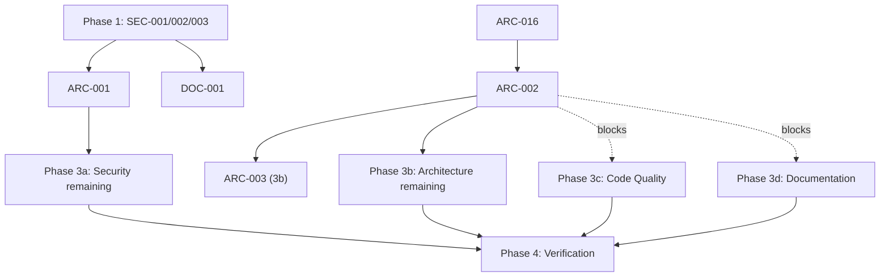

# Project Audit Report

> **Project**: par-term-emu-core-rust (v0.50.0, HEAD 9fa2237)
> **Date**: 2026-09-22
> **Stack**: Rust (PyO3 0.29 bindings), Python 3.12+, TypeScript/Next.js web frontend, WebSocket streaming server, par-mux daemon
> **Audited by**: Claude Code Audit System — /fable-audit run (Fable 5 subagents, parsight graph at repo-db09184b0394f6287256c56299eaeb0f)

---

## Executive Summary

The crate is in good overall health: zero TODO/FIXME markers, uniform `parking_lot` locking, feature isolation enforced by `compile_error!` plus CI, and a crash-safe persistence design whose code cites its own decision record. The dominant risks concentrate in the two newest layers. The streaming server's two WebSocket loops have diverged so the browser-reachable `--http` path silently discards mouse, focus, paste, selection, and clipboard input (ARC-001), and read-only mode is not enforced on four message types (SEC-001). The new mux daemon concentrates dispatch, broadcasting, and full-scrollback JSON persistence in one 500-line lock-holding function (ARC-002/ARC-003), and its process-global shutdown flag races parallel tests (ARC-016). One Critical documentation defect ships misinformation: `docs/API_REFERENCE.md` still documents the multiplexing API that 0.50.0 removed (DOC-001). Estimated effort for the Critical + High set is roughly 8–12 engineer-days; most Medium items are mechanical.

### Issue Count by Severity

| Severity | Architecture | Security | Code Quality | Documentation | Total |
|----------|:-----------:|:--------:|:------------:|:-------------:|:-----:|
| 🔴 Critical | 0 | 0 | 0 | 1 | **1** |
| 🟠 High | 4 | 0 | 1 | 3 | **8** |
| 🟡 Medium | 8 | 5 | 4 | 9 | **26** |
| 🔵 Low | 4 | 6 | 8 | 5 | **23** |
| **Total** | **16** | **11** | **13** | **18** | **58** |

Cross-domain duplicates were merged (ARC-016 ⊇ QA-103; ARC-002 ⊇ QA-101/QA-104; ARC-009 ⊇ QA-105; ARC-007 ⊇ QA-106/QA-107; ARC-001 ⊇ QA-109; DOC-002 ⊇ ARC-013), counting once under the primary domain.

### Security coverage note

The security agent was terminated twice by an API rate limit (Fable quota, resets 10:40 PT). Its streaming-server assessment completed and every included streaming finding was re-verified line-by-line by the orchestrator; the OSC/DCS parser-buffer finding (SEC-003) was verified directly against source. **Not covered:** the par-mux daemon surface (socket permissions, hook-report JSON path, `session_resume_argv` restore execution, `render_argv` quoting, state-file handling), dependency audits (`cargo audit`/`pip-audit`/`npm audit`), and the `unsafe`/FFI review. Treat the mux daemon as unaudited; a follow-up security pass on `src/mux/` is recommended once quota returns. DOC-009's SECURITY.md gap compounds this.

---

## 🔴 Critical Issues (Resolve Immediately)

### [DOC-001] API_REFERENCE.md still documents the multiplexing API removed in 0.50.0
- **Area**: Documentation
- **Location**: `docs/API_REFERENCE.md:108,114,127` (TOC), `:849-861` (nine session/pane-state methods), `:1657` (`PaneState`), `:1788` (`SessionState`), `:1945` (`WindowLayout`); `docs/ARCHITECTURE.md:362` (`pane_state` field)
- **Description**: 0.50.0 removed `PaneState`, `SessionState`, `WindowLayout` and the `Terminal` pane-state methods from Rust and Python (`_native.pyi` has zero matches). The API reference still presents all nine methods and three classes as live API.
- **Impact**: Any user following the reference writes code that raises `AttributeError`; the doc contradicts the release's headline breaking change. This is the release's landing documentation while the 0.50.0 publish card is pending.
- **Remedy**: Keep only `set_remote_session_id`/`remote_session_id` under "Session Management"; delete the three class sections and TOC lines; add a pointer to the 0.50.0 changelog entry. Remove the `pane_state` line from ARCHITECTURE.md:362.

---

## 🟠 High Priority Issues

### [ARC-001] Duplicated WebSocket session loops; the HTTP-served path silently drops mouse, focus, paste, selection, and clipboard input
- **Area**: Architecture (+ Code Quality QA-109 folded)
- **Location**: `src/streaming/server.rs:1126-1485` (`run_ws_session`, 11 `ClientMessage` arms) vs `:1637-1851` (`handle_axum_websocket`, 6 arms, catch-all `_ => {}` at ~:1774); frontend emits the dropped types (`web-terminal-frontend/components/Terminal.tsx:449-486`)
- **Description**: The axum upgrade path — the only path a browser reaches in `--http` mode (`make streamer-run-http`) — kept a hand-rolled loop after the ARC-004 dedup. Verified: tungstenite loop handles Input, Mouse, FocusChange, Paste, SelectionRequest, ClipboardRequest, Resize, Ping, RequestRefresh, SnapshotRequest, Subscribe; the axum loop handles only Input, Resize, Ping, RequestRefresh, SnapshotRequest, Subscribe.
- **Impact**: In HTTP-served mode the web terminal's mouse tracking and focus reporting are discarded server-side with no error. Every future `ClientMessage` variant must be added twice, and the second site fails silently (wildcard arm).
- **Remedy**: Extract one `handle_client_message(...)` from the 11 arms; call it from both loops; delete the wildcard arm so exhaustiveness is compiler-enforced. Add an axum-route integration test in `tests/test_ws_smoke.rs` sending a `Mouse` message and asserting the PTY received the encoded sequence.

### [ARC-002] `dispatch_issued` is a 500-line CC-86 god function owning parsing, mutation, broadcast, and persistence (+ QA-101, QA-104)
- **Area**: Architecture (+ Code Quality)
- **Location**: `src/mux/server.rs:280-778`; sibling `parse_command` at `src/mux/command.rs:380-599` (CC 63)
- **Description**: Every `MuxCommand` variant handled inline; each arm re-implements "lock tree, mutate, set `mutated`, emit reply, broadcast". Five `.expect()` calls re-derive window ids. The persistence rule (structural commands save, content commands do not) is encoded by which arms set `mutated = true` — invisible at the type level. Hook-JSON routing byte-sniffs `{` in `handle_client` (:250) instead of living in the parse layer. Top two churn hotspots of the repo (15 and 7 edits in 30 days).
- **Impact**: Every new tmux command grows this function; a forgotten `mutated = true` silently skips the atomic state save with no compiler help.
- **Remedy**: `Outcome`/`Ctx` types, one handler fn per variant (new `src/mux/dispatch.rs`), `MuxCommand::mutates()`, tree ops returning `WindowId`, `Args` struct + `parse_<cmd>` fns, `parse_line` enum for the hook grammar. Full detail in ENH-009; the minimal version is the audit fix.

### [ARC-003] State persistence serializes every pane's full scrollback, with fsync, under the tree mutex, on every structural command
- **Area**: Architecture
- **Location**: `src/mux/server.rs:772` (`save_to(&tree.lock(), path)`), `:116` (final save); `src/mux/persist.rs:211-260` (per-pane `capture_snapshot()` incl. `scrollback_cells`), `:419-443` (fsync + rename)
- **Description**: Correct (atomic tmp+fsync+rename, 0600) but synchronous and lock-holding. While it runs, the scrape tick, hook reports, and every client's command block.
- **Impact**: `split-window` latency scales with total scrollback across all panes; a few agent panes can stall every client for hundreds of milliseconds. D3.3 accepts losing the last window on `kill -9`, so per-command durability is not required.
- **Remedy**: Capture `PersistState` under the lock, hand it to a single persist thread with drain-newest coalescing; keep the shutdown save synchronous. Full design in ENH-008. Blocked by ARC-002.

### [ARC-016] `SHUTDOWN_REQUESTED` is a process-global static shared by every `MuxServer`; each `run` resets it (+ QA-103)
- **Area**: Architecture (+ Code Quality)
- **Location**: `src/mux/server.rs:115,136,152,188,194`; `src/bin/par_mux/main.rs:66-68`
- **Description**: Verified: `request_shutdown()` is an associated function on a static; `run_with_state_path` stores `false` on entry (:136). Cargo runs the unit tests at `server.rs:938/974/995` on parallel threads in one process — one test's `request_shutdown()` can stop another's server, and a server started after a request clears it.
- **Impact**: Latent test race of exactly the class that produced two flake board cards; in-process embedders cannot stop one of two daemons independently.
- **Remedy**: Per-instance `Arc<AtomicBool>` + `shutdown_handle()`; keep one static only in `main.rs` for the signal handler; delete the `:136` reset.

### [QA-102] Fixed-duration sleeps are the dominant test synchronization pattern (67 Python sites + 2 Rust)
- **Area**: Code Quality
- **Location**: `tests/test_pty.py` (22 `time.sleep`), `test_pty_resize_sigwinch.py` (12), `test_macros_extended.py` (10), `test_streaming.py` (8), `test_screenshot.py` (4), `test_nested_shell_resize.py` (4), `test_ioctl_size.py` (4), `test_macros.py` (3); `tests/mux_daemon.rs:53`, `tests/mux_reattach.rs:46` (fixed 300 ms)
- **Description**: No shared polling helper exists (`tests/conftest.py` absent). Rust already has three good helpers (`poll_until` in `tests/test_coprocess.rs:8`, `wait_until`/`wait_for`/`wait_for_pid` in `tests/mux_restart.rs:107-146`) but two mux tests still bare-sleep.
- **Impact**: Each site is a latent CI flake of the shape that already produced the two existing board cards (one still open); the suite also pays ~15 s of pure sleep on fast machines.
- **Remedy**: Add `tests/conftest.py` with a `wait_for(predicate, timeout, interval)` helper and migrate `test_pty.py` first; hoist the Rust helpers into `tests/common/mod.rs`. Build on ENH-011's `wait_for_text` when it lands.

### [DOC-002] The `mux` subsystem (14 modules, ~9.9K lines, one binary) has no in-repo documentation (+ ARC-013)
- **Area**: Documentation
- **Location**: Missing. `par-mux.md` is cited 25+ times from `src/`, `tests/`, `Cargo.toml` but lives in another repo (`par-agent-os`). `docs/ARCHITECTURE.md:42` lists only the streamer binary. No `docs/MUX.md`.
- **Description**: The daemon's operational surface (CLI, socket/state paths, pane env contract, hook JSON contract, command table with fixed reply shapes, scrape override files, quarantine behavior, SIGTERM semantics) is documented only in code comments.
- **Impact**: Operators and embedders cannot run or debug the daemon without reading source; the D-numbered design decisions the code cites are unreachable from this repo.
- **Remedy**: Write `docs/MUX.md` (how-to + reference); vendor or resolvable-link `par-mux.md`; add the mux section and binary to ARCHITECTURE.md and CLAUDE.md layout; add the README Features bullet and Documentation link.

### [DOC-003] README "What's New in 0.50.0" contradicts the CHANGELOG on persistence and omits Phase 6
- **Area**: Documentation
- **Location**: `README.md:26` (single ~600-word paragraph), summary at `:22`
- **Description**: Verified: line 26 says Phase 3's on-disk format "**will** start from that type" (persistence shipped) and ends "Agent metadata is deliberately **not persisted yet** (Phase 6's entry criterion, asserted by test)" — while CHANGELOG 0.50.0 records agent session identity persisting (format v2) and tasks 6.2–6.4 (resume table, restore wiring, restart proof).
- **Impact**: The PyPI/crates.io landing page makes false claims about what the 0.50.0 daemon writes to disk and whether agent panes resume.
- **Remedy**: Replace the stale sentence with the Phase 6 summary (persisted `agent_session`, per-agent resume table, structural fallback, restart proof); fix "will start" → "started"; split the paragraph into Removed/Added/Phase 4/Phase 5/Phase 6 bullets (also DOC-016). Land before the 0.50.0 publish.

### [DOC-004] ARCHITECTURE.md module inventory and feature block are stale
- **Area**: Documentation
- **Location**: `docs/ARCHITECTURE.md:42` (says `streaming` feature; the binary needs `streaming-bin`), `:486` ("17 themed `*_api.rs`"; 16 exist), `:511` (lists removed `types/session.rs`), `:945-990` (feature block omits `mux`, `serde`, `python-test`, both `[[bin]]`); `CLAUDE.md:107` repeats the 17-count
- **Description**: Verified against source. ARCHITECTURE.md is the most-referenced doc in the repo (parsight doc-links in-degree 20), so its inaccuracies propagate.
- **Impact**: Contributors are pointed at nonexistent files, a wrong feature flag for the binary build, and a crate picture missing one of three binaries.
- **Remedy**: Fix the four sites; regenerate the feature block from `Cargo.toml:190-246`; fold in the mux section from DOC-002. Sequence after ARC-002 if mux modules move.

---

## 🟡 Medium Priority Issues

### Architecture
- **[ARC-004]** `mux` feature pulls in `tokio` that no mux code uses (`Cargo.toml:219`; `grep -rl tokio src/mux src/bin/par_mux` = 0). Fix comment + feature list + `tests/mux_feature_isolation.rs:4`. Effort S.
- **[ARC-005]** `subtle`/`zeroize` unconditional though streaming-only (`Cargo.toml:141-142`); `pub mod streaming` unconditional (`src/lib.rs:77`) so `sim` compiles the 1,934-line protocol layer. Gate both; extend the CI D1 tree guard. Effort S.
- **[ARC-006]** `Terminal::with_scrollback` hand-initializes 32 sub-structs in a 270-line constructor (`src/terminal/mod.rs:956-1229`); no `Default` impls. Derive/implement defaults; keep geometry-dependent construction explicit. Effort M.
- **[ARC-007]** Python binding dedup stalled: 21 methods still duplicated between `PyTerminal` and `PtyTerminal` (+ QA-106 dead `Ok::<_,()>` lock fallbacks ×34 in `pty.rs`, QA-107 `resize_pixels` u16/usize drift). Move into the `common.rs` macro set via `term_mut`; drop the stale `#[allow(dead_code)]` at `common.rs:28`. Effort M.
- **[ARC-008]** Quality gates disagree: CI clippy + pre-commit use `--features python,streaming` while `make checkall` uses `python,streaming,mux,serde`; CI never runs the 198-test streaming suite. Align strings; add the streaming test step. Effort S.
- **[ARC-009]** DECSET/DECRST carry two copies of the same mode table (+ QA-105). `mode.rs:103-205`/`:207-308`, CC 71/66, byte-identical `old_mode` blocks. One table + `set_dec_private_mode(param, enabled)`. Effort S.
- **[ARC-010]** Three logging idioms: `log` (core), `tracing` (streamer bin), `eprintln!` (12 sites in `src/mux` + `par_mux` main). Replace mux `eprintln!` with `log::*`; install a minimal logger in the binary. Effort S.
- **[ARC-011]** Per-client broadcast channels unbounded; a stalled client buffers every `%output` line forever (`server.rs:215,801,817,860`). `sync_channel(4096)` + `try_send` with eviction. Effort S (full design ENH-012).

### Security
- **[SEC-001]** Read-only mode not enforced on Resize, FocusChange, SelectionRequest, ClipboardRequest (verified: checks exist only at `server.rs:1191` Input, `:1235` Mouse, `:1290` Paste). A `?readonly=1` viewer can SIGWINCH the shared PTY (Resize at `:1210`, also the axum path `:1745`), write focus sequences to the PTY (`:1264`), mutate selection broadcast to all clients, and set/get the session clipboard — `"get"` bypasses the `allow_clipboard_read` flag that gates OSC 52. Effort S.
- **[SEC-002]** Client-triggered panic via byte-index slicing: `set_selection` stores unvalidated columns (`src/terminal/screen.rs:403-410`) and `get_selected_text` slices `line_text[row_start..row_end]` using a display column as a byte offset (`:438-439`, `:465-466`); a `start_col` landing mid-grapheme panics ("byte index not a char boundary"). Contained by tokio to the attacker's connection but is a hard crash from client bytes. Effort S.
- **[SEC-003]** Unbounded parser accumulation buffers (orchestrator-verified): (a) vte's internal OSC buffer grows without bound under the std parser — the terminal's `max_osc_data_length` check runs at *dispatch* (`src/terminal/sequences/osc/mod.rs:36`) after vte already buffered the payload, and the default is 128 MiB (`DEFAULT_MAX_OSC_DATA_LENGTH`, `src/terminal/mod.rs:668`); (b) `dcs_buffer` accumulates every byte for non-Sixel DCS kinds with no cap (`src/terminal/sequences/dcs/mod.rs:130`, kinds at `:18-26`). A malicious program emitting a multi-gigabyte OSC/DCS sequence grows memory before any check fires. Remedy: enforce the OSC cap incrementally (check accumulated length in `osc_put`/`hook`), lower the default to something sane (e.g. 1 MiB — flag the change), cap `dcs_buffer` and drop the sequence on overflow. Effort M.
- **[SEC-004]** No handshake timeout or pre-handshake connection cap on the tungstenite listeners (`server.rs:861-866`, `:944` awaited without `tokio::time::timeout`; `try_add_client` at `:1102` runs post-handshake). Unauthenticated pre-upgrade connections hold tasks indefinitely, uncapped by `max_clients`. Effort S.
- **[SEC-005]** Blocking PTY writes inside the async loop: Input writes synchronously on a tokio worker holding `writer.lock()` (`server.rs:1200-1208`); Paste also holds `session.terminal.write()` (`:1298-1310`); frames up to 16 MiB, input rate limit off by default. A non-reading foreground process freezes the session for every client. Cap Input/Paste payloads; `spawn_blocking`; drop the terminal guard before writing. Effort M.

### Code Quality
- **[QA-108]** 33 tests contain no assertion (enumerated in the domain report: `renderer.rs:1194-1206` empty stub, 9 `pty_session.rs` "just ensure it doesn't panic" tests, `terminal_tests.rs:3188+`, 6 `test_terminal_bindings.py` tests whose "can't query" comments are stale — getters exist). Assert the observable or delete. Effort M.
- **[QA-110]** `KittyParser::build_graphic` is 346 lines at CC 49 (`src/graphics/kitty.rs:521-867`); `parse_chunk` CC 45. The module that shipped three v0.43.1 bugs. Split into decode/placement/frame/delete fns against the existing 1,747 lines of tests. Effort M.
- **[QA-111]** `Terminal.tsx` 370-line `useEffect` with `[]` deps closing over props (two real `exhaustive-deps` warnings downgraded to `warn`), unused `status` state, and zero component tests (`vitest.config.ts` only includes `lib/`). Route callbacks through refs or split hooks; add `components/__tests__`; fix warnings then gate with `--max-warnings 0`. Effort M.
- **[QA-112]** Seven confirmed dead public functions (verified against both sister repos): `log_vt_input`, `log_cursor_move`, `log_grid_op`, `log_mode_change` (`src/debug.rs:193/353/387/424` — the `debug_*!` macros route through `logf`), `is_wide_grapheme_with_config` (`src/grapheme.rs:140`), `MacroPlayback::reset` (`src/macros.rs:388`), `contains_regional_indicators` (`src/screenshot/renderer.rs:543`, `#[allow(dead_code)]`). Delete; note in CHANGELOG. Schedule after the 0.50.0 publish so the published API is unchanged. Effort S.

### Documentation
- **[DOC-005]** CONTRIBUTING.md streaming-protocol instructions contradict CLAUDE.md and the code (verified: `CONTRIBUTING.md:110` names `src/streaming/server.rs` for `build_connect_message`, which lives in `session.rs:169`; `:112` prescribes the partial-constructor pattern 0.47.0 deprecated). Effort S.
- **[DOC-006]** Feature tables omit `mux`, `streaming-bin`, `serde`, `python-test`; `full` misstated (CLAUDE.md:79-88, RUST_USAGE.md:436-447). Effort S.
- **[DOC-007]** Broken/wrong cross-references: STREAMING.md:626-629 unprefixed frontend paths; VT_SEQUENCES.md:459 wrong anchor; ADVANCED_FEATURES.md:288 dead README section link; BUILDING.md:374 misdescribes the proto pipeline (checked-in `terminal.pb.rs` is source of truth); VT_TECHNICAL_REFERENCE.md:53-56 bare relative paths. Effort S.
- **[DOC-008]** Stale pinned `0.46` versions in README:216-219 and RUST_USAGE.md (8 lines) — two breaking rlib releases behind; MATURIN scorecard stamp stale. Effort S.
- **[DOC-009]** SECURITY.md does not cover the par-mux control socket, hook reports, or on-disk state. Write the section once the mux security pass (see coverage note) lands so it describes remediated behavior. Effort M.
- **[DOC-010]** Python binding docstrings missing mandated Args/Returns/Example sections: `pty.rs` (30/114 methods carry Args), `streaming.rs` (17/67), nine `*_api.rs` files with zero Examples. Effort L.
- **[DOC-011]** 53 undocumented public Rust symbols incl. `pub struct Terminal` itself (`src/terminal/mod.rs:788`), `TlsConfig`, `TerminalStats`, 26 `CellFlags` accessors. Effort M.
- **[DOC-012]** `examples/README.md` omits 8 shipped examples (streaming trio + five `*_test.py`). Effort S.
- **[DOC-013]** `max_osc_data_length`/`set_max_osc_data_length` missing from API_REFERENCE.md (the only pyi methods absent). Effort S.

---

## 🔵 Low Priority / Improvements

### Architecture
- **[ARC-012]** Minified `web_term/` build artifacts packaged into the crates.io crate and polluting code analytics (top god objects are JS chunks). Add `web_term/` to `exclude`; add `.parsightignore`. Effort S.
- **[ARC-014]** `derive/` not a workspace member; stray `derive/target/`. Add `[workspace] members`. Effort S.
- **[ARC-015]** `PtySession::terminal()` hands out the raw `Arc<RwLock<Terminal>>` (#3 bridge symbol, 33 callers); lock discipline is convention. Add closure accessors for new code; document `terminal()` as for long-lived subscribers. Effort S.
- **[ARC-017]** `par-mux` hand-parses argv while the sibling binary uses clap; no `--help`, no `--state-dir`. Effort S.

### Security
- **[SEC-006]** `--tls-pem` skips the private-key permission check that `from_files` enforces (`config.rs:82-96` vs `:126-174`). Effort S.
- **[SEC-007]** Frontend bundle download: no checksum/signature, no size cap, blind `browser_download_url` fetch, `remove_dir_all(web_root)` before extraction (`frontend_download.rs`). Zip-slip itself is covered by tar 0.4.46. Effort M.
- **[SEC-008]** Basic-auth `verify` returns early on username mismatch — bcrypt work runs only for the correct username, enabling timing enumeration; length-mismatch `ct_eq` short-circuits (`config.rs:245-260`). Always run the hash against a dummy. Effort S.
- **[SEC-009]** Secrets reachable through `#[derive(Debug)]` (`PasswordConfig`, `StreamingConfig` api_key, `Debug for StreamingServer`). Latent — no current `{:?}` print sites; hand-write redacting `Debug`. Effort S.
- **[SEC-010]** No `X-Frame-Options`/CSP `frame-ancestors` on the served frontend; a transparent iframe + cached Basic auth can clickjack keystrokes into the live shell (`server.rs:729-732,790-793`). Effort S.
- **[SEC-011]** Session creation precedes the client-slot check (`server.rs:1101-1104`), session ids unvalidated strings, `/sessions` lists all ids + cwd to any authenticated client. Reorder; cap/charset-validate ids; document the single-key trust boundary. Effort S.

### Code Quality
- **[QA-113]** `handle_client` threads have no panic containment; a panic closes the socket with no reply and no log (`server.rs:176,208-267`). `catch_unwind` + error block, or make the `.expect`s return `MuxError`. Re-evaluate after ARC-002. Effort S.
- **[QA-114]** Stale/over-broad `#[allow]`: dead allow on `term_mut` (`common.rs:28`), `unused_variables` hiding discarded `pixel_x/y` (`mouse_api.rs:45`), 7 `type_complexity` allows replaceable with type aliases. Effort S.
- **[QA-115]** `SystemTime::now().duration_since(UNIX_EPOCH).unwrap()` reachable from Python (`macros.rs:88-90,320-323`, `debug.rs:142`). `.unwrap_or_default()`. Effort S.
- **[QA-116]** `PyMacroEvent::__repr__` unwraps `Option`s; docstring names wrong tag case (`types/recording.rs:249,265-272`). Effort S.
- **[QA-117]** Client-push `retain` loop copied three times in `server.rs:801-862`. One `push_to_clients` helper. Effort S.
- **[QA-118]** `OnscreenKeyboard.tsx` 921 lines, 12 `useState`s, unvalidated `JSON.parse(localStorage)`. Extract components + validating hook. Effort M.
- **[QA-119]** `event_to_dict` flattens all events to `HashMap<String,String>`; numeric fields arrive as strings. Breaking change — note for next major; `poll_events_legacy` bridge. Effort M.
- **[QA-120]** Test hygiene: bare `except:` in a generated child script; 13 `# type: ignore` from an import fallback better served by `pytest.importorskip`; unexplained `#[ignore]` (`pty_session.rs:1665`). Effort S.

### Documentation
- **[DOC-014]** STREAMING.md "CLI Options" heading sits under TLS and shows only TLS flags; the full 38-flag table has no heading of its own (`:1596`, `:262-300`). Effort S.
- **[DOC-015]** README does not link QUICKSTART.md or CONTRIBUTING.md. Effort S.
- **[DOC-016]** README 0.50.0 note is one ~600-word paragraph (fold into DOC-003's rewrite). Effort S.
- **[DOC-017]** `.github/workflows/README.md` omits `claude.yml` and `claude-code-review.yml`. Effort S.
- **[DOC-018]** CLAUDE.md carries drifting line references ("~line 52" is now `Cargo.toml:60`). Drop the numbers. Effort S.

---

## Detailed Findings

### Architecture & Design
Full report: 0 Critical, 3 High (ARC-001 duplicated WS loops with dropped input on the browser path; ARC-002 dispatch god function; ARC-003 lock-holding fsync), 8 Medium, 6 Low. Root observation: the crate's decomposition discipline (feature isolation, single-edit-site patterns, strategy factories) did not extend to the two async/socket layers added most recently. parsight: `Terminal` fan-in 88, `PtySession::terminal` is the #3 bridge symbol, mux+streaming form a 524-node community whose hub is `error::Result`.

### Security Assessment
Partial (see coverage note). Streaming server: strong positive controls verified (constant-time compares on all auth paths, keys never logged, Origin policy tight, zlib inflate capped, ServeDir not hand-rolled, rustls defaults sane). Defects concentrate on incomplete enforcement of existing policy (read-only, SEC-001) and resource-exhaustion edges (SEC-003/004/005). Mux daemon: **unaudited**.

### Code Quality
0 Critical (no reachable panics from the Python API besides SEC-002's client-bytes path, no `lock().unwrap()` in production, parking_lot throughout). 3 High folded into ARC-002/ARC-016 + QA-102 (the sleep-based test pattern). Notable Mediums: 33 assertion-free tests, the kitty parser's 346-line CC-49 method, the untested React components. Zero TODO/FIXME markers across 118K lines.

### Documentation Review
Versions agree across all three files; README/QUICKSTART samples were executed and pass. The Critical (DOC-001) and two Highs (DOC-002, DOC-003) are release-blocking misinformation gaps; the Medium tail is mostly mechanical link/version/section fixes. `docs/STREAMING.md` is a complete operator reference (all 38 CLI flags verified by diff) and the positive model for the missing MUX.md.

---

## Remediation Roadmap

### Immediate Actions (Before Next Deployment / the 0.50.0 publish)
1. DOC-001 — remove the dead multiplexing API from the reference (S)
2. DOC-003 — fix the README 0.50.0 claims (S)
3. SEC-001 — enforce read-only on the four message types (S)
4. SEC-002 — bounds-check selection before slicing (S)

### Short-term (Next 1–2 Sprints)
1. ARC-016, then ARC-002, then ARC-003 — mux dispatcher and persistence
2. ARC-001 — unify the WebSocket loops (+ the axum mouse test)
3. QA-102 — polling helpers; migrate test_pty.py
4. SEC-003/004/005 — parser caps, handshake timeout, non-blocking PTY writes
5. DOC-002, DOC-004 — mux documentation, ARCHITECTURE refresh

### Long-term (Backlog)
1. ARC-006 (Terminal constructor), QA-110 (kitty split), QA-111 (frontend tests), DOC-010 (docstrings)
2. ENH-008..ENH-015 enhancement cards (see kanban)

---

## Positive Highlights

1. Feature isolation is enforced, not just documented: `compile_error!` for `sim`+`python`, the CI D1 `cargo tree` assertion, and the `python-test` feature linking a real interpreter for binding unit tests.
2. The proto wire format has a real drift guard: `build.rs` FNV-1a-verifies the checked-in `terminal.pb.rs` against `proto/terminal.proto`, plus a CI `web_term/` drift gate.
3. Single-edit-site patterns where they matter: `ConnectedBuilder`, `terminal_event_to_server_message`, the `TerminalAccess` macro layer.
4. `SessionFactory` (streaming) and `PaneFactory` (mux) are the same abstraction applied consistently, with clean strategy implementations.
5. Mux persistence is crash-safe by construction (tmp, fsync, rename, 0600, version quarantine) and cites its decision record (D-numbers) at the exact code sites.
6. Zero TODO/FIXME/HACK markers and zero crate-level `#![allow]` across 118K lines; locking is uniformly `parking_lot` with not one `lock().unwrap()` in production code.
7. Security positive controls in the streaming server are genuinely strong: constant-time compares everywhere, secrets never logged, gated query-key auth, tight Origin policy.
8. `docs/STREAMING.md` verifies complete against the CLI by diff (all 38 flags, every env var) — the standard the missing MUX.md should meet.

---

## Audit Confidence

| Area | Files Reviewed | Confidence |
|------|---------------|-----------|
| Architecture | ~40 (src/mux, src/streaming, Cargo.toml, Makefile, CI, parsight graph) | High |
| Security | ~25 (streaming server, config, auth_hash, proto, frontend_download, parsers OSC/DCS) | **Medium — partial coverage; mux daemon, deps, unsafe/FFI unaudited** |
| Code Quality | ~60 (all test dirs, hotspots, duplicates, dead-code cross-check vs both sister repos) | High |
| Documentation | ~30 docs + bindings/pyi cross-diff | High |

*The security domain's agent was rate-limit-terminated twice; included security findings come from its completed streaming sub-agent plus orchestrator-verified parser checks. A follow-up mux security pass is recommended.*

---

## Remediation Plan

> This section is generated by the audit and consumed directly by `/fix-audit`.
> It pre-computes phase assignments and file conflicts so the fix orchestrator
> can proceed without re-analyzing the codebase.

### Phase Assignments

#### Phase 1 — Security, small independent fixes (Sequential)
| ID | Title | File(s) | Severity |
|----|-------|---------|----------|
| SEC-001 | Enforce read-only on Resize/Focus/Selection/Clipboard | `src/streaming/server.rs` | Medium |
| SEC-002 | Bounds-check selection before byte slicing | `src/terminal/screen.rs`, `src/streaming/server.rs` | Medium |
| SEC-003 | Incremental OSC/DCS accumulation caps + lower default | `src/terminal/sequences/osc/mod.rs`, `src/terminal/sequences/dcs/mod.rs`, `src/terminal/mod.rs` | Medium |

#### Phase 2 — Structural, blocking (Sequential)
| ID | Title | File(s) | Severity | Blocks |
|----|-------|---------|----------|--------|
| ARC-016 | Per-instance shutdown handle | `src/mux/server.rs`, `src/bin/par_mux/main.rs` | High | ARC-002 |
| ARC-002 | Decompose dispatch_issued + parse_command | `src/mux/server.rs`, `src/mux/command.rs`, `src/mux/tree.rs`, new `src/mux/dispatch.rs` | High | ARC-003, QA-113 |
| ARC-001 | Unify the two WebSocket loops | `src/streaming/server.rs`, `tests/test_ws_smoke.rs` | High | SEC-004, SEC-005 arm edits, (QA-109 folded) |
| DOC-001 | Remove dead multiplexing API from reference | `docs/API_REFERENCE.md`, `docs/ARCHITECTURE.md` | Critical | — |

#### Phase 3 — Parallel Execution

**3a — Security (remaining)**
| ID | Title | File(s) | Severity |
|----|-------|---------|----------|
| SEC-005 | Non-blocking PTY writes, payload caps | `src/streaming/server.rs` | Medium |
| SEC-004 | Handshake timeout + pre-handshake slot | `src/streaming/server.rs` | Medium |
| SEC-006 | tls-pem permission check | `src/streaming/config.rs` | Low |
| SEC-007 | Frontend download integrity + size cap | `src/bin/streaming_server/frontend_download.rs` | Low |
| SEC-008 | Constant-time basic-auth verify | `src/streaming/config.rs` | Low |
| SEC-009 | Redacting Debug impls | `src/streaming/config.rs`, `src/streaming/server.rs` | Low |
| SEC-010 | X-Frame-Options + CSP headers | `src/streaming/server.rs` | Low |
| SEC-011 | Slot-before-session, id validation | `src/streaming/server.rs` | Low |

**3b — Architecture (remaining)**
| ID | Title | File(s) | Severity |
|----|-------|---------|----------|
| ARC-003 | Persistence off the lock (worker + coalescing) | `src/mux/persist.rs`, `src/mux/server.rs`, `src/mux/pane.rs` | High |
| ARC-004 | Drop tokio from mux feature | `Cargo.toml`, `tests/mux_feature_isolation.rs` | Medium |
| ARC-005 | Gate subtle/zeroize + streaming module | `Cargo.toml`, `src/lib.rs`, `src/streaming/mod.rs`, `.github/workflows/ci.yml` | Medium |
| ARC-007 | Finish Python binding dedup (macro migration) | `src/python_bindings/common.rs`, `pty.rs`, `terminal/*_api.rs`, `_native.pyi` | Medium |
| ARC-008 | Align CI/pre-commit clippy features + streaming tests | `.github/workflows/ci.yml`, `.pre-commit-config.yaml`, `Makefile` | Medium |
| ARC-009 | Single DEC mode table | `src/terminal/sequences/csi/mode.rs` | Medium |
| ARC-006 | Terminal constructor defaults | `src/terminal/mod.rs` | Medium |
| ARC-010 | log:: instead of eprintln! in mux | `src/mux/*.rs`, `src/bin/par_mux/main.rs` | Medium |
| ARC-011 | Bounded client channels + eviction | `src/mux/server.rs` | Medium |

**3c — Code Quality (all)**
| ID | Title | File(s) | Severity |
|----|-------|---------|----------|
| QA-102 | Polling helpers; migrate sleep-based tests | `tests/conftest.py` (new), `tests/common/mod.rs` (new), 10 test files | High |
| QA-108 | Assert the observable in 33 no-assert tests | 12 files enumerated in domain report | Medium |
| QA-112 | Delete 7 dead public functions | `src/debug.rs`, `src/grapheme.rs`, `src/macros.rs`, `src/screenshot/renderer.rs` | Medium |
| QA-113 | Panic containment in mux client threads | `src/mux/server.rs`, `src/mux/tree.rs` | Low |
| QA-114 | Stale #[allow] cleanup | 7 files | Low |
| QA-115 | unwrap_or_default on clock reads | `src/macros.rs`, `src/debug.rs` | Low |
| QA-116 | PyMacroEvent repr + docstring | `src/python_bindings/types/recording.rs` | Low |
| QA-110 | Split KittyParser::build_graphic | `src/graphics/kitty.rs` | Medium |
| QA-111 | Terminal.tsx hooks + component tests | `web-terminal-frontend/*` | Medium |

**3d — Documentation (all)**
| ID | Title | File(s) | Severity |
|----|-------|---------|----------|
| DOC-003 | README 0.50.0 truth + split (incl DOC-016) | `README.md` | High |
| DOC-002 | docs/MUX.md + mux coverage everywhere | `docs/MUX.md` (new), ARCHITECTURE, CLAUDE, README, BUILDING, RUST_USAGE | High |
| DOC-004 | ARCHITECTURE inventory/feature refresh | `docs/ARCHITECTURE.md`, `CLAUDE.md` | High |
| DOC-005..008, DOC-011..015, DOC-017, DOC-018 | Mechanical doc fixes | see Medium/Low lists | Medium/Low |
| DOC-009 | SECURITY.md mux section (after mux security pass) | `docs/SECURITY.md` | Medium |
| DOC-010 | Binding docstrings Args/Returns/Example | `src/python_bindings/*` | Medium |

### File Conflict Map

| File | Domains | Issues | Risk |
|------|---------|--------|------|
| `src/streaming/server.rs` | Security + Architecture (+QA folded) | SEC-001, SEC-004, SEC-005, SEC-010, SEC-011, ARC-001 | ⚠️ Highest — sequential Phase 1→2→3a; read before every edit |
| `src/mux/server.rs` | Architecture + Code Quality | ARC-016, ARC-002, ARC-003, ARC-010, ARC-011, QA-113, QA-117 | ⚠️ Sequential Phase 2 order fixes the order |
| `src/python_bindings/pty.rs` | Architecture + Code Quality | ARC-007 (⊇ QA-106/QA-107), QA-108 | ⚠️ ARC-007 first |
| `src/bin/par_mux/main.rs` | Architecture | ARC-016, ARC-010, ARC-017 | Read before edit |
| `Cargo.toml` | Architecture | ARC-004, ARC-005, ARC-008(string only), ARC-012, ARC-014, ARC-017 | Additive edits; land 004/005 before 008 |
| `docs/ARCHITECTURE.md` | Documentation (+ARC folded) | DOC-001, DOC-002, DOC-004 | One writer, DOC-004 last |
| `README.md` | Documentation | DOC-002, DOC-003, DOC-008, DOC-015, DOC-016 | DOC-003 rewrite absorbs DOC-016 |
| `src/terminal/sequences/csi/mode.rs` | Architecture (+QA folded) | ARC-009 (⊇ QA-105) | Single issue |
| `tests/test_pty.py` | Code Quality (+ENH-011 overlap) | QA-102, QA-108 | ENH-011's migration supersedes; coordinate |

### Blocking Relationships
- ARC-016 → ARC-002: the shutdown handle changes `MuxServer` fields and the loop ARC-002's shared tail is written against
- ARC-002 → ARC-003: both rewrite `dispatch_issued`; decompose first, then move the save
- ARC-002 → QA-113: if tree ops return `WindowId`, the five `.expect`s vanish; re-evaluate containment after
- ARC-001 → SEC-004/SEC-005: both edit message arms; land the unified loop first so the guards are written once
- ARC-007 → (folded QA-106/QA-107): dead-lock removal is the precondition for the macro fold
- ARC-004/ARC-005 → ARC-008: feature strings written once
- DOC-002/DOC-004 after ARC-002 (module paths settle)
- DOC-009 after a mux security pass (describes remediated behavior)
- QA-112 after the 0.50.0 publish card clears (published API unchanged)

### Dependency Diagram

```mermaid
graph TD
    P1["Phase 1: SEC-001/002/003"]
    P2a["ARC-016"] --> P2b["ARC-002"]
    P2b --> P2c["ARC-003 (3b)"]
    P2d["ARC-001"]
    P1 --> P2d
    P2d --> P3a["Phase 3a: Security remaining"]
    P2b --> P3b["Phase 3b: Architecture remaining"]
    P3c["Phase 3c: Code Quality"]
    P3d["Phase 3d: Documentation"]
    P1 --> P2x["DOC-001"]
    P3a & P3b & P3c & P3d --> P4["Phase 4: Verification"]
    P2b -.blocks.-> P3c
    P2b -.blocks.-> P3d
```
