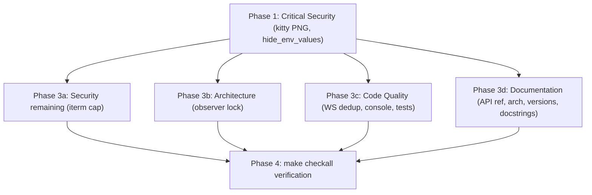

# Project Audit Report

> **Project**: par-term-emu-core-rust
> **Date**: 2026-07-02
> **Stack**: Rust (terminal emulator core) + PyO3 Python 3.12+ bindings + WebSocket streaming server + Next.js/TypeScript web frontend
> **Version**: 0.43.1
> **Audited by**: Claude Code Audit System (4 parallel expert agents, findings verified against source)

---

## Executive Summary

The codebase is in **good** health and shows an unusually mature engineering posture — a prior audit cycle (ARC-001…027, several QA/DOC items) was genuinely completed and independently verified in-source, not just documented. There are **zero critical code issues**; the only critical findings are in documentation, where the two contributor-facing docs (`ARCHITECTURE.md`, `API_REFERENCE.md`) drifted out of sync with the 0.43.0 refactor. The single most impactful open engineering item is that observer/trigger callbacks are still dispatched synchronously while the terminal's exclusive write lock is held, which undercuts the read-concurrency benefit that the `Mutex`→`RwLock` migration was meant to deliver. The most urgent hardening item is a decompression-bomb DoS in the Kitty PNG graphics path, reachable from any bytes written to the terminal, which lacks the dimension guard that every other decode path in the codebase already applies. Estimated effort to clear all High findings is roughly 2–3 focused days; the critical documentation refresh is about half of that. A genuine strength: the security-sensitive subsystems (constant-time auth comparison, zeroize-on-drop, zlib decompression cap, Origin/CSRF defense) are implemented as first-class, tested design rather than ad-hoc patches.

### Issue Count by Severity

| Severity | Architecture | Security | Code Quality | Documentation | Total |
|----------|:-----------:|:--------:|:------------:|:-------------:|:-----:|
| 🔴 Critical | 0 | 0 | 0 | 3 | **3** |
| 🟠 High     | 3 | 2 | 2 | 5 | **12** |
| 🟡 Medium   | 3 | 3 | 5 | 7 | **18** |
| 🔵 Low      | 3 | 4 | 3 | 2 | **12** |
| **Total**   | **9** | **9** | **10** | **17** | **45** |

---

## 🔴 Critical Issues (Resolve Immediately)

### [DOC-001] ARCHITECTURE.md contradicts the shipped 0.43.0 codebase
- **Area**: Documentation
- **Location**: `docs/ARCHITECTURE.md:301-303` (locking), `:322-510` (Terminal struct), `:577-601` (PyTerminal bindings)
- **Description**: Doc shows `PtySession` wrapping `Arc<Mutex<Terminal>>` (real code uses `Arc<RwLock<Terminal>>` since ARC-009); shows `Terminal` as one flat ~150-field struct (real struct is decomposed into ~30 `pub(crate)` sub-structs, ARC-001); describes `python_bindings/terminal.rs` as one file (it is now a directory with 17 themed `*_api.rs` files, ARC-002).
- **Impact**: A contributor following this doc writes `.lock()` calls that no longer compile and misunderstands the two largest subsystems.
- **Remedy**: Rewrite the Terminal struct, Python Bindings, and PtySession locking sections against current source.

### [DOC-002] API_REFERENCE.md documents wrong signatures for real public methods
- **Area**: Documentation
- **Location**: `docs/API_REFERENCE.md:444` (`regex_search`), `:913` (`search_scrollback`), `:460` (`record_mouse_event`) vs `src/python_bindings/terminal/search_api.rs:58-64,193-194` and `mouse_api.rs:16-26`
- **Description**: `regex_search` documented as `(pattern, case_sensitive=True)`; real signature is `(pattern, case_insensitive=false, multiline=true, include_scrollback=true, max_matches=0, reverse=false)` — inverted boolean polarity plus 4 undocumented params. `search_scrollback` and `record_mouse_event` similarly wrong.
- **Impact**: Copy-pasting documented calls yields `TypeError` or silently inverted case-sensitivity.
- **Remedy**: Re-verify every `#[pyo3(signature = ...)]` block against its doc entry.

### [DOC-003] Newest 0.43.0 public API undocumented in API reference
- **Area**: Documentation
- **Location**: Missing from `docs/API_REFERENCE.md`; code at `src/python_bindings/screenshot_config.rs`, `terminal/mod.rs:332-354`, `pty.rs:491,504`, `streaming.rs:53,276,285`
- **Description**: `ScreenshotConfig` class, `screenshot_config()`/`screenshot_to_file_config()` on both terminals, and `StreamingConfig.allowed_origins` (the CSRF origin allowlist) have zero mentions in the "Complete Python API documentation".
- **Remedy**: Add a ScreenshotConfig section, the two consumer methods, and `allowed_origins`.

---

## 🟠 High Priority Issues

### [SEC-001] Unbounded memory allocation via Kitty PNG graphics (decompression bomb)
- **Area**: Security — CWE-400/CWE-409, OWASP A04:2021
- **Location**: `src/graphics/kitty.rs:868-876` (`decode_pixels`, PNG branch), reached from Transmit/TransmitDisplay (`:610`) and Frame (`:702`)
- **Description**: The PNG branch calls `image::load_from_memory(data)` with **no** post-decode dimension/pixel-count check — unlike the sibling Rgba/Rgb branches (`:886-926`, which use `checked_mul` and validate buffer size) and unlike iTerm2 (`iterm.rs`, which enforces `MAX_IMAGE_DIMENSION`). Only the compressed input is bounded (`MAX_OSC_DATA_LENGTH`), not the decompressed RGBA buffer.
- **Impact**: A hostile byte stream (malicious file `cat`'d, compromised SSH server, pager output) sends a small highly-compressible PNG that decodes to tens of GiB of RGBA, OOM-ing the host application. No code execution required.
- **Remedy**: Decode via `image::ImageReader` with `image::Limits` (max width/height = `MAX_IMAGE_DIMENSION`) so the decoder refuses before allocating; additionally cap the total pixel product `width.checked_mul(height)` against a budget (e.g. ≤64M px / 256 MiB RGBA), applied consistently in `kitty.rs` and `iterm.rs`.

### [SEC-002] Secrets leaked via `--help` output and process listing
- **Area**: Security — CWE-214, OWASP A02/A05
- **Location**: `src/bin/streaming_server/main.rs:220-221` (`api_key`), `:308-313` (`http_password`), `:318-324` (`http_password_hash`)
- **Description**: These clap args are `env`-backed but lack `.hide_env_values(true)`, so `--help` prints the live resolved secret whenever the env var is set. Bare-flag usage (`--http-password secret`) is also visible via `ps aux`/`/proc/<pid>/cmdline`.
- **Remedy**: Add `hide_env_values = true` to the three args; document `--http-password-file`/env var as the recommended path in SECURITY.md/README.

### [ARC-001] Observer/trigger dispatch runs synchronously while holding the write lock
- **Area**: Architecture (performance/scalability)
- **Location**: `src/terminal/mod.rs:2644` (`dispatch_events`) called from `process()` (`:2578`); caller in `src/pty_session.rs` holds `RwLock<Terminal>.write()` for the full `process()` call
- **Description**: ARC-007's `catch_unwind` (panic safety) landed, but `dispatch_events` still calls arbitrary user callbacks — including `PyCallbackObserver` re-entering Python under the GIL — inside the write-lock scope. ARC-009 migrated `Mutex`→`RwLock` to let concurrent readers proceed, but that benefit is nullified while observers run under the exclusive guard.
- **Impact**: A slow observer stalls the PTY reader thread and blocks every concurrent reader (streaming clients, Python queries) — the exact scalability problem the RwLock migration targeted.
- **Remedy**: Collect the event slice locally during `process()`, drop the write guard, then dispatch to observers outside the lock. Preserve event ordering; add regression tests.

### [QA-001] Near-duplicate WebSocket handshake/accept logic between plain and TLS listeners
- **Area**: Code Quality
- **Location**: `src/streaming/server.rs:1645-1756` (`start_websocket_only`) and `:1756-1904` (`start_websocket_only_tls`)
- **Description**: ~100 lines each duplicate the connection-accept + origin-validation (`check_ws_origin`) + auth-validation (`validate_ws_handshake_auth`) closure logic almost verbatim, plus four `.unwrap()` calls building rejection responses (`:1705,:1715,:1835,:1845`).
- **Impact**: Shotgun-surgery risk on security-sensitive code — a SEC-005 origin-check fix applied to only one copy silently reintroduces the vuln in the other transport.
- **Remedy**: Extract the header-callback closure into one shared factory parameterized by the already-shared auth/origin values; replace `.unwrap()` with `.expect("static response body is always valid")`.

### [QA-002] `run_ws_session` is a 496-line function with 4–5 levels of nesting
- **Area**: Code Quality
- **Location**: `src/streaming/server.rs:2019-2515`
- **Description**: Single `async fn` combining session bootstrap, keepalive/rate-limiter setup, and the entire `tokio::select!` client-message loop with a deeply nested `match` over every `ClientMessage` variant; no direct unit tests.
- **Remedy**: Extract each `ClientMessage` arm into its own `async fn handle_<variant>(...)`; keep `run_ws_session` as the orchestrating dispatcher. (Larger refactor — sequence after QA-001 since both touch `server.rs`; kept in backlog.)

### [DOC-004] Stale Rust crate version pins
- **Area**: Documentation
- **Location**: `README.md:1109-1112` pins `0.42`; `docs/RUST_USAGE.md:81-109` pins `0.39` (current is 0.43.1)
- **Remedy**: Bump both to `0.43`; add "docs referencing crate version" to the version-sync checklist.

### [DOC-005] Mouse event enum values documented incorrectly
- **Area**: Documentation
- **Location**: `docs/API_REFERENCE.md:1536-1537` vs `src/mouse.rs`/`types.rs:1550-1566`
- **Description**: Docs say `event_type ∈ {press,release,motion}`, `button ∈ {left,middle,right,wheel_up,wheel_down}`; real values are `{press,release,move,drag,scrollup,scrolldown}` and `{left,middle,right,none}`.
- **Remedy**: Correct the enum value lists.

### [DOC-006] `--allowed-origins` (CSRF defense) has no runnable example
- **Area**: Documentation
- **Location**: `docs/STREAMING.md` (table row only), `docs/SECURITY.md:926-931` (prose only)
- **Remedy**: Add a copy-paste `par-term-streamer --allowed-origins https://app.example.com` example to both.

### [DOC-007] SECURITY.md missing two 0.43.1 fixes
- **Area**: Documentation
- **Location**: `docs/SECURITY.md`
- **Description**: The 16 MiB WebSocket `max_message_size`/`max_frame_size` caps and the Kitty `decode_pixels` `checked_mul` overflow fix are absent.
- **Remedy**: Document both in the streaming-transport and Kitty-graphics sections.

### [DOC-008] Stub-only Python docstrings on multi-parameter methods
- **Area**: Documentation
- **Location**: `src/python_bindings/terminal/color_api.rs` (13/14 sampled stub-only, e.g. `add_rendering_hint` with 7 undocumented params), `mouse_api.rs` (6/7 stub-only), `clipboard_api.rs:15-119`
- **Description**: Violates the project's own "Args/Returns/Example, Google style" convention (which `badge_api.rs`/`trigger_api.rs` follow well).
- **Remedy**: Backfill Args/Returns for these three files.

---

## 🟡 Medium Priority Issues

### Architecture
- **[ARC-M1]** `src/python_bindings/types.rs` — 3,952-line file holding ~55 PyO3 dataclasses; split by domain (`types/graphics.rs`, `types/metrics.rs`, …). Low risk; the `#[pyo3_get_all]` macro already normalized the getters.
- **[ARC-M2]** 26 residual `#[pyo3(get,set)]` boilerplate pairs on `StreamingConfig` (`src/python_bindings/streaming.rs`, ARC-028) — needs a struct-site attribute macro in `par-term-emu-derive` since PyO3 rejects macro items inside `#[pymethods]`.
- **[ARC-M3]** 26 transitive deps resolve to two major versions each (`Cargo.lock`); informational — add a periodic `cargo tree -d` pass to the update workflow.

### Security
- **[SEC-M1]** iTerm2 inline-image decode allows ~1 GiB single-image allocation (`src/graphics/iterm.rs:114-136`) — `MAX_IMAGE_DIMENSION` bounds each axis but not the product; fix alongside SEC-001.
- **[SEC-M2]** `/sessions` endpoint + `CorsLayer::very_permissive()` leak CWDs/session metadata when no auth configured (`src/streaming/server.rs:1546-1559,:2935-2948,:3107-3120`) — consistent with documented default, but the SEC-002 warning should explicitly call out the metadata leak, or restrict CORS to `allowed_origins` regardless of auth.
- **[SEC-M3]** Legacy `{SHA}`/MD5-crypt htpasswd hashes supported (`src/streaming/auth_hash.rs`) — accepted compatibility tradeoff; add a startup warning nudging bcrypt.

### Code Quality
- **[QA-M1]** 47 ungated `console.*` calls in `web-terminal-frontend/components/Terminal.tsx` — route through a `debugLog()` gated on `NODE_ENV`.
- **[QA-M2]** Broad `except Exception` in `tests/test_streaming.py:486-489` — catch the specific expected type.
- **[QA-M3]** 3 screenshot tests skipped for "hangs in CI" (`tests/test_screenshot.py:256,275,343`) — root-cause the PTY/font hang; leave untested only as last resort.
- **[QA-M4]** 17 `#[allow(clippy::too_many_arguments)]` suppressions — for the non-PyO3 cases (`ansi_utils.rs:67`, `screenshot/renderer.rs:405,676`) introduce a params struct; leave the `#[pyo3(signature=...)]` ones.
- **[QA-M5]** `src/python_bindings/types.rs` navigability (same file as ARC-M1) — optional split.

### Documentation
- **[DOC-M1]** README "What's New" is a 935-line changelog duplicate (`README.md:16-951`) — keep 2–3 releases, link the rest.
- **[DOC-M2]** `examples/README.md:21,34` — "32 example scripts" (actual 39) and "Python 3.13+" (actual ≥3.12).
- **[DOC-M3]** README Examples omits 9 real scripts (`README.md:1353-1400`).
- **[DOC-M4]** ARCHITECTURE.md module lists stale (`:165-190` lists non-existent `snapshot.rs`/`terminal_snapshot.rs`, omits `action.rs`/`replay*.rs`/`semantic_snapshot.rs`; `:594` hard-codes "67 classes and 27 functions").
- **[DOC-M5]** CLAUDE.md "Key Source Layout" lists `src/grid.rs` and `csi.rs`/`osc.rs` as single files; they are now directories.
- **[DOC-M6]** ~10 existing methods missing from API_REFERENCE.md (`set_width_config`, `set_ambiguous_width`, `set_unicode_version`, `set_progress`/`clear_progress`, `set_bracketed_paste`/`set_focus_tracking` setters, `get_max_mouse_history`, `force_set_keyboard_flags`, `select_word`).
- **[DOC-M7]** `src/grid/scroll.rs` ring-buffer eviction (`push_rows_to_scrollback`, `advance_scrollback_head`) under-commented for its wraparound math.

---

## 🔵 Low Priority / Improvements

### Architecture
- `src/terminal/mod.rs` (3,029 LOC) and `src/python_bindings/pty.rs` (2,012 LOC) are large but no longer god-objects — watch that new responsibilities route into new sub-structs/files.
- `TerminalAction` enum (`src/terminal/action.rs`, ARC-021) ships as a parallel capability; sequence handlers still mutate `&mut Terminal` directly. Intentional partial state; full executor rewrite is multi-session.
- `derive/` proc-macro crate (34 LOC) is well-scoped; natural home for the ARC-M2 attribute macro.

### Security
- **[SEC-L1]** PTY inherits full parent environment by default (`src/pty_session.rs`, documented) — consider an opt-in `spawn_isolated()`/clean-env constructor.
- **[SEC-L2]** Kitty/iTerm2 file-transmission path check is substring `contains("..")` — consider optional allowlisted-directory mode.
- **[SEC-L3]** `paste` crate unmaintained (`cargo audit`) — informational, no vuln, already tracked.
- **[SEC-L4]** `api_key: Option<String>` not zeroized (unlike `PasswordConfig`) — wrap in `Zeroizing<String>` for consistency.

### Code Quality
- **[QA-L1]** `SystemTime::now().duration_since(UNIX_EPOCH).unwrap()` (`src/macros.rs:322`) — use `unwrap_or(Duration::ZERO)`.
- **[QA-L2]** `font_cache.rs` 4× `.expect("just inserted")` — wrap in `debug_assert!`/documented `unreachable!()`.
- **[QA-L3]** `k.chars().next().unwrap()` after `len()==1` guard (`src/macros.rs:214-215,261`) — add a clarifying note.

### Documentation
- **[DOC-L1]** `AUDIT.md`/`AUDIT-REMEDIATION.md` process artifacts clutter the repo root — move to `docs/` or archive. *(Done: prior cycle archived as `AUDIT-2026-06-15.md`.)*
- **[DOC-L2]** API_REFERENCE.md and ARCHITECTURE.md lack a "last verified against vX.Y.Z" marker.

---

## Detailed Findings

Full agent narratives (architecture, security, code quality, documentation) informed the issues above; each finding was spot-verified against current source (e.g. `kitty.rs:868-876` PNG branch confirmed to lack the dimension guard present in the Rgba/Rgb branches; `main.rs:220` confirmed to lack `hide_env_values`). Where the audit agents flagged prior-audit items as resolved, that was independently confirmed via source reads and `git merge-base` (RwLock migration ARC-009, Terminal decomposition ARC-001, PyTerminal split ARC-002, zlib decompression cap, Origin/CSRF defense).

---

## Remediation Roadmap

### Immediate Actions (Before Next Deployment)
1. **SEC-001** — Kitty PNG dimension/pixel cap (decompression-bomb DoS).
2. **SEC-002** — `hide_env_values` on the three credential CLI args.
3. **DOC-002 / DOC-003** — Fix wrong/missing API_REFERENCE.md signatures (callers hit runtime failures today).

### Short-term (Next 1–2 Sprints)
1. **ARC-001** — Move observer/trigger dispatch outside the write lock.
2. **QA-001** — Dedup plain/TLS WebSocket handshake logic.
3. **DOC-001** — Rewrite ARCHITECTURE.md for the 0.43.0 shape.
4. **SEC-M1** — iTerm2 pixel-product cap; **DOC-004…008** — version pins, enum values, allowed-origins examples, SECURITY.md gaps, stub docstrings.

### Long-term (Backlog)
1. **QA-002** — Extract `run_ws_session` handlers.
2. **ARC-H2** — Split `src/streaming/server.rs` into `tls.rs`/`auth.rs`/`session.rs`/`rate_limit.rs`.
3. **ARC-M2 / ARC-H3** — StreamingConfig getter macro; nested Python sub-objects (`term.colors.set(...)`) — **breaking, next major version only**.

---

## Positive Highlights

1. **Prior remediation is real and verified** — RwLock migration, Terminal/PyTerminal decomposition, `TerminalAction` enum, and Cell/Grid encapsulation all landed as documented (confirmed by source reads and `git merge-base`, not changelog prose).
2. **Security done as design, not patches** — constant-time auth comparison (`subtle::ConstantTimeEq`), zeroize-on-drop passwords, 1 MiB zlib decompression cap, WebSocket frame/message caps, and a well-tested Origin/CSRF defense (including look-alike host tests).
3. **Disciplined error handling** — typed `thiserror` enums with centralized `From<…Error> for PyErr`; zero `anyhow`/`Box<dyn Error>` escape hatches; only 38 of ~1,600 `unwrap`/`expect` are outside test modules, each a provably-safe invariant.
4. **Clean layering** — no reverse dependencies (core never imports `streaming`/`python_bindings`); well-designed feature-flag split keeps binary-only deps out of the library-embedder path.
5. **Strong test breadth** — ~2,196 Rust test fns + 550 Python test fns; every VT sequence family and graphics protocol has dedicated coverage; `make checkall` fully green.
6. **Exemplary CHANGELOG** — Keep a Changelog format with per-release breaking-change migration notes and dedicated security subsections.
7. **Complete build tooling** — Makefile has the full standard target set plus coverage, proto-regen, and streamer-run.

---

## Audit Confidence

| Area | Files Reviewed | Confidence |
|------|---------------|-----------|
| Architecture | ~25 | High |
| Security | ~30 | High |
| Code Quality | ~35 | High |
| Documentation | ~20 | High |

---

## Remediation Plan

> Consumed by the fix phase. Pre-computes phase assignments and file conflicts.

### Phase Assignments

#### Phase 1 — Critical Security (Sequential, Blocking)
| ID | Title | File(s) | Severity |
|----|-------|---------|----------|
| SEC-001 | Kitty PNG dimension/pixel cap | `src/graphics/kitty.rs` | High (deploy-blocking) |
| SEC-002 | `hide_env_values` on credential args | `src/bin/streaming_server/main.rs` | High (deploy-blocking) |

#### Phase 2 — Critical Architecture (Sequential, Blocking)
| ID | Title | File(s) | Severity | Blocks |
|----|-------|---------|----------|--------|
| — | None (no critical architecture issues) | — | — | — |

#### Phase 3 — Parallel Execution

**3a — Security (remaining)**
| ID | Title | File(s) | Severity |
|----|-------|---------|----------|
| SEC-M1 | iTerm2 pixel-product cap | `src/graphics/iterm.rs` | Medium |

**3b — Architecture (remaining)**
| ID | Title | File(s) | Severity |
|----|-------|---------|----------|
| ARC-001 | Observer dispatch outside write lock | `src/terminal/mod.rs`, `src/pty_session.rs` | High |

**3c — Code Quality (all)**
| ID | Title | File(s) | Severity |
|----|-------|---------|----------|
| QA-001 | Dedup plain/TLS WS handshake + remove unwraps | `src/streaming/server.rs` | High |
| QA-M1 | Gate frontend console.* | `web-terminal-frontend/components/Terminal.tsx` | Medium |
| QA-M2 | Specific test exception | `tests/test_streaming.py` | Medium |

**3d — Documentation (all)**
| ID | Title | File(s) | Severity |
|----|-------|---------|----------|
| DOC-002 | API_REFERENCE signature fixes | `docs/API_REFERENCE.md` | Critical |
| DOC-003 | Document ScreenshotConfig/allowed_origins | `docs/API_REFERENCE.md` | Critical |
| DOC-001 | Rewrite ARCHITECTURE.md for 0.43.0 | `docs/ARCHITECTURE.md` | Critical |
| DOC-004 | Version pins | `README.md`, `docs/RUST_USAGE.md` | High |
| DOC-005 | Mouse enum values | `docs/API_REFERENCE.md` | High |
| DOC-006 | allowed-origins example | `docs/STREAMING.md`, `docs/SECURITY.md` | High |
| DOC-007 | SECURITY.md 0.43.1 fixes | `docs/SECURITY.md` | High |
| DOC-008 | Stub docstrings | `color_api.rs`, `mouse_api.rs`, `clipboard_api.rs` | High |
| DOC-M2/M5 | examples/README + CLAUDE.md layout | `examples/README.md`, `CLAUDE.md` | Medium |

### File Conflict Map

| File | Domains | Issues | Risk |
|------|---------|--------|------|
| `src/graphics/kitty.rs` | Security only | SEC-001 | Single owner (Phase 1 agent) |
| `src/graphics/iterm.rs` | Security only | SEC-M1 | Single owner |
| `src/streaming/server.rs` | Code Quality only | QA-001 (+QA-002 deferred) | ⚠️ One agent owns this file; do not split concurrently |
| `docs/API_REFERENCE.md` | Documentation only | DOC-002, DOC-003, DOC-005 | One doc agent owns all doc files |
| `src/python_bindings/terminal/{color,mouse,clipboard}_api.rs` | Documentation (docstrings) only | DOC-008 | Distinct from code agents — no conflict |

*No cross-domain file conflicts: each file is owned by exactly one fix agent.*

### Blocking Relationships
- SEC-001 → SEC-M1: same fix pattern (pixel-product cap); do SEC-001 first, reuse the approach in iterm.rs.
- QA-001 → QA-002: both edit `server.rs`; land the handshake dedup before the `run_ws_session` extraction (extraction deferred to backlog).
- ARC-H3 (nested Python sub-objects) and ARC-H2 (server.rs file split) are **explicitly deferred** — breaking/large, not to be done opportunistically.

### Dependency Diagram

```mermaid
graph TD
    P1["Phase 1: Critical Security (kitty PNG, hide_env_values)"]
    P3a["Phase 3a: Security remaining (iterm cap)"]
    P3b["Phase 3b: Architecture (observer lock)"]
    P3c["Phase 3c: Code Quality (WS dedup, console, tests)"]
    P3d["Phase 3d: Documentation (API ref, arch, versions, docstrings)"]
    P4["Phase 4: make checkall verification"]

    P1 --> P3a & P3b & P3c & P3d
    P3a & P3b & P3c & P3d --> P4
```
