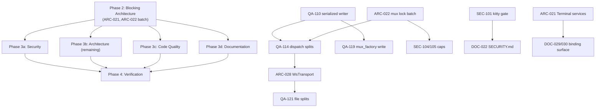

# Project Audit Report

> **Project**: par-term-emu-core-rust (v0.52.0, HEAD 17060c6)
> **Date**: 2026-09-26
> **Stack**: Rust (PyO3 0.29 bindings), Python 3.12+, TypeScript/Next.js web frontend, WebSocket streaming server, par-mux daemon
> **Audited by**: Claude Code Audit System — /opus-audit run (Opus 5 subagents, parsight graph at repo-db09184b0394f6287256c56299eaeb0f)

---

## Executive Summary

The crate is in good structural health: the 2026-09-22 cycle's Critical and High architecture findings (streaming loop duplication, mux god function, lock-holding persistence, stale API reference) are verified fixed in code, dependency audits come back clean across cargo/pip/bun, and the mux socket/state security model is solid. What this cycle surfaces instead are two classes of risk the previous pass could not see. First, a confirmed correctness defect in the newest streaming path: client input is written to the PTY from unordered `spawn_blocking` tasks, so keystrokes can be reordered (QA-110, Critical), and the same file still blocks the async runtime on mouse/focus writes. Second, a confirmed security defect the 09-22 pass left unaudited: the Kitty graphics `t=t` file medium deletes any file path named in terminal output (SEC-101, High — reproduced against a scratch file during this audit). The two remaining High-architecture themes are scale, not rot: `Terminal` has become a 420-method god type with a four-way sync surface, and the mux daemon still spawns PTY processes while holding the global tree mutex. Estimated effort for the Critical + High set is roughly 6–9 engineer-days; most Medium items are mechanical.

### Issue Count by Severity

| Severity | Architecture | Security | Code Quality | Documentation | Total |
|----------|:-----------:|:--------:|:------------:|:-------------:|:-----:|
| 🔴 Critical | 0 | 0 | 1 | 0 | **1** |
| 🟠 High     | 2 | 1 | 4 | 2 | **9** |
| 🟡 Medium   | 9 | 1 | 7 | 10 | **27** |
| 🔵 Low      | 7 | 5 | 7 | 6 | **25** |
| **Total**   | **18** | **7** | **19** | **18** | **62** |

Cross-domain duplicates were merged (QA-122 ⊆ ARC-029 logging; QA-114's `main()` portion overlaps ARC-038, kept in both with one remedy site). IDs continue the prior cycle's numbering to avoid collision (SEC-101+, ARC-021+, QA-110+, DOC-021+); QA-122 is intentionally skipped (merged).

---

## 🔴 Critical Issues (Resolve Immediately)

### [QA-110] Streaming PTY input can be reordered; mouse/focus writes block the async runtime (SEC-005 regression)
- **Area**: Code Quality (correctness; security-adjacent — see Blocking Notes)
- **Location**: `src/streaming/server.rs:1293` (Input), `:1466` (Paste), `:1369` (Mouse), `:1405` (FocusChange); writer at `src/streaming/session.rs:84`
- **Description**: Each `Input`/`Paste` message spawns its own `tokio::task::spawn_blocking` closure that takes `writer.lock()` and calls `write_all`. Nothing serializes these writes per session: the blocking pool runs them on separate threads and `parking_lot::Mutex` grants no arrival order, so two keystrokes ("a" then "b") can reach the shell as "ba". The `Mouse` and `FocusChange` arms still call `writer.lock()`/`write_all` directly on the tokio task — if a spawned Input write holds the mutex while blocked on a full PTY buffer, the async task blocks on the same mutex, the exact worker-freeze SEC-005 removed. No test covers input ordering.
- **Impact**: Silent input corruption in interactive sessions; one stalled foreground process can freeze a tokio worker and every session scheduled on it.
- **Remedy**: Give each session one writer — a dedicated blocking thread or a `spawn_blocking` loop draining an `mpsc`. All four input kinds enqueue bytes onto that channel. Add a test sending N sequential Input messages and asserting PTY order (`tests/test_streaming.rs`).

---

## 🟠 High Priority Issues

### [SEC-101] Kitty `t=t` (temp-file medium) deletes any file path named in terminal output
- **Area**: Security — CWE-73, CWE-22 / OWASP A01
- **Location**: `src/graphics/kitty.rs:923-982` (`load_file_data`, deletion at `:977-979`); reached from PTY output via `src/terminal/mod.rs:2876` → `build_graphic` → `decode_payload` (`kitty.rs:906-910`); mux interaction at `src/mux/pane.rs:458`
- **Description**: For `t=f`/`t=t` the payload is a filesystem path; the only check rejects `..` components, so absolute paths anywhere pass. For `t=t` the file is removed immediately after read, before image decode — a non-image payload still deletes its target. Kitty's own spec restricts `t=t` to a temp dir whose name contains `tty-graphics-protocol`; this implementation has neither restriction. Confirmed empirically: one `t=t` APC naming a scratch file deleted it.
- **Impact**: Untrusted output (SSH to a compromised host, `cat` of an untrusted file, log tail) can delete any file the user can delete. In par-mux, daemon panes set `retain_temp_files` (`pane.rs:458`), moving deletion to the rendering client. Applies to every embedder.
- **Remedy**: (1) For `t=t`: canonicalize, require the path under an allowed temp root (`std::env::temp_dir()`, `/tmp`, `/dev/shm`) with filename containing `tty-graphics-protocol`; refuse otherwise without deleting. (2) Decode/validate before deleting. (3) Add a terminal-level switch for file media (`t=f`/`t=t`) exposed in Python bindings and streaming config; default on only for the gated temp-file form. (4) Open with `O_NOFOLLOW`, `fstat` the handle (also closes SEC-103). (5) Regression tests: absolute path outside temp dir refused and survives; non-image temp file not deleted.

### [ARC-021] `Terminal` is a 420-method god object, mirrored by the Python surface
- **Area**: Architecture — cross-repo breaking risk
- **Location**: `src/terminal/mod.rs:1086` (struct), `:1252` (main impl); 47 `impl Terminal` blocks across `src/terminal/**` and `src/mouse.rs`; `python/par_term_emu_core_rust/_native.pyi:1672`
- **Description**: `mod.rs` is 3,682 lines holding ~30 `pub(crate)` state sub-structs and 170 `pub fn`; all `impl Terminal` blocks total 420 public methods (in-degree 93, #2 bridge symbol). Macros, recording, triggers, bookmarks, clipboard history, profiling, benchmarks, compliance, search, HTML export and screenshots are all methods on the VT state machine; the Python stub mirrors 386. `Terminal::screenshot`/`screenshot_to_file` (`mod.rs:2687-2761`) pull the renderer (≈700 KB embedded fonts) into the core type, so `sim` cannot drop it.
- **Impact**: Every feature widens one type; every change must sync across Rust impl, binding macros, `.pyi`, and `API_REFERENCE.md` (the four-way sync rule). Embedders wanting VT parsing alone compile everything. Test/compile blast radius is the whole crate.
- **Remedy**: Keep `Terminal` as the VT state machine; move non-VT features (MacroRecorder, TriggerEngine, Recorder, SearchIndex, Screenshotter, ComplianceRunner, Benchmarks) into services taking `&Terminal`/`&mut Terminal`, exposed as extension traits or companion objects, keeping deprecated forwarding methods for one minor release. Move `screenshot*` behind `screenshot::render_grid(...)` and feature-gate the screenshot module. Phase it: one feature area per PR; check par-term and par-term-emu-tui-rust before each phase (par-term references `terminal` at 77+ call sites).

### [ARC-022] The mux daemon spawns PTY processes while holding the global tree mutex
- **Area**: Architecture
- **Location**: `src/mux/dispatch.rs:502` (`cmd_split_window`), `:663` (`cmd_new_window`), `:229` (`cmd_new_session`); `src/mux/tree.rs:241,308,378` (`factory.create_pane(...)` inside `new_session_with_env` / `new_window_with_cwd` / `split_pane_in_window`)
- **Description**: `ctx.tree.lock()` is held across `create_pane`, which forks/execs the shell and starts its reader thread. Every other client command, `reap_dead_panes`, broadcasts and persist capture wait for the spawn.
- **Impact**: One slow spawn (heavy shell rc, slow cwd mount, Windows ConPTY) stalls every client; widens the deadlock surface ARC-002 fought (one self-deadlock already found in that refactor).
- **Remedy**: Two-phase tree API — reserve `PaneId` + geometry under the lock; release and `create_pane`; re-lock, insert, wire `on_output`, compute layout, or roll back the reservation on failure. Test with a `PaneFactory` that sleeps, asserting concurrent `list-panes` returns before the spawn completes. Run the Windows mux suite afterwards (ConPTY spawn timing). Land with ARC-032 and QA-115 as one lock-scope batch.

### [QA-111] The Python PTY tests are disabled everywhere, including locally
- **Area**: Code Quality
- **Location**: `tests/test_pty.py:10`, `tests/test_pty_resize_sigwinch.py:20`, `tests/test_nested_shell_resize.py:14` (module-level `pytestmark = pytest.mark.skip`); `.github/workflows/ci.yml:101-109` (`--ignore`)
- **Description**: 39+ PTY tests are skipped in-file (skip dates to the initial commit, `12924dc`), and CI ignores the files too — disabled twice. `make test` skips them on developer machines as well.
- **Impact**: `PyPtyTerminal` and `src/python_bindings/pty.rs` (1,545 lines) have zero Python-level coverage; regressions surface only indirectly via Rust tests.
- **Remedy**: Remove the module-level skips, keep the CI `--ignore` (or gate behind a `-m pty` marker), replace fixed sleeps with the `wait_until` poller in `tests/conftest.py`, and add a `make test-pty` target.

### [QA-112] The debug logger adds allocation and a global mutex to the parser hot path
- **Area**: Code Quality
- **Location**: `src/terminal/sequences/csi/mod.rs:28-33`; `src/debug.rs:136-164`; ~34 eager `format!` call sites (`src/terminal`, `src/grid`; 12 in `terminal/graphics.rs`)
- **Description**: `csi_dispatch_impl` allocates a params `Vec<i64>` per CSI sequence before checking the log level; `debug::is_enabled`/`debug::log` lock a global `parking_lot::Mutex<DebugLogger>` on every call; `debug::log(.., &format!(..))` sites build strings before the level check.
- **Impact**: Escape-heavy output pays an allocation plus a lock per sequence with logging off; with mux panes or streaming sessions, every parser thread contends on one lock.
- **Remedy**: Store the level in an `AtomicU8` (lock only for the file write); build the params Vec inside the enabled branch; convert eager sites to the `debug_*!` macros (lazy `format_args!`). Land alone before other `terminal/sequences/**` edits (~170 call sites depend on the macros).

### [QA-113] The SIGWINCH code exists in three copies that behave differently
- **Area**: Code Quality
- **Location**: `src/pty_session.rs` ~`:879` (reader thread — logs but no fallback), ~`:1095` (`resize` — group signal with PID fallback), ~`:1207` (`resize_pixels` — no fallback, silent)
- **Description**: Three raw `unsafe { libc::kill(..) }` blocks with divergent behavior and no `// SAFETY:` comments.
- **Impact**: Whether a resize reaches the child depends on which API the caller used; the "works via `resize` but not `resize_pixels`" bug class is built in.
- **Remedy**: Extract `fn send_sigwinch(pid: u32) -> io::Result<()>` with the group-then-PID fallback; call from all three sites; document the safety invariant once.

### [QA-114] Very long functions in dispatch code, concentrated in the churn hotspots
- **Area**: Code Quality
- **Location** (function, file:line, CC): `handle_csi_style` `src/terminal/sequences/csi/style.rs:10` (74); `main` `src/bin/streaming_server/main.rs:167` (67); `handle_client_message` `src/streaming/server.rs:1240` (62); `handle_csi_report` `src/terminal/sequences/csi/report.rs:7` (54); `handle_client` `src/mux/server.rs:415` (35, churn 22); `dispatch_command` `src/mux/dispatch.rs:138` (35, churn 19)
- **Description**: The two mux functions lead churn×complexity. Each `handle_client_message` arm repeats the same four steps (read-only check, writer fetch, metrics, write+log) — where QA-110's Mouse/FocusChange drift happened. `main` and `run_mux_mode` are 0.95 near-duplicates (also ARC-038).
- **Impact**: The most-edited code is the hardest to review; arms drift silently.
- **Remedy**: Split `handle_client_message` into per-variant methods sharing `enqueue_input(session, bytes)` (the QA-110 fix — split after it). Extract `serve_until_ctrl_c(server)` + banner printer from `main`. Pull `dispatch_command` arms into the existing `cmd_*` fns. Split SGR extended-color parsing out of `handle_csi_style`.

### [DOC-021] QUICKSTART never offers `pip install` and its source build fails on a fresh clone
- **Area**: Documentation
- **Location**: `QUICKSTART.md` (Installation, Next Steps, Help & Support)
- **Description**: Only install path shown is Rust toolchain + `git clone` + `maturin develop --release`. The PyPI wheel is never mentioned (README lists it first). `maturin develop` fails without an active venv and no venv step is given; "Next Steps" points at CLAUDE.md instead of BUILDING.md/CONTRIBUTING.md; no issues link.
- **Impact**: Every new Python user is pushed into an unnecessary toolchain install, then hits a build error.
- **Remedy**: Open with `pip install par-term-emu-core-rust` / `uv add`. Move the source build to an "Install from source" subsection starting with `make setup-venv && make dev`. Fix Next Steps and Help links.

### [DOC-022] SECURITY.md's par-mux section predates the 0.52.0 security release
- **Area**: Documentation
- **Location**: `docs/SECURITY.md` ("Multiplexer Daemon Security (par-mux, Local Attack Surface)")
- **Description**: Four statements contradict current code/docs: (1) fallback socket dir is now a per-UID 0700 directory with owner/mode verification and peer-euid refusal — not "the user's temp directory", and the socket is no longer the only trust boundary; (2) hook-report values are now validated (`hooks.rs` rejects invalid state/label) — not "unvalidated free text"; (3) on-disk state now includes per-session environment (potentially `SSH_AUTH_SOCK`) — omitted; (4) spawn quoting covers only the POSIX `sh -c` path, not `win_resume`/cmd bridge.
- **Impact**: Attack-surface assessors get an older, weaker model than what ships, and cannot see session env values landing on disk.
- **Remedy**: Rewrite the four subsections from `ipc.rs`, `hooks.rs`, `persist.rs`, `win_resume.rs`; cross-link MUX.md's "Socket and State Paths". Run after SEC-104/105 and SEC-101 so it documents the remediated state (also fold in SEC-107's kitty file-medium section update).

---

## 🟡 Medium Priority Issues

### Architecture

### [ARC-023] CI never runs automatically; every gating workflow is `workflow_dispatch`-only
- **Location**: `.github/workflows/ci.yml:3-4` (also `deployment.yml`, `release.yml`, `publish-*.yml`)
- **Description**: The 3-OS × 3-Python matrix, `sim` dependency-tree guard, mux suite and clippy run only on manual trigger; only `claude-code-review.yml` fires on PRs.
- **Impact**: A push to main can break Windows, the `sim` guard, or feature combos `make checkall` never builds on macOS; nothing surfaces until a release attempt.
- **Remedy**: Add `push: branches: [main]` + `pull_request:` (paths-ignore docs) — at minimum a cheap Linux job (fmt, clippy, `sim` tree guard, `cargo test --lib`) per push, full matrix dispatch-only. If dispatch-only is deliberate, record it in CONTRIBUTING.md.

### [ARC-024] `Cargo.lock` is gitignored despite shipping two CI-built binaries
- **Location**: `.gitignore`; `.github/workflows/deployment.yml:181`; `Cargo.toml:53-63`
- **Description**: Cargo's guidance for binary-bearing packages is to commit the lockfile. Release builds of `par-term-streamer`, wheels and `par-mux` resolve fresh each run (CLAUDE.md's Windows playbook even notes "no `--locked`").
- **Impact**: Release artifacts are not reproducible; a semver-compatible upstream bump can change a shipped binary with no commit here.
- **Remedy**: Commit `Cargo.lock`; add `--locked` to CI/release cargo invocations. Library consumers unaffected. Land before dependency-bump/audit work (SEC-106).

### [ARC-025] Streaming feature detection in the Python package is always true
- **Location**: `python/par_term_emu_core_rust/__init__.py:75-95,166-177`; `src/python_bindings/streaming.rs:1023-1059` (stubs), `:1215-1254` (non-streaming codec fns); `src/lib.rs:277-278,334-341`
- **Description**: Wheels build without `streaming`, but stub classes and codec fns still register (constructors raise `RuntimeError`), so the `except ImportError` branch never runs and `_has_streaming` is always True.
- **Impact**: Documented feature detection yields a runtime error instead of a clean capability check.
- **Remedy**: Export a native `HAS_STREAMING: bool` constant (`cfg!(feature = "streaming")`) from `register_constants` and base `_has_streaming` on it (non-breaking). Removing the stubs is breaking — defer to a major.

### [ARC-026] Layering inversions: Python concerns inside streaming; lower layers importing `terminal`
- **Location**: `src/streaming/protocol.rs:230-280` (35 `pydict` attrs); `src/streaming/py_convert.rs`; `src/grid/mod.rs:207,224` (`GridSnapshot` lives in terminal); `src/graphics/mod.rs:399,433` (`unix_millis`); `src/streaming/mux_factory.rs:22` (mux IPC internals)
- **Description**: Intended direction cell/grid → terminal → {streaming, mux} → python_bindings is broken in four places, forcing `python` to build the protocol layer and blocking grid/graphics extraction.
- **Impact**: Layer independence is impossible; mux IPC internals are an unversioned contract for streaming.
- **Remedy**: (1) Move `GridSnapshot` to `src/grid/snapshot.rs` with a re-export from `terminal::replay_snapshot` (on-disk serde JSON unchanged — run `cargo test --no-default-features --features rust-only,mux,serde` after). (2) Move `unix_millis` to `src/time.rs`. (3) Move `py_convert.rs` to `src/python_bindings/streaming_convert.rs`. (4) Replace `pydict` attrs with a binding-side conversion table. (5) Ordered-stream mode on `MuxClient` for `mux_factory`.

### [ARC-027] The streaming binary delivers events by 20 Hz polling through a double lock, duplicated in two tasks
- **Location**: `src/bin/streaming_server/bootstrap.rs:217-240, 552-578`; `:38,69,96,315` (`Arc<Mutex<PtySession>>`)
- **Description**: Both session paths spawn a `tokio::time::interval(50ms)` loop locking `Mutex<PtySession>`, cloning the Terminal, taking its write lock and calling `poll_events()` — near copies of each other — while the core's `TerminalObserver` push API exists and `PtySession` is already internally synchronized.
- **Impact**: Events up to 50 ms late; idle sessions take a write lock 20×/s contending with the PTY reader; two copies drift.
- **Remedy**: Register a `TerminalObserver` per session forwarding `terminal_event_to_server_message(event)` into an mpsc drained by the broadcast task; delete both loops; replace `Arc<Mutex<PtySession>>` with `Arc<PtySession>` plus interior mutability for resize/restart.

### [ARC-028] Residual of ARC-001: WS session prelude/loop and TLS/non-TLS accept loops still duplicated
- **Location**: `src/streaming/server.rs:1653-1795` (`run_ws_session`) vs `:1947-2133` (`handle_axum_websocket`); `:844-961` vs `:963-1115` (accept loops, ~130 lines apart)
- **Description**: Message arms are unified (ARC-001 fix) but connect message, mode-sync prelude, subscriptions, keepalive, rate limiter and `select!` body are written twice; the accept loops are one copy with a TLS handshake inserted. `server.rs`: 3,252 lines, total CC 349.
- **Impact**: Every future protocol behavior must be written twice; the second site fails silently.
- **Remedy**: `WsTransport` trait (send/recv/close) implemented for `Client<S>` and the axum socket; one `run_session<T>`; collapse accept loops over an `Acceptor` abstraction; split `server.rs` into `accept.rs`, `session_loop.rs`, `http.rs`, facade. Sequence after QA-110 + QA-114.

### [ARC-029] Residual of ARC-010: the core library logs through a private file logger embedders cannot route
- **Location**: `src/debug.rs` (`DEBUG_LEVEL` → `$TMPDIR/par_term_emu_core_rust_debug_rust_{pid}.log`, 86 `debug_*!` sites); `src/mux/*` (26 `log::` sites); `src/bin/streaming_server` (`tracing`); `src/grid/scroll.rs:152,198` (`eprintln!`)
- **Description**: Three logging mechanisms by layer; the core VT/streaming path bypasses the `log` facade the crate already depends on. (Absorbs QA-122, the "five logging mechanisms" finding.)
- **Impact**: Embedders cannot capture core diagnostics; the debug-build `eprintln!` writes into host TUI stderr.
- **Remedy**: Re-implement `debug_*!` on `log::` with per-category targets; keep the file sink as an opt-in `log` backend installed by the Python module/binaries; replace the two `eprintln!` with `log::debug!`.

### [ARC-030] Incomplete C FFI surface presented as an embedding API
- **Location**: `src/ffi.rs:1-5` (docs claim Swift/Kotlin/C++ embedding), `:370,385,402,421` (only four `extern "C"` fns); `Cargo.toml:51`
- **Description**: The C API can read state and attach observers but exports no constructor/destructor/`process()`/resize/input and ships no header; no caller outside `ffi_tests.rs`; no sister repo references it.
- **Impact**: Four permanently public unsafe symbols with an unusable-as-documented surface.
- **Remedy**: Option (a), cheapest: put `ffi` behind an opt-in `ffi` feature, mark experimental. Option (b): complete it (lifecycle fns, cbindgen header in CI, `staticlib` under the feature).

### [ARC-031] Dead public `streaming::Broadcaster<S>`
- **Location**: `src/streaming/broadcaster.rs` (318 lines), re-exported `src/streaming/mod.rs:82`
- **Description**: Zero callers and zero non-test references; sessions broadcast via `StreamSessionState::broadcast_tx`; no sister-repo use.
- **Impact**: A second, unused fan-out abstraction in the public API.
- **Remedy**: `#[deprecated]` next minor, remove next breaking (public API on crates.io — no outright delete).

### Code Quality

### [QA-115] `reap_dead_panes` decides and acts under separate lock acquisitions
- **Location**: `src/mux/server.rs:842-852`
- **Description**: Four consecutive `tree.lock()` calls (window lookup, last-pane check, kill) with client threads able to split/kill in the gaps; the doc comment justifies relocking only around broadcast.
- **Impact**: Narrow race — reaper can try `kill_pane` on a pane that became the last (refused, not reaped this tick) or kill a window that just gained a pane.
- **Remedy**: Hold one guard across lookup + last-pane check + kill; drop before broadcasting. Part of the ARC-022 lock-scope batch.

### [QA-116] Most `unsafe` blocks have no SAFETY comment
- **Location**: 57 `unsafe` occurrences vs 9 `// SAFETY:` comments. Uncommented: `pty_session.rs` (3 `libc::kill`), `mux/foreground.rs:245,285,346,360` (sysctl), `bin/streaming_server/cli.rs:22` (ioctl), `mux/client.rs:606`, `mux/pane.rs:1224`, `bin/par_mux/main.rs:293,308,349,362` (fork/dup2/sigaction), `ffi.rs:237-256` (`SharedState::drop`)
- **Remedy**: Add `// SAFETY:` at each site; consider `#![warn(clippy::undocumented_unsafe_blocks)]`. The fork site deserves async-signal-safety review.

### [QA-117] The `unsafe impl Send/Sync` on the Python observers are probably unnecessary
- **Location**: `src/python_bindings/observer.rs:447-448, 487-488`
- **Description**: In pyo3 0.29 `Py<T>` is already `Send + Sync`; the manual impls switch off compiler checking.
- **Remedy**: Delete the four impls and compile in a worktree (`make checkall`); if it builds they were never needed.

### [QA-118] The PTY writer lock silently drops all input if ever poisoned
- **Location**: `src/streaming/session.rs:84` (the only `std::sync` lock in streaming); read with `.read().ok()` at `server.rs:1280,1347,1387,1445`
- **Impact**: After a poisoning panic, the session looks connected but ignores every keystroke, silently.
- **Remedy**: Switch to `parking_lot::RwLock` to match the module (or log on poison). Fold into QA-110's writer rework.

### [QA-119] Blocking lock and write inside an async resize task
- **Location**: `src/streaming/mux_factory.rs:326-331` (also `SendKeysWriter` at `:292`)
- **Description**: A `tokio::spawn` task takes the synchronous daemon-socket mutex and does blocking `writeln!`/`flush` — the mux-adapter twin of QA-110's class.
- **Remedy**: `spawn_blocking`, or route through the QA-001... er, QA-110 per-session writer queue. Not parallel with QA-110.

### [QA-120] `_native.pyi` is a large hand-regenerated artifact with no drift check
- **Location**: `python/par_term_emu_core_rust/_native.pyi` (2,371 lines, 1,331 functions); Makefile `stubs` target (`:281`)
- **Description**: CI pyrights the stub but never checks it matches the compiled module; nothing fails when a binding is added without `make stubs`.
- **Remedy**: CI step: `make stubs && git diff --exit-code`, or `mypy.stubtest` against the built wheel.

### [QA-121] Large files concentrate change
- **Location**: `terminal/mod.rs` (3,682), `pty_session.rs` (3,326), `streaming/server.rs` (3,252), `graphics/kitty.rs` (3,193), `mux/server.rs` (2,820), `python_bindings/common.rs` (2,741)
- **Remedy**: Split `streaming/server.rs` per ARC-028; move the `pty_session.rs` reader thread to its own module; run parsight `propose_decomposition` per file first. Sequence last among the server.rs items.

### Documentation

### [DOC-023] README "Running Tests" gives commands that fail
- **Location**: `README.md`
- **Description**: Suggests `cargo test` + `pytest tests/`; BUILDING.md itself warns plain `cargo test` fails (`extension-module`), and `pytest` without `make dev` imports an unbuilt module.
- **Remedy**: `make test` / `make test-rust` / `make test-python`; link BUILDING.md for single tests.

### [DOC-024] README web-frontend build names the wrong package manager and port
- **Location**: `README.md` ("Web Terminal Frontend > Building from Source")
- **Description**: Says `npm install` and port 8030; repo ships `bun.lock`, Makefile uses `bun`, dev server is port 3000.
- **Remedy**: `make web-install` / `make web-dev` (3000) / `make web-build-static`, or the matching bun commands.

### [DOC-025] Dependency snippets pinned to `0.50` behind a breaking change
- **Location**: `README.md` (feature table); `docs/RUST_USAGE.md` (9 lines)
- **Description**: Snippets say `version = "0.50"` while 0.52.0 broke `PaneFactory::create_pane` embedders. Second occurrence of this drift (DOC-008 last cycle).
- **Remedy**: Drop the version (`cargo add ... --no-default-features -F pty_session`) or use a placeholder; point to crates.io.

### [DOC-026] Feature descriptions wrong; ARCHITECTURE.md copies `[features]` verbatim
- **Location**: `README.md`; `docs/RUST_USAGE.md`; `docs/ARCHITECTURE.md`
- **Description**: `full` described as "All features" but is `python + streaming + streaming-bin` (no mux/serde/jemalloc/sim); ARCHITECTURE.md's pasted block already drifted (`mux` line lacks `clap`).
- **Remedy**: Describe `full` precisely in both tables; replace the ARCHITECTURE.md copy with a pointer + prose table. After ARC-034/035 feature changes.

### [DOC-027] The inherited-environment drop list is stale in two docs
- **Location**: `docs/SECURITY.md` ("Inherited Environment"); `docs/CROSS_PLATFORM.md`
- **Description**: Both list 6 dropped vars; `DROP_VARS` in `src/pty_session.rs` has 12 (adds `CLAUDECODE`, `CLAUDE_CODE_SESSION_ID`, `CLAUDE_CODE_CHILD_SESSION`, `CLAUDE_CODE_MESSAGING_TOKEN`, `OMPCODE`, `CODEX_THREAD_ID`) plus every `PAR_MUX_*` by prefix.
- **Remedy**: List the full set or name `DROP_VARS` as source of truth; document the `PAR_MUX_*` prefix rule.

### [DOC-028] CONFIG_REFERENCE says the emulator reads no environment variables
- **Location**: `docs/CONFIG_REFERENCE.md` ("Environment Variables"); `docs/STREAMING.md`
- **Description**: Code reads `PAR_TERM_REPLY_XTWINOPS`, `DEBUG_LEVEL`, `PAR_MUX_ENV`, `PAR_MUX_ALLOW_NESTED`, `XDG_RUNTIME_DIR`; streamer env `PAR_TERM_FORCE_WEB_DOWNLOAD` appears in no doc (38 of 39 others are in STREAMING.md).
- **Remedy**: Replace with a table (variable, component, default, effect) linking STREAMING.md/MUX.md; add the missing var; sweep computed names too.

### [DOC-029] The Python type stub has no docstrings and mostly `Any` types
- **Location**: `python/par_term_emu_core_rust/_native.pyi`; generator `scripts/generate_stubs.py`
- **Description**: 1,331 `def`s, 999 `-> Any`, 0 docstrings — editor users never see the Rust-side Google-style docstrings.
- **Remedy**: Generator emits each object's runtime `__doc__`; longer term `#[pyo3(text_signature)]` annotations or a hand-maintained overlay. After ARC-021 phases settle the surface.

### [DOC-030] The binding docstring gap reported fixed last cycle is still open
- **Location**: `src/python_bindings/terminal/{bookmark,image,metrics,notification,scrollback,search,selection,text}_api.rs`; `src/python_bindings/pty.rs`; `src/python_bindings/streaming.rs`
- **Description**: Eight `*_api.rs` files have zero `Example` sections; `pty.rs` has 7 and `streaming.rs` has 4 across dozens of methods. Last cycle's remediation added Args/Returns only — the record overstates what was done.
- **Remedy**: Add Example sections file by file, starting with `pty.rs` and `streaming.rs`. After ARC-021 phases touching those files.

### [DOC-031] Design decisions cited in code point to a document outside this repo
- **Location**: `docs/par-mux.md` → `~/Repos/par-agent-os/par-mux.md` (cited as `D1`/`D3.x`/`D5` from `src/mux/`, `Cargo.toml`, tests)
- **Remedy**: Publish/link the design doc, or vendor a one-line-per-D-number decision record into `docs/`.

### [DOC-032] Legacy event-shape docs and observer type hints contradict the 0.50.0 change
- **Location**: `python/par_term_emu_core_rust/observers.py`; `docs/API_REFERENCE.md` (`poll_events_legacy` bullets); the `poll_events_legacy` docstring in `src/python_bindings/terminal/mod.rs`
- **Description**: Callbacks typed `Callable[[dict[str, str]], None]` but 0.50.0 ships native int/bool/None values; "pre-0.51" should be "pre-0.50"; "kept for one release" is stale with no warning emitted.
- **Remedy**: Hints → `dict[str, Any]`; fix the version; emit `DeprecationWarning` with a named removal version or update the wording (decide alongside ARC-021's deprecation window).

---

## 🔵 Low Priority / Improvements

### Security
- **[SEC-103] Check-then-read race in Kitty file loading** — `kitty.rs:943-971` checks `exists()`/`is_file()`/`metadata().len()`, then `fs::read` separately; a swap can bypass the 100 MB cap or regular-file check (CWE-367). Fixed by SEC-101's handle-based open.
- **[SEC-104] par-mux reads client lines with no length cap** — `mux/server.rs:477-505` accumulates `read_line` unbounded; same-user trust bounds impact to self-DoS (CWE-770). Remedy: 1 MiB cap answering `%error`. After the ARC-022 lock batch / QA-114 mux work.
- **[SEC-105] Hook-report JSON path has no size bound** — same read loop; values are free text persisted into pane metadata/state. Add the same size bound.
- **[SEC-106] `paste` 1.0.15 unmaintained (RUSTSEC-2024-0436)** — only `cargo audit` result, transitive. Track; replace when upstream moves. After ARC-024 pins the lockfile.
- **[SEC-107] Docs understate the Kitty file-medium risk** — `docs/SECURITY.md` graphics section should state file media are driven by terminal output and describe the SEC-101 gate once it lands.

### Architecture
- **[ARC-032] Residual of ARC-003: persist capture still clones pane snapshots under the tree lock on cache miss** — `dispatch.rs:219` → `MuxPane::persisted_snapshot` (`pane.rs:213-234`); cache key includes `update_generation` so active panes re-clone per structural command; capping (`persist.rs:517`) runs after the clone. Remedy: collect `Arc<RwLock<Terminal>>` handles under the lock, release, then capture. Part of the ARC-022 batch.
- **[ARC-033] `checkall` runs the mutating `lint` target** — `Makefile:303` chains `clippy --fix --allow-dirty`, `cargo fmt`, `ruff --fix` into the gate. Remedy: `checkall` uses check-only forms; `lint` stays the explicit fixer.
- **[ARC-034] tokio `test-util` enabled in the non-dev dependency** — `Cargo.toml:88`; only users are `#[cfg(test)]` in `rate_limit.rs:91-124`; dev-dep already enables it. Drop from `[dependencies]`.
- **[ARC-035] `serde_yaml_ng` unconditional for one module** — used only by `macros.rs:159-172`; every profile compiles it. Gate behind a `macros-yaml` feature enabled by `python`, or merge into `serde`.
- **[ARC-036] 16 `#[macro_export]` binding macros leak into the rlib root namespace** — `python_bindings/common.rs:48-2477`. Remedy: `pub(crate) use` macro re-exports.
- **[ARC-037] Root-directory clutter** — `debug/` (three committed ad-hoc scripts), audit artifacts at root, `theme.css`. Remedy: move audits to `docs/audits/<date>/`, scripts to `scripts/debug/`.
- **[ARC-038] `streaming_server/main.rs::main` CC 67 near-duplicates `run_mux_mode` (0.95)** — `main.rs:96-143` vs `:167-650`. Remedy: shared "build config, build server, spawn tasks, await shutdown" skeleton in `bootstrap.rs`; modes differ only in `SessionFactory`. Shares the QA-114 remedy site.

### Code Quality
- **[QA-123] FFI `cell_count` computed separately from buffer length** — `ffi.rs:142,206-208`; sound today by convention. Derive from `cells_boxed.len()`; `Box::into_raw` instead of `as_mut_ptr` + `mem::forget`.
- **[QA-124] Stringly-typed mouse `event_type`** — `protocol.rs:541,812,1393,1609` + `server.rs`; a typo like `"relase"` reads as press. Use a protocol enum.
- **[QA-125] 18 `#[allow(clippy::too_many_arguments)]` suppressions** — pyo3 constructors justified; protocol constructors should use builders (the `ConnectedBuilder` pattern exists).
- **[QA-126] Near-duplicate helpers** — `sample_half_block` (`graphics/mod.rs:519` vs `python_bindings/types/graphics.rs:167`, sim 0.99 — Python should call the Rust one); `resize_pixels` (`pty.rs:187` vs `terminal/mod.rs:142`); `encode_client_message`/`encode_server_message` (`streaming.rs`); four `create_pane` variants (`mux/pane.rs`); underline renderers (`screenshot/renderer.rs:831-910`).
- **[QA-127] Weak `is not None` assertions** — 25 in `test_terminal.py`, 11 in `test_terminal_bindings.py`; tighten the standalone ones (e.g. `test_terminal.py:79` checks non-None without the value).
- **[QA-128] Library `unwrap()` on known-safe paths** — `server.rs:2277` (`HeaderValue::from_static` removes it), `file_transfer.rs:165`.
- **[QA-129] Dead-code report is false positives; nothing confirmed dead** — all 59 parsight candidates verified live (benches, proc-macro, `.pyi`, hooks, FFI exports, pymodule...). Only `GraphicsStore::with_limits` (`graphics/mod.rs:597`) lacks an in-repo caller but is public API — keep unless sister projects confirm. Do not delete from the raw list.

### Documentation
- **[DOC-033] Remaining broken intra-doc links** — `docs/API_REFERENCE.md` (`CHANGELOG.md#0500---2026-09-21` needs `../` and date 2026-09-23); `docs/SECURITY.md` TOC emoji-slug mismatch.
- **[DOC-034] Code fences without a language tag** — `VT_TECHNICAL_REFERENCE.md` (15), `ADVANCED_FEATURES.md` (6), `MACROS.md` (5), `STREAMING.md` (3), `TESTING_KITTY_ANIMATIONS.md` (3), +1 each in `CONFIG_REFERENCE.md`, `GRAPHICS_TESTING.md`, `MATURIN_BEST_PRACTICES.md`.
- **[DOC-035] README carries eight releases of What's New before the Features section** — ~50 lines; 0.45/0.44 paragraphs cite dead paths; duplicated in CHANGELOG. Keep current release + latest breaking note.
- **[DOC-036] CHANGELOG version compare links stop at 0.37.0** — add 0.38.0→0.52.0 and `[Unreleased]`.
- **[DOC-037] A few public symbols and one module lack docs; nothing prevents regression** — `screenshot/mod.rs` (no `//!`), `grid/scroll.rs::Grid::resize`, `mux/ipc.rs::ConnectionAbort`, observer `new` fns; add scoped `#![warn(missing_docs)]`.
- **[DOC-038] Stale audit artifacts tracked at the repo root** — archive the 09-22 cycle's files (and this cycle's, when superseded) under `docs/audits/`. Run last.

---

## Detailed Findings

### Architecture & Design
Coverage: repository stats (419 files, 12,571 symbols, 16.2K CALLS edges), central/bridge symbols, communities, blast radius of core modules, plus direct reads of the feature matrix, locking discipline, persistence, protocol build-time checks, and the binding dedup layer. Prior cycle's ARC-001..017 verified remediated (dispatch decomposition exists; `handle_client_message` shared by both WS loops; persist worker coalesces off-lock; per-instance shutdown handle). Parsight metric artifacts deliberately excluded from findings: `register_classes` CC-67 is a straight `?` list; `_native.pyi` "god object" is generated; CHANGELOG/API_REFERENCE bridge rows are markdown nodes. Full issue list above. Health: Good — key concern is `Terminal`'s 420-method surface (ARC-021).

### Security Assessment
Scope this pass: the par-mux daemon surface (unaudited last cycle), dependency audits, unsafe/FFI, the graphics file-loading path, and line-level re-verification of the prior streaming fixes. `cargo audit` (448 crates): clean except RUSTSEC-2024-0436 (`paste`, transitive); `bun audit` (486 packages): clean; `pip-audit` on the exported uv lock: clean. No hardcoded secrets in reviewed sources. Prior SEC-001..011 streaming fixes verified present (10 s handshake timeout on all three accept paths, 64 KiB input cap, OSC 52 read gate). The one real defect found is SEC-101, reproduced against an agent-created scratch file only — no daemon, server, or other live process was started or touched during the assessment. Full issue list above. Health: Good — highest risk is the Kitty file-media path.

### Code Quality
Coverage: parsight analytics (dead code, hotspots, complexity, duplicate lanes) with every dead-code candidate manually classified (all 59 live — see QA-129), unwrap/expect census (11 unwraps + 28 expects outside tests, each guarded or invariant-stated), allow/noqa census (27 `#[allow]`, 18 `too_many_arguments`; 12 Python noqa/type: ignore; 0 frontend suppressions), test inventory (2,831 Rust `#[test]`, 434 Python test functions across 48 files + 31 in-crate modules). Zero TODO/FIXME/HACK markers anywhere. Python PTY coverage is effectively zero (QA-111). Health: Good — primary concern is the streaming input write path (QA-110).

### Documentation Review
Coverage: every tracked Markdown file (README, QUICKSTART, CONTRIBUTING, CHANGELOG, CLAUDE.md, 24 docs/ files, examples/ and frontend READMEs), the Python stub, binding docstrings and public Rust symbols. Method: parsight `find_broken_doc_links` (38 high-confidence rows — most classified false positives: CHANGELOG historical paths, style-guide placeholders, plans/audit files), a script resolving every relative `.md` link and anchor, and a bidirectional `_native.pyi` ↔ `API_REFERENCE.md` comparison (clean in both directions). `MUX.md` is current with 0.52.0 including the per-UID socket guard and SpawnContext. Full issue list above. Health: Good — most impactful gap is QUICKSTART (DOC-021).

---

## Remediation Roadmap

### Immediate Actions
1. QA-110 — per-session serialized PTY writer (correctness + SEC-005 guarantee).
2. SEC-101 — gate Kitty file media; stop deleting user files from terminal output.
3. QA-111 — re-enable the Python PTY tests locally (keep CI ignore until stable).

### Short-term (Next 1–2 Sprints)
1. QA-112 (debug hot path, land alone), QA-113 (SIGWINCH dedup), QA-114 (dispatch splits, after QA-110).
2. ARC-022 + ARC-032 + QA-115 as one mux lock-scope batch; then SEC-104/105.
3. ARC-023 (CI triggers), ARC-024 (commit Cargo.lock, `--locked`).
4. DOC-021 (QUICKSTART), DOC-022 (SECURITY.md rewrite, after the SEC fixes).
5. SEC-102 + SEC-103 (same kitty.rs rework as SEC-101).

### Long-term (Backlog)
1. ARC-021 phased service extraction (cross-repo; deprecation window).
2. ARC-026 layering moves, ARC-027 observer push, ARC-028 transport unification, ARC-029 log facade.
3. Remaining Medium/Low documentation and code-quality items; enhancements ENH-016..018.

---

## Positive Highlights

1. **Feature-profile discipline is enforced and tested**: `compile_error!` rejects `sim`+`python` (`lib.rs:51`), and CI's `cargo tree` guard asserts `sim` pulls no tokio/portable-pty/prost/axum (`ci.yml:143`).
2. **The 09-22 audit's architecture findings actually shipped**: dispatch decomposition, unified `handle_client_message`, coalescing off-lock persist worker, per-instance shutdown handle — all verified in code this cycle.
3. **par-mux socket security is solid**: 0600 socket, per-UID 0700 directory verified before bind and connect, fail-closed peer-euid check that doesn't kill the listener, owner-only SDDL on Windows pipes.
4. **The state file is written safely**: created 0600 at open, fsync + atomic rename, corrupt state quarantined not deleted; resume argv is single-quoted POSIX with hook argv shape-validated.
5. **Wire-format drift is caught at build time**: the checked-in `terminal.pb.rs` carries an FNV-1a proto checksum verified by `build.rs`; a build-SHA stamp lets daemon and clients detect version skew.
6. **The Python binding dedup layer works**: `TerminalAccess` + themed macros removed ~155 duplicated methods; API_REFERENCE.md covers 100% of stub methods and classes, verified bidirectionally.
7. **Production `unwrap`/`expect` discipline**: every non-test instance guarded or carrying a stated invariant; zero TODO/FIXME markers; frontend has no `any`/non-null assertions.
8. **Dependency posture is clean**: cargo (448 crates), pip, and bun audits all clean except one transitive unmaintained warning.
9. **The core's dependency direction is mostly clean**: terminal/grid/graphics/screenshot never import streaming/mux/python_bindings/pty_session.

---

## Audit Confidence

| Area | Files Reviewed | Confidence |
|------|---------------|-----------|
| Architecture | ~120 (stats + reads across all feature layers) | High |
| Security | ~60 incl. mux daemon, FFI, graphics; 3 dependency audits run | High |
| Code Quality | ~100 incl. full dead-code classification and hot-path reads | High |
| Documentation | ~35 (all tracked Markdown + stub + docstrings) | High |

*All four domain agents completed; no domain was skipped. The security agent's SEC-101 repro touched only a scratch file it created.*

---

## Remediation Plan

> This section is generated by the audit and consumed directly by `/fix-audit`.
> It pre-computes phase assignments and file conflicts so the fix orchestrator
> can proceed without re-analyzing the codebase.

### Phase Assignments

#### Phase 1 — Critical Security (Sequential, Blocking)
*No Critical security issues found this cycle.*

| ID | Title | File(s) | Severity |
|----|-------|---------|----------|
| — | (empty) | — | — |

#### Phase 2 — Blocking Architecture (Sequential, Blocking)
*No Critical architecture issues; ARC-021 and ARC-022 are promoted here because they explicitly block Code Quality and Documentation items.*

| ID | Title | File(s) | Severity | Blocks |
|----|-------|---------|----------|--------|
| ARC-021 | Terminal god object (phase-1 non-breaking slice) | `src/terminal/mod.rs`, `src/screenshot/`, `src/python_bindings/**`, `_native.pyi` | High | DOC-029, DOC-030, QA-120 |
| ARC-022 (+ARC-032, QA-115) | Mux spawn under tree mutex (one lock-scope batch) | `src/mux/dispatch.rs`, `src/mux/tree.rs`, `src/mux/pane.rs`, `src/mux/server.rs` | High | QA-114 (mux part), SEC-104, SEC-105 |

#### Phase 3 — Parallel Execution

**3a — Security (remaining)**
| ID | Title | File(s) | Severity |
|----|-------|---------|----------|
| SEC-101 | Kitty t=t deletes arbitrary files | `src/graphics/kitty.rs`, `src/terminal/mod.rs`, `src/python_bindings/**`, `src/mux/pane.rs` | High |
| SEC-102 | Kitty t=f reads/displays arbitrary files | `src/graphics/kitty.rs` | Medium |
| SEC-103 | Check-then-read race (closes with SEC-101) | `src/graphics/kitty.rs` | Low |
| SEC-104 | Mux client-line length cap | `src/mux/server.rs` | Low |
| SEC-105 | Hook-report JSON size bound | `src/mux/server.rs` | Low |
| SEC-106 | paste unmaintained — track | `Cargo.lock`, `Cargo.toml` | Low |
| SEC-107 | SECURITY.md kitty file-medium section | `docs/SECURITY.md` | Low |

**3b — Architecture (remaining)**
| ID | Title | File(s) | Severity |
|----|-------|---------|----------|
| ARC-023 | CI triggers | `.github/workflows/ci.yml` | Medium |
| ARC-024 | Commit Cargo.lock + --locked | `.gitignore`, `Cargo.lock`, workflows | Medium |
| ARC-025 | Native HAS_STREAMING constant | `src/lib.rs`, `src/python_bindings/streaming.rs`, `python/**` | Medium |
| ARC-026 | Layering moves (GridSnapshot, unix_millis, py_convert, MuxClient) | `src/grid/`, `src/graphics/`, `src/terminal/replay_snapshot.rs`, `src/streaming/` | Medium |
| ARC-027 | Observer-push event delivery | `src/bin/streaming_server/bootstrap.rs` | Medium |
| ARC-028 | WsTransport unification + server.rs split | `src/streaming/server.rs` | Medium |
| ARC-029 | debug_*! on log facade (absorbs QA-122) | `src/debug.rs`, `src/grid/scroll.rs`, crate-wide macro sites | Medium |
| ARC-030 | FFI behind opt-in feature | `src/ffi.rs`, `Cargo.toml` | Medium |
| ARC-031 | Deprecate dead Broadcaster | `src/streaming/broadcaster.rs`, `mod.rs` | Medium |
| ARC-033 | checkall uses check-only lints | `Makefile` | Low |
| ARC-034 | Drop tokio test-util from deps | `Cargo.toml` | Low |
| ARC-035 | Gate serde_yaml_ng | `Cargo.toml`, `src/macros.rs` | Low |
| ARC-036 | macro_export → pub(crate) | `src/python_bindings/common.rs` | Low |
| ARC-037 | Root clutter cleanup | `debug/`, root artifacts | Low |
| ARC-038 | streaming main/run_mux_mode skeleton | `src/bin/streaming_server/main.rs`, `bootstrap.rs` | Low |

**3c — Code Quality (all)**
| ID | Title | File(s) | Severity |
|----|-------|---------|----------|
| QA-110 | Serialized per-session PTY writer | `src/streaming/server.rs`, `session.rs`, `tests/test_streaming.rs` | Critical |
| QA-111 | Re-enable Python PTY tests | `tests/test_pty*.py`, `test_nested_shell_resize.py`, `ci.yml`, `Makefile` | High |
| QA-112 | Debug logger off hot path | `src/debug.rs`, `src/terminal/sequences/csi/mod.rs` | High |
| QA-113 | send_sigwinch dedup | `src/pty_session.rs` | High |
| QA-114 | Split dispatch giants (after QA-110; mux part after Phase 2) | `src/streaming/server.rs`, `src/terminal/sequences/csi/{style,report}.rs`, `src/bin/streaming_server/main.rs`, `src/mux/*` | High |
| QA-115 | reap_dead_panes single lock scope (Phase 2 batch) | `src/mux/server.rs` | Medium |
| QA-116 | SAFETY comments + lint | 10 files (see issue) | Medium |
| QA-117 | Drop unneeded unsafe impl Send/Sync | `src/python_bindings/observer.rs` | Medium |
| QA-118 | parking_lot for PTY writer lock (in QA-110 rework) | `src/streaming/session.rs` | Medium |
| QA-119 | Unblock mux_factory resize write (after QA-110) | `src/streaming/mux_factory.rs` | Medium |
| QA-120 | Stub drift check in CI | `Makefile`, `.github/workflows/ci.yml` | Medium |
| QA-121 | Large-file splits (last; per ARC-028/QA-110) | 6 files (see issue) | Medium |
| QA-123 | FFI cell_count from len | `src/ffi.rs` | Low |
| QA-124 | Mouse event_type enum | `src/streaming/protocol.rs` | Low |
| QA-125 | Builders for protocol constructors | `src/streaming/protocol.rs` | Low |
| QA-126 | Dedup near-duplicate helpers | 5 sites (see issue) | Low |
| QA-127 | Tighten weak asserts | `tests/test_terminal*.py` | Low |
| QA-128 | Remove known-safe unwraps | `src/streaming/server.rs`, `src/terminal/file_transfer.rs` | Low |
| QA-129 | No deletion — dead-code list is false positives | — (no code change) | Low |

**3d — Documentation (all)**
| ID | Title | File(s) | Severity |
|----|-------|---------|----------|
| DOC-021 | QUICKSTART install paths | `QUICKSTART.md` | High |
| DOC-022 | SECURITY.md mux section rewrite (after SEC-101/104/105) | `docs/SECURITY.md` | High |
| DOC-023 | README test commands | `README.md` | Medium |
| DOC-024 | README frontend bun/port | `README.md` | Medium |
| DOC-025 | Unpin dependency snippets | `README.md`, `docs/RUST_USAGE.md` | Medium |
| DOC-026 | Feature table accuracy (after ARC-034/035) | `README.md`, `docs/RUST_USAGE.md`, `docs/ARCHITECTURE.md` | Medium |
| DOC-027 | Env drop list current | `docs/SECURITY.md`, `docs/CROSS_PLATFORM.md` | Medium |
| DOC-028 | Env var reference table | `docs/CONFIG_REFERENCE.md`, `docs/STREAMING.md` | Medium |
| DOC-029 | Stub docstrings (after ARC-021) | `scripts/generate_stubs.py`, `_native.pyi` | Medium |
| DOC-030 | Binding Examples (after ARC-021) | `src/python_bindings/**` | Medium |
| DOC-031 | Vendor/publish mux decision record | `docs/par-mux.md` | Medium |
| DOC-032 | Legacy event docs (decide with ARC-021 window) | `observers.py`, `API_REFERENCE.md`, binding docstring | Medium |
| DOC-033 | Broken intra-doc links | `docs/API_REFERENCE.md`, `docs/SECURITY.md` | Low |
| DOC-034 | Fence language tags | 8 docs files | Low |
| DOC-035 | Trim README What's New | `README.md` | Low |
| DOC-036 | CHANGELOG compare links | `CHANGELOG.md` | Low |
| DOC-037 | Missing docs + missing_docs lint | `src/screenshot/mod.rs`, 3 more, `src/lib.rs` | Low |
| DOC-038 | Archive stale audit artifacts (last) | repo root | Low |

### File Conflict Map
*Files touched by issues in multiple domains. Fix agents must read current file state before editing — a prior agent may have already changed these.*

| File | Domains | Issues | Risk |
|------|---------|--------|------|
| `src/streaming/server.rs` | QA + ARC + (SEC prior) | QA-110, QA-114, QA-118, QA-121, QA-124(adj), QA-125, QA-128, ARC-028 | ⚠️ Read before edit; strict order QA-110 → QA-114 → ARC-028 → QA-121 |
| `src/terminal/mod.rs` | SEC + ARC + QA | SEC-101, ARC-021, QA-121 | ⚠️ Read before edit |
| `src/mux/server.rs` | SEC + ARC + QA | SEC-104, SEC-105, QA-114, QA-115, QA-121, ARC-032(adj) | ⚠️ Read before edit |
| `src/mux/dispatch.rs` | ARC + QA | ARC-022, ARC-032, QA-114 | ⚠️ Read before edit |
| `src/mux/pane.rs` | SEC + ARC + QA | SEC-101, ARC-022, ARC-032, QA-126 | ⚠️ Read before edit |
| `src/graphics/kitty.rs` | SEC + QA | SEC-101, SEC-102, SEC-103, QA-121 | ⚠️ SEC first, one rework |
| `docs/SECURITY.md` | SEC + DOC | SEC-107, DOC-022, DOC-027, DOC-033 | ⚠️ DOC-022 after SEC fixes land |
| `python/par_term_emu_core_rust/_native.pyi` | ARC + QA + DOC | ARC-021, QA-120, DOC-029 | ⚠️ Regenerate, never hand-edit |
| `Makefile` | QA + DOC + ARC | QA-111, QA-120, ARC-033 | ⚠️ Read before edit |
| `Cargo.toml` | ARC (+SEC-106 adjacency) | ARC-024, ARC-030, ARC-034, ARC-035 | ⚠️ Batch the feature/dep edits |
| `src/graphics/mod.rs` | ARC + QA | ARC-026, QA-126, QA-129(adj) | ⚠️ ARC-026 first |
| `src/bin/streaming_server/main.rs` / `bootstrap.rs` | QA + ARC | QA-114, ARC-038, ARC-027 | ⚠️ QA-114 split then ARC-038 skeleton |

*Single-domain multi-issue files (`src/pty_session.rs` QA-113/116/121/126; `src/streaming/protocol.rs` QA-124/125; `src/streaming/session.rs` QA-110/118) still need sequential handling within their domain agent.*

### Blocking Relationships
- QA-110 → QA-114: the per-session writer queue is the shared helper the split `handle_client_message` arms call; splitting first would copy the ordering bug into every new method.
- QA-110 → QA-119: same writer-queue design; do not run in parallel.
- QA-110, QA-114 → ARC-028 → QA-121: dispatch fixes land before the transport unification; the file split lands last.
- QA-112 → (before) other `terminal/sequences/**` edits: ~170 call sites depend on the debug macros; land QA-114's style/report splits after it.
- ARC-021 → DOC-029, DOC-030, QA-120: moves methods between types/files; binding-surface work follows its phases.
- ARC-022 + ARC-032 + QA-115 (one batch) → QA-114 (mux part), SEC-104, SEC-105: lock scopes settle before dispatch split and read-loop caps.
- ARC-026 → QA-126 (graphics half), any DOC work citing `GridSnapshot` paths: relocations with re-exports; run the mux serde round-trip suite after.
- ARC-024 → SEC-106: audit results pinned before tracking the advisory.
- SEC-101 → SEC-102, SEC-103 (one kitty rework), → SEC-107 → DOC-022: docs describe the remediated gate.
- ARC-034, ARC-035 → DOC-026: feature tables written after feature changes settle.
- ARC-021 (deprecation window decision) → DOC-032: legacy-event wording depends on the removal/deprecation choice.
- DOC-038 → last: archives this cycle's artifacts after the new report exists.

### Dependency Diagram

```mermaid
graph TD
    P2["Phase 2: Blocking Architecture<br/>(ARC-021, ARC-022 batch)"]
    P3a["Phase 3a: Security"]
    P3b["Phase 3b: Architecture (remaining)"]
    P3c["Phase 3c: Code Quality"]
    P3d["Phase 3d: Documentation"]
    P4["Phase 4: Verification"]

    QA110["QA-110 serialized writer"] --> QA114["QA-114 dispatch splits"]
    QA110 --> QA119["QA-119 mux_factory write"]
    QA114 --> ARC028["ARC-028 WsTransport"]
    ARC028 --> QA121["QA-121 file splits"]
    ARC022["ARC-022 mux lock batch"] --> QA114
    ARC022 --> SEC104["SEC-104/105 caps"]
    SEC101["SEC-101 kitty gate"] --> DOC022["DOC-022 SECURITY.md"]
    ARC021["ARC-021 Terminal services"] --> DOC029["DOC-029/030 binding surface"]

    P2 --> P3a & P3b & P3c & P3d
    P3a & P3b & P3c & P3d --> P4
```
