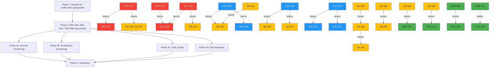

# Project Audit Report

> **Project**: par-term-emu-core-rust (v0.57.0, HEAD f6535f2, clean tree)
> **Date**: 2026-09-29
> **Cycle tag**: `audit-2026-09-29`
> **Stack**: Rust (PyO3 0.29 bindings, C FFI + iOS `TerminalCore.xcframework`), Python 3.12+, TypeScript/Next.js web frontend, WebSocket streaming server, par-mux daemon
> **Audited by**: Claude Code Audit System — /opus-audit run (Opus 5 subagents; parsight graph `par-term-emu-core-rust`, index current at f6535f2)
> **Previous run**: 2026-09-28 (`audit-2026-09-28`, HEAD 6828c63). Findings still present carry **recurring: prior &lt;ID&gt;**, using the prior AUDIT.md's IDs. Every finding in this report has a fresh ID, so no board title repeats an earlier card.

---

## Executive Summary

There are no Critical findings. The prior cycle's twelve High findings were re-verified at HEAD, and eleven hold. That includes the SEC-115 git-hook execution, the kitty decompression bomb (SEC-116), the FFI length/NUL mismatch (SEC-117), the roster grammar (ARC-060) and the two FFI/damage defects (QA-150, QA-151). The twelfth, ARC-058, is only partly fixed and recurs as **ARC-100**. RIS (`ESC c`) still silently resets every host setting missing from a hand-kept allowlist, including a hardened embedder's lowered OSC 1337 transfer cap.

The largest new risk is the **v0.57.0 pane lifecycle** (remain-on-exit plus `respawn-pane`). Every item below was reproduced by an audit agent:
- **SEC-125**: a held dead pane keeps signalling its reaped PID, so a recycled PID can receive SIGHUP.
- **SEC-126**: `respawn-pane` reads a `-k` or `-c` that appears *inside the command*, so it kills live panes and runs a different command.
- **ARC-089**: the dying process's output leaks into the respawned pane.
- **ARC-090**: any resize while zoomed rewrites the hidden layout.
- **QA-182**: `refresh-client` sizes are unbounded, which can overflow pixel math or abort the daemon.

The eight High findings are ARC-100 plus seven documentation findings. Those seven are mostly par-mux contract drift from 0.57.0: undocumented notification types, a `kill-pane` rule that is the reverse of the code, ABI v3 unrecorded, and the CHANGELOG missing `split-window -b`. Each is an S-sized fix.

**Why the count is high.** The prior cycle filed board cards only for its High findings and its enhancements. Its 80-plus Medium and Low findings were never filed or attempted, so they recur here unchanged. This cycle files every finding at every severity.

**Effort.** Roughly 3–4 days covers Phase 1, Phase 2 and the High documentation fixes. The recurring Medium and Low backlog is weeks of work and is ordered in the Remediation Plan.

**Strengths.** Mux identity checks fail closed. The FFI header is generated and drift-gated, and grid-owned damage has a property test. No TODO/FIXME markers remain. `cargo audit`, `bun audit` and `pip-audit` report zero vulnerabilities.

### Issue Count by Severity

| Severity | Architecture | Security | Code Quality | Documentation | Total |
|----------|:-----------:|:--------:|:------------:|:-------------:|:-----:|
| 🔴 Critical | 0 | 0 | 0 | 0 | **0** |
| 🟠 High     | 1 | 0 | 0 | 7 | **8** |
| 🟡 Medium   | 20 | 4 | 16 | 15 | **55** |
| 🔵 Low      | 11 | 7 | 18 | 13 | **49** |
| **Total**   | **32** | **11** | **34** | **35** | **112** |

**Merged duplicates.** Where two domains reported the same defect, one ID is kept and the absorbed IDs are retired. The numbering gaps are intentional.

| Kept | Absorbs | Topic |
|------|---------|-------|
| SEC-126 | QA-183 | `respawn-pane` flag parsing (`-k`/`-c` inside the command, `-c` before `-t`) |
| SEC-133 | QA-193 | Host probe: `run_git` pipe deadlock, unbounded `statvfs`/`wait`, shutdown join (recurring: prior SEC-124 + QA-155) |
| ARC-093 | QA-189 | Python `encode_key` option defaults differ from Rust/C |
| ARC-098 | QA-209 | Kitty key encoder truncates astral codepoints (recurring: prior QA-172) |
| ARC-103 | QA-187 (wiring half) | Two-phase spawn and the quadruplicated wire-up block |
| DOC-116 | ARC-099, QA-204 (typing half) | `_native.pyi` has no docstrings and is `Any` everywhere |

`QA-190` (add an `exit_code` field for `%pane-exited`) stays separate from `DOC-100` (document the notification types), because it is a code change. `QA-202` (file sizes) and `ARC-102` (the `Terminal` god object) stay separate, as they were last cycle.

**Severity adjustment.** QA-182 was reported High. It is filed Medium to match SEC-127, which has the same threat model. A same-uid client can already run `kill-server`, so an unbounded size is a robustness defect, not a crossed privilege boundary.

**ID note for fix agents.** The architecture agent's report cites prior IDs for recurring items. This report renumbers them: ARC-058→ARC-100, ARC-062→101, ARC-067→102, ARC-068→103, ARC-069→104, ARC-070→105, ARC-071→106, ARC-072→107, ARC-073→108, ARC-074→109, ARC-075→110, ARC-076→111, ARC-077→112, ARC-086→113, ARC-063→114, ARC-078→115, ARC-079→116, ARC-080→117, ARC-081→118, ARC-082→119, ARC-083→120, ARC-084→121.

### Decisions Required Before Some Remedies

The remedies below change a recorded project choice or delete, publish or break something. The user resolved D1–D6 on 2026-09-29 (Resolution column). Implement approved remedies in full. For a declined remedy, implement only the non-gated half. ENH-039 ships with `--pane-endpoints` off by default, **permanently**: pane-to-pane control through `$PAR_MUX_SOCKET` is a core feature, because an agent in one pane must be able to spawn and drive agents in other panes.

| Code | Finding | Decision | Resolution (user, 2026-09-29) |
|------|---------|----------|-------------------------------|
| D1 | ARC-104 | Add push/PR triggers to `ci.yml`. CI is `workflow_dispatch`-only by design today. Adding the FFI drift checks to the existing workflow needs no decision. | **Declined.** CI stays `workflow_dispatch`-only. ARC-104's non-gated half (FFI checks in `ci.yml`, xcframework job on tags) still applies. |
| D2 | ARC-107 (and SEC-134 tracking) | Commit `Cargo.lock` and build with `--locked`. The lockfile is deliberately untracked (CLAUDE.md, Windows VM notes). | **Approved.** Commit `Cargo.lock` and use `--locked` in CI and release builds. |
| D3 | SEC-135 | Pin GitHub-owned `actions/*` to SHAs. ENH-032 deliberately left them on tags. | **Approved.** Pin `actions/*` to SHAs. |
| D4 | ARC-101, ARC-112, ARC-114 | Ship a breaking ABI revision (v4, or v5 if the additive ENH-038 ships first): palette-resolved cells, `ptec_*` symbol prefix, a structured event channel. | **Approved.** Ship the breaking ABI revision. |
| D5 | ARC-118 | Delete the tracked `debug/` scripts. | **Approved.** Delete the tracked `debug/` scripts. |
| D6 | DOC-120 | Pick a removal version for `poll_events_legacy()`/`poll_subscribed_events_legacy()`, and whether to emit `DeprecationWarning` now. | **Remove now** (no deprecation period). No known consumer calls them. DOC-120 becomes a code removal. |

---

## User-Directed Focus

No focus areas were supplied. The agents weighted the 53 commits since the last audit: par-mux zoom, break/join, move/swap, respawn, remain-on-exit and `split-window -b`; the modifyOtherKeys key encoder; per-consumer damage generations; the cbindgen header; typed telemetry; and the removed forwarders.

---

## 🔴 Critical Issues (Resolve Immediately)

None.

---

## 🟠 High Priority Issues

### [ARC-100] RIS still reverts host-set configuration outside a hand-maintained allowlist
- **Area**: Architecture · **Severity**: High · **Effort**: M · **Phase**: 3b · *(recurring: prior ARC-058, partially fixed)*
- **Location**:
  - `src/terminal/mod.rs:3164-3264` (`reset()`).
  - Fields that are not carried across RIS: `conformance_level` `:1197`, `warning_bell_volume`/`margin_bell_volume` `:1199-1201`, `window_position_x/y` `:1187-1190`, `window_iconified` `:1193`, `mouse_history` `:1213`, `inline_image_state` `:1219`, `command_history_state` `:1227` (struct `:864-884`), `modes.bold_brightening` (setter `:1923`).
  - `graphics.file_transfer_manager.max_transfer_size` at `src/terminal/file_transfer.rs:277,363`.
  - Test: `src/terminal/tests/terminal_tests.rs:4141`.
  - Claim: `CHANGELOG.md:57`.
- **Description**: `reset()` builds a fresh `Terminal` and copies back an allowlist of fields by hand. Any field missing from that list silently returns to its compiled default. Probed on 0.57.0 with `ESC c`, each setting below was lost:

  | Setter call | Value after RIS |
  |---|---|
  | `set_max_transfer_size(1234)` | 52428800 |
  | `set_bold_brightening(False)` | `True` |
  | `set_conformance_level(1)` | 5 |
  | Warning and margin bell volumes set to 1 | 4 |
  | `set_max_mouse_history(3)` | 100 |
  | `set_window_position(5,6)` | (0,0) |
  | `set_window_iconified(True)` | `False` |
  | `set_max_command_history(2)` | 6 commands retained |
  | `set_max_cwd_history(1)` | 4 cwd entries retained |

  The ARC-058 regression test only covers the setters on the allowlist, so it cannot catch this class of bug.
- **Impact**:
  - One `ESC c` from any remote program restores the 50 MiB OSC 1337 file-transfer cap after an embedder lowered it (security relevance).
  - Silent behavior drift for par-term and ParDeck.
  - Every setter added in future resets on RIS unless someone remembers the list.
  - The CHANGELOG line "RIS resets the terminal, not the embedder's configuration" over-claims.
- **Remedy**:
  1. Move embedder configuration into a `HostConfig` sub-struct that `reset()` carries across with one `mem::swap`. It holds the caps, `bold_brightening`, `max_transfer_size`, host-reported window position and iconified state, and the history caps.
  2. Settings a program can also change by escape sequence need a *configured baseline* (the `configured_palette` model), not the live value. These are the conformance level (DECSCL) and the bell volumes (DECSWBV/DECSMBV).
  3. Add a Python test that enumerates every `set_*` on `Terminal` and asserts it survives `ESC c`, except an explicit VT-state allowlist.
  4. Correct `CHANGELOG.md:57`.
  5. Python `set_conformance_level` and `set_warning_bell_volume`/`set_margin_bell_volume` currently feed escape sequences, so there is no Rust setter to hook. Add Rust setters for all three.
- **Related, not fixed here**: DECSCUSR (`cursor.rs:172-192`) also writes `warning_bell_volume`, so a cursor-shape change moves the bell volume. OSC 10/11/12 colors set by a program survive RIS through the theme swap. Both are recorded in the playbook.
- **Blocks**: ARC-092 (both edit the generation hand-sync in `reset()`) and ARC-102 (`HostConfig` is the first slice of that split).

### [DOC-099] 0.57.0 CHANGELOG and README omit `split-window -b` and the `pane-info cmd=` reply token
- **Area**: Documentation · **Severity**: High · **Effort**: S · **Phase**: 3d
- **Location**: `CHANGELOG.md:10-27` (`## [0.57.0]`), `README.md:22` (What's New 0.57.0).
- **Description**: Commit 1c4c479 shipped in v0.57.0. It changed the `pane-info` reply grammar: an optional trailing `cmd=<base64>` foreground-command token follows `%N @W COLSxROWS`. Neither the CHANGELOG section nor the README paragraph mentions it or `split-window -b`. MUX.md:170/173/201 does document both.
- **Impact**: par-term and other `pane-info` parsers are not told the reply gained a token, and the release record for 0.57.0 is incomplete. The existing 0.57.0 ENH-028 bullet also calls the C type `KeyEncodeOptions`, which is the Rust name; the C type is `TermKeyOptions`.
- **Remedy**:
  1. Add this Added bullet to `## [0.57.0]` (edit only that section; code fixes add their bullets under `[Unreleased]`): "par-mux `split-window -b` places the new pane before its target; `pane-info` appends an optional last `cmd=<base64>` foreground-command token (tmux `#{pane_current_command}`), absent on Windows or when argv is unreadable."
  2. Add one clause to README:22.
- **Blocks**: DOC-109.

### [DOC-100] `TmuxNotification.notification_type` omits `pane-exited`/`pane-respawned`; the exit code's location is undocumented
- **Area**: Documentation · **Severity**: High · **Effort**: S · **Phase**: 3d · *(regression of the prior DOC-068 fix)*
- **Location**:
  - `docs/API_REFERENCE.md:1838` (32 strings listed) and `:1839-1856` (properties).
  - Code: `src/tmux_control.rs:241-242` (34 arms) and `src/python_bindings/types/notification.rs:620-630`.
- **Description**: Commits 4437667 and 4dde9e5 added `"pane-exited"` and `"pane-respawned"`. The Python converter puts the pane exit code into **`name`** as a decimal string. The `name` property doc still says "Session/window name; … agent label".
- **Impact**: Python clients that switch on `notification_type` never handle held-pane or respawn events. Those that find them do not know where the exit code is.
- **Remedy**:
  1. Add both strings to the list at :1838.
  2. Document `pane_id` for both events.
  3. Document the exit code. If QA-190 lands first, describe its new `exit_code` field. Otherwise extend the `name` bullet: "for `pane-exited`, the exit code as a decimal string, `None` on signal death".
- **Blocked by**: QA-190.

### [DOC-101] MUX.md says `kill-pane` is refused for a window's last pane; the code closes the window (and session)
- **Area**: Documentation · **Severity**: High · **Effort**: S · **Phase**: 3d
- **Location**:
  - The wrong claim: `docs/MUX.md:216`.
  - Code: `src/mux/tree.rs:1441-1446` (`kill_pane` closes the window, and the session if it was the last window) and `src/mux/dispatch.rs:522-545` (broadcasts `%window-close`/`%sessions-changed`).
  - Tests: `tree.rs:1974,1988`, `server.rs:3080`.
  - MUX.md contradicts itself: `:352` describes "an explicit `kill-pane` of the last pane".
- **Description**: The doc states the reverse of the behavior the tests pin.
- **Impact**: Client authors add needless guards, or are surprised when killing the last pane tears down the session and exits an otherwise-empty daemon.
- **Remedy**: Replace the first sentence of :216 with: "**`kill-pane`** of a window's last pane closes the window (`%window-close`), and of a session's last window closes the session (`%sessions-changed`)." Keep the remain-on-exit sentence.

### [DOC-102] MUX.md save list and Notifications table disagree with `mutates()` and `emit.rs`
- **Area**: Documentation · **Severity**: High · **Effort**: S · **Phase**: 3d
- **Location**:
  - `docs/MUX.md:350` (the "When it saves" list), `:225-241` (the Notifications table), `:236` (the `%sessions-changed` row).
  - Code: `src/mux/command.rs:315-335` (`mutates()`), `src/mux/emit.rs:66`, `src/mux/dispatch.rs:919,936,1050,1139`.
- **Description**: Three separate mismatches:
  1. `mutates()` returns true for `RenameSession` and `KillSession`, but the save list omits both.
  2. `%session-renamed $N <name>` is emitted but has no table row.
  3. The `%sessions-changed` row cites a "reaper cascade" as a cause. Dead panes are now held, so that no longer happens. The row also omits `kill-session`, `join-pane`, `move-window` and `swap-window`, which all emit it.
- **Impact**: Clients miss session renames and expect a session teardown that never happens. Persistence debugging is misled.
- **Remedy**:
  1. Add `rename-session` and `kill-session` to :350.
  2. Add a `%session-renamed $N <name>` row.
  3. Rewrite the :236 emitters as: "created (`new-session`), destroyed (`kill-session`, or a `kill-window`/`kill-pane`/`join-pane` that emptied it), or reordered (`move-window`/`swap-window`)". Drop "reaper".
  4. Add `%sessions-changed` to the command-table rows for `new-session` (dispatch.rs:303) and `kill-window`, which omit it today.

### [DOC-103] FFI_GUIDE ABI history stops at v2; the shipped ABI is v3
- **Area**: Documentation · **Severity**: High · **Effort**: S · **Phase**: 3d
- **Location**: `docs/FFI_GUIDE.md:416`. The actual value lives in `include/terminal_core_layout.h:25` and `src/ffi.rs:431` (`TERM_CORE_ABI_VERSION` = 3).
- **Description**: ENH-028 bumped the ABI to 3 for `TermKeyOptions`, `terminal_encode_key_ex` and `TERM_MOD_ALT_RIGHT`. The guide records only v2, and v1 is never described.
- **Impact**: An embedder checking `terminal_abi_version()` cannot map versions to features, which is the whole purpose of the check.
- **Remedy**: Replace the sentence with a table:

  | Version | Release | Adds |
  |---|---|---|
  | v1 | never released (development only, `4650702`) | Initial surface |
  | v2 | 0.56.0 | Per-consumer damage (`terminal_damage_generation`, `terminal_dirty_ranges_since`) |
  | v3 | 0.57.0 | `TermKeyOptions`, `terminal_encode_key_ex`, `TERM_MOD_ALT_RIGHT` |

  `v0.56.0:src/ffi.rs` sets `TERM_CORE_ABI_VERSION = 2`, so 0.56.0 shipped v2.

  Add a v4 row only if D4 is approved and lands.

### [DOC-104] API_REFERENCE and RUST_USAGE call `terminal_core.h` hand-written; it is cbindgen-generated
- **Area**: Documentation · **Severity**: High · **Effort**: S · **Phase**: 3d
- **Location**: `docs/API_REFERENCE.md:2480`, `docs/RUST_USAGE.md:579`.
- **Description**: Since 959135f (ENH-027) the header is generated, and its banner says "GENERATED … do not edit — regenerate with `make ffi-header`". Only `terminal_core_layout.h` is hand-written. These lines were rewritten by the DOC-070 fix before ENH-027 landed.
- **Impact**: A contributor who follows these docs hand-edits the header, then fails `ffi-header-check` with no pointer to `make ffi-header`.
- **Remedy**: Change both lines to "cbindgen-generated `include/terminal_core.h` (`make ffi-header`; constants and layout asserts in the hand-written `terminal_core_layout.h`)".

### [DOC-105] README "Running Tests" and web-frontend build commands fail
- **Area**: Documentation · **Severity**: High · **Effort**: S · **Phase**: 3d · *(recurring: prior DOC-082, DOC-083)*
- **Location**: `README.md:672-681` (Running Tests), `README.md:627-641` (Building from Source).
- **Description**:
  - Plain `cargo test` fails at link under the default `python` feature (`pyo3/extension-module`). CLAUDE.md, CONTRIBUTING:33 and `Makefile:219-223` require `--no-default-features --features pyo3/auto-initialize` or `make test-rust`.
  - The web frontend section uses `npm install`/`npm run dev` "on port 8030". The frontend ships `bun.lock`, the Makefile uses `make web-install`/`web-dev`, and `next dev` serves on 3000.
- **Impact**: These are the first commands a new contributor copies, and both fail or mislead.
- **Remedy**:
  - Tests: use `make test`, `make test-rust`, `make test-python`.
  - Frontend: use `make web-install`, `make web-dev` (http://localhost:3000) and `make web-build-static` (outputs to `web_term/`).

---
## 🟡 Medium Priority Issues

### Architecture

#### [ARC-089] `respawn-pane -k` leaks the dying process's output into the respawned pane's id
- **Effort**: S · **Phase**: 2 (batched with ARC-103)
- **Location**: `src/mux/tree.rs:1075-1101` (`complete_respawn`), `:17-21` (`kill_detached`); `src/mux/pane.rs:396-403,435-437`; `src/pty_session.rs:276-283,1325-1346`; `src/mux/dispatch.rs:878-895`; `src/mux/server.rs:1012-1024`.
- **Description**:
  - The old pane is handed to `kill_detached` with its output callback still wired to `pane_output_sink(clients, pane_id)`, and the replacement pane reuses that same `pane_id`.
  - `PtySession::kill` allows a SIGHUP grace period plus a 500 ms reap loop, and the reader keeps delivering bytes until EOF.
  - No production code calls `clear_output_callback`.
  - Probe: a pane running `trap 'echo OLD-PANE-BYE' HUP` delivered `OLD-PANE-BYE` to its sink after `kill()`.
- **Impact**: `%output %N` from the dead process races `%pane-respawned %N`. TUI apps send alt-screen-exit and cursor-restore sequences on SIGHUP, and these land on the fresh screen.
- **Remedy**: Add `MuxPane::detach_output()`, which wraps `clear_output_callback`. Call it **synchronously in `kill_detached`**, before the kill thread spawns, and for `respawn-pane -k` before the replacement spawn that runs outside the tree lock. Calling it inside `MuxPane::kill` is too late: that runs on the detached thread after `complete_respawn` has already installed the replacement under the same pane id.

#### [ARC-090] Zoom is enforced by convention; `resize-pane` while zoomed silently rewrites the hidden layout
- **Effort**: S · **Phase**: 2
- **Location**:
  - `src/mux/tree.rs:1174-1226` (`resize_pane`) and `:1237-1270` (`resize_pane_absolute`) never clear `zoomed`.
  - `zoomed` is cleared by hand at seven sites: `:686,747,781,887,966,1003,1476`.
  - Also involved: `sync_pane_sizes` `:1371-1401`, `src/mux/dispatch.rs:731-750`, `src/mux/server.rs:1052-1075`.
- **Description**:
  - Probe: split an 80-column window 40/40, zoom `%0`, send `resize-pane -x 79`, then unzoom. The layout comes back 79/1.
  - tmux unzooms before any non-`-Z` resize (`cmd-resize-pane.c:94-95`).
  - par-term sends exactly this path (`par-term-mux/src/client.rs:170`).
- **Impact**: The "exact-layout restore" guarantee breaks on the first renderer-driven resize. Every new mutator has to remember the zoom rule.
- **Remedy**:
  - Add a single choke point, `MuxTree::mutate_layout(window, |layout| …)`, that clears `zoomed` and calls `sync_pane_sizes`. Route all layout mutations through it.
  - Make `resize_pane_absolute` all-or-nothing. Today it leaves a half-applied layout when one axis succeeds and the other fails.
  - Unzoom first in both resize paths.
  - Add the probe as a tree test.
- **Blocks**: ARC-096, QA-188.

#### [ARC-091] Trigger scanning is lossy: a written row that scrolls out of the visible grid before the next scan is never matched
- **Effort**: M · **Phase**: 3b
- **Location**: `src/terminal/mod.rs:3322-3368` (`mark_row_written`, `shift_pending_trigger_rows`, `flush_pending_trigger_rows`); `src/terminal/write.rs:104,190,603`; `src/terminal/trigger.rs:176-190`; `src/pty_session.rs:905`.
- **Description**:
  - Pending trigger rows are stored as visible-row indices. Rows that scroll out are dropped, and scans run once per `process()` call or PTY read.
  - Probe on a 5-row terminal: `"ERROR lost\r\n"` plus 10 lines in one feed produced 0 matches.
  - b2798dd made this drop explicit while fixing the ARC-064 re-fire. It is not a regression.
- **Impact**: Notify, RunCommand and bookmark triggers miss matches in bursty output such as build logs, which is their main use case. Whether a match is missed depends on the OS read size.
- **Second defect (same fix)**: the wide-char wrap scroll at `write.rs:218-224` calls `scroll_region_up` without `shift_pending_trigger_rows`, so pending rows are misindexed after it.
- **Remedy**:
  - Scan a row's text when it scrolls into scrollback (the Grid scroll-into-history choke point), or key pending rows by absolute line and scan from scrollback.
  - Keep the ARC-064 "written text only" rule.
  - Add the probe as a test.

#### [ARC-092] Damage generations rely on a manual `sync_damage_generations()` at each screen-switch site; snapshot restore misses it
- **Effort**: S · **Phase**: 3b
- **Location**: `src/terminal/replay_snapshot.rs:231-279`; `src/grid/mod.rs:43-51,99-104,304-320` (`Grid::restore_from_snapshot` zeroes `row_gen` and keeps its own small `gen`); `src/terminal/mod.rs:1545,1773,1806,3254-3263,3380-3384`.
- **Description**:
  - Probe: restore an alt-screen snapshot onto a live terminal whose consumer holds generation 4760. `dirty_rows_since(4760)` returns `[]`, even though the whole screen changed.
  - Only a Rust embedder that restores onto a live terminal is affected today. Python does not expose restore, and the mux and `SnapshotManager` restore onto fresh terminals.
- **Impact**: The public ABI v2 generation contract depends on a per-site obligation, and one site has already missed it.
- **Remedy**:
  - Use one `Terminal`-owned damage clock that both grids stamp from, or make `Grid::restore_from_snapshot` raise its generation instead of resetting it.
  - Route every active-grid change through a single `set_visible_screen()`.
  - Add the probe as a regression test.
- **Blocked by**: ARC-100.

#### [ARC-093] Three named-key tables remain, and the public encoders disagree on option defaults (merges QA-189)
- **Effort**: M · **Phase**: 3b
- **Location**: `src/python_bindings/terminal/input_api.rs:1-3,45-65`; `src/keyboard.rs:82-92,484-506`; `src/ffi.rs:786-793`; `src/mux/command.rs:645-669,719-728`; `src/macros.rs:200-240`; `tests/test_keyboard_encoding.py:1-6,73-74`.
- **Description**:
  1. **Option-key defaults.** Python `encode_key` defaults `left_option` and `right_option` to 0 (Normal), while C, Rust and `KeyEncodeOptions::default()` use ESC. Probe: Alt+f encodes to `b'f'` from Python and `b'\x1bf'` from C. That contradicts the module doc's "same bytes as par-term and the C FFI".
  2. **par-mux `send-keys`.** It hard-codes `ESC [ A` arrows and ignores the pane's DECCKM, while tmux honors it (`input-keys.c:654-655`). Its table also lacks Home, End, PageUp, PageDown and the F-keys.
  3. **Macros.** `KeyParser::parse_key` in `macros.rs` is a third table, also blind to DECCKM.
- **Impact**: Arrow keys sent through par-mux or macros to an app in application-cursor mode get the wrong sequence. Python and C frontends send different bytes for the same Alt keypress.
- **Remedy**:
  1. Resolve `send-keys` and macro key names to `TermKeyEvent`, and encode them with `keyboard::encode_key_with` against the target terminal's modes.
  2. Align the Python defaults to ESC/ESC, the documented shared default.
  3. Add a CHANGELOG `[Unreleased]` "Changed" bullet, since the Python default is user-visible. Update `docs/API_REFERENCE.md:250` and the docstring.

#### [ARC-094] Adding a mux command or notification takes edits in 5 places, with opposite exhaustiveness disciplines
- **Effort**: M · **Phase**: 3b
- **Location**: `src/mux/command.rs:38` (enum), `:315-351` (`mutates()`), `:763-840` (`COMMANDS`); `src/mux/dispatch.rs:141-221` (`dispatch_command`, CC 42, the #1 repository hotspot at score 1470); `src/mux/emit.rs:149-156` (`_ => String::new()`); `src/python_bindings/types/notification.rs:129` (exhaustive match); `src/tmux_control.rs:209`.
- **Description**:
  - The Python converter's exhaustive match broke the build on new variants (4dde9e5), which is the desired behavior.
  - `emit()`'s wildcard does the opposite: any variant nobody wires up silently emits nothing. 21 of the 34 `TmuxNotification` variants are wired. The enum is at `tmux_control.rs:20-205` (`:209` is `notification_type()`), `COMMANDS` ends at `command.rs:797`, and the comment at `emit.rs:149-155` ("29 variants, emits 9") is stale.
- **Impact**: This is the highest-churn area of the codebase. A notification nobody wires up disappears with no compile error.
- **Remedy**:
  - Replace `emit()`'s wildcard with an explicit list of the parser-only variants, so any new variant fails to compile.
  - Optionally, move to a declarative command table row of `(name, parser, mutates, handler)`.

#### [ARC-095] Held-dead pane state is push-only; a client that connects later cannot tell a pane has exited
- **Effort**: S · **Phase**: 3b
- **Location**: `src/mux/dispatch.rs:313-330` (`list-panes` returns ids only), `:700-729` (`pane-info` has no exit token); `src/mux/server.rs:945-1000`; `src/mux/pane.rs` (`dead`, `exit_code`); `docs/MUX.md:233,358`.
- **Description**:
  - `%pane-exited` is broadcast once, and no query exposes `dead` or `exit_code` afterwards.
  - Clients only join broadcasts on their first command. A par-term that attaches after the exit therefore shows a frozen screen with no exit chrome and no respawn affordance.
- **Impact**: Remain-on-exit only works for clients that were connected when the process died.
- **Remedy**:
  - Add a trailing `exited=<code|?>` key=value token to `pane-info`, using the ARC-060 tail grammar. Document it in MUX.md.
  - Optionally, replay `%pane-exited` for dead panes when a client registers.

#### [ARC-101] FFI readback ignores the palette and truncates grapheme clusters
- **Effort**: M · **Phase**: 3b · **Decision**: D4 (ABI v4) · *(recurring: prior ARC-062)*
- **Location**: `src/ffi.rs:388-407` (`SharedCell::from_cell` uses the fixed `Color::to_rgb`), `:44-65` (`text: [u8; 4]`).
- **Description**: Probed via ctypes on ABI 3:
  - After `OSC 4;1;rgb:00/00/ff`, SGR 31 reads back as (128,0,0) instead of the new palette color.
  - `x` + U+0301 reads back as `x`, with the combining mark lost.
- **Impact**: A C or Swift renderer shows the wrong colors after a palette change and drops combining marks.
- **Remedy**: Ship palette-aware resolution, default-color bits and a grapheme side channel as one ABI v4, together with ARC-112 and ARC-114. The non-breaking part is also gated on D4: an additive `terminal_read_row_resolved` could ship first.
- **Batch**: one ABI revision with ARC-112 and ARC-114. DOC-103 gains a v4 row afterwards.

#### [ARC-102] `Terminal` is still a god object
- **Effort**: L · **Phase**: 3b (run last) · *(recurring: prior ARC-067)*
- **Location**:
  - `src/terminal/mod.rs` is 3,873 lines (up from 3,637), with 173 `pub fn`, about 50 fields at `:1105-1257`, and fan-in 101.
  - `TriggerEngine` (`trigger.rs:134`) and `MacroEngine` (`macros.rs:14`) are unit structs over `Terminal` fields.
- **Remedy**: Start from `HostConfig` (ARC-100), then give the engines ownership of their registries, one per PR.
- **Blocked by**: ARC-100.

#### [ARC-103] Two-phase spawn installs the output sink after the reader starts; the wire-up block is now copied four times (merges QA-187 wiring half)
- **Effort**: M · **Phase**: 2 (batched with ARC-089) · *(recurring: prior ARC-068)*
- **Location**:
  - `factory.create_pane` calls `session.spawn` (`src/mux/pane.rs:594-617`), which starts the reader.
  - `on_output` is wired only after a re-lock: `src/mux/dispatch.rs:249-300` (new-session), `:575-640` (split), `:849-905` (respawn, new), `:935-990` (new-window).
  - The restore path has the same pattern: `src/mux/server.rs:1028-1045`.
- **Description**: Early pane output, such as the first prompt, can be lost before the sink is attached. Three of the four copies also write the note through a raw terminal lock (QA-195).
- **Remedy**:
  - Carry the sink in `SpawnContext` so it is installed before the reader starts.
  - Extract one `spawn_two_phase`/`spawn_and_wire` helper that detaches the old pane (ARC-089), attaches the new one, and writes notes via `with_terminal_mut`.
- **Blocks**: QA-195, QA-187.

#### [ARC-104] CI is dispatch-only, and the FFI drift gates never run in CI
- **Effort**: M · **Phase**: 3b · **Decision**: D1 (trigger half) · *(recurring: prior ARC-069)*
- **Location**:
  - `.github/workflows/ci.yml:3-4`.
  - `fuzz.yml:8-10` and `bench.yml` run on a schedule.
  - `ffi-header-check` and `ffi-surface-check` exist only in `make checkall` (`Makefile:334-366`).
  - There is no xcframework job.
- **Remedy**:
  - Non-gated: add both FFI checks to `ci.yml`, plus a macOS xcframework job that runs on tags.
  - Gated (D1): push/PR triggers.
- **Blocks**: ARC-107.

#### [ARC-105] Wheel feature sets diverge
- **Effort**: S · **Phase**: 3b · *(recurring: prior ARC-070)*
- **Location**: `pyproject.toml:74-77` (only `pyo3/extension-module`); `.github/workflows/deployment.yml:275,332,338,383` (`--features streaming`); `Makefile:123-130`; `ci.yml:238`; `publish-testpypi.yml:58-80` (also no streaming, so TestPyPI wheels differ from PyPI wheels).
- **Remedy**: Make the pyproject `[tool.maturin] features` the single source of truth, and drop the per-command `--features` flags.

#### [ARC-106] `mux` still pulls in `clap`
- **Effort**: S · **Phase**: 3b · *(recurring: prior ARC-071)*
- **Location**: `Cargo.toml:255` and `:60-63` (`[[bin]] par-mux`); `scripts/check_features.sh:72-77`.
- **Remedy**:
  - Add `mux-bin = ["mux","clap"]` (not `dep:clap`: that removes clap's implicit feature, which `streaming-bin` at `Cargo.toml:246` uses) and `required-features = ["mux-bin"]`.
  - Every build of a test that uses `CARGO_BIN_EXE_par-mux` then needs `mux-bin`: `ci.yml:166`, `Makefile:227`, `CLAUDE.md:84`, the pre-commit hook, and the standard `mux_daemon` gate.
  - Update every build and `cargo install` line that names `mux` for the binary, and remove the skip in `check_features.sh`.

#### [ARC-107] `Cargo.lock` is untracked
- **Effort**: S · **Phase**: 3b · **Decision**: D2 · *(recurring: prior ARC-072)*
- **Location**: `.gitignore:4`.
- **Remedy**: If D2 is approved, commit the lockfile and add `--locked` to CI and release builds. Otherwise close this finding as "by design" with a one-line rationale in CONTRIBUTING.
- **Blocked by**: ARC-104.

#### [ARC-108] Layering inversions remain
- **Effort**: M · **Phase**: 3b · *(recurring: prior ARC-073)*
- **Location**: `src/grid/mod.rs:287-304` (uses `terminal::replay_snapshot` types); `src/graphics/mod.rs:401,435` (`terminal::unix_millis`); `src/streaming/protocol.rs:274-282,346,561-562,789-790` (PyO3 `pydict` attributes that name `py_convert`).
- **Remedy**: Move the snapshot types and the clock into a leaf module, and keep Python conversion in the bindings layer.

#### [ARC-109] Streamer polls terminal events at 20 Hz through `Arc<Mutex<PtySession>>`
- **Effort**: M · **Phase**: 3b · *(recurring: prior ARC-074)*
- **Location**: `src/bin/streaming_server/bootstrap.rs:218-226,557-559`; Mutex fields at `:38,69,86,96,315`.
- **Remedy**: Push events through an observer or channel instead of polling.

#### [ARC-110] Accept loops are duplicated; the axum path keeps its own session loop
- **Effort**: M · **Phase**: 3b · *(recurring: prior ARC-075, partially fixed)*
- **Location**: `src/streaming/server.rs:886` versus `:1014` (the two accept loops); `handle_axum_websocket` `:2187` has its own `select!` at `:2255`. Plain and TLS already share `run_ws_session` (`:1883`).
- **Remedy**: Write one generic accept loop, and have axum feed `run_ws_session`.

#### [ARC-111] The core library logs through a private file logger
- **Effort**: M · **Phase**: 3b · *(recurring: prior ARC-076)*
- **Location**: `src/debug.rs:136-146`; 59 call sites in `streaming/server.rs` and 36 in `pty_session.rs` (4 macro calls and 32 direct `debug::log*` calls).
- **Remedy**: Route logging through the `log` crate facade, keeping `debug.rs` as an optional sink.

#### [ARC-112] C symbols are exported unprefixed from every Python wheel; `Broadcaster` is not deprecated
- **Effort**: M · **Phase**: 3b · **Decision**: D4 · *(recurring: prior ARC-077)*
- **Location**: `src/lib.rs:59` (`pub mod ffi;` is unconditional); `src/streaming/mod.rs:82`. `nm` on the 0.57.0 `.so` shows 20 global `T _terminal_*` symbols.
- **Remedy**:
  - Non-gated: an `ffi` feature enabled only by `scripts/build-xcframework.sh:17`, which removes the symbols from Python wheels, plus a `#[deprecated]` on `Broadcaster`.
  - Gated (D4): `ptec_*` names.

#### [ARC-113] Pane metadata is a stringly-typed namespace, re-parsed as JSON on every roster read
- **Effort**: M · **Phase**: 3b · *(recurring: prior ARC-086)*
- **Location**: `HashMap<String,String>` in `src/mux/pane.rs`; about 105 string-key references in `hooks.rs` (`:210-218`); `dispatch.rs:387-397`; per-read `serde_json::from_str` in `hooks.rs:790-798,809-822` and `host_probe.rs:315-321`.
- **Remedy**: Add a typed `AgentClaim` struct on `MuxPane` that holds the parsed `TelemetryV1`, and keep the string map for unrelated metadata.

### Security

#### [SEC-125] A held (dead) pane keeps its reaped child's PID, and later kill and resize calls signal that PID
- **Effort**: M · **Phase**: 1 · **CWE**: 672, 367
- **Location**:
  - `src/pty_session.rs:1273-1285` (`poll_running`), `:1296-1308` (`try_wait` reaps the child but keeps `child`/`child_pid`), `:1325-1346` (`kill` calls `child.kill()` unconditionally), `:1171-1172,1250-1251` (resize sends SIGWINCH to `child.process_id()`), `:158-199` (`send_sigwinch`).
  - `src/mux/server.rs:980-981`.
  - `src/mux/pane.rs:204-206,292-297,356-359,368-370,435-437`.
  - `src/mux/tree.rs:17-21,1045,1081,1089,1371-1400,1425,1526,1573`.
  - `src/mux/dispatch.rs:721-727`.
  - portable-pty 0.9.0 `lib.rs:340-373`.
- **Description**:
  - Remain-on-exit keeps a reaped child's handle indefinitely.
  - portable-pty's `kill` sends a raw `libc::kill(pid, SIGHUP)`. It skips the guard std uses to avoid signalling an already-waited child.
  - Every layout change sends SIGWINCH to `-pid` and to `pid`.
  - Reproduced: after pane %1's child (PID 53605) was reaped, `refresh-client -C 120x40` logged `SIGWINCH delivery failed … group No such process (os error 3), pid No such process`.
  - `pane-info cmd=`, the host probe cwd, and respawn's default cwd also read the stale PID. So do the reader thread's alt-screen SIGWINCH pulse (`pty_session.rs:969-975`, which uses the PID captured at spawn) and agent liveness in `scrape.rs:567`.
- **Impact**:
  - Once the OS recycles the PID for another process owned by the same user, closing or respawning the held pane SIGHUPs that process, which terminates it by default.
  - Resizes send SIGWINCH to its process group.
  - The daemon cannot signal another user's processes unless it runs as root, so this does not cross users.
  - Python `PtyTerminal.kill()`/`resize()` after `try_wait()` has the same flaw.
- **Remedy**:
  - Record the exit status in `PtySession` the first time `try_wait` or `wait` observes it. After that, `child_pid()` returns `None`, and `kill()` and SIGWINCH do nothing.
  - Route every signal through one guarded helper (a pidfd on Linux).
  - Add a test: exit, then `try_wait`, then `kill()`/`resize()` must not signal.
- **Blocks**: SEC-128.

#### [SEC-126] `respawn-pane` reads `-k`/`-c` anywhere on the line, including inside the command, so it kills live panes and runs a different command (merges QA-183)
- **Effort**: M · **Phase**: 1 · **CWE**: 88, 20
- **Location**: `src/mux/command.rs:1200-1227` (`parse_respawn_pane`), `:468-470` (`has_flag` scans every token), `:434-450` (`quoted_flag_allowing_empty`), `:504-512` (`trailing_after`); `src/mux/tree.rs:1049-1051` (the `alive && !kill` guard it bypasses); `src/mux/dispatch.rs:557-573`; tests `src/mux/command.rs:2283-2310`.
- **Description**: Reproduced on a throwaway daemon:
  - `respawn-pane -t %0 sh -c 'echo X; sort -k 1 /dev/null; sleep 600'` kills a live pane without `-k`. The `-k` belongs to `sort`.
  - The `-c` inside `sh -c '…'` is read as the start directory, so the command becomes `sleep 600'`.
  - `respawn-pane -t %0 -c '/a b' sleep 5` gives the command `b' sleep 5`.
  - `respawn-pane -c /tmp -t %0 top` gives the command `-t %0 top`. The parser anchors on `-c` whenever it is present, contradicting its own comment.
  - `trailing_after` rejoins tokens with single spaces, so whitespace inside quotes is lost.
- **Impact**: A frontend relaying a user's restart command such as `sh -c '…'` kills the live process and runs a fragment in `$HOME`. The reply still reports success and `%pane-respawned` is broadcast.
- **Remedy**:
  - Parse only the leading flags (`-t v`, `-c v`, `-k`) up to the first non-flag token or `--`.
  - Take the command as a raw slice of the line from that point (the `split_after_flag` style), so quoting and whitespace survive.
  - Add table tests for: `-k` inside the command, `sh -c '…'`, `-c` before `-t`, quoted `-c`, runs of spaces, and `--`.
- **Blocks**: SEC-128, QA-187.

#### [SEC-127] Mux control socket: a line with no newline grows without bound
- **Effort**: S · **Phase**: 1 · **CWE**: 400, 770 · *(recurring: prior SEC-118)*
- **Location**: `src/mux/server.rs:85` (`MAX_CONTROL_LINE_BYTES`), `:509-583` (read loop), `:517` (`read_line`), `:528-545` (size check), `:563-574` (poll-wake arm).
- **Description**:
  - The 1 MiB check runs only after `read_line` returns, and the poll-wake arm keeps the partial line with no length check.
  - Reproduced: after 256 MiB with no newline, daemon RSS went from 12 MiB to 279 MiB and the connection stayed open.
- **Impact**: Any same-uid program, including anything inside a pane via `$PAR_MUX_SOCKET`, can OOM the daemon, and with it every session.
- **Remedy**:
  - Bound each read with a `fill_buf` loop into a `Vec<u8>`, and close the connection when the budget is exceeded. A `take()` wrapper around `read_line` cannot keep a split multibyte character across timeout wakes, because std drops invalid-UTF-8 bytes it has already consumed when the call errors.
  - Check the length in the poll-wake arm too.
  - Keep split multibyte UTF-8 intact across timeout wakes.
- **Blocks**: SEC-132, QA-199, QA-207.

#### [SEC-133] Host probe: `run_git` pipe deadlock, and the probe and shutdown can hang on a wedged filesystem (merges QA-193)
- **Effort**: M · **Phase**: 1 · **CWE**: 400, 833 · *(recurring: prior SEC-124 + QA-155)*
- **Location**: `src/mux/host_probe.rs:73-88` (`statvfs` has no bound), `:185-218` (stdout is read only after `try_wait` reports exit, then `kill` + `wait`), `:138-143` (`ls-files --others --directory`), `:263-305` (`SWEEP_DEADLINE` is checked only between panes; 3 git calls per pane at `:99,128,138`, 5 s each), `:43-45,350-354` (comments); `src/mux/server.rs:367-371` (unconditional `probe_worker.join()`, with a comment claiming a bound).
- **Description**:
  - When git writes more than the pipe buffer, it blocks until the 5 s kill, and `git_dirty` then returns `None`.
  - A single sweep can run for 25 s, and shutdown waits for all of it.
  - A hung NFS or FUSE mount blocks `statvfs`, or `wait` after a kill, indefinitely, which also blocks `par-mux --stop`.
  - Three comments misstate these bounds.
- **Impact**: Wrong dirty state is reported, and shutdown can stall or hang.
- **Remedy**:
  - Drain stdout while polling. For the dirty check, read the first byte and kill.
  - Run each pane's probe on a detached worker read through `recv_timeout`, and skip panes whose last probe timed out.
  - Pass the shutdown flag into the sweep and check it before each git call.
  - Join the probe thread with a timeout, or detach it.
  - Correct the three comments.

### Code Quality

#### [QA-182] `refresh-client -C`/`-p` sizes have no upper bound: u16 pixel overflow (reproduced), and a grid allocation that can abort the daemon
- **Effort**: S–M · **Phase**: 3c · *(reported High; filed Medium, same threat model as SEC-127)*
- **Location**:
  - `src/mux/command.rs:521-548` (`size_pair` rejects only 0; used at `:927-928`).
  - `src/mux/dispatch.rs:460-462`.
  - `src/mux/tree.rs:1281-1295` (`resize_window`), `:1305-1311` (`set_client_cell_pixels`).
  - `src/mux/pane.rs:430` (`cols * cell_w` computed in u16).
  - `src/pty_session.rs:559-560,1126-1127`.
  - `src/python_bindings/pty.rs:200,223-226` (`usize as u16`).
  - `src/grid/scroll.rs:286`.
- **Description**:
  - `refresh-client -t %0 -C 65535x65535 -p 100x100` parses.
  - A debug probe (`resize_window(w,2000,50)` plus `set_client_cell_pixels(40,40)`) panicked with `attempt to multiply with overflow` at `pane.rs:430`.
  - The streaming server bounds sizes at 1000×500 (`src/streaming/server.rs:161-171`); the mux path does not.
- **Impact**:
  - Debug builds: the stored cell size panics again on every later `sync_pane_sizes`. `catch_unwind` contains each panic.
  - Release builds: silently wrong `TIOCGWINSZ`/XTWINOPS pixel sizes.
  - A huge `-C` value can fail the allocation, which aborts the process and cannot be caught.
- **Remedy**:
  - Add a mux grid-size cap with a `/// cap:` annotation, at the streaming server's values (1000×500). `crate::streaming` is not compiled under `rust-only,mux` (`src/lib.rs:85`), so the streaming constants cannot be reused by path.
  - Add a pixel bound for `-p` (for example 1..=512).
  - Compute pixel extents in u32 and clamp to `u16::MAX` at `pane.rs:430` and `pty_session.rs:559,1126`.
  - Replace `as u16` in the Python bindings with `u16::try_from` → `PyValueError`.
  - Add tests for parser rejection and the 2000×50 @ 40 px case.
- **Blocks**: QA-188.

#### [QA-184] `MuxSessionFactory::create_session` does blocking socket I/O on a tokio worker with no reply deadline
- **Effort**: M · **Phase**: 3c
- **Location**: `src/streaming/mux_factory.rs:142-168` (`command()` reads with no timeout), `:256-321`; `src/streaming/server.rs:569-608,1197-1204`; blocking helpers in `#[tokio::test]` bodies at `mux_factory.rs:703-1030`. For comparison, `MuxClient` uses `REPLY_TIMEOUT` (`src/mux/client.rs:18,187`).
- **Impact**: A wedged daemon parks one runtime worker per connecting viewer, and enough of them freeze every WebSocket session. This plausibly contributes to the macOS MuxSessionFactory CI hang, but that is not established.
- **Remedy**:
  - Give `command()` a deadline (a read timeout, or a reader thread plus `recv_timeout`).
  - Call `create_session` via `spawn_blocking`.
  - Make the test helpers synchronous or async-sleep based.
- **Blocks**: QA-198.

#### [QA-185] Mux test harness: unbounded waits, leaked daemons, duplicated helpers, and no per-test timeout in CI
- **Effort**: M · **Phase**: 3c
- **Location**: `tests/common/mod.rs:86-101` (`command()` has no deadline), `:203-208` (`wait_listening` returns silently on timeout); private copies at `tests/mux_agents.rs:24-29` and `tests/mux_hooks.rs:24-29`; `src/streaming/mux_factory.rs:609-626` (`daemon()` detaches `server.run()` with no shutdown); `src/mux/server.rs:1487,1643` (unbounded `serving.join()`); `.github/workflows/ci.yml:127,166,171`.
- **Impact**: A wedge shows up as a nameless 20-minute job timeout, which is the shape of the recent Windows and macOS intermittents.
- **Remedy**:
  - Add a deadline to `command()`, make `wait_listening` panic on timeout, and delete the private copies.
  - Add a Drop guard to `daemon()` that raises `shutdown_handle()` and joins with a timeout.
  - Adopt cargo-nextest with `slow-timeout = { period = "30s", terminate-after = 4 }` in the Mux job.
- **Blocks**: QA-186.

#### [QA-191] PTY input drain busy-polls and retries `try_lock` without bound; it is not the only writer
- **Effort**: M · **Phase**: 3c · *(recurring: prior QA-153)*
- **Location**: `src/streaming/session.rs:411-416` (10 ms `try_recv` plus sleep), `:441-443`; bypass writers at `src/pty_session.rs:1067` and `src/python_bindings/streaming.rs:541-551`.
- **Impact**:
  - About 100 wakes per second per idle session, and up to 10 ms of extra keystroke latency.
  - A silent spin if the writer wedges.
  - Reordering when Python writes directly.
- **Remedy**: Use `recv_timeout(~250 ms)` plus `try_lock_for` with a logged timeout, and make the queue the only path to the writer while a session is attached.
- **Blocked by**: QA-198.

#### [QA-192] Writer-less sessions close the WebSocket on any input; the frontend reconnect-loops
- **Effort**: S–M · **Phase**: 3c · *(recurring: prior QA-154)*
- **Location**: `src/streaming/server.rs:1286-1300`; `src/bin/streaming_server/main.rs:265` (`default_read_only: false` in macro mode); `web-terminal-frontend/lib/terminal-connection.ts:164`.
- **Remedy**: Drop and count the input (`dropped_messages`) instead of closing, or at least exclude Mouse and FocusChange. Default macro mode to read-only. DOC-112 documents the result.

#### [QA-194] Windows `TOKEN_USER` view is misaligned
- **Effort**: S · **Phase**: 3c · *(recurring: prior QA-157)*
- **Location**: `src/mux/ipc.rs:207-208` (`&*(Vec<u8>.as_ptr().cast::<TOKEN_USER>())`), `:219`.
- **Remedy**: Use a `Vec<u64>` of `div_ceil(8)` elements, or `ptr::read_unaligned`. Verify on the Windows VM (both `cargo check` sets).

#### [QA-195] Raw terminal-lock writes leave the geometry mirror stale
- **Effort**: M · **Phase**: 3c · *(recurring: prior QA-158)*
- **Location**: `src/mux/dispatch.rs:621,889,986`; `src/mux/pane.rs:284`; `src/pty_session.rs:1370`; `src/python_bindings/pty.rs:41-43`.
- **Impact**: After a note or a Python-side process call, `cursor_position()` stays stale until the next PTY output.
- **Remedy**: Route writes through `with_terminal_mut` (`src/pty_session.rs:1410`), or return a guard that publishes on Drop. ARC-103 already fixes the three dispatch sites.
- **Blocked by**: ARC-103.

#### [QA-196] Tests mutate the process environment while running in parallel
- **Effort**: M · **Phase**: 3c · *(recurring: prior QA-159)*
- **Location**: `src/mux/client.rs:583-592,623-624`; `src/pty_session.rs:3302,3345,3364,3436`; `tests/mux_nested.rs:348-355`; `tests/mux_reattach.rs:306`; `src/debug.rs:401-407`.
- **Remedy**: Inject the values instead. `connect_or_spawn_at` (`src/mux/client.rs:83`) is the seam for the client tests. This blocks any move to edition 2024.

#### [QA-197] Trigger action results and bookmarks are capped inconsistently
- **Effort**: S · **Phase**: 3c · *(recurring: prior QA-160)*
- **Location**: `src/terminal/trigger.rs:253` (a highlight push with no bound; `duration_ms == 0` never expires); Notify, MarkLine and SplitPane pushes around `:261-294,350-362`; only `:311,324,337` check `max_action_results`; `src/terminal/semantic_snapshot.rs:905` (`add_bookmark` has no cap).
- **Remedy**: Add one `push_action_result` helper that enforces the cap, and evict the oldest highlights and bookmarks.

#### [QA-198] Blocking lock and I/O inside tokio tasks; `--command` bypasses the input queue
- **Effort**: S · **Phase**: 3c · *(recurring: prior QA-161)*
- **Location**: `src/streaming/mux_factory.rs:354-363` (parking_lot `writer.lock()` plus a socket write inside `tokio::spawn`); `src/bin/streaming_server/main.rs:618-636`.
- **Remedy**: Use `spawn_blocking` for resize writes, and send the initial command through `enqueue_pty_input`.
- **Blocked by**: QA-184. **Blocks**: QA-191.

#### [QA-199] Client-registration block copied four times in `handle_client`
- **Effort**: S · **Phase**: 3c · *(recurring: prior QA-162)*
- **Location**: `src/mux/server.rs:529-536,587-594,632-639,681-688`. `handle_client` (`:450`) has CC 41 and is the #2 hotspot (score 1271).
- **Remedy**: Add `ensure_registered` and extract `read_control_line`, which returns `Line`/`Oversize`/`Undecodable`/`Closed`. Do this in one batch with QA-207.
- **Blocked by**: SEC-127.

#### [QA-200] Oversized streamer `main` and `handle_csi_report`; `run_mux_mode` re-implements the serve loop
- **Effort**: M · **Phase**: 3c · *(recurring: prior QA-163)*
- **Location**: `src/bin/streaming_server/main.rs:167` (CC 37), `:96-143` versus `serve_until_ctrl_c` `:587`; `src/terminal/sequences/csi/report.rs:7` (CC 54).
- **Remedy**: Reuse `serve_until_ctrl_c` in `run_mux_mode`, and split `handle_csi_report` by report family.

#### [QA-201] `unsafe` without SAFETY comments has grown to 44+
- **Effort**: M · **Phase**: 3c · *(recurring: prior QA-164)*
- **Location**: `src/ffi.rs` (32, up from 27), `src/mux/foreground.rs` (4), `src/bin/par_mux/main.rs` (4), and one each in `src/mux/pane.rs`, `src/mux/host_probe.rs`, `src/mux/client.rs` and `src/bin/streaming_server/cli.rs`. These counts are production code only, from clippy `undocumented_unsafe_blocks` with `--features rust-only,streaming,streaming-bin,mux,serde`. They exclude the python and Windows `ipc.rs` blocks. With `--all-targets` there are 139 (`ffi.rs` alone has 97, 65 of them in tests), so the lint attribute should be `cfg_attr(not(test), …)`.
- **Remedy**:
  - Add SAFETY comments.
  - Add `#![warn(clippy::undocumented_unsafe_blocks)]` to `src/lib.rs` and both binaries.
  - Batch this with QA-208 and QA-215 in `ffi.rs`.

#### [QA-202] Large files keep growing
- **Effort**: L · **Phase**: 3c (run last) · *(recurring: prior QA-165)*
- **Location**: Production lines (before `mod tests`) since fe5372b:

  | File | Before | Now |
  |---|---|---|
  | `src/mux/tree.rs` | 1100 | 1605 |
  | `src/mux/dispatch.rs` | 1026 | 1281 |
  | `src/mux/command.rs` | 1105 | 1329 |
  | `src/ffi.rs` | 775 | 903 |
  | `src/mux/hooks.rs` | 885 | 934 |

  Unchanged but large: `src/terminal/mod.rs` 3873, `src/streaming/server.rs` 3572, `src/pty_session.rs` 3439.
- **Remedy**: Split `hooks.rs` into `hooks/{report,telemetry,release}.rs`, move the PTY reader into `pty_session/reader.rs`, and split `tree.rs` layout operations from lifecycle. Do this after every behavioral fix in these files.

#### [QA-203] Fixed sleeps in PTY tests
- **Effort**: S · **Phase**: 3c · *(recurring: prior QA-166)*
- **Location**: `src/pty_session.rs:2257,2357,2386` (100 ms), `:2685,2709,2785` (500 ms), `:2693` (300 ms).
- **Remedy**: Use deadline polling, and delete the trailing sleeps.

#### [QA-204] No stub drift check
- **Effort**: S · **Phase**: 3c · *(recurring: prior QA-167; the typing half is merged into DOC-116)*
- **Location**: `Makefile:313-321` (`stub-check` never regenerates and diffs).
- **Remedy**:
  - Add a `stub-drift` target: `make dev-streaming && make stubs && git diff --exit-code python/par_term_emu_core_rust/_native.pyi`. The stubs must come from a `dev-streaming` build, because a `make dev` build silently drops the streaming classes.
  - Keep it out of `checkall` if the rebuild is too slow, and document it in `make help`.

### Documentation

#### [DOC-106] STREAMING.md says a reaped pane ends the mux-backed session; held panes never end it
- **Effort**: S · **Phase**: 3d
- **Location**: `docs/STREAMING.md:1563`; behavior at `src/streaming/mux_factory.rs:447-485` (the session ends only on a layout miss, `WindowClose` or `Exit`; `PaneExited`/`PaneRespawned` are ignored).
- **Remedy**: Drop "reaped". Add a row: "Process exits: the pane is held (remain-on-exit); the session stays open on the frozen screen; `respawn-pane` resumes output." If a later change forwards an exit cue, describe that instead.

#### [DOC-107] README C-surface list and ARCHITECTURE omit the 0.56/0.57 FFI and damage additions
- **Effort**: M · **Phase**: 3d · *(recurring: prior DOC-077, partial)*
- **Location**: `README.md:311-318`; `docs/ARCHITECTURE.md:233-236,278,367,813`.
- **Description**:
  - The README omits `terminal_abi_version`, the damage-generation calls, `terminal_encode_key_ex`/`TermKeyOptions` and the modifyOtherKeys coverage.
  - ARCHITECTURE:367 still shows a `dirty_rows: HashSet` field.
  - ARCHITECTURE:813 roots screenshots at the removed `Terminal.screenshot`.
  - ARCHITECTURE:236 omits the `keyboard.rs`, `host_probe`, `foreground`, `win_resume` and `mux_factory` modules and the engine services.
- **Remedy**:
  - Rewrite README:313-318 from the FFI_GUIDE function list.
  - Replace the `dirty_rows` line with the Grid-owned generation model, linking FFI_GUIDE "Per-Consumer Damage".
  - Rename the Mermaid root to `screenshot::render_terminal`.
  - Add the missing modules.

#### [DOC-108] Feature tables omit `screenshot` and misstate their Includes columns
- **Effort**: S · **Phase**: 3d · *(recurring: prior DOC-075)*
- **Location**: `docs/RUST_USAGE.md:463-478`; `docs/BUILDING.md:78-86`; `docs/ARCHITECTURE.md:964-1000` (a verbatim `[features]` block that has drifted); `CLAUDE.md:143`.
- **Remedy**:
  - Add `screenshot` rows and correct the Includes columns from `Cargo.toml`: `python` and `python-test` include `screenshot`, and `mux` includes `windows-sys`, `clap` and `widestring`.
  - Replace ARCHITECTURE's block with a link to `Cargo.toml` `[features]`.
  - Add `mux`, `screenshot` and `serde` to BUILDING (`sim` and `pty_session` are already there, at :92 and :86).
  - If ARC-106 lands, reflect `mux-bin`.

#### [DOC-109] README What's New duplicates 0.54.0 and 0.50.0 and lacks 0.53.0
- **Effort**: S · **Phase**: 3d · *(recurring: prior DOC-078)*
- **Location**: `README.md:28,30` (0.54.0 twice), `:36,38-52` (0.50.0 twice), `:54-72`.
- **Remedy**: Keep 0.57.0, 0.56.0 and 0.55.0, add a one-line 0.53.0 security note (the Kitty file-media default), and point to CHANGELOG for the rest.
- **Blocked by**: DOC-099.

#### [DOC-110] SECURITY.md drift: rate-limit default, "as of 0.52.0" framing, no telemetry/host-probe/respawn threat model, uncapped constants
- **Effort**: M · **Phase**: 3d · *(recurring: prior DOC-074)*
- **Location**: `docs/SECURITY.md:890,922`, the mux section `:917-1100`; constants in `src/streaming/server.rs:45-46`, `src/mux/server.rs:76`, `src/streaming/session.rs:26`, `src/mux/host_probe.rs:48`.
- **Description**:
  - :890 says the `--input-rate-limit` default is 0. The streamer **CLI** default is 1048576 (`src/bin/streaming_server/cli.rs:296`). The **library** `StreamingConfig.input_rate_limit_bytes_per_sec` default really is 0 (`config.rs:422`). State both.
  - There is no section on the telemetry endpoint, the host probe, or respawn-pane.
  - `WS_MAX_MESSAGE_SIZE`, `WS_MAX_FRAME_SIZE`, `CLIENT_QUEUE_DEPTH`, `INPUT_QUEUE_MESSAGES` and `MAX_GIT_BRANCH_LEN` lack `/// cap:` annotations, so the caps table omits them.
- **Remedy**:
  - Fix :890 to give both defaults (CLI 1 MiB/s, library 0 = unlimited).
  - Drop the version framing.
  - Add "Agent telemetry and host probe" and "respawn-pane" subsections, reflecting the SEC-125/126/133 fixes.
  - Annotate the five constants, and run `make caps-table` last.
- **Blocked by**: SEC-133, QA-182 (a new mux cap may be added).

#### [DOC-111] Kitty `t=f` examples ignore the default file-media gate
- **Effort**: S · **Phase**: 3d · *(recurring: prior DOC-079)*
- **Location**: `docs/ADVANCED_FEATURES.md:1242-1255,1278`; `docs/VT_SEQUENCES.md:511`; `docs/VT_TECHNICAL_REFERENCE.md:1137`.
- **Remedy**: Add a note and footnotes: "requires `set_allow_file_media("all")`; by default only spec-named temp files load".

#### [DOC-112] STREAMING.md does not document input drops or the writer-less close
- **Effort**: S · **Phase**: 3d · *(recurring: prior DOC-080)*
- **Location**: `docs/STREAMING.md`, which has no metrics section (`~:1753-1790` is "Security Considerations"; document the metric under the `/sessions` endpoint); behavior at `src/streaming/session.rs:60`, `src/streaming/server.rs:1288-1310`.
- **Remedy**: Document `dropped_messages`, the input queue caps, and the writer-less rule as it stands after QA-192. Add a troubleshooting entry.
- **Blocked by**: QA-192.

#### [DOC-113] Rust dependency snippets pinned to `0.50`
- **Effort**: S · **Phase**: 3d · *(recurring: prior DOC-081)*
- **Location**: `README.md:256-259`; `docs/RUST_USAGE.md:82,92,100,102,111,114,315`.
- **Remedy**: Use a placeholder with "see crates.io for the current version", or update to `0.57`.

#### [DOC-114] The inherited-env drop list shows 6 of 13 entries
- **Effort**: S · **Phase**: 3d · *(recurring: prior DOC-084)*
- **Location**: `docs/SECURITY.md:23,95,124,227,231,262,276,321`; `docs/CROSS_PLATFORM.md:82-83`. The source of truth is `src/pty_session.rs:624-640`.
- **Remedy**: State the full set once in SECURITY "Inherited Environment", and link to it from the other places.

#### [DOC-115] CONFIG_REFERENCE says the emulator reads no environment variables
- **Effort**: S · **Phase**: 3d · *(recurring: prior DOC-085)*
- **Location**: `docs/CONFIG_REFERENCE.md:827`.
- **Remedy**: Add an env-var table (name, reader, default, purpose). Cover `DEBUG_LEVEL`, `PAR_TERM_REPLY_XTWINOPS`, `PAR_MUX_SOCKET`, `PAR_MUX_ENV`, `PAR_MUX_ALLOW_NESTED`, `XDG_RUNTIME_DIR`, `SHELL`, `HOME`, `TMPDIR`, `PATH` and `COMSPEC`, and link STREAMING.md for the `PAR_TERM_*` streamer variables.

#### [DOC-116] `_native.pyi` has no docstrings and is `Any` everywhere (merges ARC-099, QA-204 typing half)
- **Effort**: M · **Phase**: 3d · *(recurring: prior DOC-087, partial)*
- **Location**: `python/par_term_emu_core_rust/_native.pyi` (0 docstrings, about 1007 `-> Any`, 1340 defs); `scripts/generate_stubs.py:74,153-187`.
- **Impact**: No IDE hover help. pyright checks only names, not argument or return contracts, for Python consumers such as par-term-emu-tui-rust.
- **Remedy**:
  - Have `generate_stubs.py` copy `__doc__` into the stub, and derive types from the Google-style `Args:`/`Returns:` sections.
  - Alternatively, adopt `pyo3-stub-gen`.
  - Regenerate from a `make dev-streaming` build.

#### [DOC-117] Many binding docstrings lack Example sections
- **Effort**: L · **Phase**: 3d · *(recurring: prior DOC-088)*
- **Location**: `src/python_bindings/terminal/{bookmark,image,metrics,notification,scrollback,search,selection,text}_api.rs` (0 Examples); `src/python_bindings/pty.rs` (7 of ~101); `src/python_bindings/streaming.rs` (4 of ~77).
- **Remedy**: Add Examples incrementally, starting with `search_api`, `selection_api` and `text_api`. Add a warn-level lint in `stub-check`.

#### [DOC-118] MATURIN_BEST_PRACTICES.md shows a stale configuration as current
- **Effort**: S · **Phase**: 3d · *(recurring: prior DOC-086)*
- **Location**: `docs/MATURIN_BEST_PRACTICES.md:108-140` (`version = "0.45.0"`, labeled "Compliant").
- **Remedy**: Strip the version literals and link the real files, or move the doc under `docs/research/` with a dated header.

#### [DOC-119] Mux design decisions are cited to an out-of-repo document
- **Effort**: M · **Phase**: 3d · *(recurring: prior DOC-089)*
- **Location**: `docs/par-mux.md:1-19`; `docs/MUX.md:7,375`; `docs/ARCHITECTURE.md:236`. The D-numbers resolve only in `~/Repos/par-agent-os/par-mux.md`.
- **Remedy**: Vendor a short `docs/MUX_DECISIONS.md` giving one line per D-number the code cites.

#### [DOC-120] Remove the legacy stringly-typed event methods (`poll_events_legacy`, `poll_subscribed_events_legacy`)
- **Effort**: S · **Phase**: 3d · **Decision**: D6 resolved: remove now · *(recurring: prior DOC-090)*
- **Location**:
  - `src/python_bindings/terminal/mod.rs:1119-1132` (`poll_events_legacy`), `:1287-1299` (`poll_subscribed_events_legacy`).
  - `src/python_bindings/observer.rs:379-395` (`event_to_dict_legacy`), and its test `legacy_renderer_reproduces_pre_051_stringly_shape` at `:540-575`.
  - `tests/test_observer.py:21,44-62,72` (three legacy tests plus the class docstring).
  - `docs/API_REFERENCE.md:936,941,950,1222`.
  - `python/par_term_emu_core_rust/_native.pyi:2001,2005`.
- **Description**: 0.50.0 added these methods as a migration bridge "kept for one release". They are still present in 0.57.0. No known consumer calls them: par-term-emu-tui-rust, par-term and pardeck were all searched.
- **Remedy**:
  - Delete both bindings, `event_to_dict_legacy`, and its Rust test.
  - Keep the `event_fields`/`EventField::None` assertion from that test as a standalone test of the native renderer.
  - Delete the three legacy Python tests. Keep the native-type tests, and update the class docstring.
  - Remove both methods from API_REFERENCE (:936, :941, the :1222 list), and fix the :950 sentence that mentions `poll_events_legacy()`.
  - Regenerate stubs with `make dev-streaming && make stubs`.
  - Add a CHANGELOG `## [Unreleased]` → `### Removed` bullet marked **breaking (Python API)**: "`poll_events_legacy()` and `poll_subscribed_events_legacy()` are removed. Use `poll_events()`/`poll_subscribed_events()`, which return native Python types."
  - Leave the historical 0.50.0 CHANGELOG entry and the README 0.50.0 paragraph unchanged. DOC-109 trims README What's New anyway.
---

## 🔵 Low Priority / Improvements

### Architecture
- **[ARC-096]** MuxTree reverse lookups are allocating linear scans.
  - `window_of_pane` (`src/mux/tree.rs:716-729`) allocates `layout.pane_ids()` for every window.
  - There are 25 more `sessions.values().find(…)` scans, all run under the global tree mutex.
  - `window_of_pane` is at `:723-729` (`:716` is `session_of_window`). `get_impact` rates it Critical (13 direct and 138 transitive callers). The playbook counts 9 inline reverse scans plus 12 helper call sites in `tree.rs`, not 25.
  - Remedy: maintain `pane_window` and `window_session` maps at the ARC-090 choke point. Effort S. *Blocked by ARC-090.*
- **[ARC-097]** remain-on-exit overloaded `SaveOrigin::ShutdownEmpty`.
  - Location: `src/mux/persist.rs:703-708,805-827`; `src/mux/server.rs:306-330`.
  - The enum doc promises "no resurrection", but an all-dead exit saves dead panes and every shell is resurrected. MUX.md:362 documents that as intended.
  - Remedy: fix the enum doc. `maintain_lastgood` branches on whether the state has panes, not on the origin, so a new `ShutdownAllDead` variant would take the same path. Behavior already matches MUX.md:362. Effort S.
- **[ARC-098]** The kitty key encoder truncates non-BMP codepoints and encodes unknown keys (merges QA-209; recurring: prior QA-172).
  - Location: `src/keyboard.rs:454-457` (`c as u16`).
  - Ctrl+U+1D54F encodes as `CSI 54607;5u`. `TermKey::Unknown` encodes as `CSI 0u` under kitty but produces nothing under legacy.
  - Remedy: use a `u32` codepoint, and return empty output for Unknown in both regimes. Effort S.
- **[ARC-114]** FFI observer events are Debug-formatted text (`src/ffi.rs:236-306`), so there is no structured C/Swift event channel. Effort M. **Decision D4**. *(recurring: prior ARC-063, payload half)*
- **[ARC-115]** `checkall` runs the mutating `lint` target with `--fix` (`Makefile:276-279,366`). Remedy: add a non-mutating `lint-check` target for `checkall`. Effort S. *(recurring: prior ARC-078)*
- **[ARC-116]** tokio `test-util` is in `[dependencies]` (`Cargo.toml:88`), and `serde_yaml_ng` is unconditional (`:82`) although only `src/macros.rs` uses it. Effort S. *(recurring: prior ARC-079)*
- **[ARC-117]** 17 `#[macro_export]` macros leak out of `src/python_bindings/common.rs` (from `:47`). Remedy: use `pub(crate) use` re-exports. Effort S. *(recurring: prior ARC-080)*
- **[ARC-118]** Root clutter. Effort S. Run last. *(recurring: prior ARC-081, narrowed)*
  - Remove the untracked `.gitignore~` and `.coverage`. Both are already gitignored, so this is a local-only cleanup.
  - Delete tracked `debug/` (3 scripts) under decision **D5**.
  - Keep `theme.css`, which `Makefile:739` copies into `web_term/`.
  - Keep `AGENTS.md`, a deliberate pointer file for other agents.
  - Keep `AUDIT-*.md`, which the audit pipeline owns.
- **[ARC-119]** The shutdown save serializes under the tree lock (`src/mux/server.rs:201-203`). Remedy: capture off-lock, as the periodic save does. Effort S. *(recurring: prior ARC-082)*
- **[ARC-120]** The build stamp does not check that the git toplevel matches the manifest dir (`build.rs:125-151`), so a crate vendored inside another repo stamps the outer repo's commit. In a linked worktree `.git` is a file, so no `.git/HEAD` rerun trigger is emitted and the stamp goes stale. Effort S. *(recurring: prior ARC-083)*
- **[ARC-121]** The `mux_hook_report` and `mux_parse_command` fuzz targets are missing from `.github/workflows/fuzz.yml:19` and from `make fuzz-all` (`Makefile:931`). Effort S. *Blocks DOC-121.* *(recurring: prior ARC-084)*

### Security
- **[SEC-128]** Respawn's default cwd trusts OSC 7 output, including a remote host's OSC 7. CWE-20/829. Effort S. Phase 1. *Blocked by SEC-125 and SEC-126.*
  - Location: `src/mux/tree.rs:1045,1062-1065`; `src/mux/pane.rs:292-297`; `src/terminal/sequences/osc/shell.rs:309-314` (the hostname is parsed but never checked).
  - Remedy: use OSC 7 only when its hostname is absent or local and the path `is_dir()`. Otherwise use the factory cwd or `$HOME`, and never `process_cwd` of a reaped PID.
- **[SEC-129]** The `pane-info cmd=` foreground name is program-controlled and unfiltered. CWE-116/451. Effort S. Phase 1.
  - Location: `src/mux/foreground.rs:143-176`; `src/mux/dispatch.rs:700-728`.
  - The name comes from argv[0], which any program sets (for example with `exec -a`). A client can be shown ANSI escapes, a spoofed name, or an ARG_MAX-sized token.
  - Remedy: drop control characters and cap the name at ~128 characters, the same rule as the git branch. Document the value as a hint.
- **[SEC-130]** Kitty `t=t` TOCTOU through a swapped parent directory. CWE-367. Effort M. Phase 3a. *(recurring: prior SEC-119)*
  - Location: `src/graphics/kitty.rs:1119-1140` (the canonical path is checked), `:1145` (`open_no_follow(path)` opens the *original* path), `:1060-1068,1185-1191` (`remove_file(path)`).
  - Remedy: open the canonical path, record dev/inode from the handle, and recheck before unlinking (or `unlinkat` on the parent fd). Do this as one batch across `load_file_data` and `get_data`.
- **[SEC-131]** Python debug log: fixed shared-temp path, follows symlinks, default permissions. CWE-377/59. Effort S. Phase 1 (conflict file with QA-218). *(recurring: prior SEC-120)*
  - Location: `python/par_term_emu_core_rust/debug.py:25,60` (`gettempdir()/par_term_emu_debug_python.log`, `"w"`, no `O_NOFOLLOW`, umask mode).
  - Remedy: `os.open(path, O_WRONLY|O_CREAT|O_TRUNC|O_NOFOLLOW, 0o600)` plus a PID suffix, matching `src/debug.rs:66-79`.
- **[SEC-132]** The mux debug log records control-command payloads, including `send-keys` input, at `DEBUG_LEVEL≥1` for rejected commands and ≥3 for all commands. CWE-532. Effort S. Phase 1. *Blocked by SEC-127.* *(recurring: prior SEC-123)*
  - Location: `src/mux/server.rs:721-733` (`summarize_line` keeps 120 bytes), `:642-648`, `:668-674`, `:691-697`.
  - Remedy: for `send-keys` and `set-buffer`, log only the name, target and byte count. Document in SECURITY.md that debug logging records input.
- **[SEC-134]** `paste` 1.0.15 is unmaintained (RUSTSEC-2024-0436). It appears only in `Cargo.lock` and is never compiled (`cargo tree -i paste -e all --all-features --target all` prints nothing), via the weak `ravif?/threading` and `exr?/rayon` deps of `image`'s `rayon` feature. The comment at `Cargo.toml:140-147` claiming the EXR cut removed it is wrong. Optional fix: drop `image`'s `rayon` feature (this crate uses no rayon API). `cargo audit` (447 crates), `bun audit` and `pip-audit` otherwise report 0 vulnerabilities. Remedy: track it, and drop it when the upstream crate moves off. Effort S. Phase 3a. *(recurring: prior SEC-121)*
- **[SEC-135]** GitHub-owned actions are still on floating tags in secret-bearing jobs. CWE-829. Effort S. Phase 3a. **Decision D3**.
  - Location: `.github/workflows/deployment.yml:16-18,487-522,607-626`, `publish-crates.yml:25`, `release.yml:6-7,16`, `publish-testpypi.yml:101-121`, `ci.yml`, `claude.yml`, `claude-code-review.yml`. There are 56 floating refs across 9 workflow files.
  - ENH-032 pinned only third-party actions. `.github/dependabot.yml` already keeps SHA pins current.
  - Remedy (if D3 is approved): pin `actions/*` to SHAs with `# vX.Y.Z` comments.

### Code Quality
- **[QA-186]** Wall-clock and sleep-selected assertions in mux tests. Effort S. *Blocked by QA-185.*
  - Location: `tests/mux_end_to_end.rs:260-268` (a 300 ms sleep, then `elapsed < 800 ms`); `tests/mux_restart.rs:306` (a 600 ms sleep to pick a race).
  - Remedy: signal readiness through a channel, assert on ordering, and poll the state file before sending SIGTERM.
- **[QA-187]** Remaining duplication in the new mux code. Effort S. *Blocked by ARC-103, SEC-126.*
  - `drop_empty_window` (`src/mux/tree.rs:818-835`) exists, but its cascade is inlined again in `kill_pane` (`:1452-1470`) and `kill_window` (`:1530-1540`).
  - The `-h`/`-p` parsing is identical at `src/mux/command.rs:1030-1057` and `:1152-1177`.
  - Remedy: call `drop_empty_window` from both kill paths, and add `parse_split_geometry`. The wiring half is ARC-103.
- **[QA-188]** Resize errors are swallowed (`src/mux/tree.rs:1392-1398` `let _ = resized;`, and `:1344`). A failed PTY resize leaves the layout and the child's `TIOCGWINSZ` disagreeing with nothing logged. Remedy: log with the pane id. Effort S. *Blocked by QA-182, ARC-090.*
- **[QA-190]** `%pane-exited` puts its exit code in the `name` field (`src/python_bindings/types/notification.rs:620-640`). Remedy: add an `exit_code: Option<i32>` field to `PyTmuxNotification`, keep `name` for one release, and update the stub. Effort S. *Blocks DOC-100.*
- **[QA-205]** Read-only `PtyTerminal` methods take the write lock (`src/python_bindings/pty.rs:708,840,865,934,944,954,964,1013`). The comment at `:296-302` is also stale. Effort S. *(recurring: prior QA-168)*
- **[QA-206]** `estimated_memory_bytes: 0 // Should be calculated` placeholders (`src/terminal/metrics.rs:301,303`). The test at `src/terminal/tests/terminal_tests.rs:2875` asserts only `> 0`. Effort S. *(recurring: prior QA-169, partial)*
- **[QA-207]** Stall-hunt diagnostics remain in hot paths. Remedy: one batch with QA-199. Effort S. *Blocked by SEC-127.* *(recurring: prior QA-170)*
  - Per-line and per-wake `debug_log!` in the mux read loop (`src/mux/server.rs:547-567,640-662`).
  - Card-narrative comments and a per-chunk log (`src/streaming/session.rs:374-421`).
  - A narrative test doc (`src/streaming/mux_factory.rs:821-837`).
- **[QA-208]** Duplicated FFI code. Remedy: one batch with QA-201 and QA-215. Effort S. *(recurring: prior QA-171)*
  - The MouseMode map appears twice (`src/ffi.rs:137-141,752-756`).
  - The copy loops in `terminal_read_row`/`_scrollback_row` (`:622-703`) are identical.
  - The writers in `terminal_dirty_ranges`/`_since` (`:534-598`) are identical.
- **[QA-210]** Unneeded `unsafe impl Send/Sync` at `src/python_bindings/observer.rs:447-448,487-488`. Effort S. *(recurring: prior QA-173)*
- **[QA-211]** `web-terminal-frontend/components/TerminalDebug.tsx` is dead (286 lines, 0 importers) and has an ungated `console.log` at `:87`. Run `make web-build-static` after removing it. Effort S. *(recurring: prior QA-174)*
- **[QA-212]** 21 `too_many_arguments` suppressions. Remedy: replace them with parameter structs where the call sites allow. Effort M. *(recurring: prior QA-175)*
  - `streaming/server.rs` 5, `streaming/protocol.rs` 4.
  - Two each in `python_bindings/common.rs`, `python_bindings/streaming.rs` and `screenshot/renderer.rs`.
  - One each in `ansi_utils.rs`, `graphics/mod.rs`, `screenshot_config.rs`, `color_api.rs`, `mouse_api.rs` and `py_convert.rs`.
- **[QA-213]** Mouse `event_type` is still a `String` (`src/streaming/protocol.rs:812,1609`; the fields at `:541` and `:1393` belong to `ShellIntegrationEvent` and are out of scope) and is compared with `!= "release"` (`src/streaming/server.rs:1558,1570`). Remedy: use an enum. Effort S. *(recurring: prior QA-176)*
- **[QA-214]** Near-duplicates persist; parsight similarity is in parentheses. Effort M. *(recurring: prior QA-177)*
  - `sample_half_block` (0.99).
  - `enums.rs` From pairs (0.98).
  - `spawn_login_shell` (0.97).
  - `resize_pixels` (0.97).
  - `proto.rs` From (0.96).
  - `erase_rectangle`/`_unconditional` (0.96).
  - `encode_server_message`/`encode_client_message` (0.95).
  - `export_visible_screen_styled`/`_lines` (0.95).
  - The `trigger_notification` pair (0.93).
  - The underline renderers (0.91).
  - Four copies of `create_argv_pane`/`create_pane` (0.85).
- **[QA-215]** `SharedState` keeps a separate `cell_count` and uses `as_mut_ptr` plus `mem::forget` (`src/ffi.rs:103,154,175-177,221-223`). Remedy: use `Box<[SharedCell]>` via `Box::into_raw`. Effort S. *(recurring: prior QA-178)*
- **[QA-216]** Production unwraps. Effort S. *(recurring: prior QA-179)*
  - Two were reported as fallible, but neither can fail. `src/streaming/server.rs:2526` parses static, valid header strings. `src/terminal/file_transfer.rs:167` removes a key that `get_mut` found just above. Replace both with `expect("<invariant>")`.
  - The rest cannot fail: `src/mux/foreground.rs:311,313,355-362`, `src/macros.rs:215-216,262`, `src/grid/export.rs:428,448`. Use `expect` with the invariant, or `first_chunk`.
- **[QA-217]** `assert … is not None` checks: 25 in `tests/test_terminal.py` and 12 in `tests/test_terminal_bindings.py`. Most narrow a type before a real value check. About 14 are genuinely weak; the playbook lists them. Remedy: assert the values instead. Effort S. *(recurring: prior QA-180)*
- **[QA-218]** Dead code. Effort S. *(recurring: prior QA-181, partial)*
  - The DECSERA `'{'` arm (`src/terminal/sequences/csi/window.rs:104-127`) is unreachable, because `csi/mod.rs:106-110` routes to `handle_decsera`. That leaves `Grid::erase_rectangle` (`src/grid/rect.rs:85`) reachable only from the dead arm.
  - Four `python/par_term_emu_core_rust/debug.py` helpers are unused in this repo and in par-term-emu-tui-rust: `log_snapshot`, `log_terminal_state`, `log_textual_event` and `log_get_line_cells_call`. Coordinate with SEC-131, which edits the same file.
  - **Keep** the other five helpers. par-term-emu-tui-rust imports `log_render_call`, `log_render_content`, `log_screen_corruption` (`rendering.py:9-17`), `log_generation_check` and `log_widget_lifecycle` (`terminal_widget.py:13-18`).
  - **Keep** `PtySession::fire_output_callback` (`src/pty_session.rs:290`). par-term calls it at `par-term-terminal/src/terminal/spawn.rs:234` (`process_mux_output`). It was wrongly reported as dead.
- **[QA-219]** `new-window` and `new-session` silently ignore trailing command text.
  - Location: `src/mux/command.rs:844-860,953-959`.
  - `new-window sleep 5` starts a shell and drops `sleep 5` with a success reply. tmux runs that command, and MUX.md:163-164 does not document it.
  - Remedy: reject unexpected positional tokens with an error, or implement the command argument with the same leading-flag grammar as the SEC-126 fix.
  - Effort S. *(new; observed during the security reproductions)*

### Documentation
- **[DOC-121]** The MUX.md fuzz commands exit with an error.
  - Location: `docs/MUX.md:431-432`. cargo-fuzz 0.13.2 fails with "unexpected argument '-m'".
  - Remedy: `cargo +nightly fuzz run mux_parse_command -- -max_total_time=60 -rss_limit_mb=512`, or the new make targets if ARC-121 lands first.
  - Effort S. *Blocked by ARC-121.* *(recurring: prior DOC-091)*
- **[DOC-122]** Smaller MUX.md drifts. Effort S. *Blocks DOC-129.*
  - A paragraph is duplicated at `docs/MUX.md:364` and `:366`.
  - `:261` omits `respawn-pane` from the spawn paths, and does not note that break/join leave `PAR_MUX_WINDOW_ID` stale.
  - `:422` cites the executed `docs/fable/ENH-014-parser-fuzz-targets.md`; point it at CONTRIBUTING instead.
- **[DOC-123]** Replay pseudo-code uses nonexistent APIs (`docs/ADVANCED_FEATURES.md:2436-2441`: `begin_replay_session`, `current_state`). The real API is `ReplaySession::new`, `seek_to_timestamp` and `current_frame`. Effort S. *(recurring: prior DOC-092)*
- **[DOC-124]** Broken intra-doc anchors. Effort S. *(recurring: prior DOC-093)*
  - `docs/API_REFERENCE.md:872` links `CHANGELOG.md#0500---2026-09-21`. The path is wrong (relative to `docs/`, which has no CHANGELOG; use `../CHANGELOG.md`) and so is the date (the heading says 2026-09-23).
  - `docs/SECURITY.md:40-41` has TOC anchors that miss the emoji-prefixed headings at `:141,164`.
- **[DOC-125]** Code fences have no language tag. Remedy: tag them, using `text` for diagrams. Effort S. *(recurring: prior DOC-094)*
  - About 15 in `docs/VT_TECHNICAL_REFERENCE.md`, 6 in `ADVANCED_FEATURES.md`, 6 in `MACROS.md`, and 3 each in `STREAMING.md` and `TESTING_KITTY_ANIMATIONS.md`.
  - Others in `CONFIG_REFERENCE.md`, `GRAPHICS_TESTING.md`, `MATURIN_BEST_PRACTICES.md`, and `CLAUDE.md:153`.
- **[DOC-126]** CHANGELOG compare links stop at 0.37.0 (`CHANGELOG.md:1801+`). Remedy: add `[Unreleased]` and 0.38.0–0.57.0. Effort S. *(recurring: prior DOC-095)*
- **[DOC-127]** Rustdoc gaps. Effort S. *(recurring: prior DOC-096, narrowed)*
  - Undocumented items: `src/screenshot/mod.rs:1` (no module doc), `src/grid/scroll.rs:272`, the `src/keyboard.rs:43-48` consts, `TermKey::from_raw` (`:137`, its doc sits on the macro), and `src/python_bindings/observer.rs:437,477`. (`src/ffi.rs:242` `term_event_cb` is already documented at :233-238.)
  - Then enable `#![warn(missing_docs)]` in `src/lib.rs`.
- **[DOC-128]** `make help` omits real targets: `xcframework`, `caps-table`/`caps-table-check`, every `fuzz-*` target, `coverage`, `coverage-html`, `coverage-python`, `examples-basic` and `web-open`. (`stubs` and `bench` are already listed, at Makefile:49 and :55.) Add any new targets from QA-204, ARC-115 and ARC-121. Effort S. *(recurring: prior DOC-097)*
- **[DOC-129]** Orphan and stale docs, and incomplete README indexes. Effort S. *Blocked by DOC-122.* *(recurring: prior DOC-098)*
  - The only inbound links to `docs/research/OSC-9-4-PROGRESS-BAR-IMPLEMENTATION.md` come from AUDIT files.
  - Executed plans: `docs/fable/ENH-001…015.md`, and `docs/opus/ENH-025…032.md` (whose cards are all done). `docs/fable/` also holds `BENCH-BASELINE-2026-08.md` and `BENCH-BASELINE-2026-09.md`, which are **live**: CONTRIBUTING.md:67, docs/BENCHMARKING.md:28 and scripts/bench_compare.py:11 cite them. The ENH-014 plan is also cited from Makefile:907 and fuzz/Cargo.toml:24.
  - The README docs list omits 5 docs, and the examples list omits 9 scripts.
  - Remedy:
    - Delete **only** plan files whose cards are `done`, by exact file name: `docs/fable/ENH-001…015-*.md` and `docs/opus/ENH-025…032-*.md`. Never use a glob over `docs/fable/`.
    - **Keep** `docs/fable/BENCH-BASELINE-2026-0{8,9}.md`, or move them to `docs/benchmarks/` and update all three references.
    - Before deleting ENH-014, repoint `Makefile:907` and `fuzz/Cargo.toml:24` to CONTRIBUTING's "Fuzzing" section.
    - This cycle's new `docs/opus/ENH-033+` plans stay; `/enhancement-all` reads them.
    - Link or remove the research doc.
    - Complete both README lists.
- **[DOC-130]** `CLAUDE.md:166` says "16 themed `*_api.rs` files", but there are 17 (`input_api.rs`). Remedy: drop the number. Effort S.
- **[DOC-131]** Invalid Mermaid color: `docs/FFI_GUIDE.md:335` has `stroke:#f4436` (5 hex digits). Correct it to `#f44336`. Effort S.
- **[DOC-132]** Placeholder paths flagged by parsight need waivers. Add `<!-- doc-path: example -->` on `docs/DOCUMENTATION_STYLE_GUIDE.md:197,210,212` and `docs/MUX.md:340`. Effort S.
- **[DOC-133]** ARCHITECTURE pins exact dependency versions (`docs/ARCHITECTURE.md:885-915`), contrary to the style guide. Remedy: drop the version literals. Effort S.

---
## Detailed Findings

The per-issue sections above are the authoritative record for this cycle. This section records each domain's scope, how the prior cycle's findings were verified, and how each domain was checked.

### Architecture & Design
- **Scope**: 1 High, 20 Medium, 11 Low. Probes ran against the installed 0.57.0 build (`_native.cpython-314-darwin.so`, ABI 3) through Python and ctypes, and against throwaway Rust crates pinned to HEAD.
- **Prior findings verified fixed**: ARC-060 (roster `reason=<base64>`), ARC-061/QA-151 (`TermKeyEvent.key: u16`), the ARC-064 re-fire, ARC-065/SEC-115, ARC-085/ENH-026, ARC-087 (abort contract documented), ARC-088/ENH-025, and ARC-063's versioning and generated-header half.
- **Partially fixed**: ARC-058, which recurs as ARC-100.
- **Parsight evidence**: `get_impact` rates `MuxTree::window_of_pane` as High (13 direct callers, 56 transitive).
- **Hotspots**: the top three are `dispatch::dispatch_command` (1470), `server::handle_client` (1271) and `MuxServer::run_with_state_path` (616). All three are in par-mux.
- **Health**: Good. The recurring concern is the same in each finding: correctness depends on hand-maintained lists and per-site duties. Examples are the RIS allowlist, the damage-generation sync, zoom clearing, `emit()`'s wildcard, and the sink wiring.

### Security Assessment
- **Scope**: 0 High, 4 Medium, 7 Low.
- **Prior Highs**: SEC-115, SEC-116 and SEC-117 are fixed and each has a test.
- **Reproductions**: every one ran against throwaway `par-mux` daemons on `mktemp` sockets with their own `--state-dir`, stopped by PID. They covered:
  - The reaped-PID SIGWINCH, shown by `ESRCH` in the daemon log.
  - The respawn parser killing a live pane.
  - A 256 MiB unterminated control line that grew daemon RSS from 12 to 279 MiB.
- **Identity**: no bypass. The euid check runs once per connection at accept and fails closed, and every new command goes through it.
- **Foreground query**: it reveals nothing a same-uid `ps` would not, apart from the stale-PID case (SEC-125).
- **Dependency audits**: `cargo audit` (447 crates), `bun audit` (486 packages) and `pip-audit` report 0 vulnerabilities. The one warning is the allowed `paste` advisory.
- **Posture**: Good.

### Code Quality
- **Scope**: 0 High (QA-182 was downgraded, see the Executive Summary), 16 Medium, 18 Low.
- **Prior findings fixed**: QA-150, QA-151, QA-152 (through SEC-117) and QA-156.
- **Prior findings recurring**: the other 26 prior findings are unchanged at HEAD. None of them was ever filed on the board, so none was ever attempted.
- **Reproductions**: QA-182 and the respawn parser (now SEC-126) were reproduced in a scratch crate outside the repo.
- **Technical-debt counts**:
  - TODO/FIXME: 0.
  - `#[allow]`: 31, of which 21 are `too_many_arguments`.
  - Python `noqa` / `type: ignore`: 14.
  - `eslint-disable`: 6.
  - Rust files over 500 lines: 78.
- **Coverage**: estimated above 70% from suite breadth (637 Python test functions, 18 Rust integration files, and a proptest for damage). It was not measured this cycle.
- **Parsight dead-code caveat**: `find_dead_code` reports several false positives, so treat it as a lead rather than a verdict:
  - `ServerState` async methods (`bootstrap.rs:246-260`)
  - `scrape::CompiledCond::is_vacuous` (called at `scrape.rs:214`)
  - `PaneSnapshotParts::cwd` (`persist.rs:317`, `host_probe.rs:564`)
  - `ffi::terminal_add_observer` (an `extern "C"` export)
  - `cli::parse_size`, `parse_preset` and `parse_file_media` (clap `value_parser` references)
- **Health**: Fair.

### Documentation Review
- **Scope**: 7 High, 15 Medium, 13 Low.
- **Prior findings fixed**: DOC-065 to 073 and DOC-076, which is every prior High. DOC-068 regressed and is tracked here as DOC-100.
- **Prior findings recurring**: DOC-074, 075 and 077 to 098.
- **Version sync**: exact across `Cargo.toml`, `pyproject.toml` and `__init__.py`, which all read 0.57.0. `derive` is 0.45.0 and matches.
- **Release assets**: the xcframework zip is attached to both v0.56.0 and v0.57.0.
- **Gate coverage**: the `checkall` doc gates cover API_REFERENCE signatures, constructors and properties, FFI function names, the header bytes, and the caps table. Nothing gates:
  - MUX.md against `COMMANDS`, `mutates()` and `emit.rs`
  - the `notification_type` strings
  - FFI structs, constants and the ABI table
  - CHANGELOG completeness
  - intra-repo anchors

  ENH-033 to ENH-036 address these gaps.
- **Health**: Good.

---

## Remediation Roadmap

### Immediate Actions (Before Next Release)
1. **SEC-125 + SEC-126 + SEC-128**: the respawn and held-pane lifecycle batch in `pty_session.rs`, `tree.rs`, `pane.rs` and `command.rs`.
2. **SEC-127 → SEC-132**: bound the control-socket read, then redact the logs.
3. **ARC-090, ARC-103 + ARC-089**: route zoom through one choke point, and add a spawn/wire helper that also detaches the old pane's output.
4. **QA-182**: bound the `refresh-client` sizes.
5. **DOC-099 to DOC-105**: the High documentation drift, all S-sized.

### Short-term (Next 1–2 Sprints)
1. **ARC-100**: add `HostConfig` plus a setter-survival test.
2. **ARC-091, ARC-092, ARC-093**: trigger loss, the damage clock, and a single key-encoding path.
3. **SEC-133**: host-probe bounds.
4. **QA-184, QA-185, QA-198, QA-191**: streaming and mux test harness robustness. These are plausibly behind the CI intermittents.
5. Decisions **D1 to D6**.

### Long-term (Backlog)
1. **ARC-101, ARC-112, ARC-114**: ABI v4 (D4).
2. **ARC-102, QA-202**: the god-object and file splits. Do these last.
3. The remaining Medium and Low findings, which now have board cards.
4. Enhancements **ENH-033 to ENH-041** (kanban cards tagged `enhancement`, plans in `docs/opus/`).

---

## Positive Highlights

1. **Prior Highs held.** All twelve prior High fixes were re-verified at HEAD, each with a regression test. ARC-058 is the only partial fix.
2. **Mux identity.** The socket is mode 0600 and its directory is checked for 0700. The daemon checks the peer's euid at accept and fails closed, and the client verifies the server. The Windows named pipe has an owner-only DACL.
3. **FFI contract discipline.** The cbindgen-generated header is backed by two drift gates, a layout-assert companion header, an ABI version constant, and `TermKey::from_raw`. That rules out enum undefined behavior on data from C or Swift.
4. **Grid-owned damage (ENH-025).** Grid mutators stamp their own rows, and consumers each track their own generation. A property test covers ICH/DCH, rectangle operations and RIS.
5. **Typed TelemetryV1.** It bounds strings, rejects control characters and future-dated samples, and stores only re-serialized, validated values.
6. **Exhaustive notification matches.** The Python converter's matches turn every new variant into a compile error (4dde9e5).
7. **Contained panics.** Every mux command runs inside `catch_unwind`. There are no TODO/FIXME markers, and the mux integration tests are mostly deadline-bounded.
8. **Precise operational docs.** MUX.md and FFI_GUIDE.md were updated in the same commits that shipped the features. The API reference is machine-checked for signatures, constructors and properties.

---

## Audit Confidence

| Area | Files Reviewed | Confidence |
|------|---------------|-----------|
| Architecture | ~60 (plus the installed 0.57.0 `.so` probed via Python/ctypes, and scratch crates at HEAD) | High |
| Security | ~45 (plus live reproductions against throwaway daemons, `cargo audit`/`bun audit`/`pip-audit`) | High |
| Code Quality | ~75 (plus clippy counts and scratch-crate reproductions; coverage estimated, not measured) | High |
| Documentation | ~40 docs files plus the binding and stub sources, with an anchor scan across 19 docs | High |

*The orchestrator confirmed these claims at HEAD before writing:*
- *the `size_pair` 0-only bound*
- *the `respawn-pane` anchor logic*
- *the u16 `cols * cell_w`*
- *the MUX.md:216 wording*
- *the RIS allowlist omissions*
- *dispatch-only CI*
- *the `new-window` trailing-text drop*
- *root-file usage (`theme.css` is used by the Makefile)*

---

## Remediation Plan

> This section is generated by the audit and consumed directly by `/fix-audit`.
> It pre-computes phase assignments and file conflicts so the fix orchestrator
> can proceed without re-analyzing the codebase. Per-issue execution detail is in
> `AUDIT-REMEDIATION-PLAN.md`, ordered to match these phases.
>
> **Decision-gated remedies (D1–D6):** implement the non-gated half and report the gated half. Never let a decision block Phase 1 or Phase 2.
> **CHANGELOG rule:** code fixes add bullets under `## [Unreleased]` only. DOC-099 edits only `## [0.57.0]`.

### Phase Assignments

#### Phase 1 — Critical Security (Sequential, Blocking)
<!-- No Critical security issues. Promoted here: every Security issue on a file Code Quality also edits (tree.rs, pane.rs, pty_session.rs, command.rs, dispatch.rs, server.rs, host_probe.rs, foreground.rs, debug.py). Execute in the listed order. -->
| ID | Title | File(s) | Severity |
|----|-------|---------|----------|
| SEC-127 | Mux control socket unterminated-line growth | `src/mux/server.rs` | Medium (promoted: conflict with QA-199/QA-207/QA-185) |
| SEC-132 | Mux debug log records send-keys payloads | `src/mux/server.rs`, `docs/SECURITY.md` | Low (promoted: same file as SEC-127) |
| SEC-125 | Held pane signals its reaped PID | `src/pty_session.rs`, `src/mux/pane.rs`, `src/mux/tree.rs`, `src/mux/server.rs`, `src/python_bindings/pty.rs` | Medium (promoted: conflict with QA-182/191/195/196/203) |
| SEC-126 | respawn-pane reads `-k`/`-c` inside the command | `src/mux/command.rs`, `src/mux/tree.rs` | Medium (promoted: conflict with QA-182/187/219) |
| SEC-128 | respawn default cwd trusts OSC 7 | `src/mux/tree.rs`, `src/mux/pane.rs`, `src/terminal/sequences/osc/shell.rs` | Low (promoted: conflict files) |
| SEC-129 | `pane-info cmd=` name unfiltered | `src/mux/foreground.rs`, `src/mux/dispatch.rs` | Low (promoted: conflict with QA-201/216/182) |
| SEC-133 | Host probe pipe deadlock / wedged-FS hang (merges QA-193) | `src/mux/host_probe.rs`, `src/mux/server.rs` | Medium (promoted: conflict with QA-201) |
| SEC-131 | Python debug log fixed temp path | `python/par_term_emu_core_rust/debug.py` | Low (promoted: conflict with QA-218) |

#### Phase 2 — Critical Architecture (Sequential, Blocking)
<!-- No Critical architecture issues. Promoted: architecture issues that explicitly block Code Quality issues, plus ARC-089, which lands in the same code block as ARC-103. -->
| ID | Title | File(s) | Severity | Blocks |
|----|-------|---------|----------|--------|
| ARC-090 | Zoom enforced by convention; resize while zoomed rewrites layout | `src/mux/tree.rs`, `src/mux/dispatch.rs` | Medium | QA-188, ARC-096 |
| ARC-103 | Two-phase spawn sink ordering; quadruplicated wire-up block | `src/mux/dispatch.rs`, `src/mux/pane.rs`, `src/mux/server.rs`, `src/mux/tree.rs` | Medium | QA-195, QA-187 |
| ARC-089 | respawn `-k` leaks the dying process's output | `src/mux/pane.rs`, `src/mux/tree.rs`, `src/pty_session.rs` | Medium | — (batched with ARC-103) |

#### Phase 3 — Parallel Execution

**3a — Security (remaining)**
| ID | Title | File(s) | Severity |
|----|-------|---------|----------|
| SEC-130 | Kitty `t=t` parent-dir TOCTOU | `src/graphics/kitty.rs` | Low |
| SEC-134 | `paste` unmaintained (track) | `Cargo.lock` (untracked) | Low |
| SEC-135 | `actions/*` on floating tags in secret jobs (D3) | `.github/workflows/*.yml` | Low |

**3b — Architecture (remaining)**
| ID | Title | File(s) | Severity |
|----|-------|---------|----------|
| ARC-100 | RIS reverts host config outside an allowlist | `src/terminal/mod.rs`, `src/terminal/file_transfer.rs`, `src/terminal/tests/terminal_tests.rs`, `tests/`, `CHANGELOG.md` | High |
| ARC-092 | Snapshot restore misses the damage-generation sync | `src/terminal/replay_snapshot.rs`, `src/grid/mod.rs`, `src/terminal/mod.rs` | Medium |
| ARC-091 | Trigger scanning loses rows scrolled out before a scan | `src/terminal/mod.rs`, `src/terminal/write.rs`, `src/terminal/trigger.rs`, `src/grid/scroll.rs` | Medium |
| ARC-093 | Three key tables; Python encode_key defaults differ | `src/keyboard.rs`, `src/python_bindings/terminal/input_api.rs`, `src/mux/command.rs`, `src/mux/dispatch.rs`, `src/macros.rs`, `tests/test_keyboard_encoding.py`, `docs/API_REFERENCE.md`, `CHANGELOG.md` | Medium |
| ARC-094 | Mux command/notification 5-site edits; emit() wildcard | `src/mux/emit.rs`, `src/mux/command.rs`, `src/mux/dispatch.rs` | Medium |
| ARC-095 | Held-dead state push-only; add `pane-info exited=` | `src/mux/dispatch.rs`, `docs/MUX.md` | Medium |
| ARC-101 | FFI readback ignores palette/graphemes (D4) | `src/ffi.rs`, `include/terminal_core*.h` | Medium |
| ARC-102 | Terminal god object | `src/terminal/mod.rs`, `src/terminal/trigger.rs`, `src/terminal/macros.rs` | Medium |
| ARC-104 | CI dispatch-only; FFI gates not in CI (D1) | `.github/workflows/ci.yml` | Medium |
| ARC-105 | Wheel feature sets diverge | `pyproject.toml`, `.github/workflows/deployment.yml`, `.github/workflows/ci.yml`, `Makefile` | Medium |
| ARC-106 | `mux` pulls clap | `Cargo.toml`, `scripts/check_features.sh` | Medium |
| ARC-107 | Cargo.lock untracked (D2) | `.gitignore` | Medium |
| ARC-108 | Layering inversions | `src/grid/mod.rs`, `src/graphics/mod.rs`, `src/streaming/protocol.rs` | Medium |
| ARC-109 | Streamer 20 Hz event polling | `src/bin/streaming_server/bootstrap.rs` | Medium |
| ARC-110 | Duplicated accept loops; axum session loop | `src/streaming/server.rs` | Medium |
| ARC-111 | Private file logger instead of `log` | `src/debug.rs`, `src/streaming/server.rs`, `src/pty_session.rs` | Medium |
| ARC-112 | Unprefixed C symbols in wheels (D4 for rename) | `src/lib.rs`, `Cargo.toml`, `scripts/build-xcframework.sh`, `src/streaming/mod.rs` | Medium |
| ARC-113 | Stringly-typed pane metadata | `src/mux/pane.rs`, `src/mux/hooks.rs`, `src/mux/host_probe.rs`, `src/mux/dispatch.rs` | Medium |
| ARC-096 | MuxTree allocating reverse scans | `src/mux/tree.rs` | Low |
| ARC-097 | `SaveOrigin::ShutdownEmpty` overloaded | `src/mux/persist.rs`, `src/mux/server.rs` | Low |
| ARC-098 | Kitty encoder astral truncation (merges QA-209) | `src/keyboard.rs` | Low |
| ARC-114 | FFI events are Debug text (D4) | `src/ffi.rs` | Low |
| ARC-115 | checkall runs mutating lint | `Makefile` | Low |
| ARC-116 | tokio test-util / serde_yaml_ng placement | `Cargo.toml` | Low |
| ARC-117 | 17 leaked `#[macro_export]` | `src/python_bindings/common.rs` | Low |
| ARC-119 | Shutdown save under tree lock | `src/mux/server.rs` | Low |
| ARC-120 | Build stamp toplevel check | `build.rs` | Low |
| ARC-121 | mux fuzz targets not in CI/make | `.github/workflows/fuzz.yml`, `Makefile` | Low |
| ARC-118 | Root clutter (D5 for debug/) — run last | repo root | Low |

**3c — Code Quality (all)**
| ID | Title | File(s) | Severity |
|----|-------|---------|----------|
| QA-182 | refresh-client sizes unbounded | `src/mux/command.rs`, `src/mux/tree.rs`, `src/mux/pane.rs`, `src/pty_session.rs`, `src/python_bindings/pty.rs` | Medium |
| QA-184 | MuxSessionFactory blocking I/O, no deadline | `src/streaming/mux_factory.rs`, `src/streaming/server.rs` | Medium |
| QA-198 | Blocking lock in tokio; --command bypasses queue | `src/streaming/mux_factory.rs`, `src/bin/streaming_server/main.rs` | Medium |
| QA-191 | PTY input drain busy-poll | `src/streaming/session.rs`, `src/pty_session.rs`, `src/python_bindings/streaming.rs` | Medium |
| QA-185 | Mux test harness unbounded waits; nextest | `tests/common/mod.rs`, `tests/mux_agents.rs`, `tests/mux_hooks.rs`, `src/streaming/mux_factory.rs`, `src/mux/server.rs`, `.github/workflows/ci.yml` | Medium |
| QA-192 | Writer-less sessions close the WebSocket | `src/streaming/server.rs`, `src/bin/streaming_server/main.rs`, `web-terminal-frontend/lib/terminal-connection.ts` | Medium |
| QA-194 | Windows TOKEN_USER misaligned | `src/mux/ipc.rs` | Medium |
| QA-195 | Raw terminal-lock writes stale mirror | `src/mux/pane.rs`, `src/pty_session.rs`, `src/python_bindings/pty.rs` | Medium |
| QA-196 | Tests mutate process env | `src/mux/client.rs`, `src/pty_session.rs`, `tests/mux_nested.rs`, `tests/mux_reattach.rs`, `src/debug.rs` | Medium |
| QA-197 | Trigger results/bookmarks uncapped | `src/terminal/trigger.rs`, `src/terminal/semantic_snapshot.rs` | Medium |
| QA-199 | handle_client registration block ×4 | `src/mux/server.rs` | Medium |
| QA-200 | Oversized streamer main / handle_csi_report | `src/bin/streaming_server/main.rs`, `src/terminal/sequences/csi/report.rs` | Medium |
| QA-201 | 44+ undocumented unsafe | `src/ffi.rs`, `src/mux/foreground.rs`, `src/bin/par_mux/main.rs`, `src/mux/{pane,host_probe,client}.rs`, `src/bin/streaming_server/cli.rs`, `src/lib.rs` | Medium |
| QA-203 | Fixed sleeps in PTY tests | `src/pty_session.rs` | Medium |
| QA-204 | No stub drift check | `Makefile` | Medium |
| QA-202 | Large files keep growing — run last | `src/mux/{tree,dispatch,command,hooks}.rs`, `src/ffi.rs`, `src/pty_session.rs` | Medium |
| QA-186 | Wall-clock mux test assertions | `tests/mux_end_to_end.rs`, `tests/mux_restart.rs` | Low |
| QA-187 | Kill-cascade / split-geometry duplication | `src/mux/tree.rs`, `src/mux/command.rs` | Low |
| QA-188 | Resize errors swallowed | `src/mux/tree.rs` | Low |
| QA-190 | `%pane-exited` exit code rides in `name` | `src/python_bindings/types/notification.rs`, `python/par_term_emu_core_rust/_native.pyi` | Low |
| QA-205 | Read-only PtyTerminal methods take write lock | `src/python_bindings/pty.rs` | Low |
| QA-206 | metrics placeholders | `src/terminal/metrics.rs`, `src/terminal/tests/terminal_tests.rs` | Low |
| QA-207 | Stall-hunt diagnostics in hot paths | `src/mux/server.rs`, `src/streaming/session.rs`, `src/streaming/mux_factory.rs` | Low |
| QA-208 | Duplicated FFI code | `src/ffi.rs` | Low |
| QA-210 | Unneeded unsafe impl Send/Sync | `src/python_bindings/observer.rs` | Low |
| QA-211 | Dead TerminalDebug.tsx | `web-terminal-frontend/components/TerminalDebug.tsx` | Low |
| QA-212 | 21 too_many_arguments | multiple (see issue) | Low |
| QA-213 | Mouse event_type stringly | `src/streaming/protocol.rs`, `src/streaming/server.rs` | Low |
| QA-214 | Near-duplicate functions | multiple (see issue) | Low |
| QA-215 | SharedState cell_count + mem::forget | `src/ffi.rs` | Low |
| QA-216 | Production unwraps | `src/streaming/server.rs`, `src/terminal/file_transfer.rs`, `src/mux/foreground.rs`, `src/macros.rs`, `src/grid/export.rs` | Low |
| QA-217 | Weak `is not None` test asserts | `tests/test_terminal.py`, `tests/test_terminal_bindings.py` | Low |
| QA-218 | Dead code (DECSERA arm, debug.py helpers) | `src/terminal/sequences/csi/window.rs`, `src/grid/rect.rs`, `python/par_term_emu_core_rust/debug.py`, `src/pty_session.rs` | Low |
| QA-219 | new-window/new-session drop trailing command | `src/mux/command.rs` | Low |

**3d — Documentation (all)**
| ID | Title | File(s) | Severity |
|----|-------|---------|----------|
| DOC-099 | 0.57.0 CHANGELOG/README omit split-window -b, cmd= | `CHANGELOG.md`, `README.md` | High |
| DOC-100 | notification_type omits pane-exited/respawned | `docs/API_REFERENCE.md` | High |
| DOC-101 | MUX.md kill-pane last-pane rule inverted | `docs/MUX.md` | High |
| DOC-102 | MUX.md save list / notifications table drift | `docs/MUX.md` | High |
| DOC-103 | FFI_GUIDE ABI history stops at v2 | `docs/FFI_GUIDE.md` | High |
| DOC-104 | "hand-written header" wording | `docs/API_REFERENCE.md`, `docs/RUST_USAGE.md` | High |
| DOC-105 | README test/web-build commands fail | `README.md` | High |
| DOC-106 | STREAMING.md reaped-pane row | `docs/STREAMING.md` | Medium |
| DOC-107 | README C-surface / ARCHITECTURE stale | `README.md`, `docs/ARCHITECTURE.md` | Medium |
| DOC-108 | Feature tables omit screenshot | `docs/RUST_USAGE.md`, `docs/BUILDING.md`, `docs/ARCHITECTURE.md`, `CLAUDE.md` | Medium |
| DOC-109 | README What's New duplicates | `README.md` | Medium |
| DOC-110 | SECURITY.md drift + cap annotations | `docs/SECURITY.md`, `src/streaming/{server,session}.rs`, `src/mux/{server,host_probe}.rs` | Medium |
| DOC-111 | Kitty t=f examples ignore gate | `docs/ADVANCED_FEATURES.md`, `docs/VT_SEQUENCES.md`, `docs/VT_TECHNICAL_REFERENCE.md` | Medium |
| DOC-112 | STREAMING.md input drops undocumented | `docs/STREAMING.md` | Medium |
| DOC-113 | Rust snippets pinned to 0.50 | `README.md`, `docs/RUST_USAGE.md` | Medium |
| DOC-114 | Env drop list incomplete | `docs/SECURITY.md`, `docs/CROSS_PLATFORM.md` | Medium |
| DOC-115 | CONFIG_REFERENCE env-var claim | `docs/CONFIG_REFERENCE.md` | Medium |
| DOC-116 | Stub docstrings/types (merges ARC-099, QA-204 typing) | `scripts/generate_stubs.py`, `python/par_term_emu_core_rust/_native.pyi` | Medium |
| DOC-117 | Binding docstrings lack Examples | `src/python_bindings/terminal/*_api.rs`, `src/python_bindings/{pty,streaming}.rs` | Medium |
| DOC-118 | MATURIN_BEST_PRACTICES stale | `docs/MATURIN_BEST_PRACTICES.md` | Medium |
| DOC-119 | Mux decisions cited out-of-repo | `docs/MUX_DECISIONS.md` (new), `docs/MUX.md`, `docs/par-mux.md` | Medium |
| DOC-120 | Remove legacy event methods (D6: remove now) | `src/python_bindings/terminal/mod.rs`, `src/python_bindings/observer.rs`, `tests/test_observer.py`, `docs/API_REFERENCE.md`, `CHANGELOG.md`, `python/par_term_emu_core_rust/_native.pyi` | Medium |
| DOC-121 | MUX.md fuzz commands fail | `docs/MUX.md` | Low |
| DOC-122 | MUX.md small drifts | `docs/MUX.md` | Low |
| DOC-123 | Replay pseudo-code | `docs/ADVANCED_FEATURES.md` | Low |
| DOC-124 | Broken anchors | `docs/API_REFERENCE.md`, `docs/SECURITY.md` | Low |
| DOC-125 | Untagged code fences | multiple docs, `CLAUDE.md` | Low |
| DOC-126 | CHANGELOG compare links stop at 0.37.0 | `CHANGELOG.md` | Low |
| DOC-127 | Rustdoc gaps + missing_docs lint | `src/screenshot/mod.rs`, `src/grid/scroll.rs`, `src/keyboard.rs`, `src/python_bindings/observer.rs`, `src/ffi.rs`, `src/lib.rs` | Low |
| DOC-128 | make help omissions | `Makefile` | Low |
| DOC-129 | Orphan/executed docs; README indexes | `docs/fable/`, `docs/opus/ENH-025..032`, `docs/research/`, `README.md` | Low |
| DOC-130 | CLAUDE.md api file count | `CLAUDE.md` | Low |
| DOC-131 | Invalid Mermaid color | `docs/FFI_GUIDE.md` | Low |
| DOC-132 | Placeholder path waivers | `docs/DOCUMENTATION_STYLE_GUIDE.md`, `docs/MUX.md` | Low |
| DOC-133 | ARCHITECTURE pins dep versions | `docs/ARCHITECTURE.md` | Low |

### File Conflict Map

| File | Domains | Issues | Risk |
|------|---------|--------|------|
| `src/mux/tree.rs` | Security + Architecture + Code Quality | SEC-125, SEC-126, SEC-128, ARC-089, ARC-090, ARC-096, ARC-103, QA-182, QA-187, QA-188, QA-202 | ⚠️ Read before edit — heaviest overlap |
| `src/mux/pane.rs` | Security + Architecture + Code Quality | SEC-125, SEC-128, ARC-089, ARC-103, ARC-113, QA-182, QA-195, QA-201, QA-214 | ⚠️ Read before edit |
| `src/mux/dispatch.rs` | Security + Architecture + Code Quality | SEC-129, ARC-090, ARC-093, ARC-094, ARC-095, ARC-103, ARC-113, QA-202 | ⚠️ Read before edit |
| `src/mux/command.rs` | Security + Architecture + Code Quality | SEC-126, ARC-093, ARC-094, QA-182, QA-187, QA-202, QA-219 | ⚠️ Read before edit |
| `src/mux/server.rs` | Security + Architecture + Code Quality + Documentation | SEC-125, SEC-127, SEC-132, SEC-133, ARC-097, ARC-103, ARC-119, QA-185, QA-199, QA-207, DOC-110 | ⚠️ Read before edit |
| `src/pty_session.rs` | Security + Architecture + Code Quality | SEC-125, ARC-089, ARC-091, ARC-111, QA-182, QA-191, QA-195, QA-196, QA-203, QA-214, QA-218 | ⚠️ Read before edit |
| `src/mux/host_probe.rs` | Security + Architecture + Code Quality + Documentation | SEC-133, ARC-113, QA-201, DOC-110 | ⚠️ Read before edit |
| `src/mux/foreground.rs` | Security + Code Quality | SEC-129, QA-201, QA-216 | ⚠️ Read before edit |
| `python/par_term_emu_core_rust/debug.py` | Security + Code Quality | SEC-131, QA-218 | ⚠️ Read before edit |
| `src/python_bindings/pty.rs` | Security + Code Quality + Documentation | SEC-125, QA-182, QA-195, QA-205, QA-214, DOC-117 | ⚠️ Read before edit |
| `src/ffi.rs` | Architecture + Code Quality + Documentation | ARC-093, ARC-101, ARC-112, ARC-114, QA-201, QA-208, QA-215, DOC-127 | ⚠️ Read before edit; QA-201/208/215 one batch |
| `src/keyboard.rs` | Architecture + Documentation | ARC-093, ARC-098, DOC-127 | ⚠️ Read before edit |
| `src/terminal/mod.rs` | Architecture + Code Quality | ARC-091, ARC-092, ARC-100, ARC-102, QA-202 | ⚠️ Read before edit |
| `src/terminal/trigger.rs` | Architecture + Code Quality | ARC-091, ARC-102, QA-197 | ⚠️ Read before edit |
| `src/grid/scroll.rs` | Architecture + Code Quality + Documentation | ARC-091, ARC-092, QA-182, DOC-127 | ⚠️ Read before edit |
| `src/grid/mod.rs` | Architecture | ARC-092, ARC-108 | Sequential within 3b |
| `src/streaming/server.rs` | Architecture + Code Quality + Documentation | ARC-110, ARC-111, QA-184, QA-192, QA-212, QA-213, QA-216, DOC-110 | ⚠️ Read before edit |
| `src/streaming/session.rs` | Code Quality + Documentation | QA-191, QA-207, DOC-110 | ⚠️ Read before edit |
| `src/python_bindings/types/notification.rs` | Architecture + Code Quality | ARC-094, QA-190 | ⚠️ Read before edit |
| `src/lib.rs` | Architecture + Code Quality + Documentation | ARC-112, QA-201, DOC-127 | ⚠️ Read before edit |
| `CHANGELOG.md` | Architecture + Documentation (+ every code fix) | ARC-093, ARC-100, DOC-099, DOC-120, DOC-126 | ⚠️ Code fixes append under `[Unreleased]` only; DOC-099 edits only `[0.57.0]` |
| `docs/API_REFERENCE.md` | Architecture + Code Quality + Documentation | ARC-093, QA-190, DOC-100, DOC-104, DOC-120, DOC-124 | ⚠️ Read before edit |
| `docs/MUX.md` | Architecture + Documentation | ARC-095, ARC-097, DOC-101, DOC-102, DOC-119, DOC-121, DOC-122, DOC-132 | ⚠️ Read before edit |
| `docs/SECURITY.md` | Security + Documentation | SEC-132, DOC-110, DOC-114, DOC-124 | ⚠️ Read before edit |
| `Makefile` | Architecture + Code Quality + Documentation | ARC-105, ARC-115, ARC-121, QA-204, DOC-128 | ⚠️ Read before edit |
| `.github/workflows/ci.yml` | Security + Architecture + Code Quality | SEC-135, ARC-104, ARC-105, QA-185 | ⚠️ Read before edit (SEC-135 is D3-gated, so it stays in 3a) |
| `.github/workflows/deployment.yml` | Security + Architecture | SEC-135, ARC-105 | ⚠️ Read before edit |
| `Cargo.toml` | Architecture | ARC-106, ARC-112, ARC-116 | Sequential within 3b |
| `python/par_term_emu_core_rust/_native.pyi` | Code Quality + Documentation | QA-190, DOC-116 | ⚠️ Regenerate with `make dev-streaming && make stubs`, never hand-edit |
| `scripts/generate_stubs.py` | Code Quality + Documentation | QA-204, DOC-116 | ⚠️ Read before edit |
| `CLAUDE.md` | Documentation | DOC-108, DOC-125, DOC-130 | Sequential within 3d |

### Blocking Relationships
- SEC-127 → SEC-132: both rewrite the `handle_client` read loop and its logging. Bound the read first.
- SEC-127 → QA-199, QA-207: QA-199's `read_control_line` extraction and QA-207's log cleanup build on the bounded read.
- SEC-125 → SEC-128: SEC-128's fallback must not read `process_cwd` of a reaped PID, and SEC-125 makes `child_pid()` return `None` after reap.
- SEC-126 → SEC-128: both edit `begin_respawn` in `src/mux/tree.rs`.
- SEC-126 → QA-187: SEC-126 changes the `Args` flag/trailing-command split that QA-187's `parse_split_geometry` sits beside.
- SEC-126 → QA-219: `new-window`/`new-session` trailing-command handling should reuse SEC-126's leading-flag grammar.
- SEC-133 → DOC-110: SECURITY.md's host-probe section describes the post-fix bounds.
- ARC-090 → QA-188, ARC-096: both build on the `mutate_layout`/`sync_pane_sizes` choke point.
- ARC-103 → QA-195: the new spawn helper writes notes via `with_terminal_mut`, fixing three of QA-195's sites.
- ARC-103 → QA-187: the wiring half of QA-187 is absorbed into ARC-103, and the kill-cascade half follows.
- ARC-100 → ARC-092: both rewrite the damage-generation hand-sync in `reset()`.
- ARC-100 → ARC-102: `HostConfig` is the first slice of the `Terminal` split.
- ARC-104 → ARC-107: `--locked` needs CI to verify it (and D1/D2).
- ARC-121 → DOC-121 (soft): if ARC-121 lands first, DOC-121 references the new `make fuzz-mux_*` targets.
- QA-182 → QA-188: both edit `sync_pane_sizes`.
- QA-182 → DOC-110: a new mux size cap gets a `/// cap:` annotation and appears in the caps table.
- QA-184 → QA-198 → QA-191: same file and runtime concern, in the prior cycle's order (QA-161 before QA-153).
- QA-185 → QA-186: both change `tests/common/mod.rs` and the mux test helpers.
- QA-190 → DOC-100: the doc describes the new `exit_code` field if QA-190 lands first.
- QA-192 → DOC-112: document the writer-less rule as it stands after the fix.
- DOC-099 → DOC-109: the 0.57.0 What's New paragraph is finalized first.
- DOC-122 → DOC-129: DOC-122 repoints MUX.md:422 away from the fable plan that DOC-129 deletes.
- ARC-101 + ARC-112 + ARC-114 form one ABI v4 batch (D4). DOC-103 adds the v4 row after it.
- Run last across all domains: QA-202 (file splits), ARC-102 (Terminal split), ARC-118 (root cleanup).

### Dependency Diagram

```mermaid
graph TD
    P1["Phase 1: Security on conflict files (sequential)"]
    P2["Phase 2: ARC-090, ARC-103 + ARC-089 (sequential)"]
    P3a["Phase 3a: Security (remaining)"]
    P3b["Phase 3b: Architecture (remaining)"]
    P3c["Phase 3c: Code Quality"]
    P3d["Phase 3d: Documentation"]
    P4["Phase 4: Verification"]

    P1 --> P2
    P2 --> P3a & P3b & P3c & P3d
    P3a & P3b & P3c & P3d --> P4

    SEC127["SEC-127"] -->|blocks| SEC132["SEC-132"]
    SEC127 -->|blocks| QA199["QA-199 / QA-207"]
    SEC125["SEC-125"] -->|blocks| SEC128["SEC-128"]
    SEC126["SEC-126"] -->|blocks| SEC128
    SEC126 -->|blocks| QA219["QA-219"]
    ARC090["ARC-090"] -->|blocks| QA188["QA-188"]
    ARC090 -->|blocks| ARC096["ARC-096"]
    ARC103["ARC-103"] -->|blocks| QA195["QA-195"]
    ARC103 -->|blocks| QA187["QA-187"]
    ARC100["ARC-100"] -->|blocks| ARC092["ARC-092"]
    ARC100 -->|blocks| ARC102["ARC-102"]
    QA182["QA-182"] -->|blocks| QA188
    QA184["QA-184"] -->|blocks| QA198["QA-198"]
    QA198 -->|blocks| QA191["QA-191"]
    QA185["QA-185"] -->|blocks| QA186["QA-186"]
    QA190["QA-190"] -->|blocks| DOC100["DOC-100"]
    QA192["QA-192"] -->|blocks| DOC112["DOC-112"]
    DOC099["DOC-099"] -->|blocks| DOC109["DOC-109"]
    DOC122["DOC-122"] -->|blocks| DOC129["DOC-129"]

    classDef sec fill:#F44336,color:#E6E6E6
    classDef arc fill:#2196F3,color:#E6E6E6
    classDef qa fill:#FFC107,color:#1E1E1E
    classDef doc fill:#4CAF50,color:#1E1E1E
    class SEC127,SEC132,SEC125,SEC126,SEC128 sec
    class ARC090,ARC096,ARC103,ARC100,ARC092,ARC102 arc
    class QA199,QA219,QA188,QA195,QA187,QA182,QA184,QA198,QA191,QA185,QA186,QA190,QA192 qa
    class DOC100,DOC112,DOC099,DOC109,DOC122,DOC129 doc
```
