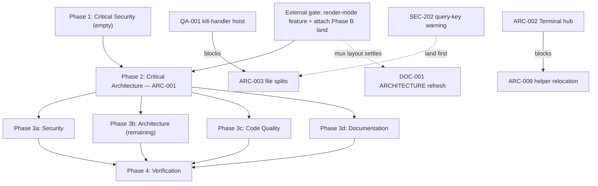

# Project Audit Report

> **Project**: par-term-emu-core-rust
> **Date**: 2026-10-06
> **Stack**: Rust (PyO3, cbindgen FFI), Python 3.12+, TypeScript/Next.js (web-terminal-frontend)
> **Audited by**: Claude Code Audit System
> **Audit cycle tag**: `audit-2026-10-06`

---

## Executive Summary

The project is in good health: security posture is Strong with zero Critical or High findings, documentation is comprehensive with enforced coverage gates, and production code is nearly free of panics and technical-debt markers. The single Critical finding is structural: `src/mux/attach/render.rs` (9,790 lines) concentrates the mux attach client's rendering, input routing, and modal state machines in one file that is also the repo's hottest churn location — remediation is gated on the in-flight render-mode feature landing, not urgent. The dominant theme is that the codebase's own proven decomposition playbook (`grid/`, `sequences/`, `python_bindings/`) was never applied to the mux daemon, PTY session, and attach renderer, so roughly 40% of crate complexity sits in its three least-decomposed files. Estimated effort for the top issues: three Large decompositions (gated on in-flight work) plus a scattering of Small hardening and doc fixes.

### Issue Count by Severity

| Severity | Architecture | Security | Code Quality | Documentation | Total |
|----------|:-----------:|:--------:|:------------:|:-------------:|:-----:|
| 🔴 Critical | 1 | 0 | 0 | 0 | **1** |
| 🟠 High     | 3 | 0 | 1 | 1 | **5** |
| 🟡 Medium   | 3 | 1 | 3 | 4 | **11** |
| 🔵 Low      | 2 | 5 | 2 | 4 | **13** |
| **Total**   | **9** | **6** | **6** | **9** | **30** |

---

## 🔴 Critical Issues (Resolve Immediately)

### [ARC-001] `src/mux/attach/render.rs` is a 9,790-line god file carrying the mux subsystem's complexity
- **Area**: Architecture (+ Code Quality — found independently by both domains)
- **Location**: `src/mux/attach/render.rs` (hot functions: `route_mouse` at line 4862, complexity 56, 4-level nesting; `route_plain` at line 2904, complexity 52)
- **Description**: Largest file in the crate by 2x (next is 4,736 lines). Parsight rates it Critical risk: 295–356 symbols, summed complexity 1,018, fan_in 2. It mixes at least five responsibilities: per-pane emulation mapping, frame damage-diffing, sidebar/tab-strip painting, modal interaction routing (menu/picker/prompt/help/resize modes), and mouse/key dispatch. Every render-mode change lands here (churn 119–156 per function in 14 days); the round-5/round-6 regression history shows branch-ordering bugs already occurring in `route_mouse`.
- **Impact**: The repo's highest-complexity functions sit in its least-decomposable file; every attach feature multiplies edit and merge-conflict risk in one place. The in-flight tab-strip/sidebar work is actively growing it.
- **Remedy**: After the in-flight render-mode work ships and the attach Phase B gate clears, split along the seams already visible in the header docs: `renderer.rs` (buffer painting/diff), `modal.rs` (the five mode state machines), `input_route.rs` (`route_plain`/`route_mouse`/`route_key`, extracting per-overlay hit-testers returning a `Hit` enum), `sidebar.rs`. Mirror the decomposition already done for `grid/` and `python_bindings/`.

---

## 🟠 High Priority Issues

### [ARC-002] `Terminal` remains a single hub type despite sub-struct decomposition
- **Area**: Architecture
- **Location**: `src/terminal/mod.rs:1100-1244` (struct), whole file (3,964 production lines, 231 functions)
- **Description**: `Terminal` carries the grids, parser, cursor, and ~30 feature-area sub-structs in one type in one file. Parsight: fan_in 111, in_degree 170, articulation point; its transitive impact query exceeded parsight's 262K-character output cap. The sub-struct grouping organizes state but does not split responsibility: every new feature lands as methods on `Terminal`, and `sequences/` handlers mutate `pub(crate)` fields directly, so nothing enforces which subsystem may touch which state.
- **Impact**: Every feature addition concentrates compile time, merge contention, and regression risk on one type and one file; observer dispatch, event eviction, clipboard caps, and notification logic share an impl block with the VT state machine.
- **Remedy**: Continue the ARC-001 (historical) extraction with two structural moves: hoist the event broker/observer dispatch into a standalone broker type owned by `Terminal`; make CSI/OSC/DCS handlers take the specific sub-struct they need rather than `&mut Terminal`, converting the sub-structs from a naming convention into a capability boundary.

### [ARC-003] Cluster of 2.9K–4.7K-line implementation files around mux/streaming/pty
- **Area**: Architecture (+ Code Quality — found independently by both domains)
- **Location**: `src/mux/dispatch.rs` (2,975 lines; `dispatch_command` complexity 51, churn 426), `src/mux/server.rs` (4,507 lines; `handle_client` churn 481 — highest in repo), `src/mux/command.rs` (3,771), `src/mux/attach/mod.rs` (4,736), `src/streaming/server.rs` (3,654), `src/pty_session/mod.rs` (3,529), `src/graphics/kitty.rs` (3,921)
- **Description**: The repo demonstrably knows how to decompose, but the mux daemon and PTY layers never got the same treatment. The two highest hotspot scores in the repo (`handle_client`, `dispatch_command`) are exactly the files with no internal seams; `dispatch.rs`/`server.rs` also absorb protocol parsing, client bookkeeping, and reply plumbing beyond the idiomatic command `match`.
- **Impact**: Churn and complexity co-locate, so review and testing granularity stays coarse and merge-conflict probability is the highest in the codebase (670 commits in 14 days land mostly here and in `attach/`).
- **Remedy**: Apply the established per-topic split: `dispatch.rs` into per-command-group handler files behind one `dispatch` module; `command.rs` parsing into per-verb modules; `pty_session/mod.rs` split the way `pty_session/reader.rs` already is (session lifecycle vs. I/O vs. macro playback).

### [ARC-004] CI never fires automatically — all workflows are dispatch-only
- **Area**: Architecture
- **Location**: `.github/workflows/ci.yml:3-4` (`on: workflow_dispatch` only; same for `deployment.yml:13-14` and `release.yml:3-4`)
- **Description**: The three-OS, three-Python test matrix, the mux-test job, and the version-check job exist and are high quality, but none has a `push` or `pull_request` trigger. Combined with the repo's normal mode of operation — multiple concurrent agent sessions committing directly to main — the entire quality gate rests on every session voluntarily running `make checkall-ci` before committing.
- **Impact**: One forgotten or skipped local gate lands unverified commits on main with no signal; the mux/Windows legs can go stale unnoticed until a release dispatch.
- **Remedy**: Add at minimum a `pull_request` trigger (or a nightly `schedule` dispatch) to `ci.yml` for the Rust-test and lint jobs; keep the expensive matrix legs on manual dispatch if runner cost is the concern.

### [QA-001] Near-duplicate kill-command handlers in dispatch.rs (similarity 0.92)
- **Area**: Code Quality
- **Location**: `src/mux/dispatch.rs:1298` (`cmd_kill_window`), `:1422` (`cmd_kill_session`), `:1634` (`cmd_kill_workspace`)
- **Description**: Parsight flags the three as near-identical: each resolves a target id, reports a specific missing-target error, tears down children, and emits notifications. The recent commit history shows error-reporting order is under active revision — a fix applied to two of three copies will silently miss the third.
- **Impact**: Triplicated teardown logic drifts silently; the exact class of bug recently fixed in adjacent commands can recur in the copy that was missed.
- **Remedy**: Hoist a shared `resolve_target_and_teardown(kind, id)` helper; keep only the variant-specific error strings and notification payloads inline. **Land this before ARC-003's file split.**

### [DOC-001] ARCHITECTURE.md last verified against v0.47.0; current release is 0.58.1
- **Area**: Documentation
- **Location**: `docs/ARCHITECTURE.md` (line 5 staleness marker)
- **Description**: The doc is honest about it and prefers runnable commands over hard-coded numbers, but 11 minor releases of structural change are unverified: the grid submodule list omits `snapshot.rs` (moved there in ARC-108), the mux `tree/`/`hooks/` subdirectory layout is absent, the screenshot section predates the 0.55.0 forwarder removal, and the Python-bindings layout predates the themed `*_api.rs` split. CLAUDE.md is now the only current layout reference.
- **Impact**: Rust embedders and new contributors reading internals get a picture roughly one major feature-generation old.
- **Remedy**: One re-verification pass against HEAD after the in-flight mux work lands (so the mux section is rewritten once): refresh module lists, grid subsection list, and screenshot/bindings sections; move the "verified against" marker forward.

---

## 🟡 Medium Priority Issues

### Architecture

- **[ARC-005] Two-tier public API: curated Python surface vs. crate-root re-export wall** — `src/lib.rs:152-172` re-exports ~65 `Py*` types in one undifferentiated block while `python/__init__.py` deliberately curates ~30 classes; no stability tiering for rlib consumers (par-term sees a 1,400+-symbol surface). Remedy: introduce a `prelude` module for core types, move peripheral types to module-scoped paths.
- **[ARC-006] Streaming message pipeline requires four hand-synced files per message type** — `src/streaming/protocol.rs`, `proto.rs` (`try_from` complexity 43, churn 225), `python_bindings/streaming.rs`, `tests/test_streaming.rs`. Remedy: extend the derive-crate approach already used for Python dict conversion to the app↔protobuf conversions. **Adopt or extend `docs/opus/ENH-041-notification-conversion-boilerplate.md` rather than filing a competing change.**
- **[ARC-007] Single crate produces four artifact types via a 15-entry feature matrix** — `Cargo.toml:49-329`. Deliberate, well-executed tradeoff; the mux subsystem alone spans four parsight communities (~1,250 symbols) and owns an on-disk persistence format. Remedy: when mux scope grows again, extract it as a workspace member. **Decision-gated, not scheduled** — adoption would relocate `src/mux/**`.

### Security

- **[SEC-201] Legacy htpasswd hash formats accepted with no warning (unsalted SHA1, MD5-crypt)** — CWE-916 / OWASP A02. `src/streaming/auth_hash.rs:170-200`, `src/streaming/config.rs:295-302`. The verifier deliberately accepts `{SHA}` and `$1$`/`$apr1$` alongside bcrypt (constant-time compares throughout), but an operator provisioning a legacy format gets no signal that stored credentials are offline-brute-forceable. Remedy: `warn!`-level log (once per hash, at load or first successful verify) directing regeneration with bcrypt; optionally gate `{SHA}` behind explicit opt-in.

### Code Quality

- **[QA-002] `reload_client_chords` is 20 copy-pasted match arms** — `src/mux/config.rs:784` (parsight complexity 64, but the real smell is duplication). Adding a chord requires a 6-line edit in three places and a typo in the string label compiles fine. Remedy: a small macro or closure collapses each arm to one line. Should not run concurrently with QA-001 (`dispatch_command` consumes `Chords` parsed here).
- **[QA-003] 10 `#[allow(clippy::too_many_arguments)]` suppressions across bindings and protocol layers** — `src/ansi_utils.rs:68`, `src/mux/attach/mod.rs:2219`, `src/streaming/protocol.rs:1406`/`:1674`, `src/streaming/server.rs:2217`, `src/streaming/py_convert.rs:126`, `src/python_bindings/streaming.rs:38`/`:1004`, `src/python_bindings/common.rs:2525`/`:2646`. PyO3 signatures partially justify it, but internal constructors (e.g. `ConnectedBuilder` path) could take a config struct; keep the allow only on PyO3-facing kwargs-shaped seams.
- **[QA-004] web-terminal-frontend has almost no tests** — one test file (`components/__tests__/Terminal.test.tsx`) for ~7 components plus `lib/terminal-connection.ts`, against 3,553 Rust + 669 Python tests. WebSocket decode/reconnect/keyboard-encoding can regress undetected. Remedy: unit-test `lib/terminal-connection.ts` message decoding and reconnect logic first (pure logic, easiest win).

### Documentation

- **[DOC-002] Dead path references in CHANGELOG entries, including the current 0.58.0 section** — 12 path-shaped references no longer resolve (CHANGELOG.md lines 162, 182, 190, 384 ×3, 569, 630, 781 ×4). Examples: 0.58.0 cites `src/mux/hooks.rs`, `src/pty_session.rs`, `src/mux/tree.rs` — all directories today. `make doc-links-check` (lychee) covers markdown links only, so path-shaped code spans drift silently. Remedy: update the three 0.58.0 entries to current paths **before the 0.58.1 push**; accept older entries as frozen history or add path-span checking to the gate.
- **[DOC-003] Broken references inside internal design notes (docs/opus)** — ENH-035 cites `docs/CHANGELOG.md` (changelog is at root), ENH-039 cites `src/mux/pane_endpoint.rs` (does not exist under that name), ENH-040 cites `.cargo/audit.toml` (project uses `deny.toml`). Reachable from public-facing docs via CHANGELOG links. Remedy: correct the three targets; for ENH-039 point at the actual landed location of the hook-only endpoint.
- **[DOC-004] Python stub docstring coverage at 48% (632 of 1,315 defs in `_native.pyi`)** — the undocumented half is dominated by trivial data-class property accessors; the sampled public method surface is fully documented. Rust side enforces `missing_docs` but no equivalent gate exists for generated stubs. Remedy: document the accessor blocks in the binding source, or add a stub-coverage check with an explicit allow-list for property accessors.
- **[DOC-005] No consolidated troubleshooting/FAQ document** — STREAMING.md, MUX.md, and BUILDING.md each cover their own failure modes, but there is no single troubleshooting entry point for the library across 27 docs. Remedy: a short `docs/TROUBLESHOOTING.md` (or README FAQ) aggregating the top five failure modes, cross-linked from QUICKSTART.

---

## 🔵 Low Priority / Improvements

### Architecture

- **[ARC-008] Derive crate version skew is managed by comment only** — `Cargo.toml:70` pins `par-term-emu-derive` at 0.46.0 against a 0.58.1 host crate with the sync rule living in CLAUDE.md. A `release-check`-style gate asserting the spec matches the derive crate's version would close the manual loop.
- **[ARC-009] Module-level helper cohesion in `src/terminal/mod.rs`** — `unix_millis`, `cells_to_text`, `html_escape` (lines 175-220) are generic utilities defined beside `Terminal`; they belong in `text_utils`/`ansi_utils`, which already exist. Sequence after/with ARC-002.

### Security

- **[SEC-202] API key accepted in URL query string (opt-in) with no runtime warning** — CWE-598. `src/bin/streaming_server/cli.rs:152-153`, consumed at `src/streaming/server.rs:133-146`. Opt-in and off by default (right call), but `--allow-api-key-in-query` leaks keys into access/proxy logs and history with no startup warning. Remedy: startup `warn!` when enabled; document the browser-workaround rationale.
- **[SEC-203] Frontend download has no integrity pinning beyond TLS** — CWE-494. `src/bin/streaming_server/frontend_download.rs:157-197`. TLS + size cap + traversal-safe `unpack()` are all correct; the gap is no checksum/signature on the release archive, so release-asset compromise flows into the served web root. Remedy: embed expected SHA-256 per release (or fetch a sidecar checksums asset) and verify before extraction.
- **[SEC-204] `.env` patterns absent from `.gitignore`** — covers `venv/`/`env/` but not `.env`/`.env.local`. No secret-bearing file is committed today (verified — only tracked env file is a placeholder `.env.example`). Future-accident guard. Remedy: add `.env`, `.env.local`, `.env*.local`.
- **[SEC-205] Frontend dev/start scripts bind 0.0.0.0** — `web-terminal-frontend/package.json:6-8`. Impact limited (shipped artifact is the static bundle behind the hardened Rust server); only affects developer machines. Remedy: bind dev to loopback by default; pass `-H 0.0.0.0` explicitly for LAN testing.
- **[SEC-206] Cleartext password option available in Basic Auth config with no startup warning** — CWE-256. `src/streaming/config.rs:223-225,288-291`. Handling is exemplary (zeroize, constant-time compare), but nothing tells the operator a plaintext credential is configured. Remedy: startup `warn!` pointing at `htpasswd -B`.

### Code Quality

- **[QA-005] Near-duplicate implementations in `pty_session` and `grid`** — `src/pty_session/mod.rs` has two parallel `write` implementations (lines 121 and 935, similarity 0.99) plus `try_wait`/`wait`/`spawn_login_shell` pairs (0.97+); `src/grid/mod.rs:222/247` damage-range iterators (0.96). One is the pre-reader-thread legacy path. Consolidate when next touched.
- **[QA-006] 37 near-duplicate `main()` functions across `examples/`** plus duplicated `make_terminal` test helpers (`src/terminal/snapshot_manager.rs:271`, `src/terminal/replay.rs:297`). Cosmetic; examples are expected to be self-contained — the shared test helper is the only part worth consolidating.

### Documentation

- **[DOC-006] Style-guide deviations** — emoji callouts (`📝` QUICKSTART.md:219, `⚠️` BUILDING.md:3) vs. the style guide's plain blockquotes; per-node Mermaid `style` declarations where `classDef` is preferred; SECURITY.md places content before its TOC. Cosmetic.
- **[DOC-007] MANUAL-PASS.md at repo root** — a ship-gate working checklist at the root rather than under `docs/` or `docs/opus/`. Consider relocating.
- **[DOC-008] Env-var reference is distributed** — `PAR_TERM_REPLY_XTWINOPS`, `PAR_MUX_CONFIG`/`PAR_MUX_SOCKET`/`DEBUG_LEVEL`, streamer vars live in SECURITY.md/MUX.md/STREAMING.md. Each documented where relevant; a one-table consolidation would help integrators.
- **[DOC-009] README "What's New" carries seven release blurbs (~120 lines)** — intentional per its own note, but the cutoff policy could tighten to the last three.

---

## Detailed Findings

> IDs were consolidated during cross-domain dedup. Mapping from the per-agent reports:
> Architecture agent's ARC-002 (render.rs) → **ARC-001**; its ARC-001 (Terminal hub) → **ARC-002**; its ARC-003 → **ARC-003**.
> Code Quality agent's QA-001/QA-002 (render.rs) → merged into **ARC-001**; its QA-003 (mux dispatch churn) → merged into **ARC-003**; its QA-004 → **QA-001**; QA-005 → **QA-002**; QA-006 → **QA-003**; QA-007 → **QA-004**; QA-008 → **QA-005**; QA-010 → **QA-006**.
> Security agent's SEC-201..SEC-206 keep their IDs. Documentation agent's findings were unnumbered → **DOC-001..DOC-009**.

### Architecture & Design

**Summary** (0 Critical, 4 High, 3 Medium, 3 Low — Overall: Good): The codebase's proven decomposition playbook (`grid/`, `sequences/`, `python_bindings/`) has not been applied to the mux daemon, PTY session, and attach renderer, so the repo's highest churn and highest complexity concentrate in its least-decomposed files, while the `Terminal` hub still absorbs every new feature at the crate's center.

Full detail for ARC-001 through ARC-009 is in the issue sections above. Per-agent observations not filed as cards: `register_classes` (`src/lib.rs:260-330`) scores complexity 67 in parsight but is a linear `m.add_class` list — metric false positive, acceptable; table-drive it only if the class count keeps growing.

Per-agent positive findings: feature-flag architecture is exemplary (`sim` headless profile with `compile_error!` misuse guard, `mux`/`mux-bin` and `streaming`/`streaming-bin` splits, slim-profile dependency exclusion verified by `check-features`); verification-gate density is exceptional; dependency hygiene is current with RUSTSEC-driven replacements recorded at the dep site; the PyO3 layer has a real abstraction strategy (`TerminalAccess` trait + macro families + dedicated proc-macro crate, centralized `From<...> for PyErr`); resource safety is designed in (bounded event queue with eviction, 10 MB clipboard cap, decoder limits, `build_stamp()` daemon/client version-drift detection).

### Security Assessment

**Summary** (0 Critical, 0 High, 1 Medium, 5 Low — Overall: Strong): No hardcoded secrets, no TLS-verification bypasses, no injection paths found. The only posture-reducing finding is silent acceptance of legacy weak htpasswd hash formats (SEC-201) — a visibility gap, not an implementation flaw.

Per-agent highlights: constant-time comparison (`subtle`) on every credential path with SEC-008 username-enumeration timing defense, `zeroize` on drop, API key masked in `Debug` and `hide_env_values` on the CLI; par-mux transport hardened to the tmux model (per-UID `0700` socket directory with owner/mode verified, peer-euid check fail-closed, Windows named pipes with owner-only SDDL DACL plus the SEC-112 server-identity check); streaming server web hardening (Origin validation, loopback-default CORS, anti-clickjacking middleware); untrusted terminal-content handling (HTML escaping, decoder pixel-product limits, AVIF/EXR deliberately excluded per RUSTSEC-2024-0436, kitty temp-file reads gated to a marked temp dir); command-execution hygiene (metacharacter rejection, argv tables, shape-validated hook reports); the one signal `unsafe` has a documented PID-recycling mitigation; atomic `0600` persistence with `file_stem()`-derived names.

### Code Quality

**Summary** (0 Critical, 1 High, 3 Medium, 2 Low filed — Overall: Good; excellent outside the mux subsystem): The mux/attach subsystem concentrates ~40% of crate complexity into god files that are also the three hottest churn locations — decomposition after the in-flight render work lands is the single highest-value refactor available.

Technical-debt census: exactly **1** TODO marker in the 164k-line source tree (`src/mux/attach/conn.rs:361`, tracked work); 33 `#[allow]` total, 21 clippy-specific, mostly justified and documented (C FFI `nonstandard_style`, generated protobuf `deprecated`, a crate-level `missing_docs` allow-list with a documented shrink plan, `warn(clippy::undocumented_unsafe_blocks)`); ~40 files >500 lines. Test coverage: 41 Python test files (11,738 lines), 13 Rust integration files (16,252 lines), 101 inline `#[cfg(test)]` modules, plus a `fuzz/` directory with proptest regressions — Good (>70%) for Rust/Python core, Low (<30%) for the frontend. All 161 `panic!` hits are test-module assertions.

Per-agent observations not filed as cards: `register_classes` complexity score is a linear-list false positive (see Architecture); 2 `console.log` calls in the frontend are inside gated logging helpers — acceptable.

Per-agent positive findings: near-zero production `unwrap()`/`expect()` (2 + 2, both in `src/streaming/server.rs:128,144` with justification comments); `src/pty_session/reader.rs` is a model error-handling implementation (documented terminal-error classification, anti-busy-spin regression test, generation-counter race commentary citing the specific issue); documented lint-suppression governance with `-D warnings` in the gate; frontend TypeScript is clean (zero `any`, no unguarded non-null assertions).

### Documentation Review

**Summary** (0 Critical, 1 High, 4 Medium, 4 Low filed — Overall: Good): Onboarding works end to end; README examples match the live API (three sampled methods verified against bindings and stubs; QUICKSTART's "39 example scripts" count is exactly right); the CHANGELOG is top-tier (cited paths and card ids, migration notes for breaking changes). The most impactful gap is ARCHITECTURE.md's 11-release staleness.

Inventory: README — Excellent; API_REFERENCE.md (2,582 lines, 13 sections) covers all recently shipped methods checked; Changelog — exemplary; Contributing — thorough; Deployment/ops — appropriately split across STREAMING.md + MUX.md for a library. Doc-link graph: 210 doc-to-doc links, bidirectional README/QUICKSTART/docs, no orphaned main docs (16 broken-link rows found, 1 false positive — the `docs/MUX.md` `%APPDATA%` row is a legitimate Windows path in prose).

Per-agent positive findings: enforced documentation culture (`ffi-header-check`, `ffi-surface-check`, `mux-docs-check`, `doc-links-check`, `check_release_notes.py` in `make checkall`; `missing_docs` and undocumented-unsafe warnings with a shrinking allow-list); a 756-line in-repo style guide the doc set broadly follows.

---

## Remediation Roadmap

### Immediate Actions (Before Next Deployment / 0.58.1 push)
1. **DOC-002** — fix the three 0.58.0 CHANGELOG path references so the pending release ships with resolvable paths.
2. **SEC-201** — add the legacy-hash warning log line (small, additive, independent of the release).
3. **ARC-004** — add a `pull_request` or nightly trigger to `ci.yml`.
4. **SEC-204** — add `.env` patterns to `.gitignore` (one line, future-accident guard).

### Short-term (Next 1–2 Sprints)
1. QA-001 (kill-handler helper hoist), QA-002 (chords dedup), QA-003 (param structs), SEC-202/SEC-205/SEC-206 (warnings + dev bind), SEC-203 (download checksum).
2. DOC-003 (three opus-note refs), DOC-005 (TROUBLESHOOTING.md), DOC-004 (stub accessor coverage).
3. QA-004 (frontend tests for `terminal-connection.ts`).

### Long-term (Backlog)
1. ARC-001 — render.rs decomposition (gated: after render-mode feature + attach Phase B land).
2. ARC-002 / ARC-009 — Terminal hub extraction, then helper relocation.
3. ARC-003 — mux/pty/streaming file splits (after QA-001).
4. ARC-005 / ARC-006 — API tiering; streaming conversion codegen (adopt ENH-041).
5. ARC-007 — mux workspace extraction (decision-gated). ARC-008 — derive-version gate.
6. QA-005 / QA-006 — duplicate consolidation when next touched. DOC-001 (after mux work settles), DOC-006..009.

---

## Positive Highlights

1. **Verification-gate density is exceptional** — `make checkall` runs tests across five feature combinations plus fmt/clippy/ruff/pyright, generated-artifact drift gates (cbindgen FFI header, FFI surface docs, mux docs, caps table, stub drift, doc links), seven fuzz targets with a 512 MB RSS cap, criterion benches, and cargo-deny/bun-audit/pip-audit supply-chain checks.
2. **Security engineering is labeled and mature** — SEC-0xx..SEC-134 identifiers with rationale comments, constant-time credential comparison everywhere, `zeroize`, username-enumeration timing defense, tmux-model socket hardening on both Unix and Windows, and deliberate decoder exclusions citing RUSTSEC advisories.
3. **Near-zero production panic surface** — 2 `unwrap()` + 2 `expect()` in production code across all major modules, both justified in comments; all 161 `panic!` hits are test assertions; exactly 1 TODO in 164k lines, with a tracking reference.
4. **Feature-flag architecture is exemplary** — the `sim` headless profile with a `compile_error!` misuse guard, `mux`/`mux-bin` and `streaming`/`streaming-bin` splits, and a CI `check-features` matrix make dependency isolation deliberate and verifiable.
5. **Enforced documentation culture** — `missing_docs` + undocumented-unsafe warnings with a shrinking itemized allow-list, five doc-related drift gates in the build, and a 210-edge doc cross-reference graph with no orphaned main docs.
6. **The PyO3 binding layer has a real abstraction strategy** — `TerminalAccess` trait, `impl_terminal_*` macro families, and a dedicated proc-macro crate emit shared method groups once; error mapping is centralized.
7. **`src/pty_session/reader.rs` is a model error-handling implementation** — documented terminal-error classification, an anti-busy-spin regression test, and generation-counter race commentary citing the specific issue.
8. **Resource safety is designed in** — bounded event queue with eviction, 10 MB clipboard cap, image-decoder limits, and a compile-time `build_stamp()` for daemon/client version-drift detection.

---

## Audit Confidence

| Area | Files Reviewed | Confidence |
|------|---------------|-----------|
| Architecture | Entry points, core modules, manifests, CI config; full parsight graph (477 files, 15,199 symbols) | High |
| Security | Full-repo sweep: streaming auth/CORS/TLS, mux daemon transport + persistence, PTY, C FFI, graphics decoding, bindings, manifests, committed files | High |
| Code Quality | parsight analytics (dead code, hotspots, complexity, duplication) + reads of core business logic and test files | High |
| Documentation | All 27 main docs read; doc-link graph; docstring sampling verified against live API | High |

---

## Remediation Plan

> This section is generated by the audit and consumed directly by `/fix-audit`.
> It pre-computes phase assignments and file conflicts so the fix orchestrator
> can proceed without re-analyzing the codebase.

### Phase Assignments

#### Phase 1 — Critical Security (Sequential, Blocking)

No critical security issues found. Phase 1 is empty.

#### Phase 2 — Critical Architecture (Sequential, Blocking)

| ID | Title | File(s) | Severity | Blocks |
|----|-------|---------|----------|--------|
| ARC-001 | render.rs god file decomposition | `src/mux/attach/render.rs` | Critical | — |

**External gate**: ARC-001 must not start until the in-flight render-mode tab-strip/sidebar feature lands and the attach Phase B ship gate clears — the file is under active development (churn 119–156/function per 14 days). This gate outranks the phase ordering.

#### Phase 3 — Parallel Execution

**3a — Security (all)**
| ID | Title | File(s) | Severity |
|----|-------|---------|----------|
| SEC-201 | Warn on legacy htpasswd hash formats | `src/streaming/auth_hash.rs`, `src/streaming/config.rs` | Medium |
| SEC-202 | Startup warning for `--allow-api-key-in-query` | `src/bin/streaming_server/cli.rs`, `src/streaming/server.rs` | Low |
| SEC-203 | Checksum-pin frontend download | `src/bin/streaming_server/frontend_download.rs` | Low |
| SEC-204 | Ignore `.env` patterns | `.gitignore` | Low |
| SEC-205 | Bind dev server to loopback | `web-terminal-frontend/package.json` | Low |
| SEC-206 | Startup warning for ClearText password | `src/streaming/config.rs` | Low |

**3b — Architecture (remaining)**
| ID | Title | File(s) | Severity | Blocks |
|----|-------|---------|----------|--------|
| ARC-002 | Terminal hub extraction | `src/terminal/mod.rs` | High | ARC-009 |
| ARC-003 | mux/pty/streaming file splits | `src/mux/dispatch.rs`, `src/mux/server.rs`, `src/mux/command.rs`, `src/mux/attach/mod.rs`, `src/streaming/server.rs`, `src/pty_session/mod.rs`, `src/graphics/kitty.rs` | High | — (blocked by QA-001) |
| ARC-005 | Public-API tiering (`prelude`) | `src/lib.rs`, `python/par_term_emu_core_rust/__init__.py` | Medium | — |
| ARC-006 | Streaming conversion codegen | `src/streaming/protocol.rs`, `src/streaming/proto.rs`, `src/python_bindings/streaming.rs` | Medium | — (adopt ENH-041) |
| ARC-007 | mux workspace extraction (decision-gated) | `Cargo.toml`, `src/mux/**` | Medium | — |
| ARC-008 | Derive-version skew gate | `Cargo.toml`, release-check script | Low | — |
| ARC-009 | Relocate generic helpers | `src/terminal/mod.rs`, `src/text_utils.rs`/`src/ansi_utils.rs` | Low | — (blocked by ARC-002) |

**3c — Code Quality (all)**
| ID | Title | File(s) | Severity |
|----|-------|---------|----------|
| QA-001 | Hoist kill-command teardown helper | `src/mux/dispatch.rs` | High |
| QA-002 | Dedup `reload_client_chords` arms | `src/mux/config.rs` | Medium |
| QA-003 | Param structs for internal multi-arg constructors | `src/streaming/*`, `src/python_bindings/*`, `src/ansi_utils.rs`, `src/mux/attach/mod.rs` | Medium |
| QA-004 | Frontend tests for terminal-connection.ts | `web-terminal-frontend/` | Medium |
| QA-005 | Consolidate pty_session/grid duplicates | `src/pty_session/mod.rs`, `src/grid/mod.rs` | Low |
| QA-006 | Consolidate shared test helper | `src/terminal/snapshot_manager.rs`, `src/terminal/replay.rs` | Low |

**3d — Documentation (all)**
| ID | Title | File(s) | Severity |
|----|-------|---------|----------|
| DOC-001 | Refresh ARCHITECTURE.md to HEAD | `docs/ARCHITECTURE.md` | High |
| DOC-002 | Fix 0.58.0 CHANGELOG paths | `CHANGELOG.md` | Medium |
| DOC-003 | Fix docs/opus broken refs | `docs/opus/ENH-035*.md`, `ENH-039*.md`, `ENH-040*.md` | Medium |
| DOC-004 | Stub docstring coverage | `python/par_term_emu_core_rust/_native.pyi`, `src/python_bindings/` | Medium |
| DOC-005 | Add TROUBLESHOOTING.md | `docs/TROUBLESHOOTING.md` (new) | Medium |
| DOC-006 | Style-guide deviations | `QUICKSTART.md`, `docs/BUILDING.md`, `docs/SECURITY.md` | Low |
| DOC-007 | Relocate MANUAL-PASS.md | `MANUAL-PASS.md` | Low |
| DOC-008 | Consolidated env-var table | new section in README or docs/ | Low |
| DOC-009 | Tighten What's New cutoff | `README.md` | Low |

### File Conflict Map

| File | Domains | Issues | Risk |
|------|---------|--------|------|
| `src/mux/dispatch.rs` | Architecture + Code Quality | ARC-003, QA-001 | ⚠️ Land QA-001 (helper hoist) before ARC-003 (file split), or the dedup fans across the new files |
| `src/streaming/server.rs` | Architecture + Security | ARC-003, SEC-202 | ⚠️ Land SEC-202 (additive log line) before the ARC-003 split |
| `src/python_bindings/streaming.rs` | Architecture + Code Quality | ARC-006, QA-003 | ⚠️ Read before edit |
| `web-terminal-frontend/` | Security + Code Quality | SEC-205, QA-004 | Different files (package.json vs tests) — parallel-safe |

### Blocking Relationships

- In-flight render-mode tab-strip/sidebar work → ARC-001: the file is under active development; decompose only after it lands and the attach Phase B gate clears.
- In-flight mux work → DOC-001: refresh ARCHITECTURE.md once, after the mux layout settles (the Phase B gate already carries a docs step).
- QA-001 → ARC-003: hoist the kill-handler helper before splitting `dispatch.rs`.
- ARC-002 → ARC-009: helper moves out of `terminal/mod.rs` should ride the hub-extraction slice, not precede it.
- SEC-202 → ARC-003: additive log line lands before the streaming-server split.
- DOC-002 → Release 0.58.1 push: fix the 0.58.0 changelog paths before the (currently push-blocked) release ships.
- ARC-006 ↔ ENH-041: adopt or extend `docs/opus/ENH-041-notification-conversion-boilerplate.md`; do not file a competing change.
- ARC-007: decision-gated — adoption relocates `src/mux/**`; all mux-file fixes either land first or assume no split.

### Dependency Diagram

```mermaid
graph TD
    GATE["External gate: render-mode feature + attach Phase B land"]
    P1["Phase 1: Critical Security (empty)"]
    P2["Phase 2: Critical Architecture — ARC-001"]
    P3a["Phase 3a: Security"]
    P3b["Phase 3b: Architecture (remaining)"]
    P3c["Phase 3c: Code Quality"]
    P3d["Phase 3d: Documentation"]
    P4["Phase 4: Verification"]

    GATE --> P2
    P1 --> P2
    P2 --> P3a & P3b & P3c & P3d
    P3a & P3b & P3c & P3d --> P4

    QA001["QA-001 kill-handler hoist"] -->|blocks| ARC003["ARC-003 file splits"]
    ARC002["ARC-002 Terminal hub"] -->|blocks| ARC009["ARC-009 helper relocation"]
    SEC202["SEC-202 query-key warning"] -.->|land first| ARC003
    GATE -.->|mux layout settles| DOC001["DOC-001 ARCHITECTURE refresh"]
```
