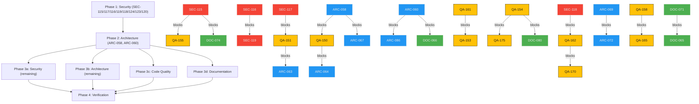

# Project Audit Report

> **Project**: par-term-emu-core-rust (v0.55.0 released; HEAD 6828c63 carries 13 unreleased commits after the bump 73a118f)
> **Date**: 2026-09-28
> **Cycle tag**: `audit-2026-09-28`
> **Stack**: Rust (PyO3 0.29 bindings, C FFI + iOS `TerminalCore.xcframework`), Python 3.12+, TypeScript/Next.js web frontend, WebSocket streaming server, par-mux daemon
> **Audited by**: Claude Code Audit System — /opus-audit run (Opus 5 subagents; parsight graph `par-term-emu-core-rust`, index current at 6828c63)
> **Previous run**: 2026-09-26 run 2 (`audit-2026-09-26-r2`, HEAD d53ed92). Its board cards are all closed. Items still present in the code are marked **recurring: prior &lt;ID&gt;** using the prior AUDIT.md's own IDs.

---

## Executive Summary

The prior cycle's fixes hold. The SEC-108 client euid check, the Windows named-pipe identity check, the kitty file-media gate on `PtyTerminal` and the streamer, and the bounded input queue were all re-verified. There are no Critical findings.

The most important new finding is **SEC-115**, reproduced end-to-end. The par-mux host-telemetry probe runs `git` every 30 s in a directory that pane output controls through OSC 7, so a repo whose `.git/config` sets `core.fsmonitor` executes arbitrary commands as the user.

Three more High problems come from the new surfaces:
1. **ARC-058**: one `ESC c` (or `CSI ! p`) from any program rebuilds the whole `Terminal`. This silently resets host security policy and detaches every observer and trigger.
2. **QA-150**: the dirty-row damage contract that the iOS FFI renderer depends on still misses ICH/DCH, the rectangle operations, RIS and snapshot restore.
3. **ARC-060**: the `list-agents` roster grammar breaks par-term's shipped parser, which drops any row carrying a blocked reason or telemetry.

The C FFI also has two memory-safety defects, an enum UB (QA-151) and a length/buffer mismatch reachable from OSC 7 (SEC-117). The documented `cargo install` path for the streamer fails (DOC-067). The High tier is roughly 4–6 focused days.

Strengths: validation of the new telemetry endpoint is careful, the FFI layout is pinned on both sides, the Python API reference is machine-checked (497/497 signatures), and the resource-caps table is gated.

### Issue Count by Severity

| Severity | Architecture | Security | Code Quality | Documentation | Total |
|----------|:-----------:|:--------:|:------------:|:-------------:|:-----:|
| 🔴 Critical | 0 | 0 | 0 | 0 | **0** |
| 🟠 High     | 2 | 3 | 2 | 5 | **12** |
| 🟡 Medium   | 16 | 1 | 15 | 21 | **53** |
| 🔵 Low      | 9 | 5 | 14 | 8 | **36** |
| **Total**   | **27** | **9** | **31** | **34** | **101** |

**Merged duplicates.** Six findings were reported by more than one domain. Each keeps one ID, and the absorbed IDs are retired so the numbering gaps are intentional:

| Kept | Absorbs | Topic |
|------|---------|-------|
| QA-150 | ARC-059 | Incomplete dirty-row damage contract |
| QA-151 | ARC-061, SEC-122 | `TermKeyEvent.key` enum UB across the FFI |
| SEC-117 | QA-152 | FFI `title_len`/`cwd_len` vs NUL-truncated C string |
| SEC-115 | ARC-065, QA-155 (git-flag half) | Host probe runs git in an OSC 7-chosen cwd |
| QA-153 | ARC-066 | PTY input drain busy-polls; drain does not own all writes |
| QA-165 | ARC-067 (size half) | Large/god files keep growing |

`QA-155` keeps the `run_git` pipe-deadlock and shutdown-join half; `SEC-124` keeps the wedged-filesystem half. The architecture agent's catch_unwind note became its own finding, ARC-087; ARC-085 is only the `dirty_ranges` allocation.

**Prior-ID note.** In the previous AUDIT.md, `SEC-112` is the kitty file-media gate and `SEC-114` is the `paste` advisory. Some commit messages use `SEC-112` for the Windows named-pipe check and `SEC-114` for file media. This report cites the prior AUDIT.md's numbering.

---

## User-Directed Focus

No focus areas were supplied. The agents weighted the code changed since d53ed92: the C FFI embedding surface, the mux telemetry endpoint and host probe, the streaming input-path rework, and the dirty-row contract.

---

## 🔴 Critical Issues (Resolve Immediately)

None.

---

## 🟠 High Priority Issues

### [SEC-115] Host-telemetry probe runs `git` in an OSC 7-controlled cwd, executing repo-configured hooks (merges ARC-065, QA-155 git-flags half)
- **Area**: Security
- **Location**: `src/mux/host_probe.rs:133-172` (`run_git`: `git -C <cwd>` with no config hardening), `:96-126` (`symbolic-ref`, `diff-index --quiet HEAD --`, `ls-files --others`), `:229-249` (`host_probe_sweep`); `src/mux/pane.rs:163-168` (`PaneSnapshotParts::cwd` prefers `terminal.current_directory()`, the OSC 7 value, over `process_cwd(child_pid)`); `src/terminal/sequences/osc/shell.rs:11-32` (OSC 7 hostname parsed, then dropped).
- **Description**:
  - The 30 s sweep probes every rostered pane's cwd, and that cwd comes from program output.
  - `git diff-index` and `git ls-files` execute the repo's `core.fsmonitor` hook, and a worktree `diff-index` runs clean filters. Git's dubious-ownership guard does not help for a repo the victim owns whose `.git/config` an attacker wrote (an extracted tarball, `npm pack`, or an embedded `core.worktree`).
  - An SSH pane's remote cwd is probed as a local path.
- **Impact**:
  - Reproduced end-to-end against a throwaway daemon on a `mktemp` socket: a pane emitted OSC 7 for a repo whose `core.fsmonitor` wrote a marker file, the pane was rostered via `pane.report_agent`, and the next sweep executed the hook.
  - The result is arbitrary command execution in a long-lived daemon, driven by untrusted output.
- **Remedy**: Apply three layers together.
  1. Probe `process_cwd(child_pid)` only, never the OSC 7 value, and skip the pane when that is unavailable.
  2. Run every git invocation with `-c core.fsmonitor=false -c core.hooksPath=/dev/null -c safe.bareRepository=explicit`, `--no-optional-locks`, and `GIT_OPTIONAL_LOCKS=0`/`GIT_TERMINAL_PROMPT=0`.
  3. Use `git diff-index --cached --quiet HEAD --`, where the clean filter does not run.

### [SEC-116] Kitty zlib (`o=z`) decompression bomb; APC and chunk buffers unbounded (recurring: prior SEC-109)
- **Area**: Security
- **Location**: `src/graphics/kitty.rs:549-561` (`decompress_zlib`: `read_to_end`, no limit), `:505` (`data_chunks.push`, no total cap), `:537` (`concat()`); `src/terminal/apc_filter.rs:123-146` (`apc_buffer.push`, no cap); reached from `Terminal::process` (`src/terminal/mod.rs:2799`); `docs/SECURITY.md:897` wrongly claims the kitty path is capped by `MAX_DECOMPRESSED_SIZE` (that cap applies only to the streaming wire).
- **Description**: A small APC carrying a large zlib payload inflates without bound before `decode_pixels` rejects the dimensions. The APC accumulator and `data_chunks` also grow without limit. ENH-020 added the fuzz target and `-rss_limit_mb`, but the runtime cap was never added.
- **Impact**: `cat` of a crafted file, a hostile SSH host, or a tailed log can OOM the embedding process. Under par-mux or the streamer, one pane takes down every session.
- **Remedy**:
  - Stream-decompress through `take(limit + 1)`. The limit is `s*v*{3,4}` when known, else `MAX_IMAGE_PIXELS * 4`.
  - Cap accumulated `data_chunks` bytes and `apc_buffer` length at 64 MiB, resetting on overflow.
  - Add `/// cap:` doc comments and correct SECURITY.md.

### [SEC-117] FFI `SharedState.title_len`/`cwd_len` disagree with the NUL-truncated C string (merges QA-152)
- **Area**: Security
- **Location**: `src/ffi.rs:124-139` (`title_len = title_str.len()`, then `CString::new(title_str).unwrap_or_default()`; same pattern for `cwd`); `include/terminal_core.h:78-82` documents "`*_len` bytes"; reachability: `src/terminal/sequences/osc/shell.rs:288-310` (`parse_osc7_url` percent-decodes `%00` to U+0000), stored unchecked in `src/terminal/shell_integration.rs:160-185`.
- **Description**: An interior NUL makes `CString::new` fail. The fallback is an empty 1-byte string, while the length field still reports N.
- **Impact**: Reproduced via ctypes: `cwd_len` was 4003 while `strlen(cwd)` was 0. An iOS or C consumer that honors the length, such as `Data(bytes:count:)`, performs a heap over-read driven by remote shell output.
- **Remedy**:
  - Replace interior NUL with U+FFFD, or strip it, before `CString::new`.
  - Compute the lengths from `cstring.as_bytes().len()`.
  - Reject decoded OSC 7 and iTerm2 CurrentDir paths that contain NUL or C0 controls.
  - Add an FFI test asserting `strlen(cwd) == cwd_len`.

### [ARC-058] RIS (`ESC c`) and DECSTR (`CSI ! p`) rebuild the whole `Terminal`, wiping host policy, observers, triggers and damage
- **Area**: Architecture
- **Location**: `src/terminal/mod.rs:3138-3150` (`reset()` does `*self = Self::with_scrollback(..)`, keeping only tab stops); callers `src/terminal/sequences/esc.rs:105-107` (RIS), `src/terminal/sequences/csi/report.rs:93-95` (DECSTR), `src/python_bindings/terminal/mod.rs:182` (`PyTerminal.reset`).
- **Description**:
  - Probed against the 0.55.0 build. After `ESC c`, every embedder setting reverts to its default:
    - `get_allow_file_media` goes from `off` to `temp_only`.
    - `disable_insecure_sequences` goes from True to False, and `accept_osc7` from False to True.
    - `max_osc_data_length` goes from 4096 to 1 MiB, and the sixel limits revert as well.
    - `answerback_string` is dropped, `observer_count()` goes from 1 to 0, `list_triggers()` goes from 1 to 0, and `get_dirty_rows()` returns `[]`.
  - DECSTR is a soft reset, which VT510 defines as leaving the screen and scrollback intact. Here it goes through the same path and erases the screen and all scrollback. That was verified: the scrollback went from 2 lines to 0.
- **Impact**:
  - `reset`/`tput reset` trigger this during ordinary use.
  - A remote program can turn off a hardened embedder's policy (streamer `kitty_file_media`, `disable_insecure_sequences`) with one escape.
  - par-term's observers detach silently, and damage-driven renderers keep stale pixels.
  - Every setter added in future is reset by default.
- **Remedy**:
  - In `reset()`, save and restore all state an embedder sets through the API. That is the security flags, limits, answerback, file-media mode, theme/palette config, unicode config, observers, triggers, macros, notification config and event subscription. Then mark every row dirty.
  - Give DECSTR its own `soft_reset()`: modes, SGR, charsets, margins, cursor, saved cursor. No grid wipe.
  - Add a regression test that sets every setter, sends `ESC c`, and asserts each one survives.
  - The Host/Services/VT struct split belongs to ARC-067.

### [ARC-060] `list-agents` roster grammar is ambiguous and breaks par-term's shipped parser
- **Area**: Architecture
- **Location**: `src/mux/dispatch.rs:311-370` (`cmd_list_agents`: `%N <agent> <state> <source> [reason…] [telemetry=…] [host_telemetry=…]`); `src/mux/hooks.rs:225-236` (free-text reason, whitespace-collapsed only); `CHANGELOG.md:15` ("Backward compatible by construction"); downstream `~/Repos/par-term/par-term-mux/src/agents.rs:76-92` (`parse_list_line` takes the last token as the source).
- **Description**:
  - par-term pins core `0.55`. Its parser fails `AgentSource::parse` and drops any row with a trailing reason (column added in 02920a6, v0.50.0) or a telemetry token (0.55.0).
  - Agent, state and source are positionally parseable, because state is validated to `working|blocked|idle|unknown`. The free-text reason followed by `key=value` tokens is still ambiguous: a reason may contain `telemetry=` or end in `hook`.
- **Impact**:
  - par-term's agent roster loses every blocked row that carries a reason. That is exactly the scannability case the column exists for.
  - It also loses every row once telemetry is reported.
  - The CHANGELOG compatibility claim is false.
- **Remedy (core)**:
  - Make the reason unambiguous: encode it as a single `reason=<base64>` token, or reject reasons whose last token matches `hook|scrape|*=*`. Keep the leading `agent state source` order.
  - Add a conformance test that parses rows the way par-term does.
  - Correct `CHANGELOG.md:15`.
- **Remedy (upstream)**: par-term's parser must read positions 1–3 and ignore the tail. Filed on the par-term board, linked to this card.

### [QA-150] Dirty-row damage contract still misses ICH/DCH, rectangle ops, RIS and snapshot restore (merges ARC-059)
- **Area**: Code Quality
- **Location**: `src/terminal/sequences/csi/edit.rs:46-71` (ICH `@`, DCH `P`: no marking); `src/terminal/sequences/csi/window.rs:17-190` (DECFRA `$x`, DECCRA `$v`, DECERA `$z`, DECCARA/DECRARA `$r`/`$t`); `src/terminal/mod.rs:3139-3149` (RIS zeroes `dirty_rows`); `src/terminal/replay_snapshot.rs:231,277` (`restore_from_snapshot`, `restore_for_new_process`); marking helpers `src/terminal/mod.rs:3153-3172`.
- **Description**:
  - Probed from a clean state: ICH, DCH, DECFRA, DECCRA and DECERA each changed content and reported `dirty=[]`.
  - The aa6edf1 message claims DECERA is covered, but that diff never touches `window.rs`.
  - Marking happens per handler, so every new handler must remember to call it.
- **Impact**: The iOS `TerminalCore.xcframework` renderer (`terminal_dirty_ranges`) leaves stale cells after insert/delete-char, which readline, vim and tmux emit constantly, and after `ESC c`.
- **Remedy**:
  - Mark in each handler. ICH/DCH mark the cursor row. Each rectangle op marks `top..=bottom` clamped to the screen. Reset and both restore paths mark every row.
  - Add frames `\x1b[3@`, `\x1b[2P`, `\x1b[65;1;1;3;5$x`, `\x1b[1;1;3;5;4;1$v`, `\x1b[1;1;3;5$z`, `\x1b[1;1;2;5;7$r` and `\x1bc` to `ffi_round_trip_matches_core_state`.
  - Structural hardening, where marking lives inside the grid mutators plus a proptest invariant, is ENH-025.

### [QA-151] `TermKeyEvent.key` is a Rust enum inside a `#[repr(C)]` struct that C/Swift fill with arbitrary `uint16_t` (merges ARC-061, SEC-122)
- **Area**: Code Quality
- **Location**: `src/keyboard.rs:36-68` (`#[repr(u16)] enum TermKey`), `:76-85` (`pub key: TermKey`, and the misleading `_pad` doc); `src/ffi.rs:672-693` (`terminal_encode_key` does `&*ev`); `include/terminal_core.h:191-197` (`uint16_t key`); `scripts/build-xcframework.sh:135` (the Swift probe passes `UInt16(...)`).
- **Description**: Creating a reference to a `TermKeyEvent` whose `key` is not a valid discriminant is immediate undefined behavior, whether or not the field is ever matched.
- **Impact**: Memory-unsafe behavior reachable from the shipped xcframework. A key code added on the Swift side first, or a typo, can miscompile the `match` in `encode_legacy`/`encode_kitty`.
- **Remedy**:
  - Give the FFI struct a `key: u16` field and add `TermKey::from_raw(u16) -> TermKey` that maps unknown values to `Unknown`.
  - Convert once in `terminal_encode_key`.
  - Add tests for `key = 2`, `57388` and `0xFFFF` asserting empty output.
  - Fix the `_pad` doc.
  - The C header is unchanged, so there is no ABI break.

### [DOC-065] FFI_GUIDE.md documents none of the embedding surface shipped for iOS
- **Area**: Documentation
- **Location**: `docs/FFI_GUIDE.md` (whole file; :5-19, :74-88, :208-216, :257-259, :342-467).
- **Description**: The guide omits most of what embedders need and gets several facts wrong.
  - **Missing API**: the 12 functions from 9c2cf0b (`terminal_create`, `terminal_free`, `terminal_feed`, `terminal_resize`, `terminal_dirty_ranges`, `terminal_mark_clean`, `terminal_read_row`, `terminal_read_scrollback_row`, `terminal_scrollback_count`, `terminal_get_cursor`, `terminal_get_modes`, `terminal_encode_key`), the four structs, the `TERM_*` macros, `include/terminal_core.h`, and `make xcframework`.
  - **Examples**: they never obtain a terminal, and they hand-declare types that conflict with the header.
  - **Wrong artifact**: :78-86 claims a `.a` from `cargo build`, but the crate types are `cdylib`/`rlib`.
  - **Wrong provenance**: :88 calls the header "generated", but it is hand-written.
  - **Wrong callback descriptions** (:212-215): `on_zone_event` fires for OSC 133 zones, and title changes arrive on `on_screen_event`.
  - **Invented constraint**: :259 says one `SharedState` per terminal. Each snapshot is actually an owned copy.
- **Impact**: A C or Swift embedder cannot create or feed a terminal by following the guide.
- **Remedy**: Rewrite the guide around the header. Cover lifecycle, the render loop, key encoding, snapshots and observers, the xcframework, and the cap/return-total sizing protocol. Then fix the listed lines.

### [DOC-066] 13 post-release commits have no CHANGELOG entry; README presents unreleased work as released
- **Area**: Documentation
- **Location**: `CHANGELOG.md:8` (no `[Unreleased]` section); `README.md:292-309`, especially :302; `docs/MUX.md:92,114,242`.
- **Description**:
  - After the 0.55.0 bump (73a118f), main gained the FFI surface and xcframework (c638c00, 9c2cf0b, 99ebac8, 610a030).
  - It also gained two behavior changes: the `PAR_MUX_SOCKET` CLI fallback (1367050) and input on a writer-less session now closing the WebSocket (beffc93).
  - Other changes: the dirty-row fixes (aa6edf1, 32b922f) and the input-drain fixes (932283a, 444be93, e818a37, 6828c63).
  - None of these has a CHANGELOG entry.
  - README:302 says the xcframework is "attached to every GitHub release". The v0.55.0 release has no xcframework asset (checked with `gh release view`).
- **Impact**: Readers look for a release asset that doesn't exist, and the next version bump has to reconstruct 13 commits of notes, two of them behavior-affecting.
- **Remedy**:
  - Add `## [Unreleased]` with Added, Changed (flag the behavior-affecting items) and Fixed.
  - Change README:302 to "attached to GitHub releases starting with 0.56.0".

### [DOC-067] `cargo install … --features streaming-bin` fails at link (recurring: prior DOC-046, now verified)
- **Area**: Documentation
- **Location**: `README.md:281`; `QUICKSTART.md:160`.
- **Description**:
  - Without `--no-default-features`, the default `python` feature enables `pyo3/extension-module`.
  - The link then fails with `ld: symbol(s) not found … _Py_IsInitialized` (exit 101, reproduced on macOS arm64).
  - No `par-mux` install line exists.
- **Impact**: The crates.io install path for the streamer fails for every user.
- **Remedy**:
  - Replace the install line with `cargo install par-term-emu-core-rust --no-default-features --features streaming-bin --bin par-term-streamer`.
  - Add the equivalent `--features mux --bin par-mux` line.

### [DOC-068] `TmuxNotification.notification_type` documented with underscores; runtime is hyphenated; four types missing
- **Area**: Documentation
- **Location**: `docs/API_REFERENCE.md:1824-1825`.
- **Description**:
  - The doc gives `"layout_change"`, `"pane_mode"` and `"agent_state_changed"`.
  - At runtime the values are `layout-change`, `pane-mode-changed`, `agent-state-changed` and `agent-telemetry-changed` (verified with `drain_tmux_notifications()`).
  - `agent-released`, `agent-telemetry-changed`, `sessions-changed` and `pane-title-changed` are not listed.
- **Impact**: Python clients that compare against the documented strings silently never match.
- **Remedy**: List the hyphenated values, taken from `TmuxNotification::notification_type` (`src/tmux_control.rs:193`), and document the name/value/source mapping for the three agent types.

### [DOC-069] README Quick Start screenshot example raises `ValueError`
- **Area**: Documentation
- **Location**: `README.md:425`, `README.md:161`.
- **Description**:
  - `term.screenshot_to_file("output.html", format="html")` raises `ValueError: Invalid format: html` (verified on 0.55.0).
  - README:161 lists HTML as a screenshot format.
- **Impact**: The Quick Start fails on its third line.
- **Remedy**:
  - Change :425 to `open("output.html", "w").write(term.export_html(include_styles=True))`.
  - Change :161 to "PNG, JPEG, BMP, SVG; HTML via `export_html()`".

---

## 🟡 Medium Priority Issues

### Architecture

#### [ARC-062] FFI readback discards palette, theme and grapheme clusters; color resolution exists in three divergent copies
- **Location**: `src/ffi.rs:368-385` (`SharedCell::from_cell` uses the fixed `Color::to_rgb` table), `:26-28` (`text: [u8; 4]`); the other resolvers are `src/python_bindings/common.rs:2276-2294` (palette-aware) and `src/screenshot/renderer.rs:196-230` (theme-aware, bold-bright).
- **Description**: Probed via ctypes:
  - After `OSC 4;1;rgb:00/00/ff`, red reads back as `(128,0,0)`.
  - `x`+U+0301 reads back as `x`, 👨‍👩‍👧 as 👨, and 👍🏽 as 👍.
  - Default and explicit white/black are indistinguishable.
- **Impact**: ParDeck renders different colors and glyphs than par-term and the Python surface do for the same stream.
- **Remedy**:
  - Add one `Terminal::resolve_cell_colors(&Cell)` and use it from all three surfaces.
  - Add `is_default_fg`/`is_default_bg` bits, a grapheme length, and a long-cluster side channel.
  - Ship it as one ABI revision together with ARC-063.

#### [ARC-063] C ABI has no version, no generated header, a Debug-string event payload, and an aliasing-permitting observer contract
- **Location**: `include/terminal_core.h` (hand-written, no version constant); `src/ffi.rs:272-284` (payload is `format!("{:?}", event)`); `src/ffi.rs:439-447` (`terminal_feed` holds `&mut Terminal` while observers dispatch inline).
- **Description**:
  - An observer callback that calls any `terminal_*` function on the same handle during `terminal_feed` aliases `&`/`&mut`, which is UB.
  - The event payload is Rust `Debug` output, so it changes silently whenever the enum changes.
  - Nothing lets a binary detect a layout mismatch after QA-151 and ARC-062 land.
- **Remedy**:
  - Add `TERM_CORE_ABI_VERSION` and `terminal_abi_version()`.
  - Document "no re-entry from callbacks", or defer FFI observer dispatch until after `feed` returns.
  - Replace the Debug strings with a `repr(C)` event struct.
  - Header generation and its drift gate are ENH-027.

#### [ARC-064] Triggers ride render damage, so every damage fix multiplies trigger side effects
- **Location**: `src/terminal/mod.rs:3153-3163` (`mark_row_dirty` also inserts into `pending_trigger_rows`); `src/terminal/trigger.rs:176-220` (rescans every pending row, with no dedup); actions at `trigger.rs:262-330`.
- **Description**:
  - aa6edf1 and 32b922f extended region marking to scrolls, IL/DL and alt-screen, and each of those now re-fires triggers.
  - Probe: two `ERROR` lines match again on alt-screen exit, and a line that scrolls while visible re-matches on every scroll.
- **Impact**: Duplicate notifications, bookmarks, and SendText/RunCommand results. QA-150 makes this worse.
- **Remedy**:
  - Feed triggers from a "rows that received new text" set that only the write path populates, or dedup on `(row content hash, trigger id)`.
  - Keep render damage separate.

#### [ARC-067] `Terminal` is still a god object; MacroEngine/TriggerEngine moved no state (recurring: prior ARC-039)
- **Location**: `src/terminal/mod.rs` (3,637 lines, 170 `pub fn`, fan-in 113); `TriggerEngine` (`trigger.rs:134`) is a unit struct over `term.triggers`.
- **Remedy**:
  - Split state ownership into Host config, Services and VT state. This is what ARC-058's rule anticipates.
  - Then have the engines own their registries.
  - Continue one service per PR, and do not start before ARC-058 lands.

#### [ARC-068] Two-phase spawn still loses early pane output; block is triplicated (recurring: prior ARC-041)
- **Location**: `src/mux/dispatch.rs:229-273`, `:520-560`, `:692-740`; `src/mux/pane.rs:335-342`.
- **Remedy**: Carry the output sink in `SpawnContext` so it is installed before the reader starts, and extract a `spawn_two_phase` helper.

#### [ARC-069] CI is dispatch-only; fuzz and bench run on schedule (recurring: prior ARC-040)
- **Location**: `.github/workflows/ci.yml:3-4`; `bench.yml:3-8,31`. The ENH-019 `features` job and the xcframework header/link/Swift probes never run automatically.
- **Remedy**:
  - Add a cheap Linux job on push/PR: fmt check, clippy, `cargo test --lib`, `make check-features`.
  - Add a macOS xcframework job on tags.
  - Rotate the bench tag only after a green CI run.

#### [ARC-070] Wheel feature sets diverge across build paths (recurring: prior ARC-042)
- **Location**: `pyproject.toml:74-77`; `.github/workflows/deployment.yml:269,324,330,375`; `Makefile:120-127`; the `ci.yml` build job.
- **Remedy**: Make pyproject `[tool.maturin] features` the single source of truth, and add `make dev-fast`.

#### [ARC-071] `mux` still pulls `clap` (recurring: prior ARC-044)
- **Location**: `Cargo.toml:255`; `scripts/check_features.sh:73-78` still prints "skip: mux still pulls clap".
- **Remedy**: Add `mux-bin = ["mux","dep:clap"]` and set `required-features = ["mux-bin"]` on `[[bin]] par-mux`.

#### [ARC-072] `Cargo.lock` untracked while binaries, wheels and an xcframework ship (recurring: prior ARC-045)
- **Location**: `.gitignore:4`.
- **Remedy**: Commit the lockfile, and add `--locked` to the CI and release builds (after ARC-069).

#### [ARC-073] Layering inversions persist (recurring: prior ARC-046)
- **Location**: `src/grid/mod.rs:207-224`; `src/graphics/mod.rs:401,435`; `src/streaming/py_convert.rs`; `src/streaming/protocol.rs:281-790`.

#### [ARC-074] Streamer delivers events by 20 Hz polling through `Arc<Mutex<PtySession>>`, in two copies (recurring: prior ARC-047)
- **Location**: `src/bin/streaming_server/bootstrap.rs:218-220`, `:557-559`, `:38,69,86,96,315`.

#### [ARC-075] WS session loop and accept loops duplicated; `server.rs` now 3,572 lines (recurring: prior ARC-048)
- **Location**: `src/streaming/server.rs:1883` vs `:2187`; accept loops `:886` vs `:1014`.

#### [ARC-076] Core library logs through a private file logger (recurring: prior ARC-049)
- **Location**: `src/debug.rs:16,71,193-214`; `src/grid/scroll.rs:152,198`. The new receipt, ledger and wake-cadence logs deepen the dependency.

#### [ARC-077] C symbols ship unprefixed inside every Python wheel; `Broadcaster` not deprecated (recurring: prior ARC-050)
- **Location**: `src/lib.rs:59` (`pub mod ffi;` is unconditional); `src/streaming/mod.rs:81-82`.
- **Description**: `nm` on `_native.cpython-314-darwin.so` shows 16 global `T _terminal_*` exports. They can collide with any other C terminal library loaded in the same process.
- **Remedy**:
  - Gate `ffi` behind an `ffi` feature that only the xcframework build enables.
  - Rename the exports to `ptec_*`, in the same ABI revision as ARC-063.
  - Deprecate `Broadcaster`.

#### [ARC-086] Pane metadata is a stringly-typed namespace re-parsed on every roster read
- **Location**: `src/mux/pane.rs:124,317` (`HashMap<String,String>`); string-literal keys spread across `hooks.rs`, `scrape.rs`, `host_probe.rs` and `dispatch.rs`; JSON blobs re-parsed per roster read (`host_probe.rs:265-289`, `hooks.rs:760`).
- **Remedy**: Replace the map with a typed `AgentClaim` struct on `MuxPane`. Do it after ARC-060 fixes the wire grammar.

#### [ARC-087] FFI `extern "C"` functions have no `catch_unwind`
- **Location**: `src/ffi.rs` (all `#[no_mangle]` functions).
- **Description**: A panic inside `terminal_feed` aborts the host app. Under Rust 1.81+ this is deterministic, not UB, but the header does not document it.
- **Remedy**: Document the abort in the header (DOC-071), or wrap each entry point in `catch_unwind` and return an error code.

### Security

#### [SEC-118] mux control socket: an unterminated line grows unbounded (recurring: prior SEC-110)
- **Location**: `src/mux/server.rs:509-580`. The `MAX_CONTROL_LINE_BYTES` check (`:521-539`) runs only after `read_line` returns, and on a continuous stream with no newline it never returns. The recv-timeout arm (`:558-567`) keeps the partial line.
- **Impact**: Any in-pane program can open `$PAR_MUX_SOCKET` (same uid) and stream bytes with no newline, OOMing the daemon and every session on it.
- **Remedy**: Bound accumulation as it happens, with a `fill_buf` loop or `take(MAX_CONTROL_LINE_BYTES + 1)`. Close the connection past the budget. Also preserve split multibyte UTF-8 across timeout wakes.

### Code Quality

#### [QA-153] PTY input drain busy-polls every 10 ms, retries `try_lock` forever, and does not own all writes (merges ARC-066)
- **Location**: `src/streaming/session.rs:363-497` (`try_recv` + `sleep(DRAIN_POLL)` loop about `:411-420`; `try_lock` retry about `:440-445`); bypass writers: `src/pty_session.rs:1067-1087` (`PtySession::write` locks the same mutex), `src/python_bindings/streaming.rs:541-551`.
- **Description**:
  - e818a37 adopted polling for a stall. 6828c63 then traced that stall to the test itself holding the writer guard.
  - Each session's thread wakes 100 times a second while idle and adds up to 10 ms of keystroke latency.
  - A wedged writer becomes a silent infinite spin.
  - Python `PtyTerminal.write()` on a streamed PTY bypasses the queue, which is the same reorder race 6828c63 fixed only in the test.
- **Remedy**:
  - Switch to `recv_timeout(~250 ms)` for shutdown checks, plus `parking_lot::Mutex::try_lock_for` with a logged timeout.
  - Make the queue the only route to the writer while a session is attached.
  - Land this after QA-161.

#### [QA-154] Input on a writer-less session closes the WebSocket with no reason; the frontend reconnects in a loop
- **Location**: `src/streaming/server.rs:1286-1316`, `:1964-1973`, `:2296-2304`; `src/bin/streaming_server/main.rs:344-354,446` (macro mode never attaches a writer, and `default_read_only: false` at `:265`); `src/python_bindings/streaming.rs:540-552`; `web-terminal-frontend/components/Terminal.tsx:744,789-795,811-823`; `web-terminal-frontend/lib/terminal-connection.ts:157-167`.
- **Description**: Since beffc93, each keystroke, mouse move while tracking, or window focus change on a macro-mode or pre-spawn session disconnects the client. The frontend then reconnects immediately.
- **Remedy**:
  - Treat writer-less sessions as read-only: drop and count, but do not close.
  - Exclude Mouse and FocusChange from the close rule.
  - Set `default_read_only = true` in macro mode.
  - If closing is kept, send a shutdown reason the frontend maps to no-retry.

#### [QA-155] Host probe `run_git` reads stdout only after exit (pipe deadlock) and daemon shutdown joins the sweep
- **Location**: `src/mux/host_probe.rs:136-178` (`run_git`), `:118-131` (`git_dirty` uses `ls-files --others --directory`), `:35,39` (the timeouts), `:301-329` (worker); `src/mux/server.rs:362-365` (join).
- **Description**:
  - An untracked listing larger than the pipe buffer blocks git. It is killed at 5 s, and `git_dirty` then returns `None`.
  - The deadline is checked only between panes, so `--stop` can block for about 25 s.
- **Remedy**:
  - Drain stdout while polling, or stop at the first byte for the dirty check.
  - Check the shutdown flag before each git invocation, and correct the worker doc.
  - Land after SEC-115, which rewrites the same function.

#### [QA-156] A future-dated `sampled_at_unix_ms` pins a pane's telemetry forever
- **Location**: `src/mux/hooks.rs:567` (`parse_telemetry_object` accepts any `u64`), the freshness check about `:525`, the backward-step drop about `:528`, and `fresh_telemetry_b64` about `:758-775`.
- **Remedy**:
  - Reply with an error when `sampled_at > now + 5 min`.
  - Add a test that sends a future timestamp followed by a valid one.

#### [QA-157] Windows `TOKEN_USER` view is a misaligned reference into a `Vec<u8>` (UB in the named-pipe identity check)
- **Location**: `src/mux/ipc.rs:188-212` (casts at `:207-208`), `:215-240` (`token_user_buffer` returns `Vec<u8>`).
- **Remedy**: Allocate a `Vec<u64>` of `needed.div_ceil(8)` elements, or copy the header with `ptr::read_unaligned`. Verify on the Windows VM.

#### [QA-158] ENH-023 geometry mirror goes stale when the terminal is mutated through the shared lock
- **Location**:
  - Publish sites in `src/pty_session.rs`: `:243`, `:1001`, `:1115`, `:1204`, `:1415`. The `terminal()` accessor at `:1370` hands out the raw lock.
  - `src/python_bindings/pty.rs:41-43` (`term_mut`, used by 67 macro methods, for example `flush_synchronized_updates`).
  - `src/mux/dispatch.rs:559,737` (`terminal().write().process(note)`).
- **Impact**: `cursor_position()` returns a stale position after Python-side processing or mux notes, until the next PTY output. par-term's renderer reads it (`par-term-terminal/src/terminal/mod.rs:524-527`).
- **Remedy**:
  - Return a write guard that publishes the mirror on `Drop`.
  - Route mux note writes through `with_terminal_mut`.
  - Add a test.

#### [QA-159] Tests mutate process environment while other tests run in parallel
- **Location**: `src/mux/client.rs:583-592,623-624`; `src/pty_session.rs:3302,3345,3364,3436`; `tests/mux_nested.rs:348-355`; `tests/mux_reattach.rs:306`; `src/debug.rs:401-407`.
- **Remedy**:
  - Inject paths instead of reading env (for example a `connect_or_spawn_at` seam).
  - Pass env through `spawn_with_env`.
  - Move whatever remains into a single-test integration binary.
  - This blocks any move to edition 2024.

#### [QA-160] Trigger actions are capped inconsistently; highlights, bookmarks and Notify/MarkLine/SplitPane results grow without bound
- **Location**: `src/terminal/trigger.rs:253-262` (highlight push, `duration_ms = 0` never expires), `:262-292`, `:327-345`; `src/terminal/semantic_snapshot.rs:905-917` (`add_bookmark`); the cap at `src/terminal/mod.rs:394,404` applies only to RunCommand, PlaySound and SendText.
- **Remedy**:
  - Route every variant through one `push_action_result` helper that enforces `max_action_results`.
  - Cap highlights and bookmarks with oldest-first eviction.
  - Prune expired highlights during scans.

#### [QA-161] Blocking lock and I/O inside tokio tasks; `--command` write bypasses the ordered queue (recurring: prior QA-135)
- **Location**: `src/streaming/mux_factory.rs:329-343` (the resize loop takes the `LocalStream` mutex in `tokio::spawn`); `src/bin/streaming_server/main.rs:618-636`.
- **Remedy**:
  - Move the resize writes to `spawn_blocking`.
  - Send the initial command through `get_session("default")` and `enqueue_pty_input`.

#### [QA-162] Client-registration block still copied four times; `handle_client` CC 37 → 41 (recurring: prior QA-134)
- **Location**: `src/mux/server.rs:523-530`, `:581-588`, `:626-633`, `:675-682`; `handle_client` at `:444` is hotspot #1 (score 1271).
- **Remedy**: Add an `ensure_registered` helper and extract `read_control_line`. Batch with SEC-118 and QA-170.

#### [QA-163] Streamer `main` (CC 37) and `handle_csi_report` (CC 54) oversized; `run_mux_mode` re-implements `serve_until_ctrl_c` (recurring: prior QA-133)
- **Location**: `src/bin/streaming_server/main.rs:96-143` vs `:587`, `main` at `:167`; `src/terminal/sequences/csi/report.rs:7`.

#### [QA-164] `unsafe` blocks without SAFETY comments, worse in `ffi.rs` (recurring: prior QA-136)
- **Location**: clippy `undocumented_unsafe_blocks` reports 34 blocks plus 1 impl.
  - `src/ffi.rs`: 27 blocks plus `unsafe impl Sync` at `:253`.
  - `src/mux/foreground.rs`: 4. `src/mux/pane.rs`: 1. `src/mux/host_probe.rs:69`: 1. `src/mux/client.rs`: 1.
  - Plus `src/bin/par_mux/main.rs` (4), `src/bin/streaming_server/cli.rs` (1), `src/mux/tree.rs` (1), and the Windows blocks in `src/mux/ipc.rs`.
- **Remedy**: Add SAFETY comments and `#![warn(clippy::undocumented_unsafe_blocks)]` in `lib.rs` and both binaries.

#### [QA-165] Large files keep growing (recurring: prior QA-139; merges ARC-067 size half)
- **Location**:
  - `src/mux/hooks.rs`: 1361 → 2108 lines.
  - `src/streaming/server.rs`: 3383 → 3572. `src/mux/server.rs`: 2887 → 3053. `src/pty_session.rs`: 3307 → 3439.
  - New files: `src/ffi.rs` (1008), `src/mux/host_probe.rs` (495), `src/keyboard.rs` (474).
- **Remedy**: Split `hooks.rs` into `hooks/{report,telemetry,release}.rs` and move the PTY reader into `pty_session/reader.rs`. Do this last, after the behavioral fixes in those files.

#### [QA-166] Fixed sleeps stand in for synchronization in PTY tests (recurring: prior QA-140)
- **Location** (`src/pty_session.rs` tests): `:1888`, `:2257`, `:2357`, `:2386` (trailing sleeps that assert nothing), `:2685`, `:2693`, `:2709` (the generation test), `:2785`.
- **Remedy**: Use deadline polling and delete the trailing sleeps.

#### [QA-167] Nothing checks the stub against the built module (recurring: prior QA-138)
- **Location**: `Makefile:300-318` (`stub-check` imports, runs pyright, and compares against API_REFERENCE, but never regenerates and diffs).
- **Remedy**: Add `stub-drift`: `make dev-streaming && make stubs && git diff --exit-code python/par_term_emu_core_rust/_native.pyi`.

### Documentation

#### [DOC-070] Other FFI references contradict the shipped surface
- **Location**: `docs/RUST_USAGE.md:20,577-603` ("C FFI (Future)", with a proposed `terminal_new`); `docs/API_REFERENCE.md:2462-2535` (payload described as "JSON-encoded" and the parameter named `event_json`, but it is actually Debug text; title listed under environment events; the SharedState table omits `scrollback_lines`/`total_lines`); `README.md:118`.
- **Remedy**:
  - Replace the RUST_USAGE section with a pointer to FFI_GUIDE and the header.
  - Fix the API_REFERENCE wording, the field list, and the link.
  - Update README:118.

#### [DOC-071] `ffi.rs` / `terminal_core.h` contract comments inaccurate or incomplete
- **Location**: `src/ffi.rs:404-408,461-469,514-520,550-557,587-592,662-672`; `include/terminal_core.h:9-15,203-235`.
- **Description**:
  - `terminal_create` returns null on a zero dimension, not on allocation failure (OOM aborts).
  - `encode_key`, `read_row` and `read_scrollback_row` return 0 when `out` is NULL. The header's "retry larger" advice and the `dirty_ranges` NULL-sizing idiom do not carry over to them.
  - The `terminal_dirty_ranges` Safety line is a garbled run-on sentence.
  - Rows and scrollback read the active grid, and the alt grid has 0 scrollback. This is not documented.
  - There is no threading note and no panic/abort note (ARC-087).
- **Remedy**: Correct each point in both files.

#### [DOC-072] MACROS.md Rust examples call a removed method and deprecated forwarders
- **Location**: `docs/MACROS.md:813` (`terminal.screenshot()`, removed in 0.55.0), `:294`, `:699-732` (`#[doc(hidden)]` forwarders slated for removal in 0.56.0).
- **Remedy**: Use `screenshot::render_terminal(&terminal, config, 0)` and `MacroEngine::*(&mut terminal, …)` (`src/terminal/macros.rs:17-143`).

#### [DOC-073] `kitty_file_media` missing from the StreamingConfig reference (recurring: prior DOC-041, partial)
- **Location**: `docs/API_REFERENCE.md:2143-2159,2163-2180`; `docs/STREAMING.md:482-502`.
- **Remedy**:
  - Add the constructor parameter `kitty_file_media: str = "temp_only"`, the property, and a table row.
  - Add a note that the streamer binary defaults `input_rate_limit` to 1 MiB/s, while the library `StreamingConfig` defaults to 0.

#### [DOC-074] SECURITY.md drift: CLI default, caps-table completeness, telemetry, host probe
- **Location**: `docs/SECURITY.md:890` (says the `--input-rate-limit` default is 0, but it is 1048576), `:901,995` (hardcoded 16 MiB and 4096 despite the claim at :1091 that every cap is in the table), `:917-922` (the mux section is "as of 0.52.0"), `:1023-1052` (no telemetry validation), and no host-probe threat model.
- **Constants without `/// cap:`**: `WS_MAX_MESSAGE_SIZE`/`WS_MAX_FRAME_SIZE` (`src/streaming/server.rs:45-46`), `CLIENT_QUEUE_DEPTH` (`src/mux/server.rs:77`), `INPUT_QUEUE_MESSAGES` (`src/streaming/session.rs:26`), `MAX_GIT_BRANCH_LEN` (`src/mux/host_probe.rs:42`), and the telemetry model/effort limits (`src/mux/hooks.rs:609-610`).
- **Remedy**:
  - Fix :890.
  - Add `/// cap:` to the listed constants and run `make caps-table`.
  - Add a telemetry bullet list and a host-probe subsection describing the SEC-115 mitigation. Land after SEC-115.

#### [DOC-075] Feature tables omit or misdescribe `screenshot`/`mux` (recurring: prior DOC-044)
- **Location**: `docs/RUST_USAGE.md:463-478`; `docs/ARCHITECTURE.md:955-1020`; `docs/BUILDING.md:70-83`; `CLAUDE.md:127` (says `Terminal::screenshot*` are deprecated forwarders, but they were removed in 0.55.0) and `:132` (the `mux` row omits `clap`/`windows-sys`).
- **Remedy**: Add `screenshot` rows, correct the Includes columns, and replace ARCHITECTURE's verbatim `[features]` block with a link. Fix CLAUDE.md:127 and :132.

#### [DOC-076] CLAUDE.md and CONTRIBUTING.md omit the FFI/iOS artifacts and their sync rules
- **Location**: `CLAUDE.md:114-118,143-157`, and its "Files that must stay in sync" list; `CONTRIBUTING.md:105-119`.
- **Remedy**:
  - Add the `par-mux` binary and the staticlib/xcframework artifacts.
  - Add `src/ffi.rs`, `include/terminal_core.h`, `src/keyboard.rs` and `scripts/build-xcframework.sh` to the layout.
  - Add an "FFI sync" rule: ffi.rs ↔ header, `_Static_assert`s, layout tests and FFI_GUIDE.

#### [DOC-077] ARCHITECTURE.md stale for new modules and extracted services (recurring: prior DOC-057, remainder)
- **Location**: `docs/ARCHITECTURE.md:236,257-271,276-278,813,949+`.
- **Missing**: `keyboard.rs`, `streaming/mux_factory.rs`, and `mux/host_probe.rs`/`foreground.rs`/`win_resume.rs`, plus the MacroEngine/TriggerEngine/TerminalBenchmarks services.
- **Stale**: the Mermaid node `Terminal.screenshot` (the method was removed), and there is no xcframework note.

#### [DOC-078] README What's New lost 0.53.0; duplicates 0.54.0 and 0.50.0 (recurring: prior DOC-061)
- **Location**: `README.md:16-76,24,26,32-49,73`.
- **Remedy**:
  - Keep one paragraph each for the latest 2–3 releases, and restore a 0.53.0 line (the file-media security change).
  - Drop the older sections in favor of CHANGELOG.

#### [DOC-079] Kitty `t=f` examples and protocol tables ignore the default file-media gate (recurring: prior DOC-042)
- **Location**: `docs/ADVANCED_FEATURES.md:1244-1248,1278`; `docs/VT_SEQUENCES.md:511`; `docs/VT_TECHNICAL_REFERENCE.md:1137`.

#### [DOC-080] STREAMING.md does not describe the new input-drop and connection-close behavior
- **Location**: `docs/STREAMING.md:1753-1790,1874-1893,1541-1576`.
- **Remedy**: Document `dropped_messages`, the close-on-writer-less rule (as QA-154 finalizes it), and add a troubleshooting entry.

#### [DOC-081] Dependency snippets pinned to `0.50` (recurring: prior DOC-049)
- **Location**: `README.md:252-255`; `docs/RUST_USAGE.md:82,92,100,102,111,114,315`.

#### [DOC-082] README "Running Tests" commands fail (recurring: prior DOC-047)
- **Location**: `README.md:663-672`.
- **Remedy**: Use the `make test*` targets.

#### [DOC-083] README web-frontend build uses npm and port 8030 (recurring: prior DOC-048)
- **Location**: `README.md:618-632`.
- **Remedy**: Use `make web-install`, `make web-dev` (port 3000) and `make web-build-static`.

#### [DOC-084] Inherited-env drop list shows 6 of 12 names (recurring: prior DOC-050)
- **Location**: `docs/SECURITY.md:23,124,227,262-263,276,321`; `docs/CROSS_PLATFORM.md:82-83`. The source of truth is `src/pty_session.rs:624-640`.

#### [DOC-085] CONFIG_REFERENCE says no environment variables are read (recurring: prior DOC-051)
- **Location**: `docs/CONFIG_REFERENCE.md:825-833`; `docs/STREAMING.md:281-320`.
- **Remedy**: Replace the claim with an env-var table.

#### [DOC-086] MATURIN_BEST_PRACTICES.md describes an old configuration (recurring: prior DOC-045)
- **Location**: `docs/MATURIN_BEST_PRACTICES.md:110-125,128,136-140`.

#### [DOC-087] Stub has no docstrings and mostly `Any` (recurring: prior DOC-052)
- **Location**: `python/par_term_emu_core_rust/_native.pyi` (0 docstrings, 1004 `-> Any`, 13 classes with a `*args/**kwargs` `__init__`); `scripts/generate_stubs.py`.

#### [DOC-088] Binding docstrings lack Example sections (recurring: prior DOC-053)
- **Location**: `src/python_bindings/terminal/{bookmark,metrics,notification,scrollback,search,selection,text,image}_api.rs`; `pty.rs` (7 of about 111 have them); `streaming.rs` (4 of about 82).

#### [DOC-089] Mux design decisions cited to an out-of-repo document (recurring: prior DOC-054)
- **Location**: `docs/par-mux.md:9-11`; `docs/MUX.md:7`.

#### [DOC-090] The "kept for one release" legacy-event promise has lapsed (recurring: prior DOC-055)
- **Location**: `docs/API_REFERENCE.md:922,927`.
- **Remedy**: Name a removal version and emit a `DeprecationWarning`.

---

## 🔵 Low Priority / Improvements

### Architecture
- **[ARC-078]** `checkall` runs the mutating `lint` target (`Makefile:273-276,328`). *(recurring: prior ARC-051)*
- **[ARC-079]** `tokio` `test-util` is in `[dependencies]` (`Cargo.toml:88`), and `serde_yaml_ng` is unconditional (`:82`). *(recurring: prior ARC-052)*
- **[ARC-080]** 17 `#[macro_export]` binding macros leak from `src/python_bindings/common.rs`. *(recurring: prior ARC-053)*
- **[ARC-081]** Root clutter: `debug/`, `theme.css`, the audit files, and a 16-byte `AGENTS.md`. Run this last. *(recurring: prior ARC-054)*
- **[ARC-082]** The shutdown save captures under the tree lock (`src/mux/server.rs:202-204`). *(recurring: prior ARC-055)*
- **[ARC-083]** The build stamp does not check that the git toplevel matches the manifest dir (`build.rs:128-151`). *(recurring: prior ARC-056)*
- **[ARC-084]** Mux fuzz targets are absent from `fuzz.yml:18` and `make fuzz-all` (`Makefile:893`). *(recurring: prior ARC-057)*
- **[ARC-085]** `terminal_dirty_ranges` allocates two `Vec`s per call (`src/ffi.rs:471-500`). Covered by ENH-026.
- **[ARC-088]** Per-consumer damage is destructive: a single `mark_clean` is shared by FFI and Python (`src/ffi.rs:507-511`, `src/python_bindings/terminal/mod.rs:1027-1028`), so two renderers steal each other's damage. Covered by ENH-025.

### Security
- **[SEC-119]** The kitty `t=t` validate→open→delete sequence has a parent-dir swap TOCTOU (`src/graphics/kitty.rs:1068-1088,1003-1010`). Open the canonical path and check dev/inode before `remove_file`. *(recurring: prior SEC-111)*
- **[SEC-120]** The Python debug log sits at a fixed shared-temp path with no `O_NOFOLLOW`/`0600` (`python/par_term_emu_core_rust/debug.py:25,60`). Mirror `src/debug.rs:76-80`. *(recurring: prior SEC-113)*
- **[SEC-121]** `paste` 1.0.15 is unmaintained (RUSTSEC-2024-0436), a transitive dependency. Track it. `bun audit` and `pip-audit` are clean. *(recurring: prior SEC-114)*
- **[SEC-123]** `summarize_line` logs the first 120 bytes of every control command, including `send-keys` payloads, at `DEBUG_LEVEL≥3` (`src/mux/server.rs:636-642,715-727`). Log the length only for `send-keys`, and document that the debug log records input.
- **[SEC-124]** The host probe and shutdown can hang on a wedged filesystem. `statvfs` and git have no interruption path, and the shutdown join is unconditional (`src/mux/host_probe.rs:69-84`, `src/mux/server.rs:365`). Bound the join with a timeout.

### Code Quality
- **[QA-168]** Read-only Python `PtyTerminal` methods take the write lock (`src/python_bindings/pty.rs:708,840,865,934,944,954,964`). The comments at `:299-301` misstate where `size`/`cursor_position` come from. *(recurring: prior QA-130, narrowed)*
- **[QA-169]** The `dirty_row_count` stat reports the bitset word count (`src/terminal/metrics.rs:308`), and placeholders at `:301,303` read "Should be calculated". The test at `terminal_tests.rs:2767` asserts `> 0`.
- **[QA-170]** Stall-hunt diagnostics were left in hot paths: a per-wake `debug_log!` (`src/mux/server.rs:540-567,610-622`), per-chunk drain logs, and card-narrative comments (`src/streaming/session.rs:374-410`, `src/streaming/mux_factory.rs:760-775`), including one false claim (`session.rs` about :437-438).
- **[QA-171]** FFI copy loops are duplicated (`src/ffi.rs:519-550` and `:556-587`), and the MouseMode map appears twice (`:115-121`, `:638-644`).
- **[QA-172]** The kitty key encoder truncates codepoints above U+FFFF (`src/keyboard.rs:273-277`, `c as u16`).
- **[QA-173]** `unsafe impl Send/Sync` on the Python observers is unnecessary (`src/python_bindings/observer.rs:447-448,487-488`). *(recurring: prior QA-137)*
- **[QA-174]** Dead `web-terminal-frontend/components/TerminalDebug.tsx` (286 lines, no importers) has an ungated `console.log`. *(recurring: prior QA-142)*
- **[QA-175]** 21 `too_many_arguments` suppressions (`src/streaming/server.rs:1273,1548,1715,1820,2090`). Introduce a `ClientCtx` after QA-154. *(recurring: prior QA-143)*
- **[QA-176]** Mouse `event_type` is a `String` compared with `!= "release"` (`src/streaming/protocol.rs:541,812,1393,1609`). *(recurring: prior QA-144)*
- **[QA-177]** Near-duplicates persist: `sample_half_block`, `resize_pixels`, `create_argv_pane`×2 + `create_pane`, the underline renderers, and the `enums.rs` From pairs. New pairs: `export_visible_screen_styled`/`_lines`, `encode_server_message`/`encode_client_message`, `erase_rectangle`/`_unconditional`. *(recurring: prior QA-145)*
- **[QA-178]** `SharedState` keeps a separate `cell_count` and uses `as_mut_ptr` + `mem::forget` (`src/ffi.rs:142,162-165`). *(recurring: prior QA-146)*
- **[QA-179]** Production unwraps remain: `src/streaming/server.rs:2526` and `src/terminal/file_transfer.rs:166`. *(recurring: prior QA-147)*
- **[QA-180]** Weak `assert … is not None` checks: 25 in `tests/test_terminal.py`, 11 in `tests/test_terminal_bindings.py`. *(recurring: prior QA-148)*
- **[QA-181]** Dead code:
  - The DECSERA `'{'` arm in `csi/window.rs` (about :101-121) is unreachable because `csi/mod.rs:106-110` routes elsewhere. That leaves `Grid::erase_rectangle` reachable only from dead code.
  - `GraphicsStore::with_limits` (`src/graphics/mod.rs:599`) has 0 callers.
  - `python/par_term_emu_core_rust/debug.py:149-224` helpers are unreferenced.
  - `PtySession::fire_output_callback` (`src/pty_session.rs:290`) is public API. Check par-term before removing it.

### Documentation
- **[DOC-091]** `docs/MUX.md:54` bare-`par-mux` line should mention the `$PAR_MUX_SOCKET` fallback (1367050), and `:413-414` fuzz commands need `-rss_limit_mb=512`. *(recurring: prior DOC-056)*
- **[DOC-092]** Replay pseudo-code uses nonexistent APIs (`docs/ADVANCED_FEATURES.md:2438-2440`). The real API is `ReplaySession::new`/`current_frame()`. *(recurring: prior DOC-058)*
- **[DOC-093]** Broken intra-doc links: `docs/API_REFERENCE.md:858`, and the `docs/SECURITY.md:40-41` TOC anchors vs the emoji headings at :141/:164. *(recurring: prior DOC-059)*
- **[DOC-094]** Code fences without language tags (about 35 across 8 docs, plus `CLAUDE.md:141`). *(recurring: prior DOC-060)*
- **[DOC-095]** CHANGELOG compare links stop at 0.37.0 (`CHANGELOG.md:1748+`). *(recurring: prior DOC-062)*
- **[DOC-096]** Missing rustdoc: `src/screenshot/mod.rs:1`, `src/grid/scroll.rs:259`, `src/python_bindings/observer.rs:437,477`, `src/mux/ipc.rs:275`, and `src/keyboard.rs:25-30`. There is no `#![warn(missing_docs)]`. *(recurring: prior DOC-063)*
- **[DOC-097]** `make help` omits the `xcframework`, `caps-table` and `caps-table-check` targets.
- **[DOC-098]** Orphan and stale docs:
  - `docs/research/OSC-9-4-PROGRESS-BAR-IMPLEMENTATION.md` has no inbound links.
  - The README docs list omits 6 files, and the README examples list omits 9.
  - `docs/fable/ENH-001…015` are plans for shipped work. Remove them, following the f14c76d precedent.

---

## Detailed Findings

### Architecture & Design
Health: **Good**. The parsight graph covers 444 files, 13,212 symbols, 16.8K CALLS edges, 223 communities and 762 processes.

Of the prior ARC-039…057, only ARC-043 (swash behind `screenshot`) is fixed; the rest recur as ARC-067…084. The new structural risks all come from the surfaces added this cycle:
- State ownership inside `Terminal`, which is what lets RIS wipe host policy (ARC-058).
- An unversioned C ABI with Debug-string events and inline observer re-entry (ARC-062/063/077/087).
- A positional roster grammar that already breaks its one consumer (ARC-060).

Top hotspots (14-day churn × CC): `mux::server::handle_client` 1271, `dispatch::dispatch_command` 1085, `MuxServer::run_with_state_path` 567, `persist::MuxTree::from_persist_state` 378, `hooks::handle_session_report` 345.

### Security Assessment
Posture: **Fair**. The prior cycle's High items are fixed and verified:
- SEC-108: the client euid check on every connect path.
- The Windows named-pipe server identity check (`GetNamedPipeServerProcessId` + SID compare, fail closed).
- The kitty file-media gate reaching `PtyTerminal` and the streamer.
- The bounded input queue.

The new host-probe surface reintroduces a command-execution path from untrusted output (SEC-115, reproduced end-to-end). The prior kitty zlib bomb is still open (SEC-116).

Scans: `cargo audit` is clean except `paste`, `bun audit` covers 486 packages, and `pip-audit` covers 28. No secrets were found in source or config. CI `claude.yml` is mention-gated with read-only permissions, and no `pull_request_target` checks out untrusted code with secrets.

### Code Quality
Health: **Good**. There are 0 genuine TODO/FIXME markers and about 40 lint suppressions (21 `too_many_arguments`). Coverage is estimated above 70% (no coverage tool runs in `checkall`).

The primary concern is the new C FFI: three memory or correctness gaps that no test exercises (QA-150, QA-151, SEC-117). The streaming input path's polling redesign outlived the misdiagnosis that motivated it (QA-153). 17 of the 32 original code-quality items are recurring.

### Documentation Review
Health: **Good**.
- `scripts/check_api_reference.py` matches 497/497 signatures.
- `gen_caps_table.py --check` passes (36 caps).
- The PtyTerminal availability list matches runtime (222/222).
- MUX.md was updated in the same commits as the telemetry code.

The gaps:
- The new FFI embedding surface is effectively undocumented (DOC-065/070/071).
- The unreleased commits have no CHANGELOG entry (DOC-066).
- Two copy-paste failures verified at runtime (DOC-068/069).
- A long tail of recurring README and reference drift.

---

## Remediation Roadmap

### Immediate Actions (Before Next Release)
1. SEC-115: harden the host-probe git invocation and stop trusting the OSC 7 cwd.
2. SEC-116 + SEC-119: kitty zlib/APC caps and the `t=t` canonical-path fix.
3. SEC-117 + QA-151 (+ QA-178, QA-171): the FFI memory-safety batch in `src/ffi.rs`/`keyboard.rs`.
4. ARC-058 + QA-150: make RIS keep host policy, add a separate DECSTR soft reset, and complete the damage contract.
5. ARC-060: fix the roster grammar and its CHANGELOG claim, plus the par-term upstream parser card.
6. DOC-066, DOC-067, DOC-069: the unreleased CHANGELOG section, the working install line, and the Quick Start fix.

### Short-term (Next 1–2 Sprints)
1. SEC-118, QA-162, QA-170 (the mux `handle_client` batch). QA-161 → QA-153 → QA-154 (the streaming input batch).
2. QA-155/156/158/160, SEC-124 (the telemetry and probe robustness batch). ARC-064 (trigger decoupling).
3. ARC-062/063/077/087 as one C ABI revision, plus DOC-065/070/071.
4. ARC-069 (push CI) → ARC-072 (lockfile). ARC-070/071 (feature packaging).

### Long-term (Backlog)
1. ARC-067 (the Terminal state split), ARC-068, ARC-073…076, ARC-086.
2. QA-159, QA-163…167, all Low items. DOC-072…098.
3. Enhancements ENH-025…ENH-032 (kanban, `enhancement` tag; plans in `docs/opus/`).

---

## Positive Highlights

1. The telemetry endpoint re-serializes every report into a canonical form. It bounds and control-character-checks every string, keeps display-only keys out of persistence, never lets telemetry take over a claim, and tests every rejection branch (`src/mux/hooks.rs`).
2. The C FFI layout is pinned on both sides: Rust `offset_of!` tests plus header `_Static_assert`s, verified by the header smoke-compile and the per-slice link and Swift-import probes in `scripts/build-xcframework.sh`. Every `extern "C"` function has a `# Safety` section.
3. The bounded input queue (`sync_channel(256)` + 4 MiB byte budget) counts every drop path in `dropped_messages`, rate-limits the logging, and has a stalled-writer regression test.
4. SEC-108 and the Windows named-pipe identity check fail closed on every connect path, including the legacy probe, which is gated on `XDG_RUNTIME_DIR` and `legacy_socket_is_trustworthy`.
5. `/// cap:` doc comments generate the SECURITY.md caps table, and `caps-table-check` gates drift. The Python API reference is machine-checked against the stub (497/497).
6. ENH-023's `GeometryMirror` takes polling getters off the reader's write lock and documents the pair-consistency caveat. e818a37 broke the server ↔ factory `Arc` cycle with `Weak`.
7. The host probe keeps git off the roster path, takes its targets under the lock, and probes off it, following the ARC-032 pattern. Freshness ages per field.
8. `sim`/`rust-only` dependency hygiene is enforced mechanically (`scripts/check_features.sh`, the CI `features` job), and ARC-043 is genuinely fixed.

---

## Audit Confidence

| Area | Files Reviewed | Confidence |
|------|---------------|-----------|
| Architecture | ~70, plus parsight graph analytics over 444 files and ctypes/Python probes of the built 0.55.0 module | High |
| Security | ~50, plus cargo/bun/pip audits and 3 reproductions (host-probe fsmonitor end-to-end on a throwaway daemon, FFI cwd_len via ctypes, OSC 7 NUL) | High |
| Code Quality | ~80, plus parsight hotspots/complexity/duplicates/dead-code and a read-only clippy run (macOS; the `python` feature, binaries and Windows code were not linted) | High |
| Documentation | all tracked Markdown (~35), stub, binding docstrings, the API checker, the caps check, runtime probes, and a scratch `cargo build` of the install path | High |

---

## Remediation Plan

> This section is generated by the audit and consumed directly by `/fix-audit`.
> It pre-computes phase assignments and file conflicts so the fix orchestrator
> can proceed without re-analyzing the codebase. Per-issue execution detail is in
> `AUDIT-REMEDIATION-PLAN.md`, ordered to match these phases.

### Phase Assignments

#### Phase 1 — Critical Security (Sequential, Blocking)
<!-- No Critical security issues. The High SEC issues and every Security issue on a conflict file shared with Code Quality are promoted here. -->
| ID | Title | File(s) | Severity |
|----|-------|---------|----------|
| SEC-115 | Host probe runs git in an OSC 7-controlled cwd | `src/mux/host_probe.rs`, `src/mux/pane.rs`, `src/terminal/sequences/osc/shell.rs` | High |
| SEC-117 | FFI title/cwd length vs NUL-truncated C string | `src/ffi.rs`, `src/terminal/sequences/osc/shell.rs`, `src/terminal/sequences/osc/iterm.rs`, `include/terminal_core.h` | High |
| SEC-116 | Kitty zlib bomb; APC and chunk buffers unbounded | `src/graphics/kitty.rs`, `src/terminal/apc_filter.rs`, `docs/SECURITY.md` | High |
| SEC-119 | Kitty `t=t` parent-dir-swap TOCTOU | `src/graphics/kitty.rs` | Low (promoted: same file as SEC-116) |
| SEC-118 | mux control socket unterminated-line growth | `src/mux/server.rs` | Medium (promoted: conflict file with QA-162/QA-170) |
| SEC-124 | Host probe / shutdown hang on wedged filesystem | `src/mux/host_probe.rs`, `src/mux/server.rs` | Low (promoted: conflict file with QA-155) |
| SEC-123 | `summarize_line` logs send-keys payloads | `src/mux/server.rs` | Low (promoted: conflict file with QA-170) |
| SEC-120 | Python debug log without O_NOFOLLOW/0600 | `python/par_term_emu_core_rust/debug.py` | Low (promoted: conflict file with QA-181) |

#### Phase 2 — Critical Architecture (Sequential, Blocking)
<!-- No Critical architecture issues. ARC-058 is promoted because it blocks QA-150 (RIS marking), ARC-064 and ARC-067; ARC-060 because it blocks DOC work on CHANGELOG/MUX.md and ARC-086. -->
| ID | Title | File(s) | Severity | Blocks |
|----|-------|---------|----------|--------|
| ARC-058 | RIS/DECSTR rebuild the whole Terminal | `src/terminal/mod.rs`, `src/terminal/sequences/csi/report.rs`, `src/terminal/sequences/esc.rs` | High | QA-150, ARC-064, ARC-067 |
| ARC-060 | list-agents roster grammar breaks par-term's parser | `src/mux/dispatch.rs`, `src/mux/hooks.rs`, `CHANGELOG.md`, `docs/MUX.md` | High | ARC-086, DOC-066 |

#### Phase 3 — Parallel Execution

**3a — Security (remaining)**
| ID | Title | File(s) | Severity |
|----|-------|---------|----------|
| SEC-121 | `paste` unmaintained (track) | `Cargo.lock` (transitive) | Low |

**3b — Architecture (remaining)**
| ID | Title | File(s) | Severity |
|----|-------|---------|----------|
| ARC-062 | FFI readback discards palette/theme/graphemes | `src/ffi.rs`, `include/terminal_core.h`, `src/color.rs`, `src/python_bindings/common.rs`, `src/screenshot/renderer.rs` | Medium |
| ARC-063 | C ABI version, event payload, re-entrancy | `src/ffi.rs`, `include/terminal_core.h` | Medium |
| ARC-077 | Gate `ffi` feature; prefix C symbols; deprecate Broadcaster | `src/lib.rs`, `Cargo.toml`, `src/ffi.rs`, `include/terminal_core.h`, `scripts/build-xcframework.sh`, `src/streaming/mod.rs` | Medium |
| ARC-087 | FFI has no catch_unwind | `src/ffi.rs`, `include/terminal_core.h` | Medium |
| ARC-064 | Triggers ride render damage | `src/terminal/mod.rs`, `src/terminal/trigger.rs`, `src/terminal/write.rs` | Medium |
| ARC-067 | Terminal god object: state split | `src/terminal/mod.rs`, `src/terminal/trigger.rs`, `src/terminal/macros.rs` | Medium |
| ARC-068 | Two-phase spawn loses early output | `src/mux/dispatch.rs`, `src/mux/pane.rs`, `src/mux/tree.rs` | Medium |
| ARC-069 | CI dispatch-only | `.github/workflows/ci.yml`, `.github/workflows/bench.yml` | Medium |
| ARC-070 | Wheel feature sets diverge | `pyproject.toml`, `.github/workflows/deployment.yml`, `Makefile` | Medium |
| ARC-071 | `mux` pulls `clap` | `Cargo.toml`, `scripts/check_features.sh` | Medium |
| ARC-072 | `Cargo.lock` untracked | `.gitignore`, `Cargo.lock`, `.github/workflows/*.yml` | Medium |
| ARC-073 | Layering inversions | `src/grid/mod.rs`, `src/graphics/mod.rs`, `src/streaming/protocol.rs`, `src/streaming/py_convert.rs` | Medium |
| ARC-074 | Streamer 20 Hz polling | `src/bin/streaming_server/bootstrap.rs` | Medium |
| ARC-075 | WS loops duplicated | `src/streaming/server.rs` | Medium |
| ARC-076 | Private file logger | `src/debug.rs`, `src/grid/scroll.rs` | Medium |
| ARC-086 | Stringly-typed pane metadata | `src/mux/pane.rs`, `src/mux/hooks.rs`, `src/mux/scrape.rs`, `src/mux/host_probe.rs`, `src/mux/dispatch.rs` | Medium |
| ARC-078 | checkall runs mutating lint | `Makefile` | Low |
| ARC-079 | test-util / serde_yaml_ng placement | `Cargo.toml` | Low |
| ARC-080 | macro_export leak | `src/python_bindings/common.rs` | Low |
| ARC-082 | Shutdown save under tree lock | `src/mux/server.rs`, `src/mux/persist.rs` | Low |
| ARC-083 | Build stamp toplevel check | `build.rs` | Low |
| ARC-084 | Mux fuzz targets not in CI | `.github/workflows/fuzz.yml`, `Makefile` | Low |
| ARC-085 | dirty_ranges allocates per call | `src/ffi.rs` | Low |
| ARC-088 | Destructive shared mark_clean | `src/terminal/mod.rs`, `src/ffi.rs`, `src/python_bindings/terminal/mod.rs` | Low |
| ARC-081 | Root clutter (run last) | repo root | Low |

**3c — Code Quality (all)**
| ID | Title | File(s) | Severity |
|----|-------|---------|----------|
| QA-151 | TermKeyEvent enum UB across FFI | `src/keyboard.rs`, `src/ffi.rs`, `include/terminal_core.h`, `scripts/build-xcframework.sh` | High |
| QA-150 | Damage contract gaps (ICH/DCH/rect/RIS/restore) | `src/terminal/sequences/csi/edit.rs`, `src/terminal/sequences/csi/window.rs`, `src/terminal/mod.rs`, `src/terminal/replay_snapshot.rs`, `src/ffi.rs` | High |
| QA-153 | PTY input drain busy-polls; not sole writer | `src/streaming/session.rs`, `src/pty_session.rs`, `src/python_bindings/streaming.rs` | Medium |
| QA-154 | Writer-less input closes WS; reconnect loop | `src/streaming/server.rs`, `src/bin/streaming_server/main.rs`, `src/python_bindings/streaming.rs`, `web-terminal-frontend/lib/terminal-connection.ts`, `web-terminal-frontend/components/Terminal.tsx` | Medium |
| QA-155 | run_git pipe deadlock; shutdown joins sweep | `src/mux/host_probe.rs`, `src/mux/server.rs` | Medium |
| QA-156 | Future-dated telemetry pins pane | `src/mux/hooks.rs` | Medium |
| QA-157 | Misaligned TOKEN_USER reference (Windows) | `src/mux/ipc.rs` | Medium |
| QA-158 | Geometry mirror stale after bypass writes | `src/pty_session.rs`, `src/python_bindings/pty.rs`, `src/python_bindings/common.rs`, `src/mux/dispatch.rs` | Medium |
| QA-159 | Tests mutate process env in parallel | `src/mux/client.rs`, `src/pty_session.rs`, `tests/mux_nested.rs`, `tests/mux_reattach.rs`, `src/debug.rs` | Medium |
| QA-160 | Trigger actions capped inconsistently | `src/terminal/trigger.rs`, `src/terminal/semantic_snapshot.rs`, `src/terminal/mod.rs` | Medium |
| QA-161 | Blocking I/O in tokio tasks; --command bypasses queue | `src/streaming/mux_factory.rs`, `src/bin/streaming_server/main.rs` | Medium |
| QA-162 | handle_client registration block ×4 | `src/mux/server.rs` | Medium |
| QA-163 | Streamer main / handle_csi_report oversized | `src/bin/streaming_server/main.rs`, `src/terminal/sequences/csi/report.rs` | Medium |
| QA-164 | unsafe without SAFETY comments | `src/ffi.rs`, `src/mux/*.rs`, `src/bin/par_mux/main.rs`, `src/bin/streaming_server/cli.rs`, `src/lib.rs` | Medium |
| QA-166 | Fixed sleeps in PTY tests | `src/pty_session.rs` | Medium |
| QA-167 | No stub drift check | `Makefile` | Medium |
| QA-168 | Python PtyTerminal read methods take write lock | `src/python_bindings/pty.rs` | Low |
| QA-169 | dirty_row_count stat wrong | `src/terminal/metrics.rs`, `src/python_bindings/common.rs`, `src/terminal/tests/terminal_tests.rs` | Low |
| QA-170 | Stall-hunt diagnostics in hot paths | `src/mux/server.rs`, `src/streaming/session.rs`, `src/streaming/mux_factory.rs` | Low |
| QA-171 | FFI duplicated copy loops | `src/ffi.rs` | Low |
| QA-172 | Kitty encoder truncates astral codepoints | `src/keyboard.rs` | Low |
| QA-173 | Unneeded unsafe Send/Sync on observers | `src/python_bindings/observer.rs` | Low |
| QA-174 | Dead TerminalDebug.tsx | `web-terminal-frontend/components/TerminalDebug.tsx` | Low |
| QA-175 | too_many_arguments ×21 | `src/streaming/server.rs` | Low |
| QA-176 | Mouse event_type stringly typed | `src/streaming/protocol.rs`, `src/streaming/server.rs`, `src/streaming/proto.rs` | Low |
| QA-177 | Near-duplicates | multiple (see finding) | Low |
| QA-178 | SharedState cell_count + mem::forget | `src/ffi.rs` | Low |
| QA-179 | Production unwraps | `src/streaming/server.rs`, `src/terminal/file_transfer.rs` | Low |
| QA-180 | Weak `is not None` asserts | `tests/test_terminal.py`, `tests/test_terminal_bindings.py` | Low |
| QA-181 | Dead code | `src/terminal/sequences/csi/window.rs`, `src/grid/rect.rs`, `src/graphics/mod.rs`, `python/par_term_emu_core_rust/debug.py` | Low |
| QA-165 | Large files keep growing (run last) | `src/mux/hooks.rs`, `src/pty_session.rs` | Medium |

**3d — Documentation (all)**
| ID | Title | File(s) | Severity |
|----|-------|---------|----------|
| DOC-066 | Unreleased CHANGELOG section; README xcframework claim | `CHANGELOG.md`, `README.md`, `docs/MUX.md` | High |
| DOC-067 | cargo install line fails | `README.md`, `QUICKSTART.md` | High |
| DOC-068 | TmuxNotification type strings | `docs/API_REFERENCE.md` | High |
| DOC-069 | README screenshot HTML example | `README.md` | High |
| DOC-065 | FFI_GUIDE rewrite | `docs/FFI_GUIDE.md` | High |
| DOC-070 | Other FFI references contradict surface | `docs/RUST_USAGE.md`, `docs/API_REFERENCE.md`, `README.md` | Medium |
| DOC-071 | ffi.rs / header contract comments | `src/ffi.rs`, `include/terminal_core.h` | Medium |
| DOC-072 | MACROS.md removed/deprecated calls | `docs/MACROS.md` | Medium |
| DOC-073 | kitty_file_media missing from StreamingConfig docs | `docs/API_REFERENCE.md`, `docs/STREAMING.md` | Medium |
| DOC-074 | SECURITY.md drift + caps | `docs/SECURITY.md`, `src/streaming/server.rs`, `src/mux/server.rs`, `src/streaming/session.rs`, `src/mux/hooks.rs`, `src/mux/host_probe.rs` | Medium |
| DOC-075 | Feature tables; CLAUDE.md:127/132 | `docs/RUST_USAGE.md`, `docs/ARCHITECTURE.md`, `docs/BUILDING.md`, `CLAUDE.md` | Medium |
| DOC-076 | FFI/iOS artifacts and sync rule | `CLAUDE.md`, `CONTRIBUTING.md` | Medium |
| DOC-077 | ARCHITECTURE.md modules/services | `docs/ARCHITECTURE.md` | Medium |
| DOC-078 | README What's New | `README.md` | Medium |
| DOC-079 | Kitty t=f gate in examples/tables | `docs/ADVANCED_FEATURES.md`, `docs/VT_SEQUENCES.md`, `docs/VT_TECHNICAL_REFERENCE.md` | Medium |
| DOC-080 | STREAMING.md input-drop behavior | `docs/STREAMING.md` | Medium |
| DOC-081 | Dependency snippets 0.50 | `README.md`, `docs/RUST_USAGE.md` | Medium |
| DOC-082 | README Running Tests | `README.md` | Medium |
| DOC-083 | README web build npm/8030 | `README.md` | Medium |
| DOC-084 | Env drop list 6 of 12 | `docs/SECURITY.md`, `docs/CROSS_PLATFORM.md` | Medium |
| DOC-085 | CONFIG_REFERENCE env vars | `docs/CONFIG_REFERENCE.md`, `docs/STREAMING.md` | Medium |
| DOC-086 | MATURIN_BEST_PRACTICES stale | `docs/MATURIN_BEST_PRACTICES.md` | Medium |
| DOC-087 | Stub docstrings / types | `scripts/generate_stubs.py`, `python/par_term_emu_core_rust/_native.pyi` | Medium |
| DOC-088 | Binding docstring Examples | `src/python_bindings/terminal/*_api.rs`, `src/python_bindings/pty.rs`, `src/python_bindings/streaming.rs` | Medium |
| DOC-089 | Out-of-repo decision citations | `docs/par-mux.md`, `docs/MUX.md` | Medium |
| DOC-090 | Legacy-event removal version | `docs/API_REFERENCE.md`, `src/python_bindings/terminal/mod.rs` | Medium |
| DOC-091 | MUX.md CLI line + fuzz flags | `docs/MUX.md` | Low |
| DOC-092 | Replay pseudo-code | `docs/ADVANCED_FEATURES.md` | Low |
| DOC-093 | Broken intra-doc links | `docs/API_REFERENCE.md`, `docs/SECURITY.md` | Low |
| DOC-094 | Untagged code fences | multiple docs, `CLAUDE.md` | Low |
| DOC-095 | CHANGELOG compare links | `CHANGELOG.md` | Low |
| DOC-096 | Missing rustdoc | `src/screenshot/mod.rs`, `src/grid/scroll.rs`, `src/python_bindings/observer.rs`, `src/mux/ipc.rs`, `src/keyboard.rs` | Low |
| DOC-097 | make help omissions | `Makefile` | Low |
| DOC-098 | Orphan/stale docs | `docs/research/`, `docs/fable/`, `README.md` | Low |

### File Conflict Map
<!-- Files touched by issues in multiple domains. Fix agents must read current file state
     before editing — a prior agent may have already changed these. -->

| File | Domains | Issues | Risk |
|------|---------|--------|------|
| `src/ffi.rs` | Security + Architecture + Code Quality + Documentation | SEC-117, ARC-062, ARC-063, ARC-077, ARC-085, ARC-087, ARC-088, QA-150, QA-151, QA-164, QA-171, QA-178, DOC-071 | ⚠️ Read before edit — sequence as one batch |
| `include/terminal_core.h` | Security + Architecture + Code Quality + Documentation | SEC-117, ARC-062, ARC-063, ARC-077, ARC-087, QA-151, DOC-071 | ⚠️ Read before edit |
| `src/terminal/mod.rs` | Architecture + Code Quality | ARC-058, ARC-064, ARC-067, ARC-088, QA-150, QA-160 | ⚠️ Read before edit |
| `src/mux/host_probe.rs` | Security + Architecture + Code Quality + Documentation | SEC-115, SEC-124, ARC-086, QA-155, QA-164, DOC-074 | ⚠️ Read before edit |
| `src/mux/server.rs` | Security + Architecture + Code Quality + Documentation | SEC-118, SEC-123, SEC-124, ARC-082, QA-155, QA-162, QA-170, DOC-074 | ⚠️ Read before edit |
| `src/mux/hooks.rs` | Architecture + Code Quality + Documentation | ARC-060, ARC-086, QA-156, QA-165, DOC-074 | ⚠️ Read before edit |
| `src/mux/dispatch.rs` | Architecture + Code Quality | ARC-060, ARC-068, ARC-086, QA-158 | ⚠️ Read before edit |
| `src/mux/pane.rs` | Security + Architecture + Code Quality | SEC-115, ARC-068, ARC-086, QA-164, QA-177 | ⚠️ Read before edit |
| `src/graphics/kitty.rs` | Security + Code Quality | SEC-116, SEC-119, QA-165 | ⚠️ Read before edit |
| `src/terminal/sequences/osc/shell.rs` | Security + Code Quality | SEC-115, SEC-117 | ⚠️ Read before edit |
| `src/keyboard.rs` | Code Quality + Documentation | QA-151, QA-172, DOC-096 | ⚠️ Read before edit |
| `src/streaming/session.rs` | Code Quality + Documentation | QA-153, QA-170, DOC-074 | ⚠️ Read before edit |
| `src/streaming/server.rs` | Architecture + Code Quality + Documentation | ARC-075, QA-154, QA-175, QA-176, QA-179, DOC-074 | ⚠️ Read before edit |
| `src/pty_session.rs` | Code Quality | QA-153, QA-158, QA-159, QA-165, QA-166, QA-181 | ⚠️ Read before edit |
| `src/python_bindings/pty.rs` | Code Quality + Documentation | QA-158, QA-168, QA-177, DOC-088 | ⚠️ Read before edit |
| `src/python_bindings/common.rs` | Architecture + Code Quality | ARC-062, ARC-080, QA-158, QA-169 | ⚠️ Read before edit |
| `src/terminal/sequences/csi/window.rs` | Code Quality | QA-150, QA-181 | ⚠️ Read before edit |
| `src/terminal/sequences/csi/report.rs` | Architecture + Code Quality | ARC-058, QA-163 | ⚠️ Read before edit |
| `Cargo.toml` | Architecture | ARC-071, ARC-077, ARC-079 | ⚠️ Read before edit |
| `Makefile` | Architecture + Code Quality + Documentation | ARC-070, ARC-078, ARC-084, QA-167, DOC-097 | ⚠️ Read before edit |
| `README.md` | Documentation | DOC-066, 067, 069, 070, 078, 081, 082, 083, 098 | ⚠️ One agent, sequential |
| `docs/API_REFERENCE.md` | Documentation | DOC-068, 070, 073, 090, 093 | ⚠️ One agent; `make stub-check` after |
| `docs/SECURITY.md` | Security + Documentation | SEC-116, DOC-074, DOC-084, DOC-093 | ⚠️ Read before edit |
| `CHANGELOG.md` | Architecture + Documentation | ARC-060, DOC-066, DOC-095 | ⚠️ Read before edit |
| `CLAUDE.md` | Documentation | DOC-075, DOC-076, DOC-094 | ⚠️ One agent |
| `python/par_term_emu_core_rust/debug.py` | Security + Code Quality | SEC-120, QA-181 | ⚠️ Read before edit |

### Blocking Relationships
<!-- Format: [blocker issue] → [blocked issue] — reason -->
- SEC-115 → QA-155: SEC-115 rewrites `run_git`'s argument list and the cwd source; QA-155's pipe-drain rewrite must build on it.
- SEC-115 → DOC-074: the SECURITY.md host-probe subsection describes the mitigation SEC-115 lands.
- SEC-116 → SEC-119: both edit `get_data`/`load_file_data` in `kitty.rs`; caps first, then the TOCTOU fix.
- SEC-117 → QA-151: same `src/ffi.rs` batch; land SEC-117's `SharedState` change first, then the key-event field change.
- QA-151 → ARC-063: the ABI revision (version constant, event struct) must include the `key: u16` field change.
- ARC-058 → QA-150: RIS must mark every row dirty after the state-preserving reset lands.
- ARC-058 → ARC-067: the host/services/VT ownership rule decided in ARC-058 is the basis of the struct split.
- QA-150 → ARC-064: decouple triggers from render damage after damage marking is complete (more marking = more re-fires).
- ARC-060 → ARC-086: fix the wire grammar before retyping the metadata it is built from.
- ARC-060 → DOC-066: the Unreleased CHANGELOG section must include the roster grammar change and the corrected compatibility statement.
- QA-161 → QA-153: the drain can stop polling only after every writer (including `--command`) goes through the queue.
- QA-154 → QA-175: the `ClientCtx` refactor follows the `handle_client_message` outcome change.
- QA-154 → DOC-080: STREAMING.md documents the close rule QA-154 finalizes.
- SEC-118 → QA-162: both rewrite the `handle_client` read loop; bound the read first, then extract helpers.
- QA-162 → QA-170: diagnostic cleanup last in `handle_client`.
- ARC-069 → ARC-072: the new push-triggered CI job adopts `--locked`.
- QA-158 → QA-165: the terminal-access API change precedes the `pty_session.rs` split.
- QA-159 → (edition-2024 migration, not filed).
- DOC-071 → DOC-065, DOC-070: the guide describes whatever null-handling contract DOC-071/ARC-087 settle.
- ARC-081 runs last (it archives this cycle's audit files).

### Dependency Diagram

```mermaid
graph TD
    P1["Phase 1: Security (SEC-115/117/116/119/118/124/123/120)"]
    P2["Phase 2: Architecture (ARC-058, ARC-060)"]
    P3a["Phase 3a: Security (remaining)"]
    P3b["Phase 3b: Architecture (remaining)"]
    P3c["Phase 3c: Code Quality"]
    P3d["Phase 3d: Documentation"]
    P4["Phase 4: Verification"]

    P1 --> P2
    P2 --> P3a & P3b & P3c & P3d
    P3a & P3b & P3c & P3d --> P4

    SEC115["SEC-115"] -->|blocks| QA155["QA-155"]
    SEC115 -->|blocks| DOC074["DOC-074"]
    SEC116["SEC-116"] -->|blocks| SEC119["SEC-119"]
    SEC117["SEC-117"] -->|blocks| QA151["QA-151"]
    QA151 -->|blocks| ARC063["ARC-063"]
    ARC058["ARC-058"] -->|blocks| QA150["QA-150"]
    ARC058 -->|blocks| ARC067["ARC-067"]
    QA150 -->|blocks| ARC064["ARC-064"]
    ARC060["ARC-060"] -->|blocks| ARC086["ARC-086"]
    ARC060 -->|blocks| DOC066["DOC-066"]
    QA161["QA-161"] -->|blocks| QA153["QA-153"]
    QA154["QA-154"] -->|blocks| QA175["QA-175"]
    QA154 -->|blocks| DOC080["DOC-080"]
    SEC118["SEC-118"] -->|blocks| QA162["QA-162"]
    QA162 -->|blocks| QA170["QA-170"]
    ARC069["ARC-069"] -->|blocks| ARC072["ARC-072"]
    QA158["QA-158"] -->|blocks| QA165["QA-165"]
    DOC071["DOC-071"] -->|blocks| DOC065["DOC-065"]

    classDef sec fill:#F44336,stroke:#E6E6E6,color:#E6E6E6
    classDef arc fill:#2196F3,stroke:#E6E6E6,color:#E6E6E6
    classDef qa fill:#FFC107,stroke:#1E1E1E,color:#1E1E1E
    classDef doc fill:#4CAF50,stroke:#E6E6E6,color:#E6E6E6
    class SEC115,SEC116,SEC117,SEC118,SEC119 sec
    class ARC058,ARC060,ARC063,ARC064,ARC067,ARC069,ARC072,ARC086 arc
    class QA150,QA151,QA153,QA154,QA155,QA158,QA161,QA162,QA165,QA170,QA175 qa
    class DOC065,DOC066,DOC071,DOC074,DOC080 doc
```
