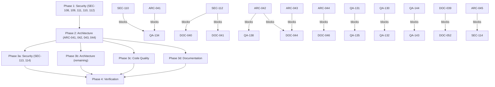

# Project Audit Report

> **Project**: par-term-emu-core-rust (v0.53.0, HEAD d53ed92)
> **Date**: 2026-09-26
> **Cycle tag**: `audit-2026-09-26-r2` (second audit run on this date; board cards carry both `audit-2026-09-26` and `audit-2026-09-26-r2` — select by `audit-2026-09-26-r2` to exclude the earlier run's cards)
> **Stack**: Rust (PyO3 0.29 bindings), Python 3.12+, TypeScript/Next.js web frontend, WebSocket streaming server, par-mux daemon
> **Audited by**: Claude Code Audit System — /opus-audit run (Opus 5 subagents, parsight graph at repo-db09184b0394f6287256c56299eaeb0f, index current at d53ed92)
> **Previous run**: an earlier /opus-audit on 2026-09-26 at HEAD 17060c6 (v0.52.0). Most of its findings were fixed in the 44 commits since; items still present are marked **recurring: prior <ID>**.

---

## Executive Summary

The codebase is in good health. There are no Critical findings, and the previous run's security fixes (kitty file-media gate, mux line and hook caps, per-UID sockets) hold up under review. The most important new finding is **SEC-108**: the pre-0.52 socket probe added for upgrades lets `connect_or_spawn` attach to whatever listens at `/tmp/par-mux-<name>.sock`, and the client never checks the server's identity. That reopens the socket-squatting hole the per-UID move closed. It is a small fix (a client-side peer-UID check). Several findings are regressions or half-finished work from the remediation itself:
- The two-phase spawn can drop a new pane's first output (ARC-041).
- The streaming input queue is unbounded (QA-131).
- The `screenshot` feature gate leaves `swash` unconditional (ARC-043).
- Wheel feature sets diverge across build paths (ARC-042).

The top issues take roughly 3–5 focused days. The biggest documentation gap is `docs/API_REFERENCE.md`: about 50 Python methods are listed with the wrong parameters (DOC-039). Strength: every production `expect` states its invariant, there are zero TODO/FIXME markers, and SECURITY.md/MUX.md track the recent security releases accurately.

### Issue Count by Severity

| Severity | Architecture | Security | Code Quality | Documentation | Total |
|----------|:-----------:|:--------:|:------------:|:-------------:|:-----:|
| 🔴 Critical | 0 | 0 | 0 | 0 | **0** |
| 🟠 High     | 1 | 1 | 2 | 2 | **6** |
| 🟡 Medium   | 11 | 2 | 9 | 15 | **37** |
| 🔵 Low      | 7 | 4 | 9 | 8 | **28** |
| **Total**   | **19** | **7** | **20** | **25** | **71** |

Merged during dedup:
- ARC-C and QA-F became ARC-041.
- QA-B and SEC-D became QA-131.
- ARC-P and QA-G became QA-133.
- ARC-Q and DOC-Z became ARC-054.
- SEC-G and the PtyTerminal half of DOC-B became SEC-112.
- DOC-H's CI half became ARC-057.

---

## 🔴 Critical Issues (Resolve Immediately)

None.

---

## 🟠 High Priority Issues

### [SEC-108] Legacy `/tmp` socket probe lets another local user impersonate the par-mux daemon; client never verifies server identity
- **Area**: Security (CWE-287 / CWE-668)
- **Location**:
  - `src/mux/client.rs:49-58` (`connect_or_spawn`)
  - `src/mux/ipc.rs:419-421` (`legacy_socket_path` = `temp_dir()/par-mux-<name>.sock`)
  - `src/mux/ipc.rs:293-303` (`connect_local_stream`, no peer check)
  - The peer check exists only on the accept side (`src/mux/ipc.rs:93-125`)
- **Description**: Commit 490da28 added a probe. When the per-UID default socket is not answering, `connect_or_spawn` attaches to whatever answers at the shared-temp legacy path.
  - `guard_fallback_socket_dir` only protects the per-UID directory, so that path gets no owner or mode check.
  - The client never checks the server's euid.
  - Pre-0.52 builds defaulted to `$XDG_RUNTIME_DIR` when set (verified: `git show 17060c6~30:src/mux/ipc.rs:335-345`). On XDG systems the probe therefore reaches a path no legitimate old daemon ever served.
- **Impact**: On multi-user Linux, another user binds `/tmp/par-mux-default.sock`. When the victim's daemon is down, par-term (`MuxClient::connect_or_spawn`) attaches to the attacker's server. Every `send-keys` goes to the attacker (keystrokes, pasted secrets), and the attacker can return forged `%output`. macOS is not affected (per-user `$TMPDIR`). The Windows global pipe namespace has the same shape (Low, unreproduced).
- **Remedy**:
  - Add a client-side `peer_creds().euid() == current_uid()` check in `connect_local_stream`. It fails closed with `PermissionDenied` and covers every path, including explicit `--socket`.
  - Skip the legacy probe when `XDG_RUNTIME_DIR` is set.
  - `lstat` the legacy path and require `is_socket() && uid == current_uid()`.
  - Windows: compare the server PID's token SID via `GetNamedPipeServerProcessId`.
  - Add a regression test.

### [ARC-039] `Terminal` is still a god object — phase 1 moved only screenshot and benchmarks (recurring: prior ARC-021)
- **Area**: Architecture
- **Location**:
  - `src/terminal/mod.rs`: 3,642 lines, 172 `pub fn`, 204 of the 400 `Terminal::` methods; struct at `:1088`.
  - 43 `impl Terminal` blocks across `src/terminal/**` (`colors.rs` 46, `clipboard.rs` 21, `metrics.rs` 21, `macros.rs` 16, `trigger.rs`, `recording.rs`, `notification.rs`, …).
  - Deprecated forwarders at `mod.rs:2698,2713` and `metrics.rs:290-320` with no removal version.
- **Description**: `TerminalBenchmarks` and `screenshot::render_terminal`/`save_terminal` were extracted in 0.53.0. Macros, triggers, recording, search, compliance, clipboard history and HTML export are still inherent methods. `Terminal` is the #3 bridge symbol (in-degree 98) and has the highest file fan-in (113).
- **Impact**: Every feature change still touches the core type and the four-way sync surface (Rust impl, binding macros, `.pyi`, API_REFERENCE).
- **Remedy**: Continue one service per PR. This cycle's bounded slice: extract `MacroEngine` (the 16 methods in `src/terminal/macros.rs`) and `TriggerEngine` (the `Terminal` methods in `src/terminal/trigger.rs:137-402`) over `&mut Terminal`, with `#[doc(hidden)] #[deprecated]` forwarders and the Python API unchanged. Pin the removal version of the 0.53.0 forwarders (`since = "0.53.0"`, removal at 0.55.0) in code and CHANGELOG.

### [QA-131] Streaming PTY input queue is unbounded; failed sends are silently dropped (merges SEC-D)
- **Area**: Code Quality + Security (CWE-770)
- **Location**:
  - `src/streaming/session.rs:89` (`UnboundedSender<Vec<u8>>`), `:342` (`mpsc::unbounded_channel`), `:332` and `:365` (`let _ = tx.send(bytes)`).
  - The drain loop silently skips when `pty_writer` is `None` (`:350-351`).
  - The rate limit defaults to 0 (`src/streaming/config.rs:422`, `src/bin/streaming_server/cli.rs:281-282`).
- **Description**: This regression came with the QA-110 fix. When the child stops reading stdin, the single drain task blocks in `write_all` and every later Input/Paste message is queued in memory without limit. A send that fails because the drain task exited drops keystrokes with no metric or log.
- **Impact**: Any authenticated, non-read-only client can grow streamer memory without limit, affecting every session in the process. Dropped input is invisible to operators.
- **Remedy**: Use a bounded channel with a byte budget (~4 MiB). On overflow, `try_send`, drop, count in `metrics.dropped_messages`/`errors`, and log (or disconnect the client). Count send failures, and log the `pty_writer == None` drop. Test with a writer that never drains.

### [QA-132] Python screenshot/emoji tests unconditionally skipped since 2025-11; a streaming test turns failure into skip
- **Area**: Code Quality (test coverage)
- **Location**:
  - `tests/test_screenshot.py:258`, `:275`: `@pytest.mark.skip(reason="PTY screenshot tests hang in CI")`
  - `tests/test_screenshot.py:340`: emoji color rendering
  - `tests/test_streaming.py:356`: `pytest.skip` on a 2 s timeout
- **Description**: QA-111 re-enabled the `test_pty*` family locally but missed these. They are skipped everywhere, including in `make test-pty`.
- **Impact**: `PtySession::screenshot` (the path QA-130 changes) and color-emoji rendering have no Python coverage. A streaming regression reports as "skipped".
- **Remedy**: Replace the skips with `skipif(os.environ.get("CI"))` or move the tests into the `make test-pty` family. Make the streaming timeout fail (or `xfail(strict=False)` with a reason).

### [DOC-039] `docs/API_REFERENCE.md` gives wrong parameter lists for ~50 Python methods
- **Area**: Documentation
- **Location**: `docs/API_REFERENCE.md`, among others lines 258, 375, 471, 482-483, 490-491, 501, 560, 679-680, 688, 696, 698, 803, 811, 819-822, 833, 855, 864, 874, 939-944, 975, 1137, 1141, 1172, 1203, 1214, 1220, 1442
- **Description**: Checked against `_native.pyi` and the `#[pyo3(signature=...)]` definitions:
  - **Arguments documented that the methods don't take**: `detect_urls(text)`, `detect_file_paths(text)` and `detect_semantic_items(text)` take no arguments.
  - **Required arguments omitted**: `run_benchmark_suite(suite_name)`, `test_compliance(level)`, `generate_color_palette(r,g,b,mode)`, `get_mouse_events(count)`, `get_mouse_positions(count)`, `next_regex_match(from_row, from_col)`, `prev_regex_match(from_row, from_col)`.
  - **Wrong shapes**: `color_distance` takes six ints. `get_images_at` is `(col,row)`. `get_paragraph_at` is `(row)`. `add_damage_region` is `(left,top,right,bottom)`. `add_rendering_hint` takes 7 arguments. `record_frame_timing` is `(processing_us, cells_updated, bytes_processed)`. `record_clipboard_sync` takes 4. `benchmark_*` take `iterations`. `remove_bookmark` takes an `id`.
  - **Wrong keyword names**: `paste(content)`, `record_marker(label)`, `write_str(s)`, `has_updates_since(last_generation)`, `fill_rectangle(..., ch)`, `set_remote_session_id(session_id)`, `record_cwd_change(new_cwd, …)`, `set_max_clipboard_event_bytes(max_bytes)`, `Macro.from_yaml(yaml)`, `load_macro(name, macro_obj)`, `adjust_contrast_rgb(..., minimum_contrast)`, and `contrast_ratio`/`mix_colors(rgb1, rgb2)`.
  - **Missing argument**: `set_sixel_limits` lacks `max_repeat`.

  The prior "clean both directions" check compared names only.
- **Impact**: Copying any of these signatures raises `TypeError`. With no stub docstrings (DOC-052), this is the only reference users have.
- **Remedy**: Correct every line from the pyo3 signatures. Add a checker to `make stub-check` that compares the parameter names in each `- `name(args)`` line against `_native.pyi`.

### [DOC-040] "PtyTerminal inherits all Terminal methods" is false
- **Area**: Documentation
- **Location**: `docs/API_REFERENCE.md:1152`, `docs/SECURITY.md:572`, `README.md:22,120`
- **Description**: At runtime, `PtyTerminal.__mro__ == (PtyTerminal, object)`: 206 methods against Terminal's 388, with 224 missing (observers, `detect_urls`, bookmarks, benchmarks, `set_allow_file_media`/`get_allow_file_media`, …). SECURITY.md tells PTY users to call `Terminal.set_allow_file_media`, which a `PtyTerminal` does not have (see SEC-112).
- **Impact**: Users code against a surface that does not exist. Security-conscious PTY users cannot disable file media.
- **Remedy**: Replace the sentence with an accurate statement (ideally a generated availability table). After SEC-112 lands, document the new `PtyTerminal.set_allow_file_media`.

---

## 🟡 Medium Priority Issues

### Architecture

#### [ARC-040] CI never runs automatically, while the bench gate rotates its baseline tag on unchecked main (recurring: prior ARC-023)
- **Location**: `.github/workflows/ci.yml:3-4` (`workflow_dispatch` only); `.github/workflows/bench.yml:3-7` (weekly `schedule`), `:31` (`BENCH_ROTATE_TAG` = 1 on main); `fuzz.yml` (nightly).
- **Description**: The performance and fuzz gates now run on a schedule, but fmt, clippy, tests, the `sim` tree guard and the Windows mux suite still never run on push or PR. The scheduled bench can move `bench-baseline` onto a HEAD that no correctness gate has checked. No recorded decision makes dispatch-only intentional (project memory records it only as a fact).
- **Remedy**: Add a cheap Linux job on `push: [main]` + `pull_request` (fmt `--check`, clippy `-D warnings`, `cargo test --lib`, the `sim` guard). Keep the full matrix dispatch-only. Rotate the bench tag only when that SHA's CI run is green.

#### [ARC-041] Two-phase spawn loses a new pane's early output; the spawn/wire block is copied three times (merges QA-F)
- **Location**:
  - `src/mux/dispatch.rs:229-273` (`cmd_new_session`), `:515-555` (`cmd_split_window`), `:694-735` (`cmd_new_window`)
  - `src/pty_session.rs:190` (`output_callback` starts `None`), `:707` (`spawn_internal` starts the reader thread)
  - `src/mux/pane.rs:335-342` (`on_output`)
  - `src/mux/server.rs:968-985` (`wire_all_pane_outputs`)
  - `src/mux/tree.rs:300-432` (test-only one-shot wrappers)
- **Description**: `create_pane` → `spawn*` → `start_reader_thread` runs before `complete_*` re-acquires the (contended) tree lock and installs `pane_output_sink`. Bytes read in that gap, usually the first prompt, are processed into the daemon grid but never emitted as `%output`. The gap is now bounded by lock contention (other clients, the reaper, the persist capture), not microseconds. The three handlers repeat reserve → drop → spawn → relock → complete → wire → cwd-note with 4-5 levels of nested `match`. `dispatch_command` is the #2 churn×complexity hotspot.
- **Remedy**: Carry the output sink in the spawn context so `create_pane` installs it before the reader starts (the pane id is already reserved in the plan). Extract one `spawn_two_phase` helper. Add a test with a factory that emits output immediately and a delayed `complete_*`. Run the Windows mux suite.

#### [ARC-042] Wheel feature set diverges across build paths after ENH-017
- **Location**: `.github/workflows/deployment.yml:238,293,299,344` (`--features streaming`); `publish-testpypi.yml:61` (none); the sdist job (`deployment.yml:382`) and `pyproject.toml:74-77` (`[tool.maturin] features = ["pyo3/extension-module"]`); `Makefile:125,139,163` (`make dev` without streaming).
- **Description**: PyPI wheels include streaming. TestPyPI wheels, sdist installs and `make dev` do not, and `HAS_STREAMING` now reports each case truthfully.
- **Impact**: The TestPyPI rehearsal doesn't test what ships. Source installs lose a documented feature. `make stubs` after `make dev` drops the streaming classes.
- **Remedy**: Make `pyproject.toml [tool.maturin] features = ["pyo3/extension-module", "streaming"]` the single source of truth. Remove `--features` from workflow args. Point `make dev` at the pyproject setting and add a `make dev-fast` for quick builds without streaming.

#### [ARC-043] `screenshot` feature gate is empty; `swash` stays unconditional
- **Location**: `Cargo.toml:215` (`screenshot = []`), `:148` (`swash = "0.2.7"`, not optional). The only users are `src/screenshot/shaper.rs` and `font_cache.rs`.
- **Remedy**: `screenshot = ["dep:swash"]` and `swash = { version = "0.2.7", optional = true }`. Verify that `cargo tree -e features -i swash --no-default-features --features rust-only` is empty.

#### [ARC-044] `mux` library feature pulls `clap`, which only the binaries use
- **Location**: `Cargo.toml:237` (`mux = [..., "clap"]`), `:63` (`par-mux` `required-features = ["mux"]`). Only `src/bin/par_mux/main.rs` and `src/bin/streaming_server/*` use clap.
- **Remedy**: Add `mux-bin = ["mux", "clap"]`, point `[[bin]] par-mux` at it, and update the Makefile, CI and deployment invocations and the docs.

#### [ARC-045] `Cargo.lock` gitignored while two binaries and wheels ship from CI (recurring: prior ARC-024)
- **Location**: `.gitignore:4`. `--locked` is used only by `fuzz.yml:25`. CLAUDE.md:74 records "Cargo.lock is not tracked" as a fact (no recorded decision).
- **Remedy**: Commit `Cargo.lock`, add `--locked` to CI, release and bench builds, and update the CLAUDE.md Windows playbook note.

#### [ARC-046] Layering inversions: lower layers import `terminal`; Python concerns in `streaming` (recurring: prior ARC-026)
- **Location**: `src/grid/mod.rs:207-208,224`; `src/graphics/mod.rs:399,433`; `src/streaming/protocol.rs:242-268`; `src/streaming/py_convert.rs`; `src/streaming/mux_factory.rs:22`; `src/lib.rs:83`.
- **Remedy**: Move `GridSnapshot` to `grid/snapshot.rs` and `unix_millis` to `src/time.rs` (with re-exports). Move `py_convert` into `python_bindings`.

#### [ARC-047] Streaming binary delivers events by 20 Hz polling through a double lock, in two copies (recurring: prior ARC-027)
- **Location**: `src/bin/streaming_server/bootstrap.rs:218-226`, `:557-565`; `Arc<Mutex<PtySession>>` at `:38,69,86,96,315`.
- **Remedy**: Register a `TerminalObserver` per session that feeds an mpsc channel, delete both loops, and use `Arc<PtySession>`.

#### [ARC-048] WS session prelude and loop written twice; accept loops duplicated (recurring: prior ARC-028)
- **Location**: `src/streaming/server.rs:1784-1900` (`run_ws_session`) vs `:2078-2240` (`handle_axum_websocket`); accept loops at `:852` vs `:971`. The file is 3,383 lines.
- **Remedy**: A `WsTransport` trait with one `run_session<T>`, then split `server.rs`.

#### [ARC-049] Core library logs through a private file logger (recurring: prior ARC-029)
- **Location**: `src/debug.rs:11,67,193-210`; `src/grid/scroll.rs:152,198` (`eprintln!`).
- **Remedy**: Re-implement the `debug_*!` macros on the `log` facade.

#### [ARC-050] Unfinished public surfaces still exported (recurring: prior ARC-030/031)
- **Location**: `src/lib.rs:59` (`pub mod ffi;` unconditional); `src/streaming/mod.rs:82` (`pub use broadcaster::Broadcaster`, not deprecated).
- **Remedy**: Put `ffi` behind an opt-in feature. Mark `Broadcaster` `#[deprecated(since = "0.54.0")]`.

### Security

#### [SEC-109] Kitty zlib (`o=z`) decompression bomb; APC and chunk buffers unbounded
- **Location**:
  - `src/graphics/kitty.rs:548-560` (`decompress_zlib`: `read_to_end`, no limit), `:536-541`, `:505` (`data_chunks.push`, no cap)
  - `src/terminal/apc_filter.rs:123-146` (`apc_buffer.push`, no cap)
  - Reached from `src/terminal/mod.rs:2811-2839`
  - `docs/SECURITY.md:895` wrongly claims zlib decompression is capped at 1 MiB; that cap is the streaming wire's `proto.rs:118-140` only
- **Evidence**: A 695,776-byte APC carrying 512 MiB of zlib zeros raised peak RSS by 581 MB in 0.08 s before `decode_pixels` rejected it (throwaway in-memory `Terminal`).
- **Impact**: Any program output (`cat`, SSH to a hostile host, a tailed log) can OOM the embedding process. In par-mux and the streamer, one pane takes down every session.
- **Remedy**: Stream-decompress through `take(limit + 1)`, with `limit` set to the exact `s*v*{3,4}` when known, else `MAX_IMAGE_PIXELS * 4`. Cap total `data_chunks` bytes and `apc_buffer` length (64 MiB), aborting and resetting the parser on overflow. Correct SECURITY.md. Add a bomb regression test.

#### [SEC-112] Kitty file-media gate is unreachable in two paths: single-session `StreamingServer` ignores `kitty_file_media`, and `PtyTerminal` has no setter (merges SEC-G + DOC-B gap)
- **Location**: `src/streaming/server.rs:355-371` (`with_config` never calls `set_allow_file_media`, whereas the factory path does at `:590-594`); `src/python_bindings/streaming.rs:543-547`; `src/python_bindings/pty.rs` (no `set_allow_file_media`/`get_allow_file_media`).
- **Impact**: An embedder that sets `kitty_file_media="off"` to harden a server keeps `temp_only`, silently. `PtyTerminal`, the class that runs untrusted programs, cannot change the mode.
- **Remedy**: In `with_config`, apply `config.kitty_file_media` to the default terminal. Add `PtyTerminal.set_allow_file_media(mode)` / `get_allow_file_media()` (binding sync: `pty.rs`, `.pyi`, API_REFERENCE, Python test).

### Code Quality

#### [QA-130] Read-only `PtySession` getters take the terminal *write* lock
- **Area**: Code Quality (performance / contention) — downgraded from High by orchestrator verification: the Python surface mostly uses read locks already
- **Location**: `src/pty_session.rs`:
  - `content` 1369, `export_text` 1381, `export_styled` 1393, `screenshot` 1414, `screenshot_to_file` 1437, `cursor_position` 1443, `size` 1450, `get_line` 1459, `scrollback` 1467, `scrollback_len` 1473, `bell_count` 1550.
  - The file has 15 `self.terminal.write()` sites and 3 `read()` sites.
- **Description**: Each getter calls a `&self` Terminal method under `parking_lot::RwLock::write()`. That defeats ARC-009's read concurrency (45af083). The Python `PtyTerminal` binding mostly bypasses them via `term_ref()` (a read lock, `src/python_bindings/pty.rs:33-39`), but it calls `self.inner.size()` at `:211,722`, and Rust embedders (par-term, mux capture paths) call these getters directly. A screenshot holds the write lock for the whole render and stalls the reader thread's `process()`.
- **Impact**: Rust-side readers serialize against each other and against PTY output. Output latency spikes during screenshots and exports. The module doc (line 5) claims the opposite.
- **Remedy**: Change every getter that calls only `&self` methods to `.read()`. Add a concurrency test.

#### [QA-133] Streamer `main` (CC 37, 305 lines) and `handle_csi_report` (CC 54, 240 lines) still oversized; `run_mux_mode` re-implements `serve_until_ctrl_c` (recurring: prior QA-114/ARC-038; merges ARC-P)
- **Location**: `src/bin/streaming_server/main.rs:168-473`, `:97-143` vs `:588`; `src/terminal/sequences/csi/report.rs:7-247`.
- **Remedy**: Route `run_mux_mode` through `serve_until_ctrl_c`. Extract `bootstrap::build_config(&args)`. Split `handle_csi_report` by final byte.

#### [QA-134] Client-registration block copied four times in mux `handle_client`
- **Location**: `src/mux/server.rs:507-515`, `:544-552`, `:582-590`, `:604-612`. `handle_client` is 193 lines, CC 37, and the #1 hotspot (score 851).
- **Remedy**: An `ensure_registered` helper, plus extract `read_control_line(...) -> LineRead`.

#### [QA-135] Blocking lock + write inside tokio tasks (recurring: prior QA-119, extended)
- **Location**: `src/streaming/mux_factory.rs:326-335` (resize task: sync `writer.lock()` + `writeln!`/`flush`); `src/bin/streaming_server/main.rs:618-636` (the `--command` initial-command task: map read lock → session mutex → writer mutex → blocking `write_all`, after a 1 s sleep, bypassing the serialized input path).
- **Remedy**: Resize writes via `spawn_blocking` or a per-link writer thread. Route the initial command through `StreamSessionState::enqueue_pty_input`.

#### [QA-136] `unsafe` blocks without SAFETY comments (recurring: prior QA-116)
- **Location**: `src/mux/foreground.rs:245,285,346,360`; `src/mux/client.rs:404`; `src/mux/pane.rs:666`; `src/mux/tree.rs:1456`; `src/bin/par_mux/main.rs:293,308,349,362`; `src/bin/streaming_server/cli.rs:22`; `src/ffi.rs` (20 sites, 1 comment).
- **Remedy**: Add SAFETY comments and enable `clippy::undocumented_unsafe_blocks`.

#### [QA-137] Unneeded `unsafe impl Send/Sync` on Python observers (recurring: prior QA-117)
- **Location**: `src/python_bindings/observer.rs:447-448`, `:487-488`.
- **Remedy**: Delete them. `Py<PyAny>` is already `Send + Sync`.

#### [QA-138] No stub drift check (recurring: prior QA-120)
- **Location**: `Makefile:303-310`; `python/par_term_emu_core_rust/_native.pyi`.
- **Remedy**: After a streaming-enabled build, `make stubs && git diff --exit-code python/par_term_emu_core_rust/_native.pyi`.

#### [QA-139] Large files keep growing (recurring: prior QA-121)
- **Location**: `src/streaming/server.rs` (3,383), `src/graphics/kitty.rs` (3,538), `src/mux/server.rs` (2,887), `src/terminal/mod.rs` (3,642), `src/pty_session.rs` (3,307; `start_reader_thread` 763-1006, `spawn_internal` 479-710).
- **Remedy**: Move the reader thread into `pty_session/reader.rs`. Run `propose_decomposition` on `kitty.rs`.

#### [QA-140] Fixed-sleep synchronization in Rust PTY tests
- **Location**: The `src/pty_session.rs` test module: lines 1805, 1845, 2174, 2227, 2274, 2303, 2602, 2610, 2626, 2702 (≈101 sleep sites across tests).
- **Remedy**: Deadline-bounded polling helpers.

### Documentation

#### [DOC-041] `kitty_file_media` missing from the StreamingConfig reference; the streamer binary hardcodes it
- **Location**: `docs/API_REFERENCE.md:2117-2153`; `docs/STREAMING.md:480-500`; `src/bin/streaming_server/main.rs:283`.
- **Remedy**: Document the parameter and property (`off`/`temp_only`/`all`, default `temp_only`). Note that the binary always runs `temp_only` (or document the flag if ENH-021 lands).

#### [DOC-042] Kitty `t=f` example and protocol tables ignore the 0.53.0 default gate
- **Location**: `docs/ADVANCED_FEATURES.md:1241-1255,1278`; `docs/VT_SEQUENCES.md:511-512`; `docs/VT_TECHNICAL_REFERENCE.md:1137-1138`.
- **Remedy**: Add `set_allow_file_media("all")` plus a security callout. Annotate both tables.

#### [DOC-043] 0.53.0 CHANGELOG entry does not flag a Rust-embedder break and has no Deprecated section
- **Location**: `CHANGELOG.md:8-48`; `README.md:22`.
- **Description**: The screenshot gate removes `screenshot::*` from `default-features = false` builds that don't name `screenshot`/`sim`. The deprecated forwarders are not listed. `TerminalBenchmarks`, `make test-pty` and the ENH-016 bench gate are not mentioned.
- **Remedy**: Add a Breaking (Rust embedders) bullet, a `### Deprecated` section with a removal target, and a mirror note in README What's New.

#### [DOC-044] Feature tables omit `screenshot` and misdescribe `sim`/`full` (recurring: prior DOC-026, worse)
- **Location**: `docs/RUST_USAGE.md:462-476`; `docs/ARCHITECTURE.md:964-1020`; `README.md:246-251`.
- **Remedy**: Add the `screenshot` row. Fix the `python`/`python-test`/`sim`/`full` rows (and the `mux-bin` row after ARC-044). Replace ARCHITECTURE's verbatim `[features]` block with a link.

#### [DOC-045] MATURIN_BEST_PRACTICES.md describes a two-generations-old configuration
- **Location**: `docs/MATURIN_BEST_PRACTICES.md:110-125,128,136-140,238-243` (0.45.0 versions, `maturin>=1.13.3`, no streaming feature).
- **Remedy**: Point at the real files and describe the ARC-042 single-source feature config.

#### [DOC-046] `cargo install par-term-emu-core-rust --features streaming-bin` likely fails (UNVERIFIED)
- **Location**: `README.md:277`; `QUICKSTART.md:160`.
- **Description**: Without `--no-default-features`, this enables `python` (`pyo3/extension-module`), which BUILDING.md:5 says fails at link. Every other doc and CI (`deployment.yml:181`) use `--no-default-features`. **Not run** (multi-minute install); verify before editing.
- **Remedy**: `cargo install par-term-emu-core-rust --no-default-features --features streaming-bin --bin par-term-streamer`, plus the `par-mux` equivalent (`mux-bin` after ARC-044).

#### [DOC-047] README "Running Tests" commands fail (recurring: prior DOC-023)
- **Location**: `README.md:641-649`. **Remedy**: `make test`/`test-rust`/`test-python`/`test-pty`, and link BUILDING.md.

#### [DOC-048] README web-frontend build uses npm and port 8030 (recurring: prior DOC-024)
- **Location**: `README.md:596-607`. **Remedy**: `make web-install`/`web-dev`/`web-build-static` (bun, port 3000).

#### [DOC-049] Dependency snippets pinned to `0.50` (recurring: prior DOC-025)
- **Location**: `README.md:248-251`; `docs/RUST_USAGE.md:82,92,100,102,111,114,313`. **Remedy**: `0.53`, or `cargo add` forms.

#### [DOC-050] Inherited-env drop list shows 6 of 12 (recurring: prior DOC-027)
- **Location**: `docs/SECURITY.md:261-262,320`; `docs/CROSS_PLATFORM.md:82-83`; source of truth `src/pty_session.rs:575-590`.
- **Remedy**: List all 12 plus the `PAR_MUX_*` prefix rule.

#### [DOC-051] CONFIG_REFERENCE says no environment variables are read (recurring: prior DOC-028)
- **Location**: `docs/CONFIG_REFERENCE.md:825-833`; `--force-web-download`/`PAR_TERM_FORCE_WEB_DOWNLOAD` (`cli.rs:212`) absent from STREAMING.md.
- **Remedy**: An env-var table, and document the flag.

#### [DOC-052] Stub has no docstrings and mostly `Any` (recurring: prior DOC-029)
- **Location**: `python/par_term_emu_core_rust/_native.pyi` (1,335 defs, 1,002 `-> Any`, 0 docstrings); `scripts/generate_stubs.py`.
- **Remedy**: Emit `__doc__` and parameter annotations from `text_signature`.

#### [DOC-053] Binding docstrings lack Example sections (recurring: prior DOC-030)
- **Location**: `src/python_bindings/terminal/{bookmark,metrics,notification,scrollback,search,selection,text}_api.rs`; `pty.rs` (7/102); `streaming.rs` (4/77).
- **Remedy**: Add Example sections per CLAUDE.md.

#### [DOC-054] Mux design decisions cited to an out-of-repo document (recurring: prior DOC-031)
- **Location**: `docs/par-mux.md:11`; 29 `par-mux.md` citations in `src/` and `Cargo.toml`.
- **Remedy**: Vendor a one-line-per-D-number decision record into `docs/`.

#### [DOC-055] The "kept for one release" legacy-event promise has lapsed (recurring: prior DOC-032)
- **Location**: `docs/API_REFERENCE.md:922,927`; `src/python_bindings/terminal/mod.rs:1057,1224-1225`; `python/par_term_emu_core_rust/observers.py:14,39,56`.
- **Description**: `poll_events_legacy()` shipped in 0.50.0 "for one release" and is still present with no `DeprecationWarning`. The docs say "pre-0.51". Observer types are still `dict[str, str]`.
- **Remedy**: Emit a `DeprecationWarning` now with a removal version. Fix the docs and type hints.

---

## 🔵 Low Priority / Improvements

### Architecture
- **[ARC-051]** `checkall` runs the mutating `lint` target (`Makefile:266-275,312`: `clippy --fix`, `cargo fmt`, `ruff --fix`). Add `lint-check` and chain it instead. *(recurring: prior ARC-033)*
- **[ARC-052]** `tokio` `test-util` is in `[dependencies]` (`Cargo.toml:88`). `serde_yaml_ng` is unconditional (`:82`, used only by `src/macros.rs`). *(recurring: prior ARC-034/035)*
- **[ARC-053]** 16 `#[macro_export]` binding macros in `src/python_bindings/common.rs` leak into the rlib root. *(recurring: prior ARC-036)*
- **[ARC-054]** Root clutter (merges DOC-Z): `debug/` ad-hoc scripts and `theme.css`. The root `AUDIT*.md` files are tracked and produce 13 of parsight's 30 broken-link rows. Move them to `docs/audits/` and `scripts/debug/`. Run last. *(recurring: prior ARC-037/DOC-038)*
- **[ARC-055]** The shutdown save still captures under the tree lock: `src/mux/server.rs:202` → `persist.rs:711-724`. Use `collect_persist_capture()` under the lock and capture after it drops.
- **[ARC-056]** Build stamp: `build.rs:51-75,125-148` never checks that the git toplevel equals `CARGO_MANIFEST_DIR`, so a vendored copy inside another repo gets the host repo's SHA. The `-dirty` suffix goes stale on source edits until HEAD moves.
- **[ARC-057]** The mux fuzz targets never run in CI: `.github/workflows/fuzz.yml:18` and `make fuzz-all` (`Makefile:865`) list only the original four targets, while `fuzz/fuzz_targets/` has six (`mux_parse_command`, `mux_hook_report`). ENH-018 is incomplete.

### Security
- **[SEC-110]** The SEC-104 line cap doesn't trigger on a continuous unterminated stream. `BufRead::read_line` (`src/mux/server.rs:494-523`) only returns at a newline, EOF, or a 200 ms recv-timeout wake. The test (`tests/mux_daemon.rs:862-883`) sends a terminated line. The same loop drops a whole read when a timeout wake splits a multibyte UTF-8 character (lost `send-keys -l` data). Fix: a bounded `take()` read or a `fill_buf` loop. *(recurring: prior SEC-104; promoted to Phase 1, conflict file)*
- **[SEC-111]** The `t=t` validate→open→delete sequence can be raced through a parent-directory swap. `src/graphics/kitty.rs:1063-1098` opens the uncanonicalized `path`, and `:1128-1134`/`:1011` delete through it. Open the canonical path, and check dev/inode before `remove_file`. *(promoted to Phase 1 with SEC-109, same file)*
- **[SEC-113]** The Python debug log sits at a fixed temp path with no `O_NOFOLLOW`/`0600`: `python/par_term_emu_core_rust/debug.py:25,60`. Mirror `src/debug.rs:66-80`.
- **[SEC-114]** `paste` 1.0.15 is unmaintained (RUSTSEC-2024-0436), transitive. Track it (and see ARC-045 for lock reproducibility). *(recurring: prior SEC-106)*

### Code Quality
- **[QA-141]** The `pty_writer`/`pty_input_tx` `std::sync::RwLock` wrappers swallow poisoning via `.ok()` (`src/streaming/session.rs:84,89`). Switch to `parking_lot`. *(recurring: prior QA-118; batch with QA-131)*
- **[QA-142]** Dead frontend component `web-terminal-frontend/components/TerminalDebug.tsx` (286 lines, zero importers) with an ungated `console.log` at `:87`.
- **[QA-143]** `too_many_arguments` suppressions went from 18 to 21. QA-114 added three in `src/streaming/server.rs` (`:1251`, `:1471`, `:1617`). Introduce a `ClientCtx`. *(recurring: prior QA-125)*
- **[QA-144]** Mouse `event_type: String` (`src/streaming/protocol.rs:541,812,1393,1609`) is compared as `!= "release"`, so a typo silently reads as a press. Use an enum. *(recurring: prior QA-124)*
- **[QA-145]** Near-duplicates: `sample_half_block` (`graphics/mod.rs:519` vs `python_bindings/types/graphics.rs:167`), `resize_pixels` (`python_bindings/terminal/mod.rs:142` vs `pty.rs:187`), the `create_argv_pane` pair plus `create_pane` (`mux/pane.rs:426,613,634`), the underline renderers (`screenshot/renderer.rs:831-910`), and the `enums.rs` From pairs. *(recurring: prior QA-126)*
- **[QA-146]** `src/ffi.rs:142,207-208`: a separate `cell_count` and `as_mut_ptr` + `mem::forget`. Use `Box::into_raw` with the length from `len()`. *(recurring: prior QA-123)*
- **[QA-147]** Production unwraps: `src/streaming/server.rs:2408` (`value.parse().unwrap()`) and `src/terminal/file_transfer.rs:165`. *(recurring: prior QA-128)*
- **[QA-148]** Weak standalone `is not None` asserts: 19 in `tests/test_terminal.py`, 9 in `tests/test_terminal_bindings.py`. *(recurring: prior QA-127)*
- **[QA-149]** Inconsistent deprecation: `Terminal::screenshot*` are deprecated forwarders, but `PtySession::screenshot`/`screenshot_to_file` (`src/pty_session.rs:1409,1431`) are not.

### Documentation
- **[DOC-056]** `CONTRIBUTING.md:75` says "Four targets" (there are six). The command at `docs/MUX.md:379-381` lacks `+nightly` and `--`.
- **[DOC-057]** The `Terminal` struct listing in `docs/ARCHITECTURE.md:344-410` is stale ("~30" sub-structs, actually 34). There is no "Extracted services" paragraph, and the Mermaid diagram at `:813` still starts at `Terminal.screenshot`.
- **[DOC-058]** The replay pseudo-code at `docs/ADVANCED_FEATURES.md:2436-2440` uses nonexistent `begin_replay_session()`/`current_state()`. The real API is `ReplaySession::new(&manager)`/`current_frame()` (`src/terminal/replay.rs:94`).
- **[DOC-059]** Broken intra-doc links: `docs/API_REFERENCE.md:858` (needs `../CHANGELOG.md#...` and the right date); the anchors at `docs/SECURITY.md:40-41`. *(recurring: prior DOC-033)*
- **[DOC-060]** Code fences without language tags (VT_TECHNICAL_REFERENCE 15, ADVANCED_FEATURES 6, MACROS 5, STREAMING 3, TESTING_KITTY_ANIMATIONS 3, and one each in CONFIG_REFERENCE, GRAPHICS_TESTING and MATURIN_BEST_PRACTICES). *(recurring: prior DOC-034)*
- **[DOC-061]** The README What's New backlog (`README.md:16-73`) sits ahead of Features. `:67-73` cites the dead `python_bindings/types.rs`. *(recurring: prior DOC-035)*
- **[DOC-062]** CHANGELOG compare links stop at 0.37.0 (`CHANGELOG.md:1713+`). *(recurring: prior DOC-036)*
- **[DOC-063]** Missing `//!`/item docs: `src/screenshot/mod.rs:1`, `grid/scroll.rs:259`, `mux/ipc.rs:157`, `python_bindings/observer.rs:437,477`. There is no `#![warn(missing_docs)]`. *(recurring: prior DOC-037)*

---

## Detailed Findings

### Architecture & Design
Health: **Good**. 430 files, 12,768 symbols, 16.3K CALLS edges, 223 communities. Verified remediated since the previous run:
- ARC-022: the two-phase spawn, with a proof test.
- ARC-032: the persist capture runs off the lock.
- ARC-025: native `HAS_STREAMING`.
- QA-114: the `handle_client_message` split.

The remaining structural debt is concentrated in `Terminal` (ARC-039) and the streaming server (ARC-047/048). The new risks come from the remediation's own edges:
- The spawn window (ARC-041).
- The half-done feature gates (ARC-043/044).
- The wheel feature split (ARC-042).

Top god files (parsight `find_god_objects`): `terminal/mod.rs` (fan-in 113, total CC 413), `streaming/server.rs` (355), `screenshot/renderer.rs` (226), `graphics/kitty.rs` (205), `mux/command.rs` (203), `mux/dispatch.rs` (192). Top hotspots (14-day churn×CC): `mux::server::handle_client` 851, `dispatch_command` 700, `MuxServer::run_with_state_path` 399.

### Security Assessment
Posture: **Good**. The prior fixes were re-verified:
- SEC-101/102: the gate is checked before any filesystem access, and deletion happens only after decode.
- SEC-103: O_NOFOLLOW + fstat.
- SEC-105: 4 KiB field caps before the lock.

Dependency scans: `cargo audit` (448 crates) is clean except `paste` (SEC-114). `bun audit` (486 packages) and `pip-audit` are clean. There are no hardcoded secrets. The one repro (SEC-109) ran in a throwaway in-memory `Terminal`. Highest risk: SEC-108 (daemon impersonation on multi-user Linux).

### Code Quality
Health: **Good**. Debt is moderate:
- 0 TODO/FIXME.
- 29 non-test `#[allow]` (21 `too_many_arguments`).
- 7 production `unwrap`, 24 `expect`, each stating its invariant.
- 40+ files over 500 lines.

Coverage is good (above 70%) for the Rust core and mux, and moderate for Python PTY and screenshot. The QA-110 serialized writer is well designed, apart from its unbounded queue (QA-131). The biggest perf defect is QA-130 (write locks on Rust-side read paths; the Python binding mostly uses read locks already).

### Documentation Review
Health: **Good**. DOC-021/022 are verified fixed, SECURITY.md/MUX.md match 0.53.0, CLAUDE.md's layout and feature table are accurate, and versions are in sync (0.53.0 in all three files, derive 0.45.0). The gaps are parameter-level API drift (DOC-039), the false PtyTerminal inheritance claim (DOC-040), 0.53.0 release notes (DOC-043), and a long recurring tail (DOC-044…063).

---

## Remediation Roadmap

### Immediate Actions (Before Next Release)
1. SEC-108: client-side server-identity check; skip or harden the legacy probe.
2. SEC-109 + SEC-111: kitty decompression/APC caps and the `t=t` canonical-path fix.
3. QA-131 + QA-141: bounded streaming input queue.
4. ARC-041: install the output sink before the reader starts.
5. DOC-043: 0.53.0 breaking and deprecation notes (embedders are already on 0.53).

### Short-term (Next 1–2 Sprints)
1. QA-130 (read locks), QA-132 (re-enable the tests), SEC-110, SEC-112.
2. ARC-042/043/044 (the feature and packaging batch) + DOC-044/045/046.
3. DOC-039/040 (API reference correctness + checker), DOC-041/042.
4. ARC-040 (push-triggered cheap CI), ARC-045 (lockfile), ARC-057 (mux fuzz in CI).

### Long-term (Backlog)
1. ARC-039 service extraction slices, ARC-046/047/048/049/050.
2. QA-133…140, DOC-052…055, all Low items.
3. Enhancements ENH-019…ENH-024 (kanban, `enhancement` tag).

---

## Positive Highlights

1. The ARC-022 two-phase spawn and the ARC-032 capture split are careful lock-scope fixes with proof tests (`a_slow_spawn_does_not_stall_other_clients`, byte-identity capture tests).
2. The QA-110 input writer uses a `Weak` back-reference, create-once under the write lock, and one documented write site.
3. The kitty file-media gate follows kitty's own rules: it checks the mode before any filesystem access, so probes leak nothing, and it deletes only after a successful decode.
4. The par-mux server side is well defended: a `0700` per-UID dir with verified owner and mode, a `0600` socket, a fail-closed euid check on accept that doesn't kill the listener, and unlink on clean exit.
5. Streaming auth is constant-time throughout, and the dummy-bcrypt path hides whether a username exists. The query-string API key is off by default, and the server binds to `127.0.0.1` by default.
6. The feature matrix is well designed (`sim`/`python` mutually excluded at compile time, `streaming` and `streaming-bin` split), and the build-time proto checksum and source-digest stamp are content-based and CRLF-normalized.
7. The fuzz work has already caught a real panic (016b59a), and every production `expect` names its invariant.
8. SECURITY.md and MUX.md were rewritten in lockstep with the 0.52/0.53 security releases.

---

## Audit Confidence

| Area | Files Reviewed | Confidence |
|------|---------------|-----------|
| Architecture | ~60 (plus parsight graph analytics over 430) | High |
| Security | ~45 (plus cargo/bun/pip audits, 1 in-process repro) | High |
| Code Quality | ~70 (plus parsight hotspots, duplicate, dead-code and god-object analytics) | High |
| Documentation | all tracked Markdown (≈30), stub, binding docstrings, runtime introspection | High (DOC-046 unverified) |

---

## Remediation Plan

> This section is generated by the audit and consumed directly by `/fix-audit`.
> It pre-computes phase assignments and file conflicts so the fix orchestrator
> can proceed without re-analyzing the codebase. Per-issue execution detail is in
> `AUDIT-REMEDIATION-PLAN.md`, ordered to match these phases.

### Phase Assignments

#### Phase 1 — Critical Security (Sequential, Blocking)
<!-- No Critical security issues. The High SEC issue and the Security issues on conflict files are promoted here. -->
| ID | Title | File(s) | Severity |
|----|-------|---------|----------|
| SEC-108 | Client never verifies mux server identity; legacy /tmp probe | `src/mux/client.rs`, `src/mux/ipc.rs`, `docs/SECURITY.md` | High |
| SEC-109 | Kitty zlib bomb; unbounded APC/chunk buffers | `src/graphics/kitty.rs`, `src/terminal/apc_filter.rs`, `docs/SECURITY.md` | Medium (promoted: kitty.rs conflict with QA-139/QA-145) |
| SEC-111 | `t=t` parent-dir race; open canonical path | `src/graphics/kitty.rs` | Low (promoted: same batch as SEC-109) |
| SEC-110 | Mux line cap bypassed by unterminated stream; UTF-8 split drop | `src/mux/server.rs`, `tests/mux_daemon.rs` | Low (promoted: server.rs conflict with QA-134/ARC-041/ARC-055) |
| SEC-112 | Kitty file-media gate unreachable (single-session server, PtyTerminal) | `src/streaming/server.rs`, `src/python_bindings/pty.rs`, `python/par_term_emu_core_rust/_native.pyi` | Medium (promoted: streaming/server.rs conflict with QA-143/144/147) |

#### Phase 2 — Critical Architecture (Sequential, Blocking)
<!-- No Critical architecture issues; these are promoted because they block Code Quality or Documentation issues. -->
| ID | Title | File(s) | Severity | Blocks |
|----|-------|---------|----------|--------|
| ARC-041 | Early pane output lost; triplicated two-phase spawn | `src/mux/dispatch.rs`, `src/mux/pane.rs`, `src/mux/server.rs`, `src/mux/tree.rs` | Medium | QA-134 |
| ARC-042 | Wheel feature set diverges across build paths | `pyproject.toml`, `.github/workflows/deployment.yml`, `.github/workflows/publish-testpypi.yml`, `Makefile` | Medium | QA-138, DOC-044, DOC-045 |
| ARC-043 | `screenshot` gate empty; swash unconditional | `Cargo.toml` | Medium | DOC-044 |
| ARC-044 | `mux` library feature pulls clap | `Cargo.toml`, `Makefile`, `.github/workflows/*.yml` | Medium | DOC-044, DOC-046 |

#### Phase 3 — Parallel Execution

**3a — Security (remaining)**
| ID | Title | File(s) | Severity |
|----|-------|---------|----------|
| SEC-113 | Python debug log at predictable temp path | `python/par_term_emu_core_rust/debug.py` | Low |
| SEC-114 | `paste` unmaintained (RUSTSEC-2024-0436) | `Cargo.toml` / lock | Low |

**3b — Architecture (remaining)**
| ID | Title | File(s) | Severity |
|----|-------|---------|----------|
| ARC-039 | Terminal god object: MacroEngine + TriggerEngine slice | `src/terminal/macros.rs`, `src/terminal/trigger.rs`, `src/terminal/mod.rs` | High |
| ARC-040 | Push-triggered cheap CI; bench rotates only on green | `.github/workflows/ci.yml`, `.github/workflows/bench.yml` | Medium |
| ARC-045 | Commit Cargo.lock + `--locked` | `.gitignore`, `Cargo.lock`, workflows, `CLAUDE.md` | Medium |
| ARC-046 | Layering inversions | `src/grid/mod.rs`, `src/graphics/mod.rs`, `src/streaming/protocol.rs`, `src/streaming/py_convert.rs` | Medium |
| ARC-047 | Push-based events in streaming binary | `src/bin/streaming_server/bootstrap.rs`, `src/bin/streaming_server/main.rs` | Medium |
| ARC-048 | WsTransport unification | `src/streaming/server.rs` | Medium |
| ARC-049 | `debug_*!` on the log facade | `src/debug.rs`, `src/grid/scroll.rs` | Medium |
| ARC-050 | `ffi` feature; deprecate Broadcaster | `src/lib.rs`, `src/streaming/mod.rs`, `Cargo.toml` | Medium |
| ARC-051 | Non-mutating `lint-check` in checkall | `Makefile` | Low |
| ARC-052 | tokio test-util / serde_yaml_ng gating | `Cargo.toml` | Low |
| ARC-053 | `#[macro_export]` binding macros leak | `src/python_bindings/common.rs` | Low |
| ARC-055 | Shutdown save captures under tree lock | `src/mux/server.rs`, `src/mux/persist.rs` | Low |
| ARC-056 | Build stamp toplevel check | `build.rs` | Low |
| ARC-057 | Mux fuzz targets missing from CI/fuzz-all | `.github/workflows/fuzz.yml`, `Makefile` | Low |
| ARC-054 | Root clutter / archived audits (run LAST) | `debug/`, `theme.css`, `AUDIT*.md` | Low |

**3c — Code Quality (all)**
| ID | Title | File(s) | Severity |
|----|-------|---------|----------|
| QA-130 | Read-only PtySession getters take write lock | `src/pty_session.rs` | Medium |
| QA-131 | Unbounded streaming input queue (+SEC-D) | `src/streaming/session.rs`, `src/streaming/config.rs` | High |
| QA-132 | Unconditionally skipped screenshot/emoji tests | `tests/test_screenshot.py`, `tests/test_streaming.py`, `Makefile` | High |
| QA-133 | Streamer main / run_mux_mode / csi report size | `src/bin/streaming_server/main.rs`, `src/terminal/sequences/csi/report.rs` | Medium |
| QA-134 | Mux handle_client registration x4 | `src/mux/server.rs` | Medium |
| QA-135 | Blocking writes in tokio tasks | `src/streaming/mux_factory.rs`, `src/bin/streaming_server/main.rs` | Medium |
| QA-136 | unsafe SAFETY comments | `src/mux/*.rs`, `src/bin/*`, `src/ffi.rs` | Medium |
| QA-137 | Remove unsafe impl Send/Sync | `src/python_bindings/observer.rs` | Medium |
| QA-138 | Stub drift check | `Makefile`, `.github/workflows/ci.yml` | Medium |
| QA-139 | Large files (pty_session reader split) | `src/pty_session.rs` | Medium |
| QA-140 | Fixed sleeps in PTY tests | `src/pty_session.rs` (tests) | Medium |
| QA-141 | parking_lot for session RwLocks | `src/streaming/session.rs` | Low |
| QA-142 | Dead TerminalDebug.tsx | `web-terminal-frontend/components/TerminalDebug.tsx` | Low |
| QA-143 | ClientCtx for streaming handlers | `src/streaming/server.rs` | Low |
| QA-144 | Mouse event enum | `src/streaming/protocol.rs`, `src/streaming/server.rs`, `src/streaming/proto.rs` | Low |
| QA-145 | Near-duplicate helpers | `src/graphics/mod.rs`, `src/python_bindings/*`, `src/mux/pane.rs`, `src/screenshot/renderer.rs` | Low |
| QA-146 | ffi Box::into_raw | `src/ffi.rs` | Low |
| QA-147 | Production unwraps | `src/streaming/server.rs`, `src/terminal/file_transfer.rs` | Low |
| QA-148 | Weak test asserts | `tests/test_terminal.py`, `tests/test_terminal_bindings.py` | Low |
| QA-149 | PtySession screenshot deprecation parity | `src/pty_session.rs` | Low |

**3d — Documentation (all)**
| ID | Title | File(s) | Severity |
|----|-------|---------|----------|
| DOC-039 | API_REFERENCE parameter lists + checker | `docs/API_REFERENCE.md`, `scripts/check_api_reference.py`, `Makefile` | High |
| DOC-040 | PtyTerminal "inherits all" false | `docs/API_REFERENCE.md`, `docs/SECURITY.md`, `README.md` | High |
| DOC-041 | kitty_file_media config docs | `docs/API_REFERENCE.md`, `docs/STREAMING.md` | Medium |
| DOC-042 | Kitty t=f examples/tables | `docs/ADVANCED_FEATURES.md`, `docs/VT_SEQUENCES.md`, `docs/VT_TECHNICAL_REFERENCE.md` | Medium |
| DOC-043 | 0.53.0 breaking/deprecated notes | `CHANGELOG.md`, `README.md` | Medium |
| DOC-044 | Feature tables | `docs/RUST_USAGE.md`, `docs/ARCHITECTURE.md`, `README.md` | Medium |
| DOC-045 | MATURIN_BEST_PRACTICES stale | `docs/MATURIN_BEST_PRACTICES.md` | Medium |
| DOC-046 | cargo install command (verify first) | `README.md`, `QUICKSTART.md` | Medium |
| DOC-047 | README Running Tests | `README.md` | Medium |
| DOC-048 | README web frontend | `README.md` | Medium |
| DOC-049 | Dependency pins 0.50 | `README.md`, `docs/RUST_USAGE.md` | Medium |
| DOC-050 | Env drop list | `docs/SECURITY.md`, `docs/CROSS_PLATFORM.md` | Medium |
| DOC-051 | CONFIG_REFERENCE env vars | `docs/CONFIG_REFERENCE.md`, `docs/STREAMING.md` | Medium |
| DOC-052 | Stub docstrings/types | `scripts/generate_stubs.py`, `python/par_term_emu_core_rust/_native.pyi` | Medium |
| DOC-053 | Binding Example sections | `src/python_bindings/terminal/*_api.rs`, `src/python_bindings/pty.rs`, `src/python_bindings/streaming.rs` | Medium |
| DOC-054 | Vendor mux decision record | `docs/par-mux.md`, `docs/MUX_DECISIONS.md` | Medium |
| DOC-055 | Legacy events deprecation | `src/python_bindings/terminal/mod.rs`, `docs/API_REFERENCE.md`, `python/par_term_emu_core_rust/observers.py` | Medium |
| DOC-056 | Fuzz target count / command | `CONTRIBUTING.md`, `docs/MUX.md` | Low |
| DOC-057 | ARCHITECTURE Terminal listing | `docs/ARCHITECTURE.md` | Low |
| DOC-058 | Replay pseudo-code | `docs/ADVANCED_FEATURES.md` | Low |
| DOC-059 | Broken intra-doc links | `docs/API_REFERENCE.md`, `docs/SECURITY.md` | Low |
| DOC-060 | Fence language tags | `docs/*.md` | Low |
| DOC-061 | README What's New trim | `README.md` | Low |
| DOC-062 | CHANGELOG compare links | `CHANGELOG.md` | Low |
| DOC-063 | Missing rustdoc | `src/screenshot/mod.rs`, `src/grid/scroll.rs`, `src/mux/ipc.rs`, `src/python_bindings/observer.rs` | Low |

### File Conflict Map

| File | Domains | Issues | Risk |
|------|---------|--------|------|
| `src/mux/server.rs` | Security + Architecture + Code Quality | SEC-110, ARC-041, ARC-055, QA-134, QA-139 | ⚠️ Read before edit — order SEC-110 → ARC-041 → QA-134 → ARC-055 |
| `src/graphics/kitty.rs` | Security + Code Quality | SEC-109, SEC-111, QA-139 | ⚠️ Read before edit |
| `src/streaming/server.rs` | Security + Architecture + Code Quality | SEC-112, ARC-048, QA-143, QA-144, QA-147 | ⚠️ Order QA-144 → QA-143 → QA-147 → ARC-048 |
| `src/streaming/session.rs` | Code Quality (+Security SEC-D merged) | QA-131, QA-141, QA-135 (enqueue path) | ⚠️ One batch: QA-131+QA-141, then QA-135 |
| `src/pty_session.rs` | Code Quality + Documentation | QA-130, QA-139, QA-140, QA-149, DOC-050 (source reference only) | ⚠️ QA-130 before QA-139's file split |
| `src/python_bindings/pty.rs` | Security + Documentation + Code Quality | SEC-112, DOC-053, QA-145 | ⚠️ Read before edit |
| `src/bin/streaming_server/main.rs` | Architecture + Code Quality + Documentation | ARC-047, QA-133, QA-135, DOC-041 (reference) | ⚠️ QA-135 → QA-133 → ARC-047 |
| `Cargo.toml` | Architecture + Security | ARC-043, ARC-044, ARC-045, ARC-050, ARC-052, SEC-114 | ⚠️ ARC-043+044 in Phase 2, then ARC-045, then ARC-050/052 |
| `Makefile` | Architecture + Code Quality + Documentation | ARC-042, ARC-044, ARC-051, ARC-057, QA-132, QA-138, DOC-039 | ⚠️ Read before edit |
| `.github/workflows/ci.yml` | Architecture + Code Quality | ARC-040, ARC-045, QA-138 | ⚠️ ARC-040 first |
| `docs/SECURITY.md` | Security + Documentation | SEC-108, SEC-109, DOC-040, DOC-050, DOC-059 | ⚠️ Security edits first |
| `docs/API_REFERENCE.md` | Documentation + Security | DOC-039, DOC-040, DOC-041, DOC-055, DOC-059, SEC-112 | ⚠️ SEC-112 adds entries; DOC-039 then rewrites lines |
| `README.md` | Documentation | DOC-040, 043, 044, 046, 047, 048, 049, 061 | Single doc agent, sequential |
| `src/terminal/mod.rs` | Architecture + Code Quality | ARC-039, QA-139 | ⚠️ Read before edit |
| `src/python_bindings/terminal/mod.rs` | Documentation + Code Quality | DOC-055, QA-145 | Read before edit |

### Blocking Relationships
- SEC-110 → QA-134: SEC-110 restructures the `handle_client` read loop that QA-134 extracts into `read_control_line`.
- ARC-041 → QA-134: both edit `src/mux/server.rs` (`wire_all_pane_outputs` vs `handle_client`). Sequence them to avoid conflicting diffs.
- SEC-112 → DOC-040, DOC-041: document the new `PtyTerminal.set_allow_file_media` and the single-session fix, not the limitation.
- SEC-109 → DOC-059/SECURITY.md edits: SEC-109 corrects the SECURITY.md:895 zlib claim itself.
- ARC-042 → QA-138: the stub drift check needs one canonical streaming-enabled build.
- ARC-042 → DOC-044, DOC-045: the documented feature and install config changes.
- ARC-043 → DOC-044: the `screenshot` row describes the new optional dependency.
- ARC-044 → DOC-044, DOC-046: the new `mux-bin` feature name appears in both.
- QA-131 → QA-135: the initial-command fix routes through the bounded enqueue path.
- QA-130 → QA-132: the re-enabled screenshot tests exercise the new read-lock path.
- QA-144 → QA-143: the `ClientCtx` signature change follows the mouse enum change in `handle_mouse`.
- DOC-039 → DOC-052: the API-reference checker becomes the regression guard for stub parameter names.
- ARC-040 → ARC-045: the new CI job adopts `--locked` once the lockfile is tracked.
- ARC-045 → SEC-114: tracking a lockfile makes the advisory check reproducible.
- ARC-054 runs last: it archives this cycle's audit files.

### Dependency Diagram

```mermaid
graph TD
    P1["Phase 1: Security (SEC-108, 109, 111, 110, 112)"]
    P2["Phase 2: Architecture (ARC-041, 042, 043, 044)"]
    P3a["Phase 3a: Security (SEC-113, 114)"]
    P3b["Phase 3b: Architecture (remaining)"]
    P3c["Phase 3c: Code Quality"]
    P3d["Phase 3d: Documentation"]
    P4["Phase 4: Verification"]

    P1 --> P2
    P2 --> P3a & P3b & P3c & P3d
    P3a & P3b & P3c & P3d --> P4

    SEC110["SEC-110"] -->|blocks| QA134["QA-134"]
    ARC041["ARC-041"] -->|blocks| QA134
    SEC112["SEC-112"] -->|blocks| DOC040["DOC-040"]
    SEC112 -->|blocks| DOC041["DOC-041"]
    ARC042["ARC-042"] -->|blocks| QA138["QA-138"]
    ARC042 -->|blocks| DOC044["DOC-044"]
    ARC043["ARC-043"] -->|blocks| DOC044
    ARC044["ARC-044"] -->|blocks| DOC046["DOC-046"]
    QA131["QA-131"] -->|blocks| QA135["QA-135"]
    QA130["QA-130"] -->|blocks| QA132["QA-132"]
    QA144["QA-144"] -->|blocks| QA143["QA-143"]
    DOC039["DOC-039"] -->|blocks| DOC052["DOC-052"]
    ARC045["ARC-045"] -->|blocks| SEC114["SEC-114"]
```
