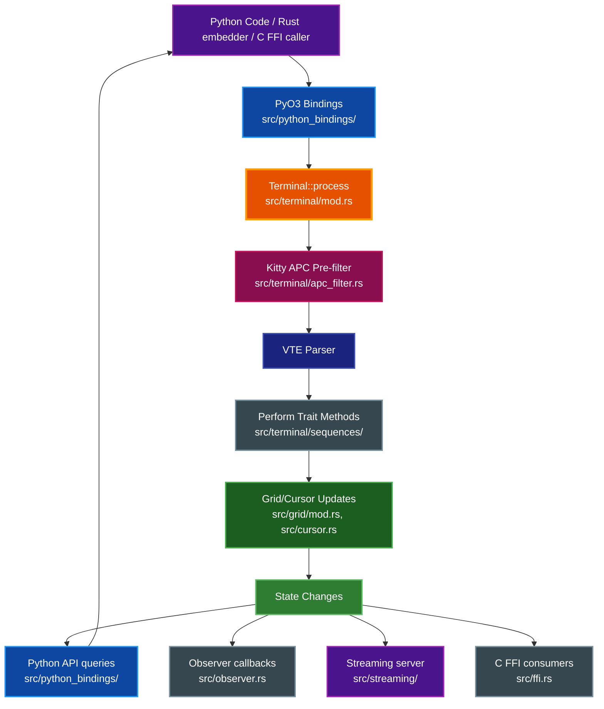
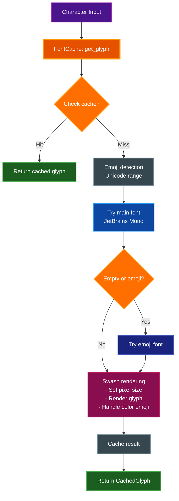
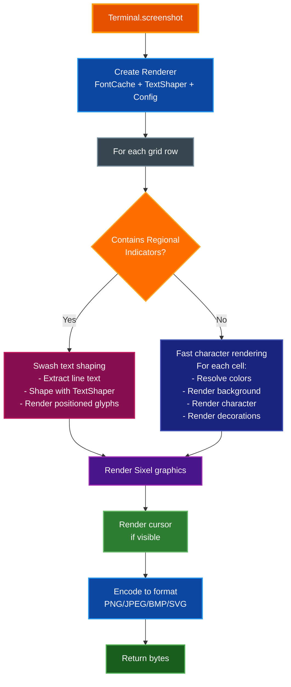
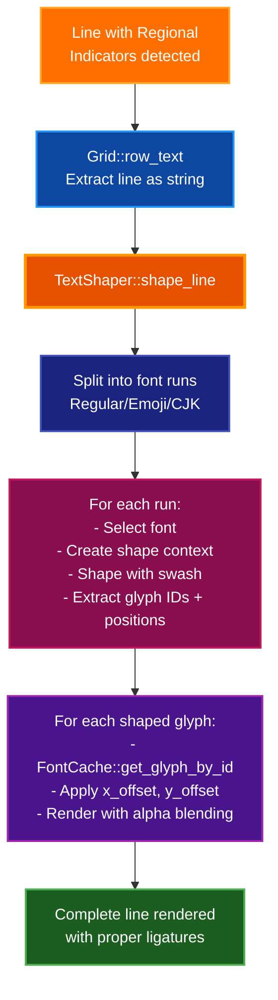
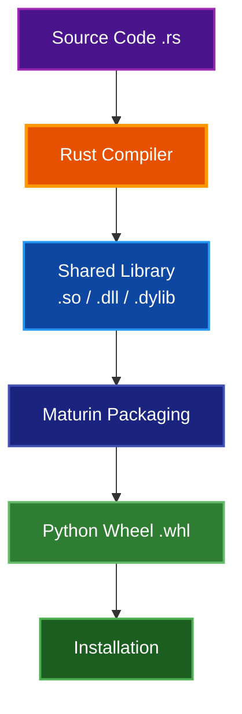

# Architecture Documentation

Comprehensive internal architecture documentation for par-term-emu-core-rust, a high-performance terminal emulator library written in Rust with Python bindings.

> **Last verified against v0.47.0.** Struct layouts, module lists, and file counts drift quickly; where a section could go stale, prefer the runnable commands given over hard-coded numbers.

## Table of Contents

- [Overview](#overview)
- [Core Components](#core-components)
  - [1. Color](#1-color)
  - [2. Cell](#2-cell)
  - [3. Cursor](#3-cursor)
  - [4. Grid](#4-grid)
  - [5. Terminal](#5-terminal)
  - [6. Supporting Modules](#6-supporting-modules)
- [ANSI Sequence Processing](#ansi-sequence-processing)
- [Data Flow](#data-flow)
- [Python Bindings](#python-bindings)
- [Memory Management](#memory-management)
- [Performance Considerations](#performance-considerations)
- [Extension Points](#extension-points)
- [Testing Strategy](#testing-strategy)
- [Implemented Features](#implemented-features)
- [Future Enhancements](#future-enhancements)
- [Screenshot Module](#screenshot-module)
- [Dependencies](#dependencies)
- [Build Process](#build-process)
- [Continuous Integration](#continuous-integration)
- [Debugging](#debugging)
- [Contributing](#contributing)
- [References](#references)
- [Related Documentation](#related-documentation)

## Overview

par-term-emu-core-rust is a terminal emulator library written in Rust with Python bindings. It uses the VTE (Virtual Terminal Emulator) crate for ANSI sequence parsing and PyO3 for Python interoperability.

**Library Artifacts:**
- **Python Extension**: Built with Maturin, provides `par_term_emu_core_rust._native` module
- **Rust Library**: Can be used as a `cdylib` or `rlib` for other Rust projects
- **Streaming Server Binary**: `par-term-streamer` - WebSocket-based terminal streaming server (optional, requires `streaming` feature)

## Core Components

### 1. Color

**Location:** `src/color.rs`

Represents colors in various formats:

- **Named Colors**: 16 basic ANSI colors (black, red, green, etc.)
- **Indexed Colors**: 256-color palette (0-255)
- **RGB Colors**: 24-bit true color (r, g, b)

All colors can be converted to RGB for rendering.

```rust
pub enum Color {
    Named(NamedColor),
    Indexed(u8),
    Rgb(u8, u8, u8),
}
```

### 2. Cell

**Location:** `src/cell.rs`

Represents a single character cell in the terminal grid. Each cell contains:

- A base character (Unicode)
- Combining characters (variation selectors, ZWJ, skin tone modifiers, etc.) for complete grapheme clusters
- Foreground color
- Background color
- Text attributes (bold, italic, underline, etc.)

```rust
pub struct Cell {
    pub c: char,
    pub combining: Vec<char>,  // Combining chars for grapheme clusters
    pub fg: Color,
    pub bg: Color,
    pub underline_color: Option<Color>,  // SGR 58/59
    pub flags: CellFlags,
    pub(crate) width: u8,  // Cached display width (1 or 2)
}
```

### 3. Cursor

**Location:** `src/cursor.rs`

Tracks the cursor state:

- Position (col, row)
- Visibility (shown/hidden)
- Style (DECSCUSR) - BlinkingBlock, SteadyBlock, BlinkingUnderline, SteadyUnderline, BlinkingBar, SteadyBar

Provides methods for cursor movement and positioning.

```rust
pub struct Cursor {
    pub col: usize,
    pub row: usize,
    pub visible: bool,
    pub style: CursorStyle,
}
```

### 4. Grid

**Location:** `src/grid/mod.rs`

Manages the 2D terminal buffer with modular organization:

**Submodules:**
- `edit.rs` - Line editing operations (insert, delete)
- `erase.rs` - Erase operations (line, display, scrollback)
- `export.rs` - Text and content export
- `rect.rs` - Rectangle operations (copy, fill)
- `scroll.rs` - Scrolling operations
- `zone.rs` - Semantic zone tracking

**Features:**
- Main screen buffer (cols × rows)
- Scrollback buffer (configurable size, flat circular buffer)
- Scrolling operations
- Cell access and manipulation
- Resize handling with scrollback reflow
- Semantic zone tracking (Prompt, Command, Output)

**Resize Behavior:**
When terminal width changes, the scrollback buffer is automatically reflowed:
- **Width increase**: Previously soft-wrapped lines are unwrapped into longer lines
- **Width decrease**: Lines are re-wrapped to fit the new width
- All cell attributes (colors, bold, italic, etc.) are preserved during reflow
- Wide characters (CJK, emoji) are handled correctly at line boundaries
- The circular buffer is rebuilt after reflow for simpler indexing
- Height-only changes do not trigger scrollback reflow (optimization)

The grid uses a flat Vec for efficient storage and access:

```rust
pub struct Grid {
    cols: usize,
    rows: usize,
    cells: Vec<Cell>,              // Row-major order
    scrollback_cells: Vec<Cell>,   // Flat circular buffer
    scrollback_start: usize,       // Circular buffer head
    scrollback_lines: usize,       // Current scrollback count
    max_scrollback: usize,
    wrapped: Vec<bool>,            // Line wrap tracking
    scrollback_wrapped: Vec<bool>, // Scrollback wrap tracking
    zones: Vec<Zone>,              // Semantic zones
    evicted_zones: Vec<Zone>,      // Zones evicted from scrollback
    total_lines_scrolled: usize,   // Lifetime scroll count
}
```

### 5. Terminal

**Location:** `src/terminal/mod.rs` (modular implementation)

The main terminal emulator that ties everything together, organized into submodules:

**Core Submodules:**
- `action.rs` - Trigger/macro action execution
- `apc_filter.rs` - Kitty TGP APC pre-filter (strips Kitty `ESC _ G ... ST` sequences before `vte` parsing)
- `clipboard.rs` - Clipboard management (OSC 52)
- `colors.rs` - Color configuration and palette
- `compliance.rs` - VT conformance testing
- `event.rs` - Terminal events (Bell, Cwd, Shell)
- `file_transfer.rs` - File transfer tracking
- `graphics.rs` - Unified graphics (Sixel, iTerm2, Kitty)
- `image.rs` - Inline image handling
- `macros.rs` - Macro recording and playback
- `metrics.rs` - Performance metrics and benchmarking
- `multiplexing.rs` - Pane and session management
- `notification.rs` - Notification types from OSC sequences
- `perform.rs` - VTE Perform trait implementation
- `progress.rs` - OSC 9;4 progress bar support
- `recording.rs` - Session recording
- `replay.rs` - Recording playback (Instant Replay)
- `replay_snapshot.rs` - Snapshot capture used by replay
- `screen.rs` - Screen buffer management
- `search.rs` - Text search functionality
- `semantic_snapshot.rs` - Semantic (prompt/command/output) snapshot capture
- `sequences/` - VTE sequence handlers, split into `csi/`, `osc/`, `dcs/` directories plus `esc.rs`
- `shell_integration.rs` - OSC 133 markers
- `snapshot_manager.rs` - Snapshot lifecycle
- `trigger.rs` - Regex pattern matching
- `write.rs` - Character writing logic

**Features:**
- Owns the grid and cursor
- Implements the VTE `Perform` trait for ANSI parsing
- Manages terminal state (colors, attributes)
- Handles all terminal operations

### 6. Supporting Modules

**Graphics Module** (`src/graphics/`)
- **Multi-protocol support**: Sixel, iTerm2 inline images (OSC 1337), Kitty graphics protocol
- **Unified architecture**: All protocols normalized to `TerminalGraphic` with RGBA pixel data
- **Submodules**:
  - `mod.rs` - Core graphics types and `GraphicsStore`
  - `animation.rs` - Animation control and frame management
  - `kitty.rs` - Kitty graphics protocol implementation
  - `iterm.rs` - iTerm2 inline images implementation
  - `placeholder.rs` - Placeholder character management
  - `serialization.rs` - Graphics state serialization (snapshots/replay)
- **Features**: Image reuse, scrolling, animation, composition modes

**Mouse Handling** (`src/mouse.rs`)
- Mouse event types and button tracking
- Mouse mode management (Normal, Button, Any)
- Mouse encoding formats (SGR, UTF-8, URXVT)

**Shell Integration** (`src/shell_integration.rs`)
- OSC 133 prompt/command/output markers
- Command execution tracking
- Integration with modern shells (fish, zsh, bash)

**Sixel Graphics** (`src/sixel.rs`)
- Sixel image parser and decoder
- DEC VT340 compatible bitmap graphics
- Integrated with unified graphics system

**Triggers & Automation** (`src/terminal/trigger.rs`)
- Regex-based pattern matching on terminal output
- `TriggerRegistry` with `RegexSet` for efficient multi-pattern matching
- Trigger actions: Highlight, Notify, MarkLine, SetVariable (core-handled); RunCommand, PlaySound, SendText (frontend events)
- Capture group substitution (`$1`, `$2`, etc.) in action parameters
- Highlight overlays with optional expiry
- Character-to-grid-column mapping for accurate match positions with wide/combining characters

**Coprocess Management** (`src/coprocess.rs`)
- `CoprocessManager` for spawning and managing external processes alongside terminal sessions
- Terminal output piping to coprocess stdin (configurable per coprocess)
- Line-buffered stdout reading via background reader threads
- Thread-safe output buffering with `Arc<Mutex<>>` pattern
- Integrated with PTY reader thread for automatic output feeding

**Macros Module** (`src/macros.rs`)
- Macro recording and playback
- Screenshot triggers
- Event tracking

**Streaming Module** (`src/streaming/`)
- **WebSocket-based terminal streaming with Protocol Buffers**
- **Submodules**:
  - `mod.rs` - Core streaming types
  - `server.rs` - Axum-based WebSocket server with TLS support, per-client subscription filtering
  - `config.rs` - `StreamingConfig` and TLS/auth configuration (split out of `server.rs` by ARC-004)
  - `session.rs` - Multi-session lifecycle management and idle-session reaping (ARC-004)
  - `rate_limit.rs` - Per-session input rate limiting (ARC-004)
  - `client.rs` - Client connection management
  - `protocol.rs` - Streaming protocol definitions (app-level): 37 server message types, 11 client message types, 26 event types
  - `proto.rs` - Protocol Buffers wire format with optional zlib compression
  - `terminal.pb.rs` - Generated protobuf types (from `proto/terminal.proto` via `build.rs`; do not edit by hand)
  - `py_convert.rs` - Python dict conversion helpers shared by the streaming bindings
  - `broadcaster.rs` - Multi-client broadcast support
  - `auth_hash.rs` - htpasswd-format hash verification (bcrypt, apr1/MD5-crypt, `{SHA}`) for HTTP Basic Auth (SEC-003)
  - `error.rs` - Streaming-specific errors
- **Features**: Real-time terminal sharing, multiplexing, binary protocol with compression, mouse/focus/paste forwarding, selection/clipboard sync, shell integration events (with cursor_line positioning), per-client event subscription filtering, badge change streaming, per-session client limits, input rate limiting, session metrics, terminal size validation, dead session reaping
- **Protocol Buffers**: Generated from `proto/terminal.proto` via `build.rs`
- **Standalone server binary** (`src/bin/streaming_server/`, requires `streaming-bin`): `main.rs` (entry point), `cli.rs` (arg parsing/env overrides), `frontend_download.rs` (release-asset download + extraction), `bootstrap.rs` (PTY/terminal wiring and session bootstrap), `theme.rs` (theme file loading)

**Utility Modules**
- `ansi_utils.rs` - ANSI sequence parsing and generation helpers
- `ffi.rs` - C-compatible embedding API: `#[repr(C)]` types and `extern "C"` functions for creating, querying, and observing terminals from Swift, Kotlin/JNI, C/C++ (see [FFI_GUIDE.md](FFI_GUIDE.md))
- `observer.rs` - Rust `TerminalObserver` trait for push-based event delivery; callbacks fire after each `process()` call with no internal locks held
- `unicode_width_config.rs` - Configurable character width: Unicode version selection for width tables and East Asian Ambiguous width treatment
- `unicode_normalization_config.rs` - Configurable Unicode normalization (NFC/NFD/NFKC/NFKD) applied to PTY text before cell storage, keeping search and cursor movement consistent
- `grapheme.rs` - Grapheme cluster utilities for Unicode handling
  - Variation selector detection (U+FE0E text style, U+FE0F emoji style)
  - Zero Width Joiner (ZWJ) detection for emoji sequences
  - Skin tone modifier detection (U+1F3FB-U+1F3FF Fitzpatrick types)
  - Regional indicator detection for flag emoji (U+1F1E6-U+1F1FF)
  - Combining mark detection for diacritics and accents
  - Wide grapheme detection for proper terminal cell width calculation
- `color_utils.rs` - Advanced color manipulation and conversion utilities
  - Minimum contrast adjustment (iTerm2-compatible)
  - Perceived brightness calculation (NTSC formula)
  - Color space conversions (RGB, HSL, HSV)
  - WCAG contrast ratio calculations
  - Bold brightening support for enhanced readability
  - Parametric interpolation for brightness adjustment
  - Preserves color hue while adjusting brightness
- `text_utils.rs` - Text processing and Unicode handling
  - Word boundary detection with configurable word characters
  - Default word characters: `"/-+\\~_."` (iTerm2-compatible)
  - `DEFAULT_WORD_CHARS` constant for word selection
  - `is_word_char()`, `get_word_at()`, `select_word()` functions
- `html_export.rs` - HTML export functionality for terminal content
  - Complete HTML document generation with embedded styles
  - Scrollback buffer export support
  - Inline CSS for terminal styling
  - Color preservation (foreground, background, attributes)
  - Monospace font stack: Monaco, Menlo, Ubuntu Mono, Consolas, monospace
- `debug.rs` - Debug utilities and logging helpers with formatted output macros
- `conformance_level.rs` - VT terminal conformance level support
  - VT100/VT220/VT320/VT420/VT520 level definitions
  - Feature compatibility management
- `tmux_control.rs` - Tmux control protocol support
  - Control mode protocol parsing (`tmux -C`)
  - Asynchronous notification handling
  - Pane output management

**PTY Support**
- `pty_session.rs` - PTY session management with portable-pty
- `pty_error.rs` - PTY-specific error types
- `badge.rs` - iTerm2 OSC 1337 SetBadgeFormat parsing and badge format evaluation

`PtySession` owns:

- A `parking_lot::RwLock` (wrapped in `Arc<RwLock<Terminal>>`) for all terminal state (migrated from `Mutex` in ARC-009 to let concurrent readers — e.g. Python API queries — proceed without blocking each other). `parking_lot` is used for performance and to eliminate lock poisoning risk. Writers (the PTY reader thread calling `term.process(..)`, resize, etc.) still take the lock exclusively via `.write()`; readers use `.read()`.
- A `portable_pty::PtyPair` and child process handle.
- A background reader thread that:
  - Reads from the PTY master.
  - Feeds bytes into the `Terminal` via `term.process(..)` while holding the terminal's write lock.
  - Writes device-query responses (DA/DSR/DECRQM/etc.) back to the child via the shared writer.
- An `Arc<AtomicBool>` `running` flag that reflects the session’s view of whether the child is still alive.

Separately, `PtySession` also holds a `parking_lot::Mutex` around the PTY writer, the output callback, and the coprocess manager — those remain plain mutexes since they don't benefit from read/write splitting.

`running` is deliberately a **best-effort** indicator:

- It is set to `true` when a child is successfully spawned.
- It is set to `false` when:
  - EOF is observed on the PTY reader (reader thread).
  - `try_wait()` observes an exited child.
  - `wait()` completes.
  - `kill()` is called.
- There may be a short window where the OS still considers the process live even though `running == false`, or vice versa (between a process exit and the reader thread seeing EOF). Callers that need precise exit status should use `try_wait()`/`wait()` instead of relying solely on `is_running()`.

**As of ARC-001, `Terminal` is no longer one flat ~150-field struct.** It is decomposed into ~30 `pub(crate)` cohesive sub-structs, each grouping the fields for one feature area. `Terminal` itself holds a handful of "hot path" fields directly (grid, cursor, colors, the VTE parser) plus one field per sub-struct:

```rust
pub struct Terminal {
    // Hot-path fields kept directly on Terminal (accessed on every write)
    grid: Grid,
    alt_grid: Grid,
    alt_screen_active: bool,
    cursor: Cursor,
    alt_cursor: Cursor,
    fg: Color,
    bg: Color,
    underline_color: Option<Color>,
    flags: CellFlags,
    tab_stops: Vec<bool>,
    response_buffer: Vec<u8>,
    parser: vte::Parser,
    pending_wrap: bool,
    pixel_width: usize,
    pixel_height: usize,
    conformance_level: ConformanceLevel,
    warning_bell_volume: u8,
    margin_bell_volume: u8,
    dirty_rows: HashSet<usize>,
    selection: Option<Selection>,
    pane_state: Option<PaneState>,
    event_subscription: Option<HashSet<TerminalEventKind>>,

    // One field per feature sub-struct (ARC-001)
    saved_state: SavedCursorState,       // DECSC/DECRC saved cursor + SGR colors/flags
    title_state: TitleState,             // Title, title stack, answerback string
    sync_state: SyncState,               // Synchronized updates (DEC 2026)
    shell_state: ShellState,             // Shell integration, host/user, depth
    margins: MarginState,                // DECSTBM/DECSLRM scroll + margins
    modes: TerminalModes,                // DECSET/DECRST-style mode flags
    keyboard_state: KeyboardState,       // Kitty keyboard protocol flags/stacks
    hyperlink_state: HyperlinkState,     // OSC 8 hyperlinks map + IDs
    graphics: GraphicsState,             // Unified graphics store + Sixel/iTerm2/Kitty state
    dcs_state: DcsState,                 // Sixel parser + DCS buffer
    clipboard_state: ClipboardState,     // OSC 52 clipboard content + history
    theme: ColorThemeState,              // OSC-queryable colors + rendering prefs
    notifications_state: NotificationState, // OSC 9/777 notifications + config
    progress_state: ProgressBellState,   // OSC 9;4 progress bar + bell counter
    security_state: SecurityFlagsState,  // OSC 7 acceptance + insecure-sequence disable
    tmux: TmuxState,                     // Tmux control-protocol parser
    events: EventBrokerState,            // Event buffer + observer registry
    bookmarks_state: BookmarksState,     // Bookmarks + next ID
    profiling: ProfilingState,           // Performance metrics + profiling
    mouse_history: MouseHistoryState,    // Mouse event/position history
    rendering: RenderingState,           // Rendering hints + damage regions
    search: SearchState,                 // Regex search matches
    inline_image_state: InlineImageState, // Inline image storage
    clipboard_sync: ClipboardSyncState,  // OSC 52 clipboard-sync events/history
    command_history_state: CommandHistoryState, // Command/CWD execution history
    recording_state: RecordingState,     // Session recording
    macros: MacroState,                  // Macro library + playback
    unicode_state: UnicodeConfigState,   // Width config + normalization form
    badge_state: BadgeState,             // OSC 1337 badge format + session vars
    triggers: TriggerState,              // Trigger registry + highlights
    charset_state: CharsetState,         // G0/G1 charset designations

    // Kitty APC pre-filter (vte 0.15 doesn't expose APC payloads to `Perform`)
    apc_filter_state: ApcFilterState,
    apc_buffer: Vec<u8>,
    apc_passthrough: Vec<u8>,
    kitty_parser: KittyParser,
}
```

Each sub-struct type is defined in `src/terminal/mod.rs` immediately above the `Terminal` struct itself, with a doc comment explaining what it groups and why (search for `pub(crate) struct` in that file for the full, current list). This decomposition is a pure reorganization — field access from within `src/terminal/` goes through the sub-struct (e.g. `self.margins.scroll_region_top`), but it does not change the Python-facing API.

## ANSI Sequence Processing

The terminal uses the VTE crate for parsing ANSI escape sequences:


The `Terminal` struct implements the `Perform` trait with these methods:

- `print(char)`: Handle printable characters
- `execute(byte)`: Handle C0 control codes (newline, tab, etc.)
- `csi_dispatch()`: Handle CSI sequences (cursor movement, colors, etc.)
- `osc_dispatch()`: Handle OSC sequences (terminal title, etc.)
- `esc_dispatch()`: Handle ESC sequences (charset selection, etc.)
- `dcs_hook()`, `dcs_put()`, `dcs_unhook()`: Handle DCS sequences (Sixel graphics, etc.)

## Data Flow



The Kitty APC pre-filter runs before the `vte` parser because `vte` does not expose APC payloads to `Perform` (see ANSI Sequence Processing). Observer callbacks (`src/observer.rs`), the streaming server (`src/streaming/`), and the C FFI surface (`src/ffi.rs`) all consume terminal state changes in addition to the Python API queries.

## Python Bindings

The Python bindings live in `src/python_bindings/`. **As of ARC-002, `terminal.rs` is no longer a single file** — it is a directory, `src/python_bindings/terminal/`, containing `mod.rs` (the `PyTerminal` struct, constructor, and any methods not yet split out) plus 17 themed `*_api.rs` files, each a separate `#[pymethods] impl PyTerminal` block covering one feature area:

- `badge_api.rs` - OSC 1337 badge format + semantic snapshots
- `bookmark_api.rs` - Bookmarks
- `clipboard_api.rs` - OSC 52 clipboard + clipboard history/slots
- `color_api.rs` - Color/appearance getters-setters, rendering hints
- `file_transfer_api.rs` - Kitty/iTerm2 file transfer tracking
- `image_api.rs` - Inline image queries
- `metrics_api.rs` - Performance metrics, frame timings
- `mouse_api.rs` - Mouse event recording and history
- `multiplexing_api.rs` - Pane state capture/restore
- `notification_api.rs` - OSC 9/777 notifications
- `recording_api.rs` - Session recording export (asciicast/JSON)
- `scrollback_api.rs` - Scrollback export and stats
- `search_api.rs` - Text/regex search, content detection
- `selection_api.rs` - Selection management
- `shell_integration_api.rs` - OSC 133 shell integration extended features
- `text_api.rs` - Text extraction utilities
- `trigger_api.rs` - Trigger registration and matching

This split (ARC-002) is a pure relocation out of a single monolithic `#[pymethods]` block — no Python API or behavior change; all methods still resolve on the same `Terminal` Python class because Rust allows multiple `impl` blocks for one type.

Other submodules:
- `pty.rs` - `PyPtyTerminal` struct and its implementation (PTY support). Holds the `Terminal` behind `PtySession`'s `Arc<RwLock<Terminal>>` rather than owning it directly.
- `common.rs` - Shared Terminal-access macros (ARC-003/QA-001): `impl_terminal_query_getters!` and `impl_terminal_state_setters!` generate identical getter/setter methods for both `PyTerminal` and `PyPtyTerminal` from one macro body, via the `TerminalAccess` trait that abstracts over "owns a `Terminal` directly" vs. "reaches it through an `Arc<RwLock<Terminal>>`". This is why most methods appear on both classes without duplicated code.
- `screenshot_config.rs` - `PyScreenshotConfig` (`ScreenshotConfig`), a reusable options object for `screenshot_config()`/`screenshot_to_file_config()` so callers don't repeat 16+ keyword args per call (QA-005, added 0.43.0)
- `types/` - Data types directory (formerly a single ~4,000-line `types.rs`, now split by domain: `clipboard.rs`, `color.rs`, `graphics.rs`, `metrics.rs`, `mouse.rs`, `notification.rs`, `recording.rs`, `screen.rs`, `selection.rs`, `session.rs`, `shell.rs`, `trigger.rs`, with `mod.rs` re-exporting every `Py*` type so `python_bindings::types::PyX` and the crate-level re-exports are unchanged). Holds PyAttributes, PyScreenSnapshot, PyShellIntegration, PyGraphic, PyTmuxNotification, PySearchMatch, PyDetectedItem, PySelection, PyScrollbackStats, PyBookmark, PyPerformanceMetrics, and many more.
- `enums.rs` - Enum types (PyCursorStyle, PyUnderlineStyle, PySelectionMode, PyWidthConfig, and more)
- `observer.rs` - `PyCallbackObserver`/`PyQueueObserver`, bridging the Rust `TerminalObserver` trait to Python callables/`asyncio.Queue`
- `streaming.rs` - `StreamingServer`/`StreamingConfig` Python bindings (requires the `streaming` feature)
- `conversions.rs` - Type conversions and parsing utilities
- `color_utils.rs` - Python bindings for color manipulation utilities:
  - Perceived brightness and luminance calculations
  - Contrast adjustment (iTerm2-compatible)
  - Color space conversions (RGB ↔ HSL)
  - WCAG compliance testing (AA/AAA)
  - Color mixing, lightening, darkening
  - Saturation and hue adjustment
  - Complementary color generation
  - Hex color conversion
  - ANSI 256-color conversion

The main Python module is defined in `src/lib.rs`, which exports the `_native` module. Class/function counts drift with every feature addition — get the current numbers with:

```bash
grep -c 'm.add_class::<' src/lib.rs      # registered classes
grep -c 'm.add_function' src/lib.rs      # registered free functions
```

```rust
#[pyclass(name = "Terminal")]
pub struct PyTerminal {
    inner: crate::terminal::Terminal,
}
```

All public methods are wrapped with `#[pymethods]` and provide:

- Type conversion (Rust ↔ Python)
- Error handling (Result → PyResult)
- Pythonic API design

## Memory Management

- **Rust Side**: Owned data structures with automatic memory management
- **Python Side**: Python objects wrapping Rust data
- **Zero-copy**: Where possible, data is referenced rather than copied
- **Scrollback**: Limited by `max_scrollback` to prevent unbounded growth

## Performance Considerations

### Efficient Grid Storage

- Flat Vec for cache-friendly access
- Row-major order for sequential line access
- Minimal allocations during normal operation

### ANSI Parsing

- VTE crate provides fast, zero-allocation parsing
- State machine approach for streaming input

### Python Boundary

- Minimize Python/Rust crossings
- Batch operations where possible
- Return references instead of copying when safe

## Extension Points

### Adding New ANSI Sequences

1. Add handler in the appropriate sequence module:
   - CSI sequences: `src/terminal/sequences/csi/` (directory: `mod.rs` plus per-topic files `cursor.rs`, `edit.rs`, `erase.rs`, `keyboard.rs`, `mode.rs`, `report.rs`, `scroll.rs`, `style.rs`, `window.rs`)
   - OSC sequences: `src/terminal/sequences/osc/` (directory: `mod.rs` plus per-topic files `clipboard.rs`, `color.rs`, `image.rs`, `iterm.rs`, `notify.rs`, `shell.rs`, `title.rs`)
   - ESC sequences: `src/terminal/sequences/esc.rs`
   - DCS sequences: `src/terminal/sequences/dcs/` (directory: `mod.rs` plus `query.rs`, `sixel.rs`)
2. Update grid/cursor state as needed
3. Add tests

### New Color Formats

1. Add variant to `Color` enum in `src/color.rs`
2. Implement `to_rgb()` conversion
3. Update color handling in `src/terminal/sequences/csi/style.rs`

### Additional Cell Attributes

1. Add flag to `CellFlags` in `src/cell.rs`
2. Update SGR handling in `src/terminal/sequences/csi/style.rs`
3. Expose in Python API if needed (in `src/python_bindings/`)

## Testing Strategy

### Test Coverage

**Running the test suites:**
- **Rust tests:** run `cargo test --lib --no-default-features --features pyo3/auto-initialize` (or `make test-rust`) to see the current count.
- **Python tests:** run `uv run pytest tests/` (or `make test-python`) to see the current count.
  - PTY tests excluded in CI (hang in automated environments)
  - All tests run locally for comprehensive validation
- Test counts grow with every PR; run the commands above rather than relying on a number printed here.

### Rust Tests

- **Unit tests** in each module (included via `#[cfg(test)]` modules)
- **Integration tests** for full ANSI sequences and terminal operations
  - `tests/test_skin_tone_modifiers.rs` - Tests for emoji skin tone modifier handling
  - `tests/test_zwj_sequences.rs` - Tests for Zero Width Joiner emoji sequences
- **Property-based tests** for invariants (using `proptest` crate)
- **PyO3 configuration:** Tests run with `--no-default-features --features pyo3/auto-initialize`
  - The `extension-module` feature prevents linking during tests
  - Must use `auto-initialize` feature for test environment
  - Run via: `cargo test --lib --no-default-features --features pyo3/auto-initialize`

### Python Tests

- **API contract tests** validating Python bindings behavior
- **Example-based tests** covering common use cases
- **Edge case handling** for error conditions and boundary cases
- **Timeout protection:** 5-second default per test (configured in pyproject.toml)
- **PTY tests** excluded in CI (hang in automated environments):
  - `test_pty.py`, `test_ioctl_size.py`
  - `test_pty_resize_sigwinch.py`, `test_nested_shell_resize.py`

## Implemented Features

The terminal emulator includes comprehensive VT100/VT220/VT320/VT420 compatibility with modern protocol support:

### Core Features ✅

1. **Alt Screen Buffer** - Fully implemented with modes 47, 1047, 1049
2. **Tab Stops** - Complete tab stop management (HTS, TBC, CHT, CBT)
3. **Line Wrapping** - Auto-wrap mode (DECAWM) with delayed wrap
4. **Hyperlinks** - Full OSC 8 hyperlink support with deduplication
5. **Sixel Graphics** - Complete Sixel implementation with half-block rendering
6. **Wide Character Support** - Unicode, emoji, and CJK characters

### Modern Protocols ✅

1. **Mouse Tracking** - All modes (Normal, Button, Any) and encodings (SGR, UTF-8, URXVT)
2. **Bracketed Paste** - Mode 2004 for safe paste handling
3. **Synchronized Updates** - Mode 2026 for flicker-free rendering
4. **Kitty Keyboard Protocol** - Enhanced keyboard reporting with flag management
5. **Shell Integration** - OSC 133 for prompt/command/output markers
6. **Clipboard** - OSC 52 read/write with security controls

### VT Compatibility ✅

- VT100/VT220/VT320 - Complete compatibility
- VT420 - Rectangle operations (DECFRA, DECCRA, DECSERA)
- Left/Right Margins - DECLRMM/DECSLRM support
- Cursor Styles - DECSCUSR with all styles
- Device Queries - DA, DSR, CPR, DECRQM

## Future Enhancements

### Potential Improvements

1. **Unicode Normalization**: Proper grapheme cluster handling for combining marks
2. **Performance**: SIMD optimizations for bulk cell operations
3. **Character Sets**: G0/G1/G2/G3 selection (low priority - UTF-8 handles most cases)

### API Enhancements

1. **Cell Iterators**: Efficient row/region iteration without copying
2. **Diff API**: Change detection for efficient incremental rendering
3. **Event Callbacks**: Async callbacks for title change, resize, bell, etc.
4. **Async Support**: Fully async Python API for non-blocking operation

## Screenshot Module

### Architecture (`src/screenshot/`)

The screenshot module provides high-quality rendering of terminal content to various image formats:

#### Components

1. **Configuration** (`config.rs`)
   - **Purpose**: Screenshot configuration and format options
   - **Features**:
     - Image format selection (PNG, JPEG, BMP, SVG)
     - Font size and padding configuration
     - Sixel rendering mode options (Disabled, Pixels, HalfBlocks)
     - Quality settings for lossy formats (1-100 for JPEG)
     - Font multipliers (line height, character width)
     - Scrollback buffer inclusion
     - Cursor rendering options
     - Theme colors (link, bold, cursor guide, badge, match, selection)
     - Bold brightening and custom bold color support
     - Minimum contrast adjustment (0.0-1.0, iTerm2-compatible)
     - Faint text alpha control (dim strength, 0.0-1.0)

2. **Font Cache** (`font_cache.rs`)
   - **Library**: Swash (pure Rust font library)
   - **Purpose**: Loads and caches font glyphs for efficient rendering
   - **Features**:
     - Embedded JetBrains Mono font (no external dependencies)
     - Embedded Noto Emoji font for emoji support
     - Automatic emoji font fallback (Apple Color Emoji, Segoe UI Emoji)
     - Color emoji rendering with RGBA output
     - Glyph caching for performance (by character, size, bold, italic)
     - Glyph-by-ID rendering for shaped text
   - **Embedded Fonts**: `JetBrainsMono-Regular.ttf`, `NotoEmoji-Regular.ttf`

3. **Text Shaper** (`shaper.rs`)
   - **Library**: Swash (pure Rust text shaping and font rendering)
   - **Purpose**: Handles complex text rendering with ligatures and multi-codepoint sequences
   - **Features**:
     - Flag emoji support via Regional Indicator ligatures (🇺🇸 🇨🇳 🇯🇵)
     - Multi-font support (Regular, Emoji, CJK) with automatic selection
     - Positioned glyph output with advance/offset information
     - Font run segmentation for mixed-script text
     - Pure Rust implementation (no C dependencies, no HarfBuzz)

4. **Renderer** (`renderer.rs`)
   - **Purpose**: Converts terminal grid to image pixels
   - **Features**:
     - Hybrid rendering: character-based (fast) + line-based shaping (complex emoji)
     - Regional Indicator detection for automatic text shaping
     - Full text attribute support (bold, italic, underline styles, colors)
     - Cursor rendering (block, underline, bar styles)
     - Sixel graphics rendering (pixels and half-block modes)
     - Alpha blending for smooth text and graphics
     - Pure Rust rendering pipeline (no C dependencies)

5. **Utilities** (`utils.rs`)
   - **Purpose**: Helper functions for screenshot rendering
   - **Features**:
     - Color conversion and blending utilities
     - Text measurement and positioning helpers
     - Regional Indicator detection for emoji flags

6. **Error Handling** (`error.rs`)
   - **Purpose**: Screenshot-specific error types
   - **Features**:
     - Comprehensive error variants for font, rendering, and encoding failures
     - Integration with standard error handling

7. **Format Support** (`formats/`)
   - **Modules**: `mod.rs`, `png.rs`, `jpeg.rs`, `bmp.rs`, `svg.rs`
   - **Raster formats**: PNG, JPEG, BMP (via `image` crate)
   - **Vector format**: SVG (custom implementation for scalable text)

### Font Rendering Pipeline



### Bitmap Font Handling

Color emoji fonts (like NotoColorEmoji) are bitmap-only fonts that:
- Cannot be scaled to arbitrary sizes
- Have fixed sizes (typically 32, 64, 72, 96, 109, 128, 136 pixels)
- Require special handling during size selection

The implementation automatically:
1. Attempts requested size
2. Falls back to closest available fixed size
3. Renders with swash's color emoji support
4. Outputs RGBA for consistent image processing

### Rendering Pipeline



### Text Shaping Pipeline (Flag Emoji)



## Dependencies

### Rust

**Core dependencies:**
- `pyo3` (0.29) - Python bindings (optional, feature-gated; uses `multiple-pymethods` to allow the split `*_api.rs` impl blocks)
- `par-term-emu-derive` (path `derive/`) - Local proc-macro crate for derived impls
- `vte` (0.15.0) - ANSI parser
- `unicode-width` (0.2.2) - Character width calculation
- `portable-pty` (0.9.0) - PTY support
- `base64` (0.22.1) - Base64 encoding/decoding
- `bitflags` (2.13.0) - Bit flag management
- `regex` (1.12.3) - Regular expression support
- `serde` (1.0.228) + `serde_json` (1.0.150) + `serde_yaml_ng` (0.10.0) - Serialization support

**Screenshot/rendering support:**
- `image` (0.25.10) - Image encoding/decoding (PNG, JPEG, BMP)
- `swash` (0.2.7) - Pure Rust font rendering and text shaping with color emoji support

**Streaming server dependencies (optional, feature-gated):**
- `tokio` (1.52.3) - Async runtime with full features
- `tokio-tungstenite` (0.29) - WebSocket support
- `axum` (0.8.9) - Web framework with WebSocket support
- `tower-http` (0.6.11) - HTTP middleware (fs, trace, cors)
- `futures-util` (0.3.32) - Future utilities
- `uuid` (1.23.2) - UUID generation with v4 and serde support
- `clap` (4.6.1) - CLI parsing with derive feature (binary-only, via `streaming-bin`)
- `anyhow` (1.0.102) - Error handling (binary-only, via `streaming-bin`)
- `tracing` (0.1.44) + `tracing-subscriber` (0.3.23) - Logging (binary-only, via `streaming-bin`)
- `reqwest` (0.13.4) - HTTP client with rustls-tls, for frontend downloads (binary-only, via `streaming-bin`)
- `flate2` (1.1.9) + `tar` (0.4.46) - Archive extraction (tar is binary-only, via `streaming-bin`)
- `prost` (0.14.3) + `prost-build` (0.14.3) - Protocol Buffers (`prost-build` only via `regenerate-proto`)
- `rustls` (0.23.40) + `tokio-rustls` (0.26.4) - TLS support
- `axum-server` (0.8.0) - TLS server support
- `bcrypt` (0.19.1) + `md-5` (0.11.0) + `sha1` (0.11.0) - HTTP Basic Auth hash verification (SEC-003; replaced the unmaintained `rustls-pemfile` per RUSTSEC-2025-0134)
- `headers` (0.4.1) - HTTP header types for auth
- `sysinfo` (0.39.3) - System resource statistics for `SystemStats` events

**Development dependencies:**
- `pyo3` (0.29, features: auto-initialize) - Python test support
- `proptest` (1.11.0) - Property-based testing framework
- `tempfile` (3.27) - Temporary file management for tests

**Platform-specific:**
- `libc` (0.2.186) - Unix system calls (Unix only)

> **📝 Note:** See `Cargo.toml` for current version requirements

### Python

**Build and development tools:**
- `maturin` (>=1.13.3,<2.0) - Build system for PyO3 bindings
- `uv` - Fast Python package installer and resolver (recommended)

**Runtime dependencies:**
- `pillow` (>=12.2.0) - Image processing for sixel examples and screenshot features

**Testing:**
- `pytest` (>=9.0.3) - Testing framework
- `pytest-timeout` (>=2.4.0) - Test timeout protection (5-second default)
- `pytest-asyncio` (>=1.4.0) - Async test support
- `pytest-cov` (>=5.0.0) - Coverage reporting

**Code quality:**
- `ruff` (>=0.15.16) - Linting and formatting
- `pyright` (>=1.1.410) - Static type checking
- `pre-commit` (>=4.6.0) - Git hook management

**Python version requirements:** 3.12, 3.13, 3.14

> **📝 Note:** See `pyproject.toml` for current version requirements

> **Note**: This is a core library. For a full-featured TUI application built on this library, see the sister project [par-term-emu-tui-rust](https://github.com/paulrobello/par-term-emu-tui-rust) ([PyPI](https://pypi.org/project/par-term-emu-tui-rust/)), which uses the Textual framework.

## Build Process

### PyO3 Feature Configuration

The project uses conditional PyO3 feature compilation to support both production builds and testing:

**Cargo.toml features:**
```toml
[dependencies]
pyo3 = { version = "0.29", optional = true, features = ["multiple-pymethods"] }
par-term-emu-derive = { path = "derive", version = "0.45.0", optional = true }

[dev-dependencies]
pyo3 = { version = "0.29", features = ["auto-initialize"] }

[features]
default = ["python"]
python = ["pyo3", "pyo3/extension-module", "par-term-emu-derive", "pty_session"]
# Real PTY backend (PtySession/PtyTerminal): portable-pty + Unix signal deps.
# Enabled by `python` (PyPtyTerminal binding) and `streaming-bin` (the server
# binary spawns real shells).
pty_session = ["portable-pty", "nix"]
# Library streaming: WebSocket/protobuf server for embedders. Excludes the
# binary-only CLI/logging/download deps (see `streaming-bin`).
streaming = ["tokio", "tokio-tungstenite", "axum", "tower-http", "futures-util",
             "prost", "rustls", "tokio-rustls", "axum-server",
             "bcrypt", "md-5", "sha1", "headers", "sysinfo"]
# Standalone par-term-streamer binary only (ARC-015): CLI/logging/download deps
# the library streaming module never uses. Depends on `streaming` and `pty_session`.
streaming-bin = ["streaming", "clap", "anyhow", "tracing", "tracing-subscriber", "reqwest", "tar", "pty_session"]
# Headless profile: grid + terminal + screenshot only — no PTY, Python, or
# streaming. Enables nothing itself; it only names the profile (src/lib.rs
# rejects combining it with `python`).
sim = []
jemalloc = ["tikv-jemallocator"]              # Better server performance (non-Windows)
regenerate-proto = ["prost-build"]            # Rebuild protobuf from proto/terminal.proto
rust-only = []
full = ["python", "streaming", "streaming-bin"]
```

**Build commands:**
- **Development build:** `maturin develop --release` (uses `extension-module` feature)
- **Running Rust tests:** `cargo test --lib --no-default-features --features pyo3/auto-initialize`
- **Production wheels:** `maturin build --release` (uses default features with `extension-module`)
- **Streaming server binary:** `cargo build --release --bin par-term-streamer --no-default-features --features streaming-bin`

> **⚠️ Important:** Never run `cargo build` directly for PyO3 modules. Always use `maturin develop` or the `make dev` target to ensure proper Python integration.

**Why these features:**
- **`extension-module`:** Tells linker NOT to link against libpython (correct for Python extensions)
- **`auto-initialize`:** Initializes Python interpreter for Rust tests (required for `cargo test`)
- **Default feature:** Enables `extension-module` automatically for production builds
- **Test override:** Uses `--no-default-features` to disable `extension-module` during testing

### Build Flow



## Continuous Integration

### CI/CD Pipeline

The project uses GitHub Actions (`.github/workflows/ci.yml`) with four jobs. The Test, Lint, and Build jobs depend on Version Check, which runs first:

#### Version Check Job
- **Platform:** Ubuntu only
- **Timeout:** 5 minutes
- **Purpose:** Verifies the version string is consistent across `Cargo.toml`, `pyproject.toml`, and `python/par_term_emu_core_rust/__init__.py` before any build work runs.

#### Test Job
- **Platforms:** Ubuntu, macOS, Windows
- **Python versions:** 3.12, 3.13, 3.14 (matrix: 9 combinations)
- **Timeout:** 15 minutes per job
- **Steps:**
  1. **Rust tests:** `cargo test --lib --no-default-features --features pyo3/auto-initialize`
  2. **Python tests:** `pytest tests/ -v --timeout=5 --timeout-method=thread`
  3. **PTY tests excluded in CI:**
     - `test_pty.py` - Hangs in automated environments
     - `test_ioctl_size.py` - Requires real PTY
     - `test_pty_resize_sigwinch.py` - Signal handling issues in CI
     - `test_nested_shell_resize.py` - Complex PTY interactions

#### Lint Job
- **Platform:** Ubuntu only
- **Python version:** 3.14
- **Timeout:** 15 minutes
- **Checks:**
  - Rust formatting: `cargo fmt -- --check`
  - Rust clippy: `cargo clippy --all-targets --features python,streaming -- -D warnings`
  - Python formatting: `ruff format --check`
  - Python linting: `ruff check`
  - Python type checking: `pyright`

#### Build Job
- **Platforms:** Ubuntu, macOS, Windows
- **Python version:** 3.14
- **Timeout:** 15 minutes
- **Output:** Platform-specific wheels uploaded as artifacts
- **Command:** `maturin build --release`

### Running Checks Locally

```bash
# Run all checks with auto-fix
make checkall

# Individual checks
make test-rust    # Rust unit tests
make test-python  # Python integration tests
cargo fmt         # Format Rust code
cargo clippy      # Lint Rust code
uv run ruff format .  # Format Python code
uv run ruff check .   # Lint Python code
uv run pyright .      # Type check Python code
```

### Pre-commit Hooks

The project uses `pre-commit` hooks to enforce quality standards. Install with:

```bash
make pre-commit-install  # or: uv run pre-commit install
```

**Hooks enabled:**
- Trailing whitespace removal
- End-of-file fixing
- YAML/TOML syntax checking
- Large file detection
- Rust formatting (`cargo fmt`)
- Rust linting (`cargo clippy`)
- Rust tests (`cargo test --lib --no-default-features --features pyo3/auto-initialize`)
- Python formatting (`ruff format`)
- Python linting (`ruff check --fix`)
- Python type checking (`pyright`)
- Python tests (`pytest`)

## Debugging

### Rust Side

```bash
# Enable debug logging
RUST_LOG=debug cargo test

# Use rust-lldb/gdb
rust-lldb target/debug/test_binary
```

### Python Side

```python
# Inspect terminal state
print(repr(term))
print(term.content())
print(term.cursor_position())

# Check individual cells
for row in range(term.size()[1]):
    for col in range(term.size()[0]):
        char = term.get_char(col, row)
        print(f"({col},{row}): {char}")
```

## Contributing

When contributing, please:

1. Add tests for new features
2. Update documentation
3. Follow Rust style guidelines (`cargo fmt`)
4. Pass clippy lints (`cargo clippy`)
5. Ensure Python API remains intuitive

## References

- [VTE Crate Documentation](https://docs.rs/vte/) - ANSI parser library
- [PyO3 Guide](https://pyo3.rs/) - Rust-Python bindings
- [xterm Control Sequences](https://invisible-island.net/xterm/ctlseqs/ctlseqs.html) - Comprehensive reference
- [ANSI Escape Sequences](https://en.wikipedia.org/wiki/ANSI_escape_code) - Wikipedia overview
- [VT100 Reference](https://vt100.net/) - Historical VT100 documentation

## Related Documentation

- [VT_TECHNICAL_REFERENCE.md](VT_TECHNICAL_REFERENCE.md) - Complete VT feature support matrix and implementation details
- [ADVANCED_FEATURES.md](ADVANCED_FEATURES.md) - Advanced features guide
- [CONFIG_REFERENCE.md](CONFIG_REFERENCE.md) - Terminal configuration reference
- [BUILDING.md](BUILDING.md) - Build and installation instructions
- [SECURITY.md](SECURITY.md) - Security considerations for PTY usage
- [README.md](../README.md) - Project overview and API reference
