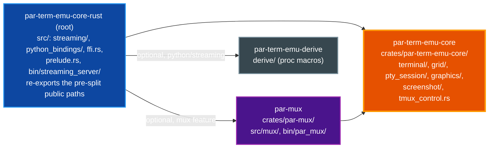
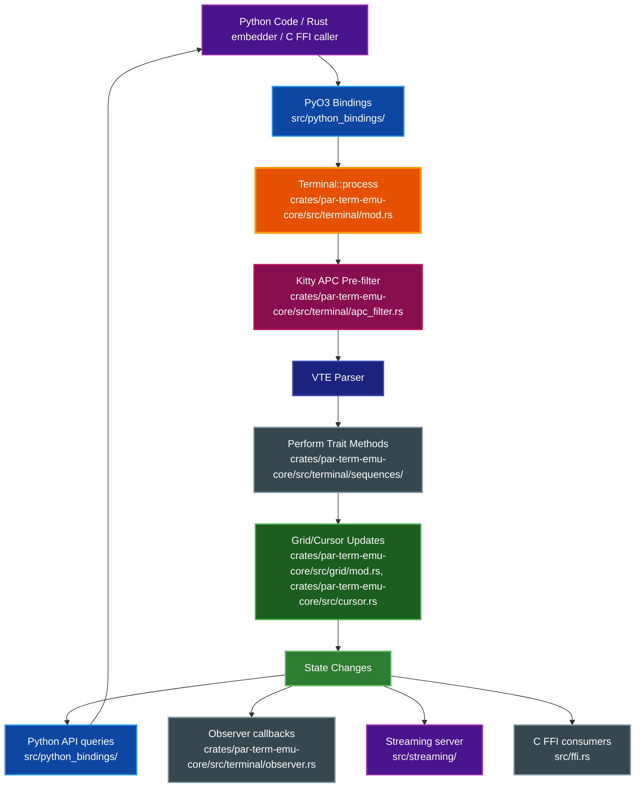
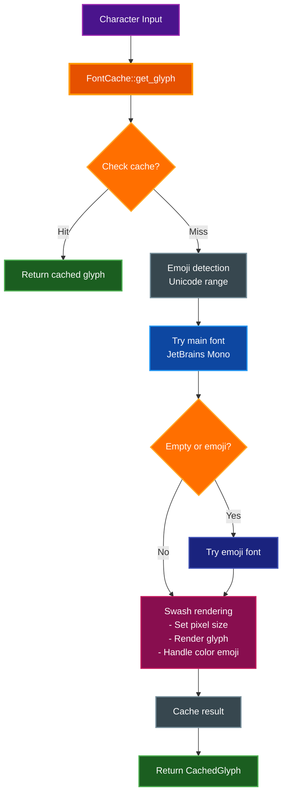
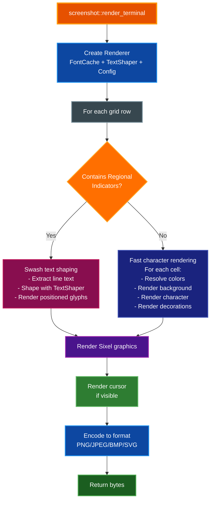
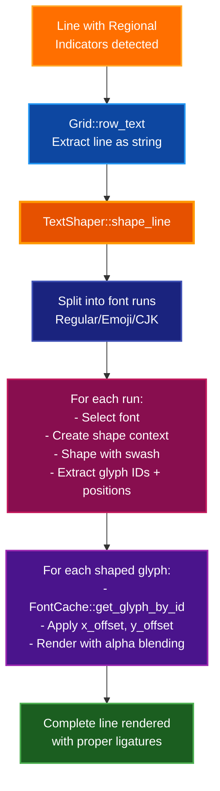
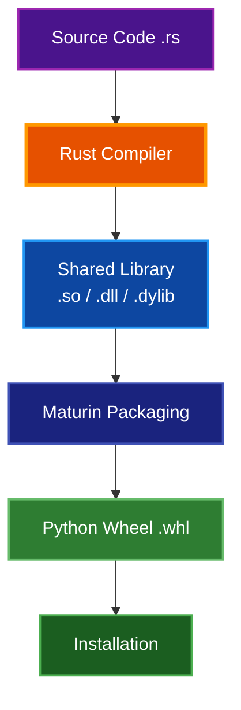

# Architecture Documentation

Comprehensive internal architecture documentation for par-term-emu-core-rust, a high-performance terminal emulator library written in Rust with Python bindings.

> **Last verified against v0.58.1 (commit `e1a914b`).** Struct layouts, module lists, and file counts drift quickly; where a section could go stale, prefer the runnable commands given over hard-coded numbers.

## Table of Contents

- [Overview](#overview)
- [Crate Layout](#crate-layout)
- [Core Components](#core-components)
  - [1. Color](#1-color)
  - [2. Cell](#2-cell)
  - [3. Cursor](#3-cursor)
  - [4. Grid](#4-grid)
  - [5. Terminal](#5-terminal)
  - [6. Supporting Modules](#6-supporting-modules)
- [ANSI Sequence Processing](#ansi-sequence-processing)
- [Data Flow](#data-flow)
- [Python Bindings](#python-bindings)
- [Memory Management](#memory-management)
- [Performance Considerations](#performance-considerations)
- [Extension Points](#extension-points)
- [Testing Strategy](#testing-strategy)
- [Implemented Features](#implemented-features)
- [Future Enhancements](#future-enhancements)
- [Screenshot Module](#screenshot-module)
- [Dependencies](#dependencies)
- [Build Process](#build-process)
- [Continuous Integration](#continuous-integration)
- [Debugging](#debugging)
- [Contributing](#contributing)
- [References](#references)
- [Related Documentation](#related-documentation)

## Overview

par-term-emu-core-rust is a terminal emulator library written in Rust with Python bindings. It uses the VTE (Virtual Terminal Emulator) crate for ANSI sequence parsing and PyO3 for Python interoperability.

**Library Artifacts:**
- **Python Extension**: Built with Maturin, provides `par_term_emu_core_rust._native` module
- **Rust Libraries**: the root `rlib` (`par_term_emu_core_rust`) plus the `par-term-emu-core` and `par-mux` workspace members, each usable on its own (see [Crate Layout](#crate-layout))
- **Streaming Server Binary**: `par-term-streamer` - WebSocket-based terminal streaming server (optional, requires `streaming-bin` feature)
- **Multiplexer Daemon**: `par-mux` - tmux-control-mode terminal multiplexer over a local socket, built from the `par-mux` member with its `mux-bin` feature; the `par-mux attach` client additionally needs `attach` (see [MUX.md](MUX.md))

## Crate Layout

The repository is a Cargo workspace (ARC-007 O2). Three crates carry the code, and arrows point from a crate to what it depends on:


```mermaid
graph LR
    Root["par-term-emu-core-rust (root)<br/>src/: streaming/, python_bindings/, ffi.rs,<br/>prelude.rs, bin/streaming_server/<br/>re-exports the pre-split public paths"]
    Mux["par-mux<br/>crates/par-mux/<br/>src/mux/, bin/par_mux/"]
    Core["par-term-emu-core<br/>crates/par-term-emu-core/<br/>terminal/, grid/, pty_session/, graphics/,<br/>screenshot/, tmux_control.rs"]
    Derive["par-term-emu-derive<br/>derive/ (proc macros)"]

    Root --> Core
    Root -->|"optional, mux feature"| Mux
    Mux --> Core
    Root -->|"optional, python/streaming"| Derive

    classDef root fill:#0d47a1,stroke:#2196f3,stroke-width:2px,color:#ffffff
    classDef mux fill:#4a148c,stroke:#9c27b0,stroke-width:2px,color:#ffffff
    classDef core fill:#e65100,stroke:#ff9800,stroke-width:3px,color:#ffffff
    classDef neutral fill:#37474f,stroke:#78909c,stroke-width:2px,color:#ffffff
    class Root root
    class Mux mux
    class Core core
    class Derive neutral
```

- **`par-term-emu-core`** holds the terminal state machine, grid, PTY session, graphics protocols, screenshot renderer, and the tmux control-mode parser (`tmux_control.rs`). With no features it is the headless (`sim`) profile. Design and invariants: [crates/par-term-emu-core/DESIGN.md](../crates/par-term-emu-core/DESIGN.md).
- **`par-mux`** is the multiplexer library (feature `mux`), the `par-mux` daemon binary (feature `mux-bin`), and the attach client (feature `attach`). It depends on the core only and never on the root, so the daemon builds without Python or the streaming stack. Its integration suites live in `crates/par-mux/tests/`.
- **The root** keeps the streaming server, the PyO3 bindings, the C FFI, the curated `prelude` (`src/prelude.rs`), and the `par-term-streamer` binary. Its `src/lib.rs` re-exports the core's modules (and `par_mux::mux` as `mux` behind the `mux` feature), so every pre-split `par_term_emu_core_rust::…` path still resolves.
- `par-term-emu-core` and `par-mux` share the root's version, and each dependent pins them with `=X.Y.Z`. The derive crate versions independently (bump it only when the derive code changes; `make derive-version-check` gates the spec). Publishing to crates.io runs in dependency order: derive, then `par-term-emu-core`, then `par-mux`, then the root.

The member boundaries change how commands run: a root `cargo test` or `cargo clippy` covers only the root package. Use `-p par-term-emu-core` or `-p par-mux` for a member, or `make test-rust`, which runs all three.

## Core Components

### 1. Color

**Location:** `crates/par-term-emu-core/src/color.rs`

Represents colors in various formats:

- **Named Colors**: 16 basic ANSI colors (black, red, green, etc.)
- **Indexed Colors**: 256-color palette (0-255)
- **RGB Colors**: 24-bit true color (r, g, b)

All colors can be converted to RGB for rendering.

```rust
pub enum Color {
    Named(NamedColor),
    Indexed(u8),
    Rgb(u8, u8, u8),
}
```

### 2. Cell

**Location:** `crates/par-term-emu-core/src/cell.rs`

Represents a single character cell in the terminal grid. Each cell contains:

- A base character (Unicode)
- Combining characters (variation selectors, ZWJ, skin tone modifiers, etc.) for complete grapheme clusters
- Foreground color
- Background color
- Text attributes (bold, italic, underline, etc.)

```rust
pub struct Cell {
    pub c: char,                                  // #[doc(hidden)]
    pub(crate) combining: Option<Arc<Vec<char>>>, // None for the common no-marks case
    pub(crate) fg: PackedColor,                   // Color packed into a u32
    pub(crate) bg: PackedColor,
    pub(crate) underline_color: PackedOptionColor, // SGR 58/59; top bit = present
    pub flags: CellFlags,                         // #[doc(hidden)]
    pub width: u8,                                // #[doc(hidden)]; cached display width (1 or 2)
}
```

A cell is 40 bytes: colors are packed into `u32` words and combining marks spill to the heap only for cells that carry them. Read colors through the accessor methods, which unpack to `Color`. With the `serde` feature the cell serializes through a `CellSerde` mirror that keeps the pre-packing wire format, so par-mux persistence files and replay snapshots stay byte-compatible.

### 3. Cursor

**Location:** `crates/par-term-emu-core/src/cursor.rs`

Tracks the cursor state:

- Position (col, row)
- Visibility (shown/hidden)
- Style (DECSCUSR) - BlinkingBlock, SteadyBlock, BlinkingUnderline, SteadyUnderline, BlinkingBar, SteadyBar

Provides methods for cursor movement and positioning.

```rust
pub struct Cursor {
    pub col: usize,
    pub row: usize,
    pub visible: bool,
    pub style: CursorStyle,
}
```

### 4. Grid

**Location:** `crates/par-term-emu-core/src/grid/mod.rs`

Manages the 2D terminal buffer with modular organization:

**Submodules:**
- `edit.rs` - Line editing operations (insert, delete)
- `erase.rs` - Erase operations (line, display, scrollback)
- `export.rs` - Text and content export
- `rect.rs` - Rectangle operations (copy, fill)
- `scroll.rs` - Scrolling operations
- `snapshot.rs` - `GridSnapshot`, the capture/restore type for Instant Replay and par-mux persistence (re-exported by `terminal::replay_snapshot`, so the grid never depends on the terminal layer)
- `zone.rs` - Semantic zone tracking
- `tests.rs` - Grid unit tests

**Features:**
- Main screen buffer (cols × rows)
- Scrollback buffer (configurable size, one boxed row per line)
- Scrolling operations
- Cell access and manipulation
- Resize handling (visible screen only — scrollback lines keep their widths)
- Semantic zone tracking (Prompt, Command, Output)

**Resize Behavior:**
When terminal width changes, only the visible screen is reflowed; scrollback lines are never rebuilt:
- **Stored lines keep the width they scrolled off at** — a line scrolled off at 200 columns stays 200 cells wide after any resize, and each line's eviction drops one small allocation
- Renderers pad short lines to the current width when drawing history
- Wrap flags of stored lines are preserved unchanged
- Resize cost is bounded by the viewport rows, never the scrollback depth (a resize with a full 10k-line scrollback no longer copies 180+ MB)
- Height-only changes resize the visible grid in place
- **The alternate screen is never reflowed** (`Grid::resize_without_reflow`): each row is truncated or padded in place and row positions are kept, matching xterm/tmux. A full-screen TUI (ratatui, curses) redraws the alt screen itself on SIGWINCH, often only the cells it believes changed — reflowing those cells would leave them unrepainted and the layout scrambled.

The grid uses a flat Vec for the visible screen and one boxed row per scrollback line. Every field is `pub(in crate::grid)`, so only the grid's own submodules touch them:

```rust
pub struct Grid {
    cols: usize,
    rows: usize,
    cells: Vec<Cell>,              // Row-major order (visible screen)
    scrollback_rows: Vec<Box<[Cell]>>, // Per-line scrollback, oldest first
    scrollback_lines: usize,       // Current scrollback count
    max_scrollback: usize,
    wrapped: Vec<bool>,            // Line wrap tracking
    scrollback_wrapped: Vec<bool>, // Scrollback wrap tracking
    zones: Vec<Zone>,              // Semantic zones
    evicted_zones: Vec<Zone>,      // Zones evicted from scrollback
    total_lines_scrolled: usize,   // Lifetime scroll count
    row_gen: Vec<u64>,             // Per-row damage generation (ENH-025)
    row_content_gen: Vec<u64>,     // Per-row content generation (ENH-038)
    scroll_ops: VecDeque<ScrollOp>, // Recorded scroll ops since the last invalidation (ENH-038)
    scroll_epoch: u64,             // Full-redraw floor (ENH-038)
    gen: u64,                      // Monotonic damage counter
}
```

**Damage tracking (ENH-025).** The grid owns damage. Every mutator stamps the rows it changes with a fresh value from the grid's monotonic `gen` counter (`row_gen`), so a mutation cannot forget to mark damage. A consumer remembers `damage_generation()` and asks `dirty_rows_since(gen)`, and independent consumers never clear each other's damage. The built-in consumer behind `get_dirty_rows`/`mark_clean` keeps its own generation in `Terminal.default_consumer_gen`. The C equivalents are described in [FFI_GUIDE.md](FFI_GUIDE.md#per-consumer-damage).

**Scroll-aware damage (ENH-038).** `row_gen` answers "this position needs a repaint". `row_content_gen` uses the same clock but is stamped only when a row's content may have changed and rotates with the cells on scroll, so rows that merely moved keep their generation. The bounded `scroll_ops` log feeds `scroll_damage_since`, which tells a renderer to blit the region by the net delta and redraw only the content-dirty rows; a consumer generation older than `scroll_epoch` (set by resize, snapshot restore, scrollback clear, or a screen switch) must redraw in full.

### 5. Terminal

**Location:** `crates/par-term-emu-core/src/terminal/mod.rs` (modular implementation)

The main terminal emulator that ties everything together, organized into submodules:

**Core Submodules:**
- `action.rs` - Trigger/macro action execution
- `apc_filter.rs` - Kitty TGP APC pre-filter (strips Kitty `ESC _ G ... ST` sequences before `vte` parsing)
- `benchmarks.rs` - `TerminalBenchmarks` service (ARC-021)
- `clipboard.rs` - Clipboard management (OSC 52)
- `colors.rs` - Color configuration and palette
- `compliance.rs` - VT conformance testing
- `event.rs` - Terminal events (Bell, Cwd, Shell)
- `event_broker.rs` - `EventBroker`: event and bell queues, observer registry, subscription filter, dispatch batches, queue cap (ARC-002)
- `event_fields.rs` - Structured field view of a `TerminalEvent` (ARC-114)
- `file_transfer.rs` - File transfer tracking
- `graphics.rs` - Unified graphics (Sixel, iTerm2, Kitty)
- `image.rs` - Inline image handling
- `macros.rs` - `MacroEngine` service: macro recording and playback (ARC-039)
- `metrics.rs` - Performance metrics and benchmarking
- `mouse_api.rs` - Mouse history methods (`record_mouse_event` and friends; ARC-108)
- `notification.rs` - Notification types from OSC sequences
- `observer.rs` - `TerminalObserver` trait and observer IDs (`crate::observer` re-exports it)
- `perform.rs` - VTE Perform trait implementation
- `progress.rs` - OSC 9;4 progress bar support
- `recording.rs` - Session recording
- `replay.rs` - Recording playback (Instant Replay)
- `replay_snapshot.rs` - Snapshot capture used by replay
- `screen.rs` - Screen buffer management
- `search.rs` - Text search functionality
- `semantic_snapshot.rs` - Semantic (prompt/command/output) snapshot capture
- `sequences/` - VTE sequence handlers, split into `csi/`, `osc/`, `dcs/` directories plus `esc.rs`
- `shell_integration.rs` - OSC 133 markers
- `snapshot_manager.rs` - Snapshot lifecycle
- `tests/` - Terminal unit tests, one file per topic
- `trigger.rs` - Regex pattern matching (`TriggerEngine` service, `TriggerState`)
- `write.rs` - Character writing logic

**Features:**
- Owns the grid and cursor
- Implements the VTE `Perform` trait for ANSI parsing
- Manages terminal state (colors, attributes)
- Handles all terminal operations

### 6. Supporting Modules

**Graphics Module** (`crates/par-term-emu-core/src/graphics/`)
- **Multi-protocol support**: Sixel, iTerm2 inline images (OSC 1337), Kitty graphics protocol
- **Unified architecture**: All protocols normalized to `TerminalGraphic` with RGBA pixel data
- **Submodules**:
  - `mod.rs` - Core graphics types and `GraphicsStore`
  - `animation.rs` - Animation control and frame management
  - `kitty/` - Kitty graphics protocol: `mod.rs` (`KittyParser`), `parse.rs` (chunk accumulation, key/value parsing, payload assembly), `dispatch.rs` (delete/placement/transmit/frame/animation commands), `decode.rs` (transmission media with filesystem safety gates, pixel formats)
  - `iterm.rs` - iTerm2 inline images implementation
  - `placeholder.rs` - Placeholder character management
  - `serialization.rs` - Graphics state serialization (snapshots/replay)
- **Features**: Image reuse, scrolling, animation, composition modes

**Mouse Handling** (`crates/par-term-emu-core/src/mouse.rs`, history methods in `crates/par-term-emu-core/src/terminal/mouse_api.rs`)
- Mouse event types and button tracking
- Mouse mode management (Normal, Button, Any)
- Mouse encoding formats (SGR, UTF-8, URXVT)
- Mouse history methods (`record_mouse_event` and friends) live in the terminal layer so `crates/par-term-emu-core/src/mouse.rs` stays a leaf of wire-format types (ARC-108)

**Shell Integration** (`crates/par-term-emu-core/src/shell_integration.rs`)
- OSC 133 prompt/command/output markers
- Command execution tracking
- Integration with modern shells (fish, zsh, bash)

**Sixel Graphics** (`crates/par-term-emu-core/src/sixel.rs`)
- Sixel image parser and decoder
- DEC VT340 compatible bitmap graphics
- Integrated with unified graphics system

**Triggers & Automation** (`crates/par-term-emu-core/src/terminal/trigger.rs`)
- Regex-based pattern matching on terminal output
- `TriggerRegistry` with `RegexSet` for efficient multi-pattern matching
- Trigger actions: Highlight, Notify, MarkLine, SetVariable (core-handled); RunCommand, PlaySound, SendText (frontend events)
- Capture group substitution (`$1`, `$2`, etc.) in action parameters
- Highlight overlays with optional expiry
- Character-to-grid-column mapping for accurate match positions with wide/combining characters

**Terminal Services** (`crates/par-term-emu-core/src/terminal/macros.rs`, `crates/par-term-emu-core/src/terminal/trigger.rs`, `crates/par-term-emu-core/src/terminal/benchmarks.rs`)
- `MacroEngine`, `TriggerEngine` and `TerminalBenchmarks` are stateless services over a borrowed `Terminal`; they replaced the `Terminal` forwarding methods removed in 0.55.0 and 0.56.0

**Multiplexer Daemon** (`crates/par-mux/src/mux/`, binary `crates/par-mux/src/bin/par_mux/`; the `par-mux` workspace member, re-exported by the root as `par_term_emu_core_rust::mux` behind the Rust `mux` feature)
- A tmux-control-mode multiplexer: owns PTY-backed panes in a workspace/session/window/pane tree (workspaces are the first-class level above sessions; a workspace dies with its last session) and serves the control protocol over a local socket, with an agent layer (state hook reports, scrape tier, session resume) on top
- Control plane:
  - `server/` - the socket server: `mod.rs` (accept loop, one writer thread per client), `protocol.rs` (bounded line reads, eviction-aware writes, reply classification), `client.rs` (per-client registration and the read-dispatch-reply loop), `broadcast.rs` (client fan-out, pane output wiring, layout/exit replays), `reap.rs` (dead-pane reaping), `endpoint.rs` (hook-only per-pane endpoints, ENH-039)
  - `command/` - control-command parsing (`parse_command` → `MuxCommand`), one file per verb group: `sessions.rs`, `windows.rs`, `panes.rs`, `keys.rs`, `buffers.rs`; the `mutates()` persistence rule lives in `mod.rs`
  - `dispatch/` - private per-command handlers, one file per group (`sessions.rs`, `windows.rs`, `panes.rs`, `buffers.rs`, `client.rs`) plus the shared post-dispatch tail in `mod.rs`; reached only through `server`
  - `emit.rs` (wire lines and `%`-notifications), `ids.rs` (`$N`/`@N`/`%N` ids and allocation), `ipc.rs` (Unix socket / Windows named pipe transport), `client.rs` (`MuxClient`), `discovery.rs` (registry of running daemons plus a stale-entry probe), `config.rs` (`<config dir>/par-mux/config.toml`)
- State:
  - `tree/` - the session/window/pane tree, the server's single source of truth: `mod.rs` (types and lookups), `lifecycle.rs` (creation, respawn, renames, session environment, kill cascades), `layout_ops.rs` (splits, selection, zoom, moves, resizes, and the `mutate_layout` choke point, ARC-090)
  - `layout.rs` (a window's binary split tree and its geometry), `pane.rs` (PTY panes + env contract), `persist.rs` (save format, quarantine, restore)
- Agent layer: `hooks/` (hook-report grammar: `mod.rs` dispatch, `report.rs`, `telemetry.rs`, `release.rs`), `scrape.rs` (fallback state tier, patterns in `patterns/*.toml`), `agent_resume.rs`, `foreground.rs` (process-table snapshot for `pane-info cmd=` and hook-claim liveness), `host_probe.rs` (30 s disk and git host-telemetry sweep, hardened git), `win_resume.rs` (Windows resume transport)
- `attach/` - the `par-mux attach` client (feature `attach`). Shared by both phases: `mod.rs`, `conn.rs` (`AttachConn`, the connection layer), `panels.rs` (overlay and sidebar composition, help rows, prompts, pickers), `targets.rs` (prefix/chord parsing and `-t` target resolution). Phase A (passthrough) keeps the host terminal as the emulator: `pump.rs`, `actions.rs`, `navigate.rs`, `status_row.rs`. Phase B (render mode) runs a core `Terminal` per pane and paints a ratatui buffer: `input.rs` (stdin parse and re-encode), `layout.rs` (client-side layout parser), `status.rs`, `tabs.rs`, and `render/`:
  - `render/mod.rs` - the pane renderer type and its frame-cadence damage diffing
  - `render/renderer.rs` - painting: per-pane grids, dividers, pane boxes, the modal overlay, the stdout flush sink
  - `render/modal.rs` - modal state machines: help, session/workspace pickers, prompts, context menus, resize mode, scroll viewport
  - `render/input_route.rs` - routes key runs through the prefix scanner and modal owners (`route_key`) and mouse reports through the overlay hit-testers
  - `render/navigate.rs` - management chords and window/session/workspace switches through the select-then-resync contract
  - `render/session.rs` - seeding a window, feeding pane bytes, host resize, status row and tab strip
  - `render/sidebar.rs` - the workspace side panel
- Full operational reference: [MUX.md](MUX.md); the D-numbered design decisions cited in its code comments are summarized in [MUX_DECISIONS.md](MUX_DECISIONS.md) (full plan: [par-mux.md](par-mux.md))

**Coprocess Management** (`crates/par-term-emu-core/src/coprocess.rs`)
- `CoprocessManager` for spawning and managing external processes alongside terminal sessions
- Terminal output piping to coprocess stdin (configurable per coprocess)
- Line-buffered stdout reading via background reader threads
- Thread-safe output buffering with `Arc<Mutex<>>` pattern
- Integrated with PTY reader thread for automatic output feeding

**Macros Module** (`crates/par-term-emu-core/src/macros.rs`)
- Macro recording and playback
- Screenshot triggers
- Event tracking

**Streaming Module** (`src/streaming/`)
- **WebSocket-based terminal streaming with Protocol Buffers**
- **Submodules**:
  - `mod.rs` - Core streaming types
  - `server/` - Axum-based WebSocket server with TLS support (ARC-003 split): `mod.rs` (`StreamingServer`), `http.rs` (WS accept config, API auth middleware, origin/CORS checks, security headers, route handlers), `listen.rs` (HTTP/HTTPS app and WebSocket-only accept loops), `ws_session.rs` (one client's handshake follow-up, session binding, and run loop), `messages.rs` (per-message client handlers, including subscription filtering), `sessions.rs` (admission counting, broadcasts, session resolution, idle reaper), `send.rs` (the `send_*` broadcast API embedders call, and `shutdown`)
  - `config.rs` - `StreamingConfig` and TLS/auth configuration (ARC-004)
  - `session.rs` - Multi-session lifecycle management and idle-session reaping (ARC-004); `build_connect_message()` assembles `Connected`
  - `rate_limit.rs` - Per-session input rate limiting (ARC-004)
  - `mux_factory.rs` - `MuxSessionFactory`: streaming sessions that mirror a par-mux pane (`--mux-socket`; needs `streaming` + `mux`)
  - `roster.rs` / `roster_watcher.rs` - par-mux agent roster: the `list-agents` parser, and a long-lived watcher that mirrors the roster to clients as `AgentRoster` snapshots plus `AgentStateChanged` deltas
  - `client.rs` - Client connection management
  - `protocol.rs` - Streaming protocol definitions (app-level `ServerMessage`, `ClientMessage`, `EventType`); count the variants in the enums rather than trusting a number here
  - `proto.rs` - Protocol Buffers wire format with optional zlib compression, plus the `ToWire`/`FromWire` field rules the `ProtoConvert` derive calls (see below)
  - `proto_golden_tests.rs` - Golden wire test: pins every message variant's encoded bytes and decoded value against `testdata/proto_golden.txt`
  - `terminal.pb.rs` - Generated protobuf types (from `proto/terminal.proto` via `build.rs`; do not edit by hand)
  - `py_convert.rs` - Python dict conversion helpers shared by the streaming bindings
  - `broadcaster.rs` - Multi-client broadcast support
  - `auth_hash.rs` - htpasswd-format hash verification (bcrypt, apr1/MD5-crypt, `{SHA}`) for HTTP Basic Auth (SEC-003)
  - `error.rs` - Streaming-specific errors
- **App-to-wire conversions (ARC-006)**: the message-level conversions between `protocol.rs` types and the generated protobuf types are derived with `#[derive(par_term_emu_derive::ProtoConvert)]` (macro in `derive/src/proto_convert.rs`). Every field value passes through `ToWire`/`FromWire` in `proto.rs`, keyed on the app and wire field types. Each type pair is listed explicitly, so a missing pair fails to compile instead of silently narrowing; fields with a specific rule (a clamp, a presence check) use `#[proto(with = ..)]`. The golden test fails on any byte-level change. Regenerate it only for an intended wire change: `PROTO_GOLDEN_UPDATE=1 cargo test --lib --no-default-features --features pyo3/auto-initialize,streaming proto_golden`
- **Features**: Real-time terminal sharing, multiplexing, binary protocol with compression, mouse/focus/paste forwarding, selection/clipboard sync, shell integration events (with cursor_line positioning), per-client event subscription filtering, badge change streaming, per-session client limits, input rate limiting, session metrics, terminal size validation, dead session reaping
- **Protocol Buffers**: Generated from `proto/terminal.proto` via `build.rs`
- **Standalone server binary** (`src/bin/streaming_server/`, requires `streaming-bin`): `main.rs` (entry point), `cli.rs` (arg parsing/env overrides), `frontend_download.rs` (release-asset download + extraction), `bootstrap.rs` (PTY/terminal wiring and session bootstrap), `theme.rs` (theme file loading)

**Root-crate embedding surfaces** (`src/`)
- `ffi.rs` - C-compatible embedding API (feature `ffi`): `#[repr(C)]` types and `extern "C"` functions for creating, querying, and observing terminals from Swift, Kotlin/JNI, C/C++; tests in `ffi_tests.rs`. The header is generated by cbindgen (`make ffi-header`) and drift-gated in `checkall` (see [FFI_GUIDE.md](FFI_GUIDE.md))
- `prelude.rs` - The curated, stable tier of the public Rust API (ARC-005): `use par_term_emu_core_rust::prelude::*;`

**Utility Modules** (`crates/par-term-emu-core/src/`)
- `keyboard.rs` - Shared key-event encoder (xterm legacy, kitty level 1, modifyOtherKeys, macOS Option-key modes) behind the FFI `ptec_terminal_encode_key*` functions and Python `Terminal.encode_key`
- `ansi_utils.rs` - ANSI sequence parsing and generation helpers
- `terminal/observer.rs` - Rust `TerminalObserver` trait for push-based event delivery; callbacks fire after each `process()` and `resize()` call with no internal locks held. Lives in the terminal layer (its types are Terminal dispatch state); `crate::observer` remains a re-export (ARC-108)
- `unicode_width_config.rs` - Configurable character width: Unicode version selection for width tables and East Asian Ambiguous width treatment
- `unicode_normalization_config.rs` - Configurable Unicode normalization (NFC/NFD/NFKC/NFKD) applied to PTY text before cell storage, keeping search and cursor movement consistent
- `grapheme.rs` - Grapheme cluster utilities for Unicode handling
  - Variation selector detection (U+FE0E text style, U+FE0F emoji style)
  - Zero Width Joiner (ZWJ) detection for emoji sequences
  - Skin tone modifier detection (U+1F3FB-U+1F3FF Fitzpatrick types)
  - Regional indicator detection for flag emoji (U+1F1E6-U+1F1FF)
  - Combining mark detection for diacritics and accents
  - Wide grapheme detection for proper terminal cell width calculation
- `color_utils.rs` - Advanced color manipulation and conversion utilities
  - Minimum contrast adjustment (iTerm2-compatible)
  - Perceived brightness calculation (NTSC formula)
  - Color space conversions (RGB, HSL, HSV)
  - WCAG contrast ratio calculations
  - Bold brightening support for enhanced readability
  - Parametric interpolation for brightness adjustment
  - Preserves color hue while adjusting brightness
- `text_utils.rs` - Text processing and Unicode handling
  - Word boundary detection with configurable word characters
  - Default word characters: `"/-+\\~_."` (iTerm2-compatible)
  - `DEFAULT_WORD_CHARS` constant for word selection
  - `is_word_char()`, `get_word_at()`, `select_word()`, `select_semantic_region()` functions
  - Shared helpers relocated here from their former call sites (ARC-009): `unix_millis()`, `cells_to_text()`, `html_escape()`
- `html_export.rs` - HTML export functionality for terminal content
  - Complete HTML document generation with embedded styles
  - Scrollback buffer export support
  - Inline CSS for terminal styling
  - Color preservation (foreground, background, attributes)
  - Monospace font stack: Monaco, Menlo, Ubuntu Mono, Consolas, monospace
- `debug.rs` - Debug utilities and logging helpers with formatted output macros
- `conformance_level.rs` - VT terminal conformance level support
  - VT100/VT220/VT320/VT420/VT520 level definitions
  - Feature compatibility management
- `tmux_control.rs` - Tmux control protocol support
  - Control mode protocol parsing (`tmux -C`)
  - Asynchronous notification handling
  - Pane output management

**PTY Support**
- `pty_session/` - PTY session management with portable-pty, split by concern (ARC-003): `mod.rs` (`PtySession`), `reader.rs` (the output reader thread), `io.rs` (output callbacks, input writes, the cloneable input handle mux uses, resize, SIGWINCH), `lifecycle.rs` (environment, spawn, process state, teardown), `query.rs` (terminal access, text export, screenshots, geometry), `updates.rs` (update generation counter and its waiters), `coprocess.rs` (forwarding to `CoprocessManager`)
- `pty_error.rs` - PTY-specific error types
- `badge.rs` - iTerm2 OSC 1337 SetBadgeFormat parsing and badge format evaluation

`PtySession` owns:

- A `parking_lot::RwLock` (wrapped in `Arc<RwLock<Terminal>>`) for all terminal state (migrated from `Mutex` in ARC-009 to let concurrent readers — e.g. Python API queries — proceed without blocking each other). `parking_lot` is used for performance and to eliminate lock poisoning risk. Writers (the PTY reader thread calling `term.process_deferred(..)`, resize, etc.) still take the lock exclusively via `.write()`; readers use `.read()`. New Rust code should prefer the closure accessors `with_terminal` / `with_terminal_mut`, which release the guard when the closure returns. `terminal()` hands out an owned `Arc` for long-lived subscribers. Never hold a guard across a slow operation or a call into Python.
- A `portable_pty::PtyPair` and child process handle.
- A background reader thread that:
  - Reads from the PTY master.
  - Feeds bytes into the `Terminal` via `term.process_deferred(..)` while holding the terminal's write lock, then delivers the returned observer batch after releasing it.
  - Writes device-query responses (DA/DSR/DECRQM/etc.) back to the child via the shared writer.
- An `Arc<AtomicBool>` `running` flag that reflects the session’s view of whether the child is still alive.

Separately, `PtySession` also holds a `parking_lot::Mutex` around the PTY writer, the output callback, and the coprocess manager — those remain plain mutexes since they don't benefit from read/write splitting.

`running` is deliberately a **best-effort** indicator:

- It is set to `true` when a child is successfully spawned.
- It is set to `false` when:
  - EOF is observed on the PTY reader (reader thread).
  - `try_wait()` observes an exited child.
  - `wait()` completes.
  - `kill()` is called.
- There may be a short window where the OS still considers the process live even though `running == false`, or vice versa (between a process exit and the reader thread seeing EOF). Callers that need precise exit status should use `try_wait()`/`wait()` instead of relying solely on `is_running()`.

**As of ARC-001, `Terminal` is no longer one flat ~150-field struct.** It is decomposed into cohesive sub-structs, each grouping the fields for one feature area. Most are `pub(crate) struct` definitions in `crates/par-term-emu-core/src/terminal/mod.rs`; four live elsewhere or are declared differently: `EventBroker` (`terminal/event_broker.rs`), `TriggerState` (`terminal/trigger.rs`), `MacroState` (`terminal/macros.rs`), and `GraphicsState` (a `pub struct` in `mod.rs`). `Terminal` itself holds a handful of "hot path" fields directly (grid, cursor, the VTE parser) plus one field per sub-struct. Abridged, in feature groups rather than declaration order:

```rust
pub struct Terminal {
    // Hot-path fields kept directly on Terminal (accessed on every write)
    grid: Grid,
    alt_grid: Grid,
    alt_screen_active: bool,
    cursor: Cursor,
    alt_cursor: Cursor,
    attrs: TextAttributes,              // Current SGR pen: fg/bg/underline color + CellFlags (ARC-002)
    tab_stops: Vec<bool>,
    response_buffer: Vec<u8>,
    parser: vte::Parser,
    osc_scratch: Vec<u8>,               // Reused by the incremental OSC guard (SEC-003)
    pending_wrap: bool,
    pixel_width: usize,
    pixel_height: usize,
    host: HostConfig,                   // Embedder configuration carried whole across RIS (ARC-100)
    conformance_level: ConformanceLevel,
    warning_bell_volume: u8,
    margin_bell_volume: u8,
    default_consumer_gen: u64,          // Damage generation seen by the built-in get_dirty_rows/mark_clean consumer
    selection: Option<Selection>,

    // One field per feature sub-struct (ARC-001)
    saved_state: SavedCursorState,       // DECSC/DECRC saved cursor + SGR colors/flags
    title_state: TitleState,             // Title, title stack, answerback string
    sync_state: SyncState,               // Synchronized updates (DEC 2026)
    shell_state: ShellState,             // Shell integration, host/user, depth
    margins: MarginState,                // DECSTBM/DECSLRM scroll + margins
    modes: TerminalModes,                // DECSET/DECRST-style mode flags
    keyboard_state: KeyboardState,       // Kitty keyboard protocol flags/stacks
    hyperlink_state: HyperlinkState,     // OSC 8 hyperlinks map + IDs
    graphics: GraphicsState,             // Unified graphics store + Sixel/iTerm2/Kitty state
    dcs_state: DcsState,                 // Sixel parser + DCS buffer
    clipboard_state: ClipboardState,     // OSC 52 clipboard content + history
    theme: ColorThemeState,              // OSC-queryable colors + rendering prefs
    notifications_state: NotificationState, // OSC 9/777 notifications + config
    progress_state: ProgressBellState,   // OSC 9;4 progress bar + bell counter
    security_state: SecurityFlagsState,  // OSC 7 acceptance + insecure-sequence disable
    tmux: TmuxState,                     // Tmux control-protocol parser
    events: EventBroker,                 // Event/bell queues, observers, subscription filter (event_broker.rs)
    bookmarks_state: BookmarksState,     // Bookmarks + next ID
    profiling: ProfilingState,           // Performance metrics + profiling
    mouse_history: MouseHistoryState,    // Mouse event/position history
    rendering: RenderingState,           // Rendering hints + damage regions
    search: SearchState,                 // Regex search matches
    inline_image_state: InlineImageState, // Inline image storage
    clipboard_sync: ClipboardSyncState,  // OSC 52 clipboard-sync events/history
    command_history_state: CommandHistoryState, // Command/CWD execution history
    recording_state: RecordingState,     // Session recording
    macros: MacroState,                  // Macro library + playback
    unicode_state: UnicodeConfigState,   // Width config + normalization form
    badge_state: BadgeState,             // OSC 1337 badge format + session vars
    triggers: TriggerState,              // Trigger registry + highlights
    charset_state: CharsetState,         // G0/G1 charset designations

    // Kitty APC pre-filter (vte 0.15 doesn't expose APC payloads to `Perform`)
    apc_filter_state: ApcFilterState,
    apc_buffer: Vec<u8>,
    apc_passthrough: Vec<u8>,
    kitty_parser: KittyParser,
}
```

Each sub-struct carries a doc comment explaining what it groups and why; the `Terminal` struct definition in `mod.rs` is the authoritative field list. This decomposition is a pure reorganization — field access from within `crates/par-term-emu-core/src/terminal/` goes through the sub-struct (e.g. `self.margins.scroll_region_top`), but it does not change the Python-facing API.

Three pieces go further than state grouping (ARC-002):

- **`EventBroker`** (`crates/par-term-emu-core/src/terminal/event_broker.rs`) owns the terminal event queue, the bell queue, the observer registry, the `poll_subscribed_events` subscription filter, the zone and observer ID counters, dispatch-batch extraction, and queue capping. `Terminal` owns one broker and delegates to it, and production code publishes through `EventBroker::push` rather than touching the queue. The queue is capped at `MAX_TERMINAL_EVENTS` (10,000) unpolled events, evicting already-dispatched events first.
- **`TextAttributes`** is the current SGR pen (foreground, background, underline color, and `CellFlags`) as one `Copy` sub-struct, so the SGR and DECRQSS handlers take the pen instead of the whole terminal.
- **Capability-scoped handlers.** Most `sequences/` handler families are free functions that take only the sub-structs, grid, or broker they touch instead of `&mut Terminal`. Examples: XTPUSHCOLORS/XTPOPCOLORS/XTREPORTCOLORS take `&mut ColorThemeState`, ICH/DCH and DECSERA take the `Grid`, ANSI SM/RM take `TerminalModes` + `EventBroker`, SGR (`handle_csi_style`) takes `TextAttributes`, `KeyboardState`, and `ColorThemeState`, OSC 9;4 takes `ProgressBellState`, OSC 1337 SetUserVar takes `BadgeState` + `EventBroker`, and the DCS Sixel command takes `DcsState`. Device-query replies go to `response_buffer`, passed as `&mut Vec<u8>`. List the current free functions with `grep -rn '^pub(crate) fn ' crates/par-term-emu-core/src/terminal/sequences/ --exclude=tests.rs`; a handler that still needs `&mut Terminal` is an indented `impl Terminal` method in the same files.

**Deferred observer delivery.** `process()` and `resize()` end by delivering queued events to observers before they return. A caller that holds an exclusive lock around the terminal must not run observer callbacks under it, so `process_deferred()` and `resize_deferred()` do the same work and instead return an `ObserverDispatchBatch`, which the caller delivers with `batch.deliver()` after releasing the lock. `PtySession` uses this in its reader thread (`pty_session/reader.rs`) and its resize path (`pty_session/io.rs`), as does the streaming server's `MuxSessionFactory`. A resize that reflows zones off the scrollback floor delivers their `ZoneScrolledOut` events the same way.

## ANSI Sequence Processing

The terminal uses the VTE crate for parsing ANSI escape sequences:


```mermaid
graph LR
    A[Input bytes]
    B[VTE Parser]
    C[Perform callbacks]
    D[Terminal state updates]

    A --> B
    B --> C
    C --> D

    classDef external fill:#4a148c,stroke:#9c27b0,stroke-width:2px,color:#ffffff
    classDef primary fill:#e65100,stroke:#ff9800,stroke-width:3px,color:#ffffff
    classDef info fill:#0d47a1,stroke:#2196f3,stroke-width:2px,color:#ffffff
    classDef active fill:#1b5e20,stroke:#4caf50,stroke-width:2px,color:#ffffff
    class A external
    class B primary
    class C info
    class D active
```

The `Terminal` struct implements the `Perform` trait with these methods:

- `print(char)`: Handle printable characters
- `execute(byte)`: Handle C0 control codes (newline, tab, etc.)
- `csi_dispatch()`: Handle CSI sequences (cursor movement, colors, etc.)
- `osc_dispatch()`: Handle OSC sequences (terminal title, etc.)
- `esc_dispatch()`: Handle ESC sequences (charset selection, etc.)
- `dcs_hook()`, `dcs_put()`, `dcs_unhook()`: Handle DCS sequences (Sixel graphics, etc.)

## Data Flow


```mermaid
graph TD
    A[Python Code / Rust embedder / C FFI caller]
    B[PyO3 Bindings<br/>src/python_bindings/]
    C[Terminal::process<br/>crates/par-term-emu-core/src/terminal/mod.rs]
    K[Kitty APC Pre-filter<br/>crates/par-term-emu-core/src/terminal/apc_filter.rs]
    D[VTE Parser]
    E[Perform Trait Methods<br/>crates/par-term-emu-core/src/terminal/sequences/]
    F[Grid/Cursor Updates<br/>crates/par-term-emu-core/src/grid/mod.rs, crates/par-term-emu-core/src/cursor.rs]
    G[State Changes]
    H[Python API queries<br/>src/python_bindings/]
    O[Observer callbacks<br/>crates/par-term-emu-core/src/terminal/observer.rs]
    S[Streaming server<br/>src/streaming/]
    X[C FFI consumers<br/>src/ffi.rs]

    A --> B
    B --> C
    C --> K
    K --> D
    D --> E
    E --> F
    F --> G
    G --> H
    H --> A
    G --> O
    G --> S
    G --> X

    classDef external fill:#4a148c,stroke:#9c27b0,stroke-width:2px,color:#ffffff
    classDef info fill:#0d47a1,stroke:#2196f3,stroke-width:2px,color:#ffffff
    classDef primary fill:#e65100,stroke:#ff9800,stroke-width:3px,color:#ffffff
    classDef database fill:#1a237e,stroke:#3f51b5,stroke-width:2px,color:#ffffff
    classDef neutral fill:#37474f,stroke:#78909c,stroke-width:2px,color:#ffffff
    classDef active fill:#1b5e20,stroke:#4caf50,stroke-width:2px,color:#ffffff
    classDef success fill:#2e7d32,stroke:#66bb6a,stroke-width:2px,color:#ffffff
    classDef filter fill:#880e4f,stroke:#c2185b,stroke-width:2px,color:#ffffff
    class A,S external
    class B,H info
    class C primary
    class D database
    class E,O,X neutral
    class F active
    class G success
    class K filter
```

The Kitty APC pre-filter runs before the `vte` parser because `vte` does not expose APC payloads to `Perform` (see ANSI Sequence Processing). Observer callbacks (`crates/par-term-emu-core/src/terminal/observer.rs`), the streaming server (`src/streaming/`), and the C FFI surface (`src/ffi.rs`) all consume terminal state changes in addition to the Python API queries. Observers are fed from the `EventBroker` queue at the end of `process()`/`resize()`, or by the caller after it releases its lock when it used the `_deferred` variants. The grid and terminal live in the `par-term-emu-core` member; the PyO3 bindings, streaming server, and FFI live in the root crate.

## Python Bindings

The Python bindings live in the root crate under `src/python_bindings/`. `src/python_bindings/terminal/` is a directory containing `mod.rs` (the `PyTerminal` struct, constructor, and any methods not yet split out) plus themed `*_api.rs` files, each a separate `#[pymethods] impl PyTerminal` block covering one feature area (`ls src/python_bindings/terminal/` for the current set):

- `badge_api.rs` - OSC 1337 badge format + semantic snapshots
- `bookmark_api.rs` - Bookmarks
- `clipboard_api.rs` - OSC 52 clipboard + clipboard history/slots
- `color_api.rs` - Color/appearance getters-setters, rendering hints
- `file_transfer_api.rs` - Kitty/iTerm2 file transfer tracking
- `image_api.rs` - Inline image queries
- `input_api.rs` - Key-input encoding (`encode_key`) through the shared `keyboard.rs` encoder (ENH-028)
- `metrics_api.rs` - Performance metrics, frame timings
- `mouse_api.rs` - Mouse event recording and history
- `notification_api.rs` - OSC 9/777 notifications
- `recording_api.rs` - Session recording export (asciicast/JSON)
- `scrollback_api.rs` - Scrollback export and stats
- `search_api.rs` - Text/regex search, content detection
- `selection_api.rs` - Selection management
- `shell_integration_api.rs` - OSC 133 shell integration extended features
- `text_api.rs` - Text extraction utilities
- `trigger_api.rs` - Trigger registration and matching

The split is a relocation out of a single monolithic `#[pymethods]` block; all methods resolve on the same `Terminal` Python class because Rust allows multiple `impl` blocks for one type (pyo3's `multiple-pymethods` feature).

Other submodules:
- `pty.rs` - `PyPtyTerminal` (`inner: PtySession`), the PTY-backed class. It reaches the `Terminal` through `PtySession`'s `Arc<RwLock<Terminal>>` rather than owning it directly.
- `common.rs` - Shared Terminal-access macros (ARC-003/QA-001): a family of `impl_terminal_*!` macros (getters, setters, color setters, Sixel/Kitty graphics, recording, search/selection, exports, screenshots, and more) generate identical methods for both `PyTerminal` and `PyPtyTerminal` from one body, via the `TerminalAccess` trait that abstracts over "owns a `Terminal` directly" vs. "reaches it through an `Arc<RwLock<Terminal>>`". This is why most methods appear on both classes without duplicated code. List the families with `grep -n 'macro_rules! impl_terminal_' src/python_bindings/common.rs`.
- `screenshot_config.rs` - `PyScreenshotConfig` (`ScreenshotConfig`), a reusable options object for `screenshot_config()`/`screenshot_to_file_config()` so callers don't repeat 16+ keyword args per call (QA-005, added 0.43.0)
- `types/` - Data types directory (formerly a single ~4,000-line `types.rs`, now split by domain: `clipboard.rs`, `color.rs`, `graphics.rs`, `metrics.rs`, `mouse.rs`, `notification.rs`, `recording.rs`, `screen.rs`, `selection.rs`, `shell.rs`, `trigger.rs`, with `mod.rs` re-exporting every `Py*` type so `python_bindings::types::PyX` and the crate-level re-exports are unchanged). Holds PyAttributes, PyScreenSnapshot, PyShellIntegration, PyGraphic, PyTmuxNotification, PySearchMatch, PyDetectedItem, PySelection, PyScrollbackStats, PyBookmark, PyPerformanceMetrics, and many more.
- `enums.rs` - Enum types (PyCursorStyle, PyUnderlineStyle, PySelectionMode, PyWidthConfig, and more)
- `observer.rs` - `PyCallbackObserver`/`PyQueueObserver`, bridging the Rust `TerminalObserver` trait to Python callables/`asyncio.Queue`
- `streaming.rs` - `StreamingServer`/`StreamingConfig` Python bindings (requires the `streaming` feature)
- `conversions.rs` - Type conversions and parsing utilities
- `color_utils.rs` - Python bindings for color manipulation utilities:
  - Perceived brightness and luminance calculations
  - Contrast adjustment (iTerm2-compatible)
  - Color space conversions (RGB ↔ HSL)
  - WCAG compliance testing (AA/AAA)
  - Color mixing, lightening, darkening
  - Saturation and hue adjustment
  - Complementary color generation
  - Hex color conversion
  - ANSI 256-color conversion

The main Python module is defined in `src/lib.rs`, which exports the `_native` module. Class/function counts drift with every feature addition — get the current numbers with:

```bash
grep -c 'm.add_class::<' src/lib.rs      # registered classes
grep -c 'm.add_function' src/lib.rs      # registered free functions
```

```rust
#[pyclass(name = "Terminal")]
pub struct PyTerminal {
    pub(crate) inner: crate::terminal::Terminal,
}
```

All public methods are wrapped with `#[pymethods]` and provide:

- Type conversion (Rust ↔ Python)
- Error handling (Result → PyResult)
- Pythonic API design

## Memory Management

- **Rust Side**: Owned data structures with automatic memory management
- **Python Side**: Python objects wrapping Rust data
- **Zero-copy**: Where possible, data is referenced rather than copied
- **Scrollback**: Limited by `max_scrollback` to prevent unbounded growth

## Performance Considerations

### Efficient Grid Storage

- Flat Vec for cache-friendly access
- Row-major order for sequential line access
- Minimal allocations during normal operation

### ANSI Parsing

- VTE crate provides fast, zero-allocation parsing
- State machine approach for streaming input

### Python Boundary

- Minimize Python/Rust crossings
- Batch operations where possible
- Return references instead of copying when safe

## Extension Points

### Adding New ANSI Sequences

1. Add handler in the appropriate sequence module:
   - CSI sequences: `crates/par-term-emu-core/src/terminal/sequences/csi/` (directory: `mod.rs` plus per-topic files `color_stack.rs`, `cursor.rs`, `edit.rs`, `erase.rs`, `keyboard.rs`, `mode.rs`, `report.rs`, `scroll.rs`, `style.rs`, `window.rs`)
   - OSC sequences: `crates/par-term-emu-core/src/terminal/sequences/osc/` (directory: `mod.rs` plus per-topic files `clipboard.rs`, `color.rs`, `image.rs`, `iterm.rs`, `notify.rs`, `shell.rs`, `title.rs`)
   - ESC sequences: `crates/par-term-emu-core/src/terminal/sequences/esc.rs`
   - DCS sequences: `crates/par-term-emu-core/src/terminal/sequences/dcs/` (directory: `mod.rs` plus `query.rs`, `sixel.rs`)
2. Prefer a capability-scoped free function that takes only the sub-structs it touches (see [Terminal](#5-terminal)); update grid/cursor state as needed
3. Add tests (each sequence directory has a sibling `tests.rs`)

### New Color Formats

1. Add variant to `Color` enum in `crates/par-term-emu-core/src/color.rs`
2. Implement `to_rgb()` conversion
3. Update color handling in `crates/par-term-emu-core/src/terminal/sequences/csi/style.rs`

### Additional Cell Attributes

1. Add flag to `CellFlags` in `crates/par-term-emu-core/src/cell.rs`
2. Update SGR handling in `crates/par-term-emu-core/src/terminal/sequences/csi/style.rs`
3. Expose in Python API if needed (in `src/python_bindings/`)

## Testing Strategy

### Test Coverage

**Running the test suites:**
- **Rust tests:** run `make test-rust`. It runs every package and feature set: the root (with `ffi`, `python-test`, `serde`, the mux re-export, and the mux-backed streaming tests), the full `par-mux` member suite, and the `par-term-emu-core` member suites. A root `cargo test` alone runs only the root package, so it no longer covers the core's unit tests.
- **Python tests:** run `uv run pytest tests/` (or `make test-python`) to see the current count.
  - PTY tests excluded in CI (hang in automated environments)
  - All tests run locally for comprehensive validation
- Test counts grow with every PR; run the commands above rather than relying on a number printed here.

### Rust Tests

- **Unit tests** in each module, increasingly in sibling `tests.rs` files or `tests/` directories (for example `crates/par-term-emu-core/src/terminal/tests/`)
- **Integration tests**:
  - Root `tests/`: emoji and grapheme handling (`test_skin_tone_modifiers.rs`, `test_zwj_sequences.rs`, `test_flag_emoji.rs`), streaming (`test_streaming.rs`, `test_ws_smoke.rs`), triggers, coprocesses, FFI allocation, and `mux_feature_isolation.rs`
  - `crates/par-mux/tests/`: the par-mux daemon, CLI, attach client, hooks, reattach, and restart suites (PTY-spawning, run serialized)
- **Golden wire test**: `src/streaming/proto_golden_tests.rs` (see [Streaming Module](#6-supporting-modules))
- **Property-based tests** for invariants (using `proptest` crate)
- **PyO3 configuration:** root tests run with `--no-default-features --features pyo3/auto-initialize`
  - The `extension-module` feature prevents linking during tests
  - Must use `auto-initialize` feature for test environment
  - Single member test: `cargo test -p par-term-emu-core --lib test_name`

### Python Tests

- **API contract tests** validating Python bindings behavior
- **Example-based tests** covering common use cases
- **Edge case handling** for error conditions and boundary cases
- **Timeout protection:** 5-second default per test (configured in pyproject.toml)
- **PTY tests** excluded in CI (hang in automated environments), run locally by `make test` and `make test-pty`:
  - `test_pty.py`, `test_ioctl_size.py`, `test_pty_screenshot.py`
  - `test_pty_resize_sigwinch.py`, `test_nested_shell_resize.py`

## Implemented Features

The terminal emulator includes comprehensive VT100/VT220/VT320/VT420 compatibility with modern protocol support:

### Core Features

1. **Alt Screen Buffer** - Fully implemented with modes 47, 1047, 1049
2. **Tab Stops** - Complete tab stop management (HTS, TBC, CHT, CBT)
3. **Line Wrapping** - Auto-wrap mode (DECAWM) with delayed wrap
4. **Hyperlinks** - Full OSC 8 hyperlink support with deduplication
5. **Sixel Graphics** - Complete Sixel implementation with half-block rendering
6. **Wide Character Support** - Unicode, emoji, and CJK characters

### Modern Protocols

1. **Mouse Tracking** - All modes (Normal, Button, Any) and encodings (SGR, UTF-8, URXVT)
2. **Bracketed Paste** - Mode 2004 for safe paste handling
3. **Synchronized Updates** - Mode 2026 for flicker-free rendering
4. **Kitty Keyboard Protocol** - Enhanced keyboard reporting with flag management
5. **Shell Integration** - OSC 133 for prompt/command/output markers
6. **Clipboard** - OSC 52 read/write with security controls

### VT Compatibility

- VT100/VT220/VT320 - Complete compatibility
- VT420 - Rectangle operations (DECFRA, DECCRA, DECSERA)
- Left/Right Margins - DECLRMM/DECSLRM support
- Cursor Styles - DECSCUSR with all styles
- Device Queries - DA, DSR, CPR, DECRQM

## Future Enhancements

### Potential Improvements

1. **Performance**: SIMD optimizations for bulk cell operations
2. **Character Sets**: G2/G3 designation and single shifts (G0/G1 with SO/SI and the DEC line-drawing set are implemented in `CharsetState`; low priority, since UTF-8 handles most cases)

### API Enhancements

1. **Cell Iterators**: Efficient row/region iteration without copying
2. **Async Support**: Fully async Python API for non-blocking operation

Already delivered from earlier versions of this list: Unicode normalization (`unicode_normalization_config.rs`), a change-detection API for incremental rendering (per-consumer damage via `dirty_rows_since` and scroll-aware `scroll_damage_since`, see [Grid](#4-grid)), and push-based event callbacks (the Rust `TerminalObserver` trait, with `PyCallbackObserver`/`PyQueueObserver` for Python and an `asyncio.Queue` bridge).

## Screenshot Module

### Architecture (`crates/par-term-emu-core/src/screenshot/`)

The screenshot module provides high-quality rendering of terminal content to various image formats. It lives in the `par-term-emu-core` member behind the `screenshot` feature, which the `python` and `python-test` features enable. Since 0.54.0 it is opt-in for the headless `sim` profile: render-capable `sim` embedders add `features = ["sim", "screenshot"]`.

#### Entry Points

The API is a set of free functions in `screenshot/mod.rs`; the `Terminal::screenshot*` forwarding methods were removed in 0.55.0.

- `render_terminal(&Terminal, ScreenshotConfig, scrollback_offset)` / `save_terminal(..)` - render a terminal's grid, cursor, and inline graphics to bytes or a file, applying the terminal's theme colors to the config
- `render_grid(..)` / `save_grid(..)` - the lower-level form over a bare `Grid`, optional cursor, and graphics slice

`PtySession` forwards to `render_terminal` under a read lock (`pty_session/query.rs`). The Python `screenshot`, `screenshot_to_file`, `screenshot_config`, and `screenshot_to_file_config` methods come from the `impl_terminal_screenshot_methods!` macro in `src/python_bindings/common.rs`, so both `Terminal` and `PtyTerminal` share them. SVG output carries the text only, without the cursor or graphics.

#### Components

1. **Configuration** (`config.rs`)
   - **Purpose**: Screenshot configuration and format options
   - **Features**:
     - Image format selection (PNG, JPEG, BMP, SVG)
     - Font size and padding configuration
     - Sixel rendering mode options (Disabled, Pixels, HalfBlocks)
     - Quality settings for lossy formats (1-100 for JPEG)
     - Font multipliers (line height, character width)
     - Scrollback buffer inclusion
     - Cursor rendering options
     - Theme colors (link, bold, cursor guide, badge, match, selection)
     - Bold brightening and custom bold color support
     - Minimum contrast adjustment (0.0-1.0, iTerm2-compatible)
     - Faint text alpha control (dim strength, 0.0-1.0)

2. **Font Cache** (`font_cache.rs`)
   - **Library**: Swash (pure Rust font library)
   - **Purpose**: Loads and caches font glyphs for efficient rendering
   - **Features**:
     - Embedded JetBrains Mono font (no external dependencies)
     - Embedded Noto Emoji font for emoji support
     - Automatic emoji font fallback (Apple Color Emoji, Segoe UI Emoji)
     - Color emoji rendering with RGBA output
     - Glyph caching for performance (by character, size, bold, italic)
     - Glyph-by-ID rendering for shaped text
   - **Embedded Fonts**: `JetBrainsMono-Regular.ttf`, `NotoEmoji-Regular.ttf`

3. **Text Shaper** (`shaper.rs`)
   - **Library**: Swash (pure Rust text shaping and font rendering)
   - **Purpose**: Handles complex text rendering with ligatures and multi-codepoint sequences
   - **Features**:
     - Flag emoji support via Regional Indicator ligatures (🇺🇸 🇨🇳 🇯🇵)
     - Multi-font support (Regular, Emoji, CJK) with automatic selection
     - Positioned glyph output with advance/offset information
     - Font run segmentation for mixed-script text
     - Pure Rust implementation (no C dependencies, no HarfBuzz)

4. **Renderer** (`renderer.rs`)
   - **Purpose**: Converts terminal grid to image pixels
   - **Features**:
     - Hybrid rendering: character-based (fast) + line-based shaping (complex emoji)
     - Regional Indicator detection for automatic text shaping
     - Full text attribute support (bold, italic, underline styles, colors)
     - Cursor rendering (block, underline, bar styles)
     - Sixel graphics rendering (pixels and half-block modes)
     - Alpha blending for smooth text and graphics
     - Pure Rust rendering pipeline (no C dependencies)

5. **Utilities** (`utils.rs`)
   - **Purpose**: Helper functions for screenshot rendering
   - **Features**:
     - Color conversion and blending utilities
     - Text measurement and positioning helpers
     - Regional Indicator detection for emoji flags

6. **Error Handling** (`error.rs`)
   - **Purpose**: Screenshot-specific error types
   - **Features**:
     - Comprehensive error variants for font, rendering, and encoding failures
     - Integration with standard error handling

7. **Format Support** (`formats/`)
   - **Modules**: `mod.rs`, `png.rs`, `jpeg.rs`, `bmp.rs`, `svg.rs`
   - **Raster formats**: PNG, JPEG, BMP (via `image` crate)
   - **Vector format**: SVG (custom implementation for scalable text)

### Font Rendering Pipeline


```mermaid
graph TD
    A[Character Input]
    B[FontCache::get_glyph]
    C{Check cache?}
    D[Return cached glyph]
    E[Emoji detection<br/>Unicode range]
    F[Try main font<br/>JetBrains Mono]
    G{Empty or emoji?}
    H[Try emoji font]
    I[Swash rendering<br/>- Set pixel size<br/>- Render glyph<br/>- Handle color emoji]
    J[Cache result]
    K[Return CachedGlyph]

    A --> B
    B --> C
    C -->|Hit| D
    C -->|Miss| E
    E --> F
    F --> G
    G -->|Yes| H
    G -->|No| I
    H --> I
    I --> J
    J --> K

    classDef external fill:#4a148c,stroke:#9c27b0,stroke-width:2px,color:#ffffff
    classDef primary fill:#e65100,stroke:#ff9800,stroke-width:3px,color:#ffffff
    classDef warning fill:#ff6f00,stroke:#ffa726,stroke-width:2px,color:#ffffff
    classDef active fill:#1b5e20,stroke:#4caf50,stroke-width:2px,color:#ffffff
    classDef neutral fill:#37474f,stroke:#78909c,stroke-width:2px,color:#ffffff
    classDef info fill:#0d47a1,stroke:#2196f3,stroke-width:2px,color:#ffffff
    classDef database fill:#1a237e,stroke:#3f51b5,stroke-width:2px,color:#ffffff
    classDef filter fill:#880e4f,stroke:#c2185b,stroke-width:2px,color:#ffffff
    class A external
    class B primary
    class C,G warning
    class D,K active
    class E,J neutral
    class F info
    class H database
    class I filter
```

### Bitmap Font Handling

Color emoji fonts (like NotoColorEmoji) are bitmap-only fonts that:
- Cannot be scaled to arbitrary sizes
- Have fixed sizes (typically 32, 64, 72, 96, 109, 128, 136 pixels)
- Require special handling during size selection

The implementation automatically:
1. Attempts requested size
2. Falls back to closest available fixed size
3. Renders with swash's color emoji support
4. Outputs RGBA for consistent image processing

### Rendering Pipeline


```mermaid
graph TD
    A["screenshot::render_terminal"]
    B[Create Renderer<br/>FontCache + TextShaper + Config]
    C[For each grid row]
    D{Contains Regional<br/>Indicators?}
    E[Swash text shaping<br/>- Extract line text<br/>- Shape with TextShaper<br/>- Render positioned glyphs]
    F[Fast character rendering<br/>For each cell:<br/>- Resolve colors<br/>- Render background<br/>- Render character<br/>- Render decorations]
    G[Render Sixel graphics]
    H[Render cursor<br/>if visible]
    I[Encode to format<br/>PNG/JPEG/BMP/SVG]
    J[Return bytes]

    A --> B
    B --> C
    C --> D
    D -->|Yes| E
    D -->|No| F
    E --> G
    F --> G
    G --> H
    H --> I
    I --> J

    classDef primary fill:#e65100,stroke:#ff9800,stroke-width:3px,color:#ffffff
    classDef info fill:#0d47a1,stroke:#2196f3,stroke-width:2px,color:#ffffff
    classDef neutral fill:#37474f,stroke:#78909c,stroke-width:2px,color:#ffffff
    classDef warning fill:#ff6f00,stroke:#ffa726,stroke-width:2px,color:#ffffff
    classDef filter fill:#880e4f,stroke:#c2185b,stroke-width:2px,color:#ffffff
    classDef database fill:#1a237e,stroke:#3f51b5,stroke-width:2px,color:#ffffff
    classDef external fill:#4a148c,stroke:#9c27b0,stroke-width:2px,color:#ffffff
    classDef success fill:#2e7d32,stroke:#66bb6a,stroke-width:2px,color:#ffffff
    classDef active fill:#1b5e20,stroke:#4caf50,stroke-width:2px,color:#ffffff
    class A primary
    class B,I info
    class C neutral
    class D warning
    class E filter
    class F database
    class G external
    class H success
    class J active
```

### Text Shaping Pipeline (Flag Emoji)


```mermaid
graph TD
    A[Line with Regional<br/>Indicators detected]
    B[Grid::row_text<br/>Extract line as string]
    C[TextShaper::shape_line]
    D[Split into font runs<br/>Regular/Emoji/CJK]
    E[For each run:<br/>- Select font<br/>- Create shape context<br/>- Shape with swash<br/>- Extract glyph IDs + positions]
    F[For each shaped glyph:<br/>- FontCache::get_glyph_by_id<br/>- Apply x_offset, y_offset<br/>- Render with alpha blending]
    G[Complete line rendered<br/>with proper ligatures]

    A --> B
    B --> C
    C --> D
    D --> E
    E --> F
    F --> G

    classDef warning fill:#ff6f00,stroke:#ffa726,stroke-width:2px,color:#ffffff
    classDef info fill:#0d47a1,stroke:#2196f3,stroke-width:2px,color:#ffffff
    classDef primary fill:#e65100,stroke:#ff9800,stroke-width:3px,color:#ffffff
    classDef database fill:#1a237e,stroke:#3f51b5,stroke-width:2px,color:#ffffff
    classDef filter fill:#880e4f,stroke:#c2185b,stroke-width:2px,color:#ffffff
    classDef external fill:#4a148c,stroke:#9c27b0,stroke-width:2px,color:#ffffff
    classDef active fill:#1b5e20,stroke:#4caf50,stroke-width:2px,color:#ffffff
    class A warning
    class B info
    class C primary
    class D database
    class E filter
    class F external
    class G active
```

## Dependencies

### Rust

The lists below cover the workspace as a whole. The terminal-side crates (`vte`, `unicode-width`, `portable-pty`, `regex`, `image`, `swash`) are dependencies of the `par-term-emu-core` member; the streaming and Python crates belong to the root; the multiplexer crates belong to `par-mux` (see [Crate Layout](#crate-layout)). Each crate's own `Cargo.toml` is authoritative.

**Core dependencies:**
- `pyo3` - Python bindings (optional, feature-gated; uses `multiple-pymethods` to allow the split `*_api.rs` impl blocks)
- `par-term-emu-derive` (path `derive/`) - Local proc-macro crate: `#[pyo3_get_all]` for the Python data classes (ARC-014) and `ProtoConvert` for the streaming conversions (ARC-006)
- `vte` - ANSI parser
- `unicode-width` - Character width calculation
- `portable-pty` - PTY support
- `base64` - Base64 encoding/decoding
- `bitflags` - Bit flag management
- `regex` - Regular expression support
- `serde` + `serde_json` + `serde_yaml_ng` - Serialization support

**Screenshot/rendering support:**
- `image` - Image encoding/decoding (PNG, JPEG, BMP)
- `swash` - Pure Rust font rendering and text shaping with color emoji support

**Streaming server dependencies (optional, feature-gated):**
- `tokio` - Async runtime with full features
- `tokio-tungstenite` - WebSocket support
- `axum` - Web framework with WebSocket support
- `tower-http` - HTTP middleware (fs, trace, cors)
- `futures-util` - Future utilities
- `uuid` - UUID generation with v4 and serde support
- `clap` - CLI parsing with derive feature (binary-only, via `streaming-bin`)
- `anyhow` - Error handling (binary-only, via `streaming-bin`)
- `tracing` + `tracing-subscriber` - Logging (binary-only, via `streaming-bin`)
- `reqwest` - HTTP client with rustls-tls, for frontend downloads (binary-only, via `streaming-bin`)
- `flate2` + `tar` - Archive extraction (tar is binary-only, via `streaming-bin`)
- `prost` + `prost-build` - Protocol Buffers (`prost-build` only via `regenerate-proto`)
- `rustls` + `tokio-rustls` - TLS support
- `axum-server` - TLS server support
- `bcrypt` + `md-5` + `sha1` - HTTP Basic Auth hash verification (SEC-003; replaced the unmaintained `rustls-pemfile` per RUSTSEC-2025-0134)
- `headers` - HTTP header types for auth
- `sysinfo` - System resource statistics for `SystemStats` events
- `subtle` + `zeroize` - Constant-time credential comparison and secret wiping
- `sha2` - Release-asset checksum verification (binary-only, via `streaming-bin`)

**Multiplexer dependencies (`par-mux` member, optional, feature-gated):**
- `interprocess` - Unix socket / Windows named pipe transport (`mux`)
- `toml` + `dirs` - Config file and per-user directories (`mux`)
- `nix` (Unix) and `widestring` + `windows-sys` (Windows) - Platform process and terminal calls (`mux`)
- `clap` - Daemon CLI (`mux-bin`)
- `crossterm` + `ratatui` - The attach client's input and render-mode painting (`attach`)

**Development dependencies:**
- `pyo3` (features: auto-initialize) - Python test support
- `proptest` - Property-based testing framework
- `tempfile` - Temporary file management for tests

**Platform-specific:**
- `libc` - Unix system calls (Unix only)

> **Note:** See each crate's `Cargo.toml` for current version requirements

### Python

**Build and development tools:**
- `maturin` - Build system for PyO3 bindings
- `uv` - Fast Python package installer and resolver (recommended)

**Runtime dependencies:**
- `pillow` - Image processing for sixel examples and screenshot features

**Testing:**
- `pytest` - Testing framework
- `pytest-timeout` - Test timeout protection (5-second default)
- `pytest-asyncio` - Async test support
- `pytest-cov` - Coverage reporting

**Code quality:**
- `ruff` - Linting and formatting
- `pyright` - Static type checking
- `pre-commit` - Git hook management

**Python version requirements:** 3.12, 3.13, 3.14

> **Note:** See `pyproject.toml` for current version requirements

> **Note**: This is a core library. For a full-featured TUI application built on this library, see the sister project [par-term-emu-tui-rust](https://github.com/paulrobello/par-term-emu-tui-rust) ([PyPI](https://pypi.org/project/par-term-emu-tui-rust/)), which uses the Textual framework.

## Build Process

### PyO3 Feature Configuration

The project uses conditional PyO3 feature compilation to support both production builds and testing:

**Features:** the authoritative list is `[features]` in [`Cargo.toml`](../Cargo.toml), and [RUST_USAGE.md](RUST_USAGE.md#feature-flags) describes each feature. The PyO3 split this section is about:

- `python` (default) enables `pyo3` with `pyo3/extension-module`, which wheels need: the extension must not link libpython.
- `python-test` enables the same bindings with `pyo3/auto-initialize` instead, so `cargo test` can link a real interpreter.
- The `pyo3` dev-dependency also enables `auto-initialize` for Rust tests.
- Binary targets are gated by `required-features`: `par-term-streamer` (root) needs `streaming-bin`, and `par-mux` (in `crates/par-mux`) needs the member's `mux-bin`.

**Build commands:**
- **Development build:** `make dev` (runs `maturin develop --release` with the `extension-module` feature; `pyproject.toml` adds the streaming features)
- **Running Rust tests:** `make test-rust` (all packages; see [Testing Strategy](#testing-strategy))
- **Production wheels:** `maturin build --release --locked` (uses default features with `extension-module`)
- **Streaming server binary:** `cargo build --release --bin par-term-streamer --no-default-features --features streaming-bin`
- **Multiplexer daemon:** `cargo build -p par-mux --bin par-mux --features mux-bin` (add `attach` for the attach client; install recipes in [MUX.md](MUX.md))

> **Warning:** Never run `cargo build` directly for PyO3 modules. Always use `maturin develop` or the `make dev` target to ensure proper Python integration.

**Why these features:**
- **`extension-module`:** Tells linker NOT to link against libpython (correct for Python extensions)
- **`auto-initialize`:** Initializes Python interpreter for Rust tests (required for `cargo test`)
- **Default feature:** Enables `extension-module` automatically for production builds
- **Test override:** Uses `--no-default-features` to disable `extension-module` during testing

### Build Flow


```mermaid
graph TD
    A[Source Code .rs]
    B[Rust Compiler]
    C[Shared Library<br/>.so / .dll / .dylib]
    D[Maturin Packaging]
    E[Python Wheel .whl]
    F[Installation]

    A --> B
    B --> C
    C --> D
    D --> E
    E --> F

    classDef external fill:#4a148c,stroke:#9c27b0,stroke-width:2px,color:#ffffff
    classDef primary fill:#e65100,stroke:#ff9800,stroke-width:3px,color:#ffffff
    classDef info fill:#0d47a1,stroke:#2196f3,stroke-width:2px,color:#ffffff
    classDef database fill:#1a237e,stroke:#3f51b5,stroke-width:2px,color:#ffffff
    classDef success fill:#2e7d32,stroke:#66bb6a,stroke-width:2px,color:#ffffff
    classDef active fill:#1b5e20,stroke:#4caf50,stroke-width:2px,color:#ffffff
    class A external
    class B primary
    class C info
    class D database
    class E success
    class F active
```

## Continuous Integration

### CI/CD Pipeline

The project uses GitHub Actions. `.github/workflows/ci.yml` is authoritative; this is a summary. It triggers on `pull_request` and `workflow_dispatch`. Pull requests run a reduced matrix (Ubuntu, Python 3.14), and a manual dispatch runs the full matrix (Ubuntu, macOS, Windows, Python 3.12 to 3.14). Every job depends on Version Check, which runs first.

#### Version Check Job
- **Platform:** Ubuntu only
- **Purpose:** Verifies the version string is consistent across `Cargo.toml`, `pyproject.toml`, and `python/par_term_emu_core_rust/__init__.py`, that the root's derive dependency spec matches `derive/Cargo.toml` (ARC-008), and that the `par-term-emu-core` member stays in lockstep with the root version (ARC-007).

#### Test Job
- **Steps:**
  1. Build the extension (`maturin develop --release --locked`) and check the `_native.pyi` stub ships and type-checks
  2. Root Rust tests with `ffi`, root streaming tests, and the `python-test` binding tests
  3. `par-term-emu-core` member tests (`cargo test -p par-term-emu-core ...`)
  4. Python tests: `pytest tests/ -v --timeout=5 --timeout-method=thread`, with the PTY family excluded (`test_pty.py`, `test_ioctl_size.py`, `test_pty_resize_sigwinch.py`, `test_nested_shell_resize.py`, `test_pty_screenshot.py`) because hosted runners hang on PTY I/O

#### Mux Test Job
- **Purpose:** The multiplexer suites, run serialized with `cargo nextest --profile ci`
- **Steps:** build the headless `sim` profile and assert it pulls no runtime, auth, or protobuf dependencies; run the full `par-mux` member suite with `attach`; run the root with the mux re-export on; run the `par-term-emu-core` member under the mux feature set; run the mux-backed streaming tests (`streaming::mux_factory`)

#### Lint Job
- **Platform:** Ubuntu only, Python 3.14
- **Checks:**
  - Rust formatting: `cargo fmt --all -- --check`
  - Rust clippy, with `-D warnings`, on the root (all features including `attach`) and separately on each member (`-p par-term-emu-core`, `-p par-mux`) because a root run lints only the root package
  - Python: `ruff format --check`, `ruff check`, `pyright`
  - Doc links and anchors: `lychee --offline --include-fragments` over `docs/*.md` and the top-level guides (same scope as `make doc-links-check`)

#### Build Job and web_term Drift Gate (dispatch only)
- **Build wheels:** `maturin build --release --locked` on Ubuntu, macOS, and Windows with Python 3.14; wheels are uploaded as artifacts
- **web_term/ drift gate:** rebuilds `web-terminal-frontend/` and fails when the committed `web_term/` static export differs

### Running Checks Locally

```bash
# The fast local gate: non-mutating (fmt --check, clippy, ruff, pyright via lint-check),
# plus the doc, FFI header, mux-docs, version, and stub gates and the full test suites
make checkall

# Auto-fixers
make lint          # Rust clippy --fix + cargo fmt
make lint-python   # ruff format + ruff check --fix + pyright

# Individual suites
make test-rust     # All Rust packages and feature sets
make test-python   # Python tests (rebuilds first)
```

### Pre-commit Hooks

The project uses `pre-commit` hooks to enforce quality standards (`.pre-commit-config.yaml` is authoritative). Install with:

```bash
make pre-commit-install  # or: uv run pre-commit install
```

**Hooks enabled:**
- Secret scanning (`gitleaks`)
- Trailing whitespace removal, end-of-file fixing, mixed line endings
- YAML/TOML syntax checking, large file and merge conflict detection
- Rust formatting (`cargo fmt --all`)
- Rust linting (`cargo clippy`) on the root, the `par-term-emu-core` member, and the `par-mux` member
- Rust tests on the root (`cargo test --lib --no-default-features --features pyo3/auto-initialize,ffi`) and the core member (`cargo test -p par-term-emu-core --lib --features ffi`)
- Python formatting (`ruff format`)
- Python linting (`ruff check --fix`)
- Python type checking (`pyright`)

## Debugging

### Rust Side

Core diagnostics go through the `log` facade (target `LOG_TARGET` in `crates/par-term-emu-core/src/debug.rs`), so an embedder's own logger receives them. The optional file sink is controlled by `DEBUG_LEVEL` (0 or unset: off, 1: errors, 2: info, 3: debug, 4: trace) and writes `par_term_emu_core_rust_debug_rust_{pid}.log` to the system temp directory.

```bash
# Write core debug output to the temp-dir log file
DEBUG_LEVEL=3 cargo test -p par-term-emu-core --lib test_name

# Use rust-lldb/gdb
rust-lldb target/debug/test_binary
```

### Python Side

```python
# Inspect terminal state
print(repr(term))
print(term.content())
print(term.cursor_position())

# Check individual cells
for row in range(term.size()[1]):
    for col in range(term.size()[0]):
        char = term.get_char(col, row)
        print(f"({col},{row}): {char}")
```

## Contributing

When contributing, please:

1. Add tests for new features
2. Update documentation
3. Follow Rust style guidelines (`cargo fmt --all`)
4. Pass the lint gate (`make lint-check`, which runs clippy on the root and on each workspace member; a bare `cargo clippy` covers only the root package)
5. Ensure Python API remains intuitive

## References

- [VTE Crate Documentation](https://docs.rs/vte/) - ANSI parser library
- [PyO3 Guide](https://pyo3.rs/) - Rust-Python bindings
- [xterm Control Sequences](https://invisible-island.net/xterm/ctlseqs/ctlseqs.html) - Comprehensive reference
- [ANSI Escape Sequences](https://en.wikipedia.org/wiki/ANSI_escape_code) - Wikipedia overview
- [VT100 Reference](https://vt100.net/) - Historical VT100 documentation

## Related Documentation

- [VT_TECHNICAL_REFERENCE.md](VT_TECHNICAL_REFERENCE.md) - Complete VT feature support matrix and implementation details
- [ADVANCED_FEATURES.md](ADVANCED_FEATURES.md) - Advanced features guide
- [CONFIG_REFERENCE.md](CONFIG_REFERENCE.md) - Terminal configuration reference
- [BUILDING.md](BUILDING.md) - Build and installation instructions
- [SECURITY.md](SECURITY.md) - Security considerations for PTY usage
- [MUX.md](MUX.md) - par-mux multiplexer daemon operational reference
- [README.md](../README.md) - Project overview and API reference
