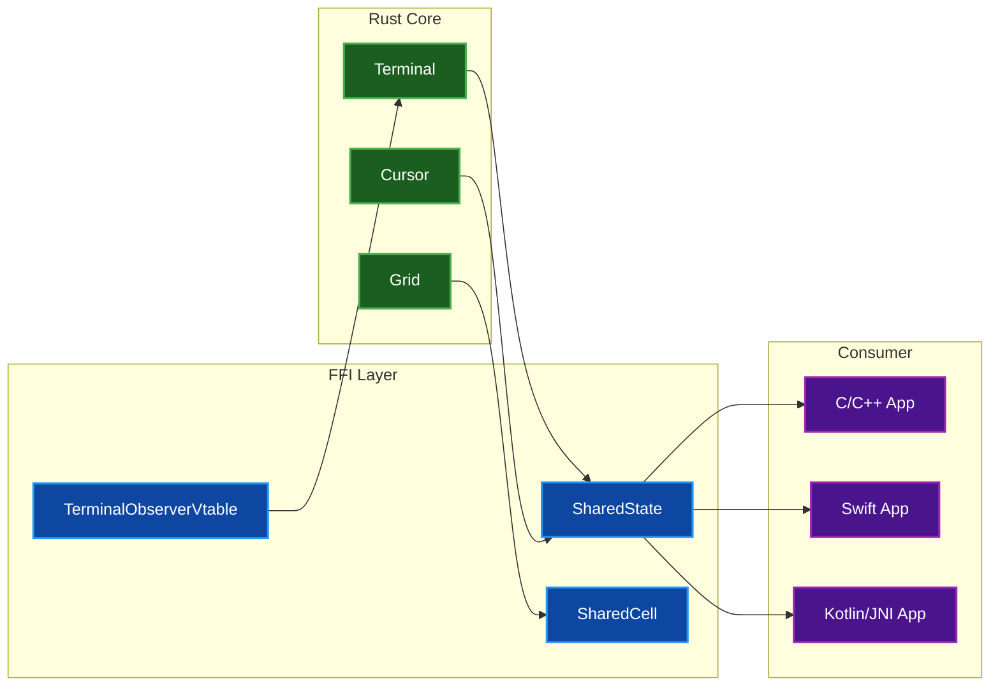
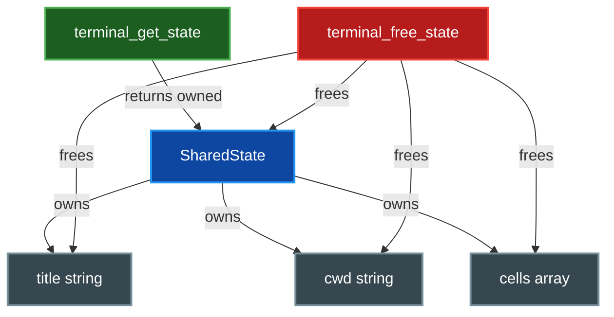

# FFI Guide

This guide explains how to embed the terminal emulator in C, C++, Swift, Kotlin/JNI, or other languages that support C FFI using the provided `#[repr(C)]` types and `extern "C"` functions.

## Table of Contents
- [Overview](#overview)
- [Building for C/C++](#building-for-cc)
- [FFI Types](#ffi-types)
  - [SharedCell](#sharedcell)
  - [SharedState](#sharedstate)
  - [TerminalObserverVtable](#terminalobservervtable)
- [Memory Management Contract](#memory-management-contract)
- [API Reference](#api-reference)
  - [Snapshot Functions](#snapshot-functions)
  - [Observer Functions](#observer-functions)
- [Examples](#examples)
  - [C Code: Terminal Snapshot](#c-code-terminal-snapshot)
  - [C Code: Observer Pattern](#c-code-observer-pattern)
- [Related Documentation](#related-documentation)

## Overview

The library provides a C-compatible API for accessing terminal state via `#[repr(C)]` types and `extern "C"` functions. This enables embedding in applications written in languages other than Rust or Python.

### Key Components

- **`SharedCell`** - A single terminal cell containing character data, colors, and attributes
- **`SharedState`** - A complete terminal snapshot with grid, cursor, and metadata
- **`TerminalObserverVtable`** - Function-pointer table for receiving terminal events

All types use `#[repr(C)]` layout for stable ABI across language boundaries.

### Architecture



## Building for C/C++

Use the `rust-only` feature flag to exclude Python bindings:

```bash
# Build static library (.a) + dynamic library (.so/.dylib/.dll)
cargo build --release --no-default-features --features rust-only

# Output: target/release/libpar_term_emu_core_rust.a
#         target/release/libpar_term_emu_core_rust.so (Linux)
#         target/release/libpar_term_emu_core_rust.dylib (macOS)
#         target/release/par_term_emu_core_rust.dll (Windows)
```

Link against the appropriate library in your C/C++ project and include the generated C header (or manually declare the FFI types).

## FFI Types

### SharedCell

A single terminal cell in a C-compatible layout.

```c
typedef struct SharedCell {
    uint8_t text[4];      // UTF-8 encoded character bytes (up to 4 bytes)
    uint8_t text_len;     // Number of valid bytes in text
    uint8_t fg_r;         // Foreground color - red component
    uint8_t fg_g;         // Foreground color - green component
    uint8_t fg_b;         // Foreground color - blue component
    uint8_t bg_r;         // Background color - red component
    uint8_t bg_g;         // Background color - green component
    uint8_t bg_b;         // Background color - blue component
    uint16_t attrs;       // Bitfield of cell attributes
    uint8_t width;        // Display width of the character (1 or 2)
} SharedCell;
```

**Field Details:**

| Field | Type | Description |
|-------|------|-------------|
| `text` | `uint8_t[4]` | UTF-8 bytes of the base character (up to 4 bytes for any Unicode scalar) |
| `text_len` | `uint8_t` | Number of valid bytes in `text` array |
| `fg_r`, `fg_g`, `fg_b` | `uint8_t` | RGB foreground color components (0-255) |
| `bg_r`, `bg_g`, `bg_b` | `uint8_t` | RGB background color components (0-255) |
| `attrs` | `uint16_t` | Bitfield of VT text attributes (see Cell Attributes) |
| `width` | `uint8_t` | Display width: 1 for normal characters, 2 for wide characters (CJK, emoji) |

**Cell Attributes (`attrs` bitfield):**

| Bit | Mask | Constant | Description |
|-----|------|----------|-------------|
| 0 | `0x0001` | `BOLD` | Bold text |
| 1 | `0x0002` | `DIM` | Dim/faint text |
| 2 | `0x0004` | `ITALIC` | Italic text |
| 3 | `0x0008` | `UNDERLINE` | Underlined text |
| 4 | `0x0010` | `BLINK` | Blinking text |
| 5 | `0x0020` | `REVERSE` | Reverse video (swap fg/bg) |
| 6 | `0x0040` | `HIDDEN` | Hidden/concealed text |
| 7 | `0x0080` | `STRIKETHROUGH` | Strikethrough text |
| 8 | `0x0100` | `OVERLINE` | Overlined text |
| 9 | `0x0200` | `GUARDED` | Protected cell (not erased by clear) |
| 10 | `0x0400` | `WIDE_CHAR` | Wide character (2 columns) |
| 11 | `0x0800` | `WIDE_CHAR_SPACER` | Spacer cell following a wide character |

### SharedState

A complete, C-compatible snapshot of the terminal state.

```c
typedef struct SharedState {
    uint32_t cols;              // Number of columns in the grid
    uint32_t rows;              // Number of rows in the grid
    uint32_t cursor_col;        // Current cursor column (0-indexed)
    uint32_t cursor_row;        // Current cursor row (0-indexed)
    bool cursor_visible;        // Whether the cursor is visible
    bool alt_screen_active;     // Whether alternate screen buffer is active
    uint8_t mouse_mode;         // Mouse tracking mode
    char* title;                // Terminal title (NUL-terminated UTF-8, owned)
    uint32_t title_len;         // Length of title in bytes (excluding NUL)
    char* cwd;                  // Current working directory (NUL-terminated, owned), or NULL
    uint32_t cwd_len;           // Length of cwd in bytes, 0 if NULL
    SharedCell* cells;          // Array of cell_count cells (owned)
    uint32_t cell_count;        // Total cells (cols * rows)
    uint32_t scrollback_lines;  // Lines in scrollback buffer
    uint32_t total_lines;       // Total lines (visible + scrollback)
} SharedState;
```

**Field Details:**

| Field | Type | Description |
|-------|------|-------------|
| `cols` | `uint32_t` | Number of columns in the terminal grid |
| `rows` | `uint32_t` | Number of rows in the terminal grid |
| `cursor_col` | `uint32_t` | Current cursor column (0-indexed, leftmost is 0) |
| `cursor_row` | `uint32_t` | Current cursor row (0-indexed, topmost is 0) |
| `cursor_visible` | `bool` | Whether the cursor is currently visible |
| `alt_screen_active` | `bool` | Whether the alternate screen buffer is active |
| `mouse_mode` | `uint8_t` | Mouse tracking mode (see Mouse Mode Mapping) |
| `title` | `char*` | Terminal title as NUL-terminated UTF-8 string (owned) |
| `title_len` | `uint32_t` | Length of title string in bytes (not counting NUL) |
| `cwd` | `char*` | Current working directory (NUL-terminated, owned), or NULL |
| `cwd_len` | `uint32_t` | Length of cwd string in bytes, 0 if cwd is NULL |
| `cells` | `SharedCell*` | Pointer to array of `cell_count` cells (owned) |
| `cell_count` | `uint32_t` | Total number of cells (cols * rows) |
| `scrollback_lines` | `uint32_t` | Number of lines currently in the scrollback buffer |
| `total_lines` | `uint32_t` | Total lines (visible grid + scrollback) |

**Mouse Mode Mapping:**

| Value | Mode | Description |
|-------|------|-------------|
| 0 | Off | Mouse tracking disabled |
| 1 | X10 | X10 compatibility mode (button press only) |
| 2 | Normal | Normal mouse tracking (press/release) |
| 3 | ButtonEvent | Button event tracking |
| 4 | AnyEvent | Any event tracking (including motion) |

### TerminalObserverVtable

A C-compatible vtable for terminal event observation.

```c
typedef struct TerminalObserverVtable {
    void (*on_zone_event)(void* user_data, const char* event_json);
    void (*on_command_event)(void* user_data, const char* event_json);
    void (*on_environment_event)(void* user_data, const char* event_json);
    void (*on_screen_event)(void* user_data, const char* event_json);
    void (*on_event)(void* user_data, const char* event_json);
    void* user_data;
} TerminalObserverVtable;
```

**Callback Types:**

| Callback | Description |
|----------|-------------|
| `on_zone_event` | Called for zone lifecycle events (scroll regions, margins) |
| `on_command_event` | Called for command/shell integration events |
| `on_environment_event` | Called for environment change events (cwd, title) |
| `on_screen_event` | Called for screen content events (resize, clear) |
| `on_event` | Catch-all callback for ALL terminal events |

**Event Format:** Observer callbacks receive events as JSON-formatted debug strings (`format!("{:?}", event)`). Parse these strings to extract event data.

## Memory Management Contract

### Ownership Rules



1. **`SharedState` ownership**: When you call `terminal_get_state()`, you receive a heap-allocated `SharedState` that you **own**. You must free it by calling `terminal_free_state()`.

2. **Raw pointer lifetimes**: The `title`, `cwd`, and `cells` pointers inside `SharedState` are valid **only** while the `SharedState` exists. After calling `terminal_free_state()`, these pointers become invalid.

3. **String encoding**: All strings (`title`, `cwd`) are NUL-terminated UTF-8 (`*mut c_char`). Do not free them directly; they are freed automatically when `SharedState` is dropped.

4. **Cell array**: The `cells` pointer is an array of `cell_count` elements. Do not free it directly; it is freed automatically when `SharedState` is dropped.

5. **Observer vtables**: The `user_data` pointer in `TerminalObserverVtable` must remain valid for the lifetime of the observer registration. The library does not take ownership of `user_data`; you are responsible for its lifetime.

### Safety Requirements

> **⚠️ Warning:** Thread Safety Requirements

- **Thread safety**: Do not access a `Terminal` from multiple threads simultaneously without external synchronization. The FFI does not perform internal locking.

- **Snapshot consistency**: Only one `SharedState` should exist per `Terminal` at a time. Creating multiple snapshots concurrently may result in data races.

- **Pointer validity**: All function pointers in `TerminalObserverVtable` must be valid for the duration of the observer registration.

## API Reference

### Snapshot Functions

#### `terminal_get_state`

```c
SharedState* terminal_get_state(const Terminal* term);
```

Creates a snapshot of the terminal's current state.

**Parameters:**

| Parameter | Type | Description |
|-----------|------|-------------|
| `term` | `const Terminal*` | Pointer to a `Terminal` instance (must be non-null) |

**Returns:**
- Pointer to a heap-allocated `SharedState`, or `NULL` if `term` is null

**Ownership:** Caller must free the returned pointer with `terminal_free_state()`.

#### `terminal_free_state`

```c
void terminal_free_state(SharedState* state);
```

Frees a `SharedState` previously returned by `terminal_get_state()`.

**Parameters:**

| Parameter | Type | Description |
|-----------|------|-------------|
| `state` | `SharedState*` | Pointer to free (may be null; no-op if null) |

**Ownership:** `state` must not be used after this call. All internal pointers (`title`, `cwd`, `cells`) become invalid.

### Observer Functions

#### `terminal_add_observer`

```c
uint64_t terminal_add_observer(Terminal* term, TerminalObserverVtable vtable);
```

Registers an observer to receive terminal events.

**Parameters:**

| Parameter | Type | Description |
|-----------|------|-------------|
| `term` | `Terminal*` | Pointer to a `Terminal` instance (must be non-null, mutable) |
| `vtable` | `TerminalObserverVtable` | Function-pointer table with event callbacks |

**Returns:**
- Observer ID (use with `terminal_remove_observer`), or 0 on failure

**Safety:** The `vtable` (including `user_data`) must remain valid until the observer is removed.

#### `terminal_remove_observer`

```c
bool terminal_remove_observer(Terminal* term, uint64_t id);
```

Removes a previously registered observer.

**Parameters:**

| Parameter | Type | Description |
|-----------|------|-------------|
| `term` | `Terminal*` | Pointer to a `Terminal` instance (must be non-null, mutable) |
| `id` | `uint64_t` | Observer ID returned by `terminal_add_observer` |

**Returns:**
- `true` if the observer was found and removed, `false` otherwise

## Examples

### C Code: Terminal Snapshot

```c
#include <stdio.h>
#include <stdint.h>
#include <stdbool.h>

// Forward declarations (manually extracted from Rust FFI)
typedef struct Terminal Terminal;
typedef struct SharedState SharedState;
typedef struct SharedCell SharedCell;

extern SharedState* terminal_get_state(const Terminal* term);
extern void terminal_free_state(SharedState* state);

void print_terminal_state(const Terminal* term) {
    SharedState* state = terminal_get_state(term);
    if (!state) {
        fprintf(stderr, "Failed to get terminal state\n");
        return;
    }

    printf("Terminal: %u cols x %u rows\n", state->cols, state->rows);
    printf("Cursor: (%u, %u) visible=%d\n",
           state->cursor_col, state->cursor_row, state->cursor_visible);
    printf("Title: %s\n", state->title);
    printf("CWD: %s\n", state->cwd ? state->cwd : "(none)");
    printf("Alt screen: %d\n", state->alt_screen_active);
    printf("Mouse mode: %u\n", state->mouse_mode);
    printf("Scrollback: %u lines\n", state->scrollback_lines);
    printf("Total lines: %u\n", state->total_lines);

    // Access first cell (top-left corner)
    if (state->cell_count > 0) {
        SharedCell* cell = &state->cells[0];
        printf("First cell: char='%.*s' fg=(%d,%d,%d) bg=(%d,%d,%d) attrs=0x%04x width=%d\n",
               (int)cell->text_len, (char*)cell->text,
               cell->fg_r, cell->fg_g, cell->fg_b,
               cell->bg_r, cell->bg_g, cell->bg_b,
               cell->attrs, cell->width);
    }

    // Check specific attributes
    if (state->cell_count > 0) {
        SharedCell* cell = &state->cells[0];
        if (cell->attrs & 0x0001) printf("  - Bold\n");
        if (cell->attrs & 0x0004) printf("  - Italic\n");
        if (cell->attrs & 0x0008) printf("  - Underline\n");
    }

    terminal_free_state(state);
}
```

### C Code: Observer Pattern

```c
#include <stdio.h>
#include <stdint.h>
#include <stdlib.h>

// Forward declarations
typedef struct Terminal Terminal;

typedef struct TerminalObserverVtable {
    void (*on_zone_event)(void* user_data, const char* event_json);
    void (*on_command_event)(void* user_data, const char* event_json);
    void (*on_environment_event)(void* user_data, const char* event_json);
    void (*on_screen_event)(void* user_data, const char* event_json);
    void (*on_event)(void* user_data, const char* event_json);
    void* user_data;
} TerminalObserverVtable;

extern uint64_t terminal_add_observer(Terminal* term, TerminalObserverVtable vtable);
extern bool terminal_remove_observer(Terminal* term, uint64_t id);

// Callback implementation
void on_event_callback(void* user_data, const char* event_json) {
    const char* prefix = (const char*)user_data;
    printf("%s: %s\n", prefix, event_json);
}

// Register observer with all callbacks
uint64_t register_full_observer(Terminal* term) {
    TerminalObserverVtable vtable = {
        .on_zone_event = on_event_callback,
        .on_command_event = on_event_callback,
        .on_environment_event = on_event_callback,
        .on_screen_event = on_event_callback,
        .on_event = on_event_callback,
        .user_data = (void*)"TerminalEvent"
    };
    return terminal_add_observer(term, vtable);
}

// Register observer with only specific callbacks
uint64_t register_minimal_observer(Terminal* term) {
    TerminalObserverVtable vtable = {
        .on_zone_event = NULL,
        .on_command_event = NULL,
        .on_environment_event = on_event_callback,
        .on_screen_event = NULL,
        .on_event = NULL,
        .user_data = (void*)"EnvChange"
    };
    return terminal_add_observer(term, vtable);
}

// Example lifecycle
void observer_example(Terminal* term) {
    uint64_t observer_id = register_full_observer(term);
    if (observer_id == 0) {
        fprintf(stderr, "Failed to register observer\n");
        return;
    }
    printf("Registered observer with ID: %llu\n", (unsigned long long)observer_id);

    // ... terminal operations ...

    // Cleanup
    bool removed = terminal_remove_observer(term, observer_id);
    printf("Observer removed: %s\n", removed ? "yes" : "no");
}
```

## Related Documentation

- [API Reference](API_REFERENCE.md) - Complete Python API documentation
- [Architecture](ARCHITECTURE.md) - Internal system design and data flow
- [Security Guide](SECURITY.md) - PTY security considerations for FFI consumers
- [Cell Implementation](../src/cell.rs) - Source code for `CellBitflags` and cell attributes
- [FFI Implementation](../src/ffi.rs) - Source code for FFI types and functions
