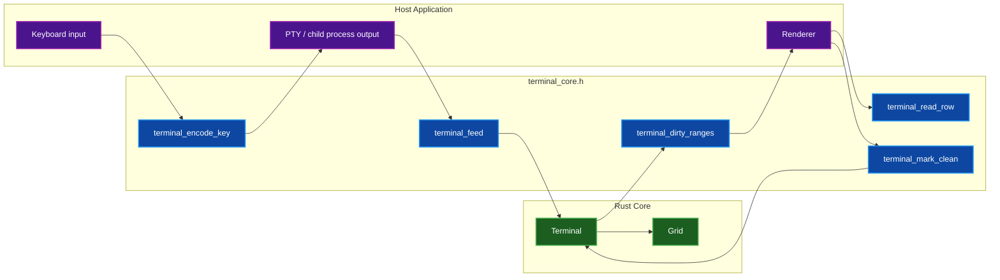
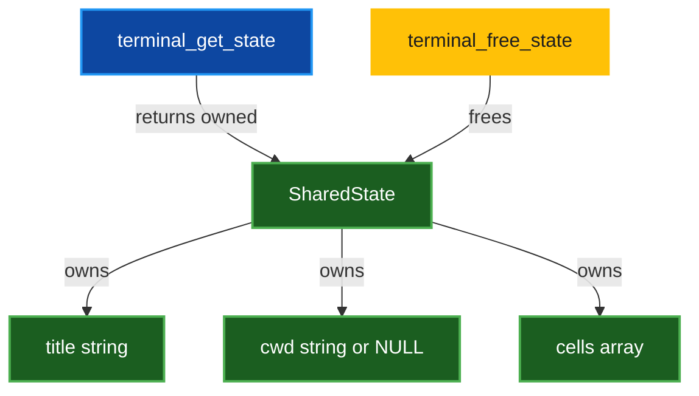

# FFI Guide

How to embed the terminal emulator from C, C++, Swift, or any language with a C FFI. The surface lives in [`include/terminal_core.h`](../include/terminal_core.h), generated by cbindgen from `src/ffi.rs` (ENH-027): the Rust types are `#[repr(C)]`, and the `TERM_*` constants plus `_Static_assert` layout pins live in the hand-written companion `terminal_core_layout.h` that the generated header includes — so header and library cannot drift apart silently (`make ffi-header-check` and `make ffi-surface-check` gate it in `checkall`).

- **Embedding functions** — `terminal_abi_version`, `terminal_create`/`terminal_free`, `terminal_feed`, `terminal_resize`, `terminal_dirty_ranges`/`terminal_mark_clean`, `terminal_damage_generation`/`terminal_dirty_ranges_since`, `terminal_read_row`/`terminal_read_scrollback_row`/`terminal_scrollback_count`/`terminal_scrollback_total_scrolled`, `terminal_get_cursor`/`terminal_get_modes`, `terminal_encode_key`/`terminal_encode_key_ex`
- **Snapshot functions** — `terminal_get_state`/`terminal_free_state`
- **Observer functions** — `terminal_add_observer`/`terminal_remove_observer`
- **Types** — `Terminal` (opaque), `SharedCell`, `SharedState`, `TermRowRange`, `TermCursorState`, `TermModeState`, `TermKeyEvent`, `TermKeyOptions`, `TerminalObserverVtable`

## Table of Contents
- [Overview](#overview)
- [Building](#building)
- [Lifecycle](#lifecycle)
- [Render Loop](#render-loop)
- [Scrollback](#scrollback)
- [Cursor and Modes](#cursor-and-modes)
- [Key Encoding](#key-encoding)
- [Snapshot: SharedState](#snapshot-sharedstate)
- [Observers](#observers)
- [Swift: `import TerminalCore`](#swift-import-terminalcore)
- [ABI Version](#abi-version)
- [Related Documentation](#related-documentation)

## Overview


```mermaid
graph LR
    subgraph "Host Application"
        U[PTY / child process output]
        K[Keyboard input]
        R[Renderer]
    end
    subgraph "terminal_core.h"
        F[terminal_feed]
        D[terminal_dirty_ranges]
        RD[terminal_read_row]
        M[terminal_mark_clean]
        E[terminal_encode_key]
    end
    subgraph "Rust Core"
        T[Terminal]
        G[Grid]
    end

    U --> F --> T
    T --> G
    T --> D --> R
    R --> RD
    R --> M --> T
    K --> E --> U

    classDef host fill:#4a148c,stroke:#9c27b0,stroke-width:2px,color:#ffffff
    classDef api fill:#0d47a1,stroke:#2196f3,stroke-width:2px,color:#ffffff
    classDef core fill:#1b5e20,stroke:#4caf50,stroke-width:2px,color:#ffffff
    class U,K,R host
    class F,D,RD,M,E api
    class T,G core
```

The intended embedding shape is a **damage-driven render loop** (below): the host feeds PTY bytes in, asks which rows changed, reads only those rows into its own buffers, and encodes keyboard input back out. The `SharedState` snapshot and the observer vtable cover the cases a renderer does not handle per-frame (full-state queries, shell-integration events).

**Cross-cutting contracts** (from the header):

- **Single-threaded handles.** No concurrent calls on one `Terminal`; synchronize externally if you share it.
- **No panic catching.** No entry point catches a Rust panic — a panic inside any call aborts the host process (Rust 1.81+ abort-on-FFI-unwind semantics). Allocation failure is likewise fatal: this surface has no error channel, so out-of-memory aborts by design.
- **Reads target the active grid.** While the alternate screen is active, `terminal_scrollback_count` returns 0 — the alternate screen has no scrollback.

## Building

The crate's everyday `crate-type` is `cdylib, rlib` (Python extension + Rust library), so a plain `cargo build` produces **no** static library. To get a C-linkable `.a`, override the crate type for one invocation:

```bash
# Static library (.a) for the host target — what a C/C++ app links against
cargo rustc --lib --crate-type staticlib --release \
    --no-default-features --features rust-only,ffi

# Output: target/release/libpar_term_emu_core_rust.a
```

- The `ffi` feature compiles the C surface (`src/ffi.rs`). It is off by default, so Python wheels and Rust embedders export no `terminal_*` symbols; a build without it links but has none of the functions below.
- The `rust-only` feature drops the Python bindings (the default `python` feature links the host's libpython, which cannot link into a binary that embeds no interpreter).
- A dynamic library is available through the `cdylib` crate type (`cargo build --release --no-default-features --features rust-only,ffi`), but embedding is normally done against the static library so the linker can drop unused code. The Python extension from `make dev` does not carry the C surface.

### iOS / Apple platforms

```bash
make xcframework
```

`scripts/build-xcframework.sh` builds staticlibs for `aarch64-apple-ios` and `aarch64-apple-ios-sim`, smoke-compiles the header for both targets (running its `_Static_assert`s), packages `TerminalCore.xcframework` with `include/` as the headers, and writes a `Modules/module.modulemap` into every slice so Swift consumers can `import TerminalCore` (see [Swift](#swift-import-terminalcore)). Requires Xcode and the two Rust targets (`rustup target add aarch64-apple-ios aarch64-apple-ios-sim`).

## Lifecycle

```c
#include "terminal_core.h"

Terminal *make_terminal(void) {
    return terminal_create(80, 24, 10000); /* cols, rows, scrollback */
}
```

- `terminal_create(cols, rows, scrollback)` returns `NULL` when `cols` or `rows` is 0.
- `terminal_free(term)` releases the handle; `NULL` is a no-op.
- `terminal_resize(term, cols, rows)` reflows the grid; a zero dimension is a no-op.

On first use, compare `terminal_abi_version()` against `TERM_CORE_ABI_VERSION` (see [ABI Version](#abi-version)).

## Render Loop

The per-frame cycle is `terminal_feed` → `terminal_dirty_ranges` → `terminal_read_row` (per dirty range) → `terminal_mark_clean`:

1. **Feed** raw application/PTY output bytes (`terminal_feed`). VT parsing happens inline.
2. **Size the damage** — `terminal_dirty_ranges(term, NULL, 0)` returns the total number of coalesced dirty-row ranges without writing anything.
3. **Fetch the ranges** into a buffer of that size. Every call returns the *total* range count; if the terminal dirtied more rows between the two calls, the return exceeds your capacity and you retry larger.
4. **Read only the dirty rows** with `terminal_read_row` into a caller-owned buffer — no allocation, no full-grid copy.
5. **`terminal_mark_clean`** clears the damage set once the frame is drawn.

```c
#include "terminal_core.h"
#include <stdio.h>
#include <stdlib.h>

/* One frame: feed bytes, then print the rows that changed. Returns 0 on
 * success, -1 on allocation failure. */
int render_frame(Terminal *term, const uint8_t *bytes, uint32_t len) {
    terminal_feed(term, bytes, len);

    /* Size the damage: NULL out + cap 0 returns the total range count. */
    uint32_t total = terminal_dirty_ranges(term, NULL, 0);
    if (total == 0) {
        return 0; /* nothing changed */
    }

    TermRowRange *ranges = malloc(sizeof(TermRowRange) * total);
    if (!ranges) {
        return -1;
    }
    uint32_t written = terminal_dirty_ranges(term, ranges, total);
    while (written > total) { /* damage grew between the two calls */
        total = written;
        TermRowRange *grown = realloc(ranges, sizeof(TermRowRange) * total);
        if (!grown) {
            free(ranges);
            return -1;
        }
        ranges = grown;
        written = terminal_dirty_ranges(term, ranges, total);
    }

    for (uint32_t i = 0; i < written; i++) {
        uint32_t row = ranges[i].start;
        while (row <= ranges[i].end) {
            /* Size the row: NULL out + cap 0 returns the cells available
             * from col_start. Reading a full row: col_start = 0. */
            uint32_t cells = terminal_read_row(term, row, 0, NULL, 0);
            SharedCell *buf = malloc(sizeof(SharedCell) * (cells ? cells : 1));
            if (!buf) {
                free(ranges);
                return -1;
            }
            uint32_t n = terminal_read_row(term, row, 0, buf, cells);
            for (uint32_t c = 0; c < n; c++) {
                printf("%.*s", (int)buf[c].text_len, (const char *)buf[c].text);
            }
            printf("\n");
            free(buf);
            row++;
        }
    }

    free(ranges);
    terminal_mark_clean(term);
    return 0;
}
```

### Per-Consumer Damage

`terminal_dirty_ranges`/`terminal_mark_clean` serve one built-in default consumer: `mark_clean` advances that consumer and the next `dirty_ranges` call reports only newer edits. When more than one renderer watches the same `Terminal` (an FFI renderer plus the Python `get_dirty_rows` default consumer, say), one consumer repainting must not hide damage from the other.

For that, use the generation pair: remember `terminal_damage_generation(term)` instead of calling `mark_clean`, and query `terminal_dirty_ranges_since(term, gen, out, cap)` with the remembered value. Same buffer contract as `terminal_dirty_ranges` (NULL/0 sizing call, total-count return). Consumers that hold their own generations never interact — each sees every edit after the generation it captured. A screen switch dirties every row of the newly visible grid for any older generation.

`terminal_read_row(term, row, col_start, out, cap)` writes up to `cap` cells starting at `col_start` and returns the number written; with `out == NULL` and `cap == 0` it returns the number of cells available from `col_start` (the sizing answer). Rows are 0-indexed.

Each `SharedCell` carries up to 4 UTF-8 bytes of the base character (`text`/`text_len`), RGB foreground and background, a `TERM_CELL_*` attribute bitfield, and the display `width` (1 or 2 — a wide CJK/emoji cell is followed by a `TERM_CELL_WIDE_CHAR_SPACER` cell).

## Scrollback

```c
#include "terminal_core.h"
#include <stdio.h>

/* Print the oldest scrollback line. Lines run from oldest (0) to newest
 * (count - 1); the visible grid is NOT part of this numbering. */
void print_first_scrollback_line(Terminal *term) {
    uint32_t count = terminal_scrollback_count(term);
    if (count == 0) {
        return; /* empty, or the alternate screen is active */
    }
    uint32_t cells = terminal_read_scrollback_row(term, 0, 0, NULL, 0);
    SharedCell buf[512];
    uint32_t n = terminal_read_scrollback_row(
        term, 0, 0, buf,
        cells < 512 ? cells : 512);
    for (uint32_t c = 0; c < n; c++) {
        printf("%.*s", (int)buf[c].text_len, (const char *)buf[c].text);
    }
    printf("\n");
}
```

`terminal_read_scrollback_row` has the same cap/return protocol as `terminal_read_row`. While the alternate screen is active, `terminal_scrollback_count` returns 0.

### Window sync (eviction without a full re-read)

`terminal_scrollback_total_scrolled` is the total of lines ever pushed into scrollback. Paired with the count it defines the window an embedder mirrors: the buffer holds lines `[total - count, total)`. A frame's head evictions and tail appends both follow from the two counters' deltas, including when the ring is full and the count alone has frozen at the cap — the case a count-delta mirror cannot see. The invariant `count == min(total, cap)` holds on every pure window slide; a violation (screen switch, reflow) is the consumer's signal to re-read the whole window instead of sliding. The total resets to 0 together with the count on `clear_scrollback` (ED 3J). It counts buffer entries only — alt-screen and in-region scrolls that never reach scrollback do not move it, so it is a window cursor, not a scroll-damage source.

## Cursor and Modes

Per-frame renderer state, written into caller-owned structs (no allocation):

```c
#include "terminal_core.h"

void print_frame_state(Terminal *term) {
    TermCursorState cursor; /* .col, .row (0-indexed), .visible, .style */
    terminal_get_cursor(term, &cursor);

    TermModeState modes; /* alt_screen, bracketed_paste, application_cursor,
                            origin_mode, insert_mode, auto_wrap, mouse_mode,
                            kitty_flags, cols, rows */
    terminal_get_modes(term, &modes);
}
```

`cursor.style`: 0 blinking block, 1 steady block, 2 blinking underline, 3 steady underline, 4 blinking bar, 5 steady bar. `modes.mouse_mode` uses the `TERM_MOUSE_MODE_*` constants; `modes.kitty_flags` are the kitty keyboard progressive-enhancement flags the application negotiated (relevant to [key encoding](#key-encoding)).

## Key Encoding

`terminal_encode_key(term, &ev, out, cap)` encodes a key event against the terminal's **negotiated input state** (application cursor keys, kitty keyboard flags) — the exact bytes a frontend writes to the PTY. It uses the same cap/return-total protocol as the buffer reads: it writes up to `cap` bytes and returns the *total* encoded length; if the return exceeds `cap`, retry with a larger buffer. A return of 0 means the event encodes to nothing.

```c
#include "terminal_core.h"

/* Send "Ctrl+Left arrow" to the application, honoring whatever key
 * protocol it negotiated. Returns bytes written, or the needed size. */
uint32_t send_ctrl_left(Terminal *term) {
    TermKeyEvent ev = {
        .key = TERM_KEY_LEFT,
        .modifiers = TERM_MOD_CTRL,
        .codepoint = 0, /* only meaningful for TERM_KEY_CHAR */
    };
    uint8_t buf[32];
    uint32_t total = terminal_encode_key(term, &ev, buf, sizeof(buf));
    /* total <= sizeof(buf): write buf[0..total] to the PTY.
     * total > sizeof(buf): retry with a buffer of `total` bytes. */
    return total;
}
```

- `TermKeyEvent.key` is a `TERM_KEY_*` constant. Functional-key values **are** the kitty protocol functional codes (e.g. `TERM_KEY_LEFT` is 57428) — do not renumber or remap them.
- For `TERM_KEY_CHAR`, set `codepoint` to the Unicode scalar: the typed form for plain text, the base form for Ctrl/Alt combinations.
- Any `uint16_t` key value is accepted; values that are not a `TERM_KEY_*` constant encode to zero bytes.
- `modifiers` is a bitfield of `TERM_MOD_SHIFT`, `TERM_MOD_ALT`, `TERM_MOD_CTRL`, `TERM_MOD_SUPER`, `TERM_MOD_HYPER`, `TERM_MOD_META` (kitty protocol order), plus the side-info bit `TERM_MOD_ALT_RIGHT`.
- The encoder covers the terminal's negotiated **modifyOtherKeys** mode (`CSI > 4 ; Pv m`): with mode 1 or 2 active, text keys with Ctrl or Alt held encode as `CSI 27 ; mods ; codepoint ~`.

### Option-key modes: `terminal_encode_key_ex`

`terminal_encode_key` uses the default macOS Option-key handling (ESC prefix — the classic xterm Alt). `terminal_encode_key_ex(term, &ev, &opts, out, cap)` takes an explicit `TermKeyOptions` for per-side Option-key modes; `opts` may be NULL for those same defaults, and a zeroed struct means `TERM_OPTION_MODE_NORMAL` on both sides.

```c
/* Right Option = Meta (8th bit), left Option = Esc prefix. */
TermKeyOptions opts = {
    .left_option = TERM_OPTION_MODE_ESC,
    .right_option = TERM_OPTION_MODE_META,
};
TermKeyEvent ev = {
    .key = TERM_KEY_CHAR,
    .modifiers = TERM_MOD_ALT | TERM_MOD_ALT_RIGHT, /* right Option key */
    .codepoint = 'a', /* base form when Alt drives the encoding */
};
uint8_t buf[32];
uint32_t total = terminal_encode_key_ex(term, &ev, &opts, buf, sizeof(buf));
/* buf[0] == 0xE1 — 'a' with the 8th bit set. */
```

- Modes: `TERM_OPTION_MODE_NORMAL` (pass the OS-composed character through — send the composed glyph in `codepoint`), `TERM_OPTION_MODE_META` (8th bit on ASCII base characters, ESC prefix otherwise), `TERM_OPTION_MODE_ESC` (ESC-prefix the base character).
- `TERM_MOD_ALT_RIGHT` selects `right_option`; without it (or when both Alt keys are down) `left_option` applies. It is side info only — no xterm/kitty parameter field counts it.
- Option modes apply to the legacy encoding only. Under the kitty keyboard protocol the application decodes Alt itself, and under modifyOtherKeys the 27-form outranks the option modes.

## Snapshot: SharedState

For a full-state query (saving state, drawing a complete frame, debugging), `terminal_get_state` returns a heap-allocated `SharedState` owned by the caller:

```c
#include "terminal_core.h"
#include <stdio.h>

void print_terminal_state(const Terminal *term) {
    SharedState *state = terminal_get_state(term);
    if (!state) {
        fprintf(stderr, "terminal_get_state failed\n");
        return;
    }

    printf("Terminal: %u cols x %u rows\n", state->cols, state->rows);
    printf("Cursor: (%u, %u) visible=%d\n",
           state->cursor_col, state->cursor_row, state->cursor_visible);
    printf("Title: %s\n", state->title);
    printf("CWD: %s\n", state->cwd ? state->cwd : "(none)");
    printf("Alt screen: %d\n", state->alt_screen_active);
    printf("Scrollback: %u lines\n", state->scrollback_lines);
    printf("Total lines: %u\n", state->total_lines);

    if (state->cell_count > 0) {
        SharedCell *cell = &state->cells[0];
        printf("First cell: '%.*s' attrs=0x%04x width=%u\n",
               (int)cell->text_len, (const char *)cell->text,
               cell->attrs, cell->width);
        if (cell->attrs & TERM_CELL_BOLD) printf("  - Bold\n");
        if (cell->attrs & TERM_CELL_ITALIC) printf("  - Italic\n");
    }

    terminal_free_state(state); /* also invalidates title, cwd, cells */
}
```

### Ownership rules


```mermaid
graph TD
    A[terminal_get_state] -->|returns owned| B[SharedState]
    B -->|owns| C[title string]
    B -->|owns| D[cwd string or NULL]
    B -->|owns| E[cells array]
    F[terminal_free_state] -->|frees| B

    classDef api fill:#0d47a1,stroke:#2196f3,stroke-width:2px,color:#ffffff
    classDef owned fill:#1b5e20,stroke:#4caf50,stroke-width:2px,color:#ffffff
    classDef free fill:#FFC107,stroke:#FFC107,stroke-width:2px,color:#1E1E1E
    class A api
    class B,C,D,E owned
    class F free
```

1. You own the `SharedState*` from `terminal_get_state()`; release it with `terminal_free_state()` (NULL is a no-op).
2. The `title`, `cwd`, and `cells` pointers are valid **only** until that call — they are freed with the struct; never free them directly.
3. Strings are NUL-terminated UTF-8 with `*_len == strlen(...)`. Interior NULs in the source title are replaced with U+FFFD, never truncated.
4. `cells` holds `cell_count` (= `cols * rows`) entries in row-major order.

You may hold any number of snapshots; they are independent copies, not live views. For per-frame rendering prefer the [render loop](#render-loop) — a snapshot copies the whole grid every call.

## Observers

Register a vtable to receive terminal events inline as `terminal_feed` parses:

```c
#include "terminal_core.h"
#include <stdio.h>

static void on_screen_event(void *user_data, const char *event_text) {
    printf("[%s] %s\n", (const char *)user_data, event_text);
}

void observer_example(void) {
    Terminal *term = terminal_create(80, 24, 1000);
    if (!term) return;

    TerminalObserverVtable vtable = {
        .on_screen_event = on_screen_event,
        .user_data = (void *)"screen",
    };
    uint64_t id = terminal_add_observer(term, vtable);

    static const uint8_t clear[] = "\033[2J";
    terminal_feed(term, clear, sizeof(clear) - 1); /* fires ScreenCleared */

    terminal_remove_observer(term, id);
    terminal_free(term);
}
```

### Event routing

| Callback | Fires for |
|----------|-----------|
| `on_zone_event` | OSC 133 / FinalTerm shell-integration **zones**: `ZoneOpened`, `ZoneClosed`, `ZoneScrolledOut` (prompt/command/output blocks) |
| `on_command_event` | `ShellIntegrationEvent` (OSC 133 `prompt_start`, `command_start`, `command_executed`, `command_finished`) |
| `on_environment_event` | `CwdChanged`, `EnvironmentChanged`, `RemoteHostTransition`, `SubShellDetected` |
| `on_screen_event` | everything else — `TitleChanged`, `BellRang`, `SizeChanged`, `ModeChanged`, `ScreenCleared`, `DirtyRegion`, graphics/hyperlink/transfer events, … |
| `on_event` | catch-all: every event, in addition to its category callback |

| `on_event_v2` | every event, as a structured `TermEvent` (see [Structured events](#structured-events-on_event_v2)) |

All callbacks are optional (NULL slots are skipped, and a NULL slot's text or JSON is never built).

### Structured events: `on_event_v2`

`on_event_v2(user_data, const TermEvent *ev)` is the event channel to build behavior on (ABI v4, ARC-114):

- `ev->kind` is a `TERM_EVENT_*` constant (`TERM_EVENT_TITLE_CHANGED`, `TERM_EVENT_SHELL_INTEGRATION`, `TERM_EVENT_CWD_CHANGED`, …) — one per event kind, stable, never renumbered.
- `ev->payload` / `ev->payload_len` is a UTF-8 **JSON object**, length-delimited and **not NUL-terminated**. Its keys are the event's named fields — the same keys as the Python event dicts (`"type"`, `"title"`, `"exit_code"`, …); an unset optional field is present as `null`. Text travels as JSON strings, so a NUL inside a title or command arrives escaped (`\u0000`) instead of cutting the event short.
- It fires once per event (not once per category).

```c
static void on_event_v2(void *user_data, const TermEvent *ev) {
    if (ev->kind == TERM_EVENT_TITLE_CHANGED) {
        /* e.g. {"type":"title_changed","title":"vim"} */
        printf("title event: %.*s\n", (int)ev->payload_len, (const char *)ev->payload);
    }
}
```

### Payload and re-entry contracts

- The text slots' `event_text` parameter is the Rust `Debug` formatting of the event (`format!("{:?}", event)`), **not JSON**. It is diagnostic text with **no stable format** — it changes whenever the Rust event enum changes. Parse it only for logging; gate no behavior on its shape (use `on_event_v2` for that). An interior NUL in the text is replaced with U+FFFD; the event is never dropped.
- Every pointer (`event_text`, the `TermEvent` and its `payload`) is valid only for the duration of the callback; do not free it, do not store it.
- **No re-entry.** Callbacks fire inline while the terminal is mutably borrowed for the dispatch — a callback must not call any `terminal_*` function on the same handle; re-entry is undefined behavior. Copy what you need out and act after `terminal_feed` returns.
- The vtable (including its `user_data`) must stay valid for the lifetime of the registration; the library never takes ownership of it. `terminal_add_observer` returns an id for `terminal_remove_observer` (returns `true` if the observer was found).

## Swift: `import TerminalCore`

`make xcframework` writes a `module.modulemap` into every slice of `TerminalCore.xcframework`, so after dragging the xcframework into an Xcode project:

```swift
import TerminalCore

let term = terminal_create(80, 24, 10_000)
defer { terminal_free(term) }

terminal_feed(term, bytes, UInt32(bytes.count))
var cursor = TermCursorState(col: 0, row: 0, visible: false, style: 0)
terminal_get_cursor(term, &cursor)
```

The Swift names are the C names unchanged; struct initializers are memberwise. Without the module map (e.g. consuming just the `.a` + header), a bridging header with `#include "terminal_core.h"` works too.

## ABI Version

`TERM_CORE_ABI_VERSION` (in the header) and `terminal_abi_version()` (in the library) are the contract version of this surface — struct layouts, function signatures, and the behavioral contracts above. They are bumped together on any layout or contract change to the C surface. Each version keeps the previous surface and adds to it:

| Version | First release | Adds |
|---------|---------------|------|
| v1 | none (development builds only; 0.56.0 shipped v2) | The initial embedding surface: `terminal_abi_version`, lifecycle, `terminal_feed`, `terminal_dirty_ranges`/`terminal_mark_clean`, row and scrollback readback, cursor and mode state, `terminal_encode_key`, snapshots, and observers |
| v2 | 0.56.0 | Per-consumer damage: `terminal_damage_generation`, `terminal_dirty_ranges_since` |
| v3 | 0.57.0 | Per-side Option-key modes: `TermKeyOptions`, `terminal_encode_key_ex`, `TERM_MOD_ALT_RIGHT`, `TERM_OPTION_MODE_*` |

The `ffi` feature gate (see [Building](#building)) changes how the surface is compiled, not the surface itself: the symbol names, the header, and `TERM_CORE_ABI_VERSION` (3) are unchanged by it.

Guard at startup:

```c
#include "terminal_core.h"
#include <stdio.h>
#include <stdlib.h>

Terminal *init_terminal_core(void) {
    if (terminal_abi_version() != TERM_CORE_ABI_VERSION) {
        fprintf(stderr,
                "terminal_core ABI mismatch: app %u, library %u\n",
                TERM_CORE_ABI_VERSION, terminal_abi_version());
        return NULL;
    }
    return terminal_create(80, 24, 10000);
}
```

The `_Static_assert`s in the header pin the struct layouts at compile time; the version check catches a library built against a different header at runtime.

## Related Documentation

- [API Reference](API_REFERENCE.md) - Python API documentation
- [Architecture](ARCHITECTURE.md) - Internal system design and data flow
- [Security Guide](SECURITY.md) - PTY security considerations for FFI consumers
- [`terminal_core.h`](../include/terminal_core.h) - The authoritative C header
- [FFI Implementation](../src/ffi.rs) - Source for the FFI types and functions
- [Cell Implementation](../src/cell.rs) - Source for `CellBitflags` and cell attributes
