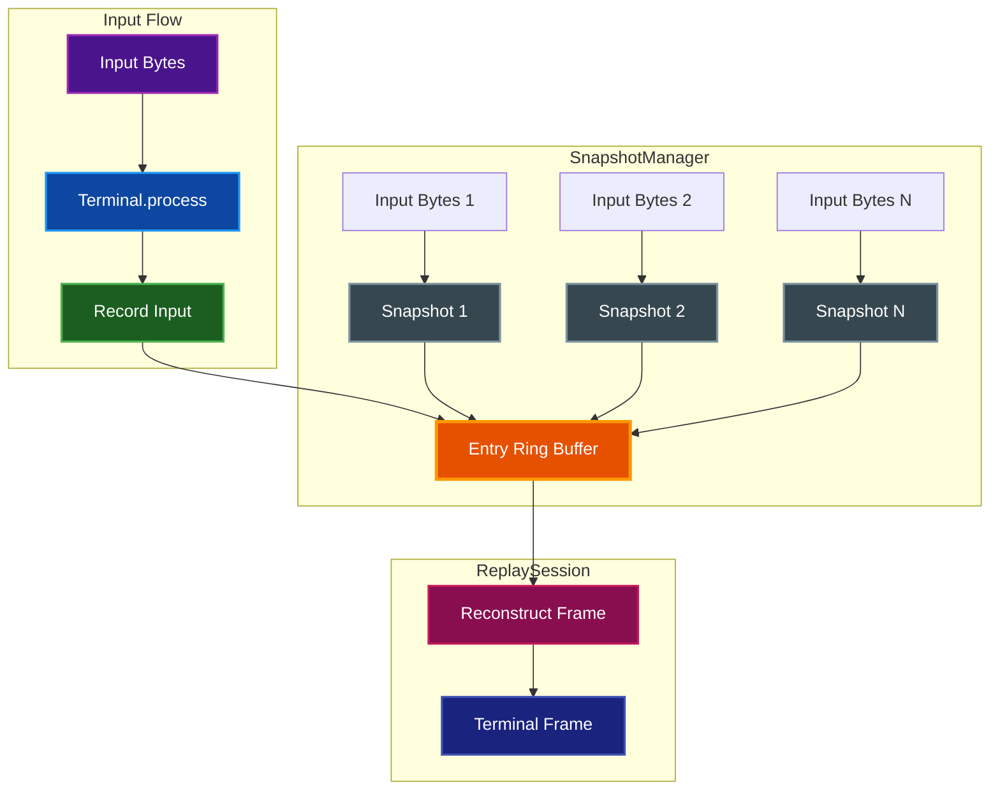
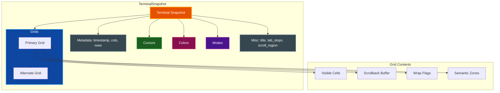

# Instant Replay

Instant Replay provides snapshot-based terminal state capture with delta replay, enabling navigation through terminal history with byte-level precision.

## Table of Contents

- [Overview](#overview)
- [Quick Start](#quick-start)
- [Architecture](#architecture)
- [SnapshotManager](#snapshotmanager)
  - [Configuration](#configuration)
  - [Automatic Snapshots](#automatic-snapshots)
  - [Input Recording](#input-recording)
  - [Eviction Policy](#eviction-policy)
- [ReplaySession](#replaysession)
  - [Creating a Session](#creating-a-session)
  - [Current State](#current-state)
  - [Timeline Navigation](#timeline-navigation)
    - [Seek to Specific Position](#seek-to-specific-position)
    - [Seek to Timestamp](#seek-to-timestamp)
    - [Seek to Start/End](#seek-to-startend)
    - [Step Forward/Backward](#step-forwardbackward)
    - [Entry Navigation](#entry-navigation)
- [Python API Reference](#python-api-reference)
- [Configuration Tuning](#configuration-tuning)
  - [Memory Budget Tuning](#memory-budget-tuning)
  - [Snapshot Interval Tuning](#snapshot-interval-tuning)
- [Implementation Notes](#implementation-notes)
  - [Snapshot Contents](#snapshot-contents)
  - [Reconstruction Performance](#reconstruction-performance)
  - [Thread Safety](#thread-safety)
  - [Limitations](#limitations)
- [Future Enhancements](#future-enhancements)
- [Related Documentation](#related-documentation)

## Overview

The Instant Replay system captures periodic snapshots of complete terminal state (grid cells, cursor, colors, modes, etc.) and records the input bytes processed between snapshots. This allows reconstructing any historical terminal state by restoring a snapshot and replaying the subsequent input bytes up to a specific position.

Key components:

- **TerminalSnapshot**: Complete point-in-time capture of terminal state (grids, cursors, colors, attributes, modes, scroll regions, tab stops)
- **SnapshotManager**: Rolling buffer with size-based eviction and automatic snapshot capture
- **ReplaySession**: Timeline navigation with seek, step, and timestamp-based positioning

The system uses a delta-based approach: snapshots serve as checkpoints, and input bytes between snapshots are replayed on-demand to reconstruct intermediate states. This balances memory usage with reconstruction speed.

## Quick Start

Basic snapshot capture and metadata retrieval:

```python
from par_term_emu_core_rust import Terminal

# Create terminal and process some output
term = Terminal(80, 24)
term.process(b"echo 'Hello, World!'\n")

# Capture snapshot metadata
info = term.capture_replay_snapshot()
print(f"Snapshot timestamp: {info['timestamp']}")
print(f"Size: {info['estimated_size_bytes']} bytes")
```

> **Note:** Full `ReplaySession` timeline navigation is only available via the Rust API. Python bindings for `ReplaySession` are planned for a future release. The Python API currently provides `capture_replay_snapshot()` for capturing individual snapshot metadata.

## Architecture



## SnapshotManager

The `SnapshotManager` maintains a rolling buffer of terminal snapshots with automatic eviction based on memory budget.

### Configuration

Default settings:
- **Memory budget**: 4 MiB (4,194,304 bytes)
- **Snapshot interval**: 30 seconds
- **Minimum entries**: Always keeps at least one entry, even if over budget

Memory budget includes:
- All cell data (visible screen + scrollback for both primary and alternate grids)
- Metadata (cursors, colors, modes, scroll regions, tab stops, zones)
- Recorded input bytes between snapshots

### Automatic Snapshots

Snapshots are captured automatically when:
1. The manager is enabled (`set_enabled(true)`)
2. The snapshot interval has elapsed since the last snapshot
3. `should_snapshot()` returns `true`

Manual snapshot capture (Rust API):
```rust
let index = manager.take_snapshot(&terminal);
```

### Input Recording

Input bytes are recorded automatically between snapshots (Rust API):
```rust
// After terminal.process(bytes) call:
manager.record_input(bytes);
```

Input bytes are appended to the most recent snapshot entry's `input_bytes` buffer. When a new snapshot is captured, a fresh input buffer is started.

### Eviction Policy

When total memory usage exceeds `max_memory_bytes`:
- Oldest entries are removed first
- Always keeps at least one entry (the newest)
- Eviction happens automatically after `take_snapshot()` and `record_input()`

Adjust memory budget dynamically (Rust API):
```rust
manager.set_max_memory(8 * 1024 * 1024); // 8 MiB
```

## ReplaySession

A `ReplaySession` provides timeline navigation through captured history. The session clones the `SnapshotManager` state at creation time, so it operates on a frozen timeline even if the original manager continues capturing new snapshots.

> **Note:** `ReplaySession` is only available via the Rust API. Python bindings are planned for a future release.

### Creating a Session

```rust
use par_term_emu_core_rust::terminal::replay::ReplaySession;

let session = ReplaySession::new(&manager)?;
```

Returns `None` if the manager has no entries. Sessions always start at the end of the timeline (latest captured state).

### Current State

Query the current position:
```rust
let frame: &Terminal = session.current_frame();
let index: usize = session.current_index();
let offset: usize = session.current_byte_offset();
let timestamp: u64 = session.current_timestamp();
let total: usize = session.total_entries();
```

The `current_frame` is a reconstructed `Terminal` instance at the current timeline position.

### Timeline Navigation

#### Seek to Specific Position

```rust
use par_term_emu_core_rust::terminal::replay::SeekResult;

// Seek to entry 5, byte offset 100
let result: SeekResult = session.seek_to(5, 100);

match result {
    SeekResult::Ok => println!("Seeked successfully"),
    SeekResult::AtStart => println!("Clamped to start"),
    SeekResult::AtEnd => println!("Clamped to end"),
    SeekResult::Empty => println!("No entries available"),
}
```

Out-of-range values are clamped to valid ranges:
- Entry index clamped to `[0, total_entries - 1]`
- Byte offset clamped to `[0, entry.input_bytes.len()]`

#### Seek to Timestamp

```rust
let timestamp_ms: u64 = 1700000000000; // Unix milliseconds
let result = session.seek_to_timestamp(timestamp_ms);
```

Uses binary search to find the snapshot closest to (but not after) the given timestamp, then seeks to byte offset 0 of that entry.

#### Seek to Start/End

```rust
// Jump to the beginning of the timeline
session.seek_to_start();

// Jump to the end of the timeline
session.seek_to_end();
```

#### Step Forward/Backward

Navigate by byte offsets:
```rust
// Step forward 100 bytes
session.step_forward(100);

// Step backward 50 bytes
session.step_backward(50);
```

Steps automatically cross entry boundaries. For example, stepping forward 200 bytes from entry 0 offset 50 will:
1. Consume remaining bytes in entry 0
2. Move to entry 1 offset 0
3. Continue consuming bytes from entry 1

#### Entry Navigation

Navigate by entry boundaries:
```rust
// Move to the start of the previous entry
session.previous_entry();

// Move to the start of the next entry
session.next_entry();
```

## Python API Reference

### Terminal Methods

#### `capture_replay_snapshot() -> dict`

Capture a cell-level snapshot of the terminal state.

Unlike `get_semantic_snapshot()` which captures text only, this captures raw Cell data including colors and attributes for pixel-perfect reconstruction.

**Returns**: Dictionary with keys:
- `timestamp` (int): Unix timestamp in milliseconds
- `cols` (int): Terminal width in columns
- `rows` (int): Terminal height in rows
- `estimated_size_bytes` (int): Approximate memory footprint in bytes

**Example**:
```python
from par_term_emu_core_rust import Terminal

term = Terminal(80, 24)
term.process(b"Hello, World!")

info = term.capture_replay_snapshot()
print(f"Snapshot at {info['timestamp']}, size: {info['estimated_size_bytes']} bytes")
```

> **Note:** This method captures snapshot metadata only. Full `ReplaySession` Python bindings for timeline navigation are planned for a future release.

## Configuration Tuning

### Memory Budget Tuning

Memory usage depends on:
- Terminal size (cols x rows)
- Scrollback depth
- Number of entries in the buffer
- Input bytes recorded between snapshots

Example memory estimates (80x24 terminal, 1000-line scrollback):
- Single snapshot: ~400 KiB
- 10 snapshots + input bytes: ~4-8 MiB (depending on input volume)
- 20 snapshots + input bytes: ~8-16 MiB

Recommendations:
- **Default (4 MiB)**: Good for 5-10 snapshots with moderate input
- **8 MiB**: Better for longer sessions or high-volume output
- **16 MiB**: Recommended for long-running TUI applications

### Snapshot Interval Tuning

Trade-off between:
- **Shorter intervals** (e.g., 10s): More snapshots, less replay time, higher memory usage
- **Longer intervals** (e.g., 60s): Fewer snapshots, more replay time, lower memory usage

Recommendations:
- **Default (30s)**: Balanced for most use cases
- **10s**: High-frequency capture for critical sessions
- **60s**: Low-overhead monitoring of long-running processes

The interval is wall-clock time, not processing time. Snapshots are only captured when `should_snapshot()` is checked (typically after `process()` calls).

## Implementation Notes

### Snapshot Contents

A `TerminalSnapshot` captures:



Detailed contents:
- **Grids**: Primary and alternate screen cells (visible + scrollback)
- **Cursors**: Primary, alternate, and saved cursor state
- **Colors**: Current and saved foreground, background, underline colors
- **Attributes**: Current and saved cell attribute flags
- **Modes**: Auto-wrap, origin, insert, reverse video, line feed, application cursor, bracketed paste, focus tracking, mouse mode/encoding, margins, keyboard flags
- **Scroll Region**: Top and bottom boundaries
- **Tab Stops**: Per-column tab positions
- **Metadata**: Timestamp, terminal dimensions, estimated size

Wide characters, Unicode combining characters, and graphics placeholders are preserved exactly.

### Reconstruction Performance

Reconstruction time is proportional to the number of input bytes to replay from the snapshot. With default 30-second intervals:
- **Seeking to recent snapshots**: Near-instant (restore snapshot only)
- **Seeking between snapshots**: Milliseconds (replay up to 30s of input)
- **Stepping forward/backward**: Sub-millisecond (incremental replay)

For long replays across many entries, binary search via `seek_to_timestamp()` is more efficient than sequential stepping.

### Thread Safety

`SnapshotManager` is not thread-safe. If the terminal is accessed from multiple threads (e.g., PTY reader + UI thread), wrap the manager in a `Mutex`:

```rust
use std::sync::{Arc, Mutex};

let manager = Arc::new(Mutex::new(SnapshotManager::with_defaults()));

// PTY reader thread:
let mgr = manager.lock().unwrap();
if mgr.should_snapshot() {
    mgr.take_snapshot(&terminal);
}
mgr.record_input(bytes);
```

### Limitations

- **No Python bindings for ReplaySession**: Full timeline navigation API is Rust-only (planned for future release)
- **No persistence**: Snapshots exist only in memory; no serialization/deserialization support yet
- **No compression**: Input bytes are stored raw; future versions may add compression for long input streams
- **Clone overhead**: `ReplaySession::new()` clones the entire `SnapshotManager` state (necessary for frozen timelines)

## Future Enhancements

Planned features:
- Python bindings for `ReplaySession` (timeline navigation from Python)
- Snapshot persistence (save/load replay sessions)
- Input stream compression (reduce memory usage for large sessions)
- Incremental snapshots (delta encoding between snapshots)
- Metadata-only snapshots (capture timestamps without full state for scrubbing)

## Related Documentation

- [API Reference](API_REFERENCE.md) - Complete API documentation for the terminal emulator
- [Architecture](ARCHITECTURE.md) - Detailed internal architecture with diagrams
- [Semantic Snapshots](#) - Text-focused snapshot API for command/output extraction
