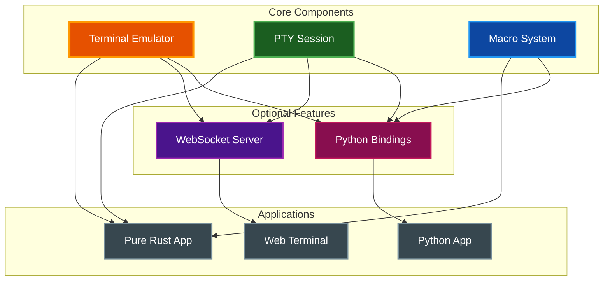

# Using par-term-emu-core-rust in Pure Rust Projects

A comprehensive guide for using the par-term-emu-core-rust library in pure Rust applications without Python bindings.

## Table of Contents
- [Overview](#overview)
- [Quick Start](#quick-start)
  - [Feature Combinations](#feature-combinations)
  - [Build Commands](#build-commands)
- [Basic Terminal Usage](#basic-terminal-usage)
- [PTY Session](#pty-session-shell-interaction)
- [Macro Recording and Playback](#macro-recording-and-playback)
- [WebSocket Streaming Server](#websocket-streaming-server)
- [Feature Flags](#feature-flags)
- [Building](#building)
- [Example Projects](#example-projects)
- [API Documentation](#api-documentation)
- [Core Components](#core-components)
- [C FFI](#c-ffi-future)
- [Related Documentation](#related-documentation)

## Overview

This library provides full VT100/VT220/VT320/VT420/VT520 terminal emulation in pure Rust with Python 3.12+ bindings. It can be used with or without Python bindings, making it suitable for pure Rust applications, embedded terminals, and CLI tools.

> **Note:** The `Cell` struct implements `Clone` but not `Copy` to support variable-length grapheme cluster storage (combining characters, emoji sequences). All cell copy operations require explicit `.clone()` calls. Python bindings are unaffected.

### Architecture Overview



## Quick Start

### Feature Combinations

Choose the feature set that matches your needs:

#### Rust Only (No Python)
```toml
[dependencies]
par-term-emu-core-rust = { version = "0.39", default-features = false }
```
**Includes:** Terminal emulation, PTY support, Macros
**Use for:** Pure Rust applications, embedded terminals, CLI tools

#### Rust with Streaming (No Python)
```toml
[dependencies]
par-term-emu-core-rust = { version = "0.39", default-features = false, features = ["streaming"] }
```
**Includes:** Everything in "Rust Only" + WebSocket server, HTTP server, Axum, Tokio, Protocol Buffers
**Use for:** Web-based terminals, remote terminal access, terminal sharing

#### Python Only
```toml
[dependencies]
par-term-emu-core-rust = { version = "0.39" }
# Or explicitly:
par-term-emu-core-rust = { version = "0.39", features = ["python"] }
```
**Includes:** Terminal emulation, PTY support, Macros + Python bindings (PyO3)
**Use for:** Python applications, TUI frameworks, Jupyter kernels

#### Python with Streaming
```toml
[dependencies]
par-term-emu-core-rust = { version = "0.39", features = ["python", "streaming"] }
# Or use the convenience feature:
par-term-emu-core-rust = { version = "0.39", features = ["full"] }
```
**Includes:** Everything + Python bindings + WebSocket/HTTP server + Protocol Buffers
**Use for:** Full-featured terminal applications with remote access

### Build Commands

**Rust only:**
```bash
cargo build --no-default-features
```

**Rust with streaming:**
```bash
cargo build --no-default-features --features streaming
```

**Python only:**
```bash
uv run maturin develop --release
```

**Python with streaming:**
```bash
cargo build --features "python,streaming"
```

## Basic Terminal Usage

The `Terminal` struct provides the core terminal emulation functionality.

> **Tip:** For custom scrollback size, use `Terminal::with_scrollback(cols, rows, scrollback_lines)` instead of `Terminal::new()`.

```rust
use par_term_emu_core_rust::terminal::Terminal;

fn main() {
    // Create an 80x24 terminal with default scrollback (10000 lines)
    let mut terminal = Terminal::new(80, 24);

    // Or create with custom scrollback
    // let mut terminal = Terminal::with_scrollback(80, 24, 50000);

    // Process ANSI sequences
    terminal.process(b"\x1b[31mRed text\x1b[0m\n");
    terminal.process(b"Normal text\n");

    // Get terminal content
    let content = terminal.export_text();
    println!("{}", content);

    // Get cursor position
    let cursor = terminal.cursor();
    println!("Cursor at column {}, row {}", cursor.col, cursor.row);

    // Resize terminal (scrollback is automatically reflowed when width changes)
    terminal.resize(100, 30);
}
```

> **Note:** The `process()` method is thread-safe for reading but requires `&mut self` for modifications. For concurrent access, wrap `Terminal` in `Arc<Mutex<Terminal>>`.

> **Resize Behavior:** When terminal width changes, scrollback content is automatically reflowed--wrapped lines are unwrapped (width increase) or re-wrapped (width decrease). All cell attributes are preserved. Height-only changes do not trigger reflow.

## PTY Session (Shell Interaction)

The `PtySession` manages an interactive shell process with bidirectional I/O.

> **Security:** PTY sessions execute shell commands with the same privileges as your application. Always validate and sanitize any user input before sending it to the PTY. See [SECURITY.md](SECURITY.md) for best practices.

```rust
use par_term_emu_core_rust::pty_session::PtySession;
use std::sync::Arc;
use std::io::Write;

fn main() -> std::io::Result<()> {
    // Create PTY session: 80 cols, 24 rows, 10000 lines scrollback
    let mut pty = PtySession::new(80, 24, 10000);

    // Spawn a shell
    pty.spawn_shell()?;

    // Set output callback
    pty.set_output_callback(Arc::new(|data| {
        print!("{}", String::from_utf8_lossy(data));
    }));

    // Send input to shell
    if let Some(writer) = pty.get_writer() {
        let mut w = writer.lock();
        writeln!(w, "echo 'Hello from Rust!'")?;
        w.flush()?;
    }

    // Keep running while shell is active
    while pty.is_running() {
        std::thread::sleep(std::time::Duration::from_millis(100));
    }

    Ok(())
}
```

### Spawning with Environment Variables

```rust
use par_term_emu_core_rust::pty_session::PtySession;
use std::collections::HashMap;

fn main() -> Result<(), Box<dyn std::error::Error>> {
    let mut session = PtySession::new(80, 24, 10000);

    // Set environment variables before spawning
    session.set_env("MY_VAR", "hello");

    // Or pass environment variables directly when spawning
    let mut env = HashMap::new();
    env.insert("MY_VAR".to_string(), "hello".to_string());
    session.spawn_shell_with_env(Some(&env), Some("/tmp"))?;

    Ok(())
}
```

## Macro Recording and Playback

The macro system allows recording and playback of keyboard events with YAML serialization.

```rust
use par_term_emu_core_rust::macros::{Macro, MacroEvent, KeyParser};
use std::time::Duration;

fn main() -> std::io::Result<()> {
    // Create a macro
    let mut macro_seq = Macro::new("Demo Macro");
    macro_seq
        .with_description("A simple demo")
        .with_terminal_size(80, 24)
        .add_key("e")
        .add_key("c")
        .add_key("h")
        .add_key("o")
        .add_key("space")
        .add_key("'")
        .add_key("H")
        .add_key("e")
        .add_key("l")
        .add_key("l")
        .add_key("o")
        .add_key("'")
        .add_key("enter")
        .add_delay(1000)
        .add_screenshot();

    // Save to YAML
    macro_seq.save_yaml("demo.yaml")?;

    // Load and playback
    let loaded = Macro::load_yaml("demo.yaml")?;

    // Iterate through events
    for event in &loaded.events {
        match event {
            MacroEvent::KeyPress { key, .. } => {
                let bytes = KeyParser::parse_key(key);
                println!("Key: {} -> {:?}", key, bytes);
            }
            MacroEvent::Delay { duration, .. } => {
                println!("Delay: {}ms", duration);
            }
            MacroEvent::Screenshot { label, .. } => {
                println!("Screenshot: {:?}", label);
            }
        }
    }

    Ok(())
}
```

## WebSocket Streaming Server

> **Note:** Requires the `streaming` feature flag.

> **Security:** The streaming server supports TLS/SSL for secure WebSocket connections (WSS) and HTTPS. Configure using `TlsConfig::from_files()` or `TlsConfig::from_pem()`.

> **Performance:** Server uses Protocol Buffers for efficient binary messaging (~80% smaller than JSON). Messages are automatically encoded/decoded by the server.

### Basic Streaming Server

```rust
use par_term_emu_core_rust::{
    terminal::Terminal,
    pty_session::PtySession,
    streaming::{StreamingConfig, StreamingServer},
};
use std::sync::{Arc, Mutex};

#[tokio::main]
async fn main() -> Result<(), Box<dyn std::error::Error>> {
    // Create terminal and PTY
    let pty_session = PtySession::new(80, 24, 10000);
    let terminal = pty_session.terminal();
    let pty_session = Arc::new(Mutex::new(pty_session));

    // Create streaming server with configuration
    let config = StreamingConfig {
        max_clients: 100,
        send_initial_screen: true,
        keepalive_interval: 30,
        default_read_only: false,
        enable_http: true,
        web_root: "./web_term".to_string(),
        initial_cols: 0,  // 0 = use terminal's current size
        initial_rows: 0,  // 0 = use terminal's current size
        tls: None,
        http_basic_auth: None,
        max_sessions: 10,
        session_idle_timeout: 900,
        presets: std::collections::HashMap::new(),
        max_clients_per_session: 0,
        input_rate_limit_bytes_per_sec: 0,
        enable_system_stats: false,
        system_stats_interval_secs: 5,
        api_key: None,
        allow_api_key_in_query: false,
    };

    let server = StreamingServer::with_config(
        terminal,
        "127.0.0.1:8099".to_string(),
        config
    );

    // Start shell
    {
        let mut session = pty_session.lock();
        session.spawn_shell()?;
    }

    // Setup output callback
    let output_sender = server.get_output_sender();
    {
        let mut session = pty_session.lock();
        session.set_output_callback(Arc::new(move |data| {
            let _ = output_sender.send(String::from_utf8_lossy(data).to_string());
        }));
    }

    // Get PTY writer for client input
    if let Some(writer) = pty_session.lock().get_writer() {
        server.set_pty_writer(writer);
    }

    let server = Arc::new(server);

    // Start server
    println!("Server listening on ws://127.0.0.1:8099");
    server.start().await?;

    Ok(())
}
```

### TLS Configuration

```rust
use par_term_emu_core_rust::streaming::{StreamingConfig, TlsConfig};

// From separate certificate and key files
let tls = TlsConfig::from_files("cert.pem", "key.pem")?;

// Or from a combined PEM file
let tls = TlsConfig::from_pem("combined.pem")?;

let config = StreamingConfig {
    tls: Some(tls),
    ..Default::default()
};
```

### HTTP Basic Authentication

```rust
use par_term_emu_core_rust::streaming::{StreamingConfig, HttpBasicAuthConfig};

// With clear text password
let auth = HttpBasicAuthConfig::with_password(
    "admin".to_string(),
    "secret".to_string()
);

// Or with htpasswd hash (bcrypt, apr1, SHA1, MD5 crypt)
let auth = HttpBasicAuthConfig::with_hash(
    "admin".to_string(),
    "$2y$10$...bcrypt_hash...".to_string()
);

let config = StreamingConfig {
    http_basic_auth: Some(auth),
    ..Default::default()
};
```

## Feature Flags

| Feature | Description | Includes |
|---------|-------------|----------|
| `python` | Python bindings via PyO3 | `pyo3`, `pyo3/extension-module` |
| `streaming` | WebSocket streaming server with binary protocol | `tokio`, `tokio-tungstenite`, `axum`, `tower-http`, `futures-util`, `uuid`, `clap`, `anyhow`, `tracing`, `tracing-subscriber`, `reqwest`, `flate2`, `tar`, `prost`, `rustls`, `tokio-rustls`, `rustls-pemfile`, `axum-server`, `htpasswd-verify`, `headers`, `sysinfo` |
| `rust-only` | Pure Rust, no Python | (none) |
| `full` | All features | `python`, `streaming` |
| `jemalloc` | Better server performance (non-Windows) | `tikv-jemallocator` |
| `regenerate-proto` | Rebuild protobuf from `proto/terminal.proto` | `prost-build` |
| `default` | Default features | `python` |

## Building

**Pure Rust binary (no Python):**
```bash
cargo build --no-default-features --features streaming
```

**Rust library only:**
```bash
cargo build --no-default-features
```

**Everything:**
```bash
cargo build --features full
```

**With jemalloc for better server performance:**
```bash
cargo build --no-default-features --features "streaming,jemalloc"
```

## Example Projects

The repository includes example binaries:

- **`par-term-streamer`** - Full-featured WebSocket streaming server with TLS support and binary protocol
  ```bash
  # View all options
  cargo run --bin par-term-streamer --no-default-features --features streaming -- --help

  # Run with HTTP server
  cargo run --bin par-term-streamer --no-default-features --features streaming -- --enable-http

  # Run with TLS/SSL
  cargo run --bin par-term-streamer --no-default-features --features streaming -- \
    --enable-http --tls-cert cert.pem --tls-key key.pem

  # Download web frontend (no Node.js required)
  cargo run --bin par-term-streamer --no-default-features --features streaming -- --download-frontend

  # With HTTP Basic Auth
  cargo run --bin par-term-streamer --no-default-features --features streaming -- \
    --enable-http --auth-user admin --auth-pass secret
  ```

## API Documentation

Generate Rust API documentation:
```bash
cargo doc --no-default-features --open
```

With all features:
```bash
cargo doc --all-features --open
```

## Core Components

### Terminal
- **VT Compatibility**: VT100/VT220/VT320/VT420/VT520 compatible
- **Color Support**: ANSI 16-color, 256-color palette, and 24-bit RGB (true color)
- **Unicode Support**: Full Unicode with wide character support, grapheme cluster preservation, combining characters, variation selectors, Zero-Width Joiners (ZWJ), and emoji sequences
- **Scrollback Buffer**: Configurable scrollback with automatic reflow on width changes
- **Mouse Support**: X10, Normal, Button, and Any modes with multiple encodings (Default, UTF-8, SGR, URXVT)
- **Graphics Support**: Sixel, iTerm2 inline images, and Kitty Graphics Protocol
- **Shell Integration**: OSC 133 support for command tracking and navigation
- **Triggers**: Regex-based pattern matching on terminal output with configurable actions
- **Recording**: Terminal session recording and export in multiple formats

### PtySession
- **Cross-platform PTY**: Unix and Windows support via `portable-pty`
- **Shell Management**: Spawning, lifecycle management, and exit code handling
- **Async I/O**: Callback-based output handling with thread-safe writer access
- **Terminal Resizing**: Dynamic resize support with PTY coordination
- **Process Control**: Start, stop, and status monitoring
- **Environment Variables**: Pass environment variables safely without modifying parent process

### Macros
- **Recording**: Capture keyboard events with timestamps
- **Playback**: Variable speed playback with pause/resume
- **Serialization**: YAML format for human-readable macro files
- **Screenshots**: Trigger screenshot capture at specific points
- **Key Parser**: Parse key names to ANSI escape sequences

### Streaming
- **WebSocket Server**: Real-time terminal streaming with multiple client support
- **Binary Protocol**: Protocol Buffers for efficient messaging (~80% size reduction vs JSON)
- **TLS/SSL Support**: Secure WebSocket (WSS) and HTTPS with rustls
- **HTTP Server**: Static file serving for web frontend with automatic frontend download
- **Client Control**: Read-only mode, resize events, theme customization
- **Multi-Session**: Support for multiple independent terminal sessions
- **Authentication**: HTTP Basic Auth with htpasswd hash support (bcrypt, apr1, SHA1, MD5 crypt)
- **Rate Limiting**: Input rate limiting to prevent abuse
- **System Stats**: Optional system resource monitoring

## C FFI (Future)

While the library is built as `cdylib`, C FFI bindings are not yet provided. To use from C/C++, you would need to:

1. Create wrapper functions with `#[no_mangle]` and `extern "C"`
2. Use C-compatible types
3. Generate header files with `cbindgen`

> **Note:** This is a future enhancement. The following is an example of how it could be implemented:

```rust
use par_term_emu_core_rust::terminal::Terminal;

#[no_mangle]
pub extern "C" fn terminal_new(cols: usize, rows: usize) -> *mut Terminal {
    Box::into_raw(Box::new(Terminal::new(cols, rows)))
}

#[no_mangle]
pub extern "C" fn terminal_free(ptr: *mut Terminal) {
    if !ptr.is_null() {
        unsafe {
            drop(Box::from_raw(ptr));
        }
    }
}
```

## Related Documentation

- [README.md](../README.md) - Project overview and Python quickstart
- [ARCHITECTURE.md](ARCHITECTURE.md) - Internal architecture and design
- [VT_SEQUENCES.md](VT_SEQUENCES.md) - ANSI/VT sequence reference
- [VT_TECHNICAL_REFERENCE.md](VT_TECHNICAL_REFERENCE.md) - Detailed VT terminal specifications
- [ADVANCED_FEATURES.md](ADVANCED_FEATURES.md) - Detailed feature guides
- [BUILDING.md](BUILDING.md) - Build instructions and requirements
- [API_REFERENCE.md](API_REFERENCE.md) - Python API documentation
- [STREAMING.md](STREAMING.md) - WebSocket streaming server guide
- [MACROS.md](MACROS.md) - Macro recording and playback documentation
- [SECURITY.md](SECURITY.md) - Security considerations for PTY usage

## License

MIT License - See [LICENSE](../LICENSE) for details.
