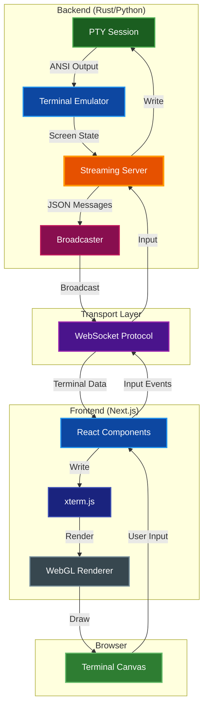
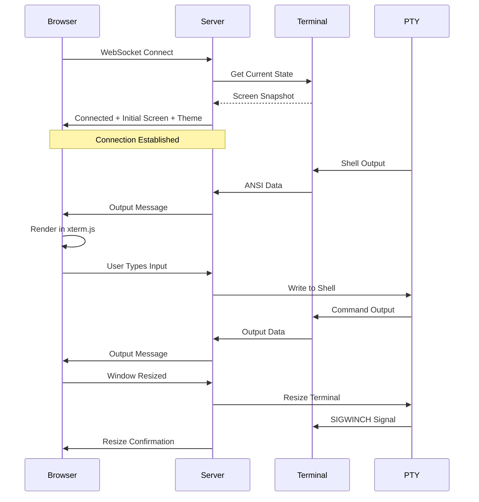
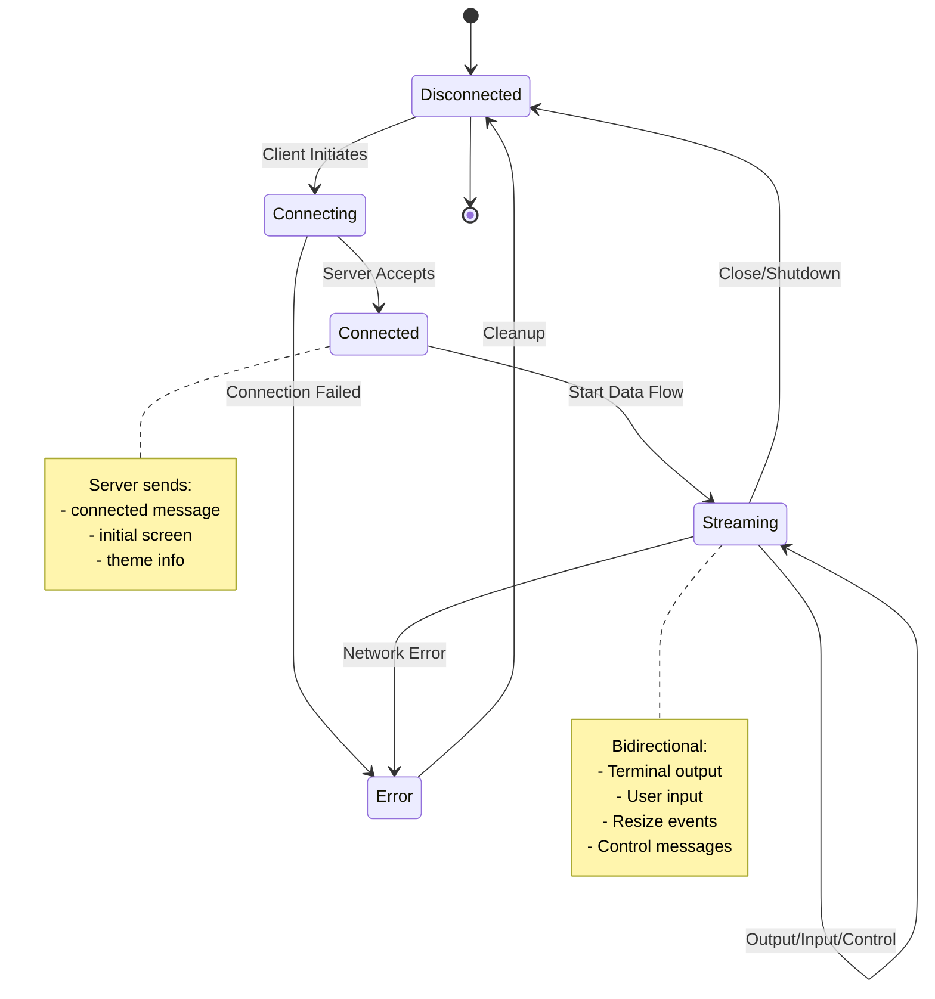

# Terminal Streaming

Real-time terminal streaming over WebSocket with browser-based frontend for remote terminal access and viewing.

## Table of Contents
- [Overview](#overview)
- [Architecture](#architecture)
  - [System Components](#system-components)
  - [Data Flow](#data-flow)
  - [WebSocket Protocol](#websocket-protocol)
- [Server Implementation](#server-implementation)
  - [Rust Standalone Server](#rust-standalone-server)
  - [Python Integration](#python-integration)
  - [Configuration](#configuration)
- [Web Frontend](#web-frontend)
  - [Technology Stack](#technology-stack)
  - [Setup and Development](#setup-and-development)
  - [Mobile Support](#mobile-support)
  - [Theme System](#theme-system)
- [Protocol Specification](#protocol-specification)
  - [Server Messages](#server-messages)
  - [Client Messages](#client-messages)
  - [Connection Flow](#connection-flow)
- [Usage Examples](#usage-examples)
  - [Rust Server](#rust-server)
  - [Python Server](#python-server)
  - [Frontend Connection](#frontend-connection)
- [Advanced Features](#advanced-features)
  - [Multiple Viewers](#multiple-viewers)
  - [Read-Only Mode](#read-only-mode)
  - [Macro Playback](#macro-playback)
  - [HTTP Static File Serving](#http-static-file-serving)
- [Security Considerations](#security-considerations)
- [Performance](#performance)
- [Troubleshooting](#troubleshooting)
- [Related Documentation](#related-documentation)

## Overview

The streaming system enables real-time terminal viewing and interaction through web browsers using WebSocket connections. It consists of:

- **Streaming Server**: Rust/Python server that captures terminal output and forwards it via WebSocket
- **Web Frontend**: Next.js/React application with xterm.js for browser-based terminal rendering
- **Protocol**: JSON-based bidirectional messaging for terminal data, input, and control

**Key Features:**
- Sub-100ms latency for local connections
- Multiple concurrent viewers per terminal session
- Bidirectional communication (view and control)
- Optional read-only mode for viewers
- Color theme synchronization
- Automatic resize handling
- Graphics protocol support (Sixel, Kitty, iTerm2)
- Unicode and emoji support

## Architecture

### System Components



### Data Flow



### WebSocket Protocol

The streaming protocol uses JSON messages with a `type` field for discrimination:

**Message Format:**
```json
{
  "type": "message_type",
  "field1": "value1",
  "field2": "value2"
}
```

**Connection Lifecycle:**
1. Client connects to WebSocket endpoint
2. Server sends `connected` message with initial screen
3. Bidirectional streaming begins
4. Client/server can send control messages (resize, ping, etc.)
5. Connection closes gracefully or on error

## Server Implementation

### Rust Standalone Server

The `par-term-streamer` binary provides a standalone streaming server:

**Build:**
```bash
# Using Makefile (recommended)
make streamer-build-release

# Or directly with cargo
cargo build --release --bin par-term-streamer --no-default-features --features streaming
```

**Run:**
```bash
# Basic usage
par-term-streamer --host 127.0.0.1 --port 8099

# With custom terminal size (using --size shorthand)
par-term-streamer --size 120x40

# Or using separate --cols and --rows
par-term-streamer --cols 120 --rows 40

# Use current terminal size from TTY
par-term-streamer --use-tty-size

# With an initial command (executed after 1 second delay)
par-term-streamer --command "htop"
par-term-streamer -c "vim README.md"

# With theme
par-term-streamer --theme dracula

# With HTTP static file serving
par-term-streamer --enable-http --web-root ./web_term

# Download prebuilt web frontend from GitHub releases
par-term-streamer --download-frontend --web-root ./web_term

# Download specific version of web frontend
par-term-streamer --download-frontend --frontend-version 0.14.0 --web-root ./web_term

# Macro playback mode
par-term-streamer --macro-file demo.yaml --macro-loop --macro-speed 1.5
```

**Download Web Frontend:**

The `--download-frontend` option downloads the prebuilt web frontend from GitHub releases, so you don't need Node.js/npm installed:

```bash
# Download latest version to default location (./web_term)
par-term-streamer --download-frontend

# Download to custom location
par-term-streamer --download-frontend --web-root /path/to/web

# Download specific version
par-term-streamer --download-frontend --frontend-version 0.14.0

# Then run server with downloaded frontend
par-term-streamer --enable-http --web-root ./web_term
```

**Available Themes:**
- `iTerm2-dark` (default)
- `monokai`
- `dracula`
- `solarized-dark`

### Python Integration

```python
import par_term_emu_core_rust as terminal_core

# Create PTY terminal
pty_terminal = terminal_core.PtyTerminal(80, 24, 10000)

# Start shell
pty_terminal.spawn_shell()

# Create streaming server
addr = "127.0.0.1:8080"
streaming_server = terminal_core.StreamingServer(pty_terminal, addr)

# Start server (non-blocking)
streaming_server.start()

# Main loop
while pty_terminal.is_running():
    # Handle resize requests
    resize = streaming_server.poll_resize()
    if resize:
        cols, rows = resize
        pty_terminal.resize(cols, rows)
        streaming_server.send_resize(cols, rows)

    time.sleep(0.1)

# Cleanup
streaming_server.shutdown("Server stopping")
```

### Configuration

**StreamingConfig:**

| Option | Type | Default | Description |
|--------|------|---------|-------------|
| `max_clients` | usize | 1000 | Maximum concurrent client connections |
| `send_initial_screen` | bool | true | Send screen snapshot on connect |
| `keepalive_interval` | u64 | 30 | Ping interval in seconds (0=disabled) |
| `default_read_only` | bool | false | New clients read-only by default |
| `enable_http` | bool | false | Enable HTTP static file serving |
| `web_root` | String | "./web_term" | Web root directory for static files |
| `initial_cols` | u16 | 0 | Initial terminal columns (0=use terminal's current size) |
| `initial_rows` | u16 | 0 | Initial terminal rows (0=use terminal's current size) |

**Python Example:**
```python
config = terminal_core.StreamingConfig(
    max_clients=100,
    send_initial_screen=True,
    keepalive_interval=30,
    default_read_only=False,
    initial_cols=120,
    initial_rows=40
)

server = terminal_core.StreamingServer(pty_terminal, addr, config)
```

**Rust Example:**
```rust
use par_term_emu_core_rust::streaming::StreamingConfig;

let config = StreamingConfig {
    max_clients: 100,
    send_initial_screen: true,
    keepalive_interval: 30,
    default_read_only: false,
    enable_http: true,
    web_root: "./web_term".to_string(),
    initial_cols: 120,
    initial_rows: 40,
};

let server = StreamingServer::with_config(terminal, addr, config);
```

## Web Frontend

### Technology Stack

**Core Dependencies:**
- **Next.js** ^16.0.3 - React framework with App Router
- **React** ^19.2.0 - UI library
- **TypeScript** ^5.9.3 - Type safety
- **Tailwind CSS** ^4.1.17 - Utility-first styling

**Terminal Components:**
- **@xterm/xterm** ^5.5.0 - Terminal emulator core
- **@xterm/addon-fit** ^0.10.0 - Auto-sizing addon
- **@xterm/addon-webgl** ^0.18.0 - WebGL renderer
- **@xterm/addon-web-links** ^0.11.0 - Clickable URLs
- **@xterm/addon-unicode11** ^0.8.0 - Unicode 11 support

### Setup and Development

**Quick Start (Using Makefile):**
```bash
# Install dependencies
make web-install

# Run development server
make web-dev

# Build static export and copy to web_term/ directory
make web-build-static

# Clean build artifacts
make web-clean
```

**Manual Setup:**
```bash
cd web-terminal-frontend

# Install dependencies
npm install

# Development server (binds to 0.0.0.0:3000 for mobile testing)
npm run dev

# Production build (creates Next.js server build)
npm run build
npm run start

# Static export build (creates static HTML/JS in 'out' directory)
npm run build  # Next.js configured with output: 'export'
```

**Mobile Development Testing:**
```bash
# Start dev server (binds to all interfaces)
npm run dev

# Access from mobile device on same network:
# http://<your-computer-ip>:3000
# Example: http://192.168.1.100:3000
```

**Project Structure:**
```
web-terminal-frontend/
├── app/
│   ├── globals.css       # Global styles and Tailwind
│   ├── layout.tsx        # Root layout with fonts
│   └── page.tsx          # Main page component
├── components/
│   └── Terminal.tsx      # Terminal component with xterm.js
├── types/
│   └── terminal.ts       # TypeScript interfaces
├── next.config.js        # Next.js configuration
├── tailwind.config.ts    # Tailwind configuration
└── package.json          # Dependencies
```

**Component Overview:**

- `app/page.tsx`: Main application UI with connection controls and status indicator
- `components/Terminal.tsx`: xterm.js integration with WebSocket handling
- `types/terminal.ts`: TypeScript type definitions for messages and state
- `next.config.js`: Configures Next.js for static export (`output: 'export'`)

### Mobile Support

The web frontend is fully responsive and optimized for mobile devices:

**Responsive Features:**

| Feature | Mobile | Tablet | Desktop |
|---------|--------|--------|---------|
| Font Size | 4-5px | 6-10px | 14px |
| Scrollback | 500 lines | 500 lines | 1000 lines |
| Cursor Blink | Disabled | Disabled | Enabled |
| UI Controls | Hideable | Hideable | Always visible |

**Adaptive Font Sizing:**
```typescript
// Font size automatically adjusts based on screen dimensions
const getResponsiveFontSize = (): number => {
  const width = window.innerWidth;
  const height = window.innerHeight;
  const minDim = Math.min(width, height);

  if (minDim < 500) {
    // Phone: use height-based sizing for landscape
    return height < width ? (height < 400 ? 4 : 5) : 4;
  }
  if (minDim < 768) return 6;    // Small tablets
  if (width < 1024) return 10;   // Tablets
  return 14;                      // Desktop
};
```

**Mobile-Specific Optimizations:**
- **Hideable Header/Footer**: Toggle button to maximize terminal space on small screens
- **Touch Support**: Tap terminal to activate mobile keyboard
- **Orientation Handling**: Automatic refit on orientation change
- **Battery Savings**: Cursor blink disabled on mobile devices
- **Reduced Scrollback**: 500 lines vs 1000 to conserve memory

**Auto-Reconnect:**
- Exponential backoff: 500ms → 1s → 2s → 4s → 5s (max)
- Infinite retry with cancel button
- Connection state preserved across reconnects

**UI Toggle:**
```
┌─────────────────────────────────┐
│ [Header - WebSocket URL input]  │  ← Hideable
├─────────────────────────────────┤
│                                 │
│         Terminal Area           │  ← Expands when controls hidden
│                                 │
├─────────────────────────────────┤
│ [Footer - Links]                │  ← Hideable
└─────────────────────────────────┘
         [▼] Toggle Button          ← Always visible
```

**React StrictMode Compatibility:**
The terminal component handles React 18's StrictMode double-invocation pattern by preserving the xterm.js instance across the unmount/remount cycle, preventing duplicate terminals in the DOM.

### Theme System

The server can send color theme information to clients on connection:

**Theme Structure:**
```typescript
interface ThemeInfo {
  name: string;
  background: [number, number, number];
  foreground: [number, number, number];
  normal: [
    [number, number, number],  // 0: black
    [number, number, number],  // 1: red
    [number, number, number],  // 2: green
    [number, number, number],  // 3: yellow
    [number, number, number],  // 4: blue
    [number, number, number],  // 5: magenta
    [number, number, number],  // 6: cyan
    [number, number, number],  // 7: white
  ];
  bright: [
    [number, number, number],  // 8: bright black
    // ... 9-15: bright variants
  ];
}
```

**Client-Side Theme Application:**
```typescript
// Received in connected message
const applyTheme = (theme: ThemeInfo) => {
  xtermRef.current.options.theme = {
    background: rgbToHex(theme.background),
    foreground: rgbToHex(theme.foreground),
    black: rgbToHex(theme.normal[0]),
    red: rgbToHex(theme.normal[1]),
    // ... map all 16 colors
  };
};
```

## Protocol Specification

### Server Messages

**Connected**
```json
{
  "type": "connected",
  "cols": 80,
  "rows": 24,
  "session_id": "uuid-string",
  "initial_screen": "ANSI escaped screen content",
  "theme": {
    "name": "iterm2-dark",
    "background": [0, 0, 0],
    "foreground": [255, 255, 255],
    "normal": [[0,0,0], [201,27,0], ...],
    "bright": [[104,104,104], [255,110,103], ...]
  }
}
```

**Output**
```json
{
  "type": "output",
  "data": "Raw ANSI terminal data",
  "timestamp": 1234567890
}
```

**Resize**
```json
{
  "type": "resize",
  "cols": 120,
  "rows": 40
}
```

**Refresh**
```json
{
  "type": "refresh",
  "cols": 80,
  "rows": 24,
  "screen_content": "Full screen ANSI data"
}
```

**Title**
```json
{
  "type": "title",
  "title": "New terminal title"
}
```

**Bell**
```json
{
  "type": "bell"
}
```

**Error**
```json
{
  "type": "error",
  "message": "Error description",
  "code": "ERROR_CODE"
}
```

**Shutdown**
```json
{
  "type": "shutdown",
  "reason": "Server shutting down"
}
```

### Client Messages

**Input**
```json
{
  "type": "input",
  "data": "User keyboard input"
}
```

**Resize**
```json
{
  "type": "resize",
  "cols": 100,
  "rows": 30
}
```

**Ping**
```json
{
  "type": "ping"
}
```

**Request Refresh**
```json
{
  "type": "refresh"
}
```

**Subscribe**
```json
{
  "type": "subscribe",
  "events": ["output", "cursor", "bell", "title", "resize"]
}
```

### Connection Flow



## Usage Examples

### Quick Start: Complete Setup

**Easiest Setup (Download Prebuilt Frontend):**

```bash
# 1. Build the streaming server
make streamer-build-release

# 2. Download prebuilt web frontend from GitHub releases
./target/release/par-term-streamer --download-frontend

# 3. Run the server with HTTP enabled
./target/release/par-term-streamer --enable-http

# 4. Open browser to http://127.0.0.1:8099
```

**End-to-End Setup with HTTP Server (Build Frontend Locally):**

```bash
# 1. Build the static web frontend (requires Node.js)
make web-build-static

# 2. Build the streaming server
make streamer-build-release

# 3. Run the server with HTTP enabled
make streamer-run-http

# 4. Open browser to http://127.0.0.1:8099
```

The server will:
- Serve the web frontend at `http://127.0.0.1:8099/`
- Accept WebSocket connections at `ws://127.0.0.1:8099/ws`
- Stream the terminal session in real-time

**WebSocket-Only Setup (No HTTP):**

```bash
# 1. Build and run streaming server
make streamer-build-release
./target/release/par-term-streamer --port 8099

# 2. In another terminal, run web frontend development server
make web-dev

# 3. Open browser to http://localhost:3000
# 4. Enter WebSocket URL: ws://127.0.0.1:8099
```

### Rust Server

**Using the Standalone Binary:**
```bash
# Build the streaming server binary
make streamer-build-release

# Run with default settings
./target/release/par-term-streamer

# Or using Makefile shortcuts
make streamer-run          # Run with default settings
make streamer-run-http     # Run with HTTP static file serving enabled
make streamer-run-macro    # Run with macro playback demo
```

**Basic Standalone Server (Rust Code):**
```rust
use par_term_emu_core_rust::{
    pty_session::PtySession,
    streaming::{StreamingConfig, StreamingServer},
};
use std::sync::{Arc, Mutex};

#[tokio::main]
async fn main() -> Result<()> {
    // Create PTY session
    let pty_session = PtySession::new(80, 24, 10000);
    let terminal = pty_session.terminal();

    // Spawn shell
    pty_session.spawn_shell()?;

    // Create streaming server
    let config = StreamingConfig::default();
    let server = Arc::new(StreamingServer::with_config(
        terminal,
        "127.0.0.1:8099".to_string(),
        config
    ));

    // Start server
    server.start().await?;

    Ok(())
}
```

**With Output Callback:**
```rust
// Set up output forwarding
let output_sender = server.get_output_sender();
let mut session = pty_session.lock().unwrap();

session.set_output_callback(Arc::new(move |data| {
    let text = String::from_utf8_lossy(data).to_string();
    let _ = output_sender.send(text);
}));
```

### Python Server

**Complete Example:**
```python
#!/usr/bin/env python3
import time
import select
import sys
import par_term_emu_core_rust as terminal_core

def main():
    # Create terminal
    pty_terminal = terminal_core.PtyTerminal(80, 24, 10000)

    # Apply theme
    pty_terminal.set_default_bg(0, 0, 0)
    pty_terminal.set_default_fg(255, 255, 255)

    # Set ANSI colors (0-15)
    colors = [
        (0, 0, 0),        # black
        (201, 27, 0),     # red
        # ... more colors
    ]
    for i, (r, g, b) in enumerate(colors):
        pty_terminal.set_ansi_palette_color(i, r, g, b)

    # Start shell
    pty_terminal.spawn_shell()

    # Create and start streaming server
    addr = "127.0.0.1:8080"
    server = terminal_core.StreamingServer(pty_terminal, addr)
    server.start()

    print(f"Streaming server running on ws://{addr}")

    try:
        while pty_terminal.is_running():
            # Handle resize requests
            resize = server.poll_resize()
            if resize:
                cols, rows = resize
                print(f"Resizing to {cols}x{rows}")
                pty_terminal.resize(cols, rows)
                server.send_resize(cols, rows)

            # Check for user commands (Unix only)
            if sys.platform != 'win32':
                ready, _, _ = select.select([sys.stdin], [], [], 0)
                if ready:
                    cmd = sys.stdin.readline().strip()
                    if cmd == 's':
                        print(f"Clients: {server.client_count()}")

            time.sleep(0.1)

    except KeyboardInterrupt:
        print("\nShutting down...")

    finally:
        server.shutdown("Server stopping")
        print("Goodbye!")

if __name__ == '__main__':
    main()
```

### Frontend Connection

**Basic Connection:**
```typescript
// When server has HTTP enabled, connect to /ws endpoint
const ws = new WebSocket('ws://127.0.0.1:8099/ws');

// Or for WebSocket-only server (no HTTP), connect directly to root
// const ws = new WebSocket('ws://127.0.0.1:8099');

ws.onopen = () => {
  console.log('Connected');
  // Send initial resize
  ws.send(JSON.stringify({
    type: 'resize',
    cols: terminal.cols,
    rows: terminal.rows
  }));
};

ws.onmessage = (event) => {
  const msg = JSON.parse(event.data);

  switch (msg.type) {
    case 'connected':
      console.log('Session:', msg.session_id);
      if (msg.theme) applyTheme(msg.theme);
      if (msg.initial_screen) terminal.write(msg.initial_screen);
      break;

    case 'output':
      terminal.write(msg.data);
      break;

    case 'resize':
      terminal.resize(msg.cols, msg.rows);
      break;
  }
};

// Send user input
terminal.onData((data) => {
  ws.send(JSON.stringify({ type: 'input', data }));
});
```

## Advanced Features

### Multiple Viewers

The server supports multiple concurrent viewers of the same terminal session:

**Broadcaster Architecture:**
```rust
// Server manages multiple clients
pub struct Broadcaster {
    clients: Arc<RwLock<HashMap<Uuid, Client>>>,
    max_clients: usize,
}

// Broadcast to all clients
broadcaster.broadcast(ServerMessage::output(data)).await;
```

**Client Limit:**
Configure maximum concurrent clients:
```python
config = terminal_core.StreamingConfig(max_clients=100)
```

### Read-Only Mode

Clients can be set to read-only mode to prevent input:

**Server Configuration:**
```python
config = terminal_core.StreamingConfig(default_read_only=True)
```

**Per-Client Control:**
```rust
let client = Client::new(ws_stream, read_only=true);
```

> **📝 Note:** Read-only clients receive all output but their input messages are silently ignored by the server.

### Macro Playback

The standalone server supports macro playback instead of shell:

**Record Macro:**
```python
# Record terminal session
pty_terminal.start_recording()
# ... perform actions ...
pty_terminal.stop_recording()
pty_terminal.save_macro_yaml("demo.yaml", "Demo Session", "Description")
```

**Playback:**
```bash
# Play macro to connected clients
par-term-streamer --macro-file demo.yaml --macro-speed 1.5 --macro-loop
```

**Use Cases:**
- Interactive demos
- Tutorial recordings
- Automated testing
- Presentation mode

### HTTP Static File Serving

The server can serve static files alongside WebSocket:

**Enable HTTP:**
```bash
# Using the built static frontend
par-term-streamer --enable-http --web-root ./web_term

# Or specify a different path
par-term-streamer --enable-http --web-root ./web-terminal-frontend/out
```

**Routes:**
- `http://localhost:8099/` - Serves `index.html` from web root (static frontend)
- `ws://localhost:8099/ws` - WebSocket endpoint for terminal streaming

**Configuration:**
```rust
let config = StreamingConfig {
    enable_http: true,
    web_root: "./web_term".to_string(),
    // ... other options
};
```

**Deploy Frontend:**
```bash
# Using Makefile (recommended - builds and copies to web_term/)
make web-build-static

# Or manually:
cd web-terminal-frontend
npm run build  # Creates 'out' directory (Next.js configured with output: 'export')
cd ..
cp -r web-terminal-frontend/out/* web_term/
```

## Security Considerations

> **🔒 Security:** Streaming terminals exposes shell access over the network. Use appropriate security measures.

**Best Practices:**

1. **Network Binding:**
   - Bind to `127.0.0.1` for local-only access
   - Use firewall rules for remote access
   - Consider VPN or SSH tunneling

2. **Authentication:**
   - Implement API key authentication (standalone server supports `--api-key`)
   - Use TLS/SSL for production (wss:// not ws://)
   - Validate client certificates if needed

3. **Input Validation:**
   - Server validates all client messages
   - Invalid JSON messages are rejected
   - Binary WebSocket messages are not supported

4. **Resource Limits:**
   - Configure `max_clients` to prevent DoS
   - Implement connection timeouts
   - Monitor memory usage

5. **Access Control:**
   - Use read-only mode for viewers
   - Implement session-based permissions
   - Log all client connections

**Example with Authentication:**
```bash
# Server with API key
par-term-streamer --api-key secret-token-here

# Client connects with header
curl -H "Authorization: Bearer secret-token-here" \
     --include \
     --no-buffer \
     --header "Connection: Upgrade" \
     --header "Upgrade: websocket" \
     ws://localhost:8099
```

## Performance

**Latency:**
- Local connections: <100ms typical
- Network connections: Depends on network latency
- WebGL rendering: 60 FPS for smooth animations

**Throughput:**
- Output streaming: Limited by terminal processing speed
- Supports high-volume output (build logs, streaming data)
- Automatic backpressure handling

**Resource Usage:**

| Component | Memory | CPU | Notes |
|-----------|--------|-----|-------|
| Server (Idle) | ~5 MB | <1% | Per session |
| Server (Active) | ~10 MB | 1-5% | With 10 clients |
| Frontend | ~50 MB | 5-10% | xterm.js + WebGL |
| WebSocket | ~100 KB | Minimal | Per connection |

**Optimization Tips:**

1. **Enable WebGL:** Significant rendering performance improvement
   ```typescript
   const webglAddon = new WebglAddon();
   term.loadAddon(webglAddon);
   ```

2. **Configure Buffer Size:** Adjust for your network
   ```rust
   let (broadcast_tx, _) = broadcast::channel(100);  // Buffer size
   ```

3. **Keepalive Tuning:** Balance between responsiveness and overhead
   ```python
   config.keepalive_interval = 60  # Seconds
   ```

4. **Limit Scrollback:** Reduce memory for view-only sessions
   ```python
   pty_terminal = terminal_core.PtyTerminal(80, 24, scrollback=1000)
   ```

## Troubleshooting

### Connection Issues

**Problem:** WebSocket connection fails

**Solutions:**
- Verify server is running: `lsof -i :8099` or `netstat -an | grep 8099`
- Check firewall rules allow port access
- Ensure correct protocol (ws:// for HTTP, wss:// for HTTPS)
- Verify URL matches server address

**Problem:** Client connects but no output

**Solutions:**
- Check browser console for JavaScript errors
- Verify PTY session is running: `pty_terminal.is_running()`
- Ensure output callback is set correctly
- Test with simple output: `server.send_output("test\r\n")`

### Rendering Issues

**Problem:** Terminal display is corrupted

**Solutions:**
- Request screen refresh from client: Send `{type: "refresh"}`
- Check terminal size matches: Client and server `cols`×`rows` should match
- Verify UTF-8 encoding is preserved
- Check for partial ANSI sequences

**Problem:** Colors are incorrect

**Solutions:**
- Verify theme was applied on server
- Check theme message was received by client
- Ensure RGB values are in range 0-255
- Test with default theme first

### Performance Issues

**Problem:** High latency or lag

**Solutions:**
- Enable WebGL renderer in frontend
- Check network latency: `ping <server-host>`
- Reduce keepalive interval
- Monitor server CPU/memory usage
- Consider local deployment instead of remote

**Problem:** Memory leak over time

**Solutions:**
- Verify clients are properly disconnected
- Check scrollback buffer size isn't excessive
- Monitor with `server.client_count()`
- Ensure failed clients are removed from broadcaster

### Graphics Issues

**Problem:** Sixel/Kitty graphics not displaying

**Solutions:**
- Graphics require xterm.js 5.5.0+
- Verify graphics support is enabled in terminal
- Check browser supports canvas/WebGL
- See `GRAPHICS_TESTING.md` for detailed troubleshooting

> **✅ Tip:** Enable verbose logging with `--verbose` flag on standalone server for detailed diagnostics.

## Related Documentation

- [ARCHITECTURE.md](ARCHITECTURE.md) - System architecture and component details
- [API_REFERENCE.md](API_REFERENCE.md) - Complete Python API reference
- [BUILDING.md](BUILDING.md) - Build instructions and dependencies
- [SECURITY.md](SECURITY.md) - Security considerations for PTY usage
- [ADVANCED_FEATURES.md](ADVANCED_FEATURES.md) - Advanced terminal features including graphics
- [GRAPHICS_TESTING.md](GRAPHICS_TESTING.md) - Graphics protocol testing procedures
- [RUST_USAGE.md](RUST_USAGE.md) - Using the library from Rust code
- [Web Frontend README](../web-terminal-frontend/README.md) - Next.js frontend documentation
