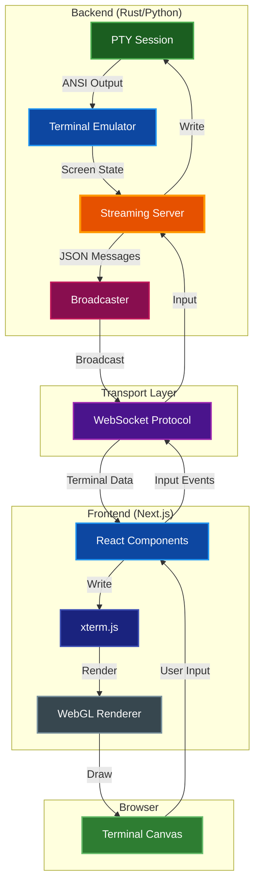
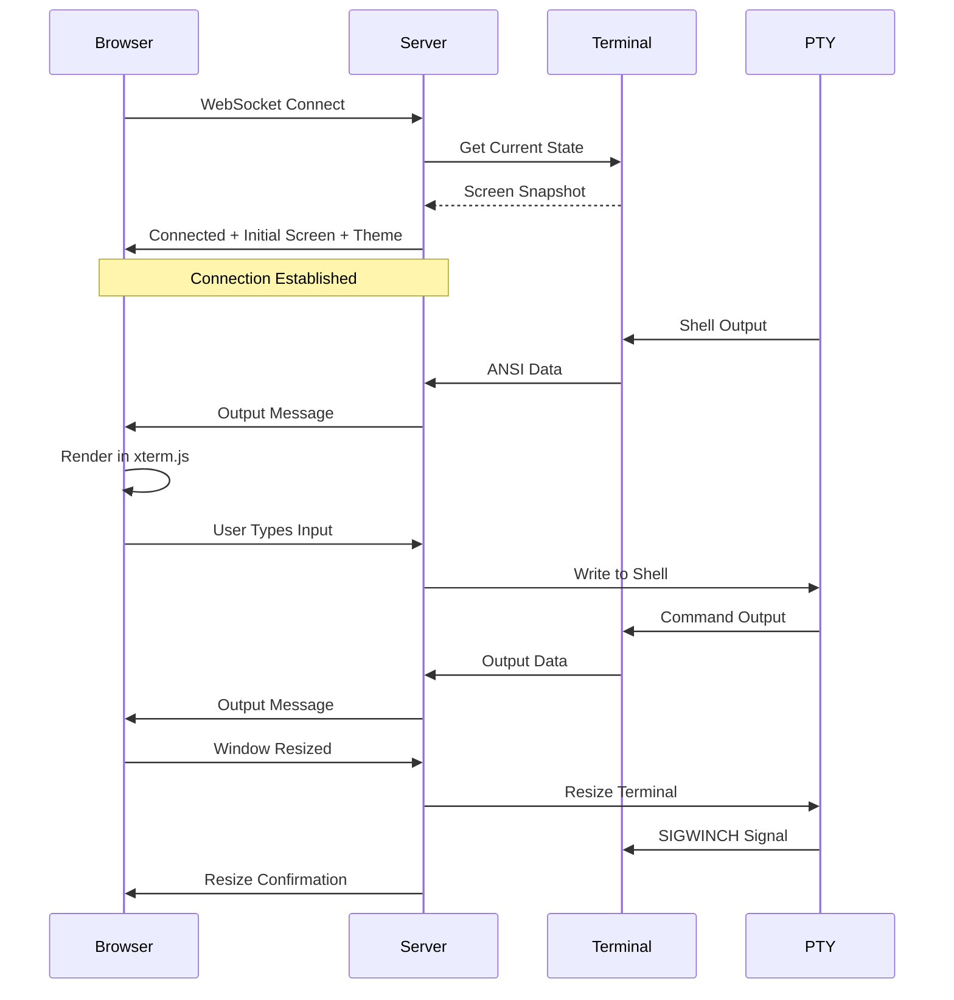
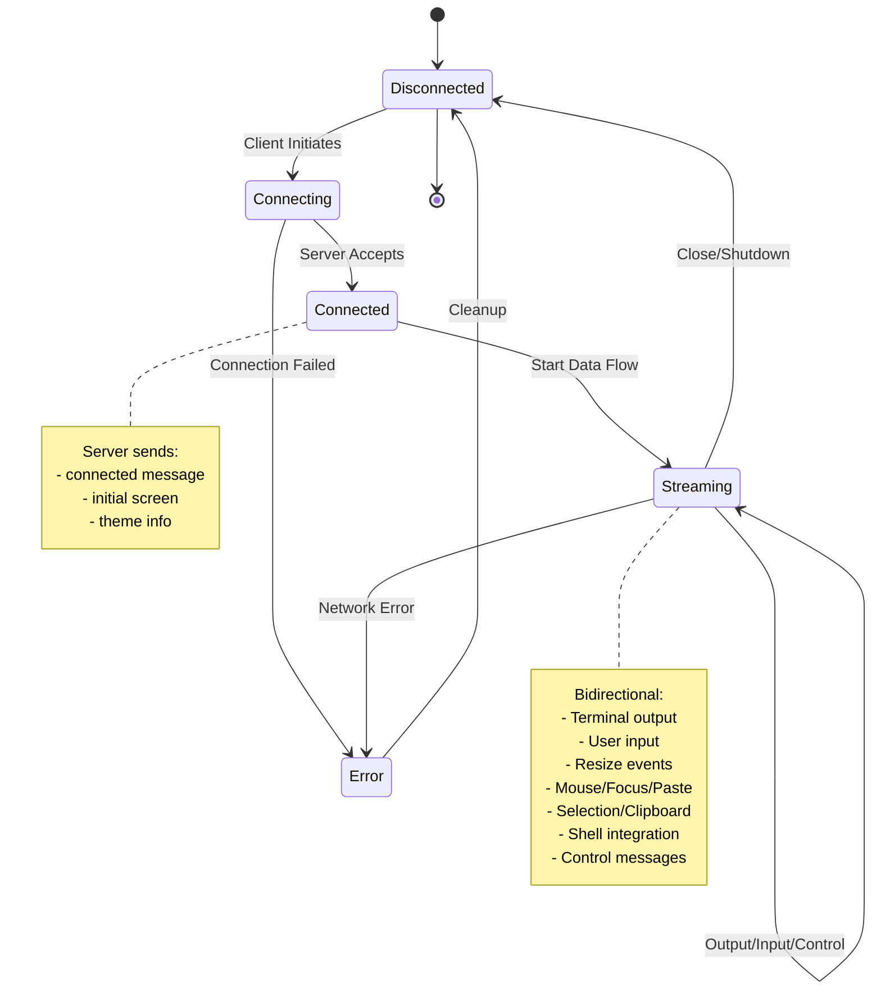

# Terminal Streaming

Real-time terminal streaming over WebSocket with browser-based frontend for remote terminal access and viewing.

## Table of Contents
- [Overview](#overview)
- [Architecture](#architecture)
  - [System Components](#system-components)
  - [Data Flow](#data-flow)
  - [WebSocket Protocol](#websocket-protocol)
- [Server Implementation](#server-implementation)
  - [Rust Standalone Server](#rust-standalone-server)
  - [Python Integration](#python-integration)
  - [Configuration](#configuration)
- [Web Frontend](#web-frontend)
  - [Technology Stack](#technology-stack)
  - [Setup and Development](#setup-and-development)
  - [Mobile Support](#mobile-support)
  - [Theme System](#theme-system)
- [Protocol Specification](#protocol-specification)
  - [Server Messages](#server-messages)
  - [Client Messages](#client-messages)
  - [Connection Flow](#connection-flow)
  - [Event Subscription](#event-subscription)
  - [Mouse, Focus, and Paste](#mouse-focus-and-paste)
- [Usage Examples](#usage-examples)
  - [Rust Server](#rust-server)
  - [Python Server](#python-server)
  - [Frontend Connection](#frontend-connection)
- [HTTP Endpoints](#http-endpoints)
  - [Terminal WebSocket](#terminal-websocket-ws)
  - [Sessions Endpoint](#sessions-endpoint-sessions)
  - [System Stats WebSocket](#system-stats-websocket-stats)
- [Advanced Features](#advanced-features)
  - [Multiple Viewers](#multiple-viewers)
  - [Read-Only Mode](#read-only-mode)
  - [Macro Playback](#macro-playback)
  - [HTTP Static File Serving](#http-static-file-serving)
  - [Zone Events](#zone-events)
  - [Semantic Snapshots](#semantic-snapshots)
  - [Environment and Remote Host Tracking](#environment-and-remote-host-tracking)
  - [File Transfer Events](#file-transfer-events)
- [TLS/SSL Configuration](#tlsssl-configuration)
- [Security Considerations](#security-considerations)
- [Performance](#performance)
- [Troubleshooting](#troubleshooting)
- [Related Documentation](#related-documentation)

## Overview

The streaming system enables real-time terminal viewing and interaction through web browsers using WebSocket connections. It consists of:

- **Streaming Server**: Rust/Python server that captures terminal output and forwards it via WebSocket
- **Web Frontend**: Next.js/React application with xterm.js for browser-based terminal rendering
- **Protocol**: Binary Protocol Buffers with optional zlib compression for efficient terminal data, input, and control

**Key Features:**
- Sub-100ms latency for local connections
- Multiple concurrent viewers per terminal session
- Bidirectional communication (view and control)
- Optional read-only mode for viewers
- Color theme synchronization
- Automatic resize handling
- Graphics protocol support (Sixel, Kitty, iTerm2)
- Unicode and emoji support
- Mouse event forwarding (all modes and encodings)
- Focus tracking and bracketed paste support
- Selection and clipboard synchronization
- Shell integration event streaming (FinalTerm/OSC 133)
- Per-client event subscription filtering
- Badge change notifications

## Architecture

### System Components



### Data Flow



### WebSocket Protocol

The streaming protocol uses binary Protocol Buffers messages with optional compression:

**Wire Format:**
```
+----------------+------------------+
| 1 byte: flags  | N bytes: payload |
+----------------+------------------+

Flags byte:
  0x00 = uncompressed protobuf
  0x01 = zlib-compressed protobuf (automatically applied for payloads > 1KB)
```

**Protocol Definition:** See `proto/terminal.proto` for the complete schema.

**Compression Behavior:**
- Small messages (≤ 1KB): Sent uncompressed (flag = 0x00)
- Large messages (> 1KB): Automatically compressed with zlib (flag = 0x01)
- Both client and server automatically handle compression/decompression based on the flag

**Connection Lifecycle:**
1. Client connects to WebSocket endpoint
2. Server sends `connected` message with initial screen
3. Bidirectional streaming begins
4. Client/server can send control messages (resize, ping, etc.)
5. Connection closes gracefully or on error

## Server Implementation

### Rust Standalone Server

The `par-term-streamer` binary (defined in `src/bin/streaming_server.rs`) provides a standalone streaming server:

**Build:**
```bash
# Using Makefile (recommended)
make streamer-build-release

# Or directly with cargo
cargo build --release --bin par-term-streamer --features streaming
```

**Run:**
```bash
# Basic usage
par-term-streamer --host 127.0.0.1 --port 8099

# With custom terminal size (using --size shorthand)
par-term-streamer --size 120x40

# Or using separate --cols and --rows
par-term-streamer --cols 120 --rows 40

# Use current terminal size from TTY
par-term-streamer --use-tty-size

# With an initial command (executed after 1 second delay)
par-term-streamer --command "htop"
par-term-streamer -c "vim README.md"

# With theme
par-term-streamer --theme dracula

# With HTTP static file serving
par-term-streamer --enable-http --web-root ./web_term

# Download prebuilt web frontend from GitHub releases
par-term-streamer --download-frontend --web-root ./web_term

# Download specific version of web frontend
par-term-streamer --download-frontend --frontend-version 0.14.0 --web-root ./web_term

# Macro playback mode
par-term-streamer --macro-file demo.yaml --macro-loop --macro-speed 1.5

# With HTTP Basic Authentication (password protection)
par-term-streamer --enable-http --http-user admin --http-password secret
par-term-streamer --enable-http --http-user admin --http-password-hash '$apr1$...'
par-term-streamer --enable-http --http-user admin --http-password-file /path/to/password

# With API key authentication (protects API routes: /ws, /sessions, /stats)
par-term-streamer --enable-http --api-key my-secret-key

# Combined: API key + HTTP Basic Auth (either satisfies auth)
par-term-streamer --enable-http --http-user admin --http-password secret --api-key my-secret-key
```

**Environment Variables:**

All CLI options support environment variables with `PAR_TERM_` prefix:

```bash
# Server configuration
export PAR_TERM_HOST=0.0.0.0
export PAR_TERM_PORT=8099
export PAR_TERM_THEME=dracula

# API Key Authentication
export PAR_TERM_API_KEY=my-secret-key

# HTTP Basic Authentication
export PAR_TERM_HTTP_USER=admin
export PAR_TERM_HTTP_PASSWORD=secret
# Or use hash: export PAR_TERM_HTTP_PASSWORD_HASH='$apr1$...'
# Or use file: export PAR_TERM_HTTP_PASSWORD_FILE=/path/to/password

# TLS configuration
export PAR_TERM_TLS_CERT=/path/to/cert.pem
export PAR_TERM_TLS_KEY=/path/to/key.pem

# Then run with minimal flags
par-term-streamer --enable-http
```

| Environment Variable | CLI Option | Description |
|---------------------|------------|-------------|
| `PAR_TERM_HOST` | `--host` | Server bind address |
| `PAR_TERM_PORT` | `--port` | Server port |
| `PAR_TERM_SIZE` | `--size` | Terminal size (COLSxROWS) |
| `PAR_TERM_COLS` | `--cols` | Terminal columns |
| `PAR_TERM_ROWS` | `--rows` | Terminal rows |
| `PAR_TERM_THEME` | `--theme` | Color theme |
| `PAR_TERM_HTTP_USER` | `--http-user` | HTTP Basic Auth username |
| `PAR_TERM_HTTP_PASSWORD` | `--http-password` | HTTP Basic Auth password (clear text) |
| `PAR_TERM_HTTP_PASSWORD_HASH` | `--http-password-hash` | HTTP Basic Auth password (htpasswd hash) |
| `PAR_TERM_HTTP_PASSWORD_FILE` | `--http-password-file` | Password file path |
| `PAR_TERM_TLS_CERT` | `--tls-cert` | TLS certificate file |
| `PAR_TERM_TLS_KEY` | `--tls-key` | TLS private key file |
| `PAR_TERM_TLS_PEM` | `--tls-pem` | Combined TLS PEM file |
| `PAR_TERM_ENABLE_HTTP` | `--enable-http` | Enable HTTP serving |
| `PAR_TERM_WEB_ROOT` | `--web-root` | Static files directory |
| `PAR_TERM_API_KEY` | `--api-key` | WebSocket API key |
| `PAR_TERM_MAX_SESSIONS` | `--max-sessions` | Maximum concurrent sessions |
| `PAR_TERM_SESSION_IDLE_TIMEOUT` | `--session-idle-timeout` | Idle session timeout (seconds) |
| `PAR_TERM_ENABLE_SYSTEM_STATS` | `--enable-system-stats` | Enable system stats collection |
| `PAR_TERM_SYSTEM_STATS_INTERVAL` | `--system-stats-interval` | Stats collection interval (seconds) |
| `PAR_TERM_ALLOW_API_KEY_IN_QUERY` | `--allow-api-key-in-query` | Allow API key in URL query param (not recommended) |
| `PAR_TERM_MAX_CLIENTS_PER_SESSION` | `--max-clients-per-session` | Maximum clients per session (0=unlimited) |
| `PAR_TERM_INPUT_RATE_LIMIT` | `--input-rate-limit` | Input rate limit (bytes/sec, 0=unlimited) |

**Download Web Frontend:**

The `--download-frontend` option downloads the prebuilt web frontend from GitHub releases, so you don't need Node.js/npm installed:

```bash
# Download latest version to default location (./web_term)
par-term-streamer --download-frontend

# Download to custom location
par-term-streamer --download-frontend --web-root /path/to/web

# Download specific version
par-term-streamer --download-frontend --frontend-version 0.14.0

# Then run server with downloaded frontend
par-term-streamer --enable-http --web-root ./web_term
```

**Available Themes:**
- `iterm2-dark` (default) - iTerm2 Dark color scheme
- `monokai` - Monokai color scheme
- `dracula` - Dracula color scheme
- `solarized-dark` - Solarized Dark color scheme

> **Note:** Theme names are case-sensitive and must use lowercase with hyphens.

### Python Integration

**Basic Usage:**

```python
import par_term_emu_core_rust as terminal_core
import time

# Create PTY terminal
pty_terminal = terminal_core.PtyTerminal(80, 24, 10000)

# Start shell
pty_terminal.spawn_shell()

# Create streaming server (automatically sets up output callback)
addr = "127.0.0.1:8080"
streaming_server = terminal_core.StreamingServer(pty_terminal, addr)

# Start server (non-blocking, spawns background thread)
streaming_server.start()

# Main loop
while pty_terminal.is_running():
    # Handle resize requests from clients
    resize = streaming_server.poll_resize()
    if resize:
        cols, rows = resize
        pty_terminal.resize(cols, rows)
        streaming_server.send_resize(cols, rows)

    time.sleep(0.1)

# Cleanup
streaming_server.shutdown("Server stopping")
```

**Creating a Custom StreamingConfig:**

```python
import par_term_emu_core_rust as terminal_core

# Create a custom configuration
config = terminal_core.StreamingConfig(
    max_clients=50,
    send_initial_screen=True,
    keepalive_interval=30,
    default_read_only=False,
    initial_cols=120,
    initial_rows=40,
    enable_http=True,
    web_root="./my_web_frontend",
    enable_system_stats=True,
    system_stats_interval_secs=5,
    api_key="my-secret-key"  # Protect /ws, /sessions, /stats
)

# Create server with custom config
pty_terminal = terminal_core.PtyTerminal(80, 24)
pty_terminal.spawn_shell()
server = terminal_core.StreamingServer(pty_terminal, "127.0.0.1:8099", config)
```

**Configuring TLS:**

```python
import par_term_emu_core_rust as terminal_core

# Create config
config = terminal_core.StreamingConfig()

# From separate certificate and key files
config.set_tls_from_files("cert.pem", "key.pem")

# Or from combined PEM file
config.set_tls_from_pem("combined.pem")

# Check TLS status
print(f"TLS enabled: {config.tls_enabled}")  # True

# Disable TLS if needed
config.disable_tls()

# Use config with server
pty_terminal = terminal_core.PtyTerminal(80, 24)
pty_terminal.spawn_shell()
server = terminal_core.StreamingServer(pty_terminal, "0.0.0.0:8099", config)
server.start()

# Clients must now use wss://host:8099/ws
```

**Setting an API Key:**

```python
import par_term_emu_core_rust as terminal_core

# Via constructor
config = terminal_core.StreamingConfig(api_key="my-secret-key")

# Or via setter
config = terminal_core.StreamingConfig()
config.set_api_key("my-secret-key")

# Allow API key in query parameter (disabled by default for security)
config.allow_api_key_in_query = True

# Check if API key is set
if config.api_key:
    print("API key configured")

# Create server with API key protection
pty_terminal = terminal_core.PtyTerminal(80, 24)
pty_terminal.spawn_shell()
server = terminal_core.StreamingServer(pty_terminal, "127.0.0.1:8099", config)
server.start()

# Clients must authenticate via:
#   - Header: Authorization: Bearer my-secret-key
#   - Header: X-API-Key: my-secret-key
#   - Query:  ws://localhost:8099/ws?api_key=my-secret-key
```

### Configuration

**StreamingConfig:**

| Option | Type | Default | Description |
|--------|------|---------|-------------|
| `max_clients` | usize | 1000 | Maximum concurrent client connections |
| `send_initial_screen` | bool | true | Send screen snapshot on connect |
| `keepalive_interval` | u64 | 30 | Ping interval in seconds (0=disabled) |
| `default_read_only` | bool | false | New clients read-only by default |
| `enable_http` | bool | false | Enable HTTP static file serving (requires Axum) |
| `web_root` | String | "./web_term" | Web root directory for static files |
| `initial_cols` | u16 | 0 | Initial terminal columns (0=use terminal's current size) |
| `initial_rows` | u16 | 0 | Initial terminal rows (0=use terminal's current size) |
| `tls` | Option\<TlsConfig\> | None | TLS configuration for HTTPS/WSS (see [TLS Configuration](#tlsssl-configuration)). Uses rustls for cross-platform compatibility |
| `http_basic_auth` | Option\<HttpBasicAuthConfig\> | None | HTTP Basic Authentication for web frontend protection (username + password/hash) |
| `max_sessions` | usize | 10 | Maximum concurrent terminal sessions |
| `session_idle_timeout` | u64 | 900 | Idle session timeout in seconds (0=never timeout) |
| `presets` | HashMap | {} | Shell presets: name → command mapping |
| `max_clients_per_session` | usize | 0 | Maximum clients per session (0=unlimited) |
| `input_rate_limit_bytes_per_sec` | usize | 0 | Input rate limit (0=unlimited) |
| `enable_system_stats` | bool | false | Enable system resource statistics collection (CPU, memory, disk, network) |
| `system_stats_interval_secs` | u64 | 5 | System stats collection interval in seconds |
| `api_key` | Option\<String\> | None | API key for authenticating API routes (`/ws`, `/sessions`, `/stats`). Accepted via `Authorization: Bearer <key>`, `X-API-Key: <key>` header, or `?api_key=<key>` query param. When both API key and Basic Auth are configured, either satisfies auth. Static files remain unprotected so the web frontend loads without auth. |
| `allow_api_key_in_query` | bool | false | Allow API key authentication via query parameter (?api_key=...). Disabled by default because query params are logged by proxies/firewalls, saved in browser history, and leaked via Referer headers. |

**Python Example:**
```python
config = terminal_core.StreamingConfig(
    max_clients=100,
    send_initial_screen=True,
    keepalive_interval=30,
    default_read_only=False,
    initial_cols=120,
    initial_rows=40
)

server = terminal_core.StreamingServer(pty_terminal, addr, config)
```

**Rust Example:**
```rust
use par_term_emu_core_rust::streaming::{
    HttpBasicAuthConfig, StreamingConfig, StreamingServer, TlsConfig
};
use std::sync::{Arc, Mutex};

let config = StreamingConfig {
    max_clients: 100,
    send_initial_screen: true,
    keepalive_interval: 30,
    default_read_only: false,
    enable_http: true,
    web_root: "./web_term".to_string(),
    initial_cols: 120,
    initial_rows: 40,
    tls: None, // Or Some(TlsConfig::from_files("cert.pem", "key.pem")?)
    http_basic_auth: Some(HttpBasicAuthConfig::with_password(
        "admin".to_string(),
        "secret".to_string(),
    )), // Or None for no auth
    api_key: Some("my-secret-key".to_string()), // Or None for no API key auth
    allow_api_key_in_query: false, // Set to true to allow ?api_key= in URL (not recommended)
    ..Default::default()
};

let server = StreamingServer::with_config(terminal, addr, config);
```

## Web Frontend

### Technology Stack

**Core Dependencies:**
- **Next.js** 16.0+ - React framework with App Router (configured for static export)
- **React** 19.0+ - UI library
- **TypeScript** 5.9+ - Type safety
- **Tailwind CSS** 4.1+ - Utility-first styling

**Protocol Buffers:**
- **@bufbuild/protobuf** 2.10+ - Protocol Buffers runtime for binary message encoding/decoding
- **@bufbuild/buf** 1.61+ - Buf CLI for proto code generation
- **pako** 2.1+ - Zlib compression/decompression for large messages (> 1KB)

**Terminal Components:**
- **@xterm/xterm** 5.5+ - Terminal emulator core with VT sequences support
- **@xterm/addon-fit** 0.10+ - Auto-sizing addon for responsive layouts
- **@xterm/addon-webgl** 0.18+ - Hardware-accelerated WebGL renderer (60 FPS)
- **@xterm/addon-web-links** 0.11+ - Clickable URLs in terminal output
- **@xterm/addon-unicode11** 0.8+ - Unicode 11 support for emojis and wide characters

### Setup and Development

**Quick Start (Using Makefile):**
```bash
# Install dependencies
make web-install

# Run development server
make web-dev

# Build static export and copy to web_term/ directory
make web-build-static

# Clean build artifacts
make web-clean
```

**Manual Setup:**
```bash
cd web-terminal-frontend

# Install dependencies
npm install

# Development server (binds to 0.0.0.0:3000 for mobile testing)
npm run dev

# Production build (creates Next.js server build)
npm run build
npm run start

# Static export build (creates static HTML/JS in 'out' directory)
npm run build  # Next.js configured with output: 'export'
```

**Mobile Development Testing:**
```bash
# Start dev server (binds to all interfaces)
npm run dev

# Access from mobile device on same network:
# http://<your-computer-ip>:3000
# Example: http://192.168.1.100:3000
```

**Project Structure:**
```
web-terminal-frontend/
├── app/
│   ├── globals.css       # Global styles and Tailwind
│   ├── layout.tsx        # Root layout with fonts
│   └── page.tsx          # Main page component
├── components/
│   └── Terminal.tsx      # Terminal component with xterm.js
├── lib/
│   └── proto/
│       └── terminal_pb.ts  # Generated Protocol Buffers types
├── buf.gen.yaml          # Buf code generation config
├── next.config.js        # Next.js configuration
├── tailwind.config.ts    # Tailwind configuration
└── package.json          # Dependencies
```

**Regenerating Protocol Buffers:**
```bash
# After modifying proto/terminal.proto
cd web-terminal-frontend
npm run proto:generate
```

**Component Overview:**

- `app/page.tsx`: Main application UI with connection controls and status indicator
- `components/Terminal.tsx`: xterm.js integration with binary WebSocket handling, mouse/focus/paste forwarding
- `lib/protocol.ts`: Message encoding/decoding with helper factories (`createInputMessage`, `createResizeMessage`, `createMouseMessage`, `createFocusMessage`, `createPasteMessage`, `createSubscribeMessage`, `createSnapshotRequestMessage`, etc.)
- `lib/proto/terminal_pb.ts`: Generated Protocol Buffers types (from `proto/terminal.proto`)
- `next.config.js`: Configures Next.js for static export (`output: 'export'`)

### Mobile Support

The web frontend is fully responsive and optimized for mobile devices:

**Responsive Features:**

| Feature | Mobile | Tablet | Desktop |
|---------|--------|--------|---------|
| Font Size | 4-5px | 6-10px | 14px |
| Scrollback | 500 lines | 500 lines | 1000 lines |
| Cursor Blink | Disabled | Disabled | Enabled |
| UI Controls | Hideable | Hideable | Always visible |

**Adaptive Font Sizing:**
```typescript
// Font size automatically adjusts based on screen dimensions
const getResponsiveFontSize = (): number => {
  const width = window.innerWidth;
  const height = window.innerHeight;
  const minDim = Math.min(width, height);

  if (minDim < 500) {
    // Phone: use height-based sizing for landscape
    return height < width ? (height < 400 ? 4 : 5) : 4;
  }
  if (minDim < 768) return 6;    // Small tablets
  if (width < 1024) return 10;   // Tablets
  return 14;                      // Desktop
};
```

**Mobile-Specific Optimizations:**
- **Hideable Header/Footer**: Toggle button to maximize terminal space on small screens
- **Touch Support**: Tap terminal to activate mobile keyboard
- **Orientation Handling**: Automatic refit on orientation change
- **Battery Savings**: Cursor blink disabled on mobile devices
- **Reduced Scrollback**: 500 lines vs 1000 to conserve memory

**Auto-Reconnect:**
- Exponential backoff: 500ms → 1s → 2s → 4s → 5s (max)
- Infinite retry with cancel button
- Connection state preserved across reconnects

**UI Toggle:**
```
┌─────────────────────────────────┐
│ [Header - WebSocket URL input]  │  ← Hideable
├─────────────────────────────────┤
│                                 │
│         Terminal Area           │  ← Expands when controls hidden
│                                 │
├─────────────────────────────────┤
│ [Footer - Links]                │  ← Hideable
└─────────────────────────────────┘
         [▼] Toggle Button          ← Always visible
```

**React StrictMode Compatibility:**
The terminal component handles React 18's StrictMode double-invocation pattern by preserving the xterm.js instance across the unmount/remount cycle, preventing duplicate terminals in the DOM.

### Theme System

There are **two separate theme systems** in the web frontend:

1. **Terminal Emulator Theme** - ANSI colors sent from the server (see below)
2. **UI Chrome Theme** - Status bar, buttons, containers (editable CSS file)

#### UI Chrome Theme (Customizable Without Rebuild)

The UI chrome colors are defined in `theme.css`, which is **not bundled** during build. You can edit this file after deployment without rebuilding:

**Location:** `web_term/theme.css` (after static build)

```css
:root {
  --terminal-bg: #0a0a0a;      /* Main background */
  --terminal-surface: #1a1a1a; /* Status bar, cards */
  --terminal-border: #2a2a2a;  /* Borders */
  --terminal-accent: #3a3a3a;  /* Scrollbar, accents */
  --terminal-text: #e0e0e0;    /* Primary text */
}
```

To customize: Edit the file and refresh the page. No rebuild required.

#### Terminal Emulator Theme (Server-Controlled)

The server can send color theme information to clients on connection:

**Theme Structure:**
```typescript
interface ThemeInfo {
  name: string;
  background: [number, number, number];
  foreground: [number, number, number];
  normal: [
    [number, number, number],  // 0: black
    [number, number, number],  // 1: red
    [number, number, number],  // 2: green
    [number, number, number],  // 3: yellow
    [number, number, number],  // 4: blue
    [number, number, number],  // 5: magenta
    [number, number, number],  // 6: cyan
    [number, number, number],  // 7: white
  ];
  bright: [
    [number, number, number],  // 8: bright black
    // ... 9-15: bright variants
  ];
}
```

**Client-Side Theme Application:**
```typescript
// Received in connected message
const applyTheme = (theme: ThemeInfo) => {
  xtermRef.current.options.theme = {
    background: rgbToHex(theme.background),
    foreground: rgbToHex(theme.foreground),
    black: rgbToHex(theme.normal[0]),
    red: rgbToHex(theme.normal[1]),
    // ... map all 16 colors
  };
};
```

## Protocol Specification

The protocol is defined in `proto/terminal.proto`. Messages use Protocol Buffers (protobuf) binary encoding with a 1-byte compression header, processed by the `prost` library in Rust and `@bufbuild/protobuf` in TypeScript.

### Server Messages (ServerMessage oneof)

| Message | Fields | Description |
|---------|--------|-------------|
| `output` | `data: bytes`, `timestamp?: uint64` | Terminal output data |
| `resize` | `cols: uint32`, `rows: uint32` | Terminal size changed |
| `title` | `title: string` | Terminal title changed |
| `connected` | `cols`, `rows`, `initial_screen?: bytes`, `session_id: string`, `theme?: ThemeInfo`, `badge?: string`, `faint_text_alpha?: float`, `cwd?: string`, `modify_other_keys?: uint32`, `client_id?: string`, `readonly?: bool` | Connection established |
| `refresh` | `cols`, `rows`, `screen_content: bytes` | Full screen content |
| `cursor` | `col: uint32`, `row: uint32`, `visible: bool` | Cursor position |
| `bell` | (none) | Bell event |
| `cwd_changed` | `old_cwd?: string`, `new_cwd: string`, `hostname?: string`, `username?: string`, `timestamp?: uint64` | Working directory changed (OSC 7) |
| `trigger_matched` | `trigger_id: uint64`, `row: uint32`, `col: uint32`, `end_col: uint32`, `text: string`, `captures: string[]`, `timestamp: uint64` | Trigger pattern matched |
| `action_notify` | `trigger_id: uint64`, `title: string`, `message: string` | Trigger action: notification |
| `action_mark_line` | `trigger_id: uint64`, `row: uint32`, `label?: string`, `color?: Color` | Trigger action: mark line |
| `mode_changed` | `mode: string`, `enabled: bool` | Terminal mode changed (cursor visibility, mouse tracking, etc.) |
| `graphics_added` | `row: uint32`, `format?: string` | Graphics/image added (Sixel, iTerm2, Kitty) |
| `hyperlink_added` | `url: string`, `row: uint32`, `col: uint32`, `id?: string` | Hyperlink added (OSC 8) |
| `user_var_changed` | `name: string`, `value: string`, `old_value?: string` | User variable changed (OSC 1337 SetUserVar) |
| `progress_bar_changed` | `action: string`, `id: string`, `state?: string`, `percent?: uint32`, `label?: string` | Named progress bar changed (OSC 934) |
| `badge_changed` | `badge?: string` | Badge text changed (OSC 1337 SetBadgeFormat) |
| `selection_changed` | `start_col?: uint32`, `start_row?: uint32`, `end_col?: uint32`, `end_row?: uint32`, `text?: string`, `mode: string`, `cleared: bool` | Selection state changed |
| `clipboard_sync` | `operation: string`, `content: string`, `target?: string` | Clipboard content sync (OSC 52) |
| `shell_integration_event` | `event_type: string`, `command?: string`, `exit_code?: int32`, `timestamp?: uint64`, `cursor_line?: uint64` | Shell integration marker (FinalTerm OSC 133) |
| `system_stats` | `cpu?, memory?, disks[], networks[], load_average?, hostname?, os_name?, os_version?, kernel_version?, uptime_secs?, timestamp?` | System resource statistics (requires `--enable-system-stats`) |
| `zone_opened` | `zone_id: uint64`, `zone_type: string`, `abs_row_start: uint64` | Zone opened (prompt, command, or output block started) |
| `zone_closed` | `zone_id: uint64`, `zone_type: string`, `abs_row_start: uint64`, `abs_row_end: uint64`, `exit_code?: int32` | Zone closed (prompt, command, or output block ended) |
| `zone_scrolled_out` | `zone_id: uint64`, `zone_type: string` | Zone evicted from scrollback |
| `environment_changed` | `key: string`, `value: string`, `old_value?: string` | Environment variable changed |
| `remote_host_transition` | `hostname: string`, `username?: string`, `old_hostname?: string`, `old_username?: string` | Remote host transition detected |
| `sub_shell_detected` | `depth: uint64`, `shell_type?: string` | Sub-shell detected |
| `semantic_snapshot` | `snapshot_json: string` | Semantic snapshot of terminal state (JSON-encoded) |
| `file_transfer_started` | `id: uint64`, `direction: string`, `filename?: string`, `total_bytes?: uint64` | File transfer started (download or upload) |
| `file_transfer_progress` | `id: uint64`, `bytes_transferred: uint64`, `total_bytes?: uint64` | File transfer progress update |
| `file_transfer_completed` | `id: uint64`, `filename?: string`, `size: uint64` | File transfer completed successfully |
| `file_transfer_failed` | `id: uint64`, `reason: string` | File transfer failed |
| `upload_requested` | `format: string` | Upload requested by terminal application |
| `error` | `message: string`, `code?: string` | Error occurred |
| `shutdown` | `reason: string` | Server shutting down |
| `pong` | (none) | Keepalive response |

### Client Messages (ClientMessage oneof)

| Message | Fields | Description |
|---------|--------|-------------|
| `input` | `data: bytes` | Keyboard input |
| `resize` | `cols: uint32`, `rows: uint32` | Request terminal resize |
| `ping` | (none) | Keepalive ping |
| `refresh` | (none) | Request full screen refresh |
| `subscribe` | `events: EventType[]` | Subscribe to specific event types (filters server messages) |
| `mouse` | `col: uint32`, `row: uint32`, `button: uint32`, `shift: bool`, `ctrl: bool`, `alt: bool`, `event_type: string` | Mouse input (press/release/move/scroll) |
| `focus` | `focused: bool` | Window focus change (in/out) |
| `paste` | `content: string` | Paste content (auto-wrapped in bracketed paste when active) |
| `selection` | `start_col: uint32`, `start_row: uint32`, `end_col: uint32`, `end_row: uint32`, `mode: string` | Selection request (chars/line/block/word/clear) |
| `clipboard` | `operation: string`, `content?: string`, `target?: string` | Clipboard get/set request |
| `snapshot_request` | `scope: string`, `max_commands?: uint32` | Request a semantic snapshot (scope: "visible", "recent", "full") |

### ThemeInfo Structure

The theme information is sent from server to client during the `connected` message handshake:

```protobuf
message ThemeInfo {
  string name = 1;              // Theme name (e.g., "iterm2-dark")
  Color background = 2;         // Background color RGB
  Color foreground = 3;         // Foreground (text) color RGB
  repeated Color normal = 4;    // 8 normal ANSI colors (indices 0-7)
  repeated Color bright = 5;    // 8 bright ANSI colors (indices 8-15)
}

message Color {
  uint32 r = 1;  // Red component (0-255)
  uint32 g = 2;  // Green component (0-255)
  uint32 b = 3;  // Blue component (0-255)
}
```

**Implementation Notes:**
- Server applies theme to terminal and sends it to clients via `ThemeInfo`
- Client (xterm.js) applies the theme on connection for consistent colors
- Theme is synchronized across all connected clients

### Connection Flow



### Event Subscription

Clients can subscribe to specific event types to filter server messages and reduce bandwidth. By default, clients receive all events.

**EventType Values:**

| EventType | Value | Description |
|-----------|-------|-------------|
| `UNSPECIFIED` | 0 | Reserved |
| `OUTPUT` | 1 | Terminal output data |
| `CURSOR` | 2 | Cursor position updates |
| `BELL` | 3 | Bell events |
| `TITLE` | 4 | Title changes |
| `RESIZE` | 5 | Resize events |
| `CWD` | 6 | Working directory changes |
| `TRIGGER` | 7 | Trigger matches |
| `ACTION` | 8 | Trigger action results |
| `MODE` | 9 | Terminal mode changes |
| `GRAPHICS` | 10 | Graphics events |
| `HYPERLINK` | 11 | Hyperlink events |
| `USER_VAR` | 12 | User variable changes |
| `PROGRESS_BAR` | 13 | Progress bar changes |
| `BADGE` | 14 | Badge text changes |
| `SELECTION` | 15 | Selection changes |
| `CLIPBOARD` | 16 | Clipboard events |
| `SHELL` | 17 | Shell integration events |
| `SYSTEM_STATS` | 18 | System resource statistics |
| `ZONE` | 19 | Zone events (opened, closed, scrolled out) |
| `ENVIRONMENT` | 20 | Environment change events |
| `REMOTE_HOST` | 21 | Remote host transition events |
| `SUB_SHELL` | 22 | Sub-shell detection events |
| `SNAPSHOT` | 23 | Semantic snapshot events |
| `FILE_TRANSFER` | 24 | File transfer events (started, progress, completed, failed) |
| `UPLOAD_REQUEST` | 25 | Upload request events |

**Example (TypeScript):**
```typescript
import { EventType } from '@/lib/proto/terminal_pb';
import { createSubscribeMessage, encodeClientMessage } from '@/lib/protocol';

// Subscribe only to output, resize, and mode changes
const msg = createSubscribeMessage([
  EventType.OUTPUT,
  EventType.RESIZE,
  EventType.MODE,
]);
ws.send(encodeClientMessage(msg));
```

### Mouse, Focus, and Paste

The web frontend automatically handles mouse, focus, and paste events based on terminal mode state:

**Mouse Events:**
- When the server sends `modeChanged` with `mode: "mouse_tracking"` and `enabled: true`, the frontend captures mouse events (click, release, move, scroll) on the terminal element and sends `MouseInput` messages
- Mouse coordinates are translated from pixel positions to terminal cell coordinates
- Button values: 0=left, 1=middle, 2=right, 3=release, 4=scroll_up, 5=scroll_down
- Modifiers: shift, ctrl, alt bitmask

**Focus Events:**
- When the server sends `modeChanged` with `mode: "focus_tracking"` and `enabled: true`, the frontend sends `FocusChange` messages on window focus/blur

**Paste Events:**
- When the server sends `modeChanged` with `mode: "bracketed_paste"` and `enabled: true`, paste events are intercepted and sent as `PasteInput` messages (server wraps in bracketed paste escape sequences)
- When bracketed paste is not active, xterm.js handles paste normally as keyboard input

## Usage Examples

### Quick Start: Complete Setup

**Easiest Setup (Download Prebuilt Frontend):**

```bash
# 1. Build the streaming server
make streamer-build-release

# 2. Download prebuilt web frontend from GitHub releases
./target/release/par-term-streamer --download-frontend

# 3. Run the server with HTTP enabled
./target/release/par-term-streamer --enable-http

# 4. Open browser to http://127.0.0.1:8099
```

**End-to-End Setup with HTTP Server (Build Frontend Locally):**

```bash
# 1. Build the static web frontend (requires Node.js)
make web-build-static

# 2. Build the streaming server
make streamer-build-release

# 3. Run the server with HTTP enabled
make streamer-run-http

# 4. Open browser to http://127.0.0.1:8099
```

The server will:
- Serve the web frontend at `http://127.0.0.1:8099/`
- Accept WebSocket connections at `ws://127.0.0.1:8099/ws`
- Stream the terminal session in real-time

**WebSocket-Only Setup (No HTTP):**

```bash
# 1. Build and run streaming server
make streamer-build-release
./target/release/par-term-streamer --port 8099

# 2. In another terminal, run web frontend development server
make web-dev

# 3. Open browser to http://localhost:3000
# 4. Enter WebSocket URL: ws://127.0.0.1:8099
```

### Rust Server

**Using the Standalone Binary:**
```bash
# Build the streaming server binary
make streamer-build-release

# Run with default settings
./target/release/par-term-streamer

# Or using Makefile shortcuts
make streamer-run          # Run with default settings
make streamer-run-http     # Run with HTTP static file serving enabled
make streamer-run-macro    # Run with macro playback demo
```

**Basic Standalone Server (Rust Code):**
```rust
use par_term_emu_core_rust::{
    pty_session::PtySession,
    streaming::{StreamingConfig, StreamingServer},
};
use std::sync::{Arc, Mutex};
use anyhow::Result;

#[tokio::main]
async fn main() -> Result<()> {
    // Create PTY session
    let pty_session = PtySession::new(80, 24, 10000);
    let terminal = pty_session.terminal();
    let pty_session = Arc::new(Mutex::new(pty_session));

    // Spawn shell
    {
        let mut session = pty_session.lock();
        session.spawn_shell()?;
    }

    // Create streaming server
    let config = StreamingConfig::default();
    let server = Arc::new(StreamingServer::with_config(
        terminal,
        "127.0.0.1:8099".to_string(),
        config
    ));

    // Start server (this blocks until shutdown)
    server.start().await?;

    Ok(())
}
```

**With Output Callback:**
```rust
// Set up output forwarding from PTY to streaming server
let output_sender = server.get_output_sender();

{
    let mut session = pty_session.lock();
    session.set_output_callback(Arc::new(move |data| {
        // Convert raw bytes to UTF-8 string
        let text = String::from_utf8_lossy(data).to_string();
        // Forward to streaming server which broadcasts to all clients
        let _ = output_sender.send(text);
    }));
}
```

### Python Server

**Complete Example:**
```python
#!/usr/bin/env python3
import time
import select
import sys
import par_term_emu_core_rust as terminal_core

def main():
    # Create terminal
    pty_terminal = terminal_core.PtyTerminal(80, 24, 10000)

    # Apply theme (optional - can be done before or after creating server)
    pty_terminal.set_default_bg(0, 0, 0)
    pty_terminal.set_default_fg(255, 255, 255)

    # Set ANSI colors (0-15)
    colors = [
        (0, 0, 0),        # black
        (201, 27, 0),     # red
        # ... more colors
    ]
    for i, (r, g, b) in enumerate(colors):
        pty_terminal.set_ansi_palette_color(i, r, g, b)

    # Start shell (must be done BEFORE creating StreamingServer)
    pty_terminal.spawn_shell()

    # Create streaming server (automatically sets up output callback and PTY writer)
    addr = "127.0.0.1:8080"
    config = terminal_core.StreamingConfig(
        api_key="my-secret-key",           # Protect /ws, /sessions, /stats
        enable_system_stats=True,          # Enable CPU/memory/disk/network stats
        system_stats_interval_secs=5,      # Stats every 5 seconds
    )
    server = terminal_core.StreamingServer(pty_terminal, addr, config)

    # Start server in background thread (non-blocking)
    server.start()

    print(f"Streaming server running on ws://{addr}")

    try:
        while pty_terminal.is_running():
            # Handle resize requests from clients
            resize = server.poll_resize()
            if resize:
                cols, rows = resize
                print(f"Resizing to {cols}x{rows}")
                pty_terminal.resize(cols, rows)
                server.send_resize(cols, rows)

            # Broadcast terminal events to clients
            for event in pty_terminal.poll_events():
                if event.get("type") == "cwd_changed":
                    server.send_cwd_changed(
                        event["new_cwd"],
                        old_cwd=event.get("old_cwd"),
                        hostname=event.get("hostname"),
                    )
                elif event.get("type") == "trigger_matched":
                    server.send_trigger_matched(
                        event["trigger_id"], event["row"],
                        event["col"], event["end_col"], event["text"],
                    )
                elif event.get("type") == "progress_bar_changed":
                    server.send_progress_bar_changed(
                        event["action"], event["id"],
                        percent=event.get("percent"),
                        label=event.get("label"),
                    )

            # Check for user commands (Unix only)
            if sys.platform != 'win32':
                ready, _, _ = select.select([sys.stdin], [], [], 0)
                if ready:
                    cmd = sys.stdin.readline().strip()
                    if cmd == 's':
                        print(f"Clients: {server.client_count()}")

            time.sleep(0.1)

    except KeyboardInterrupt:
        print("\nShutting down...")

    finally:
        server.shutdown("Server stopping")
        print("Goodbye!")

if __name__ == '__main__':
    main()
```

### Frontend Connection

**Basic Connection (Binary Protocol Buffers):**

The protocol uses binary Protocol Buffers with a 1-byte compression header. See `web-terminal-frontend/lib/proto/terminal_pb.ts` for generated TypeScript types (auto-generated from `proto/terminal.proto` using `@bufbuild/buf`).

```typescript
import { create, toBinary, fromBinary } from "@bufbuild/protobuf";
import * as pako from "pako";
import {
  ClientMessageSchema,
  ServerMessageSchema,
  ClientResizeSchema,
  InputSchema,
  type ServerMessage,
} from "@/lib/proto/terminal_pb";

// When server has HTTP enabled, connect to /ws endpoint
// When server has TLS enabled, use wss:// instead of ws://
const ws = new WebSocket('ws://127.0.0.1:8099/ws');
ws.binaryType = 'arraybuffer';  // Required for binary protobuf messages

// Decode server message with decompression
function decodeServerMessage(data: ArrayBuffer): ServerMessage {
  const bytes = new Uint8Array(data);
  const flags = bytes[0];
  let payload = bytes.slice(1);

  // Decompress if flag is set (0x01)
  if (flags & 0x01) {
    payload = pako.inflate(payload);
  }

  return fromBinary(ServerMessageSchema, payload);
}

// Encode client message with optional compression
function encodeClientMessage(msg: ClientMessage): ArrayBuffer {
  const payload = toBinary(ClientMessageSchema, msg);

  // Compress if payload > 1KB (matches server behavior)
  if (payload.length > 1024) {
    const compressed = pako.deflate(payload);
    // Only use compression if it actually reduces size
    if (compressed.length < payload.length) {
      const result = new Uint8Array(compressed.length + 1);
      result[0] = 0x01; // Compressed flag
      result.set(compressed, 1);
      return result.buffer;
    }
  }

  // Send uncompressed for small messages or when compression doesn't help
  const result = new Uint8Array(payload.length + 1);
  result[0] = 0x00; // Uncompressed flag
  result.set(payload, 1);
  return result.buffer;
}

ws.onopen = () => {
  console.log('Connected');
  // Send initial resize
  const resizeMsg = create(ClientMessageSchema, {
    message: {
      case: "resize",
      value: create(ClientResizeSchema, {
        cols: terminal.cols,
        rows: terminal.rows,
      }),
    },
  });
  ws.send(encodeClientMessage(resizeMsg));
};

ws.onmessage = (event) => {
  const msg = decodeServerMessage(event.data);

  switch (msg.message.case) {
    case 'connected':
      console.log('Session:', msg.message.value.sessionId);
      if (msg.message.value.theme) applyTheme(msg.message.value.theme);
      if (msg.message.value.initialScreen) {
        const text = new TextDecoder().decode(msg.message.value.initialScreen);
        terminal.write(text);
      }
      break;

    case 'output':
      const outputText = new TextDecoder().decode(msg.message.value.data);
      terminal.write(outputText);
      break;

    case 'resize':
      terminal.resize(msg.message.value.cols, msg.message.value.rows);
      break;
  }
};

// Send user input
terminal.onData((data) => {
  const inputMsg = create(ClientMessageSchema, {
    message: {
      case: "input",
      value: create(InputSchema, {
        data: new TextEncoder().encode(data),
      }),
    },
  });
  ws.send(encodeClientMessage(inputMsg));
});
```

## HTTP Endpoints

When running with `--enable-http`, the streaming server exposes the following endpoints:

| Endpoint | Protocol | Description |
|----------|----------|-------------|
| `/` | HTTP | Static files from web root directory |
| `/ws` | WebSocket | Terminal streaming connection |
| `/sessions` | HTTP | List active terminal sessions (JSON) |
| `/stats` | WebSocket | System resource statistics stream (requires `--enable-system-stats`) |

### Terminal WebSocket (`/ws`)

The main terminal streaming endpoint. Clients connect here for bidirectional terminal communication.

```javascript
// Connect to terminal
const ws = new WebSocket('ws://localhost:8081/ws');

// With session selection
const ws = new WebSocket('ws://localhost:8081/ws?session=my-session');

// With shell preset
const ws = new WebSocket('ws://localhost:8081/ws?preset=zsh');

// With API key authentication
const ws = new WebSocket('ws://localhost:8081/ws?api_key=your-key');
```

### Sessions Endpoint (`/sessions`)

Returns JSON with active sessions info:

```bash
curl http://localhost:8081/sessions
```

Response:
```json
{
  "sessions": [
    {
      "id": "default",
      "clients": 1,
      "cols": 120,
      "rows": 40,
      "created": 1707840000,
      "idle_seconds": 5
    }
  ],
  "max_sessions": 10,
  "available": 9
}
```

### System Stats WebSocket (`/stats`)

Streams system resource statistics as JSON over WebSocket. Requires `--enable-system-stats` flag.

```bash
# Enable system stats when starting server
par-term-streamer --enable-http --enable-system-stats --system-stats-interval 5
```

```javascript
// Connect to stats stream
const ws = new WebSocket('ws://localhost:8081/stats');

ws.onmessage = (event) => {
  const stats = JSON.parse(event.data);
  console.log('CPU:', stats.cpu.overall_usage_percent, '%');
  console.log('Memory:', stats.memory.used_bytes, '/', stats.memory.total_bytes);
};
```

**Stats JSON Schema:**

```json
{
  "cpu": {
    "overall_usage_percent": 25.5,
    "physical_core_count": 8,
    "per_core_usage_percent": [30.0, 20.0, 25.0, 28.0, 22.0, 26.0, 24.0, 27.0],
    "brand": "Apple M1 Pro",
    "frequency_mhz": 3200
  },
  "memory": {
    "total_bytes": 17179869184,
    "used_bytes": 8589934592,
    "available_bytes": 8589934592,
    "swap_total_bytes": 2147483648,
    "swap_used_bytes": 0
  },
  "disks": [
    {
      "name": "disk0s1",
      "mount_point": "/",
      "total_bytes": 500000000000,
      "available_bytes": 250000000000,
      "kind": "SSD",
      "file_system": "APFS",
      "is_removable": false
    }
  ],
  "networks": [
    {
      "name": "en0",
      "received_bytes": 1024000,
      "transmitted_bytes": 512000,
      "total_received_bytes": 10240000,
      "total_transmitted_bytes": 5120000,
      "packets_received": 10000,
      "packets_transmitted": 5000,
      "errors_received": 0,
      "errors_transmitted": 0
    }
  ],
  "load_average": {
    "one_minute": 2.5,
    "five_minutes": 2.0,
    "fifteen_minutes": 1.8
  },
  "hostname": "my-server",
  "os_name": "macOS",
  "os_version": "14.0",
  "kernel_version": "23.0.0",
  "uptime_secs": 86400,
  "timestamp": 1707840000000
}
```

**Note:** System stats are also broadcast to all connected terminal WebSocket clients when enabled, in addition to being available via the dedicated `/stats` endpoint.

## Advanced Features

### Multi-Session Management

The streaming server supports hosting multiple independent terminal sessions simultaneously.

**Connecting to Sessions:**
- **Default Session:** Connect to `ws://host:port/ws` (creates a default session if none exists)
- **Named Session:** Connect to `ws://host:port/ws?session=my-dev-session` (joins or creates session "my-dev-session")
- **Shell Presets:** Connect to `ws://host:port/ws?preset=python` (creates a new session running the "python" preset command)

**Configuration:**
```python
config = StreamingConfig(
    max_sessions=10,              # Max concurrent sessions
    session_idle_timeout=900,     # Reap empty sessions after 15m
    presets={                     # Define shell presets
        "python": "python3",
        "top": "htop"
    }
)
```

**Client Isolation:**
- Each session has its own PTY, screen state, and history
- Clients in the same session see the same screen (shared state)
- Clients in different sessions are completely isolated

### Multiple Viewers

The server supports multiple concurrent viewers of the same terminal session:

**Broadcaster Architecture:**
```rust
// Server manages multiple clients
pub struct Broadcaster {
    clients: Arc<RwLock<HashMap<Uuid, Client>>>,
    max_clients: usize,
}

// Broadcast to all clients
broadcaster.broadcast(ServerMessage::output(data)).await;
```

**Client Limit:**
Configure maximum concurrent clients:
```python
config = terminal_core.StreamingConfig(max_clients=100)
```

### Read-Only Mode

Clients can be set to read-only mode to prevent input:

**Server Configuration:**
```python
config = terminal_core.StreamingConfig(default_read_only=True)
```

**Per-Client Control:**
```rust
let client = Client::new(ws_stream, read_only=true);
```

> **📝 Note:** Read-only clients receive all output but their input messages are silently ignored by the server.

### Macro Playback

The standalone server supports macro playback instead of shell:

**Record Macro:**
```python
# Record terminal session
pty_terminal.start_recording()
# ... perform actions ...
pty_terminal.stop_recording()
pty_terminal.save_macro_yaml("demo.yaml", "Demo Session", "Description")
```

**Playback:**
```bash
# Play macro to connected clients
par-term-streamer --macro-file demo.yaml --macro-speed 1.5 --macro-loop
```

**Use Cases:**
- Interactive demos
- Tutorial recordings
- Automated testing
- Presentation mode

### File Transfer Events

The streaming protocol supports bidirectional file transfer events compatible with iTerm2's OSC 1337 protocol.

**Server → Client Events:**
- `file_transfer_started`: Download/upload started (id, filename, total_bytes)
- `file_transfer_progress`: Progress update (bytes_transferred)
- `file_transfer_completed`: Transfer finished successully
- `file_transfer_failed`: Transfer failed or cancelled
- `upload_requested`: Host requested a file upload

**Handling in Frontend:**
Frontends should subscribe to these events and implement UI for:
1. **Downloads:** Show progress bar, and on completion, offer the file for saving (blob download)
2. **Uploads:** When `upload_requested` is received, open file picker, read file, and send data back via `input` message (encoded as base64 within the terminal stream)

### Zone Events

The streaming protocol reports semantic zone boundaries (prompt, command, output blocks) based on shell integration (OSC 133) sequences.

**Zone Types:**
- `prompt`: Shell prompt zone
- `command`: Command input zone
- `output`: Command output zone

**Server → Client Events:**
- `zone_opened`: Zone started (zone_id, zone_type, abs_row_start)
- `zone_closed`: Zone ended (zone_id, zone_type, abs_row_start, abs_row_end, exit_code for output zones)
- `zone_scrolled_out`: Zone evicted from scrollback (zone_id, zone_type)

**Use Cases:**
- Command history navigation
- Output block collapsing/expanding
- Semantic search within terminal output
- Exit code indicators on command blocks

### Semantic Snapshots

Clients can request a semantic snapshot of the terminal state for advanced UI features.

**Client Request:**
```typescript
const msg = createSnapshotMessage("recent", 10);  // Last 10 commands
ws.send(encodeClientMessage(msg));
```

**Scope Options:**
- `visible`: Current visible screen only
- `recent`: Last N commands (specify max_commands)
- `full`: Full scrollback history

**Server Response:**
- `semantic_snapshot`: JSON-encoded snapshot with command history, zones, exit codes

### Environment and Remote Host Tracking

The streaming protocol tracks environment changes and remote host transitions.

**Server → Client Events:**
- `environment_changed`: Environment variable changed (key, value, old_value) - typically for "cwd", "hostname", "username"
- `remote_host_transition`: SSH/su transition detected (hostname, username, old_hostname, old_username)
- `sub_shell_detected`: Nested shell detected (depth, shell_type)

**Use Cases:**
- Dynamic prompt rendering
- Remote host indicators in UI
- Shell nesting level display

### TLS/SSL Configuration

The streaming server supports TLS/SSL for secure HTTPS and WSS (WebSocket Secure) connections.

### CLI Options

**Using Separate Certificate and Key Files:**
```bash
par-term-streamer --enable-http --tls-cert /path/to/cert.pem --tls-key /path/to/key.pem
```

**Using Combined PEM File:**
```bash
par-term-streamer --enable-http --tls-pem /path/to/combined.pem
```

| Option | Description |
|--------|-------------|
| `--tls-cert <PATH>` | TLS certificate file (PEM format). Use with `--tls-key` |
| `--tls-key <PATH>` | TLS private key file (PEM format). Use with `--tls-cert` |
| `--tls-pem <PATH>` | Combined PEM file containing both certificate and private key |

### Rust API

```rust
use par_term_emu_core_rust::streaming::{StreamingConfig, StreamingServer, TlsConfig};

// From separate files
let tls = TlsConfig::from_files("cert.pem", "key.pem")?;

// From combined PEM
let tls = TlsConfig::from_pem("combined.pem")?;

let config = StreamingConfig {
    enable_http: true,
    tls: Some(tls),
    ..Default::default()
};

let server = StreamingServer::with_config(terminal, "0.0.0.0:8099".to_string(), config);
```

### Python API

```python
import par_term_emu_core_rust as terminal_core

config = terminal_core.StreamingConfig()

# From separate files
config.set_tls_from_files("cert.pem", "key.pem")

# Or from combined PEM
config.set_tls_from_pem("combined.pem")

# Check TLS status
print(config.tls_enabled)  # True

# Disable TLS
config.disable_tls()
```

### Generating Self-Signed Certificates (Development)

For local development and testing:

```bash
# Generate a self-signed certificate valid for 365 days
openssl req -x509 -newkey rsa:4096 -keyout key.pem -out cert.pem -days 365 -nodes \
  -subj "/CN=localhost"

# Or generate a combined PEM file
openssl req -x509 -newkey rsa:4096 -out combined.pem -days 365 -nodes \
  -subj "/CN=localhost" -keyout - >> combined.pem
```

> **⚠️ Warning:** Self-signed certificates will trigger browser warnings. For production, use certificates from a trusted Certificate Authority (e.g., Let's Encrypt).

> **ℹ️ Implementation Note:** The server uses rustls (not OpenSSL) for TLS, providing consistent cross-platform support.

### Let's Encrypt (Production)

For production deployments using certbot:

```bash
# Obtain certificate
sudo certbot certonly --standalone -d your-domain.com

# Certificate files location
# /etc/letsencrypt/live/your-domain.com/fullchain.pem (certificate)
# /etc/letsencrypt/live/your-domain.com/privkey.pem (key)

# Run server with Let's Encrypt certificate
par-term-streamer --enable-http \
  --tls-cert /etc/letsencrypt/live/your-domain.com/fullchain.pem \
  --tls-key /etc/letsencrypt/live/your-domain.com/privkey.pem
```

### Connection URLs with TLS

When TLS is enabled, clients must use secure URLs:

| Without TLS | With TLS |
|-------------|----------|
| `http://localhost:8099` | `https://localhost:8099` |
| `ws://localhost:8099/ws` | `wss://localhost:8099/ws` |

## Security Considerations

> **🔒 Security:** Streaming terminals exposes shell access over the network. Use appropriate security measures.

**Best Practices:**

1. **Network Binding:**
   - Bind to `127.0.0.1` for local-only access
   - Use firewall rules for remote access
   - Consider VPN or SSH tunneling

2. **Authentication & Encryption:**
   - **API Key** for API routes (`/ws`, `/sessions`, `/stats`): `--api-key` — clients authenticate via `Authorization: Bearer <key>`, `X-API-Key: <key>` header, or `?api_key=<key>` query param. Static files (web frontend) remain unprotected so the browser can load the page, then authenticate the WebSocket.
   - **HTTP Basic Auth** for API routes: `--http-user` with `--http-password`, `--http-password-hash`, or `--http-password-file`
   - When both API key and Basic Auth are configured, **either one satisfies authentication**
   - **Enable TLS for production** using `--tls-cert`/`--tls-key` or `--tls-pem` (see [TLS Configuration](#tlsssl-configuration))
   - Use `wss://` (secure WebSocket) instead of `ws://` in production
   - Uses rustls for cross-platform TLS support

3. **Input Validation:**
   - Server validates all client messages
   - Invalid protobuf messages are rejected
   - Text WebSocket messages are not supported (binary only)

4. **Resource Limits:**
   - Configure `max_clients` to prevent DoS
   - Implement connection timeouts
   - Monitor memory usage

5. **Access Control:**
   - Use read-only mode for viewers
   - Implement session-based permissions
   - Log all client connections

**Example with Authentication:**
```bash
# Server with API key (protects /ws, /sessions, /stats; static files remain public)
par-term-streamer --enable-http --api-key secret-token-here

# Server with HTTP Basic Auth (protects /ws, /sessions, /stats)
par-term-streamer --enable-http --http-user admin --http-password secret

# Server with htpasswd hash (bcrypt, apr1, sha1, md5crypt)
par-term-streamer --enable-http --http-user admin --http-password-hash '$apr1$xyz$hash...'

# Server with password from file (reads first line, auto-detects hash vs clear text)
par-term-streamer --enable-http --http-user admin --http-password-file /etc/par-term/password

# Combined: API key + HTTP Basic Auth (either satisfies auth)
par-term-streamer --enable-http --http-user admin --http-password secret --api-key ws-token

# Clients can authenticate API key via:
#   Header: Authorization: Bearer secret-token-here
#   Header: X-API-Key: secret-token-here
#   Query:  ws://localhost:8099/ws?api_key=secret-token-here
#
# Web frontend auto-passes api_key when loaded with:
#   http://localhost:8099/?api_key=secret-token-here
```

## Performance

**Latency:**
- Local connections: <100ms typical
- Network connections: Depends on network latency
- WebGL rendering: 60 FPS for smooth animations

**Throughput:**
- Output streaming: Limited by terminal processing speed
- Supports high-volume output (build logs, streaming data)
- Automatic backpressure handling

**Resource Usage:**

| Component | Memory | CPU | Notes |
|-----------|--------|-----|-------|
| Server (Idle) | ~5 MB | <1% | Per session |
| Server (Active) | ~10 MB | 1-5% | With 10 clients |
| Frontend | ~50 MB | 5-10% | xterm.js + WebGL |
| WebSocket | ~100 KB | Minimal | Per connection |

**Optimization Tips:**

1. **Enable WebGL:** Significant rendering performance improvement
   ```typescript
   const webglAddon = new WebglAddon();
   term.loadAddon(webglAddon);
   ```

2. **Configure Buffer Size:** Adjust for your network
   ```rust
   let (broadcast_tx, _) = broadcast::channel(100);  // Buffer size
   ```

3. **Keepalive Tuning:** Balance between responsiveness and overhead
   ```python
   config.keepalive_interval = 60  # Seconds
   ```

4. **Limit Scrollback:** Reduce memory for view-only sessions
   ```python
   pty_terminal = terminal_core.PtyTerminal(80, 24, scrollback=1000)
   ```

**Built-in Performance Optimizations:**

- **TCP_NODELAY:** Enabled by default for low-latency keystroke delivery (disables Nagle's algorithm)
- **Output Batching:** Time-based batching with 16ms window (60 FPS) and 8KB buffer, reducing WebSocket overhead by 50-80% during burst output
- **Optional jemalloc:** 5-15% throughput improvement (enabled via `jemalloc` feature, Unix only)

## Troubleshooting

### Connection Issues

**Problem:** WebSocket connection fails

**Solutions:**
- Verify server is running: `lsof -i :8099` or `netstat -an | grep 8099`
- Check firewall rules allow port access
- Ensure correct protocol (ws:// for HTTP, wss:// for HTTPS)
- Verify URL matches server address

**Problem:** Client connects but no output

**Solutions:**
- Check browser console for JavaScript errors
- Verify PTY session is running: `pty_terminal.is_running()`
- Ensure output callback is set correctly
- Test with simple output: `server.send_output("test\r\n")`

### Rendering Issues

**Problem:** Terminal display is corrupted

**Solutions:**
- Request screen refresh from client: Send `{type: "refresh"}`
- Check terminal size matches: Client and server `cols`×`rows` should match
- Verify UTF-8 encoding is preserved
- Check for partial ANSI sequences

**Problem:** Colors are incorrect

**Solutions:**
- Verify theme was applied on server
- Check theme message was received by client
- Ensure RGB values are in range 0-255
- Test with default theme first

### Performance Issues

**Problem:** High latency or lag

**Solutions:**
- Enable WebGL renderer in frontend
- Check network latency: `ping <server-host>`
- Reduce keepalive interval
- Monitor server CPU/memory usage
- Consider local deployment instead of remote

**Problem:** Memory leak over time

**Solutions:**
- Verify clients are properly disconnected
- Check scrollback buffer size isn't excessive
- Monitor with `server.client_count()`
- Ensure failed clients are removed from broadcaster

### Graphics Issues

**Problem:** Sixel/Kitty graphics not displaying

**Solutions:**
- Graphics require xterm.js 5.5.0+
- Verify graphics support is enabled in terminal
- Check browser supports canvas/WebGL
- See `GRAPHICS_TESTING.md` for detailed troubleshooting

> **✅ Tip:** Enable verbose logging with `--verbose` flag on standalone server for detailed diagnostics.

## Related Documentation

- [ARCHITECTURE.md](ARCHITECTURE.md) - System architecture and component details
- [API_REFERENCE.md](API_REFERENCE.md) - Complete Python API reference
- [BUILDING.md](BUILDING.md) - Build instructions and dependencies
- [SECURITY.md](SECURITY.md) - Security considerations for PTY usage
- [ADVANCED_FEATURES.md](ADVANCED_FEATURES.md) - Advanced terminal features including graphics
- [GRAPHICS_TESTING.md](GRAPHICS_TESTING.md) - Graphics protocol testing procedures
- [RUST_USAGE.md](RUST_USAGE.md) - Using the library from Rust code
- [Web Frontend README](../web-terminal-frontend/README.md) - Next.js frontend documentation
